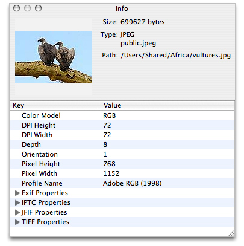

> 导航：[总目录](../../../README.md) · [documentation](../../../_indexes/documentation.md) · [Image I/O Programming Guide](Introduction.md)


[Next](Working%20with%20Image%20Destinations.md)[Previous](Basics%20of%20Using%20Image%20I-O.md)

# Creating and Using Image Sources

An image source abstracts the data-access task and eliminates the need for you to manage data through a raw memory buffer. An image source can contain more than one image, thumbnail images, properties for each image, and the image file. When you are working with image data and your application runs in OS X v10.4 or later, image sources are the preferred way to move image data into your application. After creating a `CGImageSource` object, you can obtain images, thumbnails, image properties, and other image information using the functions described in _[CGImageSource Reference](https://developer.apple.com/documentation/imageio/cgimagesource-r84)_.

One of the most common tasks you’ll perform with the Image I/O framework is to create an image from an image source, similar to what’s shown in Listing 2-1. This example shows how to create an image source from a path name and then extract the image. When you create an image source object, you can provide a hint as to the format of the image source file.

When you create an image from an image source, you must specify an index and you can provide a dictionary of properties (key-value pairs) to specify such things as whether to create a thumbnail or allow caching. _[CGImageSource Reference](https://developer.apple.com/documentation/imageio/cgimagesource-r84)_ and _[CGImageProperties Reference](https://developer.apple.com/documentation/imageio/cgimageproperties)_ list keys and the expected data type of the value for each key.

You need to supply an index value because some image file formats allow multiple images to reside in the same source file. For an image source file that contains only one image, pass `0`. You can find out the number of images in an image source file by calling the function [CGImageSourceGetCount](https://developer.apple.com/documentation/imageio/1465029-cgimagesourcegetcount).

__Listing 2-1__  Creating an image from an image source

```
CGImageRef MyCreateCGImageFromFile (NSString* path)
{
    // Get the URL for the pathname passed to the function.
    NSURL *url = [NSURL fileURLWithPath:path];
    CGImageRef        myImage = NULL;
    CGImageSourceRef  myImageSource;
    CFDictionaryRef   myOptions = NULL;
    CFStringRef       myKeys[2];
    CFTypeRef         myValues[2];

    // Set up options if you want them. The options here are for
    // caching the image in a decoded form and for using floating-point
    // values if the image format supports them.
    myKeys[0] = kCGImageSourceShouldCache;
    myValues[0] = (CFTypeRef)kCFBooleanTrue;
    myKeys[1] = kCGImageSourceShouldAllowFloat;
    myValues[1] = (CFTypeRef)kCFBooleanTrue;
    // Create the dictionary
    myOptions = CFDictionaryCreate(NULL, (const void **) myKeys,
                   (const void **) myValues, 2,
                   &kCFTypeDictionaryKeyCallBacks,
                   & kCFTypeDictionaryValueCallBacks);
    // Create an image source from the URL.
    myImageSource = CGImageSourceCreateWithURL((CFURLRef)url, myOptions);
    CFRelease(myOptions);
    // Make sure the image source exists before continuing
    if (myImageSource == NULL){
        fprintf(stderr, "Image source is NULL.");
        return  NULL;
    }
    // Create an image from the first item in the image source.
    myImage = CGImageSourceCreateImageAtIndex(myImageSource,
                                           0,
                                           NULL);

    CFRelease(myImageSource);
    // Make sure the image exists before continuing
    if (myImage == NULL){
         fprintf(stderr, "Image not created from image source.");
         return NULL;
    }

    return myImage;
}
```


Some image source files contain thumbnail images that you can retrieve. If thumbnails aren’t already present, Image I/O gives you the option of creating them. You can also specify a maximum thumbnail size and whether to apply a transform to the thumbnail image.

Listing 2-2 shows how to create an image source from data, set up a dictionary that contains options related to the thumbnail, and then create a thumbnail image. You use the `kCGImageSourceCreateThumbnailWithTransform` key to specify whether the thumbnail image should be rotated and scaled to match the orientation and pixel aspect ratio of the full image.

__Listing 2-2__  Creating a thumbnail image

```
CGImageRef MyCreateThumbnailImageFromData (NSData * data, int imageSize)
{
    CGImageRef        myThumbnailImage = NULL;
    CGImageSourceRef  myImageSource;
    CFDictionaryRef   myOptions = NULL;
    CFStringRef       myKeys[3];
    CFTypeRef         myValues[3];
    CFNumberRef       thumbnailSize;

   // Create an image source from NSData; no options.
   myImageSource = CGImageSourceCreateWithData((CFDataRef)data,
                                               NULL);
   // Make sure the image source exists before continuing.
   if (myImageSource == NULL){
        fprintf(stderr, "Image source is NULL.");
        return  NULL;
   }

   // Package the integer as a  CFNumber object. Using CFTypes allows you
   // to more easily create the options dictionary later.
   thumbnailSize = CFNumberCreate(NULL, kCFNumberIntType, &imageSize);

   // Set up the thumbnail options.
   myKeys[0] = kCGImageSourceCreateThumbnailWithTransform;
   myValues[0] = (CFTypeRef)kCFBooleanTrue;
   myKeys[1] = kCGImageSourceCreateThumbnailFromImageIfAbsent;
   myValues[1] = (CFTypeRef)kCFBooleanTrue;
   myKeys[2] = kCGImageSourceThumbnailMaxPixelSize;
   myValues[2] = (CFTypeRef)thumbnailSize;

   myOptions = CFDictionaryCreate(NULL, (const void **) myKeys,
                   (const void **) myValues, 2,
                   &kCFTypeDictionaryKeyCallBacks,
                   & kCFTypeDictionaryValueCallBacks);

  // Create the thumbnail image using the specified options.
  myThumbnailImage = CGImageSourceCreateThumbnailAtIndex(myImageSource,
                                          0,
                                          myOptions);
  // Release the options dictionary and the image source
  // when you no longer need them.
  CFRelease(thumbnailSize);
  CFRelease(myOptions);
  CFRelease(myImageSource);

   // Make sure the thumbnail image exists before continuing.
   if (myThumbnailImage == NULL){
         fprintf(stderr, "Thumbnail image not created from image source.");
         return NULL;
   }

   return myThumbnailImage;
}
```


If you have a very large image, or are loading image data over the web, you may want to create an incremental image source so that you can draw the image data as you accumulate it. You need to perform the following tasks to load an image incrementally from a CFData object:

1. Create the CFData object for accumulating the image data.
2. Create an incremental image source by calling the function [CGImageSourceCreateIncremental](https://developer.apple.com/documentation/imageio/1465151-cgimagesourcecreateincremental).
3. Add image data to the CFData object.
4. Call the function [CGImageSourceUpdateData](https://developer.apple.com/documentation/imageio/1465473-cgimagesourceupdatedata), passing the CFData object and a Boolean value (`bool` data type) that specifies whether the data parameter contains the entire image, or just partial image data. In any case, the data parameter must contain all the image file data accumulated up to that point.
5. If you have accumulated enough image data, create an image by calling [CGImageSourceCreateImageAtIndex](https://developer.apple.com/documentation/imageio/1465011-cgimagesourcecreateimageatindex), draw the partial image, and then release it.
6. Check to see if you have all the data for an image by calling the function [CGImageSourceGetStatusAtIndex](https://developer.apple.com/documentation/imageio/1465401-cgimagesourcegetstatusatindex). If the image is complete, this function returns `kCGImageStatusComplete`. If the image is not complete, repeat steps 3 and 4 until it is.
7. Release the incremental image source.

Digital photos are tagged with a wealth of information about the image—image dimensions, resolution, orientation, color profile, aperture, metering mode, focal length, creation date, keywords, caption, and much more. This information is extremely useful for image handling and editing, but only if the data is exposed in the user interface. Although the [CGImageSourceCopyPropertiesAtIndex](https://developer.apple.com/documentation/imageio/1465363-cgimagesourcecopypropertiesatind) function retrieves a dictionary of all the properties associated with an image in an image source, you’ll need to write code that traverses that dictionary to retrieve and then display that information.

In this section you’ll take a close look at a routine from the OS X _[ImageApp](../../../samplecode/ImageApp/ImageApp.md#apple-f4xwc4dqnrsv64tfmyxwi33df52wszbpirkfgmjqgaydgnrygu)_ sample code, which is an image display application that you can download and experiment with. One of the features of the _[ImageApp](../../../samplecode/ImageApp/ImageApp.md#apple-f4xwc4dqnrsv64tfmyxwi33df52wszbpirkfgmjqgaydgnrygu)_ sample code is an image Info window that displays a thumbnail image and image properties for the currently active image, as shown in Figure 2-1.

__Figure 2-1__  An Info window that displays image properties



You can take a look at the `ImageInfoPanel.h` and `ImageInfoPanel.m` files for all the implementation details of this panel; you’ll also need to look at the nib file for the project to see how the window and bindings are set up. To get an idea of how you can use CGImageSource functions to support an image editing application, take a look at Listing 2-3. A detailed explanation for each numbered line of code appears following the listing. (Keep in mind that this routine is not a standalone routine—you can’t simply paste it into your own program. It is an excerpt from the _[ImageApp](../../../samplecode/ImageApp/ImageApp.md#apple-f4xwc4dqnrsv64tfmyxwi33df52wszbpirkfgmjqgaydgnrygu)_ sample code.)

__Listing 2-3__  A routine that creates an image source and retrieves properties

```objc

- (void) setURL:(NSURL*)url
{
    if ([url isEqual:mUrl])
        return;

    mUrl = url;

    CGImageSourceRef source = CGImageSourceCreateWithURL((CFURLRef)url, NULL); // 1
    if (source)
    {
        NSDictionary* props =
           (NSDictionary*) CGImageSourceCopyPropertiesAtIndex(source, 0, NULL); // 2
        [mTree setContent:[self propTree:props]]; // 3
        NSDictionary* thumbOpts = [NSDictionary dictionaryWithObjectsAndKeys:
            (id)kCFBooleanTrue, (id)kCGImageSourceCreateThumbnailWithTransform,
            (id)kCFBooleanTrue, (id)kCGImageSourceCreateThumbnailFromImageIfAbsent,
            [NSNumber numberWithInt:128], (id)kCGImageSourceThumbnailMaxPixelSize,
            nil]; // 4
        CGImageRef image = CGImageSourceCreateThumbnailAtIndex(source, 0,
                                      (CFDictionaryRef)thumbOpts); // 5
        [mThumbView setImage:image]; // 6
        CGImageRelease(image); // 7
        [mFilePath setStringValue:[mUrl path]]; // 8

        NSString* uti = (NSString*)CGImageSourceGetType(source); // 9
        [mFileType setStringValue:[NSString stringWithFormat:@"%@\n%@",
                        ImageIOLocalizedString(uti), uti]]; // 10

        CFDictionaryRef fileProps = CGImageSourceCopyProperties(source, nil); // 11
        [mFileSize setStringValue:[NSString stringWithFormat:@"%@ bytes",
            (id)CFDictionaryGetValue(fileProps, kCGImagePropertyFileSize)]]; // 12
    }
    else  // 13
    {
        [mTree setContent:nil];
        [mThumbView setImage:nil];
        [mFilePath setStringValue:@""];
        [mFileType setStringValue:@""];
        [mFileSize setStringValue:@""];
    }
}
```

Here’s what the code does:

1. Creates an image source object from the URL passed to the routine.
2. Copies the properties for the image located at index location `0`. Some image file formats can support more than one image, but this example assumes a single image (or that the image of interest is always the first one in the file). The [CGImageSourceCopyPropertiesAtIndex](https://developer.apple.com/documentation/imageio/1465363-cgimagesourcecopypropertiesatind) function returns a CFDictionary object. Here, the code casts the CFDictionary as an `NSDictionary` object, as these data types are interchangeable (sometimes referred to as toll-free bridged).

   The dictionary that’s returned contains properties that are key-value pairs. However, some of the values are themselves dictionaries that contain properties. Take a look at [Figure 2-1](#apple-f4xwc4dqnrsv64tfmyxwi33df52wszbpkridimbqga2tinrsfvbuqmrrhawvgvzr) and you’ll see not only simple key-value pairs (such as Color Model-RGB) but you’ll also see Exif properties, IPTC Properties, JFIF Properties, and TIFF Properties, each of which is a dictionary. Clicking a disclosure triangle for one of these displays the properties in that dictionary. You’ll need to get these dictionaries and their properties so they can be displayed appropriately in the Info panel. That’s what the next step accomplishes.
3. Extracts properties from the dictionary and sets them to a tree controller. If you look at the `ImageInfoPanel.h` file, you’ll see that the `mTree` variable is an `NSTreeController` object that is an outlet in Interface Builder. This controller manages a tree of objects. In this case, the objects are properties of the image.

   The `propTree:` method is provided in the `ImageInfoPanel.m` file. It’s purpose is to traverse the property dictionary retrieved in the previous step, extract the image properties, and build the array that’s bound to the `NSTreeController` object.

   The properties appears in a table of keys and values in [Figure 2-1](#apple-f4xwc4dqnrsv64tfmyxwi33df52wszbpkridimbqga2tinrsfvbuqmrrhawvgvzr).
4. Sets up a dictionary of options to use when creating an image from the image source. Recall that options are passed in a dictionary. The Info panel shown in [Figure 2-1](#apple-f4xwc4dqnrsv64tfmyxwi33df52wszbpkridimbqga2tinrsfvbuqmrrhawvgvzr) displays a thumbnail image. The code here sets up options that create a thumbnail that is rotated and scaled to the same orientation and aspect ratio of the full image. If a thumbnail does not already exist, one is created, and its maximum pixel size is 128 by 128 pixels.
5. Creates a thumbnail image from the first image in the image source, using the options set up in the previous step.
6. Sets the thumbnail image to the view in the Info panel.
7. Releases the image; it is no longer needed.
8. Extracts the path from the URL passed to the method, and sets the string to the text field that’s bound to the Info panel. This is the Path text field in [Figure 2-1](#apple-f4xwc4dqnrsv64tfmyxwi33df52wszbpkridimbqga2tinrsfvbuqmrrhawvgvzr).
9. Gets the uniform type identifier of the image source. (This can be different from the type of the images in the source.)
10. Calls a function to retrieve the localized string for the UTI (`ImageIOLocalizedString` is declared in `ImagePanel.m`) and then sets the string to the text field that’s bound to the Info panel. This is the Type text field in [Figure 2-1](#apple-f4xwc4dqnrsv64tfmyxwi33df52wszbpkridimbqga2tinrsfvbuqmrrhawvgvzr).
11. Retrieves a dictionary of the properties associated with the image source. These properties apply to the container (such as the file size), not necessarily the individual images in the image source.
12. Retrieves the file size value from the image source dictionary obtained in the previous step, then sets the associated string to the text field that’s bound to the Info panel. This is the Size text field shown in [Figure 2-1](#apple-f4xwc4dqnrsv64tfmyxwi33df52wszbpkridimbqga2tinrsfvbuqmrrhawvgvzr).
13. If the source is not created, makes sure that all the fields in the user interface reflect that fact.

[Next](Working%20with%20Image%20Destinations.md)[Previous](Basics%20of%20Using%20Image%20I-O.md)

