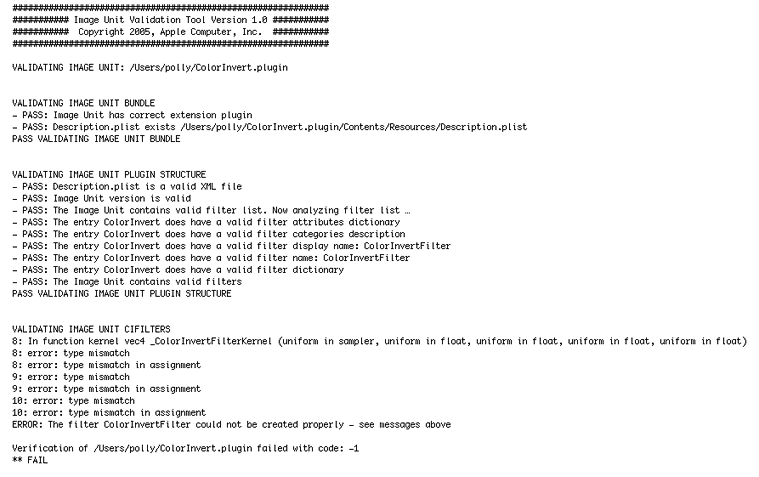

> 导航：[总目录](../../../README.md) · [documentation](../../../_indexes/documentation.md) · [Image Unit Tutorial](Introduction.md)


[Next](Document%20Revision%20History.md)[Previous](Writing%20the%20Objective-C%20Portion.md)

# Preparing an Image Unit for Distribution

Preparation involves three tasks, described in the following sections:

- [Validating an Image Unit](#apple-f4xwc4dqnrsv64tfmyxwi33df52wszbpkridimbqga2dkmzrfvbuqnjnknltg)
- [Testing an Image Unit](#apple-f4xwc4dqnrsv64tfmyxwi33df52wszbpkridimbqga2dkmzrfvbuqnjnknltk)
- [Completing the Necessary Licensing and Trademark Agreements](#apple-f4xwc4dqnrsv64tfmyxwi33df52wszbpkridimbqga2dkmzrfvbuqnjnknlte).

You can validate your image unit with the ImageUnitAnalyzer tool by following these steps:

1. After you install the latest developer tools, you can find the ImageUnitAnalyzer tool in`/Developer/usr/bin`.

   You can also download the tool from [Software Licensing & Trademark Agreements](https://developer.apple.com/softwarelicensing/agreements/imageunits.html).
2. Open Terminal and drag the ImageUnitAnalyzer into the Terminal window. Then drag the image unit you want to validate into the Terminal window and press Return.

If your image unit is correctly packaged and the Objective-C code and `kernel` routine are well formed, ImageUnitAnalyzer provides output similar to what’s shown in Listing 4-1. If your imagine unit has problems, you’ll see failure statements that, in most cases, describe what elements failed. See [Figure 4-1](#apple-f4xwc4dqnrsv64tfmyxwi33df52wszbpkridimbqga2dkmzrfvbuqnjnknlto).

__Listing 4-1__  Output produced by ImageUnitAnalyzer for a passing unit

```
##############################################################
########### Image Unit Validation Tool Version 1.0 ###########
###########  Copyright 2005, Apple Computer, Inc.  ###########
##############################################################

VALIDATING IMAGE UNIT: /Users/polly/Development/InvertColorImageUnit.plugin

VALIDATING IMAGE UNIT BUNDLE
- PASS: Image Unit has correct extension plugin
- PASS: Description.plist exists /Users/polly/Development/InvertColorImageUnit.plugin/Contents/Resources/Description.plist
PASS VALIDATING IMAGE UNIT BUNDLE

VALIDATING IMAGE UNIT PLUGIN STRUCTURE
- PASS: Description.plist is a valid XML file
- PASS: Image Unit version is valid
- PASS: The Image Unit contains valid filter list. Now analyzing filter list…
- PASS: The entry InvertColorFilter does have a valid filter attributes dictionary
- PASS: The entry InvertColorFilter does have a valid filter categories description
- PASS: The entry InvertColorFilter does have a valid filter display name: InvertColorFilter
- PASS: The entry InvertColorFilter does have a valid filter name: InvertColorFilter
- PASS: The entry InvertColorFilter does have a valid filter dictionary
- PASS: The Image Unit contains valid filters
PASS VALIDATING IMAGE UNIT PLUGIN STRUCTURE

VALIDATING IMAGE UNIT CIFILTERS
- PASS: The filter InvertColorFilter was created successfully
Testing filter invertColor
PASS VALIDATING IMAGE UNIT CIFILTERS

Verification of /Users/polly/Development/InvertColorImageUnit.plugin succeeded
** PASS
```

If your image unit fails with a `–1` error but all the validation statements are marked `“PASS”`, make sure that you passed only objects from the Objective-C portion of the image unit. See [Kernel Routine Rules](An%20Image%20Unit%20and%20Its%20Parts.md#apple-f4xwc4dqnrsv64tfmyxwi33df52wszbpkridimbqga2dkmzrfvbuqnrnknlti).

__Figure 4-1__  Output produced by ImageUnitAnalyzer for a failing unit



After your image unit passes validation, you’ll want to make sure that it works properly by following these steps:

1. Copy the image unit to `/Library/Graphics/Image Units`.

   You can also install an image unit in a `User/Library/Graphics/Image Units/`, but you may need to create the `Graphic/Image Units` folder.
2. Launch the Quartz Composer development tool.
3. Open the Patch Creator and type the image unit name into the Search field.
4. When you locate the image unit, drag it to the workspace.
5. Create a simple Quartz Composer composition that uses the image, as described in [Writing Simple Kernel Routines](Writing%20Kernels.md#apple-f4xwc4dqnrsv64tfmyxwi33df52wszbpkridimbqga2dkmzrfvbuqmznknltk).

   Try the filter on a variety of images and with a variety of input value and make sure that it works.

Before you can distribute your image unit or use the Image Units logo provided by Apple, you’ll need to complete the licensing and trademark agreements and any other tasks described on the [Software Licensing & Trademark Agreements](https://developer.apple.com/softwarelicensing/agreements/imageunits.html) website. See:

[http://developer.apple.com/softwarelicensing/agreements/imageunits.html](https://developer.apple.com/softwarelicensing/agreements/imageunits.html)

The Image Units logo (see Figure 4-2) is available through a licensing agreement.

__Figure 4-2__  The Image Units logo


In addition to _[Core Image Kernel Language Reference](../Core%20Image%20Kernel%20Language%20Reference/Introduction.md#apple-f4xwc4dqnrsv64tfmyxwi33df52wszbpkridimbqga2dgojx)_, you might find these resources useful as you design and write your own image units:

- _Algorithms for Image Processing and Computer Vision_, J. R. Parker, 1997. John Wiley & Sons.
- _OpenGL Shading Language_, Second Edition, Randi J. Rost, 2006. Addison-Wesley Professional.
- _OpenGL Shading Language_, available for download from [http://www.opengl.org/documentation/glsl/](http://www.opengl.org/documentation/glsl/).
- _Digital Image Processing_, Second Edition, Rafael C. Gonzalez and Richard E. Woods. Addison-Wesley Publishers.
- _Digital Image Processing_, Kenneth R. Castleman, Prentice Hall.
- _The Renderman Companion: A Programmer’s Guide to Realistic Computer Graphics_, Steve Upstill, Addison-Wesley Professional.
- _GPU Gems: Programming Techniques, Tips, and Tricks for Real-Time Graphics_, Randima Fernando, Addison-Wesley Professional. There are a number of other books in the GPU Gems series that you might also find useful.

[Next](Document%20Revision%20History.md)[Previous](Writing%20the%20Objective-C%20Portion.md)

