> 导航：[总目录](../../../README.md) · [documentation](../../../_indexes/documentation.md) · [Image Unit Tutorial](Introduction.md)


[Next](Writing%20the%20Objective-C%20Portion.md)[Previous](An%20Image%20Unit%20and%20Its%20Parts.md)

# Writing Kernels

The heart of any image processing filter is the kernel file. A kernel file contains one or more `kernel` routines and any required subroutines. A `kernel` routine gets called once for each pixel for the destination image. The routine must return a `vec4` data type. Although this four-element vector typically contains pixel data, the vector is not required to represent a pixel. However, the `kernel` routines in this chapter produce only pixel data because that’s the most common data returned by a `kernel` routine.

A `kernel` routine can:

- Fabricate the data. For example, a routine can produce random pixel values, generate a solid color, or produce a gradient. It can generate patterns, such as stripes, a checkerboard, a starburst, or color bars.
- Modify a single pixel from a source image. A `kernel` routine can adjust hue, exposure, white point values, replace colors, and so on.
- Sample several pixels from a source image to produce the output pixel. Stylize filters such as edge detection, pixellate, pointillize, gloom, and bloom use this technique.
- Use location information from one or more pixels in a source image to produce the output pixel. Distortion effects, such as bump, pinch, and hole distortions are created this way.
- Produce the output pixel by using data from a mask, texture, or other source to modify one or more pixels in a source image. The Core Image stylize filters—height field from mask, shaded material, and the disintegrate with mask transition—are examples of filters that use this technique.
- Combine the pixels from two images to produce the output pixel. Blend mode, compositing, and transition filters work this way.

This chapter shows how to write a variety of `kernel` routines. First you’ll see what the programming constraints, or rules, are. Then you’ll learn how to write a simple filter that operates on one input pixel to produce one output pixel. As the chapter progresses, you’ll learn how to write more complex `kernel` routines, including those used for a multipass filter.

Although the `kernel` routine is where the per-pixel processing occurs, it is only one part of an image unit. You also need to write code that provides input data to the `kernel` routine and performs a number of other tasks as described in [Writing the Objective-C Portion](Writing%20the%20Objective-C%20Portion.md#apple-f4xwc4dqnrsv64tfmyxwi33df52wszbpkridimbqga2dkmzrfvbuqnbnknltc). Then you’ll need to bundle all the code by following the instructions in [Preparing an Image Unit for Distribution](Preparing%20an%20Image%20Unit%20for%20Distribution.md#apple-f4xwc4dqnrsv64tfmyxwi33df52wszbpkridimbqga2dkmzrfvbuqnjnknltc).

Before continuing in this chapter, see _[Core Image Kernel Language Reference](../Core%20Image%20Kernel%20Language%20Reference/Introduction.md#apple-f4xwc4dqnrsv64tfmyxwi33df52wszbpkridimbqga2dgojx)_ for a description of the language you use to write `kernel` routines. Make sure you are familiar with the constraints discussed in [Kernel Routine Rules](An%20Image%20Unit%20and%20Its%20Parts.md#apple-f4xwc4dqnrsv64tfmyxwi33df52wszbpkridimbqga2dkmzrfvbuqnrnknlti).

A `kernel` routine that operates on the color of a source pixel at location (_x_, _y_) to produce a pixel at the same location in the destination image is fairly straightforward to write. In general, a `kernel` routine that operates on color follows these steps:

1. Gets the pixel from the source image that is at the same location as the pixel you want to produce in the output image. The Core Image Kernel Language function `sample` returns the pixel value produced by the specified `sampler` at a specified point. To get the specified point, use the function `samplerCoord`, which returns the position, in sampler space, that is associated with the current output pixel after any transformation matrix associated with the sampler is applied. That means if the image is transformed in some way (for example, rotation or scaling), the `sampler` ensures that the transformation is reflected in the sample it fetches.
2. Operates on the color values.
3. Returns the modified pixel.

Equations for this sort of filter take the following form:

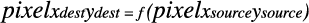

Depending on the operation, you may need to unpremultiply the color values prior to operating on them and the premultiply the color values before returning the modified pixel. The Core Image Kernel Language provides the `unpremultiply` and `premultiply` functions for this purpose.

Color component values for pixels in Core Image are floating-point values that range from `0.0` (color component absent) to `1.0` (color component present at 100%). Inverting a color is accomplished by reassigning each color component of value of `1.0 – component_value`, such that:

```
red_value = 1.0 - red_value
blue_value = 1.0 - blue_value
green_value = 1.0 - green_value
```

[Figure 2-1](#apple-f4xwc4dqnrsv64tfmyxwi33df52wszbpkridimbqga2dkmzrfvbuqmznknltgmi) shows a grid of pixels. If you invert the color of each pixel by applying these equations, you get the resulting grid of pixels shown in [Figure 2-2](#apple-f4xwc4dqnrsv64tfmyxwi33df52wszbpkridimbqga2dkmzrfvbuqmznknltgmq).

__Figure 2-1__  A grid of pixels

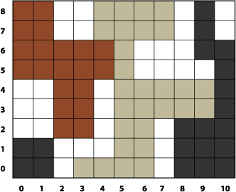

__Figure 2-2__  A grid of pixels after inverting the color

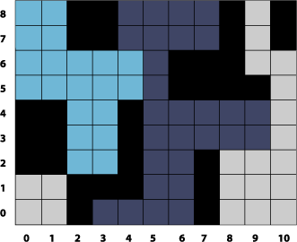

Take a look at the `kernel` routine in Listing 2-1 to see how to implement color inversion. A detailed explanation for each numbered line of code appears following the listing. You’ll see how to write the Objective-C portion that packages this routine as an image unit by reading [Creating a Color Inversion Image Unit](Writing%20the%20Objective-C%20Portion.md#apple-f4xwc4dqnrsv64tfmyxwi33df52wszbpkridimbqga2dkmzrfvbuqnbnknlto).

__Listing 2-1__  A `kernel` routine that inverts color

```
kernel vec4 _invertColor(sampler source_image) // 1
{
    vec4 pixValue; // 2
    pixValue = sample(source_image, samplerCoord(source_image)); // 3
    unpremultiply(pixValue); // 4
    pixValue.r = 1.0 - pixValue.r; // 5
    pixValue.g = 1.0 - pixValue.g;
    pixValue.b = 1.0 - pixValue.b;
    return premultiply(pixValue); // 6
}
```

Here’s what the code does:

1. Takes a `sampler` object as an input parameter. Recall (see [Kernel Routine Rules](An%20Image%20Unit%20and%20Its%20Parts.md#apple-f4xwc4dqnrsv64tfmyxwi33df52wszbpkridimbqga2dkmzrfvbuqnrnknlti)) that `kernel` routines do not take images as input parameters. Instead, the `sampler` object is in charge of accessing image data and providing it to the `kernel` routine.

   A routine that modifies a single pixel value will always have a `sampler` object as an input parameter. The `sampler` object for this category of `kernel` routine is passed in from a `CISampler` object created in the Objective-C portion of an image unit. (See [Division of Labor](An%20Image%20Unit%20and%20Its%20Parts.md#apple-f4xwc4dqnrsv64tfmyxwi33df52wszbpkridimbqga2dkmzrfvbuqnrnknltg).) The `sampler` object simply retrieves pixel values from the a source image. You can think of the `sampler` object as a data source.
2. Declares a `vec4` data type to hold the red, green, blue, and alpha component values of a pixel. A four-element vector provides a convenient way to store pixel data.
3. Fetches a pixel value from the source image. Let’s take a closer look at this statement, particularly the `sample` and `samplerCoord` functions provided by the Core Image Kernel Language. The `samplerCoord` function returns the position, in sampler space, associated with the current destination pixel after any transformations associated with the image source or the sampler are applied to the image data. As the `kernel` routine has no way of knowing whether any transformations have been applied, it’s best to use the `samplerCoord` function to retrieve the the position. When you read [Writing the Objective-C Portion](Writing%20the%20Objective-C%20Portion.md#apple-f4xwc4dqnrsv64tfmyxwi33df52wszbpkridimbqga2dkmzrfvbuqnbnknltc) you’ll see that it is possible, and often necessary, to apply transformations in the Objective-C portion of an image unit.

   The `sample` function returns the pixel value obtained by the `sampler` object from the specified position. This function assumes the position is in sampler space, which is why you need to nest the call to `samplerCoord` to retrieve the position.
4. Unpremultiplies the pixel data. If your routine operates on color data that could have an alpha value other then `1.0` (fully opaque), you need to call the Core Image Kernel Language function `unpremultiply` (or take similar steps—see the advanced tip below) prior to operating on the color values
5. Inverts the red color component. The next two lines invert the green and blue color components. Note that you can access the individual components of a pixel by using `.r`, `.g`, `.b`, and `.a` instead of a numerical index. That way, you never need to concern yourself with the order of the components. (You can also use `.x`, `.y`, `.z`, and `.w` as field accessors.)
6. Premultiplies the data and returns a `vec4` data type that contains inverted values for the color components of the destination pixel. The function `premultiply` is defined by the Core Image Kernel Language.

When you apply a color inversion `kernel` routine to the image shown in Figure 2-3 you get the result shown in [Figure 2-4](#apple-f4xwc4dqnrsv64tfmyxwi33df52wszbpkridimbqga2dkmzrfvbuqmznknlteny).

__Figure 2-3__  An image of a gazelle


__Figure 2-4__  A gazelle image after inverting the colors

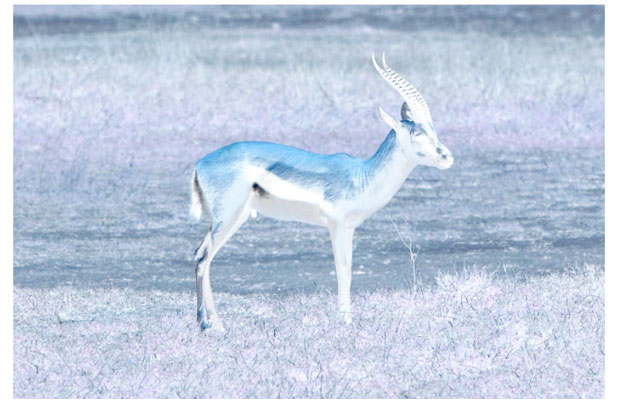

[Listing 2-2](#apple-f4xwc4dqnrsv64tfmyxwi33df52wszbpkridimbqga2dkmzrfvbuqmznknltg) shows another simple `kernel` routine that modifies the color values of a pixel by rearranging the color component values. The red channel is assigned the green values. The green channel is assigned the blue values. The blue channel is assigned the red values. Applying this filter to the image shown in Figure 2-5 results in the image shown in [Figure 2-6](#apple-f4xwc4dqnrsv64tfmyxwi33df52wszbpkridimbqga2dkmzrfvbuqmznknlto).

__Figure 2-5__  An image of a ladybug


__Figure 2-6__  A ladybug image after rearranging pixel components


As you can see, the routine in [Listing 2-2](#apple-f4xwc4dqnrsv64tfmyxwi33df52wszbpkridimbqga2dkmzrfvbuqmznknltg) is very similar to [Listing 2-1](#apple-f4xwc4dqnrsv64tfmyxwi33df52wszbpkridimbqga2dkmzrfvbuqmznknlte). This `kernel` routine, however, uses two vectors, one for the pixel provided from the source image and the other to hold the modified values. The alpha value remains unchanged, but the red, green, and blue values are shifted.

__Listing 2-2__  A `kernel` routine that places RGB values in the GBR channels

```
kernel vec4 RGB_to_GBR(sampler source_image)
{
    vec4 originalColor, twistedColor;

    originalColor = sample(source_image, samplerCoord(source_image));
    twistedColor.r = originalColor.g;
    twistedColor.g = originalColor.b;
    twistedColor.b = originalColor.r ;
    twistedColor.a = originalColor.a;
    return twistedColor;
}
```


Color multiplication is true to its name; it multiplies each pixel in a source image by a specified color. Figure 2-7 shows the effect of applying a color multiply filter to the image shown in [Figure 2-5](#apple-f4xwc4dqnrsv64tfmyxwi33df52wszbpkridimbqga2dkmzrfvbuqmznknltm).

__Figure 2-7__  A ladybug image after applying a multiply filter


[Listing 2-3](#apple-f4xwc4dqnrsv64tfmyxwi33df52wszbpkridimbqga2dkmzrfvbuqmznknlti) shows the `kernel` routine used to produce this effect. So that you don’t get the idea that a kernel can take only one input parameter, note that this routine takes two input parameters—one a `sampler` object and the other a `__color` data type. The `__color` data type is one of two data types defined by the Core Image kernel language; the other data type is `sampler`, which you already know about. These two data types are not the only ones that you can use input parameters to a `kernel` routine. You can also use these data types which are defined by the Open GL Shading Language (glslang)—`float`, `vec2`, `vec3`, `vec4`.

The color supplied to a `kernel` routine will be matched by Core Image to the working color space of the Core Image context associated with the kernel. There is nothing that you need to do regarding color in the kernel. Just keep in mind that, to the `kernel` routine, `__color` is a `vec4` data type in premultiplied RGBA format, just as the pixel values fetched by the `sampler` are.

Listing 2-3 points out an important aspect of kernel calculations—the use of vector math. The sample fetched by the Core Image Kernel Language function `sample` is a four-element vector. Because it is a vector, you can multiply it directly by `multiplyColor`; there is no need to access each component separately.

By now you should be used to seeing the `samplerCoord` function nested with the `sample` function!

__Listing 2-3__  A kernel routine that produces a multiply effect

```
kernel vec4 multiplyEffect (sampler image_source, __color multiplyColor)
{
  return sample (image_source, samplerCoord (image_source)) * multiplyColor;
}
```


Now that you’ve seen how to write `kernel` routines that operate on a single pixel, it’s time to challenge yourself. Write a `kernel` routine that produces a monochrome image similar to what’s shown in Figure 2-8. The filter should take two input parameters, a `sampler` and a `__color`. Use Quartz Composer to test and debug your routine. You can find a solution in [Solution to the Kernel Challenge](#apple-f4xwc4dqnrsv64tfmyxwi33df52wszbpkridimbqga2dkmzrfvbuqmznknltgmy).

__Figure 2-8__  A monochrome image of a ladybug

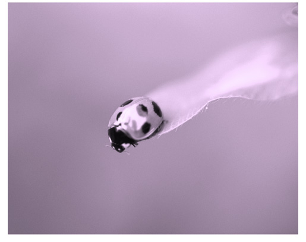

The `kernel` routine, as you know, is one part of a Core Image filter. There is still a good deal of code that you need to write at a level higher than the `kernel` routine and a bit more work beyond that to package your image processing code as an image unit. Fortunately, you don’t need to write this additional code to test simple `kernel` routines. You can instead use Quartz Composer.

Quartz Composer is a development tool for processing and rendering graphical data. It’s available on any computer that has the Developer tools installed. You can find it in `/Developer/Applications`. The following steps will show you how to use Quartz Composer to test each of the `kernel` routines you’ve read about so far.

1. Launch Quartz Composer by double-clicking its icon in `/Developer/Applications`.
2. In the sheet that appears, choose Blank Composition.
3. Open the Patch Creator and search for Core Image Filter.
4. Add the Core Image Filter patch to the workspace.
5. Use the search field to locate the Billboard patch, then add that patch to the workspace.
6. In a similar manner, locate the Image Importer patch and add it to the workspace.
7. Connect the Image output port on the Image Importer patch to the Image input port on the Core Image Filter patch.
8. Connect the Image output port on the Core Image Filter patch to the Image input port on the Billboard.
9. Click the Image Importer patch and then click the Inspector button on the toolbar.
10. Choose Settings from the inspector pop-up menu. Then click Import From File and choose an image.
11. Click Viewer in the toolbar to make sure that the Viewer window is visible.

    You should see the image that you imported rendered to the Viewer window.
12. Click the Core Image Filter patch and open the inspector to the Settings pane.

    Note that there is already a `kernel` routine entered for a multiply effect. If you want to see how that works, choose Input Parameters from the inspector pop-up menu and then click the color well to set a color. You immediately see the results in the Viewer window.

    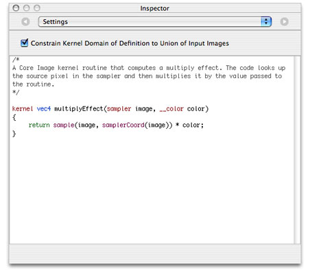
13. Copy the `kernel` routine shown in [Listing 2-1](#apple-f4xwc4dqnrsv64tfmyxwi33df52wszbpkridimbqga2dkmzrfvbuqmznknlte) and replace the multiply effect routine that’s in the Settings pane of the Core Image Kernel patch.

    Notice that not only does the image on the Viewer window change (its color should be inverted), but the Core Image Kernel patch automatically changes to match the input parameters of the kernel routine. The invert color kernel has only one input parameter, whereas the multiply effect supplied as a default had two parameters.
14. Follow the same procedure to test the `kernel` routine shown in [Listing 2-2](#apple-f4xwc4dqnrsv64tfmyxwi33df52wszbpkridimbqga2dkmzrfvbuqmznknltg).

Up to now you’ve seen how to write several simple `kernel` routines that operate on a pixel from a source image to produce a pixel in a destination image that’s at the same working-space coordinate as the pixel from the source image. Some of the most interesting and useful filters, however, do not use this one-to-one mapping. These more advanced `kernel` routines are what you’ll learn about in this section.

Recall from [An Image Unit and Its Parts](An%20Image%20Unit%20and%20Its%20Parts.md#apple-f4xwc4dqnrsv64tfmyxwi33df52wszbpkridimbqga2dkmzrfvbuqnrnknltc) that `kernel` routines that do not use a one-to-one mapping require a region-of-interest method that defines the area from which a `sampler` object can fetch pixels. The `kernel` routine knows nothing about this method. The routine simply takes the data that is passed to it, operates on it, and computes the `vec4` data type that the `kernel` routine returns. As a result, this section doesn’t show you how to set up the ROI method. You’ll see how to accomplish that task in [Writing the Objective-C Portion](Writing%20the%20Objective-C%20Portion.md#apple-f4xwc4dqnrsv64tfmyxwi33df52wszbpkridimbqga2dkmzrfvbuqnbnknltc). For now, assume that each `sampler` passed to a `kernel` routine supplies data from the appropriate region of interest.

An example of an image produced by an advanced `kernel` routine is shown in Figure 2-9. The figure shows a grid of pixels produced by a “color block” `kernel` routine. You’ll notice that the blocks of color are 4 pixels wide and 4 pixels high. The pixels marked with “S” denote the location of the pixel in a source image from which the 4 by 4 block inherits its color. As you can see, the `kernel` routine must perform a one-to-many mapping. This is just the sort of operation that the the pixellate `kernel` routine discussed in detail in [Pixellate](#apple-f4xwc4dqnrsv64tfmyxwi33df52wszbpkridimbqga2dkmzrfvbuqmznknltcni) performs.

__Figure 2-9__  Colored blocks of pixels

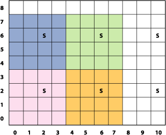

You’ll see how to write two other advanced kernel routines in [Edge Enhancement](#apple-f4xwc4dqnrsv64tfmyxwi33df52wszbpkridimbqga2dkmzrfvbuqmznknltena) and [Fun House Mirror Distortion](#apple-f4xwc4dqnrsv64tfmyxwi33df52wszbpkridimbqga2dkmzrfvbuqmznknltgna).

A pixellate filter uses a limited number of pixels from a source image to produce the destination image, as described in previously. Compare [Figure 2-3](#apple-f4xwc4dqnrsv64tfmyxwi33df52wszbpkridimbqga2dkmzrfvbuqmznknltcmy) with [Figure 2-10](#apple-f4xwc4dqnrsv64tfmyxwi33df52wszbpkridimbqga2dkmzrfvbuqmznknltenq). Notice that the processed image looks blocky; it is made up of dots of a solid color. The size of the dots are determined by a scaling factor that’s passed to the `kernel` routine as an input parameter.

__Figure 2-10__  A gazelle image after pixellation


The trick to any pixellate routine is to use a modulus operator on the coordinates to divide the coordinates into discrete steps. This causes your code to read the same source pixel until your output coordinate has incremented beyond the threshold of the scale, producing an effect similar to that shown in [Figure 2-10](#apple-f4xwc4dqnrsv64tfmyxwi33df52wszbpkridimbqga2dkmzrfvbuqmznknltenq). The code shown in [Listing 2-4](#apple-f4xwc4dqnrsv64tfmyxwi33df52wszbpkridimbqga2dkmzrfvbuqmznknlteoa) creates round dots instead of squares by creating an anti-aliased edge that produces the dot effect shown in Figure 2-11. Notice that each 4-by-4 block represents a single color, but the alpha component varies from 0.0 to 1.0. Anti-aliasing effects are used in a number of filters, so it is worthwhile to study the code, shown in [Listing 2-4](#apple-f4xwc4dqnrsv64tfmyxwi33df52wszbpkridimbqga2dkmzrfvbuqmznknlteoa), that accomplishes this.

__Figure 2-11__  Colored blocks of pixels with opacity added

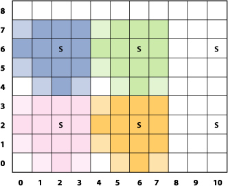

The pixellate `kernel` routine takes two input parameters: a `sampler` object for fetching samples from the source image and a floating-point value that specifies the diameter of the dots. A detailed explanation for each numbered line of code appears following the listing.

__Listing 2-4__  A `kernel` routine that pixellates

```
kernel vec4 roundPixellate(sampler src, float scale)// 1
{
    vec2    positionOfDestPixel, centerPoint; // 2
    float   d, radius;
    vec4    outValue;
    float   smooth = 0.5;

    radius = scale / 2.0;
    positionOfDestPixel = destCoord();// 3
    centerPoint = positionOfDestPixel;
    centerPoint.x = centerPoint.x - mod(positionOfDestPixel.x, scale) + radius; // 4
    centerPoint.y = centerPoint.y - mod(positionOfDestPixel.y, scale) + radius; // 5
    d = distance(centerPoint, positionOfDestPixel); // 6

    outValue = sample(src, samplerTransform(src, centerPoint)); // 7
    outValue.a = outValue.a * smoothstep((d - smooth), d, radius); // 8

    return premultiply(outValue);  // 9

}
```

Here’s what the code does:

1. Takes a `sampler` and a scaling value. Note the scaling value is declared as a `float` data type here, but when you write the Objective-C portion of the filter, you must pass the `float` as an `NSNumber` object. Otherwise, the filter will not work. See [Kernel Routine Rules](An%20Image%20Unit%20and%20Its%20Parts.md#apple-f4xwc4dqnrsv64tfmyxwi33df52wszbpkridimbqga2dkmzrfvbuqnrnknlti).
2. Declares two `vec2` data types. The `centerPoint` variable holds the coordinate of the pixel that determines the color of a block; it is the “S” shown in [Figure 2-11](#apple-f4xwc4dqnrsv64tfmyxwi33df52wszbpkridimbqga2dkmzrfvbuqmznknlteoi). The `positionOfDestPixel` variable holds the position of the destination pixel.
3. Gets the position, in working-space coordinates, of the pixel currently being computed. The function `destCoord` is defined by the Core Image Kernel Language. (See _[Core Image Kernel Language Reference](../Core%20Image%20Kernel%20Language%20Reference/Introduction.md#apple-f4xwc4dqnrsv64tfmyxwi33df52wszbpkridimbqga2dgojx)_.)
4. Calculates the x-coordinate for the pixel that determines the color of the destination pixel.
5. Calculates the y-coordinate for the pixel that determines the color of the destination pixel.
6. Calculates how far the destination pixel is from the center point (“S”). This distance determines the value of the alpha component.
7. Fetches a pixel value from the source image, at the location specified by the `centerPoint` vector.

   Recall that the `sample` function returns the pixel value produced by the `sampler` at the specified position. This function assumes the position is in sampler space, which is why you need to nest the call to `samplerCoord` to retrieve the position.
8. Creates an anti-aliased edge by multiplying the alpha component of the destination pixel by the `smoothstep` function defined by glslang. (See the [OpenGL Shading Language specification](http://www.opengl.org/documentation/glsl/).)
9. Premultiplies the result before returning the value.

You’ll see how to write the Objective-C portion that packages this routine as an image unit by reading [Creating a Pixellate Image Unit](Writing%20the%20Objective-C%20Portion.md#apple-f4xwc4dqnrsv64tfmyxwi33df52wszbpkridimbqga2dkmzrfvbuqnbnknltg).

The edge enhancement `kernel` routine discussed in this section performs two tasks. It detects the edges in an image using a Sobel template. It also enhances the edges. Although the `kernel` routine operates on all color components, you can get an idea of what is does by comparing [Figure 2-12](#apple-f4xwc4dqnrsv64tfmyxwi33df52wszbpkridimbqga2dkmzrfvbuqmznknltcma) with [Figure 2-13](#apple-f4xwc4dqnrsv64tfmyxwi33df52wszbpkridimbqga2dkmzrfvbuqmznknltcmi).

__Figure 2-12__  A checkerboard pattern before edge enhancement

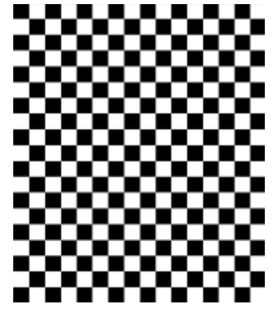

__Figure 2-13__  A checkerboard pattern after edge enhancement

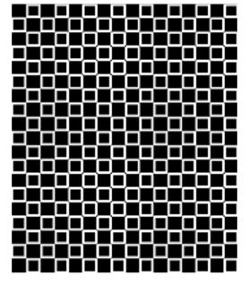

The `_EdgyFilter` kernel is shown in Listing 2-5. It takes two parameters, a `sampler` for fetching image data from a source image and a `power` parameter that’s used to brighten or darken the image. A detailed explanation for each numbered line of code appears following the listing.

__Listing 2-5__  A `kernel` routine that enhances edges

```
kernel vec4 _EdgyFilter(sampler image, float power) // 1
{
    const vec2 xy = destCoord(); // 2
    vec4  p00,p01,p02, p10,p12, p20,p21,p22; // 3
    vec4  sumX, sumY, computedPixel;  // 4
    float edgeValue;

    p00 = sample(image, samplerTransform(image, xy+vec2(-1.0, -1.0))); // 5
    p01 = sample(image, samplerTransform(image, xy+vec2( 0.0, -1.0)));
    p02 = sample(image, samplerTransform(image, xy+vec2(+1.0, -1.0)));
    p10 = sample(image, samplerTransform(image, xy+vec2(-1.0,  0.0)));
    p12 = sample(image, samplerTransform(image, xy+vec2(+1.0,  0.0)));
    p20 = sample(image, samplerTransform(image, xy+vec2(-1.0, +1.0)));
    p21 = sample(image, samplerTransform(image, xy+vec2( 0.0, +1.0)));
    p22 = sample(image, samplerTransform(image, xy+vec2(+1.0, +1.0)));

    sumX = (p22+p02-p20-p00) + 2.0*(p12-p10); // 6
    sumY = (p20+p22-p00-p02) + 2.0*(p21-p01); // 7

    edgeValue = sqrt(dot(sumX,sumX) + dot(sumY,sumY)) * power; // 8

    computedPixel = sample(image, samplerCoord(image)); // 9
    computedPixel.rgb = computedPixel.rgb * edgeValue; // 10
    return computedPixel; // 11
}
```

Here’s what the code does:

1. Takes a `sampler` and a `power` value. Note that the `power` value is declared as a `float` data type here, but when you write the Objective-C portion of the filter, you must pass the `float` as an `NSNumber` object. Otherwise, the filter will not work. See [Kernel Routine Rules](An%20Image%20Unit%20and%20Its%20Parts.md#apple-f4xwc4dqnrsv64tfmyxwi33df52wszbpkridimbqga2dkmzrfvbuqnrnknlti).
2. Gets the position, in working-space coordinates, of the pixel currently being computed. The function `destCoord` is defined by the Core Image Kernel Language. (See _[Core Image Kernel Language Reference](../Core%20Image%20Kernel%20Language%20Reference/Introduction.md#apple-f4xwc4dqnrsv64tfmyxwi33df52wszbpkridimbqga2dgojx)_.)
3. Declares 8 four-element vectors. These vectors will hold the values of the 8 pixels that are neighbors to the destination pixel that the `kernel` routine is computing.
4. Declares vectors to hold the intermediate results and the final computed pixel.
5. This and the following seven lines of code fetch 8 neighboring pixels.
6. Computes the sum of the _x_ values of the neighboring pixels, weighted by the Sobel template.
7. Computes the sum of the _y_ values of the neighboring pixels, weighted by the Sobel template.
8. Computes the magnitude, then scales by the `power` parameter. The magnitude provides the edge detection/enhancement portion of the filter, and the power has a brightening (or darkening) effect.
9. Gets the pixel whose destination value needs to be computed.
10. Modifies the color of the destination pixel by the edge value.
11. Returns the computed pixel.

When you apply the `_EdgyFilter` kernel to the image shown in [Figure 2-3](#apple-f4xwc4dqnrsv64tfmyxwi33df52wszbpkridimbqga2dkmzrfvbuqmznknltcmy), you get the resulting image shown in Figure 2-14.

__Figure 2-14__  A gazelle image after edge enhancement

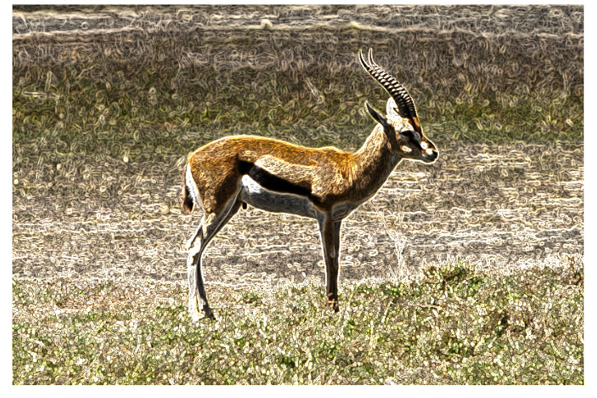

The fun house mirror distortion `kernel` routine is provided as the default `kernel` routine for the image unit template in Xcode. (You’ll learn how to use the image unit template in [Writing the Objective-C Portion](Writing%20the%20Objective-C%20Portion.md#apple-f4xwc4dqnrsv64tfmyxwi33df52wszbpkridimbqga2dkmzrfvbuqnbnknltc).) Similar to a mirror in a carnival fun house, this filter distorts an image by stretching and magnifying a vertical strip of the image. Compare [Figure 2-15](#apple-f4xwc4dqnrsv64tfmyxwi33df52wszbpkridimbqga2dkmzrfvbuqmznknltgny) with [Figure 2-3](#apple-f4xwc4dqnrsv64tfmyxwi33df52wszbpkridimbqga2dkmzrfvbuqmznknltcmy).

__Figure 2-15__  A gazelle image distorted by a fun house mirror routine


The fun house `kernel` routine shown in [Listing 2-6](#apple-f4xwc4dqnrsv64tfmyxwi33df52wszbpkridimbqga2dkmzrfvbuqmznknltgni) takes the following parameters:

- `src` is the `sampler` that fetches image data from a source image.
- `center_x` is the x coordinate that defines the center of the vertical strip in which the warping takes place.
- `inverse_radius` is the inverse of the radius. You can avoid a division operation in the `kernel` routine by performing this calculation outside the routine, in the Objective-C portion of the filter.
- `radius` is the extent of the effect.
- `scale` specifies the amount of warping.

The `mySmoothstep` routine in Listing 2-6 is a custom smoothing function to ensure that the pixels at the edge of the effect blend with the rest of the image.

__Listing 2-6__  Code that creates a fun house mirror distortion

```
float mySmoothstep(float x)
{
    return (x * -2.0 + 3.0) * x * x;
}

kernel vec4 funHouse(sampler src, float center_x, float inverse_radius,
            float radius, float scale) // 1
{
    float distance;
    vec2 myTransform1, adjRadius;

    myTransform1 = destCoord(); // 2
    adjRadius.x = (myTransform1.x - center_x) * inverse_radius; // 3
    distance = clamp(abs(adjRadius.x), 0.0, 1.0); // 4
    distance = mySmoothstep(1.0 - distance) * (scale - 1.0) + 1.0; // 5
    myTransform1.x = adjRadius.x * distance * radius + center_x; // 6
    return sample(src, samplerTransform(src, myTransform1)); // 7
}
```

Here’s what the code does:

1. Takes a `sampler` and four `float` values as parameters. Note that when you write the Objective-C portion of the filter, you must pass each `float` value as an `NSNumber` object. Otherwise, the filter will not work. See [Kernel Routine Rules](An%20Image%20Unit%20and%20Its%20Parts.md#apple-f4xwc4dqnrsv64tfmyxwi33df52wszbpkridimbqga2dkmzrfvbuqnrnknlti).
2. Fetches the position, in working-space coordinates, of the pixel currently being computed.
3. Computes an x coordinate that’s adjusted for it’s distance from the center of the effect.
4. Computes a distance value based on the adjusted x coordinate and that varies between `0` and `1`. Essentially, this normalizes the distance.
5. Adjusts the normalized distance value so that is varies along a curve. The `scale` value determines the height of the curve. The radius value used previously to calculate the distance determines the width of the curve.
6. Computes a transformation vector.
7. Returns the pixel located at the position in the coordinate space after the coordinate space is transformed by the `myTransform1` vector.

Take a look at the default image unit in Xcode to see what’s required for the Objective-C portion of the image unit. (See [The Image Unit Template in Xcode](Writing%20the%20Objective-C%20Portion.md#apple-f4xwc4dqnrsv64tfmyxwi33df52wszbpkridimbqga2dkmzrfvbuqnbnknlts).) You’ll see that a region-of-interest method is required. You’ll also notice that the inverse radius calculation is computed in the `outputImage` method.

This section describes a more sophisticated use of `kernel` routines. You’ll see how to create two `kernel` routines that could stand on their own, but later, in [Creating a Detective Lens Image Unit](Writing%20the%20Objective-C%20Portion.md#apple-f4xwc4dqnrsv64tfmyxwi33df52wszbpkridimbqga2dkmzrfvbuqnbnknlti), you’ll see how to combine them to create a filter that, to the user, will look similar to a physical magnification lens, as shown in Figure 2-16.

__Figure 2-16__  The ideal detective lens


To create this effect, it’s necessary to perform tasks outside the `kernel` routine. You’ll need Objective-C code to set up region-of-interest routines, to set up input parameters for each `kernel` routine, and to pass the output image produced by each `kernel` routine to a compositing filter. You’ll see how to accomplish these tasks later. After a discussion of the problem and the components of a detective lens, you’ll see how to write each of the `kernel` routines.

The resolution of images taken by today’s digital cameras have outpaced the resolution of computer displays. Images are typically downsampled by image editing applications to allow the user to see the entire image onscreen. Unfortunately, the downsampling hides the details in the image. One solution is to show the image using a 1:1 ratio between the screen resolution and the image resolution. This solution is not ideal, because only a portion of the image is displayed onscreen, causing the user to scroll in order to view other parts of the image.

This is where the detective lens filter comes in. The filter allows the user to inspect the details of part of a high resolution image, similar to what’s shown in [Figure 2-17](#apple-f4xwc4dqnrsv64tfmyxwi33df52wszbpkridimbqga2dkmzrfvbuqmznknltgma). The filter does not actually magnify the original image. Instead, it displays a downsampled image for the pixels that are not underneath the lens and fetches pixels from the unscaled original image for the pixels that are underneath the lens.

__Figure 2-17__  A detective lens that enlarges a portion of a high-resolution image

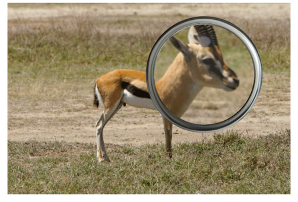

Before writing any `kernel` routine, it’s helpful to understand the parameters that control the image processing effect you want to achieve. Figure 2-18 shows a diagram of the top view of the lens. The lens, has a center and a diameter. The lens holder has a width. The lens also has:

- An opacity. Compare the colors underneath the lens with those outside the lens in [Figure 2-17](#apple-f4xwc4dqnrsv64tfmyxwi33df52wszbpkridimbqga2dkmzrfvbuqmznknltgma).
- Reflectivity, which can cause a shiny spot on the lens if the lens does not have a modern reflection-free coating.

__Figure 2-18__  The parameters of a detective lens

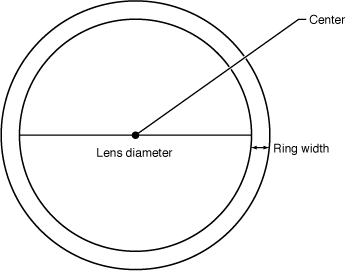

Figure 2-19 shows another characteristic of the lens that influences its effect—roundness. This lens is convex, but the height shown in the diagram (along with the lens diameter) controls how curved the lens is.

__Figure 2-19__  A side view of a detective lens

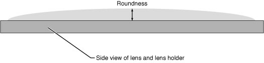

The lens holder has additional characteristics as you can see in Figure 2-20. This particular lens holder has a fillet. A fillet is a strip of material that rounds off an interior angle between two sections. By looking at the cross section, you’ll see that the lens holder can have three parts to it—an inner sloping section, an outer sloping section, and a flat top. The fillet radius determines whether there is a flat top, as shown in the figure. If the fillet radius is half the lens holder width, there is no flat top. If the fillet radius is less than half the lens holder width, there will be a flattened section as shown in the figure.

__Figure 2-20__  A cross section of the lens holder

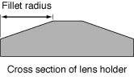

Next you’ll take a look at the `kernel` routines needed to produce the lens and lens holder characteristics.

The lens `kernel` routine must produce an effect similar to a physical lens. Not only should the routine appear to magnify what’s underneath it, but it should be slightly opaque and reflect some light. Figure 2-21 shows a lens with those characteristics.

__Figure 2-21__  A checkerboard pattern magnified by a lens filter

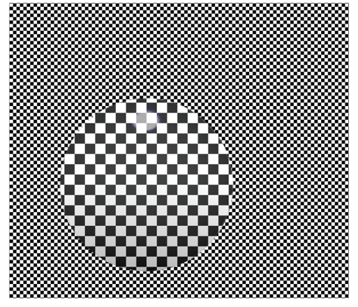

In previous sections, you’ve seen how to write routines that require only one `sampler`. The `kernel` routine that produced the effect shown in Figure 2-21 requires three `sampler` objects for fetching pixels from:

- The high-resolution image. Recall that the purpose of the lens is to allow the user to inspect details in an image that’s too large to fit onscreen. This `sampler` object fetches pixels to show underneath the lens—the part of the image that will appear magnified. Depending on the amount of magnification desired by the filter client, the `sampler` might need to downsample the high resolution image.
- A downsampled version of the high-resolution image. This `sampler` object fetches pixels to show outside the lens—the part of the image that will not appear to be magnified.
- The highlight image. These samples are used to generate highlights in the lens to give the appearance of the lens being reflective. Figure 2-22 shows the highlight image. The highlights are so subtle, that to reproduce the image for this document, transparent pixels are represented as black. White pixels are opaque. The highlight shown in the figure is exaggerated so that it can be seen here.

Recall that the setup work for `sampler` objects is done in the Objective-C portion of an image unit. See [Division of Labor](An%20Image%20Unit%20and%20Its%20Parts.md#apple-f4xwc4dqnrsv64tfmyxwi33df52wszbpkridimbqga2dkmzrfvbuqnrnknltg). You’ll see how to set up the `CISampler` objects in [Creating a Detective Lens Image Unit](Writing%20the%20Objective-C%20Portion.md#apple-f4xwc4dqnrsv64tfmyxwi33df52wszbpkridimbqga2dkmzrfvbuqnbnknlti).

__Figure 2-22__  An image used to generate lens highlights

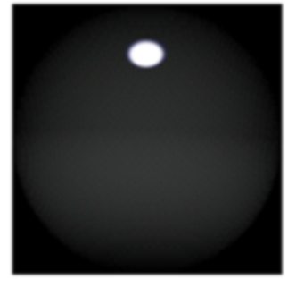

The lens `kernel` routine (see [Listing 2-7](#apple-f4xwc4dqnrsv64tfmyxwi33df52wszbpkridimbqga2dkmzrfvbuqmznknltcoi)) takes nine input parameters:

- `downsampled_src` is the `sampler` associated with the downsampled version of the image.
- `hires_src` is the `sampler` associated with the high resolution image.
- `highlights` is the `sampler` associated with the highlight image.
- `center` is a two-element vector that specifies the center of the magnifying lens.
- `radius` is the radius of the magnifying lens.
- `roundness` is a value that specifies how convex the lens is.
- `opacity` specifies how opaque the glass of the magnifying lens is. If the lens has a reflection-free coating, this value is `0.0`. If it is as reflective as possible, the value is `1.0`.
- `highlight size` is a two-element vector that specifies the height and width of the highlight image.

Now that you know a bit about the lens characteristics and the input parameters needed for the `kernel` routine, take a look at Listing 2-7. After the necessary declarations, the routine starts out by calculating normalized distance. The three lines of code that perform this calculation are typical of routines that operate within a portion of an image. Part of the routine is devoted to calculating and applying a transform that determines which pixel from the highlight image to fetch, and then modifying the magnified pixel by the highlight pixel. You’ll find more information in the detailed explanation for each numbered line of code that follows the listing.

__Listing 2-7__  A `kernel` routine for a lens

```
kernel vec4 lens(sampler downsampled_src, sampler highres_src, sampler highlights,
            vec2 center, float radius, float magnification,
            float roundness, float opacity, vec2 highlightsSize) // 1
{
    float dist, mapdist; // 2
    vec2 v0; // 3
    vec4 pix, pix2, mappix; // 4

    v0 = destCoord() - center; // 5
    dist = length(v0); // 6
    v0 = normalize(v0); // 7

    pix = sample(downsampled_src, samplerCoord(downsampled_src)); // 8
    mapdist = (dist / radius) * roundness; // 9
    mappix = sample(highlights, samplerTransform(highlights,
                highlightsSize * (v0 * mapdist + 1.0) * 0.5)); // 10
    mappix *= opacity; // 11
    pix2 = sample(highres_src, samplerCoord(highres_src)); // 12
    pix2 = mappix + (1.0 - mappix.a) * pix2; // 13

    return mix(pix, pix2, clamp(radius - dist, 0.0, 1.0)); // 14
}
```

Here’s what the code does:

1. Takes three `sampler` objects, four `float` values, and two `vec2` data types as parameters. Note that when you write the Objective-C portion of the filter, you must pass each `float` and `vec2` values as `NSNumber` objects. Otherwise, the filter will not work. See [Kernel Routine Rules](An%20Image%20Unit%20and%20Its%20Parts.md#apple-f4xwc4dqnrsv64tfmyxwi33df52wszbpkridimbqga2dkmzrfvbuqnrnknlti).
2. Declares two variables: `dist` provides intermediate storage for calculating a `mapdist` distance. `mapdist` is used to determine which pixel to fetch from the highlight image.
3. Declares a two-element vector for storing normalized distance.
4. Declares three four-element vectors for storing pixel values associated with the three `sampler` sources.
5. Subtracts the vector that represents the center point of the lens from the vector that represents the destination coordinate.
6. Calculates the length of the difference vector.
7. Normalizes the distance vector.
8. Fetches a pixel from the downsampled image. Recall that this image represents the pixels that appear outside the lens—the “unmagnified” pixels.
9. Calculates the distance value that is needed to determine which pixel to fetch from the highlight image. This calculation is needed because the size of the highlight image is independent of the diameter of the lens. The calculation ensures that the highlight image stretches or shrinks to fit the area of the lens.
10. Fetches a pixel from the highlight image by applying a transform based on the distance function and the size of the highlight.
11. Modifies the pixel fetched from the highlight image to account for the opacity of the lens.
12. Fetches a pixel from the high resolution image. You’ll see later ([Creating a Detective Lens Image Unit](Writing%20the%20Objective-C%20Portion.md#apple-f4xwc4dqnrsv64tfmyxwi33df52wszbpkridimbqga2dkmzrfvbuqnbnknlti)) that the magnification is applied in the Objective-C portion of the image unit.
13. Modifies the pixel from the high resolution image by the opacity-adjusted highlight pixel.
14. Softens the edge between the magnified (high resolution image) and unmagnified (downsampled image) pixels.

    The `mix` and `clamp` functions provided by OpenGL Shading Language have hardware support and, as a result, are much more efficient for you to use than to implement your own.

    The `clamp` function

    `genType clamp (genType x, float minValue, float maxValue)`

    returns:

    `min(max(x, minValue), maxValue)`

    If the destination coordinate falls within the area of the lens, the value of `x` is returned; otherwise `clamp` returns `0.0`.

    The `mix` function

    `genType mix (genType x, genType y,float a)`

    returns the linear blend between the first two arguments (x, y) passed to the function:

    `x * (1 - a) + y * a`

    If the destination coordinate falls outside of the area of the lens (`a = 0.0`), `mix` returns an unmagnified pixel. If the destination coordinate falls on the edges of the lens (`a = 1.0`), `mix` returns a linear blend of the magnified and unmagnified pixels. If the destination coordinate inside the area of the lens, `mix` returns magnified pixel.

The lens holder `kernel` routine is generator routine in that is does not operate on any pixels from the source image. The `kernel` routine generates an image from a material map, and that image sits on top of the source image. See Figure 2-23.

__Figure 2-23__  A magnifying lens holder placed over a checkerboard pattern

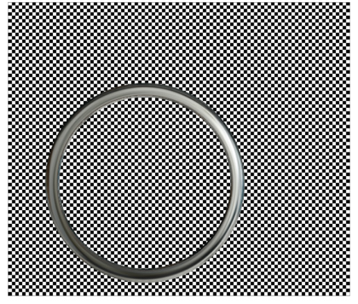

The material map for the lens holder is shown in Figure 2-24. It is a digital photograph of a highly reflective ball. You can just as easily use another image of reflective material.

__Figure 2-24__  A material map image

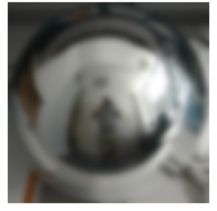

The `kernel` routine performs several calculations to determine which pixel to fetch from the material map for each location on the lens holder. The routine warps the material map to fit the inner part of the lens holder and warps it in reverse so that it fits the outer part of the lens holder. If the fillet radius is less than one-half the lens holder radius, the routine colors the flat portion of the lens holder by using pixels from the center portion of the material map. It may be a bit easier to see the results of the warping by looking at the lens holder in Figure 2-25, which was created from a checkerboard pattern. The figure also demonstrates that if you don’t use an image that has reflections in it, the lens holder won’t look realistic.

__Figure 2-25__  A lens holder generated from a checkerboard image

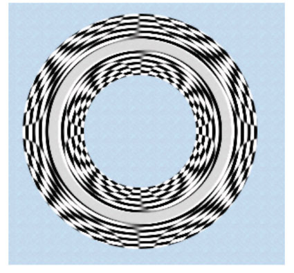

The lens holder `kernel` routine (see [Listing 2-8](#apple-f4xwc4dqnrsv64tfmyxwi33df52wszbpkridimbqga2dkmzrfvbuqmznknltema)) takes six input parameters:

- `material` is a `sampler` object that fetches samples from the material map shown in [Figure 2-24](#apple-f4xwc4dqnrsv64tfmyxwi33df52wszbpkridimbqga2dkmzrfvbuqmznknltemq).
- `center` is a two-element vector that specifies the center of the lens that the lens holder is designed to hold.
- `innerRadius` is the distance from the center of the lens to the inner edge of the lens holder.
- `outerRadius` is the distance from the center of the lens to the outer edge of the lens holder.
- `filletRadius` is the distance from the lens holder edge towards the lens holder center. This value should be less than half the lens holder radius.
- `materialSize` is a two-element vector that specifies the height and width of the material map.

The routine shown in Listing 2-8 starts with the necessary declarations. Similar to the lens `kernel` routine, the lens holder `kernel` routine calculates normalized distance. Its effect is limited to a ring shape, so the normalized distance is needed to determine where to apply the effect. The routine also calculated whether the destination coordinate is on the inner or outer portion of the ring (that is, lens holder). Part of the routine constructs a transform that is then used to fetch a pixel from the material map. The material map size is independent of the inner and outer lens holder diameter, so a transform is necessary to perform the warping required to map the material onto the lens holder. You’ll find more information in the detailed explanation for each numbered line of code that follows the listing.

__Listing 2-8__  A `kernel` routine that generates a magnifying lens holder

```
kernel vec4 ring(sampler material, vec2 center, float innerRadius,
                    float outerRadius, float filletRadius, vec2 materialSize) // 1
{
    float dist, f, d0, d1, alpha;
    vec2 t0, v0;
    vec4 pix;

    t0 = destCoord() - center; // 2
    dist = length(t0);// 3
    v0 = normalize(t0);// 4

    d0 = dist - (innerRadius + filletRadius); // 5
    d1 = dist - (outerRadius - filletRadius); // 6
    f = (d1 > 0.0) ? (d1 / filletRadius) : min(d0 / filletRadius, 0.0); // 7
    v0 = v0 * f; // 8

    alpha = clamp(dist - innerRadius, 0.0, 1.0) * clamp(outerRadius - dist, 0.0, 1.0); // 9

    v0 = materialSize * (v0 + 1.0) * 0.5; // 10
    pix = sample(material, samplerTransform(material, v0)); // 11

  return pix * alpha; // 11
}
```

Here’s what the code does:

1. Takes one `sampler` object, three `float` values, and two `vec2` data types as parameters. Note that when you write the Objective-C portion of the filter, you must pass each `float` and `vec2` value as `NSNumber` objects. Otherwise, the filter will not work. See [Kernel Routine Rules](An%20Image%20Unit%20and%20Its%20Parts.md#apple-f4xwc4dqnrsv64tfmyxwi33df52wszbpkridimbqga2dkmzrfvbuqnrnknlti).
2. Subtracts the vector that represents the center point of the lens from the vector that represents the destination coordinate.
3. Calculates the length of the difference vector.
4. Normalizes the length.
5. Calculates whether the destination coordinate is on the inner portion of the lens holder.
6. Calculates whether the destination coordinate is on the outer portion of the lens holder.
7. Calculates a shaping value that depends on the location of the destination coordinate: `[-1...0]` in the inner portion of the lens holder, `[0...1]` in the outer portion of the lens holder, and `0` otherwise.
8. Modifies the normalized distance to account for the lens holder fillet. This value will shape the lens holder.
9. Calculates an alpha value for the pixel at the destination coordinate. If the the location falls short of the inner radius, the alpha value is clamped to `0.0`. Similarly, if the location overshoots the outer radius, the result is clamped to `0.0`. Alpha values within the lens holder are clamped to `1.0`. Pixels not on the lens holder are transparent.
10. Modifies the `v0` vector by the width and height of the material map. Then scales the vector to account for the size of the material map.
11. Fetches a pixel from the material map by applying the `v0` vector as a transform.
12. Applies alpha to the pixel prior to returning it.

The `kernel` routine for a monochrome filter should look similar to what’s shown in Listing 2-9.

__Listing 2-9__  A solution to the monochrome filter challenge

```
kernel vec4 monochrome(sampler image, __color color)
{
    vec4 pixel;
    pixel = sample(image, samplerCoord(image));
    pixel.g = pixel.b = pixel.r;
    return pixel * color;
}
```


Now that you’ve seen how to write a variety of `kernel` routines, you are ready to move on to writing the Objective-C portion of an image unit. The next chapter shows how to create a project from the Xcode image unit template. You’ll see how to create an image unit for several of the `kernel` routines described in this chapter.

[Next](Writing%20the%20Objective-C%20Portion.md)[Previous](An%20Image%20Unit%20and%20Its%20Parts.md)

