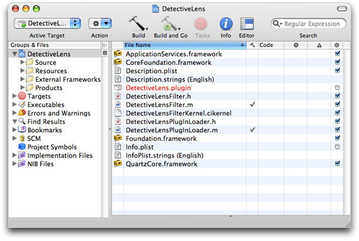
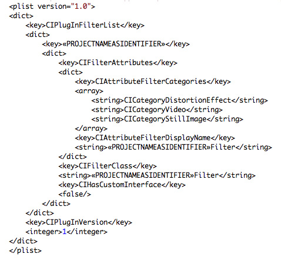
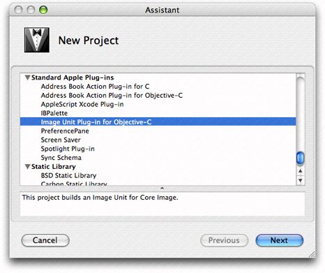
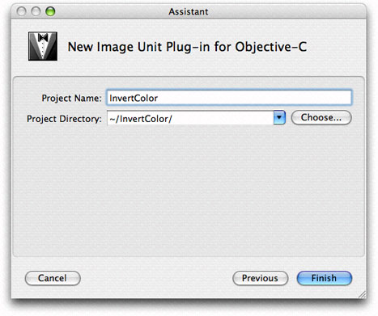

> 导航：[总目录](../../../README.md) · [documentation](../../../_indexes/documentation.md) · [Image Unit Tutorial](Introduction.md)


[Next](Preparing%20an%20Image%20Unit%20for%20Distribution.md)[Previous](Writing%20Kernels.md)

# Writing the Objective-C Portion

The kernel, although it is the heart of an image processing filter, becomes an image unit only after it is properly packaged as a plug-in. Your most important tasks in the packaging process are to copy your `kernel` routine (or routines) into the kernel skeletal file provided by Xcode and to modify the code in the in the implementation and interface files for the filter. There are a few other housekeeping tasks you’ll need to perform to correctly categorize the filter and to identify your image unit as your product. You’ll also need to describe its input parameters.

This chapter provides an overview to the image unit template in Xcode and describes the contents of the filter files. Then, it shows how to create these image units:

- A color inversion image unit that uses the `kernel` routine discussed in [Color Inversion](Writing%20Kernels.md#apple-f4xwc4dqnrsv64tfmyxwi33df52wszbpkridimbqga2dkmzrfvbuqmznknltcoa). It uses one `sampler` object and does not require a region-of-interest method.
- A pixellate image unit that uses the `kernel` routine discussed in [Pixellate](Writing%20Kernels.md#apple-f4xwc4dqnrsv64tfmyxwi33df52wszbpkridimbqga2dkmzrfvbuqmznknltcni). It uses one `sampler` object and requires one region-of-interest method.
- A detective lens image unit, which uses the two `kernel` routines discussed in [Writing Kernel Routines for a Detective Lens](Writing%20Kernels.md#apple-f4xwc4dqnrsv64tfmyxwi33df52wszbpkridimbqga2dkmzrfvbuqmznknlteni). It uses requires several `sampler` objects and two a region-of-interest methods.

Before you follow the instructions in this chapter for writing the Objective-C portion of an image unit, you should understand how the `kernel` routines discussed in [Writing Kernels](Writing%20Kernels.md#apple-f4xwc4dqnrsv64tfmyxwi33df52wszbpkridimbqga2dkmzrfvbuqmznknltc) work.

Xcode provides a template that facilitates the packaging process. To help you package an image unit as a plug-in, Xcode provides the skeletal files and methods that are needed and names the files appropriately. [Figure 3-1](#apple-f4xwc4dqnrsv64tfmyxwi33df52wszbpkridimbqga2dkmzrfvbuqnbnknltm) shows the files automatically created by Xcode for an image unit project named `DetectiveLens`.

__Figure 3-1__  The files in an image unit project



Xcode automatically names files using the project name that you supply. These are the default files provided by Xcode:

- `<ProjectName>Filter.m` is the implementation file for the filter. You will need to modify this file.
- `<ProjectName>Filter.h` is the interface file for the filter. You will need to modify this file.
- `<ProjectName>FilterKernel.cikernel` is the file that contains the `kernel` routine (or routines) and any subroutines needed by the kernel. The default code is a `funHouse` kernel routine and a `smoothstep` subroutine that’s used by `funHouse`. (This subroutine is not the same as the one provided by OpenGl Shading Language.) All you need to do is completely replace this code with the `kernel` routine (or routines) that you’ve written (as well as tested and debugged) and any required subroutines.
- `<ProjectName>PlugInLoader.m` is the file that implements the plug-in protocol needed to load an image unit. You do not need to make any modifications to this file unless your product requires custom tasks on loading. This chapter does not provide any information on customizing the loading process. It assumes that you’ll use the file as is.
- `<ProjectName>PlugInLoader.h` is the interface file for the plug-in loading protocol.
- `<ProjectName>.plugin` is the plug-in that you will distribute. When you create the project, this file name appears in red text to indicate that the file does not yet exist. After you build the project, the file name changes to black text to indicate that the plug-in exists.
- `Description.plist` defines several properties of the filter: filter name, filter categories, localized display name, filter class, and information about the input parameters to the filter. Executable image units (which are the only image units you’ll see in this tutorial) may have input parameters of any class, but Core Image does not generate an automatic user interface for custom classes (see `CIFilter Image Kit Additions`). Input parameters for non-executable image units must be one of these classes: [CIColor](https://developer.apple.com/documentation/coreimage/cicolor), [CIVector](https://developer.apple.com/documentation/coreimage/civector), [CIImage](https://developer.apple.com/documentation/coreimage/ciimage), or [NSNumber](https://developer.apple.com/library/archive/documentation/LegacyTechnologies/WebObjects/WebObjects_3.5/Reference/Frameworks/ObjC/Foundation/Classes/NSNumber/Description.html#//apple_ref/occ/cl/NSNumber). (For more information on executable and nonexecutable filters, see _[Core Image Programming Guide](../Core%20Image%20Programming%20Guide/About%20Core%20Image.md#apple-f4xwc4dqnrsv64tfmyxwi33df52wszbpkridgmbqgaytcobv)_.)

  The default template file is shown in [Figure 3-2](#apple-f4xwc4dqnrsv64tfmyxwi33df52wszbpkridimbqga2dkmzrfvbuqnbnknltcma). Xcode fills in the filter name for you based on the project name that you provide. You need to make changes to the filter categories and localized display name. The filter categories should include all the categories defined by the Core Image API that apply to your filter. For a list of the possible categories, see _[CIFilter Class Reference](https://developer.apple.com/documentation/coreimage/cifilter)_.
- `Info.plist` contains properties of the plug-in, such as development region, bundle identifier, principal class, and product name. You’ll want to modify the bundle identifier and make sure that you define the product name variable in Xcode.

The default code is for a filter that mimics the effect of a fun house mirror. You should recognize the kernel routine as the same one discussed in [Listing 2-6](Writing%20Kernels.md#apple-f4xwc4dqnrsv64tfmyxwi33df52wszbpkridimbqga2dkmzrfvbuqmznknltgni). The project will build as a valid image unit without the need for you to change a single line of code.

__Figure 3-2__  The default property list file



The filter interface and implementation files provided by Xcode are the ones that you need to customize for your `kernel` routine (or routines). The interface file declares a subclass of [CIFilter](https://developer.apple.com/documentation/coreimage/cifilter). Xcode automatically names the subclass `<ProjectName>Filter`. For example, if you supply InvertColor as the project name, the interface file uses `InvertColorFilter` as the subclass name. The default interface file declares four instance variables for the filter: `inputImage`, `inputVector`, `inputWidth`, and `inputAmount`, which, from the perspective of a filter client, are the input parameters to the filter. You may need to delete one or more of these instance variables and add any that are needed by your image unit.

The implementation file contains four methods that you’ll need to modify for your purposes:

- `init` gets the kernel file from the bundle, and loads the `kernel` routines. Unless you require customization at initialization time, you may not need to modify this method.
- `regionOf:destRect:userInfo` is callback function that defines the region of interest (ROI). If you are writing a filter that does not require an ROI, you can delete this method. If you are unsure of what an ROI is, see _[Core Image Programming Guide](../Core%20Image%20Programming%20Guide/About%20Core%20Image.md#apple-f4xwc4dqnrsv64tfmyxwi33df52wszbpkridgmbqgaytcobv)_ and [Region-of-Interest Methods](An%20Image%20Unit%20and%20Its%20Parts.md#apple-f4xwc4dqnrsv64tfmyxwi33df52wszbpkridimbqga2dkmzrfvbuqnrnknlte). In general, filters that map one source pixel to one destination pixel do not require an ROI. Just about all other types of filters will require that you provide an ROI method, except certain generator filters.
- `customAttributes` is a method that defines the attributes of each input parameter. This is required so that the filter host can query your filter for the input parameters, their data types, and their default, minimum, and maximum values. You can also provide such useful information as slider minimum and maximum values. When a filter host calls the [attributes](https://developer.apple.com/documentation/coreimage/cifilter/1437661-attributes) method, Core Image actually invokes your `customAttributes` method. If your filter does not require any input parameters other than an input image, you can delete this method.
- `outputImage` creates one or more [CISampler](https://developer.apple.com/documentation/coreimage/cisampler) objects, performs any necessary calculations, calls the [apply:](https://developer.apple.com/documentation/coreimage/cifilter/1562058-apply) method of the [CIFilter](https://developer.apple.com/documentation/coreimage/cifilter) class and returns a [CIImage](https://developer.apple.com/documentation/coreimage/ciimage) object. The exact nature of this method depends on the complexity of the filter, as you’ll see by reading the rest of this chapter.

The next sections show how to modify the filter files for three types of image units:

- [Creating a Color Inversion Image Unit](#apple-f4xwc4dqnrsv64tfmyxwi33df52wszbpkridimbqga2dkmzrfvbuqnbnknlto) uses one `kernel` routine but does not need an ROI method.
- [Creating a Pixellate Image Unit](#apple-f4xwc4dqnrsv64tfmyxwi33df52wszbpkridimbqga2dkmzrfvbuqnbnknltg) uses one `kernel` routine and an ROI method.
- [Creating a Detective Lens Image Unit](#apple-f4xwc4dqnrsv64tfmyxwi33df52wszbpkridimbqga2dkmzrfvbuqnbnknlti) is a multipass filter that uses two `kernel` routines and an ROI method for each `kernel` routine.

A color inversion filter represents one of the simplest image units that you can write. It uses the `kernel` routine discussed in [Color Inversion](Writing%20Kernels.md#apple-f4xwc4dqnrsv64tfmyxwi33df52wszbpkridimbqga2dkmzrfvbuqmznknltcoa). If you take a look at the `kernel` routine shown in [Listing 2-1](Writing%20Kernels.md#apple-f4xwc4dqnrsv64tfmyxwi33df52wszbpkridimbqga2dkmzrfvbuqmznknlte) you’ll see that the routine does not use any input parameters other than an input image. So there is no need to supply a `customAttributes` method. The `kernel` routine maps one source pixel to a destination pixel that’s at the same coordinates as the source pixel. As a result, there is no need to supply a method that calculates an ROI. You will need to make modifications to the filter interface file and to the `outputImage` method in the filter implementation file. The default `init` method will work as is, provided that you do not rename any of the files that Xcode automatically names for you.

To package the color inversion `kernel` routine as image unit, follow these steps:

1. Launch Xcode and choose File > New Project.
2. In the Assistant window, scroll to to Standard Apple Plug-ins, select `Image Unit Plug-in for Objective C` and click Next.

   
3. Enter `InvertColor` as the project name and click Finish.

   
4. Open the `InvertColorFilterKernel.cikernel` file and replace the code with the code from [Listing 2-1](Writing%20Kernels.md#apple-f4xwc4dqnrsv64tfmyxwi33df52wszbpkridimbqga2dkmzrfvbuqmznknlte).
5. Open the `InvertColor.h` file and delete all the instance variables except for `inputImage`, as this filter doesn’t have any input parameters other than an input image. Then save and close the file.
6. Open the `InvertColor.m` file and delete the `regionOf:destRect:userInfo:` and `customAttributes` methods.
7. Modify the `outputImage` method so that it looks as follows:

```objc
- (CIImage *)outputImage
{
    CISampler *src;
   // Create a sampler from the input image because a kernel routine takes
   // a sampler, not an image, as input
    src = [CISampler samplerWithImage:inputImage];
    // Use the apply: method on the CIFilter object
    return [self apply:_InvertColorFilterKernel, src, nil];
}
```
8. Save and close the `InvertColor.m` file.
9. Open the `Description.plist` file.
10. Change `CICategoryDistortionEffect` to `CICategoryColorEffect`.
11. Save and close the `Description.plist` file.
12. Open the `Description.strings` file.
13. Enter the localized display name for the filter by adding the following:

    `"InvertColorFilter" = "Invert Color Filter";`

    You’ll want to provide localized display names for all input parameters and for all languages that represent your image unit users.
14. Save and close the `Description.strings` file.
15. Build the project.

    It should succeed unless you’ve introduced some typographical errors.
16. Quit Xcode.
17. Find the `InvertColor.plugin` file in your project. If you want, move it to a convenient location for validation and testing purposes.
18. Make sure the image unit is valid. (See [Validating an Image Unit](Preparing%20an%20Image%20Unit%20for%20Distribution.md#apple-f4xwc4dqnrsv64tfmyxwi33df52wszbpkridimbqga2dkmzrfvbuqnjnknltg).)
19. Install the validated image unit in `/Library/Graphics/Image Units/`.
20. Test the image unit. (See [Testing an Image Unit](Preparing%20an%20Image%20Unit%20for%20Distribution.md#apple-f4xwc4dqnrsv64tfmyxwi33df52wszbpkridimbqga2dkmzrfvbuqnjnknltk).)

That’s all there is to building an image unit for a simple filter! Read the next sections to create image units for more complex filters.

Writing an image unit to package the pixellate `kernel` routine (see [Pixellate](Writing%20Kernels.md#apple-f4xwc4dqnrsv64tfmyxwi33df52wszbpkridimbqga2dkmzrfvbuqmznknltcni)) is a bit more challenging than packaging the color inversion `kernel` routine because you need to supply a region-of-interest method. Recall that the pixellate `kernel` routine uses many pixels from the source image to compute the value of each destination pixel. The number of pixels is defined by the dot size. For example, if the dot size is 4, then the `kernel` routine uses 16 pixels from the source image: a 4-pixel-by-4-pixel grid. The calculation works well unless the destination pixel is at the edge, in which case there won’t be enough pixels to fetch. That’s where the region-of-interest method comes to play. If the grid of pixels is always inset by the radius of the dot size, you’ll avoid the problem of not having enough pixels to fetch.

The code in Listing 3-1 is a region-of-interest method that calls the Quartz function [CGRectInset](https://developer.apple.com/documentation/coregraphics/cgrect/1454218-insetby). This function returns a rectangle that is smaller or larger than the rectangle passed to it. In this case, the ROI method insets the rectangle passed to it by the dot radius.

__Listing 3-1__  A region-of-interest method for the pixellate image unit

```objc

- (CGRect)regionOf: (int)sampler  destRect: (CGRect)rect  userInfo: (NSNumber *)radius
{
    return CGRectInset(rect, -[radius floatValue], -[radius floatValue]);
}
```

Now that you’ve seen the required region-of-interest method, you are ready to use Xcode to create the pixellate image unit.

1. Launch Xcode and choose File > New Project.
2. In the Assistant window, scroll to to Standard Apple Plug-ins, select `Image Unit Plug-in for Objective C` and click Next.
3. Enter `Pixellate` as the project name and click Finish.
4. Open the `PixellateFilterKernel.cikernel` file and replace the code with the code from [Listing 2-4](Writing%20Kernels.md#apple-f4xwc4dqnrsv64tfmyxwi33df52wszbpkridimbqga2dkmzrfvbuqmznknlteoa).
5. Open the `Pixellate.h` file and modify the interface so that the filter has two instance variables: `inputImage` and `inputScale`. Then save and close the file.
6. Open the `Pixellate.m` file and modify the `regionOf:destRect:userInfo:` so that it is the same as the method in [Listing 3-1](#apple-f4xwc4dqnrsv64tfmyxwi33df52wszbpkridimbqga2dkmzrfvbuqnbnknltq).
7. Modify the `customAttributes` methods so that is has only one attribute: `inputScale`, and set appropriate values for the minimum, slider minimum, slider maximum, default, identity and type attributes. The method should look similar to the following:

```objc
- (NSDictionary *)customAttributes
{
    return [NSDictionary dictionaryWithObjectsAndKeys:

        [NSDictionary dictionaryWithObjectsAndKeys:
            [NSNumber numberWithDouble:  1.00], kCIAttributeMin,
            [NSNumber numberWithDouble:  1.00], kCIAttributeSliderMin,
            [NSNumber numberWithDouble:  200.00], kCIAttributeSliderMax,
            [NSNumber numberWithDouble:  4.00], kCIAttributeDefault,
            [NSNumber numberWithDouble:  1.00], kCIAttributeIdentity,
            kCIAttributeTypeScalar,           kCIAttributeType,
            nil],                               @"inputScale",

        nil];
}
```
8. Modify the `outputImage` method so that it looks as follows:

```objc
- (CIImage *)outputImage
{
    float radius;
    CISampler *src;
    // Set up the sampler to use the input image
    src = [CISampler samplerWithImage:inputImage];
    radius = [inputScale floatValue] * 0.5;
    // Set the region-of-interest method for the kernel routine
    [_PixellateFilterKernel setROISelector:@selector(regionOf:destRect:userInfo:)];
    // Apply the filter to the kernel, passing the sampler and scale
    return [self apply:_PixellateFilterKernel, src,
        inputScale,
    // This option specifies the domain of definition of the destination image
        kCIApplyOptionDefinition, [[src definition] insetByX:-radius Y:-radius],
    // This option sets up the ROI method to gets radius value
        kCIApplyOptionUserInfo, [NSNumber numberWithFloat:radius], nil];
}
```

   Note that you need to set up a domain of definition so that the destination image is inset by the radius of the dot. Otherwise, you’ll get a non-transparent edge around the destination image. (See [Region-of-Interest Methods](An%20Image%20Unit%20and%20Its%20Parts.md#apple-f4xwc4dqnrsv64tfmyxwi33df52wszbpkridimbqga2dkmzrfvbuqnrnknlte) and _[Core Image Programming Guide](../Core%20Image%20Programming%20Guide/About%20Core%20Image.md#apple-f4xwc4dqnrsv64tfmyxwi33df52wszbpkridgmbqgaytcobv)_.)
9. Save and close the `Pixellate.m` file.
10. Open the `Description.plist` file.
11. Change `CICategoryDistortionEffect` to `CICategoryStylizeEffect`.
12. Save and close the `Description.plist` file.
13. Build the project.

    It should succeed unless you’ve introduced some typographical errors.
14. Quit Xcode.
15. Find the `Pixellate.plugin` file in your project. If you want, move it to a convenient location for validation and testing purposes.
16. Make sure the image unit is valid. (See [Validating an Image Unit](Preparing%20an%20Image%20Unit%20for%20Distribution.md#apple-f4xwc4dqnrsv64tfmyxwi33df52wszbpkridimbqga2dkmzrfvbuqnjnknltg).)
17. Install the validated image unit in `/Library/Graphics/Image Units/`.

    You can optionally install the image unit in `"User"/Library/Graphics/Image Units/` although you may need to create the `/Graphics/Image Units/` folder because it is not created by default. .
18. Test the image unit. (See [Testing an Image Unit](Preparing%20an%20Image%20Unit%20for%20Distribution.md#apple-f4xwc4dqnrsv64tfmyxwi33df52wszbpkridimbqga2dkmzrfvbuqnjnknltk).)

The detective lens image unit is the most challenging image unit in this chapter because it brings together two `kernel` routines and uses them along with a Core Image built-in filter. This image unit requires four `CISampler` objects and two region-of-interest methods (one per `kernel` routine).

This section assumes that you’ve read [Writing Kernel Routines for a Detective Lens](Writing%20Kernels.md#apple-f4xwc4dqnrsv64tfmyxwi33df52wszbpkridimbqga2dkmzrfvbuqmznknlteni). Make sure that you understand the detective lens definition (see [Detective Lens Anatomy](Writing%20Kernels.md#apple-f4xwc4dqnrsv64tfmyxwi33df52wszbpkridimbqga2dkmzrfvbuqmznknltini)) and the `kernel` routines needed for this image unit (see [Listing 2-7](Writing%20Kernels.md#apple-f4xwc4dqnrsv64tfmyxwi33df52wszbpkridimbqga2dkmzrfvbuqmznknltcoi) and [Listing 2-8](Writing%20Kernels.md#apple-f4xwc4dqnrsv64tfmyxwi33df52wszbpkridimbqga2dkmzrfvbuqmznknltema)).

The detective lens filter is a multipass filter. You’ll need to first apply the lens `kernel` routine to the input image. Then you need to apply the lens holder `kernel` routine. Finally, you’ll need to composite the output images from each `kernel` routine. For this you’ll use the Core Image filter `CISourceOverCompositing`.

To create the detective lens image unit, follow these steps:

1. Launch Xcode and choose File > New Project.
2. In the Assistant window, scroll to to Standard Apple Plug-ins, select `Image Unit Plug-in for Objective C` and click Next.
3. Enter `DetectiveLens` as the project name and click Finish.
4. Open the `DetectiveLensFilterKernel.cikernel` file and replace the code with the code from [Listing 2-7](Writing%20Kernels.md#apple-f4xwc4dqnrsv64tfmyxwi33df52wszbpkridimbqga2dkmzrfvbuqmznknltcoi) and [Listing 2-8](Writing%20Kernels.md#apple-f4xwc4dqnrsv64tfmyxwi33df52wszbpkridimbqga2dkmzrfvbuqmznknltema).
5. Open the `DetectiveLens.h` file and modify the input parameters so they match what’s shown in Listing 3-2. Then save and close the file.

   __Listing 3-2__  The input parameters to the detective lens filter

```objc
@interface DetectiveLensFilter : CIFilter
{
    CIImage      *inputImage;
    CIVector     *inputCenter; // center of the lens
    NSNumber     *inputLensDiameter; // diameter of the lens
    NSNumber     *inputRingWidth; // width of the lens holder
    NSNumber     *inputMagnification; // lens magnification
    NSNumber     *inputRingFilletRadius; // lens holder fillet radius
    NSNumber     *inputRoundness;  // roundness of the lens, range is 0...1
    NSNumber     *inputShineOpacity; // opacity of the lens, range is 0...1
}
```
6. Open the `DetectiveLens.m` file. There are many modifications that you’ll need to make to this file.
7. Add the following static declarations just after the `@implementation` statement:

```
static CIKernel *_lensKernel = nil; // for the lens kernel routine
static CIKernel *_ringKernel = nil; // for the lens holder kernel routine
static CIImage *_ringMaterialImage = nil; // for the material map
static CIImage *_lensShineImage = nil; // for the highlight image
```

   You need one `CIKernel` object for each `kernel` routine that the image unit uses.

   You need one `CIImage` object for each image. Recall that the lens `kernel` routine uses a highlight image and the lens holder `kernel` routine uses a material map. The input image is part of the interface declaration for the filter because it’s provided by the filter client. In contrast, the highlight and material images need to be included as part of the image unit.
8. Modify the `init` method so that it fetches both `kernel` routines, using the static `CIKernel` objects that you just declared. Replace this statement:

   `_DectiveLensFilterKernel = [[kernels objectAtIndex:0] retain];`

   with these two statements:

```
// Fetch the lens kernel routine
_lensKernel = [[kernels objectAtIndex:0] retain];
// Fetch the lens holder kernel routine
_ringKernel = [[kernels objectAtIndex:1] retain];
```
9. Modify the `init` method so that it opens the files that contain the highlight image needed by the lens `kernel` routine and the material map needed for the lens holder `kernel` routine. Add the following lines of code to the `init` method.

   You need to modify the file names and extensions if they don’t match what’s shown (`myMaterial.tiff` and `myHighlight.tiff`).

```
NSString    *path = nil;
NSURL    *url = nil;
path = [bundle pathForResource:@"myMaterial" ofType:@"tiff"];
url = [NSURL fileURLWithPath:path];
_ringMaterialImage = [[CIImage imageWithContentsOfURL:url] retain];

path = [bundle pathForResource:@"myHighlight" ofType:@"tiff"];
url = [NSURL fileURLWithPath:path];
 _lensShineImage = [[CIImage imageWithContentsOfURL:url] retain];
```

   For each file, the code gets the string that defines the path to the file. Then it creates an [NSURL](https://developer.apple.com/documentation/foundation/nsurl) object from that path name. Finally, the code supplies the [NSURL](https://developer.apple.com/documentation/foundation/nsurl) object to the [imageWithContentsOfURL:](https://developer.apple.com/documentation/coreimage/ciimage/1547027-imagewithcontentsofurl) method of the [CIImage](https://developer.apple.com/documentation/coreimage/ciimage) class, and retains the image so that it can be used later.
10. Modify the `customAttributes` method so that the [NSDictionary](https://developer.apple.com/library/archive/documentation/LegacyTechnologies/WebObjects/WebObjects_3.5/Reference/Frameworks/ObjC/Foundation/Classes/NSDictionaryClassClstr/Description.html#//apple_ref/occ/cl/NSDictionary) object that it returns contains the relevant information for each of the input parameters. Then, when a filter host calls the attributes method for the filter, Core Image invokes your `customAttributes` method and returns the default, minimum, maximum, and so on, values for each of the input parameters. After modifying the `customAttributes` method, it should appear as follows:

```objc
- (NSDictionary *)customAttributes
{
    return [NSDictionary dictionaryWithObjectsAndKeys:

        [NSDictionary dictionaryWithObjectsAndKeys:
            [CIVector vectorWithX:200.0 Y:200.0],  kCIAttributeDefault,
            kCIAttributeTypePosition,              kCIAttributeType,
            nil],                                  @"inputCenter",

        [NSDictionary dictionaryWithObjectsAndKeys:
            [NSNumber numberWithDouble:  1.00], kCIAttributeMin,
            [NSNumber numberWithDouble:  1.00], kCIAttributeSliderMin,
            [NSNumber numberWithDouble:500.00], kCIAttributeSliderMax,
            [NSNumber numberWithDouble:250.00], kCIAttributeDefault,
            [NSNumber numberWithDouble:250.00], kCIAttributeIdentity,
            kCIAttributeTypeDistance,           kCIAttributeType,
            nil],                               @"inputLensDiameter",

        [NSDictionary dictionaryWithObjectsAndKeys:
            [NSNumber numberWithDouble:  1.00], kCIAttributeMin,
            [NSNumber numberWithDouble:  1.00], kCIAttributeSliderMin,
            [NSNumber numberWithDouble:500.00], kCIAttributeSliderMax,
            [NSNumber numberWithDouble: 22.00], kCIAttributeDefault,
            [NSNumber numberWithDouble:  1.00], kCIAttributeIdentity,
            kCIAttributeTypeDistance,           kCIAttributeType,
            nil],                               @"inputRingWidth",

        [NSDictionary dictionaryWithObjectsAndKeys:
            [NSNumber numberWithDouble:  1.00], kCIAttributeMin,
            [NSNumber numberWithDouble:  1.00], kCIAttributeSliderMin,
            [NSNumber numberWithDouble: 30.00], kCIAttributeSliderMax,
            [NSNumber numberWithDouble:  9.20], kCIAttributeDefault,
            [NSNumber numberWithDouble:  7.00], kCIAttributeIdentity,
            kCIAttributeTypeDistance,           kCIAttributeType,
            nil],                               @"inputRingFilletRadius",

        [NSDictionary dictionaryWithObjectsAndKeys:
            [NSNumber numberWithDouble:  1.00], kCIAttributeMin,
            [NSNumber numberWithDouble:  1.00], kCIAttributeSliderMin,
            [NSNumber numberWithDouble: 10.00], kCIAttributeSliderMax,
            [NSNumber numberWithDouble:  3.00], kCIAttributeDefault,
            [NSNumber numberWithDouble:  1.00], kCIAttributeIdentity,
            kCIAttributeTypeScalar,             kCIAttributeType,
            nil],                               @"inputMagnification",

        [NSDictionary dictionaryWithObjectsAndKeys:
            [NSNumber numberWithDouble:  0.00], kCIAttributeMin,
            [NSNumber numberWithDouble:  0.00], kCIAttributeSliderMin,
            [NSNumber numberWithDouble:  1.00], kCIAttributeSliderMax,
            [NSNumber numberWithDouble:  0.86], kCIAttributeDefault,
            [NSNumber numberWithDouble:  1.00], kCIAttributeIdentity,
            kCIAttributeTypeScalar,             kCIAttributeType,
            nil],                               @"inputRoundness",

        [NSDictionary dictionaryWithObjectsAndKeys:
            [NSNumber numberWithDouble:  0.00], kCIAttributeMin,
            [NSNumber numberWithDouble:  0.00], kCIAttributeSliderMin,
            [NSNumber numberWithDouble:  1.00], kCIAttributeSliderMax,
            [NSNumber numberWithDouble:  0.50], kCIAttributeDefault,
            [NSNumber numberWithDouble:  1.00], kCIAttributeIdentity,
            kCIAttributeTypeScalar,             kCIAttributeType,
            nil],                               @"inputShineOpacity",

        nil];
}
```
11. Write a region-of-interest method for the lens holder `kernel` routine.

    Recall that the region-of-interest method returns the rectangle that specifies the region of the sampler to use for fetching image data for the `kernel` routine. The region of interest for the lens holder `kernel` routine is simply the rectangle that specifies the size of the material map.

    The region-of-interest method must have signature compatible with the following:

```objc
- (CGRect) regionOf:(int)samplerIndex destRect:(CGRect)r userInfo:obj;
```

    This method is a callback that’s invoked by Core Image whenever your `kernel` routine needs a sample for processing. The lens holder `kernel` routine uses only one sampler, whose sampler index is `0`. (Sampler indexes for an ROI method start at `0` and are sequential.) If the sampler index is `0`, then the ROI method should return the size of the material map. Otherwise, it needs to return the destination rectangle that Core Image passed to the routine.

    The `userInfo` parameter for any region-of-interest method is what you use to pass any necessary data to the method. This particular region-of-interest method needs to have the sampler for the material map passed to it so that the ROI method can determine the size of the map. The [extent](https://developer.apple.com/documentation/coreimage/cisampler/1437872-extent) method of the [CISampler](https://developer.apple.com/documentation/coreimage/cisampler) class does just that.

```objc
- (CGRect)ringROI:(int)sampler forRect:(CGRect)R userInfo:(CISampler *)material
{
    if (sampler == 0)
        return [material extent];
    return R;
}
```
12. Write a region-of-interest method for the lens `kernel` routine. This method is a bit more complex than the one for the lens holder `kernel` routine.

    This method needs to return the region of interest for three `sampler` objects:

    - Sampler `0` fetches samples from the downsampled image (that is, what appears as unmagnified—the pixels outside the lens). The region of interest is simply the rectangle passed to the ROI method.
    - Sampler `1` fetches samples from the high resolution image. The region of interest depends on the magnification and width of the lens. The number of pixels needed from the source image is defined by the width of the lens divided by the magnification. The origin of the rectangle that defines this area is the center of the lens minus the number of pixels needed.
    - Sampler `2` fetches samples from the highlight image. The region of interest is a rectangle ([CGRect](https://developer.apple.com/documentation/coregraphics/cgrect) data type) that describes the size of the highlight image. You can obtain the size using the [extent](https://developer.apple.com/documentation/coreimage/cisampler/1437872-extent) method of the `CISampler` object.

    The `userInfo` needed for this particular region-of-interest method is an array that contains three of the filter input parameters (center of lens, width of lens, magnification factor) and the `CISampler` object for the highlight image.

    The lens ROI method should look similar to the following:

```objc
- (CGRect)lensROI:(int)sampler forRect:(CGRect)R userInfo:(NSArray *)array
{
    CIVector *oCenter;
    NSNumber *oWidth, *oMagnification;
    CISampler *shine;

    // Fetch the necessary input parameters from the userInfo parameter
    oCenter = [array objectAtIndex:0];
    oWidth = [array objectAtIndex:1];
    oMagnification = [array objectAtIndex:2];
    shine = [array objectAtIndex:3];  // shine is a CISampler object
    if (sampler == 2)
        return [shine extent];

    // Determine the area of the original image used with the lens where it is
    // currently we only need R, because the lens is a magnifier
    if (sampler == 1)
    {
        float cx, cy, width, mag;

        cx = [oCenter X];
        cy = [oCenter Y];
        width = [oWidth floatValue];
        mag = [oMagnification floatValue];
        width /= mag; // calculates the actual pixels needed from the source
        R = CGRectMake(cx - width, cy - width, width*2.0, width*2.0);
    }
    return R; // If the sampler is 0, ROI calculation is not needed.
}
```
13. Write the `outputImage` method.

    For each `kernel` routine, this method:

    - Creates `CISampler` objects, performing any necessary set up work for them.
    - Calculates any values needed by the ROI method or by the `kernel` routine. This includes calculating the rectangle that defines the shape of the destination image (otherwise known as the domain of definition).
    - Sets up the `userInfo` data needed by the ROI method so that is can be passed as an option (`kCIApplyOptionUserInfo`) to the `apply:` method of the `CIFilter` object.
    - Sets the ROI method to use for the `kernel` routine.
    - Calls the `apply:` method of the `CIFilter` object.

    Then the method composites the resulting images into a final image by using the Core Image `CISourceOverCompositing` filter.

    The method is rather long and performs many tasks, so you’ll want to read the detailed explanation for each lettered line (a, b, c, and so on) that appears following the code.

```objc
- (CIImage *)outputImage
{
    float radius, cx, cy, ringwidth, mag;
    CGRect R, extent;
    CISampler *src, *shine, *material;
    CIImage *lensedImage, *ringImage;
    CIFilter *compositedImage;
    NSArray *array;
    CISampler *magsrc;
    CGAffineTransform CT;
    CIVector *shineSize, *materialSize;

    // ********* Lens *********
    src = [CISampler samplerWithImage:inputImage]; // 1
    shine = [CISampler samplerWithImage:_lensShineImage]; // 2
    // Set up work needed for the magnified image sampler
    cx = [inputCenter X];
    cy = [inputCenter Y];
    mag = [inputMagnification floatValue];
    CT = CGAffineTransformTranslate(CGAffineTransformScale(
        CGAffineTransformMakeTranslation(cx, cy), mag, mag), -cx, -cy);
    magsrc = [CISampler samplerWithImage:[inputImage imageByApplyingTransform:CT]]; // 3

    radius = [inputLensDiameter floatValue] * 0.5; // 4
    R.origin.x = cx - radius; // 5
    R.origin.y = cy - radius;
    R.size.width = 2.0 * radius;
    R.size.height = 2.0 * radius;

    extent = [shine extent]; // 6
    shineSize = [CIVector vectorWithX:extent.size.width Y:extent.size.height]; // 7

    array = [NSArray arrayWithObjects:inputCenter, inputLensDiameter,
                inputMagnification, shine, nil]; // 8
    [_lensKernel setROISelector:@selector(lensROI:forRect:userInfo:)]; // 9

    lensedImage = [self apply:_lensKernel, src, magsrc, shine, inputCenter,
            [NSNumber numberWithFloat:radius + 2.0],
              inputMagnification, inputRoundness,
              inputShineOpacity, shineSize,
             kCIApplyOptionDefinition, [[src definition] unionWithRect:R],
             kCIApplyOptionUserInfo, array, nil];  // 10

    // ********* Lens Holder   *********
    material = [CISampler samplerWithImage:_ringMaterialImage]; // 11
    ringwidth = [inputRingWidth floatValue]; // 12

    R.origin.x = cx - radius - ringwidth; // 13
    R.origin.y = cy - radius - ringwidth;
    R.size.width = 2.0 * (radius + ringwidth);
    R.size.height = 2.0 * (radius + ringwidth);
    extent = [material extent]; // 14

    materialSize = [CIVector vectorWithX:extent.size.width Y:extent.size.height]; // 15

    [_ringKernel setROISelector:@selector(ringROI:forRect:userInfo:)]; // 16

    ringImage = [self apply:_ringKernel, material, inputCenter,
                [NSNumber numberWithFloat:radius],
                [NSNumber numberWithFloat:radius+ringwidth],
                inputRingFilletRadius,
                  materialSize,
                  kCIApplyOptionDefinition,
                  [CIFilterShape shapeWithRect:R],
                  kCIApplyOptionUserInfo, material, nil]; // 17

    // ********* Lens and Lens Holder Composited *********
    compositedImage = [CIFilter filterWithName:@"CISourceOverCompositing"
            keysAndValues:@"inputImage", ringImage,
            @"inputBackgroundImage", lensedImage, nil]; // 18

    return [compositedImage valueForKey:@"outputImage"]; // 19

}
```

    Here is what the code does:

    - 1. Creates a CISampler object for the source image.
    - 2. Creates a CISampler object for the highlight image.
    - 3. Creates a CISampler object for the magnified source, using the transform calculated in the previous lines of code.
    - 4. Extracts the diameter of the lens as a `float` value, then calculates the radius.
    - 5. Computes, along with the next three lines of code, the rectangle that will be used later to compute the size of the destination image—the domain of definition.
    - 6. Retrieves the size of the highlight image.
    - 7. Creates a `CIVector` object that contains the size of the highlight image.
    - 8. Sets up the array that’s passed as the `userInput` parameter to the region-of-interest method. Recall that the ROI method takes three of the filter input parameters (`inputCenter`, `inputLensDiameter`, and `inputMagnification`) as well as the `CISampler` object for the highlight image.
    - 9. Sets the region-of-interest method for the lens `CIKernel` object. This is the method that Core Image invokes whenever your lens `kernel` routine requires a sample.
    - 10. Applies the lens `kernel` routine to the input image, supplying the necessary input variables, the domain of definition, and the array that’s needed by the ROI method. Note that the domain of definition is specified as a [CIFilterShape](https://developer.apple.com/documentation/coreimage/cifiltershape) object that is the union of the previously calculated rectangle (see e) and the domain of definition of the `CISampler` object for the source image.
    - 11. Creates a `CISampler` object for the material map needed by the lens holder `kernel` routine.
    - 12. Extracts the width of the lens holder as a `float` value.
    - 13. Calculates, along with the next three lines of code, the rectangle that is used for the domain of definition. Notice that this rectangle encloses the lens holder. Core Image will use this information to restrict calculations. The lens holder `kernel` routine won’t be called for any pixel that falls outside this rectangle.
    - 14. Retrieves the size of the material map.
    - 15. Creates a `CIVector` object that represents the width and height of the material map.
    - 16. Sets the region-of-interest method for the lens holder `CIKernel` object. This is the method that Core Image invokes whenever your lens holder `kerne`l routine requires a sample.
    - 17. Applies the lens holder `kernel` routine to the material map, supplying the necessary input variables, the rectangle the defines the domain of definition, and the `CISampler` object for the material map (passed as the `userInfo` parameter).
    - 18. Creates a filter object for the Core Image `CISourceOverCompositing` filter, supplying the image produced by the len holder `kernel` routine as the foreground image and the image produced by the lens `kernel` routine as the background image.
    - 19. Returns the value associated with the `outputImage` key for the filter.
14. Save and close the `DetectiveLens.m` file.
15. Select Project > Add to Project to add the highlight image file (`myHighlight.tiff`) to the project.

    The name and file type must match what you provide in the `init` method.
16. Select Project > Add to Project to add the material map file (`myMaterialMap.tiff`) to the project.

    The name and file type must match what you provide in the `init` method.
17. Open the `Description.plist` file.
18. Change the display name (look for the key `CIAttributeFilterDisplayName`) from `DetectiveLens` to `Detective Lens`.
19. Save and close the `Description.plist` file.
20. Build the project.

    It should succeed unless you’ve introduced some typographical errors.
21. Quit Xcode.
22. Find the `DetectiveLens.plugin` file in your project. If you want, move it to a convenient location for validation and testing.
23. Make sure the image unit is valid and works properly by following the instructions in [Validating an Image Unit](Preparing%20an%20Image%20Unit%20for%20Distribution.md#apple-f4xwc4dqnrsv64tfmyxwi33df52wszbpkridimbqga2dkmzrfvbuqnjnknltg) and [Testing an Image Unit](Preparing%20an%20Image%20Unit%20for%20Distribution.md#apple-f4xwc4dqnrsv64tfmyxwi33df52wszbpkridimbqga2dkmzrfvbuqnjnknltk).

If you’ve successfully created all the image units in this chapter, you might try modifying the detective lens image unit by adding a handle that’s typical of a detective lens!

[Next](Preparing%20an%20Image%20Unit%20for%20Distribution.md)[Previous](Writing%20Kernels.md)

