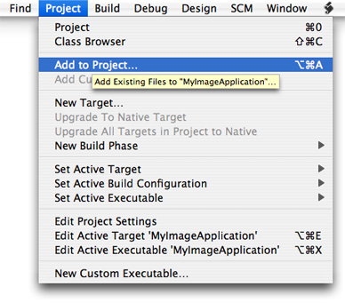
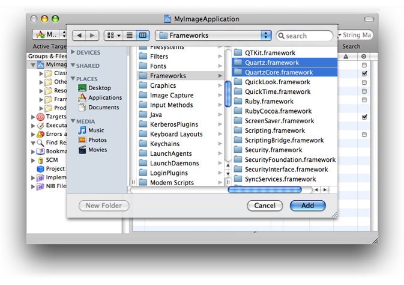
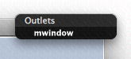
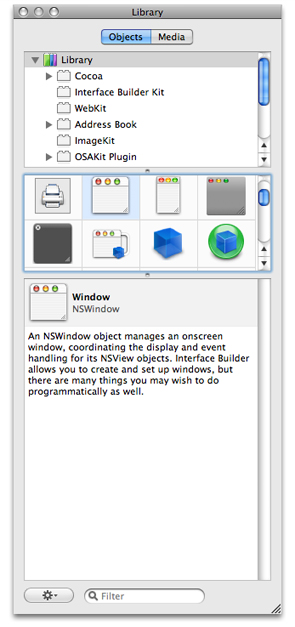
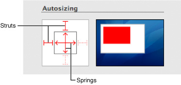

> 导航：[总目录](../../../README.md) · [documentation](../../../_indexes/documentation.md) · [ImageKit Programming Guide](Introduction%20to%20Image%20Kit%20Programming%20Guide.md)

[Next](Viewing%2C%20Editing%2C%20and%20Saving%20Images%20in%20an%20Image%20View.md)[Previous](Introduction%20to%20Image%20Kit%20Programming%20Guide.md)

# Basics of Using the Image Kit

As consumers accumulate more and more digital media, image applications are faced with handling large amounts of data in an efficient manner. Consumers not only want to open, view, and organize images, but they often need to crop images, adjust brightness, apply effects, view metadata, or perform a number of other image editing operations. The Image Kit framework is a bundle of image handling services that supports these tasks and more. It is designed to operate efficiently while providing a user interface with the look and feel of OS X. By using the Image Kit to perform the image handling tasks that most digital media applications need, you’ll be able to focus your code writing efforts on the parts of your application that distinguish it from other applications.

This chapter introduces the tasks supported by Image Kit classes and discusses how to set up Xcode and Interface Builder so that you can successfully build an application using the Image Kit. By reading this chapter, you’ll get an idea of what each of the the Image Kit classes can do. To use Image Kit classes effectively, you’ll need to read the chapters that describe how to implement the tasks required by your application.

The Image Kit is a high-level Objective-C framework. It is built on a number of other OS X graphics technologies, including Quartz 2D, Core Image, Core Animation, and OpenGL. When you use the Image Kit, you can read any image data that Quartz 2D and the Image I/O frameworks support.

There are eight major categories of tasks that the Image Kit supports, the most basic of which is to view an image. [Table 1-1](#apple-f4xwc4dqnrsv64tfmyxwi33df52wszbpkridimbqga2dsmbxfvbuqmznknlte) summarizes the tasks you can support with the Image Kit and lists the classes and protocols that you use for each task. Like the `NSImageView` class, the `IKImageView` class displays a single image in a frame and optionally can allow a user to drag an image to the view. Unlike the `NSImageView` class, the `IKImageView` class supports any image file format that Quartz supports.

The `IKImageView` class provides methods for zooming and for setting tool modes for moving, selecting, cropping, rotating, and annotating. With the appropriate tool mode selection, the view automatically displays a selection rectangle, a cropping rectangle, or an annotation oval. (Your application has to implement code that performs the actual data manipulation for these three tool modes.)

The `IKImageEditPanel` class allows users to view image metadata and to adjust digital images by:

- Changing the exposure
- Setting the white and black points
- Adjusting the gamma, saturation, contrast, and brightness
- Sharpening
- Applying color effects: black and white, sepia, antique, fade color, boost color, blur, and invert

The `IKImageView` class has built-in support for the Image Edit panel (`IKImageEditPanel` class). After making the appropriate setting in your application, a user simply clicks an image and the Image Edit panel opens. No other action is needed on your part. The image editing panel can be used independently of the `IKImageView` class by performing the appropriate setup work and implementing the `IKImageEditPanelDataSource` protocol.

The Image Kit provides the `IKImageBrowserView` class for displaying and arranging images in a grid in a way similar to the grid you see in iPhoto. The image browser can display large numbers of images, icons, movies, Quartz Composer compositions, and PDF documents. Users can drag images to the browser, select images, and move them. The Image Kit achieves smooth animation when images are moved in the browser.

The options for saving an image vary depending on the file format of the image. For that reason, the Image Kit provides the `IKSaveOptions` class. Save options appear as an accessory view (pane) in an `NSSavePanel` object.

A slideshow is a popular way for consumers to view digital images. The `IKSlideshow` class and the `IKSlideshowDataSource` protocol provide an easy way for your application to support slideshows of images, PDF documents, and other image data. You can start, pause, and stop slideshows, export slideshows, access a specific item in the show, and perform a number of other tasks.

Mail and iChat are two of the many applications that allow users to supply an icon or photo that represents their identity. The `IKPictureTaker` class provides a lightweight panel for choosing and cropping an image or for taking a snapshot with a digital camera. The panel keeps track of recent pictures, allowing the user to choose from among them as an alternative to navigating to an image or taking a snapshot.

The `IKFilterBrowserView` and `IKFilterBrowserPanel` classes provide a user interface for browsing Core Image image processing filters and previewing their effects.

The `IKFilterUIView` class provides a user interface for Core Image filters, making it easy for you to support image processing with the more than one hundred filters supplied by the system. You can choose which parameters are available to set and the size of the controls. If you want to supply a custom user interface for a filter that you write, you can use the `IKFilterCustomUIProvider` class.

__Table 1-1__  Tasks and the classes that support them

| Task | Classes and protocols |
| View and edit images | [IKImageView](https://developer.apple.com/documentation/quartz/ikimageview) |
| Adjust images, apply color effects, view metadata | Use the [IKImageEditPanel](https://developer.apple.com/documentation/quartz/ikimageeditpanel) and [IKImageEditPanelDataSource](https://developer.apple.com/documentation/quartz/ikimageeditpaneldatasource) classes only when you are not using the [IKImageView](https://developer.apple.com/documentation/quartz/ikimageview) class, which has built-in support for the Image Edit panel. |
| Display and arrange large numbers of images | [IKImageBrowserView](https://developer.apple.com/documentation/quartz/ikimagebrowserview), `IKImageBrowserDataSource`, `IKImageBrowserDelegate`, and `IKImageBrowserItem` |
| Run slideshows | [IKSlideshow](https://developer.apple.com/documentation/quartz/ikslideshow) and [IKSlideshowDataSource Protocol](https://developer.apple.com/documentation/quartz/ikslideshowdatasource) |
| Choose an icon-sized picture from a directory or take a snapshot with an iSight or other digital camera | [IKPictureTaker](https://developer.apple.com/documentation/quartz/ikpicturetaker) |
| Save images in a variety of file formats with options appropriate for the format | [IKSaveOptions](https://developer.apple.com/documentation/quartz/iksaveoptions) |
| Browse Core Image filters and preview their effects | [IKFilterBrowserView](https://developer.apple.com/documentation/quartz/ikfilterbrowserview) and [IKFilterBrowserPanel](https://developer.apple.com/documentation/quartz/ikfilterbrowserpanel) |
| View and adjust the input parameters of a Core Image filter | [IKFilterUIView](https://developer.apple.com/documentation/quartz/ikfilteruiview) and [IKFilterCustomUIProvider](https://developer.apple.com/documentation/quartz/ikfiltercustomuiprovider) |

To use the Image Kit framework in Xcode, you need to import the Quartz and Quartz Core frameworks. The Quartz framework contains Image Kit. The Quartz Core framework contains the Core Image classes needed by the [IKFilterBrowserPanel](https://developer.apple.com/documentation/quartz/ikfilterbrowserpanel) and [IKFilterBrowserView](https://developer.apple.com/documentation/quartz/ikfilterbrowserview) classes.

To import these frameworks in Xcode:

1. Open Xcode and create a Cocoa application.
2. Choose Project > Add to Project.

   
3. Navigate to `System/Library/Frameworks`, choose the `Quartz.framework` and `QuartzCore.framework`, and click Add.

   
4. In the sheet that appears, click Add.
5. Save the project.
6. After importing the frameworks, make sure that you add `#import <Quartz/Quartz.h>` into the appropriate files.

The examples in this document use Interface Builder 3.0. If you’ve never used Interface Builder before, you may want to skip this section and instead read the first chapter of _[Interface Builder User Guide](../../Developer%20Tools/Interface%20Builder%20User%20Guide/Introduction.md#apple-f4xwc4dqnrsv64tfmyxwi33df52wszbpkridimbqga2tgnbu)_. If you have used previous versions of Interface Builder, you’ll notice some substantial changes. This section points out a few of the changes that you’ll encounter when following the instructions in this document to create applications that use Image Kit classes.

Because of the new integration between Xcode 3.0 and Interface Builder 3.0, the actions and outlets that you declare in the interface file for a class are synchronously updated in Interface Builder. This will become apparent to you when you begin to make connections. When you drag from a controller in the nib document window to a view or other user interface element, a connections panel appears. The _connections panel_ is a tool that lets you examine and create connections between objects. Figure 1-1 shows a connections panel for a window that has the instance variable `mwindow` as an outlet. This example is simple; some objects have several outlets as well as received and sent actions associated with it. For a complete description of the connections panel, see _[Interface Builder User Guide](../../Developer%20Tools/Interface%20Builder%20User%20Guide/Introduction.md#apple-f4xwc4dqnrsv64tfmyxwi33df52wszbpkridimbqga2tgnbu)_.

__Figure 1-1__  An outlet for a window, shown in a connections panel

The Interface Builder library (shown in Figure 1-2) replaces the palette. The library contains the objects and resources you can use in your nib file. You can browse objects in the library by plug-in—Cocoa, IB, and so on—or use the search field to find an object. You can also create custom groups and smart groups to organize objects the way you want.

__Figure 1-2__  The Interface Builder library

The media pane of the library shows images, sounds, and other resource that are available in your Xcode project. To use objects or media from the library, simply select what you want and drop them where you want them in your nib document.

One task you’ll perform repeatedly as you create Image Kit applications is to set springs and struts that control the autosizing behavior in the user interface. The Interface Builder size inspector now includes an animation that shows how the springs and struts affects autosizing behavior.

__Figure 1-3__   Autosizing in the Interface Builder size inspector

Perhaps more noticeable than the new features in Interface Builder are the absence of features and the tasks associated with them. Seasoned Interface Builder users will notice fewer tasks for wiring the user interface. Gone is the need to drag header files to the nib document window or to parse files.

Standard terminology helps users to come up to speed quickly using your application. Familiar terminology doesn’t get in the way of learning all the impressive features that you put into your application. The Image Kit introduces a number of new classes and protocols, named using terms familiar to developers. When you provide labels in the user interface for your application, write help tags, or provide documentation, your users will be best served if you adopt standard user terminology rather than developer terminology. Table 1-2 provides the user terms for the most common developer terms used in the Image Kit. You can find out more information about providing users with a consistent visual and behavioral experience by reading _OS X Human Interface Guidelines_.

__Table 1-2__  Developer and user terms for the Image Kit

| Developer term | User term |
| accessory view | pane |
| image browser view | image browser |
| Image Edit panel | Image Edit window |
| Open panel | Open dialog |
| picture taker panel | picture taker |
| Save As panel | Save As dialog |

[Next](Viewing%2C%20Editing%2C%20and%20Saving%20Images%20in%20an%20Image%20View.md)[Previous](Introduction%20to%20Image%20Kit%20Programming%20Guide.md)

