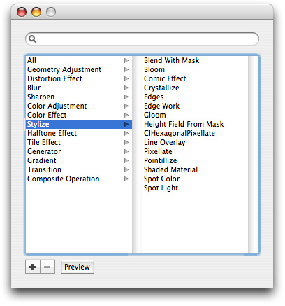
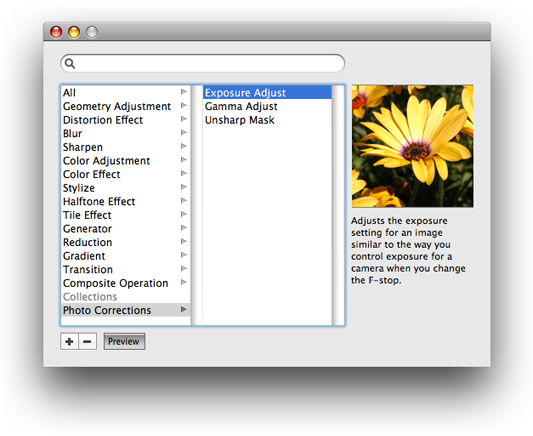
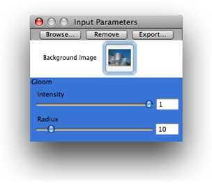
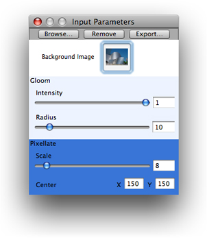
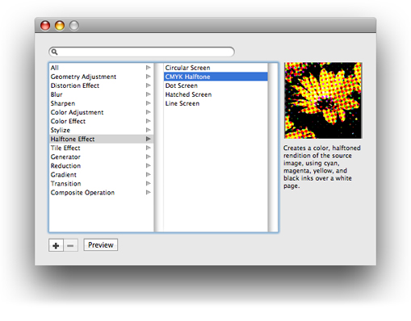
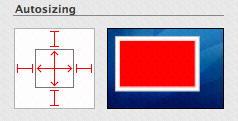

> 导航：[总目录](../../../README.md) · [documentation](../../../_indexes/documentation.md) · [ImageKit Programming Guide](Introduction%20to%20Image%20Kit%20Programming%20Guide.md)


[Next](Glossary.md)[Previous](Taking%20Snapshots%20and%20Setting%20Pictures.md)

# Browsing Filters and Setting Input Parameters

When Core Image was introduced in OS X v10.4, it provided developers with access to one hundred built-in image processing filters and the ability to create custom filters. Although image filters are easy to use, the Core Image programming interface does not provide a user interface for choosing filters and for setting filter input parameters. You either used Core Image to set up and apply filters programmatically or created and managed your own user interface. With the introduction of the Image Kit framework in OS X v10.5, all that has changed.

The `IKFilterBrowserPanel` and `IKFilterBrowserView` classes provide a filter browser that lets users:

- Browse filters by category
- Apply a filter and preview its effects
- Choose a filter
- Create filter collections
- See a description of the filter

As a developer, you can choose which filter categories the browser displays and whether or not to show a preview. After a user chooses a filter, you can use the `IKFilterUIView` class to obtain a view that contains controls for the input parameters of the filter.

This chapter:

- Describes the filter browser and filter user interface view
- Discusses the user interface options you can set
- Shows how to set up and use the filter browser in an application
- Provides instructions for obtaining a filter user interface view and adding it into an existing view

The `IKFilterBrowserPanel` and `IKFilterBrowserView` classes provides a panel that displays a list, by category, of Core Image filters available on the system, as shown in Figure 6-1. The search field at the top allows users to quickly find filters.

__Figure 6-1__  The filter browser



The user can click the Preview button to toggle a preview the preview off and on. The preview area lets the user see the effect of applying a filter using the default settings. Your application can set the preview image by registering for the notification `IKFilterBrowserWillPreviewFilterNotification`. A short description of the filter appears below the preview.

By clicking the plus (+) button, the user can add a custom group—referred to as a collection—as shown in Figure 6-2. The user can drag filters to the collection as a convenience for accessing sets of commonly used filters. Collections always appear below the built-in categories. To remove a collection, the user clicks the minus (–) button.

__Figure 6-2__  A Photo Corrections collection



You can control the visual appearance of the controls, including their size, in the filter browser by specifying the appropriate setting.

The `IKFilterUIView` class provides a view that contains controls for the input parameters of a filter. You can specify the size of the controls as miniature (`IKUISizeMini`), small (`IKUISizeSmall`), or regular (`IKUISizeRegular`).

A filter can optionally define basic, intermediate, advanced, and development sets of input parameters. These sets define which input parameters can be exposed in the user interface. For example, a filter that has many input parameters could define a basic set of input parameters for the typical consumer to control, and then programmatically set the other input parameters to default values. The same filter, however, can define an advanced set of input parameters that allow professional customers to control all the input parameters. Your application can request a specific set of input parameters. If the filter defines that set, then the filter user interface view reflects your request.

Figure 6-3 shows a window that displays a filter user interface view for the gloom filter provided by Core Image (`CIGloom`). The controls for this filter are labeled Intensity and Radius. In this example, the image that is processed by the filter is labeled Background image and appears in the image well shown in the figure.

__Figure 6-3__  Controls for the Gloom filter appear below the background image



The output of one Core Image filter can be directed to the input of another Core Image filter. Typically you’ll want to write an application that allows users to apply more than one Core Image filter to an image. Figure 6-4 shows an application that inserts user interface views for two Core Image filters into a window—the gloom filter and the pixelate filter (`CIPixellate`). The controls for the pixelate filter are labeled Scale and Center.

__Figure 6-4__  Two filter views in a window



So far you’ve seen the user interface views for the built-in filters provided by Core Image. Developers who write image units can provide a custom view for each of the filters defined in the image unit by implementing the `IKFilterCustomUIProvider` protocol. For information on image units, see _[Image Unit Tutorial](../Image%20Unit%20Tutorial/Introduction.md#apple-f4xwc4dqnrsv64tfmyxwi33df52wszbpkridimbqga2dkmzr)_.

Before you display the filter browser in an application, you need to load all the filters on the system by calling the [loadAllPlugIns](https://developer.apple.com/documentation/coreimage/ciplugin/1437653-loadallplugins) method of the [CIPlugIn](https://developer.apple.com/documentation/coreimage/ciplugin) class. Then you create a shared instance of the [IKFilterBrowserPanel](https://developer.apple.com/documentation/quartz/ikfilterbrowserpanel) class by calling the [filterBrowserPanelWithStyleMask:](https://developer.apple.com/documentation/quartz/ikfilterbrowserpanel/1503504-filterbrowserpanelwithstylemask) method. You can choose between the Aqua style (default) and the brushed metal look (`NSTexturedBackgroundWindowMask`). You show the filter browser by calling one of several methods, depending on whether you want the browser to appear as a sheet, a separate window, or in a custom view. In this section, you’ll see how to create a filter browser that opens in a separate window.

This section shows hot to create an application that opens a filter browser in a separate window. First you’ll set up the Xcode project, the project files, and the controller interface. Next you’ll add the necessary routines to the implementation file. Then, you’ll create the user interface in Interface Builder. Finally, you'll make a few refinements by adding an options dictionary and using a different background window.

Follow these steps to set up the project:

1. In Xcode, create a Cocoa application and name it `My Filter Browser`.
2. Add the Quartz and Quartz Core frameworks to the project.

   For details, see [Using the Image Kit in Xcode](Basics%20of%20Using%20the%20Image%20Kit.md#apple-f4xwc4dqnrsv64tfmyxwi33df52wszbpkridimbqga2dsmbxfvbuqmznknlti).
3. Choose File > New File.
4. Choose Objective-C Class and click Next.
5. Name the file `FilterBrowserController.m` and keep the option to create the header file. Then click Finish.
6. In `FilterBrowserController.h` import the Quartz Core and Quartz frameworks by adding these statements:

```objc
#import <Quartz/Quartz.h>
#import <QuartzCore/QuartzCore.h>
```
7. Create an instance variable for the filter browser. Your interface should look as follows:

```objc
@interface FilterBrowserController : NSObject {
     IKFilterBrowserPanel *filterBrowserPanel;
}
@end
```
8. Save the `FilterBrowserController.h` file.

To implement the filter browser routines, follow these steps:

1. Open the `FilterBrowserController.m` file.
2. In the implementation file, add an `awakeFromNib` method.

   This method needs to load all Core Image plug-ins, as shown:

```objc
- (void)awakeFromNib
{
    [CIPlugIn loadAllPlugIns];
}
```
3. Next you’ll write a `showFilterBrowserPanel:` method that is invoked when the user chooses the Open Filter Browser menu item. You’ll create the menu item later.

   The method first defines a constant to set the mask so that the filter browser uses the brushed metal look. This is optional. The default is to use the Aqua look. Note that you must provide a selector for the method that is invoked when the user closes the browser. You’ll write the selector method next.

```objc
- (IBAction)showFilterBrowserPanel:(id)sender
{
    int myStyleMask = NSTexturedBackgroundWindowMask;
    if(!filterBrowserPanel)
        filterBrowserPanel = [IKFilterBrowserPanel
               filterBrowserPanelWithStyleMask:myStyleMask];

    [filterBrowserPanel beginWithOptions:NULL modelessDelegate:self didEndSelector:@selector(browserPanelDidEndSelector:returnCode:contextInfo:) contextInfo:nil];

}
```
4. Add the `browserPanelDidEndSelector:returnCode:contextInfo:` selector method.

   This method simply takes the filter browser out of the screen list so that is it not visible.

```objc
- (void)browserPanelDidEndSelector:(NSWindow *)sheet returnCode:(int)returnCode contextInfo:(void *)contextInfo
{
    [sheet orderOut:self];
}
```
5. Save the `FilterBrowserController.m` file.
6. Open the `FilterBrowserController.h` file and add this method declaration, making sure that you insert it before the `@end` statement.

```objc
- (IBAction)showFilterBrowserPanel:(id)sender;
```
7. Save the `FilterBrowserController.h` file.

Set up the user interface in Interface Builder by following these steps:

1. Double-click the `MainMenu.nib` file to open Interface Builder.
2. Delete the window icon in the nib document window.
3. Choose File > Synchronize With Xcode.
4. Drag an `NSObject` from the library to the nib document window.
5. In the Identity inspector for the `NSObject`, choose FilterBrowserController from the Class pop-up menu.
6. Double-click the MainMenu icon in the nib document window.
7. Drag a submenu item from the Library to the MainMenu and place it between the Format and View menu items. Name the menu Filter.
8. Name the item in the Filter menu Show Filter Browser.
9. Control-drag from the Show Filter Browser menu item to the FilterBrowserController and in the connections panel choose `showFilterBrowserPanel:`.
10. Save the nib file.
11. In Xcode, click Build and Go.

    When the application launches, choose Show Filter Browser from the Filter menu.

    Try the Search feature. Click the Preview button to toggle the preview off and back on. Then click the plus (+) button and add a collection. Drag a few filters into your collection.
12. Quit the application.

    Now that the application runs, you’ll make a few refinements by adding an options dictionary and using a different window background.

There are a number of options you can set to modify the filter browser user interface. Follow these steps to change the options:

1. In Xcode, open the `FilterBrowserController.m` file and add a method that creates a dictionary of options. Make sure that you place this method before the `showFilterBrowserPanel:` method .

   The Image Kit provides constants that let you specify the size of controls to use in the browser. The default is to use regular size controls. You’ll change the size to miniature by using the key constant `IKUISizeFlavor` and the value `IKUISizeMini`.

```objc
-(NSDictionary *)createFilterBrowserUIOptions
{
 NSMutableDictionary *options = [[NSMutableDictionary alloc] init];
 [options setObject:IKUISizeMini forKey:IKUISizeFlavor];
 return options;
}
```

   When you write a more complex application, you could let the user set the control size as a preference. Then your options dictionary method could set the options based on user preferences.
2. Modify the `showFilterBrowserPanel:` method so that it calls the `createFilterBrowserUIOptions` method.

   In addition, set the style mask to `0` to get the default look.

   After modification, the method to show the filter browser should look as follows:

```objc
- (IBAction)showFilterBrowserPanel:(id)sender
{
  int myStyleMask = 0;
  NSDictionary * options = [self createFilterBrowserUIOptions];

  if(!filterBrowserPanel)
    filterBrowserPanel = [IKFilterBrowserPanel
        filterBrowserPanelWithStyleMask:myStyleMask];

  [filterBrowserPanel beginWithOptions:options
     modelessDelegate:self
     didEndSelector:@selector(browserPanelDidEndSelector:returnCode:contextInfo:)
     contextInfo:nil];

}
```
3. In Xcode, click Build and Go.

   After these modifications, the filter browser should look similar to the following:

   

   Note that if you created a collection previously, the collection appears in the filter browser. Collections are persistent across launches of an application, on a per user basis.

This section shows how to get a view for the input parameters of a filter and insert that filter user interface view into an existing view. You’ll build upon the code in the last section by first adding code to respond to a user event—a double click—in the filter browser. When the user double-clicks the name of a filter in the filter browser, the application requests a filter user interface view for the selected filter and displays that view, as shown in [Figure 6-3](#apple-f4xwc4dqnrsv64tfmyxwi33df52wszbpkridimbqga2dsmbxfvbuqobnknltk) and [Figure 6-4](#apple-f4xwc4dqnrsv64tfmyxwi33df52wszbpkridimbqga2dsmbxfvbuqobnknlto).

You need to register for a user event notification—either `IKFilterBrowserFilterSelectedNotification` or `IKFilterBrowserFilterDoubleClickNotification` of the `IKFilterBrowserPanel` class. After the user chooses a filter, you call the `viewForUIConfiguration:excludedKeys:` method of the `CIFilter` class (an Image Kit addition) to obtain a view for the filter. You can provide a configuration dictionary to specify the size of controls to use for the filter input parameters, just as you did for the filter browser itself. You exclude keys for input parameters that you don’t want to show (such as the input image which, in most cases, will already be displayed onscreen).

The application you’ll build here doesn’t perform any image processing. It simply shows how to set up the user interface. However, it does show how to stack several filter user interface views together. [Applying Filters to an Image](#apple-f4xwc4dqnrsv64tfmyxwi33df52wszbpkridimbqga2dsmbxfvbuqobnknltm) discusses using the Image Kit user interface together with Core Image.

Follow these steps to set up the filter view controller:

1. In Xcode, open the project that you created in the last section.
2. Choose File > New File.
3. Choose Objective-C Class and click Next.
4. Name the file `FilterViewController.m` and keep the option to create the header file. Then click Finish.

   This is the controller for the filter user interface view. It obtains the filter, gets a view that contains the controls for the input parameters of the filter, and adds the view to the user interface.
5. In the `FilterViewController.h` file, add statements to import the Quartz and Quartz Core frameworks. You’ll also need to add a directive for the FilterBrowserController class to allow the two controllers to communicate.

```objc
#import <Quartz/Quartz.h>
#import <QuartzCore/QuartzCore.h>

@class FilterBrowserController;
```
6. Add two `IBOutlet` objects to the interface—one for a view that contains the filter UI view and another for the filter browser controller. You’ll set these up in Interface Builder later.

   The interface should look as follows:

```objc
@interface FilterViewController : NSObject {
    IBOutlet id    filterUIContainerBox;
    IBOutlet FilterBrowserController *browserController;
}
@end
```
7. Add a method signature for an `addFilter:` method.

   This is the method that adds the filter user interface view to the panel. You’ll write the method later. When the user double-clicks a filter name, the method is invoked and passed a notification object that contains the name of the selected filter.

```objc
- (void)addFilter:(NSNotification*)notification;
```
8. Save the `FilterViewController.h` file.

To implement the routines necessary for the filter view controller, follow these steps:

1. In Xcode, open the `FilterViewController.m` file.
2. Add an `awakeFromNib` method. This method sets the background color of the filter view and makes sure that the panel is in front.

```objc
- (void)awakeFromNib
{
    [[filterUIContainerBox window] setBackgroundColor:[NSColor whiteColor]];
    [[filterUIContainerBox window] orderFront:self];
}
```
3. Write a method that creates and returns a dictionary of user interface options for the view. You’ll set the size of the filter input parameter controls. (You can set additional options if you’d like.)

```objc
-(NSDictionary *)createFilterBrowserUIOptions
{
  NSMutableDictionary *options = [[NSMutableDictionary alloc] init];
 [options setObject:IKUISizeMini forKey:IKUISizeFlavor];

 return options;
}
```
4. Write an `addFilter:` method.

   This method gets the view for the selected filter and inserts it into the panel you created previously in Xcode. The embedded comments explain what the code does.

```objc
- (void)addFilter:(NSNotification*)notification
{
    // Get the filter name from the notification.
    NSString    *filterName = [notification object];
    // Create a CIFilter object.
    CIFilter    *newFilter = [CIFilter filterWithName:filterName];
    // Add a filter user interface view only if a filter object exists.
    if(newFilter)
    {
        // Get  the frame rectangle that contains the filter UI container.
        NSRect  windowFrame = [[filterUIContainerBox window] frame];
        // Set the default values for the filter.
        [newFilter setDefaults];
        // Get an options dictionary, which specifies the size of the controls.
        NSDictionary    *options = [self createFilterBrowserUIOptions];
        // Create  a view for the filter, exclude the input image key.
        IKFilterUIView    *filterContentView =
             [newFilter viewForUIConfiguration:options
                        excludedKeys:[NSArray arrayWithObject:@"inputImage"]];
        // Retrieve  the bounding rectangle for the view.
        NSRect  contentBounds = [filterContentView bounds];
       // Make the view width match the width of the filter UI container.
        contentBounds.size.width = [filterUIContainerBox bounds].size.width;
       // Set up automatic resizing to accommodate additional views.
       [filterContentView setAutoresizingMask:NSViewMinYMargin];
        // Increase the window frame size to accommodate the filter UI view.
        windowFrame.size.height += [filterContentView bounds].size.height;
        windowFrame.origin.y -= [filterContentView bounds].size.height;
        // Set the frame of the filter UI container  to be the window frame.
        // Display the changes and animate for a nice effect.
        [[filterUIContainerBox  window] setFrame:windowFrame
                                        display:YES animate:YES];
        // Add the filter UI view to the filter container.
        [filterUIContainerBox  addSubview:filterContentView];

}
```
5. Save the `FilterViewController.m` file.

Next you’ll need to make a few modifications to the filter browser controller to allow the view and browser controllers to communicate. You’ll also need to register for a notification whenever the user double-clicks a filter name. Follow these steps:

1. Open the `FilterBrowserController.h` file and add this `import` statement:

```objc
#import "FilterViewController.h"
```
2. Add an `IBOutlet` for the `FilterViewController`. The modified interface should now look like this:

```objc
@interface FilterBrowserController : NSObject {
    IKFilterBrowserPanel    *filterBrowserPanel;
    IBOutlet FilterViewController *viewController;

}

- (IBAction)showFilterBrowserPanel:(id)sender;

@end
```
3. Open the `FilterBrowserController.m` file and modify the `awakeFromNib` method to register for the double-click notification setting the observer as `FilterViewController` and the method as `addFilter:`.

   The `awakeFromNib` method should now looks as follows:

```objc

- (void)awakeFromNib
{
    [CIPlugIn loadAllPlugIns];
    [[NSNotificationCenter defaultCenter] addObserver:viewController
                         selector:@selector(addFilter:)
                         name:IKFilterBrowserFilterDoubleClickNotification
                         object:nil];

}
```
4. Save and close the `FilterBrowserController.h` and `FilterBrowserController.m` files.

Set up the user interface in Interface Builder by following these steps:

1. Double-click the `MainMenu.nib` file to open Interface Builder.
2. Drag a panel from the Library to the nib document window.
3. Change the name of the Panel icon to FilterInputs.
4. In the Attributes inspector, change the title of the panel to Filter Input Parameters.
5. Choose File > Synchronize With Xcode.
6. Drag an Object (`NSObject`) from the Library to the nib document window.
7. In the Identity inspector, select FilterViewController from the Class pop-up menu.
8. In the nib document window, control-drag from the FilterBrowserController icon to the FilterViewController icon. Then in the connections panel, choose the `viewController` outlet.
9. Control-drag from the FilterViewController icon to the FilterBrowserController icon. Then connect to the `browserController` outlet.
10. Control-drag from the FilterInputs icon to the FilterViewController icon. Then in the connections panel choose `delegate`.
11. Drag a Custom View to the panel. Make sure to hold it over the panel until the panel opens, then drop it in the opened panel.
12. Control-drag from the FilterViewController icon to the custom view. Then in the connections panel choose `filterUIContainerBox`.
13. Click the custom view in the panel.
14. Set the size of the view to 320 by 2 and make sure that the view (which will be a thin line) is positioned at the top of the window.

    This is the view to which you’ll add the filter user interface view. Unless you want to start by showing something in this view, its height can be negligible.
15. Set the springs and struts for the Custom View like this:

    
16. Set the springs and struts for the _content view_ of the Custom View so that only the struts—which are the outer Autosizing elements —are set.
17. Set the size of the panel to 320 by 8.

    Unless you want to show something in the panel other than filter input parameters, the panel height can be as small as possible.
18. Save the `MainMenu.nib` file.
19. In Xcode, click Build and Go.

    Choose Show Filter Browser from the Filter menu. Double-click one or more filters to test your code. Each time you double-click a filter name, the Filter Input Parameters panel should show the input parameters for that filter.

You’ve seen in the previous sections how to write code that presents a simple user interface for the filter browser and filter input parameters. A full-featured image processing application requires a more sophisticated user interface. For example, it would:

- Show the filter input parameter panel only after an image is open and a filter is selected.
- Add code to delineate visually the input parameters of each filter, by adding a bounding box, a filter name, varying the background color for each filter UI view, or by some other means.
- Allow the user to delete a filter from the input parameters panel and possible rearrange the order.

A fully functioning image processing application also requires code that opens and saves images and applies selected filters to an image. The IUUIDemoApplication example provided with the developer tools for OS X v10.5 provides most of the functionality needed in a full-featured image processing application. Now that you know how the user interface portion of the filter browser and filters works, you may want to take a look at IUUIDemoApplication to see how to combine the user interface code with code that applies Core Image filters.

You can find the application in:

`/Developer/Examples/Quartz/Core Image/`

IUUIDemoApplication has a controller for the filter browser and another controller for the filter user interface view. It also creates an object that tracks filters and another that tracks filter user interface views. It uses the Core Image programming interface to process images.

If you are not familiar with Core Image, see:

- _[Core Image Programming Guide](../Core%20Image%20Programming%20Guide/About%20Core%20Image.md#apple-f4xwc4dqnrsv64tfmyxwi33df52wszbpkridgmbqgaytcobv)_
- _[Core Image Reference Collection](https://developer.apple.com/documentation/coreimage)_

[Next](Glossary.md)[Previous](Taking%20Snapshots%20and%20Setting%20Pictures.md)

