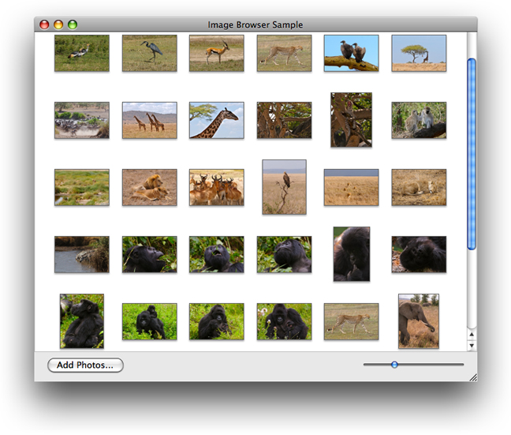
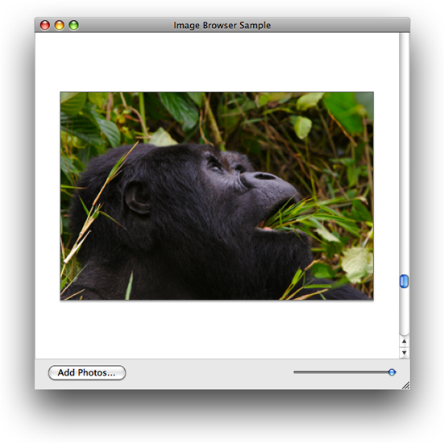
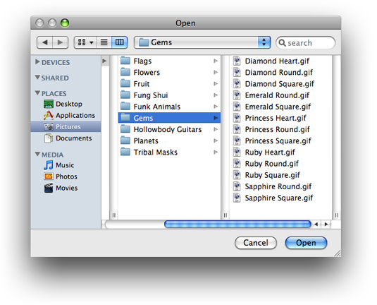
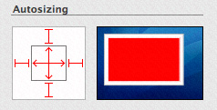

> 导航：[总目录](../../../README.md) · [documentation](../../../_indexes/documentation.md) · [ImageKit Programming Guide](Introduction%20to%20Image%20Kit%20Programming%20Guide.md)


[Next](Showing%20Slides.md)[Previous](Viewing%2C%20Editing%2C%20and%20Saving%20Images%20in%20an%20Image%20View.md)

# Browsing Images

Applications such as iPhoto provide a rich user experience for viewing digital image collections. By using the [IKImageBrowserView](https://developer.apple.com/documentation/quartz/ikimagebrowserview) class and its related protocols—`IKImageBrowserDataSource`, `IKImageBrowserDelegate`, and `IKImageBrowserItem`—any application can support browsing large numbers of images efficiently.

This chapter describes the user interface provided by the [IKImageBrowserView](https://developer.apple.com/documentation/quartz/ikimagebrowserview) class, discusses the related protocols, lists the image representation types that the browser can display, and includes step-by-step instructions for creating an application that uses the image browser.

The [IKImageBrowserView](https://developer.apple.com/documentation/quartz/ikimagebrowserview) class provides a view that displays an array of images. The size of each image depends on the zoom value that you set for the image browser view. Typically, an application provides a control, such as the slider shown in Figure 3-1, that allows the user to control the zoom value.

__Figure 3-1__  The image browser view



When fully zoomed in, the image browser displays a single image, as shown in Figure 3-2.

__Figure 3-2__  The image browser zoomed



You can set up the image browser view to support dragging images into the window to add them as well as dragging images within the window to rearrange them. In addition to drag and drop, your application should support adding photos through the `NSOpenPanel` class, as shown in Figure 3-3.

__Figure 3-3__  Adding images



The `IKImageBrowserView` class also supports scrolling (see [Figure 3-2](#apple-f4xwc4dqnrsv64tfmyxwi33df52wszbpkridimbqga2dsmbxfvbuqnjnknltg)), which is necessary for large image sets or when the user has the zoom value set such that the image set doesn’t fit in the view. Your application needs to take one of the following approaches:

- Embed the image browser in an [NSScrollView](https://developer.apple.com/documentation/appkit/nsscrollview) object, which is the typical approach.
- Connect the image browser to an [NSScroller](https://developer.apple.com/documentation/appkit/nsscroller) object. This approach is a bit more efficient but doesn’t allow auto-hiding of the scrollers.

This section gives an overview of the Image Kit classes and protocols needed to write a full-featured image browser application and describes how such an application works. After reading this section you’ll be ready to read the rest of this chapter, which provides step-by-step instructions for these programming tasks:

- [Displaying Images in an Image Browser](#apple-f4xwc4dqnrsv64tfmyxwi33df52wszbpkridimbqga2dsmbxfvbuqnjnknltk)
- [Supporting Zoom](#apple-f4xwc4dqnrsv64tfmyxwi33df52wszbpkridimbqga2dsmbxfvbuqnjnknltm)
- [Supporting Removing and Reordering Items](#apple-f4xwc4dqnrsv64tfmyxwi33df52wszbpkridimbqga2dsmbxfvbuqnjnknlto)
- [Supporting Drag and Drop](#apple-f4xwc4dqnrsv64tfmyxwi33df52wszbpkridimbqga2dsmbxfvbuqnjnknltq)
- [Setting Browser and Cell Appearance](#apple-f4xwc4dqnrsv64tfmyxwi33df52wszbpkridimbqga2dsmbxfvbuqnjnknlts)

An image browser application has a number of requirements. In addition to creating an instance of the `IKImageBrowserView` class, you’ll need to provide a data source that provides the items to show in the image browser. You’ll also need to implement the required methods of the `IKImageBrowserDataSource` and `IKImageBrowserItem` protocols.

The `IKImageBrowserDataSource` protocol defines methods for accessing the data source. You use this protocol to add and remove items, to move items, and to obtain information about individual items or groups. Your application must implement two methods:

- `numberOfItemsInImageBrowser:` returns the number of items in the image browser.
- `imageBrowser:itemAtIndex:`returns the object located at a specified index. The returned object must implement the required methods of the `IKImageBrowserItem` protocol.

Methods that support editing or that return group information are optional. See _[IKImageBrowserDataSource Protocol Reference](https://developer.apple.com/documentation/quartz/imagekit/ikimagebrowserdatasource_protocol)_ for details.

The `IKImageBrowserItem` protocol defines required and optional methods that the browser view uses to access a particular item from the data source. You must implement three methods:

- `imageRepresentationType` returns the image representation type. An image browser view can handle a variety of image representations. You must specify which representation type the image browser view uses by returning the appropriate constant. Table 3-1 lists the constants.
- `imageUID` returns a string that uniquely identifies the data source item, such as the string that represents the path to the item.
- `imageRepresentation` returns the representation (such as the path to an image) for an item in the image browser view. The representation must match the image representation type.

You can optionally implement methods that return the image version, title, subtitle, and whether or not the item can be selected. See _[IKImageBrowserItem Protocol Reference](https://developer.apple.com/documentation/quartz/imagekit/ikimagebrowseritem_protocol)_ for details.

__Table 3-1__  Image representations and types

| Image representation constants | Image representation data types |
| `IKImageBrowserPathRepresentationType` | A path (`NSString` object) |
| `IKImageBrowserNSURLRepresentationType` | `NSURL` object |
| `IKImageBrowserNSImageRepresentationType` | `NSImage` object |
| `IKImageBrowserCGImageRepresentationType` | `CGImage` object |
| `IKImageBrowserCGImageSourceRepresentationType` | `CGImageSource` object |
| `IKImageBrowserNSDataRepresentationType` | `NSData` object |
| `IKImageBrowserNSBitmapImageRepresentationType` | `NSBitmapImageRep` object |
| `IKImageBrowserQTMovieRepresentationType` | `QTMovie` object |
| `IKImageBrowserQTMoviePathRepresentationType` | A path (`NSString` object) to a `QTMovie` object |
| `IKImageBrowserQCCompositionRepresentationType` | `QCComposition` object |
| `IKImageBrowserQCCompositionPathRepresentationType` | A path (`NSString` object) to a `QCComposition` object |
| `IKImageBrowserQuickLookPathRepresentationType` | A path (`NSString` object) to load an object using the Quick Look framework |
| `IKImageBrowserIconRefRepresentationType` | `IconRef` object |
| `IKImageBrowserIconRefPathRepresentationType` | A path (`NSString` object) to an `IconRef` object |

The `IKImageBrowserDelegate` informal protocol defines methods that respond to user events, such as a selection. See _[IKImageBrowserDelegate Protocol Reference](https://developer.apple.com/documentation/quartz/imagekit/ikimagebrowserdelegate_protocol)_ for a description of the delegate methods.

When the sample application that you’ll build in the rest of this chapter launches, it allocates two mutable arrays, one that represents images that are displayed in the image browser view (image array) and another that represents images that need to be imported into the image browser view (import images array). Initially, both arrays are empty. The application then performs any setup work for the image browser view, such as setting the style of the cells and whether the movement of items is animated. After the setup is complete, the window with the image browser view opens without any images. The image browser view has a vertical scroll bar. The window has a button for importing images.

Clicking the Import Images button invokes an action to add images to the image browser view. The application uses an instance of the `NSOpenPanel` class to solicit a selection from the user. If the user makes a selection, the Open panel returns the selection as a path. This application allows users to choose either a file or a folder. A folder can contain files, other folders, or both files and folders. However, files are the only items that are added to the image browser view, which means that the application must traverse all paths until each resolves to a single file.

The application creates a data source object—an image object—for each file. The object has one instance variable, the path to the file (represented as an `NSString` object). Each image object is appended to the import images array. After all the objects are added to that array, the application appends that array to the images array. The application then removes all objects from the import images array so that the array can be ready to import more images should the user choose to do so. Finally the application calls the `reloadData` method of the `IKImageBrowserView` class to populate the image browser view with the images represented by the import images array.

The image browser application has five major parts to its implementation:

- The nib file. You need to add an Image Browser view (`IKImageBrowserView` class) to a window. You’ll add a scroll view for the vertical scroller, and a button for importing images.
- The window controller. This is the main class. You create it in Xcode and then instantiate it in Interface Builder. The window controller is the data source of the image browser view. The controller manages the mutable array for the image objects that represent the items in the image browser view and the mutable array for imported image objects. In Interface Builder, you’ll need to make the appropriate connections between the image browser view and the window controller.
- The `IKImageBrowserDataSource` protocol. You need to implement the required methods for this protocol: `numberOfItemsInImageBrowser:` and `imageBrowser:itemAtIndex:`.
- The `IKImageBrowserItem` protocol. You need to declare an interface for an image object that represents a single item in the image browser view. In the implementation for the image object, you need to provide the required methods for this protocol: `imageUID`, `imageRepresentationType`, and `imageRepresentation`.
- Image importing. You need to set up an Open panel and write code that traverses all folder paths until all paths are resolved to individual items.

The sections that follow provide step-by-step instructions for writing the image browser application.

This section shows how to create an application that displays images in an image browser. First, you’ll set up the Xcode project, the project files, and the interface for the image browser controller. Then you’ll add routines to the implementation. Finally, you’ll set up the user interface in Interface Builder.

Follow these steps to set up the project:

1. Open Xcode and create a Cocoa application named `Browse Images`.
2. Add the Quartz framework.

   For more details, see[Using the Image Kit in Xcode](Basics%20of%20Using%20the%20Image%20Kit.md#apple-f4xwc4dqnrsv64tfmyxwi33df52wszbpkridimbqga2dsmbxfvbuqmznknlti).
3. Choose File > New File.
4. Choose “Objective-C Class NSWindowController subclass” and click Next.
5. Name the file `ImageBrowserController.m` and keep the option to create the header file. Then click Finish.
6. In the `ImageBrowserController.h` file, import the Quartz framework by adding this statement:

   `#import <Quartz/Quartz.h>`
7. Add `IBOutlet` outlet for the image browser and two mutable arrays .

   One array will hold paths to images that are currently displayed in the browser. The other array will hold paths to images that are about to be imported into the browser.

```objc
@interface ImageBrowserController : NSWindowController {

    IBOutlet id mImageBrowser;
    NSMutableArray * mImages;
    NSMutableArray * mImportedImages;
}
@end
```
8. Add the following method signature:

```objc
- (IBAction) addImageButtonClicked:(id) sender;
```
9. Save the `ImageBrowserController.h` file.

Follow these steps to implement the main tasks of the image browser application:

1. Open the `ImageBrowserController.m` file.
2. In the implementation file, add an `awakeFromNib` method.

   This method allocates and initializes the images and imported images arrays. For visual interest, the method also sets the image browser to animate as it updates.

```objc
- (void) awakeFromNib
{
    mImages = [[NSMutableArray alloc] init];
    mImportedImages = [[NSMutableArray alloc] init];

    [mImageBrowser setAnimates:YES];
}
```
3. Add a method for updating the data source for the image browser controller.

   This method needs to add the recently imported items to the image objects array, then empty the imported images array. Finally it reloads the image browser, which causes the image browser to update the display with the recently added images.

```objc
- (void) updateDatasource
{
    [mImages addObjectsFromArray:mImportedImages];
    [mImportedImages removeAllObjects];
    [mImageBrowser reloadData];
}
```
4. Implement the two required methods of the image browser data source protocol.

   The number of items in the image browser is simply the number of items in the images array. An item’s index is simply its index in the images array.

```objc
- (int) numberOfItemsInImageBrowser:(IKImageBrowserView *) view
{
    return [mImages count];
}

- (id) imageBrowser:(IKImageBrowserView *) view itemAtIndex:(int) index
{
    return [mImages objectAtIndex:index];
}
```
5. In the `IKImageBrowserController.m` file, immediately after the import statement, create an interface for a data source object.

   The data source object defines one instance variable, a string that is a path to an item to display.

```objc
@interface MyImageObject : NSObject{
    NSString * mPath;
}
@end
```
6. In the same file, create the implementation for the data source object `MyImageObject`. In the next three steps, you’ll be entering methods between the the following two statements, as you would normally for a Cocoa class.

```objc
@implementation MyImageObject
 // Methods here
@end
```
7. Write a method that sets the path object.

```objc
- (void) setPath:(NSString *) path
{
    if(mPath != path){
        mPath = path;
    }
}
```
8. Implement the three required methods of the `IKImageBrowserItem` protocol.

   The data source is a file path representation and its unique identifier is the path itself.

```objc
- (NSString *)  imageRepresentationType
{
    return IKImageBrowserPathRepresentationType;
}

- (id)  imageRepresentation
{
    return mPath;
}

- (NSString *) imageUID
{
    return mPath;
}
```
9. Now that you are done with the MyImageObject implementation, you need to add a method to the ImageBrowserController implementation. This method is invoked when the user clicks an Import Images button.

   This method calls a routine that displays the Open panel and returns the path chosen by the user. If there is a path, the method sets up an independent thread, calling the `addImagesWithPaths:` method, which you’ll write next. You’ll write an open files routine later. Check to make sure that you add the following method in the ImageBrowserController implementation,

```objc
- (IBAction) addImageButtonClicked:(id) sender
{
    NSArray *path = openFiles();

    if(!path){
        NSLog(@"No path selected, return...");
        return;
    }
   [NSThread detachNewThreadSelector:@selector(addImagesWithPaths:) toTarget:self withObject:path];
}
```
10. Write a method that adds an array of paths to the data source.

    The method parses all paths in the `paths` array and adds them to a temporary array. (You’ll write the `addImagesWithPath:` method in the next step. Note this is _path_, singular.) It then updates the data source in the main thread.

    Add this method after the `addImageButtonClicked:` method.

```objc
- (void) addImagesWithPaths:(NSArray *) paths
{
    int i, n;


    n = [paths count];
    for(i=0; i<n; i++){
        NSString *path = [paths objectAtIndex:i];
        [self addImagesWithPath:path recursive:NO];
    }

    [self performSelectorOnMainThread:@selector(updateDatasource)
                           withObject:nil
                        waitUntilDone:YES];

}
```
11. Write the method that adds images at a path.

    This method checks to see if the path identifies a directory or a file. If the path is a directory, the code parses the directory content and calls the `addImagesAtPath:` method. If the path is to a file, the code calls a method that adds a single image to the imported images array. You’ll write the `addAnImageWithPath:` method next.

    Note this method has an option to enable or disable recursion. Enabling recursion allows you to traverse nested folders to retrieve the individual items in each folder.

    Add this method before the `addImagesWithPaths:` method.

```objc
- (void) addImagesWithPath:(NSString *) path recursive:(BOOL) recursive
{
    int i, n;
    BOOL dir;

    [[NSFileManager defaultManager] fileExistsAtPath:path isDirectory:&dir];
    if(dir){
        NSArray *content = [[NSFileManager defaultManager]
                              directoryContentsAtPath:path];
        n = [content count];
       for(i=0; i<n; i++){
            if(recursive)
               [self addImagesWithPath:
                     [path stringByAppendingPathComponent:
                            [content objectAtIndex:i]]
                            recursive:NO];
            else
              [self addAnImageWithPath:
                     [path stringByAppendingPathComponent:
                           [content objectAtIndex:i]]];
        }
    }
    else
        [self addAnImageWithPath:path];
}
```
12. Write a method that adds a single image to the imported images array.

    The method creates an image object and adds the path to the object. The code then adds the image object to the imported images array.

    Add this method before the `addImagesWithPath:recursive:` method.

```objc
- (void) addAnImageWithPath:(NSString *) path
{
    MyImageObject *p;

    p = [[MyImageObject alloc] init];
    [p setPath:path];
    [mImportedImages addObject:p];
}
```
13. Write an open files routine that displays an `NSOpenPanel` object and retrieves the path chosen by the user.

    Place this routine at the top of the `ImageBrowserController.m` file, immediately after the import statement.

```
static NSArray *openFiles()
{
    NSOpenPanel *panel;

    panel = [NSOpenPanel openPanel];
    [panel setFloatingPanel:YES];
    [panel setCanChooseDirectories:YES];
    [panel setCanChooseFiles:YES];
    int i = [panel runModal];
    if(i == NSOKButton){
        return [panel URLs];
    }

    return nil;
}
```
14. Build the Project.

    This ensures that Interface Builder detects the action that you added.
15. Save the `IKImageBrowserController.m` file.

Set up the user interface in Interface Builder by following these steps:

1. Double-click the `MainMenu.nib` file to open Interface Builder.
2. Choose File > Synchronize With Xcode.
3. If it’s not already open, double-click the Window icon in the nib document window.
4. Drag a Image Browser View from the Library to the window and resize the view so that you leave space at the bottom of the window for a button.
5. In the Size inspector for the view, make sure that the Autosizing springs and struts look as follows:

   
6. Choose Layout > Embed Objects In > Scroll View.
7. In the Scroll View Attributes inspector, leave Show Vertical Scroller selected but deselect Show Horizontal Scroller.

   This will allow users to scroll easily through large numbers of images.
8. In the Size pane, set the Autosizing springs and struts so they look the same as those shown in Step 5.
9. Drag an Object (`NSObject`) from the Library to the nib document window.
10. In the Identity inspector, choose ImageBrowserController from the Class pop-up menu.
11. Control-drag from the ImageBrowserController icon to the title bar of the window. Then connect to `window` in the connections panel.
12. Control-drag from the ImageBrowserController icon to the `IKImageBrowserView` view. Then connect to `mImageBrowser` in the connections panel.
13. Control-drag from the `IKImageBrowserView` view to the ImageBrowserController icon. Then connect to _dataSource in the connections panel.
14. Control-drag from the window icon to the controller icon. Then connect to `delegate` in the connections panel.
15. Drag a Push Button from the library to the lower right portion of the window and label it Import Images.
16. In the Size inspector, set Autosizing to have outer struts on the left and bottom.
17. Control-drag from the Import Images button to the the ImageBrowserController icon and connect to the `addImageButtonClicked:` action in the connections panel.
18. Save the nib file.
19. In Xcode, click Build and Go.

    Click the Import Images button and make sure that the image browser works.

Next you’ll add the ability for the user to zoom images. You’ll define zoom factors, add controls to the interface, and then add a zoom method that’s invoked by the controls.

To add the ability for users to zoom images in an image browser:

1. Add a zoom method.

   This method responds to the zoom controls in the user interface. You’ll add the controls later. The method needs to set the zoom value and then signal the need to update the browser display.

```objc
- (IBAction) zoomSliderDidChange:(id)sender
{
    [mImageBrowser setZoomValue:[sender floatValue]];
    [mImageBrowser setNeedsDisplay:YES];
}
```
2. Add the method signature to the `ImageBrowserController.h` file.

```objc
- (IBAction) zoomSliderDidChange:(id)sender;
```
3. Save the `ImageBrowserController.h` and `ImageBrowserController.m` files.
4. Double-click the `MainMenu.nib` file to open Interface Builder.
5. Drag a Horizontal Slider from the Library to the browser window and position it in the lower left of the window.
6. In the Size inspector for the slider and set the Autosizing struts appropriately.
7. Set the size to Mini.
8. In the Attributes inspector set the State to Continuous to cause the action method to send its state continuously while the mouse is down.
9. Set the slider minimum and maximum values.

   Enter `0` for the minimum value and `1.0` for the maximum value.
10. Control-drag from the slider to the ImageBrowserController icon and in the connections panel choose `zoomSliderDidChange:`.
11. Save the `MainMenu.nib` file.
12. In Xcode, click Build and Go.

    Try the zoom controls and make sure they work.

The image browser will be far more useful if users can remove items and reorder them. You need to set the option to allow reordering. Then you need to implement the methods defined by the `IKImageBrowserDataSource` protocol that support editing items.

Follow these steps to support removing and reordering:

1. Open the `ImageBrowserController.m` file.
2. Implement the `IKImageBrowserDataSource` protocol method for removing items.

```objc
- (void) imageBrowser:(IKImageBrowserView *) view removeItemsAtIndexes: (NSIndexSet *) indexes
{
    [mImages removeObjectsAtIndexes:indexes];
}
```
3. Implement the `IKImageBrowserDataSource` protocol method to move items from one location to another.

   This method first removes items from the data source and stores them temporarily in an array. Then it inserts the removed items into the images array at the new location.

```objc
- (BOOL) imageBrowser:(IKImageBrowserView *) view  moveItemsAtIndexes: (NSIndexSet *)indexes toIndex:(unsigned int)destinationIndex
{
      int index;
      NSMutableArray *temporaryArray;

      temporaryArray = [[NSMutableArray alloc] init];
      for(index=[indexes lastIndex]; index != NSNotFound;
                         index = [indexes indexLessThanIndex:index])
      {
          if (index < destinationIndex)
              destinationIndex --;

          id obj = [mImages objectAtIndex:index];
          [temporaryArray addObject:obj];
          [mImages removeObjectAtIndex:index];
      }

      // Insert at the new destination
      int n = [temporaryArray count];
      for(index=0; index < n; index++){
          [mImages insertObject:[temporaryArray objectAtIndex:index]
                        atIndex:destinationIndex];
      }

      return YES;
}
```
4. In the `awakeFromNib` method, set the image browser to allow reordering.

   After modification, the method should look as follows:

```objc
- (void) awakeFromNib
{
    mImages = [[NSMutableArray alloc] init];
    mImportedImages = [[NSMutableArray alloc] init];

    [mImageBrowser setAllowsReordering:YES];
    [mImageBrowser setAnimates:YES];

}
```
5. In Xcode, click Build and Go.

   Add images to the browser. Then try deleting a few items. Select several items and move them to a new location.

It is convenient for users to be able to drag items directly to the browser. Drag and drop requires that you set a dragging destination delegate and implement three methods of the `NSDraggingDestination` protocol. (See _[Drag and Drop Programming Topics](../../Cocoa/Drag%20and%20Drop%20Programming%20Topics/Introduction%20to%20Drag%20and%20Drop.md#apple-f4xwc4dqnrsv64tfmyxwi33df52wszbpgeydambqga3ds2i)_.)

To support the ability for users to drag and drop images, follow these steps:

1. In the `awakeFromNib` method, set the dragging destination delegate for the image browser.

   After modification, the method should look as follows:

```objc
- (void) awakeFromNib
{
    mImages = [[NSMutableArray alloc] init];
    mImportedImages = [[NSMutableArray alloc] init];
    [mImageBrowser setAllowsReordering:YES];
    [mImageBrowser setAnimates:YES];
    [mImageBrowser setDraggingDestinationDelegate:self];
}
```
2. Implement the `performDragOperation:` method of the `NSDraggingDestination` protocol.

   This method looks for paths in the pasteboard. If there are paths, the method retrieves them, adds them to the data source, then reloads the image browser.

```objc
- (BOOL) performDragOperation:(id <NSDraggingInfo>)sender
{
    NSData *data = nil;
    NSString *errorDescription;
    NSPasteboard *pasteboard = [sender draggingPasteboard];

    if ([[pasteboard types] containsObject:NSFilenamesPboardType])
        data = [pasteboard dataForType:NSFilenamesPboardType];
    if(data){
        NSArray *filenames = [NSPropertyListSerialization
            propertyListFromData:data
                mutabilityOption:kCFPropertyListImmutable
                          format:nil
                errorDescription:&errorDescription];
        int i;
        int n = [filenames count];
        for(i=0; i<n; i++){
            [self addImagesWithPath:[filenames objectAtIndex:i] recursive:NO];
        }
        [self updateDatasource];
    }

    return YES;
}
```
3. Implement the `draggingEntered:` method of the `NSDraggingDestination` protocol.

```objc
- (NSDragOperation)draggingEntered:(id <NSDraggingInfo>)sender
{
    return NSDragOperationCopy;
}
```
4. Implement the `draggingUpdated:` method of the `NSDraggingDestination` protocol.

```objc
- (NSDragOperation)draggingUpdated:(id <NSDraggingInfo>)sender
{
    return NSDragOperationCopy;
}
```
5. In Xcode, click Build and Go.

   Drag some images to the image browser. Then add some more images. Note that images dragged to the browser are added at the end.

The [IKImageBrowserView](https://developer.apple.com/documentation/quartz/ikimagebrowserview) class provides several methods that control the image browser and browser item appearance. You can set the display style for cells so that the cells are shadowed, outlined, or appear with a title or subtitle. You can specify whether to constrain the size of items to their original size. You can also set the background color of the image browser and a number of other options, all of which are detailed in _[IKImageBrowserView Class Reference](https://developer.apple.com/documentation/quartz/ikimagebrowserview)_.

You set cell appearance by including the appropriate statements in the `awakeFromNib:` method, such as:

```
 [mImageBrowser setCellsStyleMask:IKCellsStyleOutlined | IKCellsStyleShadowed];
 [mImageBrowser setConstrainsToOriginalSize:YES];
```

If you support groups, you can set bezel and disclosure styles on a per-group basis—the group style is not a property of the image browser.

[Next](Showing%20Slides.md)[Previous](Viewing%2C%20Editing%2C%20and%20Saving%20Images%20in%20an%20Image%20View.md)

