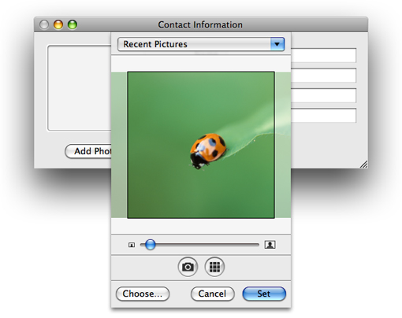
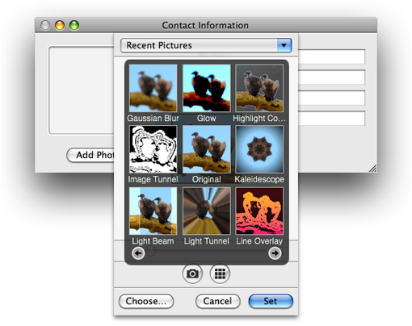
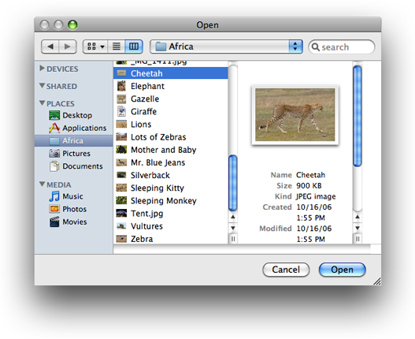
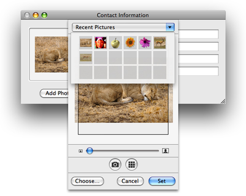
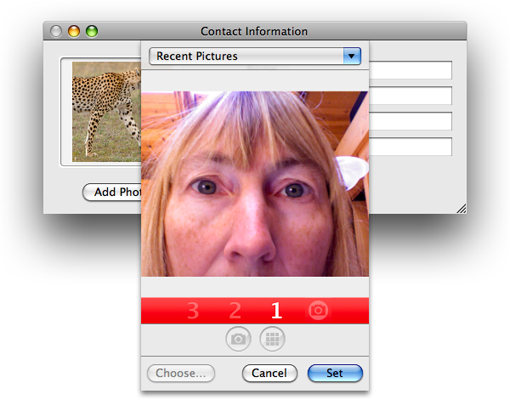
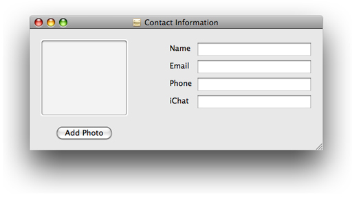

> 导航：[总目录](../../../README.md) · [documentation](../../../_indexes/documentation.md) · [ImageKit Programming Guide](Introduction%20to%20Image%20Kit%20Programming%20Guide.md)


[Next](Browsing%20Filters%20and%20Setting%20Input%20Parameters.md)[Previous](Showing%20Slides.md)

# Taking Snapshots and Setting Pictures

More and more applications provide the user with the opportunity to take a snapshot or provide an image to use as a personal identifier, such as the buddy picture in iChat. The `IKPictureTaker` class provides such support. Its simple user interface lets users choose, crop, or rotate an existing image, or take a snapshot using an iSight camera or other digital camera.

This chapter describes the user interface provided by the `IKPictureTaker` class and gives step-by-step instructions for creating an application that uses the picture taker.

The picture taker panel can appear as a modal window or a sheet. Figure 5-1 shows the picture taker sheet as it appears the first time the user opens it. The application can set the default image. In this example, it is the ladybug image that comes with OS X.

The user has a number of options when the presented with the picture taker:

- Accept the default image
- Drag an image directly to the picture taker
- Click Choose and select an image through the Open panel as shown in [Figure 5-3](#apple-f4xwc4dqnrsv64tfmyxwi33df52wszbpkridimbqga2dsmbxfvbuqnznknltg).
- Click the camera button to take a snapshot

__Figure 5-1__  The picture taker as a sheet



The user can modify the image by using the slider to size and crop it. If the picture taker has an effects button (located next to the camera button), the user can click it to apply an effect, as shown in Figure 5-2. The effects button is optional. You’ll see how to turn on the option in [Using the Picture Taker in the Contact Information Application](#apple-f4xwc4dqnrsv64tfmyxwi33df52wszbpkridimbqga2dsmbxfvbuqnznknltm).

__Figure 5-2__  Adding an effect



The user clicks the Set button to accept an image and close the picture taker, or the Cancel button to close the sheet without choosing an image.

Figure 5-3 shows the panel that appears when the user clicks the Choose button.

__Figure 5-3__  Choosing an image with the Open panel



If the user previously chose images for this application, the Recent Pictures menu is populated with those images, as shown in Figure 5-4. The user can choose any of the recent items.

__Figure 5-4__  The Recent Pictures menu



Figure 5-5 shows the user interface that appears after the user clicks the camera button on a computer that has an iSight or other digital camera connected to it. Whatever is positioned in front of the camera appears in the window. The numbers below the window, along with sound, provide a countdown prior to the camera capturing the image.

__Figure 5-5__  Taking a snapshot



This section shows how to write an application that uses a picture taker. First you’ll get an overview of how the picture taker works in general, then you’ll take a look at how to implement the picture taker in an application that lets the user set up personal contact information.

To display the picture taker in any application, you first need to create a shared instance by calling the `pictureTaker` method of the `IKPictureTaker` class.

```
IKPictureTaker *pictureTaker = [IKPictureTaker pictureTaker];
```

You can customize the picture taker appearance and behavior by using the [setValue:forKey:](https://developer.apple.com/documentation/objectivec/nsobject/1415969-setvalue) method and providing a key constant (defined by the picture taker) along with the appropriate value. For example, you can control the size of the crop area using the key `IKPictureTakerCropAreaSizeKey` and providing a size (as an [NSValue](https://developer.apple.com/library/archive/documentation/LegacyTechnologies/WebObjects/WebObjects_3.5/Reference/Frameworks/ObjC/Foundation/Classes/NSValue/Description.html#//apple_ref/occ/cl/NSValue) object). See _[IKPictureTaker Class Reference](https://developer.apple.com/documentation/quartz/ikpicturetaker)_ for a complete list of the options you can set.

You can launch the picture taker as a standalone window using this method:

```
[pictureTaker beginPictureTakerWithDelegate:self didEndSelector:@selector(pictureTakerDidEnd:returnCode:contextInfo:) contextInfo:nil];
```

or as a sheet, using this method:

```
[myPictureTaker beginPictureTakerSheetForWindow:aWindow withDelegate:self didEndSelector:@selector(pictureTakerDidEnd:returnCode:contextInfo:) contextInfo:nil];
```

You need to provide a selector method that has a method signature that matches the following:

```objc
- (void) pictureTakerDidEnd:(IKPictureTaker *) picker
```

Typically you would retrieve the output image in this callback by using the `outputImage` method of the `IKPictureTaker` class. The output image represents the edited image; the `inputImage` method retrieves the unedited image.

```objc
- (void) pictureTakerDidEnd:(IKPictureTaker *) picker
    returnCode:(NSInteger) code
    contextInfo:(void*) contextInfo
{
    NSImage *image = [picker outputImage];
}
```


The rest of this chapter shows how to create a Contact Information application that uses the picture taker to add a photo to a contact entry. When it opens, the Contact Information application displays a window that lets the user enter a name, email address, phone number, and iChat address, as shown in Figure 5-6. The user can add an image by clicking the Add Photo button, which will open the picture taker.

__Figure 5-6__  An application that uses the picture taker



This section provides step-by-step instructions for implementing the picture taker in the Contact Information application. First you’ll set up the Xcode project, the project files, and the controller interface. Then you’ll add the necessary routines to the implementation file. Finally, you’ll connect the user interface to the picture taker action.

Follow these steps to set up the project:

1. In Xcode, create a Cocoa application named Contact Information.
2. Add the Quartz framework to the project.

   For details, see [Using the Image Kit in Xcode](Basics%20of%20Using%20the%20Image%20Kit.md#apple-f4xwc4dqnrsv64tfmyxwi33df52wszbpkridimbqga2dsmbxfvbuqmznknlti).
3. Double-click the `MainMenu.nib` file.
4. In the nib document window, double-click the Window icon and create a layout that looks similar to [Figure 5-6](#apple-f4xwc4dqnrsv64tfmyxwi33df52wszbpkridimbqga2dsmbxfvbuqnznknlto).

   It really doesn’t matter what you create. The important elements for you to add from the Library are a push button object (labeled Add Photo) and an Image Well (`NSImageView`) object.
5. Save the nib file and return to Xcode.
6. In Xcode, choose File > New File.
7. Choose “Objective-C Class NSWindowController subclass" and click Next.
8. Name the file `MyController.m` and keep the option to create the header file. Then click Finish.
9. In the `MyController.h` file, import the Quartz framework by adding this statement:

   `#import <Quartz/Quartz.h>`
10. Add an instance variable for the image that appears in the contact information window.

    At this point, the interface should look as follows:

```objc
@interface MyController: NSWindowController
{
    IBOutlet NSImageView *  mImageView;
}
```
11. Save `MyController.h`.

Implement the picture taker routines by following these steps:

1. Open `MyController.m`
2. In the implementation file, first add an `awakeFromNib` method.

   This method needs to retrieve a shared instance of the picture taker and then set the default image to show when the picture taker first opens. You can set any image that you’d like, but the example below uses the ladybug image provided in the Desktop Pictures folder.

   Your `awakeFromNib` method should look similar to the following:

```objc
- (void) awakeFromNib
{
    IKPictureTaker *picker = [IKPictureTaker pictureTaker];
    [picker setInputImage:[[NSImage alloc]
        initByReferencingFile:@"/Library/Desktop Pictures/Nature/Ladybug.jpg"]];

}
```
3. Next, you need to add a method that launches the picture taker.

   The method first retrieves the shared instance of the picture taker. Then it sets an option for showing the effects button. You can set any options you like and that are defined in _[IKPictureTaker Class Reference](https://developer.apple.com/documentation/quartz/ikpicturetaker)_. Finally, the method launches the picture taker as a sheet. You must provide the window that contains the image view, the delegate (which in this case is `self`), and a selector for a callback method. You’ll write the callback next.

```objc
- (void) launchPictureTaker:(id)sender
{
    IKPictureTaker *picker = [IKPictureTaker pictureTaker];

    [picker setValue:[NSNumber numberWithBool:YES]
              forKey:IKPictureTakerShowEffectsKey];

    [picker beginPictureTakerSheetForWindow:[mImageView window]
               withDelegate:self
               didEndSelector:@selector(pictureTakerDidEnd:code:contextInfo:)
               contextInfo:nil];
}
```

   If you prefer to launch the picture taker as a separate window, you can substitute the following for the last call in the `launchPictureTaker:` method.

```
[picker beginPictureTakerWithDelegate:self
           didEndSelector:@selector(pictureTakerDidEnd:code:contextInfo:)
           contextInfo:nil];
```
4. Write a `didEndSelector` method to provide as a callback.

   This method is invoked when the user dismisses the picture taker either by choosing an image or by clicking the Cancel button. If the user chooses an image, the method retrieves the output image and then sets it to the view so that the image that’s displayed changes to the newly selected image. Otherwise, the method does nothing.

```objc
- (void) pictureTakerDidEnd:(IKPictureTaker*) pictureTaker code:(int) returnCode contextInfo:(void*) ctxInf
{
    if(returnCode == NSOKButton){
        NSImage *outputImage = [pictureTaker outputImage];
        [mImageView setImage:outputImage];
    }
    else{
        // The user canceled, so there is nothing to do.
    }
}
```
5. Save the `MyController.m` file.
6. Open the `MyController.h` file and add the launch method prototype just before the `@end` statement. When inserted, the interface for `MyController` should look like this:

```objc
@interface MyController : NSWindowController {
   IBOutlet NSImageView * mImageView;
}

- (IBAction) launchPictureTaker:(id)sender;
@end
```
7. Close the `MyController.h` file.

To make the connections necessary for the picture taker to launch when the user clicks the Add Photo button, follow these steps:

1. In Interface Builder, drag an Object (`NSObject`) from the Library to the nib document window.
2. In the Identity inspector, type MyController in the Class field.
3. If the Contact Information window that you created is not open, open it.
4. Control-drag from the Add Photo button to the instance of MyController.
5. In the connections panel, choose `launchPictureTaker:`.
6. Control-drag from MyController to the `NSImageView` instance in the window. Then, in the connections panel, choose `mImageView`.
7. Save the nib file.
8. In Xcode, click Build and Go. Then test your application to make sure the picture taker works.

   Check to make sure the effects button is displayed along with any other options you set up.

[Next](Browsing%20Filters%20and%20Setting%20Input%20Parameters.md)[Previous](Showing%20Slides.md)

