> 导航：[总目录](../../../README.md) · [documentation](../../../_indexes/documentation.md) · [ImageKit Programming Guide](Introduction%20to%20Image%20Kit%20Programming%20Guide.md)


[Next](Browsing%20Images.md)[Previous](Basics%20of%20Using%20the%20Image%20Kit.md)

# Viewing, Editing, and Saving Images in an Image View

The `IKImageView` class displays a single image in a frame and optionally can allow a user to drag an image to it. It is similar to the [NSImageView](https://developer.apple.com/documentation/appkit/nsimageview) class, except that `IKImageView` supports any image file format that Quartz 2D and the Image I/O framework support, including Quartz images ([CGImageRef](https://developer.apple.com/documentation/coregraphics/cgimageref)), images that have metadata, and images whose location is specified as an `NSURL` object. In addition, the `IKImageView` class supports zoom, rotation, selection, cropping, and other image editing operations.

This chapter shows the user interface for an image view, the image edit panel (`IKImageEditPanel` class), and the save options accessory view (pane) (`IKSaveOptions` class). It provides instructions for creating an image editing application incrementally. You’ll see how to:

- View images in an image view
- Set up an image view to use the Image Edit panel
- Set up a pane for saving images in various formats
- Add zoom controls
- Add image editing tools
- Add a Save panel that uses image saving options

The image view ([IKImageView](https://developer.apple.com/documentation/quartz/ikimageview)) in the user interface looks similar to any view that contains an image. The image shown in Figure 2-1 could just as easily be in an [NSView](https://developer.apple.com/documentation/appkit/nsview) object, an [NSImageView](https://developer.apple.com/documentation/appkit/nsimageview) object, or a Carbon window.

__Figure 2-1__  An image view

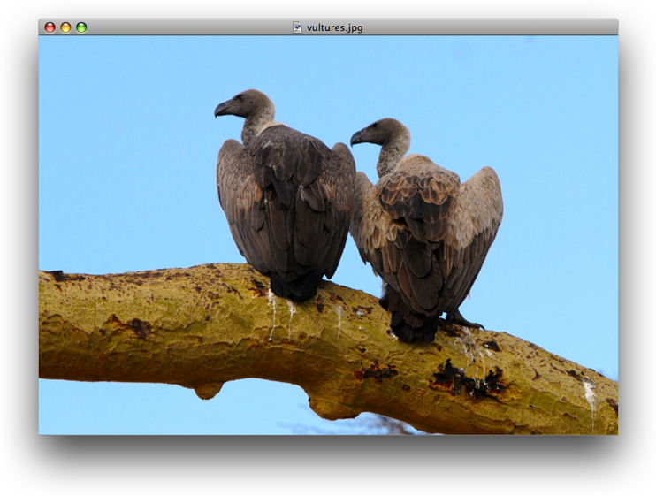

An `IKImageView` object has an important characteristic that no other image container has. When the user double-clicks an image in an image view, an Image Edit panel appears, as shown in Figure 2-2. The panel allows the user to make adjustments to the image, apply a number of effects, and view image metadata and properties. The Adjust pane provides the most commonly used image adjustments.

__Figure 2-2__  The Adjust pane of the Image Edit panel

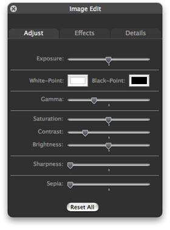

The Effects pane (shown in Figure 2-3) allows the user, with a single click, to preview and apply sharpening, blurring, or color filters.

__Figure 2-3__  The Effects pane of the Image Edit panel

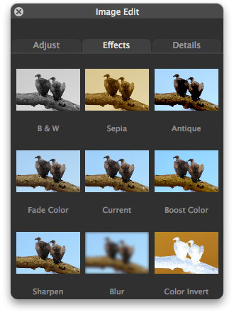

The Details pane displays all the metadata for an image, as well as a comprehensive list of image properties, as shown in Figure 2-4. If the image information is more than can fit in the pane, the Image Kit supplies scroll bars automatically.

__Figure 2-4__  The Details pane of the Image Edit panel

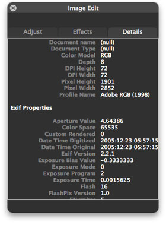

There are very few tasks you need to perform for the Image Edit panel to appear. You need to set the appropriate image view state, set up a shared instance of the Image Edit panel ([IKImageEditPanel](https://developer.apple.com/documentation/quartz/ikimageeditpanel)), and set the data source. The Image Kit framework takes care of the rest—showing the panel, switching panes, responding to changes made by the user, fetching and displaying image information, and closing the Image Edit panel.

The image view supports the use of tools for moving zooming, cropping, rotating, and applying annotations to an image. You need to provide a user interface for zoom operation and tool selection. At a minimum, you need to set up a menu similar to what’s shown in Figure 2-5.

__Figure 2-5__  A menu that supports zooming and tools

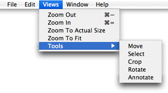

Ideally, you would also provide controls in the image view window, as shown in Figure 2-6. The figure shows two segmented controls (created in Interface Builder using `NSSegmentedControl` controls), each of which uses custom icons that you provide.

__Figure 2-6__  Controls that support zooming and tool selection

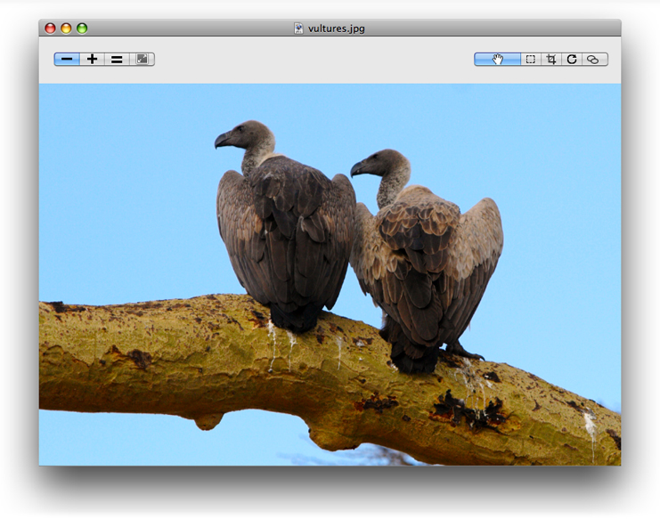

The image view keeps track of the zoom factor, the rotation angle, and whether the image can be edited. You need to respond to the user’s selection by setting the tool mode. The Image Kit framework takes care of animating move, zoom, and rotation operations; showing a rotation circle (see Figure 2-7); displaying crop and selection rectangles; and displaying an annotation area. You need to implement copying data to the pasteboard, cropping the image, and handling the text for the annotation area.

__Figure 2-7__  The rotation user interface

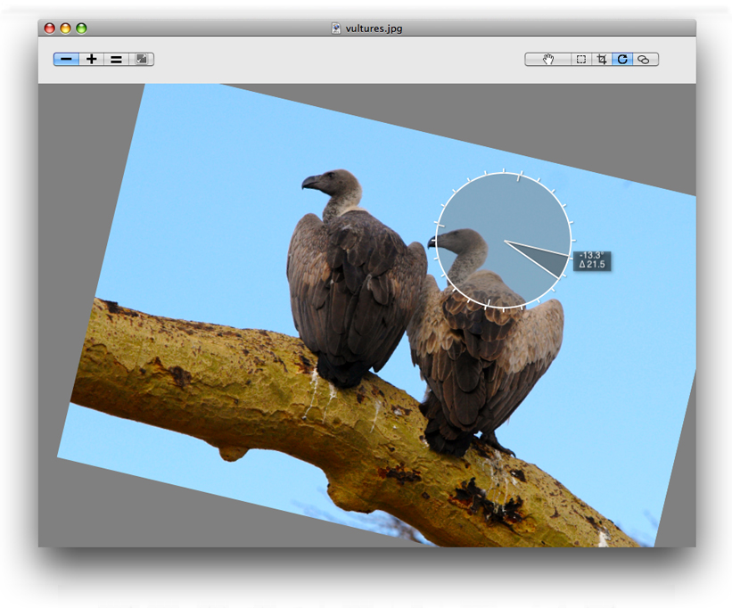

No image viewing and editing application would be complete without the ability to save an edited image. The [IKSaveOptions](https://developer.apple.com/documentation/quartz/iksaveoptions) class provides an accessory view for an [NSSavePanel](https://developer.apple.com/documentation/appkit/nssavepanel) object that allows the user to choose an image file format and to set options appropriate for that format. The user can choose from among a number of formats. The options appropriate for that format appear below the format. For example, for a TIFF format, the user can choose compression options (as shown in Figure 2-8).

__Figure 2-8__  A Save As dialog with an accessory view (pane) for file format options

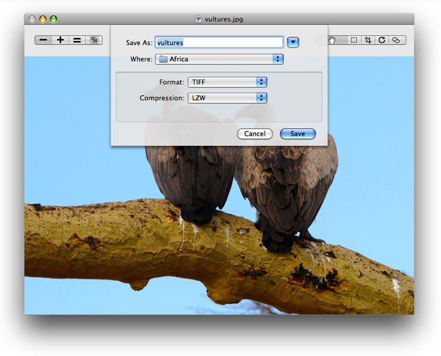

This section shows how to open and display an image in an image view. You’ll set the image view options so that the Image Edit panel opens when the user double-clicks the image. First you’ll set up the Xcode project, the project files, and the controller interface. Then you’ll create the user interface in Interface Builder. Finally, you’ll add the necessary routines to the implementation file.

Follow these steps to set up the project:

1. Open Xcode, choose File > New Project.
2. Choose Cocoa Application and click Next.
3. Name the project `My Image Viewer`, and click Finish.
4. Choose Project > Add to Project and add the Quartz and Quartz Core frameworks.

   For details, see [Using the Image Kit in Xcode](Basics%20of%20Using%20the%20Image%20Kit.md#apple-f4xwc4dqnrsv64tfmyxwi33df52wszbpkridimbqga2dsmbxfvbuqmznknlti).
5. Choose Project > Add to Project, navigate to an image to use as a default image, and click Add.
6. In the sheet that appears, click Add.

   This image appears in the view whenever the application launches.
7. Choose File > New File.
8. Choose Objective-C Class and click Next.
9. Name the file `Controller.m` and keep the option to create the header file. Then click Finish.
10. In the `Controller.h` file, import the Quartz framework by adding this statement just below the statement to import Cocoa:

    `#import <Quartz/Quartz.h>`
11. Add a directive for the `IKImageView` class:

    `@class IKImageView;`
12. Add instance variables to the Controller interface.

    You need an image view and a window to contain the view. You’ll set these up later in Interface Builder.

```
IBOutlet IKImageView *  mImageView;
IBOutlet NSWindow *     mWindow;
```

    You need to keep track of image properties and the uniform type identifier of the image in the view.

```
NSDictionary * mImageProperties;
NSString *     mImageUTType;
```
13. Save and close the `Controller.h` file.
14. In the `Controller.m` file, import the Application Kit classes by adding this statement.

    `#import <AppKit/AppKit.h>`
15. Close the `Controller.m` file.

Set up the user interface in Interface Builder by following these steps:

1. Double-click the `MainMenu.nib` file (located in the Resources group) to open Interface Builder.
2. Choose File > Synchronize With Xcode.
3. Double-click the Window icon in the nib document window.
4. In the Size inspector, set the width of the window to 800 and the height to 600.
5. Drag a Image View from the Library to the window and resize the view to fit the window.
6. In the Size inspector, the Autosizing springs should look as follows. If they don’t, set them so they do.

   
7. Drag an Object (`NSObject`) from the Library to the nib document window.

   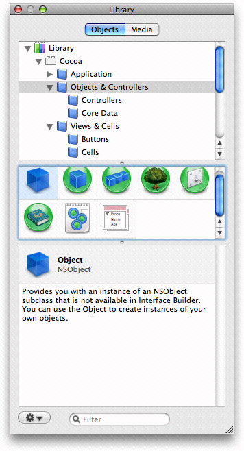
8. Type Controller in the Name field of the Identity inspector and press Return.
9. Choose Controller from the Class pop-up menu.
10. Control-drag from the controller icon to the title bar of the window. Then click the `mWindow` outlet that appears in the connections panel.
11. Control-drag from the controller icon to the `IKImageView` view. Then click the `mImageView` outlet that appears in the connections panel.
12. Control-drag from the window icon to the controller icon. Then click the `delegate` outlet that appears in the connections panel.

    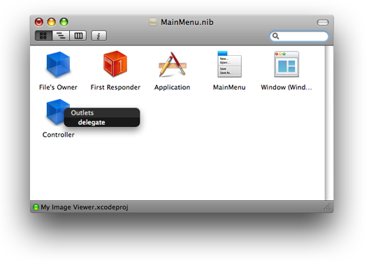
13. Save the nib file.

Now you’ll go back to Xcode to add code to implement the image viewer.

1. Open the `Controller.m` file.
2. Add an `openImageURL:` method to take care of opening images.

   The easiest way of opening an image is to use the `setImageWithURL:` method. This method is best for RAW images.

```objc
- (void)openImageURL: (NSURL*)url
{
     [mImageView setImageWithURL: url];
     [mWindow setTitleWithRepresentedFilename: [url path]];
}
```

   An alternate implementation is to use the Quartz opaque data types [CGImageRef](https://developer.apple.com/documentation/coregraphics/cgimageref) and [CGImageSourceRef](https://developer.apple.com/documentation/imageio/cgimagesource) and their associated functions to create an image source, extract an image, get the image properties, and set the image to the image view. If you are using a TIFF file that contains multiple images, you need this implementation to display any image other than the first one. That’s because `setImageWithURL:` displays only the first image of a multiple-image file.

```objc
- (void)openImageURL: (NSURL*)url
{
    CGImageRef          image = NULL;
    CGImageSourceRef    isr = CGImageSourceCreateWithURL( (CFURLRef)url, NULL);

    if (isr)
    {
        image = CGImageSourceCreateImageAtIndex(isr, 0, NULL);
        if (image)
        {
         mImageProperties = (NSDictionary*)CGImageSourceCopyPropertiesAtIndex(
                isr, 0, (CFDictionaryRef)mImageProperties);
        }
        CFRelease(isr);
    }

    if (image)
    {
      [mImageView setImage: image
          imageProperties: mImageProperties];

     [mWindow setTitleWithRepresentedFilename: [url path]];
      CGImageRelease(image);
    }
}
```
3. Add an `awakeFromNib` method.

   This method first creates a URL for the default image file by getting the path to the resource in the bundle and then converting the path to a URL. After opening the URL, the method sets up the image view so that the Image Edit panel can open, and the image zooms to fit the view.

   Make sure that you substitute the appropriate string for “earring”, which should be the name of the default image file without its filename extension. Also, use the appropriate extension.

```objc
- (void)awakeFromNib
{
    NSString *   path = [[NSBundle mainBundle] pathForResource: @"earring"
                            ofType: @"jpg"];
    NSURL *      url = [NSURL fileURLWithPath: path];

    [self openImageURL: url];

    // customize the IKImageView...
    [mImageView setDoubleClickOpensImageEditPanel: YES];
    [mImageView setCurrentToolMode: IKToolModeMove];
    [mImageView zoomImageToFit: self];
}
```
4. Open the `Controller.h` files and add the following method signature.

```objc
- (void)openImageURL: (NSURL*)url;
```
5. Click Build and Go.
6. When the application launches, double-click the image to make sure that the Image Edit panel opens.

   If the window opens, but an image does not appear, make sure that you’ve included the correct filename in your code.
7. Resize the image to make sure that it zooms to fit the size of the window.

   If the image does not zoom to fit, check the connections between the window and the controller in Interface Builder.

The next section shows how to use the [IKSaveOptions](https://developer.apple.com/documentation/quartz/iksaveoptions) class to add an accessory view to the Save panel.

The [IKSaveOptions](https://developer.apple.com/documentation/quartz/iksaveoptions) class handles image and PDF saving options. After creating an `NSSavePanel` object, you allocate and initialize a save options accessory view and then add the view to the Save dialog. Keep in mind that [IKSaveOptions](https://developer.apple.com/documentation/quartz/iksaveoptions) handles the options, but it does not actually save the image or PDF. After you set up the save options accessory panel, you also need to implement a save method.

Follow these steps to add the image options accessory view to the My Image Viewer application:

1. Open the `Controller.h` file and add a save options instance variable.

```
IKSaveOptions * mSaveOptions;
```
2. Add the following method signature:

```objc
- (IBAction)saveImage: (id)sender;
```
3. In the `Controller.m` file, add a method that presents a Save panel with the save options accessory view (pane).

   The method first creates an instance of the `NSSavePanel` class. Then it allocates a save options object and initializes it with the image properties and UT type of the image that will be saved. Next the code adds the save options view to the Save panel. It shows the Save panel as a sheet, providing a selector that is invoked when the Save panel terminates. (You’ll write that method next.)

```objc
- (IBAction)saveImage: (id)sender
{
    NSSavePanel * savePanel = [NSSavePanel savePanel];
    mSaveOptions = [[IKSaveOptions alloc]
                        initWithImageProperties: mImageProperties
                                    imageUTType: mImageUTType];
    [mSaveOptions addSaveOptionsAccessoryViewToSavePanel: savePanel];

    NSString * fileName = [[mWindow representedFilename] lastPathComponent];
    [savePanel beginSheetForDirectory: NULL
                    file: fileName
          modalForWindow: mWindow
           modalDelegate: self
          didEndSelector: @selector(savePanelDidEnd:returnCode:contextInfo:)
             contextInfo: NULL];


}
```
4. Add a `savePanelDidEnd` method that performs the actual saving.

   If the user clicks the Save button, the method obtains the filename and type and retrieves the image from the view. If the image exists, the method uses the [CGImageDestinationRef](https://developer.apple.com/documentation/imageio/cgimagedestinationref) opaque type (from the Image I/O framework) to create an image destination based on a URL representation of the file path. It saves the image with its properties, finalizes the destination, and releases the `CGImageDestination` object because it is no longer needed.

```objc
- (void)savePanelDidEnd: (NSSavePanel *)sheet
             returnCode: (int)returnCode
            contextInfo: (void *)contextInfo
{
    if (returnCode == NSOKButton)
    {
        NSString * path = [sheet filename];
        NSString * newUTType = [mSaveOptions imageUTType];
        CGImageRef image;

        image = [mImageView image];
        if (image)
        {
            NSURL * url = [NSURL fileURLWithPath: path];
            CGImageDestinationRef dest = CGImageDestinationCreateWithURL((CFURLRef)url,
                         (CFStringRef)newUTType, 1, NULL);
            if (dest)
            {
                CGImageDestinationAddImage(dest, image,
                            (CFDictionaryRef)[mSaveOptions imageProperties]);
                CGImageDestinationFinalize(dest);
                CFRelease(dest);
            }
        } else
        {
            NSLog(@"*** saveImageToPath - no image");
        }
    }
}
```
5. Save the `Controller.m` file.
6. Open the `MainMenu.nib` file.
7. Double-click the MainMenu icon in the nib document window.
8. Open the File menu so you can see the menu items New, Open, and so on.
9. Control-drag from the Save menu item to the controller.
10. In the connections panel for the controller, choose `saveImage:`.
11. Save the nib file.
12. In Xcode, click Build and Go.
13. After the application launches, choose File > Save. You should see a Save panel appear with an accessory view that looks similar to the following.

    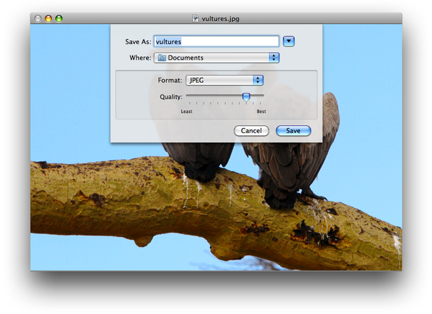

    Choose other items from the Format menu to see the options that are offered for each image format.

    !!

To support zooming, you need to add menu commands or controls (or both) for zooming, and a method to respond to the commands.

To support zooming, follow these steps:

1. Add the following method signature to the `Controller.h` file, then save the file:

```objc
- (IBAction)doZoom: (id)sender;
```
2. Open the `Controller.m` file and add constants for the zoom factor.

```
#define ZOOM_IN_FACTOR  1.414214 // doubles the area
#define ZOOM_OUT_FACTOR 0.7071068 // halves the area
```
3. Add a method to handle commands to zoom out, zoom in, zoom to fit, and zoom to the actual size of the image.

```objc
- (IBAction)doZoom: (id)sender
{

    NSInteger zoom;
    CGFloat   zoomFactor;

    if ([sender isKindOfClass: [NSSegmentedControl class]])
        zoom = [sender selectedSegment];
    else
        zoom = [sender tag];

    switch (zoom)
    {
        case 0:
            zoomFactor = [mImageView zoomFactor];
            [mImageView setZoomFactor: zoomFactor * ZOOM_OUT_FACTOR];
            break;
        case 1:
            zoomFactor = [mImageView zoomFactor];
            [mImageView setZoomFactor: zoomFactor * ZOOM_IN_FACTOR];
            break;
        case 2:
            [mImageView zoomImageToActualSize: self];
            break;
        case 3:
            [mImageView zoomImageToFit: self];
            break;
    }
}
```
4. Open the `MainMenu.nib` file.
5. Double-click the MainMenu icon in the nib document window.
6. Create a new menu by dragging a Submenu Menu item from the Library and dropping it between the Edit and Format menu items.
7. Name the new menu Views.
8. Add menu items from the library to the Views menu so that you have enough for these zoom commands. Use the inspector to add the tags and key equivalents shown in the table.

| Command | Tag | Key equivalent |
| --- | --- | --- |
| Zoom Out | 0 | Command – |
| Zoom In | 1 | Command = |
| Zoom to Actual Size | 2 |  |
| Zoom to Fit | 3 |  |
9. Control-drag from each item to the Controller icon. Then, in the connections panel for the controller, click `doZoom:`.
10. Save the `MainMenu.nib` file.
11. In Xcode, click Build and Go. Then make sure that the zoom commands operate as expected.
12. Quit the application and go back to the `MainMenu.nib` file in Interface Builder.

    This time you’ll revise the window user interface by adding zoom controls.
13. Change the image view size so that the top of the view is 50 pixels from the top of the window.

    You’ll need this space to put zoom controls.
14. Drag a segmented control from the Library to the top-left side of the window.
15. In the Attributes inspector for the control set the number of segments to 4.
16. Double-click each segment to change its label and to use the inspector to add a tag. Use the commands and tags shown previously for the Views menu.

    If possible, you should add artwork, similar to the following, to the Xcode project so that you can use icons instead of text labels.

    !
17. In the Size inspector, set the Control Size to small.
18. In the Attributes inspector, choose Select Any in the Mode pop-up menu.
19. Control-drag from the segmented zoom control to the Controller icon. Then, in the connections panel for the controller, click `doZoom:`.
20. Click the Info button in the nib document window. When the MainMenu.nib Info window opens, set the Deployment Target pop-up menu to OS X v10.5.
21. Save the nib file.
22. In Xcode, click Build and Go. Then make sure that the zoom commands operate as expected.

    !

The [IKImageView](https://developer.apple.com/documentation/quartz/ikimageview) class has built-in support for move, select, crop, rotate, and annotate tools. To set up the image editing application to include the tools for these actions, follow these steps:

1. In Xcode, add image files (Project > Add to Project), similar to the following, for each of the tool modes—move, select, crop, rotate, and annotate.

   You’ll need to use an application such as Adobe Illustrator to create icons. See _OS X Human Interface Guidelines_ for information on using icons in the interface.

   !
2. Add the following method signature to the `Controller.h` file:

```objc
- (IBAction)switchToolMode: (id)sender;
```
3. Add a method to the `Controller.m` file to handle setting the tool mode.

```objc
- (IBAction)switchToolMode: (id)sender
{

    NSInteger newTool;
    if ([sender isKindOfClass: [NSSegmentedControl class]])
        newTool = [sender selectedSegment];
    else
       newTool = [sender tag];

    switch (newTool)
    {
        case 0:
            [mImageView setCurrentToolMode: IKToolModeMove];
            break;
        case 1:
            [mImageView setCurrentToolMode: IKToolModeSelect];
            break;
        case 2:
            [mImageView setCurrentToolMode: IKToolModeCrop];
            break;
        case 3:
            [mImageView setCurrentToolMode: IKToolModeRotate];
            break;
        case 4:
            [mImageView setCurrentToolMode: IKToolModeAnnotate];
            break;
    }
}
```
4. Save the `Controller.m` file.
5. Open the `MainMenu.nib` file.
6. Add a submenu to the Views menu and name it Tools.
7. Add the following items to the Tools submenu, using the inspector to add the tag values.

| Item | Tag |
| --- | --- |
| Move | 0 |
| Select | 1 |
| Crop | 2 |
| Rotate | 3 |
| Annotate | 4 |
8. Control-drag from the Move menu item to the Controller icon. Choose `switchToolMode:` in the connections panel for the controller.
9. Repeat the previous step for each of the other items in the Tools menu.
10. Add a segmented control to the top-right side of the window so the control is aligned with the zoom controls.
11. In the Attributes inspector, set the number of segments to 5.
12. In the Size inspector, set the Size to small and the Width to 60.
13. Switch to the Attributes inspector.
14. For each segment, drag the appropriate icon from the Media pane of the Library, and set the segment to autosize.

    From left to right, the icons should represent Move, Select, Crop, Annotate, and Rotate.
15. Choose Select One from the Mode pop-up menu.
16. Make sure that Selected is checked for Segment 1.
17. In the Size inspector set the Autosizing struts and springs so they look as follows:

    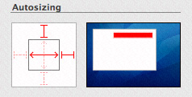
18. Control-drag from the segmented control to the controller and connect to the `switchToolMode:` action.
19. Save the nib file.
20. In Xcode, click Build and Go. Then test the Tools menu and the toolbar.

    The move and rotate tools operate without any additional code on your part. The selection and crop tools copy the selected areas to the pasteboard. You need to provide code that implements pasting from the pasteboard. The annotate tool simply shows a colored circle. You need to write code that supports text entry and editing, and saves the annotation.

As it is now, your application opens a default image file. It would be greatly improved if it allowed the user to choose an image other than the default. Next you’ll write an open image method that is invoked when the user chooses File > Open. You need to provide a selector that is invoked when the Open panel closes. If the user chooses an image, your `openImageURL:` method (which you already added to the application) is invoked.

Follow these steps to support letting the user open image files:

1. Add the following method signature to the `Controller.h` file:

```objc
- (IBAction)openImage: (id)sender;
```
2. Write an open image method.

   The method creates an instance of the `NSOpenPanel` class and defines the allowable filename extensions. It then calls a method that shows the Open panel.

```objc
- (IBAction)openImage: (id)sender
{
    NSOpenPanel * openPanel = [NSOpenPanel openPanel];
    NSString *    extensions = @"tiff/tif/TIFF/TIF/jpg/jpeg/JPG/JPEG/pdf/PDF";
    NSArray *     types = [extensions pathComponents];

    [openPanel beginSheetForDirectory: NULL
                                 file: NULL
                                types: types
                       modalForWindow: mWindow
                        modalDelegate: self
                       didEndSelector: @selector(openPanelDidEnd:returnCode:contextInfo:)
                          contextInfo: NULL];

}
```
3. Write a selector method that’s invoked when the Open panel terminates.

   If the user chooses an image, this method calls the `openImageURL:` method, passing to it the first item in the selected path.

```objc
- (void)openPanelDidEnd: (NSOpenPanel *)panel
             returnCode: (int)returnCode
            contextInfo: (void  *)contextInfo
{
    if (returnCode == NSOKButton)
    {
        [self openImageURL: [[panel URLs] objectAtIndex: 0]];
    }
}
```
4. Save the `Controller.m` file.
5. Double-click the MainMenu icon in the nib document window.
6. Click the File menu so you can see the items in it—New, Open, and so on.
7. Control-drag from the Open menu item to the controller and connect to the `openImage:` action in the connections panel.
8. Save the nib file.
9. In Xcode, click Build and Go.

   Choose File > Open and make sure that you can open an image.

[Next](Browsing%20Images.md)[Previous](Basics%20of%20Using%20the%20Image%20Kit.md)

