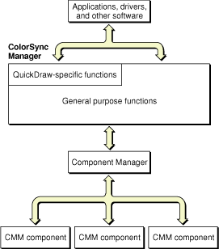

> 导航：[总目录](../../../README.md) · [documentation](../../../_indexes/documentation.md) · [Managing Colors With ColorSync in Mac OS 9](About%20This%20Document.md)


[Next](Version%20and%20Compatibility%20Information.md)[Previous](Developing%20ColorSync-Supportive%20Device%20Drivers.md)

# Developing Color Management Modules

This section gives a brief overview of color management modules (CMMs) and the role a CMM plays in the ColorSync color management system. You should read this section if you are a third-party developer who creates CMMs that ColorSync (versions 2.0 and greater) can use instead of, or in conjunction with, the default CMM.

Before reading this section, you should read [Overview of ColorSync](Overview%20of%20ColorSync.md#apple-f4xwc4dqnrsv64tfmyxwi33df52wszbpkridgmbqgaydenzzfvbeeq2gi5euesi) for a more complete conceptual explanation of how a CMM fits within the ColorSync system. If you are unfamiliar with terms and concepts such as profile, color space, CMM, and color management, or would like to review these topics, you should also read [Overview of Color and Color Management Systems](Overview%20of%20Color%20and%20Color%20Management%20Systems.md#apple-f4xwc4dqnrsv64tfmyxwi33df52wszbpkridgmbqgaydeobqfvbeeq2cirduira).

At a minimum, a ColorSync-compatible CMM must be able to match colors across color spaces belonging to different base families and check colors expressed in the color gamut of one device against the color gamut of another device.

In addition to the minimum set of requests a CMM must service, a CMM can also implement support for other requests a ColorSync-supportive application or device driver might make. Among the optional services a CMM might provide are verifying if a particular profile contains the base set of required elements for a profile of its type and directing the process of converting profile data embedded in a graphics file to data in an external profile file accessed through a profile reference and vice versa. A CMM can also provide services for PostScript printers by obtaining or deriving from a profile specific data required by PostScript printers for color-matching processes and returning the data in a format that can be sent to the PostScript printer.

This section provides a high-level discussion of the required and optional ColorSync Manager request codes your CMM might be called to handle, and also describes the Component Manager required request codes to which every component must respond.

For complete details on components and their structure, see the chapter Component Manager in Inside Macintosh: More Macintosh Toolbox.

A color management module (CMM) is a component that implements color matching, color gamut checking, and other services and performs these services in response to requests from ColorSync-supportive applications or device drivers.

A CMM component interacts directly with the Component Manager, which calls the CMM on behalf of the ColorSync Manager and the requesting application or driver. When they call ColorSync Manager functions to request color-matching and color gamut-checking services, ColorSync-supportive applications and device drivers specify the profiles to use. These profiles characterize the devices involved; they include information giving the color spaces and the color gamuts of the devices and the preferred CMM to carry out the work. A CMM uses the information contained in these profiles to perform the processing required to service requests. [Figure 6-1](#apple-f4xwc4dqnrsv64tfmyxwi33df52wszbpkridgmbqgaydenzwfvbegskkjfauerq) shows the relationship between a ColorSync-supportive application or driver, the ColorSync Manager, the Component Manager, and one or more available CMM components.

A CMM should support all seven classes of profiles defined by the ICC. For information on the seven classes of profiles, see Profile Class or the International Color Consortium Profile Format Specification, version 2.x or higher. To obtain a copy of the specification, or to get other information about the ICC, visit the ICC Web site at <http://www.color.org/>.

In some cases, a CMM will not be able to convert and match colors directly from the color space of one profile to that of another. Instead, it will need to convert colors to the device-independent color space specified by the profile. A CMM uses device-independent color spaces, or interchange color spaces, to interchange color data from the native color space of one device to the native color space of another device.The profile connection space field of a profile header specifies the interchange color space for that profile. Version 2.x of the ColorSync Manager supports two interchange color spaces: XYZ and Lab.

__Figure 6-1__  The ColorSync Manager and the Component Manager



When interchange color spaces are involved, the ColorSync Manager handles the process, which is largely transparent to the CMM. The ColorSync Manager passes to the CMM the correct profiles for color matching. For example, in a case in which both the source and destination profile’s CMMs are required to complete the color matching using color space profiles, the ColorSync Manager calls the source profile’s CMM with the source profile and an interchange color space profile. Then it calls the destination profile’s CMM with an interchange color space profile and the destination profile. The ColorSync Manager assesses the requirements and breaks the process down so that the correct CMM is called with the correct set of profiles. This process is described from the perspective of an application or device driver in [How the ColorSync Manager Selects a CMM](Developing%20ColorSync-Supportive%20Applications.md#apple-f4xwc4dqnrsv64tfmyxwi33df52wszbpkridgmbqgaydenzyfvbeeq2cijdeura).

A CMM uses lookup tables and algorithms for color matching, using one device to preview the color reproduction capabilities of another device, and checking for colors that cannot be reproduced.

This section describes how to create a CMM component, including how to respond to required Component Manager and ColorSync Manager requests and optional ColorSync Manager requests. For more detailed information on working with components, see the chapter Component Manager in Inside Macintosh: More Macintosh Toolbox.

A CMM is stored as a component resource. It contains a number of resources, including the standard component resource (a resource of type `'thng'`) required of any Component Manager component. In addition, a CMM must contain code to handle required request codes passed to it by the Component Manager. This includes support for Component Manager required request codes as well as ColorSync Manager required request codes. For an example of the resources your CMM should include, refer to the DemoCMM project available with the ColorSync SDK.

To allow the ColorSync Manager to use your CMM when a profile specifies it as its preferred CMM, your CMM should be located in the Extensions folder, where it will automatically be registered at startup. The file type for component files must be set to `'thng'`.

The component resource contains all the information needed to register a code resource as a component. Information in the component resource tells the Component Manager where to find the code for the component. As part of the component resource, you must provide a component description record that specifies the component type, subtype, manufacturer, and flags. Here is the data structure for the component description:

```
struct ComponentDescription {
    OSType              componentType;
    OSType              componentSubType;
    OSType              componentManufacturer;
    unsigned long       componentFlags;
    unsigned long       componentFlagsMask;
};
```

The following are the key fields of the component description data structure for creating a CMM component:

- The `componentType` field contains a unique 4-byte code specifying the resource type and resource ID of the component’s executable code. For your CMM, set this field to `'cmm '`.
- The `componentSubType` field indicates the type of services your CMM provides. You should set this field to your CMM name. This value must match exactly the value specified in the profile header’s `CMMType` field. You must register this value with the International Color Consortium (ICC). To obtain information about the ICC, visit the ICC Web site at <http://www.color.org/>.
- The `componentManufacturer` field indicates the creator of the CMM. You may set this field to any value you wish.
- The `componentFlags` field is a 32-bit field that provides additional information about your CMM component. The high-order 8 bits are reserved for definition by the Component Manager. The low-order 24 bits are specific to each component type. You can use these flags to indicate any special capabilities or features of your component.

Since it was first defined, the component resource has been extended to include additional information. That additional information includes the following field for specifying the version of your component:

```
long    componentVersion;   /* version of Component */
```

- The `componentVersion` field indicates the version of the CMM. For related information on specifying the CMM version, see [Required Component Manager Request Codes](#apple-f4xwc4dqnrsv64tfmyxwi33df52wszbpkridgmbqgaydenzwfvbegskhirdecsi).

For more information on component data types, see the following files from the Universal Interfaces distributed with development systems for the Mac OS:

- Components.h
- Components.r

Because a CMM is a direct client of the Component Manager, it must conform to the Component Manager’s interface requirements, including supporting and responding to required Component Manager calls.

The code for your CMM should be contained in a resource. The Component Manager expects the entry point to this resource to be a function having this format:

```
pascal ComponentResult main(ComponentParameters *params, Handle storage);
```

Whenever the Component Manager receives a request for your CMM, it calls your component’s entry point and passes any parameters, along with information about the current connection, in a data structure of type `ComponentParameters`. This entry point must be the first function in your CMM’s code segment. The Component Manager also passes a handle to the private storage (if any) associated with the current instance of your component. Here is the component parameters data structure, which is described in detail in Inside Macintosh: More Macintosh Toolbox.

```
struct ComponentParameters {
        unsigned char       flags;
        unsigned char       paramSize;
        short               what;
        long                params[1];
};
```

The first field of the `ComponentParameters` data structure is reserved. The following three fields carry information your CMM needs to perform its processing. The `what` field contains a value that identifies the type of request. The `paramSize` field specifies the size in bytes of the parameters passed from the ColorSync-supportive calling application to your CMM. The parameters themselves are passed in the `params` field.

At a minimum, your CMM must handle the required Component Manager and required ColorSync Manager request codes. The required Component Manager request codes are defined by these constants:

- `kComponentOpenSelect` (`-1`) Requests that you open an instance of the component. For more information, see [Establishing the Environment for a New Component Instance](#apple-f4xwc4dqnrsv64tfmyxwi33df52wszbpkridgmbqgaydenzwfvbegskijbeukrq).
- `kComponentCloseSelect` (`-2`) Requests that you close the component instance. For more information, see [Releasing Private Storage and Closing the Component Instance](#apple-f4xwc4dqnrsv64tfmyxwi33df52wszbpkridgmbqgaydenzwfvbegskhi5euusq).
- `kComponentCanDoSelect` (`-3`) Requests that you tell whether your CMM handles a specific request. For more information, see [Determining Whether Your CMM Supports a Request](#apple-f4xwc4dqnrsv64tfmyxwi33df52wszbpkridgmbqgaydenzwfvbegskfifeussa).
- `kComponentVersionSelect` (`-4`) Requests that you return your CMM’s version number. For more information, see [Providing Your CMM Version Number](#apple-f4xwc4dqnrsv64tfmyxwi33df52wszbpkridgmbqgaydenzwfvbegskiizfeeqq). Note that if you provide your version number in an extended component resource, the Component Manager can obtain the version number without having to call your code that handles this request code.

Your CMM must also be able to handle the required ColorSync Manager request codes defined by these constants:

- `kCMMMatchColors` (`1`) Requests that you color match the specified colors from one color space to another. For more information, see [Matching a List of Colors to the Destination Profile’s Color Space](#apple-f4xwc4dqnrsv64tfmyxwi33df52wszbpkridgmbqgaydenzwfvbegskkifceuqq).
- `kCMMCheckColors` (`2`) Requests that you check the specified colors against the gamut of the destination device whose profile is specified. For more information, see [Checking a List of Colors](#apple-f4xwc4dqnrsv64tfmyxwi33df52wszbpkridgmbqgaydenzwfvbegskiizaugsq).
- `kNCMMInit` (`6`) Requests that you initialize the current component instance of your CMM for a ColorSync Manager 2.x session. For more information, see [Initializing the Current Component Instance for a Two-Profile Session](#apple-f4xwc4dqnrsv64tfmyxwi33df52wszbpkridgmbqgaydenzwfvbegskeijduisq).

The Component Manager may also call your CMM with the following ColorSync Manager request codes that are considered optional. A CMM may support these requests, although you are not required to do so.

- `kCMMInit` (`0`) Requests that you initialize the current component instance of your CMM for a ColorSync 1.0 session. This is a required request code only if your CMM supports ColorSync 1.0 profiles.
- `kCMMMatchPixMap` (`3`) Requests that you match the colors of a pixel map image to the color gamut of a destination profile, replacing the original pixel colors with their corresponding colors. For more information, see [Matching the Colors of a Pixel Map Image](#apple-f4xwc4dqnrsv64tfmyxwi33df52wszbpkridgmbqgaydenzwfvbegskkjbeukqi).
- `kCMMCheckPixMap` (`4`) Requests that you check the colors of a pixel map image against the gamut of a destination device for inclusion and report the results. For more information, see [Checking the Colors of a Pixel Map Image](#apple-f4xwc4dqnrsv64tfmyxwi33df52wszbpkridgmbqgaydenzwfvbegskiijaueri).
- `kCMMConcatenateProfiles` (`5`) This request code is for backward compatibility with ColorSync 1.0.
- `kCMMConcatInit` (`7`) Requests that you initialize any private data your CMM will need for a color session involving the set of profiles specified by the profile array pointed to by the `profileSet` parameter. For more information, see [Initializing the Component Instance for a Session Using Concatenated Profiles](#apple-f4xwc4dqnrsv64tfmyxwi33df52wszbpkridgmbqgaydenzwfvbegskfizfeoqi).
- `kCMMValidateProfile` (`8`) Requests that you test a specific profile to determine if the profile contains the minimum set of elements required for a profile of its type. For more information, see [Validating That a Profile Meets the Base Content Requirements](#apple-f4xwc4dqnrsv64tfmyxwi33df52wszbpkridgmbqgaydenzwfvbegskjifcugqi).
- `kCMMMatchBitmap` (`9`) Requests that you match the colors of a source image bitmap to the color gamut of a destination profile. For more information, see [Matching the Colors of a Bitmap](#apple-f4xwc4dqnrsv64tfmyxwi33df52wszbpkridgmbqgaydenzwfvbegskjirbemry).
- `kCMMCheckBitmap` (`10`) Requests that you check the colors of a source image bitmap against the color gamut of a destination profile. For more information, see [Checking the Colors of a Bitmap](#apple-f4xwc4dqnrsv64tfmyxwi33df52wszbpkridgmbqgaydenzwfvbegskhizeussq).
- `kCMMGetPS2ColorSpace` (`11`) Requests that you obtain or derive the color space data from a source profile and pass the data to a low-level data-transfer function supplied by the calling application or device driver. For more information, see [Obtaining PostScript-Related Data From a Profile](#apple-f4xwc4dqnrsv64tfmyxwi33df52wszbpkridgmbqgaydenzwfvbegskeifbuira).
- `kCMMGetPS2ColorRenderingIntent` (`12`) Requests that you obtain the color-rendering intent from the header of a source profile and then pass the data to a low-level data-transfer function supplied by the calling application or device driver. For more information, see [Obtaining PostScript-Related Data From a Profile](#apple-f4xwc4dqnrsv64tfmyxwi33df52wszbpkridgmbqgaydenzwfvbegskeifbuira).
- `kCMMGetPS2ColorRendering` (`13`) Requests that you obtain the rendering intent from the source profile’s header, generate the color rendering dictionary (CRD) data from the destination profile, and then pass the data to a low-level data-transfer function supplied by the calling application or device driver. For more information, see [Obtaining PostScript-Related Data From a Profile](#apple-f4xwc4dqnrsv64tfmyxwi33df52wszbpkridgmbqgaydenzwfvbegskeifbuira).
- `kCMMGetPS2ColorRenderingVMSize` (`17`) Requests that you obtain or assess the maximum virtual memory (VM) size of the color rendering dictionary (CRD) specified by a destination profile. For more information, see [Obtaining the Size of the Color Rendering Dictionary for PostScript Printers](#apple-f4xwc4dqnrsv64tfmyxwi33df52wszbpkridgmbqgaydenzwfvbegskkijbeisa).
- `kCMMFlattenProfile` (`14`) Requests that you extract profile data from the profile to be flattened and pass the profile data to a function supplied by the calling program. For more information, see [Flattening a Profile for Embedding in a Graphics File](#apple-f4xwc4dqnrsv64tfmyxwi33df52wszbpkridgmbqgaydenzwfvbegskcifeeurq).

  Changed in ColorSync 2.5: Starting with ColorSync version 2.5, the ColorSync Manager calls the function provided by the calling program directly, without going through the preferred, or any, CMM. Your CMM only needs to handle this request code for versions of ColorSync prior to version 2.5.
- `kCMMUnflattenProfile` (`15`) Requests that you create a file in the temporary items folder in which to store profile data you receive from a function. The calling program supplies the function. You call this function to obtain the profile data. For more information, see [Unflattening a Profile](#apple-f4xwc4dqnrsv64tfmyxwi33df52wszbpkridgmbqgaydenzwfvbegskginbuirq).

  Changed in ColorSync 2.5: Starting with ColorSync version 2.5, the ColorSync Manager calls the function provided by the calling program directly, without going through the preferred, or any, CMM. Your CMM only needs to handle this request code for versions of ColorSync prior to version 2.5.
- `kCMMNewLinkProfile` (`16`) Requests that you create a single device link profile that includes the profiles passed to you in an array. For more information, see [Creating a Device Link Profile and Opening a Reference to It](#apple-f4xwc4dqnrsv64tfmyxwi33df52wszbpkridgmbqgaydenzwfvbegskjjjcuuri).
- `kCMMGetNamedColorInfo (70)` Requests that you extract and return named color data from the passed profile reference.
- `kCMMGetNamedColorValue (71)` Requests that you extract and return device and profile connection space (PCS) color values for the specified color name from the passed profile reference.
- `kCMMGetIndNamedColorValue (72)` Requests that you extract and return device and PCS color values for the specified named color index from the passed profile reference.
- `kCMMGetNamedColorIndex (73)` Requests that you extract and return a named color index for the specified color name from the passed profile reference.
- `kCMMGetNamedColorName (74)` Requests that you extract and return a named color name for the specified named color index from the passed profile reference.

When your component receives a request, it should examine the `what` field of the `ComponentParameters` data structure to determine the nature of the request, perform the appropriate processing, set an error code if necessary, and return an appropriate function result to the Component Manager.

Your entry point routine can call a separate subroutine to handle each type of request. _ColorSync Manager Reference_ describes the prototypes for functions your CMM must supply to handle the corresponding ColorSync Manager request codes. The entry routine itself can unpack the parameters from the params parameter to pass to its subroutines, or it can call the Component Manager’s `CallComponentFunctionWithStorage` routine or `CallComponentFunction` routine to perform these services.

The `CallComponentFunctionWithStorage` function is useful if your CMM uses private storage. When you call this function, you pass it a handle to the storage for this component instance, the `ComponentParameters` data structure, and the address of your subroutine handler. Each time it calls your entry point function, the Component Manager passes to your function the storage handle along with the `ComponentParameters` data structure. For a description of how you associate private storage with a component instance, see [Establishing the Environment for a New Component Instance](#apple-f4xwc4dqnrsv64tfmyxwi33df52wszbpkridgmbqgaydenzwfvbegskijbeukrq). The Component Manager’s `CallComponentFunctionWithStorage` function extracts the calling application’s parameters from the `ComponentParameters` data structure and invokes your function, passing to it the extracted parameters and the private storage handle.

For sample code that illustrates how to respond to the required Component Manager and ColorSync Manager requests, see the DemoCMM project available with the ColorSync SDK. You may also wish to refer to the Apple technical note QT05, Component Manager Version 3.0. This technical note shows how to create a fat component, which is a single component usable for both 68K-based and PowerPC-based systems.

For more information describing how your CMM component should respond to request code calls from the Component Manager, see Creating Components in Inside Macintosh: More Macintosh Toolbox.

This section describes some of the processes your CMM can perform in response to the following Component Manager requests that it must handle:

- [Establishing the Environment for a New Component Instance](#apple-f4xwc4dqnrsv64tfmyxwi33df52wszbpkridgmbqgaydenzwfvbegskijbeukrq) describes how to handle a `kComponentOpenSelect` request.
- [Releasing Private Storage and Closing the Component Instance](#apple-f4xwc4dqnrsv64tfmyxwi33df52wszbpkridgmbqgaydenzwfvbegskhi5euusq) describes how to handle a `kComponentCloseSelect` request.
- [Determining Whether Your CMM Supports a Request](#apple-f4xwc4dqnrsv64tfmyxwi33df52wszbpkridgmbqgaydenzwfvbegskfifeussa) describes how to handle a `kComponentCanDoSelect` request.
- [Providing Your CMM Version Number](#apple-f4xwc4dqnrsv64tfmyxwi33df52wszbpkridgmbqgaydenzwfvbegskiizfeeqq) describes how to handle a `kComponentVersionSelect` request.

When a ColorSync-supportive application or device driver first calls a function that requires the services of your CMM, the Component Manager calls your CMM with a `kComponentOpenSelect` request to open and establish an instance of your component for the calling program. The component instance defines a unique connection between the calling program and your CMM.

In response to this request, you should allocate memory for any private data you require for the connection. You should allocate memory from the current heap zone. It that attempt fails, you should allocate memory from the system heap or the temporary heap. You can use the `SetComponentInstanceStorage` function to associate the allocated memory with the component instance.

For more information on how to respond to this request and open connections to other components, see Creating Components in Inside Macintosh: More Macintosh Toolbox.

To call your CMM with a close request, the Component Manager sets the `what` field of the `ComponentParameters` data structure to `kComponentCloseSelect`. In response to this request code, your CMM should dispose of the storage memory associated with the connection.

Before the ColorSync Manager calls your CMM with a request code on behalf of a ColorSync-supportive application or driver that called the corresponding function, the Component Manager calls your CMM with a can do request to determine if your CMM implements support for the request.

To call your CMM with a can do request, the Component Manager sets the `what` field of the `ComponentParameters` data structure to the value `kComponentCanDoSelect`. In response, you should set your CMM entry point function’s result to 1 if your CMM supports the request and 0 if it doesn’t.

To call your CMM requesting its version number, the Component Manager sets the `what` field of the `ComponentParameters` data structure to the value `kComponentVersionSelect`. In response, you should set your CMM entry point function’s result to the CMM version number. Use the high-order 16 bits to represent the major version and the low-order 16 bits to represent the minor version. The major version should represent the component specification level; the minor version should represent your implementation’s version number.

If your CMM supports the ColorSync Manager version 2.x, your CMM should return the constant for the major version defined by the following enumeration when the Component Manager calls your CMM with the `kComponentVersionSelect` request code:

```
enum {
    CMMInterfaceVersion = 1
    };
```

Note that if you provide your version number in an extended component resource, the Component Manager can obtain the version number without having to call your code that handles this request code.

This section describes some of the processes your CMM can perform in response to the following ColorSync Manager requests that it must handle:

- [Initializing the Current Component Instance for a Two-Profile Session](#apple-f4xwc4dqnrsv64tfmyxwi33df52wszbpkridgmbqgaydenzwfvbegskeijduisq) describes how to handle the `kNCMMInit` request.
- [Matching a List of Colors to the Destination Profile’s Color Space](#apple-f4xwc4dqnrsv64tfmyxwi33df52wszbpkridgmbqgaydenzwfvbegskkifceuqq) describes how to handle a `kCMMMatchColors` request.
- [Checking a List of Colors](#apple-f4xwc4dqnrsv64tfmyxwi33df52wszbpkridgmbqgaydenzwfvbegskiizaugsq) describes how to handle a `kCMMCheckColors` request.

The Component Manager calls your CMM with an initialization request, setting the `what` field of the `ComponentParameters` data structure to `kNCMMInit`. In most cases the Component Manager calls your CMM with an initialization request before it calls your CMM with any other ColorSync Manager requests.

In response to this request, your CMM should call its `NCMInit` initialization subroutine. For a description of the function prototype your initialization subroutine must adhere to, see `NCMInit`.

Using the private storage you allocated in response to the open request, your initialization subroutine should instantiate any private data it needs for the component instance. Before your entry point function returns a function result to the Component Manager, your subroutine should store any profile information it requires. In addition to the standard profile information, you should store the profile header’s quality flags setting, the profile size, and the rendering intent. After you return control to the Component Manager, you cannot use the profile references again.

The `kNCMMInit` request gives you the opportunity to examine the profile contents before storing them. If you do not support some aspect of the profile, then you should return an unimplemented error in response to this request. For example, if your CMM does not implement multichannel color support, you should return an unimplemented error at this point.

The Component Manager may call your CMM with the `kNCMMInit` request code multiple times after it calls your CMM with a request to open the CMM. For example, it may call your CMM with an initialization request once with one pair of profiles and then again with another pair of profiles. For each call, you need to reinitialize the storage based on the content of the current profiles.

Your CMM should support all seven classes of profiles defined by the ICC. For the constants used to specify the seven classes of profiles, see _ColorSync Manager Reference_.

When a ColorSync-supportive application or device driver calls the `CWMatchColors` function for your CMM to handle, the Component Manager calls your CMM with a color-matching session request, setting the `what` field of the `ComponentParameters` data structure to `kCMMMatchColors` and passing you a list of colors to match. The Component Manager may also call your CMM with this request code to handle other cases, for example, when a ColorSync-supportive program calls the `CWMatchPixMap` function.

Before it calls your CMM with this request, the Component Manager calls your CMM with one of the initialization requests—`kCMMInit`, `kNCMMInit`, or `kCMMConcatInit`—passing to your CMM in the `params` field of the `ComponentParameters` data structure the profiles for the color-matching session.

In response to the `kCMMMatchColors` request, your CMM should call its `CMMatchColors` subroutine by calling the Component Manager’s `CallComponentFunctionWithStorage` function and passing it a handle to the storage for this component instance, the `ComponentParameters` data structure, and the address of your `CMMatchColors` subroutine. For a description of the function prototype to which your subroutine must adhere, see `CMMatchColors`.

The parameters passed to your CMM for this request include an array of type `CMColor` containing the list of colors to match and a one-based count of the number of colors in the list.

To handle this request, your CMM must match the source colors in the list to the color gamut of the destination profile, replacing the color value specifications in the `myColors` array with the matched colors specified in the destination profile’s data color space. You should use the rendering intent and the quality flag setting of the source profile in matching the colors. For a description of the color list array data structure, see `CMColor`.

When a ColorSync-supportive application or device driver calls the `CWCheckColors` function for your CMM to handle, the Component Manager calls your CMM with a color gamut-checking session request, setting the `what` field of the `ComponentParameters` data structure to `kCMMCheckColors` and passing you a list of colors to check.

Before the Component Manager calls your CMM with the `kCMMCheckColors` request, it calls your CMM with one of the initialization requests—`kCMMInit`, `kNCMMInit`, or `kCMMConcatInit`—passing to your CMM in the `params` field of the `ComponentParameters` data structure the profiles for the color gamut-checking session.

In response to the `kCMMCheckColors` request, your CMM should call its `CMCheckColors` subroutine. For example, if you use the Component Manager’s `CallComponentFunctionWithStorage` function, you pass it a handle to the storage for this component instance, the `ComponentParameters` data structure, and the address of your `CMCheckColors` subroutine. For a description of the function prototype to which your subroutine must adhere, see `CMCheckColors`.

In addition to the handle to the private storage containing the profile data, the `CallComponentFunctionWithStorage` function passes to your `CMCheckColors` subroutine an array of type `CMColor` containing the list of colors to gamut check, a one-based count of the number of colors in the list, and an array of longs.

To handle this request, your CMM should test the given list of colors against the gamut specified by the destination profile to determine whether the colors fall within a destination device’s color gamut. For each source color in the list that is out of gamut, you must set the corresponding bit in the result array to 1. 

This section describes some of the processes your CMM can perform in response to the optional ColorSync Manager requests if your CMM supports them. Before the Component Manager calls your CMM with any of these requests, it first calls your CMM with a can do request to determine if you support the specific optional request code. This section includes the following:

- [Validating That a Profile Meets the Base Content Requirements](#apple-f4xwc4dqnrsv64tfmyxwi33df52wszbpkridgmbqgaydenzwfvbegskjifcugqi) describes how to handle a `kCMMValidateProfile` request.
- [Matching the Colors of a Bitmap](#apple-f4xwc4dqnrsv64tfmyxwi33df52wszbpkridgmbqgaydenzwfvbegskjirbemry) describes how to handle a `kCMMMatchBitmap` request.
- [Checking the Colors of a Bitmap](#apple-f4xwc4dqnrsv64tfmyxwi33df52wszbpkridgmbqgaydenzwfvbegskhizeussq) describes how to handle a `kCMMCheckBitmap` request.
- [Matching the Colors of a Pixel Map Image](#apple-f4xwc4dqnrsv64tfmyxwi33df52wszbpkridgmbqgaydenzwfvbegskkjbeukqi) describes how to handle the `kCMMMatchPixMap` request.
- [Checking the Colors of a Pixel Map Image](#apple-f4xwc4dqnrsv64tfmyxwi33df52wszbpkridgmbqgaydenzwfvbegskiijaueri) describes how to handle the `kCMMCheckPixMap` request.
- [Initializing the Component Instance for a Session Using Concatenated Profiles](#apple-f4xwc4dqnrsv64tfmyxwi33df52wszbpkridgmbqgaydenzwfvbegskfizfeoqi) describes how to handle a `kCMMConcatInit` request.
- [Creating a Device Link Profile and Opening a Reference to It](#apple-f4xwc4dqnrsv64tfmyxwi33df52wszbpkridgmbqgaydenzwfvbegskjjjcuuri) describes how to handle a `kCMMNewLinkProfile` request.
- [Obtaining PostScript-Related Data From a Profile](#apple-f4xwc4dqnrsv64tfmyxwi33df52wszbpkridgmbqgaydenzwfvbegskeifbuira) describes how to handle the `kCMMGetPS2ColorSpace`, `kCMMGetPS2ColorRenderingIntent`, and `kCMMGetPS2ColorRendering` requests.
- [Obtaining the Size of the Color Rendering Dictionary for PostScript Printers](#apple-f4xwc4dqnrsv64tfmyxwi33df52wszbpkridgmbqgaydenzwfvbegskkijbeisa) describes how to handle a `kCMMGetPS2ColorRenderingVMSize` request.
- [Flattening a Profile for Embedding in a Graphics File](#apple-f4xwc4dqnrsv64tfmyxwi33df52wszbpkridgmbqgaydenzwfvbegskcifeeurq) describes how to handle a `kCMMFlattenProfile` request.
- [Unflattening a Profile](#apple-f4xwc4dqnrsv64tfmyxwi33df52wszbpkridgmbqgaydenzwfvbegskginbuirq) describes how to handle a `kCMMUnflattenProfile` request.
- [Supplying Named Color Space Information](#apple-f4xwc4dqnrsv64tfmyxwi33df52wszbpkridgmbqgaydenzwfvbegskfjfcuesq) describes how to handle the kCMMGetNamedColorInfo, kCMMGetNamedColorValue, kCMMGetIndNamedColorValue, kCMMGetNamedColorIndex, and kCMMGetNamedColorName requests.

When a ColorSync-supportive application or device-driver calls the `CMValidateProfile` function for your CMM to handle, the Component Manager calls your CMM with the `what` field of the `ComponentParameters` data structure set to `kCMMValidateProfile` if your CMM supports the request.

In response to this request code, your CMM should call its `CMMValidateProfile` subroutine. One way to do this, for example, is by calling the Component Manager’s `CallComponentFunction` function, passing it the `ComponentParameters` data structure and the address of your `CMMValidateProfile` subroutine. To handle this request, you don’t need private storage for ColorSync profile information, because the profile reference is passed to your function. However, if your CMM uses private storage for other purposes, you should call the Component Manager’s `CallComponentFunctionWithStorage` function. For a description of the function prototype to which your subroutine must adhere, see `CMMValidateProfile`.

The `CallComponentFunction` function passes to your `CMMValidateProfile` subroutine a reference to the profile whose contents you must check and a flag whose value you must set to report the results.

To handle this request, your CMM should test the profile contents against the baseline profile elements requirements for a profile of this type as specified by the International Color Consortium. It should determine if the profile contains the minimum set of elements required for its type and set the response flag to `true` if the profile contains the required elements and `false` if it doesn’t.

To obtain a copy of the International Color Consortium Profile Format Specification, version 2.x, visit the ICC Web site at <http://www.color.org/>.

The ICC also defines optional tags, which may be included in a profile. Your CMM might use these optional elements to optimize or improve its processing. Additionally, a profile might include private tags defined to provide your CMM with processing capability it uses. The profile developer can define these private tags, register the tag signatures with the ICC, and include the tags in a profile.

If your CMM is dependent on optional or private tags, your `CMMValidateProfile` function should check for the existence of these tags also.

Instead of itself checking the profile for the minimum profile elements requirements for the profile class, your `CMMValidateProfile` function may use the Component Manager functions to call the default CMM and have it perform the minimum defaults requirements validation.

To call the default CMM when responding to a `kCMMValidateProfile` request from an application, your CMM can use the standard mechanisms applications use to call a component. For information on these mechanisms, see the chapter Component Manager in Inside Macintosh: More Macintosh Toolbox.

When a ColorSync-supportive application or device driver calls the `CWMatchBitMap` function for your CMM to handle, the Component Manager calls your CMM with the `what` field of the `ComponentParameters` data structure set to `kCMMMatchBitmap` if your CMM supports the request. If your CMM supports this request code, your CMM should be prepared to receive any of the bitmap types defined by the ColorSync Manager.

In response to this request code, your CMM should call its `CMMatchBitmap` subroutine. For example, to do this, your CMM may call the Component Manager’s `CallComponentFunctionWithStorage` function, passing it the storage handle for this component instance, the `ComponentParameters` data structure, and the address of your `CMMatchBitmap` subroutine. For a description of the function prototype to which your subroutine must adhere, see `CMMatchBitmap`.

In addition to the storage handle for private storage for this component instance, the `CallComponentFunctionWithStorage` function passes to your `CMMatchBitmap` subroutine a pointer to the bitmap containing the source image data whose colors your function must match, a pointer to a callback function supplied by the calling program, a reference constant your subroutine must pass to the callback function when you invoke it, and a pointer to a bitmap in which your function stores the resulting color-matched image.

The callback function supplied by the calling function monitors the color-matching progress as your function matches the bitmap colors. You should call this function at regular intervals. Your `CMMatchBitmap` function should monitor the progress function for a returned value of `true`, which indicates that the user interrupted the color-matching process. In this case, you should terminate the color-matching process.

To handle this request, your `CMMatchBitmap` function must match the colors of the source image bitmap to the color gamut of the destination profile using the profiles specified by a previous `kNCMInit`, `kCMMInit`, or `kCMMConcatInit` request to your CMM for this component instance. You must store the color-matched image in the bitmap result parameter passed to your subroutine. If you are passed a `NULL` parameter, you must match the bitmap in place.

For a description of the prototype of the callback function supplied by the calling program, see `MyCMBitmapCallBackProc`.

When a ColorSync-supportive application or device driver calls the `CWCheckBitMap` function for your CMM to handle, the Component Manager calls your CMM with the `what` field of the `ComponentParameters` data structure set to `kCMMCheckBitmap` if your CMM supports the request. If your CMM supports this request code, your CMM should be prepared to receive any of the bitmap types defined by the ColorSync Manager.

In response to this request code, your CMM should call its `CMCheckBitmap` subroutine. For example, to do this, your CMM may call the Component Manager’s `CallComponentFunctionWithStorage` function, passing it the storage handle for this component instance, the `ComponentParameters` data structure, and the address of your `CMCheckBitmap` subroutine. For a description of the function prototype to which your subroutine must adhere, see `MyCMBitmapCallBackProc`.

In addition to the storage handle for private storage for this component instance, the `CallComponentFunctionWithStorage` function passes to your `CMCheckBitmap` subroutine a pointer to the bitmap containing the source image data whose colors your function must check, a pointer to a callback progress-reporting function supplied by the calling program, a reference constant your subroutine must pass to the callback function when you invoke it, and a pointer to a resulting bitmap whose pixels your subroutine must set to show if the corresponding source color is in or out of gamut. A black pixel (value 1) in the returned bitmap indicates an out-of-gamut color, while a white pixel (value 0) indicates the color is in gamut.

The callback function supplied by the calling function monitors the color gamut-checking progress. You should call this function at regular intervals. Your `CMCheckBitmap` function should monitor the progress function for a returned value of `true`, which indicates that the user interrupted the color gamut-checking process. In this case, you should terminate the process.

For a description of the prototype of the callback function supplied by the calling program, see `MyCMBitmapCallBackProc`.

Using the content of the profiles that you stored at initialization time for this component instance, your `CMCheckBitmap` subroutine must check the colors of the source image bitmap against the color gamut of the destination profile. If a pixel is out of gamut, your function must set the corresponding pixel in the result image bitmap to 1. The ColorSync Manager returns the resulting bitmap to the calling application or driver to report the outcome of the check.

For complete details on the `CMCheckBitmap` subroutine parameters and how your `CMCheckBitmap` subroutine communicates with the callback function, see `MyCMBitmapCallBackProc`.

When a ColorSync-supportive application or device driver calls the `CWMatchPixMap` function for your CMM to handle, the Component Manager calls your CMM with the `what` field of the `ComponentParameters` data structure set to `kCMMMatchPixMap` if your CMM supports the request. If your CMM supports this request code, your `CMMatchPixMap` function should be prepared to receive any of the pixel map types defined by QuickDraw.

In response to this request code, your CMM should call its `CMMatchPixMap` subroutine. For example, to do this, your CMM may call the Component Manager’s `CallComponentFunctionWithStorage` function, passing it the storage handle for this component instance, the `ComponentParameters` data structure, and the address of your `CMMatchPixMap` subroutine. For a description of the function prototype to which your subroutine must adhere, see `CMMatchPixMap`.

In addition to the storage handle for private storage for this component instance, the `CallComponentFunctionWithStorage` function passes to your `CMMatchPixMap` subroutine a pointer to the pixel map containing the source image to match, a pointer to a callback progress-reporting function supplied by the calling program, and a reference constant your subroutine must pass to the callback function when you invoke it.

To handle this request, your `CMMatchPixMap` subroutine must match the colors of the source pixel map image to the color gamut of the destination profile, replacing the original pixel colors of the source image with their corresponding colors expressed in the data color space of the destination profile. The ColorSync Manager returns the resulting color-matched pixel map to the calling application or driver.

The callback function supplied by the calling function monitors the color-matching progress. You should call this function at regular intervals. Your `CMMatchPixMap` function should monitor the progress function for a returned value of `true`, which indicates that the user interrupted the color-matching process. In this case, you should terminate the process.

For a description of the prototype of the callback function supplied by the calling program, see `MyCMBitmapCallBackProc`.

When a ColorSync-supportive application or device-driver calls the `CWCheckPixMap` function for your CMM to handle, the Component Manager calls your CMM with the `what` field of the `ComponentParameters` data structure set to `kCMMCheckPixMap` if your CMM supports the request.

In response to this request code, your CMM should call its `CMCheckPixMap` subroutine. For example, to do this, your CMM may call the Component Manager’s `CallComponentFunctionWithStorage` function, passing it the storage handle for this component instance, the `ComponentParameters` data structure, and the address of your `CMCheckPixMap` subroutine. For a description of the function prototype to which your subroutine must adhere, see `CMCheckPixMap`.

In addition to the storage handle for private storage for this component instance, the `CallComponentFunctionWithStorage` function passes to your `CMCheckPixMap` subroutine a pointer to the pixel map containing the source image to check, a QuickDraw bitmap in which to report the color gamut-checking results, a pointer to a callback progress-reporting function supplied by the calling program, and a reference constant your subroutine must pass to the callback function when you invoke it.

Using the content of the profiles passed to you at initialization time, your `CMCheckPixMap` subroutine must check the colors of the source pixel map image against the color gamut of the destination profile to determine if the pixel colors are within the gamut. If a pixel is out of gamut, your subroutine must set to 1 the corresponding pixel of the result bitmap. The ColorSync Manager returns the bitmap showing the color gamut-checking results to the calling application or device driver.

When a ColorSync-supportive application or device driver calls the `CWConcatColorWorld` function for your CMM to handle, the Component Manager calls your CMM with the `what` field of the `ComponentParameters` data structure set to `kCMMConcatInit` if your CMM supports the request.

In response to this request code, your CMM should call its `CMConcatInit` subroutine. For example, to do this, your CMM may call the Component Manager’s `CallComponentFunctionWithStorage` function, passing it the storage handle for this component instance, the `ComponentParameters` data structure, and the address of your `CMConcatInit` subroutine. For a description of the function prototype to which your subroutine must adhere, see `CMConcatInit`.

In addition to the storage handle for private storage for this component instance, the `CallComponentFunctionWithStorage` function passes to your `CMConcatInit` subroutine a pointer to a data structure of type `CMConcatProfileSet` containing an array of profiles to use in a subsequent color-matching or color gamut-checking session. The profiles in the array are in processing order—source through destination. The `profileSet` field of the data structure contains the array. If the profile array contains only one profile, that profile is a device link profile. For a description of the `CMConcatProfileSet` data structure, see `CMConcatProfileSet`.

Using the storage passed to your entry point function in the `CMSession` parameter, your `CMConcatInit` function should initialize any private data your CMM will need for a subsequent color session involving the set of profiles. Before your function returns control to the Component Manager, your subroutine should store any profile information it requires. In addition to the standard profile information, you should store the profile header’s quality flags setting, the profile size, and the rendering intent. After you return control to the Component Manager, you cannot use the profile references again.

A color-matching or color gamut-checking session for a set of profiles entails various color transformations among devices in a sequence for which your CMM is responsible. Your CMM may use Component Manager functions to call other CMMs if necessary.

There are special guidelines your CMM must follow in using a set of concatenated profiles for subsequent color-matching or gamut-checking sessions. These guidelines are described in `CMConcatInit`.

When a ColorSync-supportive application or device driver calls the `CWNewLinkProfile` function for your CMM to handle, the Component Manager calls your CMM with the `what` field of the `ComponentParameters` data structure set to `kCMMNewLinkProfile` if your CMM supports the request.

In response to this request code, your CMM should call its `CMNewLinkProfile` subroutine. For example, to do this, your CMM may call the Component Manager’s `CallComponentFunctionWithStorage` function, passing it the storage handle for this component instance, the `ComponentParameters` data structure, and the address of your `CMNewLinkProfile` subroutine. For a description of the function prototype to which your subroutine must adhere, see `CMNewLinkProfile`.

In addition to the storage handle for private storage for this component instance, the `CallComponentFunctionWithStorage` function passes to your `CMNewLinkProfile` subroutine a pointer to a data structure of type `CMConcatProfileSet` containing the array of profiles that will make up the device link profile.

To handle this request, your subroutine must create a single device link profile of type `DeviceLink` that includes the profiles passed to you in the array pointed to by the `profileSet` parameter. Your CMM must create a file specification for the device link profile. A device link profile cannot be a temporary profile: that is, you cannot specify a location type of `cmNoProfileBase` for a device link profile. For information on how to specify the file location, see Profile Location Type.

The profiles in the array are in the processing order—source through destination—which you must preserve. After your CMM creates the device link profile, it must open a reference to the profile and return the profile reference along with the location specification.

There are three very similar PostScript-related request codes that your CMM may support. Each of these codes requests that your CMM obtain or derive information required by a PostScript printer from the specified profile and pass that information to a function supplied by the calling program.

When a ColorSync-supportive application or device driver calls the high-level function corresponding to the request code and your CMM is specified to handle it, the Component Manager calls your CMM with the `what` field of the `ComponentParameters` data structure set to the corresponding request code if your CMM supports it. Here are the three high-level functions and their corresponding request codes:

- When the application or device driver calls the `CMGetPS2ColorSpace` function, the Component Manager calls your CMM with a `kCMMGetPS2ColorSpace` request code. To respond to this request, your CMM must obtain the color space data from a source profile and pass the data to a low-level data-transfer function supplied by the calling application or device driver.
- When the application or device driver calls the `CMGetPS2ColorRenderingIntent` function, the Component Manager calls your CMM with a `kCMMGetPS2ColorRenderingIntent`request code. To respond to this request, your CMM must obtain the color rendering intent from the source profile and pass the data to a low-level data-transfer function supplied by the calling application or device driver.
- When the application or device driver calls the `CMGetPS2ColorRendering` function, the Component Manager calls your CMM with a `kCMMGetPS2ColorRendering` request code. To respond to this request, your CMM must obtain the rendering intent from the source profile’s header. Then your CMM must obtain or derive the color rendering dictionary for that rendering intent from the destination profile and pass the CRD data to a low-level data-transfer function supplied by the calling application or device driver.

In response to each of these request codes, your CMM should call its subroutine that handles the request. For example, to do this, your CMM may call the Component Manager’s `CallComponentFunctionWithStorage` function, passing it the storage handle for this component instance, the `ComponentParameters` data structure, and the address of your subroutine handler.

For a description of the function prototypes to which your subroutine must adhere for each of these requests, see _ColorSync Manager Reference_.

- For `kCMMGetPS2ColorSpace`, see `CMMGetPS2ColorSpace`
- For `kCMMGetPS2ColorRenderingIntent`, see `CMMGetPS2ColorRenderingIntent`
- For `kCMMGetPS2ColorRendering`, see `CMMGetPS2ColorRendering`.

In addition to the storage handle for private storage for this component instance, the `CallComponentFunctionWithStorage` function passes to your subroutine a reference to the source profile containing the data you must obtain or derive, a pointer to the function supplied by the calling program, and a reference constant that you must pass to the supplied function each time your CMM calls it. For `kCMMGetPS2ColorRendering`, your CMM is also passed a reference to the destination profile.

To handle each of these requests, your subroutine must allocate a `data` buffer in which to pass the particular PostScript-related data to the function supplied by the calling application or driver. Your subroutine must call the supplied function repeatedly until you have passed all the data to it. For a description of the prototype of the application or driver-supplied function, see `MyColorSyncDataTransfer`.

For a description of how each of your subroutines must interact with the calling program’s supplied function, see the descriptions of the prototypes for the subroutines in _ColorSync Manager Reference_.

When a ColorSync-supportive application or device driver calls the `CMGetPS2ColorRenderingVMSize` function for your CMM to handle, the Component Manager calls your CMM with the `what` field of the `ComponentParameters` data structure set to `kCMMGetPS2ColorRenderingVMSize` if your CMM supports the request.

In response to this request code, your CMM should call its `CMMGetPS2ColorRenderingVMSize` subroutine. For example, to do this, your CMM may call the Component Manager’s `CallComponentFunctionWithStorage` function, passing it the storage handle for this component instance, the `ComponentParameters` data structure, and the address of your `CMMGetPS2ColorRenderingVMSize` subroutine. For a description of the function prototype to which your subroutine must adhere, see _ColorSync Manager Reference_.

In addition to the storage handle for global data for this component instance, the `CallComponentFunctionWithStorage` function passes to your `CMMGetPS2ColorRenderingVMSize` subroutine a reference to the source profile identifying the rendering intent and a reference to the destination profile containing the color rendering dictionary (CRD) for the specified rendering intent.

To handle this request, your CMM must obtain or assess and return the maximum VM size for the CRD of the specified rendering intent.

If the destination profile contains the Apple-defined private tag `'psvm'`, described in the next paragraph, then your CMM may read the tag and return the CRD VM size data supplied by this tag for the specified rendering intent. If the destination profile does not contain this tag, then you must assess the VM size of the CRD.

The `CMPS2CRDVMSizeType` data type defines the Apple-defined `'psvm'` optional tag that a printer profile may contain to identify the maximum VM size of a CRD for different rendering intents.

This tag’s element data includes an array containing one entry for each rendering intent and its virtual memory size. For a description of the data structures that define the tag’s element data, see _ColorSync Manager Reference_.

Flattening refers to transferring a profile stored in an independent disk file to an external profile format that can be embedded in a graphics document. Unflattening refers to transferring from the embedded format to an independent disk file.

Starting with ColorSync version 2.5, when a ColorSync-supportive application or device driver calls the `CMFlattenProfile` function, the ColorSync Manager calls the flatten function provided by the calling program or driver directly, without going through the preferred, or any, CMM.

Prior to ColorSync version 2.5, when a ColorSync-supportive application or device driver calls the `CMFlattenProfile` function for your CMM to handle, the Component Manager calls your CMM with the `what` field of the `ComponentParameters` data structure set to `kCMMFlattenProfile` if your CMM supports the request.

In response to this request code, your CMM should call its `CMMFlattenProfile` subroutine. For example, to do this, your CMM may call the Component Manager’s `CallComponentFunctionWithStorage` function, passing it the storage handle for this component instance, the `ComponentParameters` data structure, and the address of your `CMMFlattenProfile` subroutine. For a description of the function prototype to which your subroutine must adhere, see `CMMFlattenProfile`.

In addition to the storage handle for private storage for this component instance, the `CallComponentFunctionWithStorage` function passes to your `CMMFlattenProfile` subroutine a reference to the profile to be flattened, a pointer to a function supplied by the calling program, and a reference constant your subroutine must pass to the calling program’s function when you invoke it.

To handle this request, your subroutine must extract the profile data from the profile, allocate a buffer in which to pass the profile data to the supplied function, and pass the profile data to the function, keeping track of the amount of data remaining to pass.

For a description of the prototype of the function supplied by the calling program, see `MyColorSyncDataTransfer`. See also `CMMFlattenProfile` for details on how your `CMMFlattenProfile` subroutine communicates with the function supplied by the calling program.

Unflattening refers to transferring from the embedded format to an independent disk file. Flattening refers to transferring a profile stored in an independent disk file to an external profile format that can be embedded in a graphics document.

Starting with ColorSync version 2.5, when a ColorSync-supportive application or device driver calls the `CMUnflattenProfile` function, the ColorSync Manager calls the unflatten function provided by the calling program or driver directly, without going through the preferred, or any, CMM.

Prior to ColorSync version 2.5, when a ColorSync-supportive application or device driver calls the `CMUnflattenProfile` function, the Component Manager calls your CMM with the `what` field of the `ComponentParameters` data structure set to `kCMMUnflattenProfile`, if your CMM supports that request code.

In response to the `kCMMUnflattenProfile` request code, your CMM should call its `CMMUnflattenProfile` function. To do this, your CMM can call the Component Manager’s `CallComponentFunctionWithStorage` function, passing it the storage handle for this component instance, the `ComponentParameters` data structure, and the address of your `CMMUnflattenProfile` function. For more information, see `CMMUnflattenProfile`.

In addition to the storage handle for private storage for this component instance, the `CallComponentFunctionWithStorage` function passes to your `CMMUnflattenProfile` function a pointer to a function supplied by the calling program and a reference constant. Your function passes the reference constant to the calling program’s function when you invoke it. The calling program’s function obtains the profile data and returns it to your subroutine. For a more information on the data transfer function, see `MyColorSyncDataTransfer`.

To handle this request, your subroutine must create a file in which to store the profile data. You should create the file in the temporary items folder. Your `CMMUnflattenProfile` subroutine must call the supplied `ColorSyncDataTransfer` function repeatedly to obtain the profile data. Before calling the `ColorSyncDataTransfer` function, your `CMMUnflattenProfile` function must allocate a buffer to hold the returned profile data.

Your `CMMUnflattenProfile` function must identify the profile size and maintain a counter to track the amount of data transferred and the amount of data remaining. This information allows you to determine when to call the `ColorSyncDataTransfer` function for the final time.

When a ColorSync-supportive application or device driver calls the `CMGetNamedColorInfo` function for your CMM to handle, the Component Manager calls your CMM with the `what` field of the `ComponentParameters` data structure set to kCMMGetNamedColorInfo if your CMM supports the request.

In response to this request code, your CMM should call its CMMGetNamedColorInfo subroutine. To do this, your CMM might call the Component Manager’s `CallComponentFunctionWithStorage` function, passing it the storage handle for this component instance, the `ComponentParameters` data structure, and the address of your CMMGetNamedColorInfo subroutine.

The CMMGetNamedColorInfo function returns information about a named color space from its profile reference. For a description of the function prototype to which your subroutine must adhere, see `CMMGetNamedColorInfo`.

A named color profile has a value of `'nmcl'` in the Profile/Device class field of its header. If the source profile passed to your CMMGetNamedColorInfo subroutine is a named color profile, you can extract the necessary information to return in the parameters of the CMMGetNamedColorInfo routine.

Your CMM can obtain named color information as well as profile header information by reading the `namedColor2Tag` tag (signature `'ncl2'`). This tag’s element data includes a count of named colors, the number of device channels, and a prefix and suffix for each named color name. The data also includes the named color names themselves, along with profile connection space (PCS) and device color information for each named color. For information on the format of the `namedColor2Tag` tag, see the International Color Consortium Profile Format Specification.

Your CMM responds similarly for other named color requests:

- The `CMGetNamedColorValue` routine generates a kCMMGetNamedColorValue request, which you respond to in your CMMGetNamedColorValue routine. The CMMGetNamedColorValue routine returns device and PCS color values from a named color space profile for a specific color name.
- The `CMGetIndNamedColorValue` routine generates a kCMMGetIndNamedColorValue request, which you respond to in your CMMGetIndNamedColorValue routine. The CMMGetIndNamedColorValue routine returns device and PCS color values from a named color space profile for a specific named color index.
- The CMGetNamedColorIndex routine generates a kCMMGetNamedColorIndex request, which you respond to in your CMMGetNamedColorIndex routine. The CMMGetNamedColorIndex routine returns a named color index from a named color space profile for a specific color name.
- The `CMGetNamedColorName` routine generates a kCMMGetNamedColorName request, which you respond to in your CMMGetNamedColorName routine. The CMMGetNamedColorName routine returns a named color name from a named color space profile for a specific named color index.

[Next](Version%20and%20Compatibility%20Information.md)[Previous](Developing%20ColorSync-Supportive%20Device%20Drivers.md)

