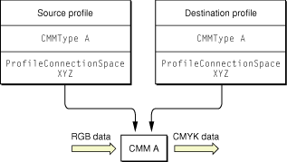
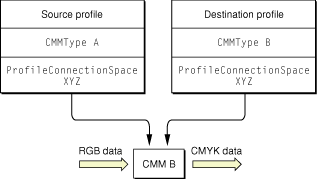
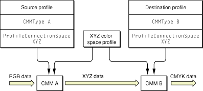
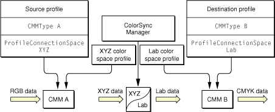
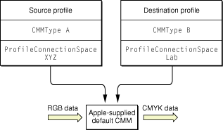
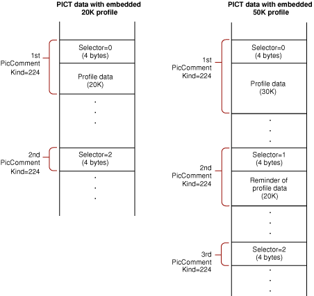

> 导航：[总目录](../../../README.md) · [documentation](../../../_indexes/documentation.md) · [Managing Colors With ColorSync in Mac OS 9](About%20This%20Document.md)


[Next](Developing%20ColorSync-Supportive%20Device%20Drivers.md)[Previous](Overview%20of%20ColorSync.md)

# Developing ColorSync-Supportive Applications

This section describes how your application can use the ColorSync Manager to provide many color management services. For a complete list, see [Developing Your ColorSync-Supportive Application](#apple-f4xwc4dqnrsv64tfmyxwi33df52wszbpkridgmbqgaydenzyfvbeeq2ijfduury).

Before you read this section, you should read [Overview of Color and Color Management Systems](Overview%20of%20Color%20and%20Color%20Management%20Systems.md#apple-f4xwc4dqnrsv64tfmyxwi33df52wszbpkridgmbqgaydeobqfvbeeq2cirduira) and [Overview of ColorSync](Overview%20of%20ColorSync.md#apple-f4xwc4dqnrsv64tfmyxwi33df52wszbpkridgmbqgaydenzzfvbeeq2gi5euesi). These sections provide an overview of color theory and color management systems (CMSs), define key terms, and describe the ColorSync Manager.

If you are developing a device driver that supports ColorSync, you should read this section in addition to [Developing ColorSync-Supportive Device Drivers](Developing%20ColorSync-Supportive%20Device%20Drivers.md#apple-f4xwc4dqnrsv64tfmyxwi33df52wszbpkridgmbqgaydenzxfvbegskii5duosi).

If your application works with images created by other applications, you should at least read [Providing Minimal ColorSync Support](#apple-f4xwc4dqnrsv64tfmyxwi33df52wszbpkridgmbqgaydenzyfvbeeq2eijfeesq), which explains how to preserve profiles embedded in images.

While reading this section, refer to _ColorSync Manager Reference_ for more information about the functions, constants, and data types used here.

[ColorSync Version Information](Version%20and%20Compatibility%20Information.md#apple-f4xwc4dqnrsv64tfmyxwi33df52wszbpkridgmbqgaydenzvfvbegskgjbeusra) describes the `Gestalt` information, shared library version numbers, CMM version numbers, and ColorSync header files you use with different versions of the ColorSync Manager. It also includes CPU and Mac OS system requirements.

The book Inside Macintosh: Imaging With QuickDraw describes how your application can use QuickDraw to create and display Macintosh graphics, and how to use the Printing Manager to print the images created with QuickDraw.

[What’s New](What%E2%80%99s%20New.md#apple-f4xwc4dqnrsv64tfmyxwi33df52wszbpkridgmbqgaydenzufvbecqskjfcesrq) explains where to get information on the Color Picker Manager, which provides your application with a standard dialog box for soliciting a color choice from users.

You should read [Important Note on Code Listings](About%20This%20Document.md#apple-f4xwc4dqnrsv64tfmyxwi33df52wszbpkridgmbqgaydenbzfvbeeq2diveeuri) before working with the code in this chapter.

ColorSync provides your application with color-matching capabilities that users can employ without the need for a proprietary environment. ColorSync provides the first system-level implementation of an industry-standard color-matching system. Because ColorSync supports the profile format defined by the International Color Consortium (ICC), a color image a user creates can be color matched, rendered, and modified by another user running another application on another platform that supports the format. Conversely, your application can modify and color match images created by other applications that support ColorSync or a CMS that includes support for the ICC profile format. For information on profile format version numbers, see [ColorSync and ICC Profile Format Version Numbers](Overview%20of%20ColorSync.md#apple-f4xwc4dqnrsv64tfmyxwi33df52wszbpkridgmbqgaydenzzfvbeeq2ijbeeory).

[ColorSync Version Information](Version%20and%20Compatibility%20Information.md#apple-f4xwc4dqnrsv64tfmyxwi33df52wszbpkridgmbqgaydenzvfvbegskgjbeusra) describes the `Gestalt` information, shared library version numbers, CMM version numbers, and ColorSync header files you use with different versions of the ColorSync Manager. It also describes CPU and Mac OS system requirements.

The ColorSync Manager programming interface allows your application to handle tasks such as color matching, color conversion, profile management, profile searching and accessing, reading individual tagged elements within a profile, embedding profiles in documents, and modifying profiles.

The ColorSync API is summarized in [Summary of the ColorSync Manager](#apple-f4xwc4dqnrsv64tfmyxwi33df52wszbpkridgmbqgaydenzyfvbeeq2kijeekqq). You can find detailed information about individual functions, data types, and constants in _ColorSync Manager Reference_. The ColorSync Manager includes a number of interface files you may need for your development efforts. These files are described in [ColorSync Header Files](Version%20and%20Compatibility%20Information.md#apple-f4xwc4dqnrsv64tfmyxwi33df52wszbpkridgmbqgaydenzvfvkfawcsivddcmbs).

Your ColorSync-supportive application can provide a rich set of color-matching features. Your application can color match images, pixel maps, bitmaps, and even individual colors. In addition to color matching, you can handle such tasks as color conversion, color gamut checking, soft proofing of images, profile management, profile searching and accessing, reading individual tagged elements within a profile, embedding profiles and profile identifiers in documents, extracting embedded profiles and profile identifiers, and modifying profiles and profile identifiers.

Your application can provide an interface that offers pop-up menus or other user interface items allowing a user to choose which profile to associate with an image and how an image is rendered. It can show the user the colors of an image that are in or out of gamut for a particular device on which the image is to be produced and how ColorSync adjusts for colors that are out of gamut. This allows the user to preview differences that occur in the color-matching transition between gamuts and make corrections if necessary.

Most of the terms and operations mentioned in this section are defined in [Overview of Color and Color Management Systems](Overview%20of%20Color%20and%20Color%20Management%20Systems.md#apple-f4xwc4dqnrsv64tfmyxwi33df52wszbpkridgmbqgaydeobqfvbeeq2cirduira) and [Overview of ColorSync](Overview%20of%20ColorSync.md#apple-f4xwc4dqnrsv64tfmyxwi33df52wszbpkridgmbqgaydenzzfvbeeq2gi5euesi).

ColorSync allows your application to preserve high fidelity to the original colors of an image—whether the image was created using your application or another—by supporting the use of embedded profiles. Your application can take advantage of a profile embedded along with an image, matching the original colors of the device used to create the image to those of the destination display or printer. Even if your application doesn’t support some of the more advanced features that ColorSync affords, such as soft proofing, you should color match images using the source profile, if one is identified and available.

At a minimum, your application should preserve images tagged with a profile by not stripping out picture comments used to embed profiles or by leaving profiles in documents that use other methods to include them.

It is important for your application to tag an image with the profile for the device used to create the image and to preserve existing tagging because a picture that is not tagged assumes use of a default profile as described in [Setting Default Profiles](Overview%20of%20ColorSync.md#apple-f4xwc4dqnrsv64tfmyxwi33df52wszbpkridgmbqgaydenzzfvbeeq2jiveukri). If the picture is moved to a different system that uses a different default profile, the picture will display differently. [Providing Minimal ColorSync Support](#apple-f4xwc4dqnrsv64tfmyxwi33df52wszbpkridgmbqgaydenzyfvbeeq2eijfeesq) explains how to preserve embedded profiles, and [Embedding Profiles and Profile Identifiers](#apple-f4xwc4dqnrsv64tfmyxwi33df52wszbpkridgmbqgaydenzyfvbeeq2kjjdusry) explains how to tag an image. Some of these features are described in greater detail in the rest of this material.

Profiles for use with the ColorSync Manager are stored in the ColorSync Profiles folder. The precise location of this folder can vary for different versions of ColorSync, as described in [Setting Default Profiles](Overview%20of%20ColorSync.md#apple-f4xwc4dqnrsv64tfmyxwi33df52wszbpkridgmbqgaydenzzfvbeeq2jiveukri). When you install ColorSync, the ColorSync Profiles folder contains a selection of display profiles for all Apple color monitors, as well as default profiles for standard color spaces and profiles for several Apple printers.

Starting with ColorSync 2.5, a user can select a default profile for certain color spaces from the ColorSync control panel, as described in [Setting Default Profiles](Overview%20of%20ColorSync.md#apple-f4xwc4dqnrsv64tfmyxwi33df52wszbpkridgmbqgaydenzzfvbeeq2jiveukri). Also starting with version 2.5, the Monitors & Sound control panel allows the user to select a separate profile for each monitor, as described in [Monitor Calibration and Profiles](Overview%20of%20ColorSync.md#apple-f4xwc4dqnrsv64tfmyxwi33df52wszbpkridgmbqgaydenzzfvbeeq2gjbbessq).

Your application specifies the profiles for color matching when the application calls a ColorSync Manager function. For most functions, the ColorSync Manager uses one of the default profiles if your application doesn’t specify a profile. Some functions require that you explicitly specify a profile by reference.

Device drivers for ColorSync-supportive input and output devices, such as scanners and printers, may install the profiles they use in the ColorSync Profiles folder, making them available to your application for color matching or gamut checking. If your application creates device link profiles, as described in [Creating and Using Device Link Profiles](#apple-f4xwc4dqnrsv64tfmyxwi33df52wszbpkridgmbqgaydenzyfvbeeq2ii5aukri), you should place those profiles in the ColorSync Profiles folder.

Your application can provide the interface to allow a user to choose a profile for a specific device. Using the ColorSync Manager functions described in _ColorSync Manager Reference_, your application can search the ColorSync Profiles folder and display information about available profiles.

See [Developing Your ColorSync-Supportive Application](#apple-f4xwc4dqnrsv64tfmyxwi33df52wszbpkridgmbqgaydenzyfvbeeq2ijfduury) for a list of programming examples that demonstrate many of these features. As described in [Providing Minimal ColorSync Support](#apple-f4xwc4dqnrsv64tfmyxwi33df52wszbpkridgmbqgaydenzyfvbeeq2eijfeesq), your application should, at a minimum, leave profile information intact in the documents and pictures that it imports or copies into its own documents.

When a ColorSync function performs a color matching or color checking operation, it must determine which CMM to use. You typically pass source and destination profiles to a function, either directly or as part of a color world—an abstract private data structure you create by calling either the `NCWNewColorWorld`, the `CWConcatColorWorld`, or the `CWNewLinkProfile` function. When you call one of the latter two functions to create a color world, you use the `CMConcatProfileSet` data structure to specify a series of one or more profiles for the color world.

A profile header contains a `CMMType` field that specifies a CMM for that profile. For example, Signature of ColorSync’s Default Color Manager describes a signature for the `CMMType` field that specifies ColorSync’s default CMM. When you set up a `CMConcatProfileSet` data structure to specify a series of profiles, you set the structure’s `keyIndex` field to specify the zero-based index of the profile within the array of profiles whose CMM (as indicated by its `CMMType` field) ColorSync should use. A CMM specified by this mechanism is called a key CMM.

As we have seen, an operation may use more than one profile and there are multiple factors that can affect the choice of a CMM. To deal with these factors, ColorSync uses the following algorithm to select a CMM:

1. Starting with version 2.5, a user can select a preferred CMM in the ColorSync control panel. If a user has chosen a preferred CMM, and if that CMM is available, ColorSync uses that CMM for all color checking and color matching operations the CMM can handle.

   If the preferred CMM is not available or cannot handle an operation, ColorSync uses the default CMM, as described in step 4.
2. Prior to ColorSync 2.5, or if the user has not selected a preferred CMM with the ColorSync control panel, or has selected Automatic, and if the ColorSync function takes a color world reference and the user has initialized the color world with `CWConcatColorWorld` or `CWNewLinkProfile`, ColorSync uses the key CMM.

   If the key CMM is not available or cannot handle an operation, ColorSync uses the default CMM, as described in step 4
3. Prior to ColorSync 2.5, or if the user has not selected a preferred CMM with the ColorSync control panel, or has selected Automatic, and if the ColorSync function takes a color world reference and the user has initialized the color world with `NCWNewColorWorld` (and therefore without a `CMConcatProfileSet` structure), ColorSync uses an arbitrated CMM or CMMs—a CMM or CMMs selected from the source and destination profiles as described in [Selecting a CMM by the Arbitration Algorithm](#apple-f4xwc4dqnrsv64tfmyxwi33df52wszbpkridgmbqgaydenzyfvbeeq2civducqy).

   If an arbitrated CMM is not available or cannot handle an operation, ColorSync uses the default CMM, as described in step 4.
4. If a CMM is not specified by one of the previous three steps, or if a specified CMM is not available or cannot handle an operation, ColorSync uses the default CMM—the robust CMM that is installed as part of the ColorSync extension. The default CMM supports all the required and optional functions defined by the ColorSync Manager, and is therefore a suitable CMM of last resort. The signature for the default CMM is specified by the constant kDefaultCMMSignature.

This section describes the arbitration algorithm, introduced in [How the ColorSync Manager Selects a CMM](#apple-f4xwc4dqnrsv64tfmyxwi33df52wszbpkridgmbqgaydenzyfvbeeq2cijdeura), ColorSync uses to select one or more arbitrated CMMs for a color matching or color checking operation:

- If the source and destination profiles specify the same CMM and that CMM component is available and able to perform the matching, then the specified CMM maps the colors directly from the color space of the source profile to the color space of the destination profile. This is the simplest scenario, and [Figure 4-1](#apple-f4xwc4dqnrsv64tfmyxwi33df52wszbpkridgmbqgaydenzyfvbeeq2jifeeiry) illustrates it.

__Figure 4-1__  Colormatching when the source and destination profiles specify the same CMM



- If the source and destination profiles specify different CMMs, then the ColorSync Manager follows these steps to choose the CMM:

  1. If the CMM specified by the destination profile is available, is able to perform the color matching using the two profiles, and is not the default CMM, then the ColorSync Manager uses this CMM. [Figure 4-2](#apple-f4xwc4dqnrsv64tfmyxwi33df52wszbpkridgmbqgaydenzyfvbeeq2giffessi) shows this scenario.

     __Figure 4-2__  Color matching using the destination profile’s CMM

     
  1. If the destination profile’s specified CMM is unavailable or unable to perform the color-matching request using the two profiles, then the ColorSync Manager looks for the CMM specified by the source profile. If the CMM specified by the source profile is available, is able to perform the color matching using the two profiles, and is not the default CMM, the ColorSync Manager uses this CMM. [Figure 4-3](#apple-f4xwc4dqnrsv64tfmyxwi33df52wszbpkridgmbqgaydenzyfvbeeq2kjjceqri) shows this scenario.

  __Figure 4-3__  Color matching using the source profile’s CMM

  
  1. If both the source-specified CMM and the destination-specified CMM are available, but neither is able to perform the match alone, the ColorSync Manager uses the source profile’s CMM to convert the colors of the source image from the source profile’s color space to an interchange color space using the XYZ color space profile as the destination profile. Next, the ColorSync Manager uses the CMM specified by the destination profile to convert the colors now specified in the interchange color space to colors expressed in the color space of the destination profile using the XYZ color space profile as the source profile. The color conversion and matching work this way if both profiles specify the same interchange color space. [Figure 4-4](#apple-f4xwc4dqnrsv64tfmyxwi33df52wszbpkridgmbqgaydenzyfvbeeq2ijbdukrq) shows this scenario.

  __Figure 4-4__  Color matching through an XYZ interchange space using both CMMs

  
  1. If both the source-specified CMM and the destination-specified CMM are available, but neither is able to perform the match alone and both profiles specify different interchange color spaces, the ColorSync Manager uses the source profile’s CMM to convert the colors of the source image from the source profile’s color space to its interchange color space using the appropriate color space profile as the destination profile. The example shown in [Figure 4-5](#apple-f4xwc4dqnrsv64tfmyxwi33df52wszbpkridgmbqgaydenzyfvbeeq2finceqra) uses the XYZ color space profile as the destination profile. Then the ColorSync Manager inserts a part into the process, itself converting colors from the source profile’s interchange color space to the destination profile’s interchange color space. Next, the ColorSync Manager uses the CMM specified by the destination profile to convert the colors now specified in the destination profile’s interchange color space to colors expressed in the destination profile’s color space using the appropriate color space profile as the source profile. The example shown in [Figure 4-5](#apple-f4xwc4dqnrsv64tfmyxwi33df52wszbpkridgmbqgaydenzyfvbeeq2finceqra) uses the Lab color space profile as the source profile.

  __Figure 4-5__  Matching using both CMMs and two interchange color spaces

  

- If neither the source nor the destination profile’s specified CMM is available or able to perform the color conversion and matching, then the ColorSync Manager uses the default CMM, which will always attempt to perform the match. [Figure 4-6](#apple-f4xwc4dqnrsv64tfmyxwi33df52wszbpkridgmbqgaydenzyfvbeeq2hindecrq) shows this scenario.

  __Figure 4-6__  Color matching using the default CMM

  

This section describes some of the tasks your application can perform to implement color-matching and color-checking features with the ColorSync Manager.

This section provides code samples for:

- [Determining If the ColorSync Manager Is Available](#apple-f4xwc4dqnrsv64tfmyxwi33df52wszbpkridgmbqgaydenzyfvbeeq2cirdeiry); revised for ColorSync 2.5
- [Providing Minimal ColorSync Support](#apple-f4xwc4dqnrsv64tfmyxwi33df52wszbpkridgmbqgaydenzyfvbeeq2eijfeesq)
- [Opening a Profile and Obtaining a Reference to It](#apple-f4xwc4dqnrsv64tfmyxwi33df52wszbpkridgmbqgaydenzyfvbeeq2jincesrq); revised for ColorSync 2.5
- [Identifying the Current System Profile](#apple-f4xwc4dqnrsv64tfmyxwi33df52wszbpkridgmbqgaydenzyfvbeeq2kjjbekrq)
- [Poor Man’s Exception Handling](#apple-f4xwc4dqnrsv64tfmyxwi33df52wszbpkridgmbqgaydenzyfvbeeq2kincekri); new for ColorSync 2.5
- [Getting the Profile for the Main Display](#apple-f4xwc4dqnrsv64tfmyxwi33df52wszbpkridgmbqgaydenzyfvbeeq2givdeosa); revised for ColorSync 2.5
- [Matching to Displays Using QuickDraw-Specific Operations](#apple-f4xwc4dqnrsv64tfmyxwi33df52wszbpkridgmbqgaydenzyfvbeeq2hi5cessi)
- [Creating a Color World to Use With the General Purpose Functions](#apple-f4xwc4dqnrsv64tfmyxwi33df52wszbpkridgmbqgaydenzyfvbeeq2jifdecri)
- [Matching Colors Using the General Purpose Functions](#apple-f4xwc4dqnrsv64tfmyxwi33df52wszbpkridgmbqgaydenzyfvbeeq2cizbecry)
- [Embedding Profiles and Profile Identifiers](#apple-f4xwc4dqnrsv64tfmyxwi33df52wszbpkridgmbqgaydenzyfvbeeq2kjjdusry)
- [Extracting Profiles Embedded in Pictures](#apple-f4xwc4dqnrsv64tfmyxwi33df52wszbpkridgmbqgaydenzyfvbeeq2fifaumqq)
- [Performing Optimized Profile Searching](#apple-f4xwc4dqnrsv64tfmyxwi33df52wszbpkridgmbqgaydenzyfvbeeq2djbcucry); new for ColorSync 2.5
- [Searching for Specific Profiles Prior to ColorSync 2.5](#apple-f4xwc4dqnrsv64tfmyxwi33df52wszbpkridgmbqgaydenzyfvbeeq2jjffeesi)
- [Searching for a Profile That Matches a Profile Identifier](#apple-f4xwc4dqnrsv64tfmyxwi33df52wszbpkridgmbqgaydenzyfvbeeq2direuqry)
- [Checking Colors Against a Destination Device’s Gamut](#apple-f4xwc4dqnrsv64tfmyxwi33df52wszbpkridgmbqgaydenzyfvbeeq2fjjeeiqy)
- [Creating and Using Device Link Profiles](#apple-f4xwc4dqnrsv64tfmyxwi33df52wszbpkridgmbqgaydenzyfvbeeq2ii5aukri)
- [Providing Soft Proofs](#apple-f4xwc4dqnrsv64tfmyxwi33df52wszbpkridgmbqgaydenzyfvbeeq2fijbucqq)
- [Calibrating a Device](#apple-f4xwc4dqnrsv64tfmyxwi33df52wszbpkridgmbqgaydenzyfvbeeq2jivbuori)
- [Accessing a Resource-Based Profile With a Procedure](#apple-f4xwc4dqnrsv64tfmyxwi33df52wszbpkridgmbqgaydenzyfvbeeq2fiveeesi)

To determine whether version 2.5 of the ColorSync Manager is available on a 68K-based or a PowerPC-based Macintosh system, you use the `Gestalt` function with the `gestaltColorMatchingVersion` selector. The function shown in [Listing 4-1](#apple-f4xwc4dqnrsv64tfmyxwi33df52wszbpkridgmbqgaydenzyfvbeeq2gjfduuqq) returns a Boolean value of `true` if version 2.5 or later of the ColorSync Manager is installed and `false` if not.

__Listing 4-1__  Determining if ColorSync 2.5 is available

```
Boolean ColorSync25Available (void)
{
    Boolean haveColorSync25 = false;
    long    version;

    if (Gestalt(gestaltColorMatchingVersion, &version) == noErr)
    {
        if (version >= gestaltColorSync25)
        {
            haveColorSync25 = true;
        }
    }
    return haveColorSync25;
}
```

If your application does not depend on features added for version 2.5 of the ColorSync Manager, use the ColorSync Gestalt selector for the ColorSync version you require. For example, you might substitute gestaltColorSync20 for gestaltColorSync25 in the previous function (and rename the function appropriately). To identify other versions of ColorSync, use any of the ColorSync Gestalt selector constants described in _ColorSync Manager Reference_. For related version information, see [ColorSync Version Information](Version%20and%20Compatibility%20Information.md#apple-f4xwc4dqnrsv64tfmyxwi33df52wszbpkridgmbqgaydenzvfvbegskgjbeusra).

ColorSync supports the profile format defined by the International Color Consortium (ICC). The ICC format provides a single cross-platform standard for translating color data across devices. The ICC’s common profile format allows one user to electronically transfer a document containing a color image to another user with the assurance that the original image will be rendered faithfully according to the source profile for the image.

To ensure this, the application or driver used to create the image stores the profile for the source device in the document containing the color image. The application can do this automatically or allow the user to tag the image. If the source profile is embedded within the document, a user can move the document from one system to another without concern for whether the profile used to create the image is available.

To support ColorSync, your application should, at a minimum, leave profile information intact in the documents and pictures it imports or copies. That is, your application should not strip out profile information from documents or pictures created with other applications. Even if your application does not use the profile information, users may be able to take advantage of it when using the documents or pictures with other applications.

For example, profiles and profile identifiers may be embedded in pictures that a user pastes into documents created by your application. A profile identifier is an abbreviated data structure that identifies, and possibly modifies, a profile in memory or on disk. For more information on profile identifiers, see [Searching for a Profile That Matches a Profile Identifier](#apple-f4xwc4dqnrsv64tfmyxwi33df52wszbpkridgmbqgaydenzyfvbeeq2direuqry). Profiles and profile identifiers can be embedded in formats such as PICT or TIFF files. For files of type `'PICT'`, the ColorSync Manager defines the following picture comments for embedding profiles and profile identifiers, and for performing color matching:

```
/* PicComment IDs */
enum {
    cmBeginProfile          = 220,  /* begin ColorSync 1.0 profile */
    cmEndProfile            = 221,  /* end a ColorSync 2.x or 1.0
                                        profile */
    cmEnableMatching        = 222,  /* begin color matching for either
                                        ColorSync 2.x or 1.0 */
    cmDisableMatching       = 223,  /* end color matching for either
                                        ColorSync 2.x or 1.0 */
    cmComment               = 224   /* embedded ColorSync 2.x profile
                                        information */
};
```

The picture comment `kind` value of cmComment is defined for embedded ColorSync Manager version 2.x profiles and profile identifiers. This picture comment is followed by a 4-byte selector that describes the type of data in the picture comment.

```
/* PicComment selectors for cmComment */
enum {
    cmBeginProfileSel       = 0,    /* begining of a ColorSync 2.x
                                        profile; profile data to
                                        follow */
    cmContinueProfileSel    = 1,    /* continuation of a ColorSync
                                        2.x profile; profile data to
                                        follow */
    cmEndProfileSel         = 2     /* end of ColorSync 2.x profile
                                        data; no profile data follows */
    cmProfileIdentifierSel  = 3     /* profile identifier information
                                        follows; the matching profile
                                        may be stored in the image or
                                        on disk */
};
```

Your application should leave these comments and the embedded profile information they define intact. Similarly, if your application imports or converts file types defined by other applications, your application should maintain the profile information embedded in those files, too.

Your application can also embed picture comments and profiles in documents and pictures it creates or modifies. For information describing how to do this, see [Embedding Profiles and Profile Identifiers](#apple-f4xwc4dqnrsv64tfmyxwi33df52wszbpkridgmbqgaydenzyfvbeeq2kjjdusry). Inside Macintosh: Imaging With QuickDraw describes picture comments in detail.

Most of the ColorSync Manager functions require that your application identify the profile or profiles to use in carrying out the work of the function. For example, when your application calls functions to perform color matching or color gamut checking, you must identify the profiles to use for the session. For functions that use QuickDraw, you specify a source profile and a destination profile. For general purpose functions, you specify a color world containing source and destination profiles or a set of concatenated profiles. You can also create a device link profile, which is described in [Creating and Using Device Link Profiles](#apple-f4xwc4dqnrsv64tfmyxwi33df52wszbpkridgmbqgaydenzyfvbeeq2ii5aukri), but to do so your application must first obtain references to all the profiles that will comprise the device link profile.

The ColorSync Manager provides for multiple concurrent accesses to a single profile through use of a private data structure called a profile reference. A profile reference is a unique reference to a profile; it is the means by which your application identifies a profile and gains access to the contents of that profile. Many applications can use the same profile at the same time, each with its own reference to the profile. However, an application can only change a profile if it has the only reference to the profile.

To open a profile and obtain a reference to it, you call the function `CMOpenProfile`. You can also obtain a profile reference from the `CMCopyProfile`, `CWNewLinkProfile`, and `CMNewProfile` functions. To identify a profile that is file based, memory based, or accessed through a procedure, you must give its location.

The ColorSync Manager defines the `CMProfileLocation` data type to specify a profile’s location:

```
struct CMProfileLocation {
    short        locType;   /* specifies the location type */
    CMProfLoc    u;         /* structure for specified type */
};
```

The `CMProfileLocation` structure contains the u field of type `CMProfLoc`. The `CMProfLoc` type is a union that can provide access to any of the structures `CMFileLocation`, `CMHandleLocation`, `CMPtrLocation`, or `CMProcedureLocation`.

The data you specify in the u field indicates the actual location of the profile. In most cases, a ColorSync profile is stored in a disk file and you use the union for a file specification. However, a profile can also be located in memory, or in an arbitrary location (such as a resource) that is accessed through a procedure provided by your application. For more information on profile access, see [Accessing a Resource-Based Profile With a Procedure](#apple-f4xwc4dqnrsv64tfmyxwi33df52wszbpkridgmbqgaydenzyfvbeeq2fiveeesi). In addition, you can specify that a profile is temporary, meaning that it will not persist in memory after your application uses it for a color session.

To identify the data type in the `u` field of the `CMProfileLocation` structure, you assign to the `CMProfileLocation.locType` field one of the constants or numeric equivalents defined by the following enumeration:

```
enum {
    cmNoProfileBase         = 0,    /* the profile is temporary */
    cmFileBasedProfile      = 1,    /* file-based profile */
    cmHandleBasedProfile    = 2,    /* handle-based profile */
    cmPtrBasedProfile       = 3     /* pointer-based profile */
    cmProcedureBasedProfile = 4     /* procedure-based profile */
};
```

For example, for a file-based profile, the `u` field would hold a file specification and the `locType` field would hold the constant `cmFileBasedProfile`. Your application passes a `CMProfileLocation` structure when it calls the `CMOpenProfile` function and the function returns a reference to the specified profile.

[Listing 4-2](#apple-f4xwc4dqnrsv64tfmyxwi33df52wszbpkridgmbqgaydenzyfvbeeq2ii5fesry) shows an application-defined function, `MyOpenProfileFSSpec`, that assigns the file specification for a profile file to the `profLoc` union and identifies the location type as file-based. It then calls the `CMOpenProfile` function, passing to it the profile’s file specification and receiving in return a reference to the profile.

__Listing 4-2__  Opening a reference to a file-based profile

```
CMError MyOpenProfileFSSpec (FSSpec spec, CMProfileRef *prof)
{
    CMError                 theErr;
    CMProfileLocation       profLoc;

    profLoc.u.fileLoc.spec = spec;
    profLoc.locType = cmFileBasedProfile;

    theErr = CMOpenProfile(prof, &profLoc);

    return theErr;
}
```


The ColorSync Manager keeps an internal reference count for each profile reference returned from a call to the `CMOpenProfile`, `CMCopyProfile`, `CMNewProfile`, or `CWNewLinkProfile` functions. Calling the `CMCloneProfileRef` function increments the count; calling the `CMCloseProfile` function decrements it. When the count reaches 0, the ColorSync Manager releases all private memory, files, or resources allocated in association with that profile. The profile remains open as long as the reference count is greater than 0, indicating that at least one task retains a reference to the profile. You can determine the current reference count for a profile reference by calling the `CMGetProfileRefCount` function.

When your application passes a copy of a profile reference to an independent task, whether synchronous or asynchronous, the task should call CMCloneProfileRef to increment the reference count. Both the called task and the caller should call `CMCloseProfile` when finished with the profile reference. This ensures that the tasks can finish independently of each other.

When your application passes a copy of a profile reference internally, it may not need to call CMCloneProfileRef, as long as the application calls `CMCloseProfile` once and only once for the profile.

[Listing 4-3](#apple-f4xwc4dqnrsv64tfmyxwi33df52wszbpkridgmbqgaydenzyfvbeeq2ijbeeqrq) shows a macro definition that is used in several subsequent code listings. In this macro, if `assertion` evaluates to `false`, execution continues at the location `exception`. Otherwise, execution continues at the next statement following the macro.

__Listing 4-3__  Poor man’s exception handling macro

```
// Equivalent to  if ((assertion) == false) goto exception;
#define require(assertion, exception)   \
    do {                                \
        if (assertion) ;                \
        else { goto exception; }        \
    } while (false)
```

You can find examples of how to use this macro in [Listing 4-4](#apple-f4xwc4dqnrsv64tfmyxwi33df52wszbpkridgmbqgaydenzyfvbeeq2kirbeeqq), [Listing 4-5](#apple-f4xwc4dqnrsv64tfmyxwi33df52wszbpkridgmbqgaydenzyfvbeeq2gjjdeeri) and others. While this style of poor man’s exception handling may not appeal to all developers, it does offer these advantages:

- It improves readability because it avoids pushing code off the page with multiple nested if then else clauses and by limiting the number of `return` statements in the code.
- You can enhance the macro to provide debug messages that supply useful runtime information about the error or where it occurred.

For the functions `NCMBeginMatching`, `NCMUseProfileComment`, and `NCWNewColorWorld`, your application can specify `NULL` to signify the system profile. For all other functions—for example, the `CMGetProfileElement` function, the `CMValidateProfile` function, and the `CMCopyProfile` function—for which you want to specify the system profile, you must give an explicit reference to the profile. You can use the `CMGetSystemProfile` function to obtain a reference to the system profile.

Each profile, including the profile configured as the system profile, has a name associated with it. If your application needs to display the name of the system profile to the user, it can call CMGetSystemProfile, as shown in [Figure 4-4](#apple-f4xwc4dqnrsv64tfmyxwi33df52wszbpkridgmbqgaydenzyfvbeeq2ijbdukrq), to get the system profile, then call the `CMGetScriptProfileDescription` function to get the profile name and script code.

__Listing 4-4__  Identifying the current system profile

```
CMError MyPrintSystemProfileName (void)
{
    CMError         theErr;
    CMProfileRef    sysProf;
    Str255          profName;
    ScriptCode      profScript;
    theErr = CMGetSystemProfile(&sysProf);
    require(theErr == noErr, cleanup);

    theErr = CMGetScriptProfileDescription(sysProf, profName,
                                                &profScript);
    require(theErr == noErr, cleanup);
    // … call Script Mgr to get correct font for script …

    DrawString(profname);

// Do any necessary cleanup. In this case, just return.
cleanup:
    return theErr;
}
```


Starting with ColorSync version 2.5, a user can select a separate profile for each display, as described in [Setting a Profile for Each Monitor](Overview%20of%20ColorSync.md#apple-f4xwc4dqnrsv64tfmyxwi33df52wszbpkridgmbqgaydenzzfvbeeq2di5buqsq). In your code, you can determine the profile for any display for which you know the AVID by calling the function `CMGetProfileByAVID`, which is also new in version 2.5. You can get more information about AVID values from the Display Manager SDK.

[Listing 4-5](#apple-f4xwc4dqnrsv64tfmyxwi33df52wszbpkridgmbqgaydenzyfvbeeq2gjjdeeri) shows how to get the profile for the main display (the one that contains the menu bar).

__Listing 4-5__  Getting the profile for the main display

```
CMError GetProfileForMainDisplay (CMProfileRef *prof)
{
    CMError     theErr;
    AVIDType    theAVID;
    GDHandle    theDevice;

    // Get the main GDevice.
    theDevice = GetMainDevice();

    // Get the AVID for that device.
    theErr = DMGetDisplayIDByGDevice(theDevice, &theAVID, true);
    require(theErr == noErr, cleanup);

    // Get the profile for that AVID.
    theErr = GetProfileByAVID(theAVID, prof);
    require(theErr == noErr, cleanup);

// Do any necessary cleanup. In this case, just return.
cleanup:
    return theErr;
}
```

This code first gets a graphic device handle for the main display, then calls the Display Manager routine `DMGetDisplayIDByGDevice` to get an AVID for the device. It then passes the AVID to the ColorSync Manager routine `CMGetProfileByAVID` to get a profile reference to the profile for the display.

To provide images and pictures showing consistent colors across displays, your application can use ColorSync to match the colors in a user’s pictures and documents with the colors available on the user’s current display. If a color cannot be reproduced on the system’s current display, ColorSync maps the color to the color gamut of the display according to the specifications defined by the profiles. [When Color Matching Occurs](Overview%20of%20ColorSync.md#apple-f4xwc4dqnrsv64tfmyxwi33df52wszbpkridgmbqgaydenzzfvbeeq2hjjeuuqi) describes both QuickDraw-specific and general purpose ColorSync functions for color matching.

The ColorSync Manager provides two QuickDraw-specific functions that your application can call to draw a color picture to the current display. The function `NCMDrawMatchedPicture` matches the picture’s colors to the display’s gamut defined by the specified display profile. It uses the system profile as the initial source profile but switches to any embedded profiles as they are encountered. The function `NCMBeginMatching` uses the source and destination profiles you specify to match the colors of the source image to the colors of the device for which it is destined.

The current display device’s profile is typically configured as the system profile. A user can do this with the ColorSync control panel. However, starting with ColorSync 2.5, a user can use the Monitors & Sound control panel to set a separate profile for each display, as described in [Setting a Profile for Each Monitor](Overview%20of%20ColorSync.md#apple-f4xwc4dqnrsv64tfmyxwi33df52wszbpkridgmbqgaydenzzfvbeeq2di5buqsq). When a user sets a profile for a display, ColorSync makes that profile the current default system profile.

Because the ColorSync Manager assumes the system profile is that of the current display, you can pass a value of `NULL` to the QuickDraw-specific functions instead of supplying an explicit profile reference. Passing `NULL` for a profile reference directs the ColorSync Manager to use the system profile. Note however, that starting with ColorSync 2.5, if you know the primary display for the image, and you know the AVID for that display, you can call `CMGetProfileByAVID` to get the profile for the specific display. For example, [Listing 4-5](#apple-f4xwc4dqnrsv64tfmyxwi33df52wszbpkridgmbqgaydenzyfvbeeq2gjjdeeri) shows how to get the profile for the main display (the one with the menu bar).

The following sections describe how to use ColorSync’s QuickDraw-specific matching functions, which automatically perform color matching in a manner acceptable to most applications. However, if your application needs a finer level of control over color matching than is supplied by the QuickDraw-specific functions, you can use the general purpose functions described in[Matching Colors Using the General Purpose Functions](#apple-f4xwc4dqnrsv64tfmyxwi33df52wszbpkridgmbqgaydenzyfvbeeq2cizbecry) to match the colors of a bitmap, a pixel map, or a list of colors.

If a user copies a picture that includes a profile or profile identifier into one of your application’s documents, your application can use the ColorSync Manager’s QuickDraw-specific function `NCMDrawMatchedPicture` to match the colors in that picture to the display on which you draw it.

As the picture is drawn, the `NCMDrawMatchedPicture` function automatically matches all colors to the color gamut of the display device, using the destination profile passed in the `dst` parameter. To use this function, you need to supply only the profile for the destination display device. The function acknowledges color-matching picture comments embedded in the picture and uses embedded profiles and profile identifiers. The source profile for the device on which the image was created should be embedded in the QuickDraw picture whose handle you pass to the function; the `NCMDrawMatchedPicture` function uses the embedded source profile, if it exists. If the source profile is not embedded, the function uses the current system profile as the source profile.

A picture may have more than one profile embedded, and may embed profile identifiers that refer to, and possibly modify, embedded profiles or profiles on disk. If the profiles and profile identifiers are embedded correctly, the `NCMDrawMatchedPicture` function will use them successively, as they are encountered.

By specifying `NULL` as the destination profile when you use this function, you are assured that the system profile—typically set to the profile for the main screen—is used as the destination profile. Alternatively, your application can call the `CMGetSystemProfile` function to obtain a reference to the profile and specify the system profile explicitly. Or, starting in ColorSync version 2.5, if you know the AVID for the display on which drawing takes place, you can call `CMGetProfileByAVID` to get the profile for the display.

[Listing 4-6](#apple-f4xwc4dqnrsv64tfmyxwi33df52wszbpkridgmbqgaydenzyfvbeeq2djbauoqq) shows sample code that uses the QuickDraw-specific function `NCMDrawMatchedPicture` to perform color matching to a display. The code gets a profile for the destination display using an AVID if it is available; otherwise, it passes `NULL` to the `NCMDrawMatchedPicture` function to specify the system profile.

__Listing 4-6__  Matching a picture to a display

```
// Matching a picture to a display
CMError MyDrawPictureToADisplay (PicHandle thePict, AVIDType theAVID, Rect *destRect)
{
    CMError         theErr;
    CMProfileRef    destProf;

    // Init for error handling.
    theErr = noErr;
    destProf = NULL;

    // If caller supplied an AVID and CS 2.5 is running...
    if (theAVID && ColorSync25Available() )
    {
        theErr = GetProfileByAVID(theAVID, &destProf);
        require(theErr == noErr, cleanup);
    }
    else
    {
        // Use the System profile as the destination.
        destProf = NULL;
    }
    // Draw the picture, with color matching.
    NCMDrawMatchedPicture(thePict, destProf, destRect);
    theErr = QDError();
    require(theErr == noErr, cleanup);

// Do any necessary cleanup. If necessary, close the profile.
cleanup:

    if (destProf)
        CMCloseProfile(destProf);

    return theErr;
}
```


For embedded profiles (and profile identifiers) to operate correctly, the currently effective profile must be terminated by a picture comment of `kind``cmEndProfile` after drawing operations using that profile are performed. If a picture comment was not specified to end the profile, the profile will remain in effect until the next embedded profile is encountered with a picture comment of `kind cmBeginProfile`. However, use of the next profile might not be the intended action. It is good practice to always pair use of the `cmBeginProfile` and `cmEndProfile` picture comments. When the ColorSync Manager encounters an `cmEndProfile` picture comment, it restores use of the system profile for matching until it encounters another `cmBeginProfile` picture comment.

If your application allows a user to modify and save an image that you color matched using the function `NCMUseProfileComment`, your application should either embed the destination profile in the picture file or convert and match the colors of the modified image to the colors of the source profile. By doing this your application ensures the integrity of the image during future operations and display. The method you choose is specific to your application.

To use Color QuickDraw functions to draw a document with colors matched to a display, your application can simply use the `NCMBeginMatching` function before calling Color QuickDraw functions, then conclude its drawing with the `CMEndMatching` function. For example, you might want to do this to customize settings in the profile that affect the matching operation. For more information on Color QuickDraw drawing functions, see Inside Macintosh: Imaging With QuickDraw.

To use the `NCMBeginMatching` function, you must specify both the source and destination profiles. The `NCMBeginMatching` function returns a reference to the color-matching session in its myRef parameter. You then pass the reference to the `CMEndMatching` function to terminate color matching. Code for performing this operation is not shown here.

A color world is a reference to a private ColorSync structure that represents a unique color-matching session. Although profiles can be large, a color world is a compact representation of the mapping needed to match between profiles. Conceptually, you can think of a color world as a sort of matrix multiplication of two or more profiles that distills all the information contained in the profiles into a fast, multidimensional lookup table.

For the ColorSync Manager general purpose functions, a color world characterizes how the color-matching session will occur based on information contained in the profiles that you supply when your application sets up the color world. [When Color Matching Occurs](Overview%20of%20ColorSync.md#apple-f4xwc4dqnrsv64tfmyxwi33df52wszbpkridgmbqgaydenzzfvbeeq2hjjeuuqi) describes both general purpose and QuickDraw-specific ColorSync functions for color matching. Your application can define a color world for color transformations between a source profile and a destination profile, or it can define a color world for color transformations between a series of concatenated profiles.

For the general purpose ColorSync Manager functions, a color world is the equivalent of the ColorSync Manager QuickDraw-based functions’ source and destination profiles. From your application’s perspective, the difference in specifying profiles for the general purpose functions is that instead of calling a function and passing it references to the profiles for the session, first you must create a color world using those profile references and pass the color world to the function. This general purpose interface provides better performance during color-matching.

Your application calls the `NCWNewColorWorld` function to set up a simple color world for color transformations involving two profiles—a source profile and a destination profile—and the function returns a reference to the color world it creates. Setting up a color world for color processing involving a series of concatenated profiles or a single device link profile, which contains a series of profiles, is slightly more complex. Here are the steps you take:

1. Obtain references to the profiles to use for the concatenated color world.

   For information describing how to obtain references to the profiles for the color world, see [Obtaining Profile References](#apple-f4xwc4dqnrsv64tfmyxwi33df52wszbpkridgmbqgaydenzyfvbeeq2kireeesi).
2. Set up an array containing references to the profiles comprising the set.

   Before your application calls the function `CWConcatColorWorld` to create the color world, you must establish the profile set. The ColorSync Manager defines the following data structure of type `CMConcatProfileSet` that you use to specify the profile set:

   `struct CMConcatProfileSet { unsigned shortkeyIndex; unsigned shortcount; CMProfileRefprofileSet[1]; };`

   Your application also uses the `CMConcatProfileSet` data structure to define a profile set for a device link profile. See [Creating and Using Device Link Profiles](#apple-f4xwc4dqnrsv64tfmyxwi33df52wszbpkridgmbqgaydenzyfvbeeq2ii5aukri) for more information.

   Your application creates an array that contains references to the profiles for the color world, specifying these references in processing order. You specify the one-based number of profile references in the array by setting the value of the `CMConcatProfileSet.count` field. You assign the profile array to the `CMConcatProfileSet.profileSet` field.

   The ColorSync Manager defines rules governing the types of profiles you can specify in a profile array. These rules differ depending on whether you are creating a profile set to create a device link profile or to create a concatenated color world. For a list of the rules defining the types of profiles you can use for these purposes, see `CWNewLinkProfile` and `CWConcatColorWorld`.
3. Identify the CMM for color processing.

   Each of the profiles whose references you give identifies a CMM for color processing involving that profile. To perform color transformation using a series of profiles, the ColorSync Manager uses only one CMM. You use the `CMConcatProfileSet.keyIndex` field to identify the index into the array corresponding to the profile whose specified CMM is to be used. The array is zero based, so you must specify the `CMConcatProfileSet.keyIndex` value as a number in the range of 0 to `count` – 1, where `count` is the number of elements in the array.
4. Call the CWConcatColorWorld function to set up the color world.

   You pass the `CWConcatColorWorld` function a parameter of type `CMConcatProfileSet` to specify the profile array, and the function returns a color world reference. To perform color matching or gamut checking using the profiles comprising a color world, you call the general purpose function passing it the reference to the color world.

   Using a device link profile for the general purpose functions entails additional steps, described in [Creating and Using Device Link Profiles](#apple-f4xwc4dqnrsv64tfmyxwi33df52wszbpkridgmbqgaydenzyfvbeeq2ii5aukri).

[When Color Matching Occurs](Overview%20of%20ColorSync.md#apple-f4xwc4dqnrsv64tfmyxwi33df52wszbpkridgmbqgaydenzzfvbeeq2hjjeuuqi) describes both general purpose and QuickDraw-specific ColorSync functions for color matching. Using the general purpose functions `CWMatchPixMap` or `CWMatchBitmap`, your application can match the colors of a pixel image or a bitmap image to the display’s color gamut without relying on QuickDraw.

Color matching occurs relatively quickly, but for a session involving a large pixel image or bitmap image, the color-matching process may take some time. To keep the user informed, you can provide a progress-reporting function. For example, your function can display an indicator, such as a progress bar, to depict how much of the matching has been done and how much remains. Your function can also allow the user to interrupt the color-matching process.

When your application calls either the `CWMatchPixMap` function or the `CWMatchBitmap` function, you can pass the function a pointer to your callback progress-reporting function and a reference constant containing data, such as the progress bar dialog box’s window reference. When the CMM used to match the colors calls your progress-reporting function, it passes the reference constant to it. If you provide a progress-reporting function, here is how you should declare the function, assuming you name it `MyCMBitmapCallBackProc:`

```
pascal Boolean MyCMBitmapCallBackProc (long progress, void *refCon);
```

For a complete description of the progress-reporting function declaration, see `MyCMBitmapCallBackProc`.

To use the `CWMatchPixMap` and `CWMatchBitmap` functions, your application must first set up a color world that specifies the profiles involved in the color-matching session as described in [Creating a Color World to Use With the General Purpose Functions](#apple-f4xwc4dqnrsv64tfmyxwi33df52wszbpkridgmbqgaydenzyfvbeeq2jifdecri). The color world establishes how matching will take place between the profiles. [Listing 4-7](#apple-f4xwc4dqnrsv64tfmyxwi33df52wszbpkridgmbqgaydenzyfvbeeq2hizceisi) shows how to match the colors of a bitmap using the general purpose functions that take a color world.

The ColorSync Manager uses the `PixMap` data type defined by Color QuickDraw. The ColorSync Manager defines and uses the `cmBitmap` data type, based on the classic QuickDraw `Bitmap` data type.

Your application can call the function `CWMatchPixMap` to match the colors of a pixel image to the display’s color gamut. To use `CWMatchPixMap`, you first create a color world, as described in [Creating a Color World to Use With the General Purpose Functions](#apple-f4xwc4dqnrsv64tfmyxwi33df52wszbpkridgmbqgaydenzyfvbeeq2jifdecri). The color world is based on the source profile for the device used to create the pixel image and the destination profile for the display on which the image is shown.

To match the colors of a pixel image to the display’s color gamut, the source profile for the color world must specify a data color space of RGB as its `dataColorSpace` element value to correspond to the pixel map data type, which is implicitly RGB. If the source profile you specify for the color world is the original source profile used to create the pixel image, most likely these values match. However, if you want to verify that the source profile’s `dataColorSpace` element specifies RGB, you can use the `CMGetProfileHeader` function to obtain the profile header. The profile header contains the `dataColorSpace` element field. For a pixel image, the display profile’s `dataColorSpace` element must also be set to RGB; this is the color space commonly used for displays.

If the source profile is embedded in the document containing the pixel map, your application can extract the profile and open a reference to it before you create the color world. For information on how to extract an embedded profile, see [Extracting Profiles Embedded in Pictures](#apple-f4xwc4dqnrsv64tfmyxwi33df52wszbpkridgmbqgaydenzyfvbeeq2fifaumqq). If the source profile is installed in the ColorSync Profiles folder, your application can display a list of profiles to the user to allow the user to select the appropriate one.

Matching the colors of a bitmap image to the current system’s display is similar to the process of matching a pixel map’s colors, except that the data type of a bitmap image is explicitly stated in the `space` field of the bitmap. You can specify a bitmap image using any of the following data types: `cmGraySpace`, `cmGrayASpace`, `cmRGB16Space`, cmRGB24Space, `cmRGB32Space`, `cmARGB32Space`, `cmRGB48Space`, `cmCMYK32Space`, `cmCMYK64Space`, `cmHSV32Space`, `cmHLS32Space`, `cmYXY32Space`, `cmXYZ32Space`, `cmLUV32Space`, `cmLAB24Space`, `cmLab32Space`, `cmLAB48Space`, `cmNamedIndexed32Space`, `cmMCFive8Space`, `cmMCSix8Space`, `cmMCSeven8Space`, or `cmMCEight8Space`. The data type of the source bitmap image must correspond to the data color space specified by the color world’s source profile.

When you call the `CWMatchBitmap` function, you can pass it a pointer to a bitmap to hold the resulting image. In this case, you must allocate the pixel buffer pointed to by the `image` field of the `CMBitmap` structure. Because the `CWMatchBitmap` function allows you to specify a separate bitmap to hold the resulting color-matched image, you must ensure that the data type you specify in the `space` field of the resulting bitmap matches the destination’s color data space. On input, the color space of the source profile must match the color space of the bitmap. If you specify `NULL` for the destination bitmap, on successful output, ColorSync will change the `space` field of the source bitmap to reflect the bitmap space to which the source image was mapped.

Rather than create a bitmap for the color-matched image, you can match the bitmap in place. To do so, you specify `NULL` instead of passing a pointer to a resulting bitmap.

The code in [Listing 4-7](#apple-f4xwc4dqnrsv64tfmyxwi33df52wszbpkridgmbqgaydenzyfvbeeq2hizceisi) shows how to set up a bitmap for the resulting color-matched image before calling the `CWMatchBitmap` function to perform the color matching. The `MyMatchImage` function calls the `MyGetImageProfile` function (not shown) to obtain an embedded profile from the image. If none is found, it calls the `MyGetImageSpace` function (also not shown) to determine the color space for the profile, then calls the ColorSync routine `CMGetDefaultProfileBySpace` to obtain the default profile for that space.

The `MyMatchImage` function then calls `GetProfileForMainDisplay`, shown in [Listing 4-5](#apple-f4xwc4dqnrsv64tfmyxwi33df52wszbpkridgmbqgaydenzyfvbeeq2gjjdeeri), to get the destination profile. It uses the source and destination profiles to set up a color world by calling `NCWNewColorWorld`, then uses the resulting color world when it calls `CWMatchBitmap` to match the colors to the display.

__Listing 4-7__  Matching the colors of a bitmap using a color world

```
void MyMatchImage (FSSpec theImage)
{
    CMError         theErr;
    CMProfileRef    sourceProf;
    CMProfileRef    destProf;
    CMWorldRef      cw;
    CMBitmap        bitmap;
    OSType          theSpace;

    /* Init for error handling. If any error during process,
        jump to cleanup area and quit trying. */
    theErr = noErr;
    sourceProf = nil;
    destProf = nil;
    cw = nil;
    bitmap.image = nil;

    // Determine source profile.
    // 1st - try to find an embedded profile
    theErr = MyGetImageProfile(theImage, &sourceProf);
    if (theErr == noErr)
    {
        // 2nd - use default profile for the image space
        theErr = MyGetImageSpace(theSpace, &sourceProf);
        require(theErr == noErr, cleanup);

        theErr = CMGetDefaultProfileBySpace(theSpace, &sourceProf);
        require(theErr == noErr, cleanup);
    }
    require(theErr == noErr, cleanup);

    // Determine dest profile.
    theErr = GetProfileForMainDisplay(&destProf);
    require(theErr == noErr, cleanup);

    // Set up a color world.
    theErr = NCWNewColorWorld(&cw, sourceProf, destProf);
    require(theErr == noErr, cleanup);

    // close profiles after setting up color world.
    if (sourceProf)
        CMCloseProfile(sourceProf);
    if (destProf)
        CMCloseProfile(destProf);
    sourceProf = destProf = nil;

    // Read the image into the CMBitmap structure
    theErr = MyGetImageBitmap(theImage, &bitmap);
    require(theErr == noErr, cleanup);

    // Match bitmap in place.
    theErr = CWMatchBitmap(cw, &bitmap, nil, nil, nil);
    require(theErr == noErr, cleanup);

    // Render results here ... (code not shown)

/* Do any necessary cleanup:close profiles and dispose of
    color world and bitmap. */
cleanup:

    if (sourceProf)
        CMCloseProfile(sourceProf);
    if (destProf)
        CMCloseProfile(destProf);
    if (cw)
        CWDisposeColorWorld(cw);
    if (bitmap.image)
        DisposePtr(bitmap.image);

    return theErr;
}
```


When the user creates and saves a document or picture containing a color image created or modified with your application, your application can provide for future color matching by saving—along with that document or picture—the profile for the device on which the image was created or modified. In addition to a profile—or instead of a profile—your application can save a profile identifier. A profile identifier is an abbreviated data structure that identifies, and possibly modifies, a profile in memory or on disk.

When embedding source profiles or profile identifiers in the documents created by your application, you can store them in any manner that you choose. For example, you may choose to have your application store, in the resource fork of the document file, one profile for an entire image, or a separate profile for every object in an image, or a separate profile identifier that points to a profile on disk for every device on which the user modified the image.

When embedding source profiles or profile identifiers in PICT file pictures, your application should use the `cmComment` picture comment, which has a `kind` value of 224 and is defined for embedded version 2.x profiles. This comment is followed by a 4-byte selector that describes the type of data in the comment. The following selectors are currently defined:

| Selector | Value | Description |
| --- | --- | --- |
| `cmBeginProfileSel` | 0 | Beginning of a version 2.x profile. Profile data to follow. |
| `cmContinueProfileSel` | 1 | Continuation of version 2.x profile data. Profile data to follow. |
| `cmEndProfileSel` | 2 | End of version 2.x profile data. No profile data follows. |
| `cmProfileIdentifierSel` | 3 | Profile identifier follows. A profile identifier identifies a profile that may reside in memory or on disk. |

Because the `dataSize` parameter of the `PicComment` procedure is a signed 16-bit value, the maximum amount of profile data that can be embedded in a single picture comment is 32,763 bytes (32,767 – 4 bytes for the selector).

You can embed a larger profile by using multiple picture comments of selector type `cmContinueProfileSel`, as shown in [Listing 4-7](#apple-f4xwc4dqnrsv64tfmyxwi33df52wszbpkridgmbqgaydenzyfvbeeq2hizceisi). You must embed the profile data in consecutive order, and you must conclude the profile data by embedding a picture comment of selector type `cmEndProfileSel`. The ColorSync Manager provides the `NCMUseProfileComment` function to automate the process of embedding profile information.

[Listing 4-7](#apple-f4xwc4dqnrsv64tfmyxwi33df52wszbpkridgmbqgaydenzyfvbeeq2hizceisi) shows how profile data is embedded in a PICT file picture as a series of picture comments. The illustration shows two embedded profiles. The first profile contains less than 20K of data, so its data can be stored in one picture comment with selector type `cmBeginProfileSel`. Note, however, that a second comment of selector type `cmEndProfileSel`, containing no data, concludes the embedded profile.

The second embedded profile shown in [Listing 4-7](#apple-f4xwc4dqnrsv64tfmyxwi33df52wszbpkridgmbqgaydenzyfvbeeq2hizceisi) has more than 32K of data, so its data must be stored in two consecutive picture comments. The first comment has selector type `cmBeginProfileSel`, while the second has type `cmContinueProfileSel`. If the profile were larger and required additional picture comments, each additional comment would have selector type `cmContinueProfileSel`. As with all embedded profiles, the final picture comment has selector type `cmEndProfileSel`.

For version 1.0 of the ColorSync Manager, you use picture comment types `cmBeginProfile` and `cmEndProfile` to begin and end a picture comment. The `cmBeginProfile` comment is not supported for ColorSync version 2.x profiles; however, the you can use the `cmEndProfile` comment to end the current profile for both ColorSync 1.0 and 2.x. Following a `cmEndProfile` comment, the ColorSync Manager reverts to the system profile. You use the `cmEnableMatching` and `cmDisableMatching` picture comments to begin and end color matching in both ColorSync 1.0 and 2.x. See _Inside Macintosh: Imaging With QuickDraw_ for more information about picture comments.

__Figure 4-7__  Embedding profile data in a PICT file picture



The ColorSync Manager provides the function `NCMUseProfileComment` to automate the process of embedding a profile or profile identifier. This function generates the picture comments required to embed the specified profile or identifier into the open picture. It calls the QuickDraw `PicComment` function with a picture comment `kind` value of `cmComment` and a 4-byte selector that describes the type of data in the picture comment: 0 to begin the profile, 1 to continue, and 2 to end the profile; or 3 for a profile identifier. For a profile, if the size in bytes of the profile and the 4-byte selector together exceed 32 KB, this function segments the profile data and embeds the multiple segments in consecutive order using selector 1 to embed each segment.

For embedded profiles or profile identifiers to work correctly, the currently effective profile must be terminated by a picture comment of `kind``cmEndProfile` after drawing operations using that profile are performed. If you do not specify a picture comment to end the profile, the profile will remain in effect until the next embedded profile is introduced with a picture comment of `kind``cmBeginProfile`. It is good practice to always pair use of the `cmBeginProfile` and `cmEndProfile` picture comments. When the ColorSync Manager encounters a `cmEndProfile` picture comment, it restores use of the system profile for matching until it encounters another `cmBeginProfile` picture comment.

In addition to embedded profiles, an image may contain embedded profile identifiers, which are stored with the selector cmProfileIdentifierSel. For more information on profile identifiers, see [Searching for a Profile That Matches a Profile Identifier](#apple-f4xwc4dqnrsv64tfmyxwi33df52wszbpkridgmbqgaydenzyfvbeeq2direuqry), and `CMProfileIdentifier`.

[Listing 4-8](#apple-f4xwc4dqnrsv64tfmyxwi33df52wszbpkridgmbqgaydenzyfvbeeq2gi5beuqy) shows how to embed a profile in a picture file. The `MyPreprendProfileToPicHandle` function creates a new picture, embeds the profile for the device used to create the picture, then draws the picture. The caller passes a reference for the profile as the `prof` parameter. Note that after `MyPreprendProfileToPicHandle` calls the `NCMUseProfileComment` function to embed the profile, it calls its own `MyEndProfileComment` function to embed a comment of `kind``cmEndProfile`, ensuring that the profile is properly terminated.

__Listing 4-8__  Embedding a profile by prepending it before its associated picture

```
CMError MyPrependProfileToPicHandle (
                PicHandle pict,
                PicHandle *pictNew,
                CMProfileRef prof,
                Boolean embedAsIdentifier)
{
    OSErr           theErr;
    CGrafPtr        savePort;
    GDHandle        saveGDev;
    GWorldPtr       tempWorld;
    Rect            pictRect;
    unsigned long   flags;

    // Init for error handling.
    theErr = noErr;
    tempWorld = nil;

    // Check parameters
    if (prof == nil) theErr = paramErr;
    require(theErr == noErr, cleanup);

    // Determine whether to embed as identifier or whole profile.
    if (embedAsIdentifier)
        flags = cmEmbedProfileIdentifier;
    else
        flags = cmEmbedWholeProfile;

    // Create a temporary graphics world.
    theErr = NewSmallGWorld(&tempWorld);
    require(theErr == noErr, cleanup);

    // Save current world and switch to temporary.
    GetGWorld(&savePort, &saveGDev);
    SetGWorld(tempWorld, nil);
    pictRect = (**pict).picFrame;
    ClipRect(&pictRect);                // Important: set clipRgn.

    // Create a new picture.
    *pictNew = OpenPicture(&pictRect);  // Start recording.
    theErr = NCMUseProfileComment(prof,flags);
    DrawPicture(pict, &pictRect);
    MyEndProfileComment();              // Routine shown below.
    ClosePicture();

    if (theErr)
        KillPicture(*pictNew);

    SetGWorld(savePort, saveGDev);

// Do any necessary cleanup:dispose of graphics world.
cleanup:

    if (tempWorld)
        DisposeGWorld(tempWorld);

    return theErr;
}
```

Here is the application-defined `MyEndProfileComment` function called by MyPrependProfileToPicHandle to add the `cmEndProfile` picture comment to terminate the profile:

```
void MyEndProfileComment (void)
{
    PicComment(cmEndProfile, 0, 0);
}
```


To color match or gamut check a picture embedded in a document, your application should first check for embedded profiles in the document. If a profile is found, your application can then open a reference to the profile and use it as the source profile. This process requires you to locate and identify the profile for the image within the document and extract the profile data from the document file.

To extract an embedded profile, your application can use the function `CMUnflattenProfile`. This function takes a pointer to a low-level data-transfer function that your application supplies to transfer the profile data from the document containing it. This function assumes that your low-level data-transfer function is informed about the context of the profile. After all of the profile data has been transferred, the `CMUnflattenProfile` function returns the file specification for the profile.

Prior to ColorSync 2.5, when your application calls the `CMUnflattenProfile` function, the ColorSync Manager uses the Component Manager to pass the pointer to your low-level data-transfer function along with the reference constant your application can use as it desires. The CMM is determined by the selection process described in [How the ColorSync Manager Selects a CMM](#apple-f4xwc4dqnrsv64tfmyxwi33df52wszbpkridgmbqgaydenzyfvbeeq2cijdeura). The CMM calls your low-level data-transfer function, directing it to open the file containing the profile, read segments of the profile data, and return the data to the CMM’s calling function.

The CMM communicates with your low-level data transfer-function using a command parameter to identify the operation to perform. To facilitate the transfer of profile data from the file to the CMM, the CMM passes to your function a pointer to a data buffer for data, the size in bytes of the profile data your function should return, and the reference constant passed from the calling application.

On return, your function passes to the CMM segments of the profile data and the number of bytes of profile data you actually return.

Starting with ColorSync 2.5, the ColorSync Manager calls your transfer function directly, without going through the preferred, or any, CMM. On return from `CMUnflattenProfile`, the value of `preferredCMMnotfound` is guaranteed to be `false`.

[Listing 4-9](#apple-f4xwc4dqnrsv64tfmyxwi33df52wszbpkridgmbqgaydenzyfvbeeq2iifdugqq) and [Listing 4-10](#apple-f4xwc4dqnrsv64tfmyxwi33df52wszbpkridgmbqgaydenzyfvbeeq2hiveesqq) show portions of a sample application called CSDemo, available as part of the ColorSync SDK. You can find the complete sample application on the Developer CD series, or at the web site <http://developer.apple.com/sdk>.

In these listings, all variables beginning with a lowercase letter g are global variables previously defined. The application uses global variables to pass data between functions that do not include reference constant parameters. [Listing 4-9](#apple-f4xwc4dqnrsv64tfmyxwi33df52wszbpkridgmbqgaydenzyfvbeeq2iifdugqq) counts the profiles in a PICT file, while [Listing 4-10](#apple-f4xwc4dqnrsv64tfmyxwi33df52wszbpkridgmbqgaydenzyfvbeeq2hiveesqq) extracts a profile, identified by an index number, from a PICT file.

Given a `picHandle` value to a picture containing an embedded profile, the sample code shown in [Listing 4-10](#apple-f4xwc4dqnrsv64tfmyxwi33df52wszbpkridgmbqgaydenzyfvbeeq2hiveesqq) counts the number of profiles in the picture.

The `MyCountProfilesInPicHandle` function calls the Toolbox function SetStdCProcs to get the current QuickDraw drawing bottleneck procedures, then sets the bottlenecks to its own routines. It initializes its global counter, `gCount`, which holds a single count summing both ColorSync 1.0 profiles and version 2.x profiles, to zero. The `MyCountProfilesInPicHandle` function calls its own drawing function, `MyDrawPicHandleUsingBottleneck`, not shown here, to draw the picture. The drawing function sets up a port that uses the private bottleneck routines.

As the picture is drawn, the MyCountProfilesCommentProc bottleneck procedure counts the number of profiles encountered. `MyCountProfilesCommentProc` checks for both version 1.0 profiles and version 2.x profiles and increments the global count when it finds either type. You can easily modify this code to keep separate counts if necessary.

`MyCountProfilesInPicHandle` doesn’t use any other QuickDraw bottlenecks, so it uses nonoperational routines (routines that do nothing but return) for all other bottlenecks. The prototype for a function to handle the `TextProc` bottleneck, for example, can be defined as follows:

```
static pascal void MyNoOpTextProc ( short byteCount,
                                    Ptr textAddr,
                                    Point numer,
                                    Point denom);
```

For a general discussion of customizing QuickDraw’s bottleneck routines, see Customizing QuickDraw’s Text Handling in Inside Macintosh: Text.

__Listing 4-9__  Counting the number of profiles in a picture

```
CMError MyCountProfilesInPicHandle (PicHandle pict, unsigned long *count)
{
    OSErr       theErr = noErr;
    CQDProcs    procs;

    /* Set up bottleneck for picComments so we can count the profiles. */
    SetStdCProcs(&procs);
    procs.textProc    = NewQDTextProc (MyNoOpTextProc);
    procs.lineProc    = NewQDLineProc (MyNoOpLineProc);
    procs.rectProc    = NewQDRectProc (MyNoOpRectProc);
    procs.rRectProc   = NewQDRRectProc (MyNoOpRRectProc);
    procs.ovalProc    = NewQDOvalProc (MyNoOpOvalProc);
    procs.arcProc     = NewQDArcProc (MyNoOpArcProc);
    procs.polyProc    = NewQDPolyProc (MyNoOpPolyProc);
    procs.rgnProc     = NewQDRgnProc (MyNoOpRgnProc);
    procs.bitsProc    = NewQDBitsProc (MyNoOpBitsProc);
    procs.commentProc = NewQDCommentProc(MyCountProfilesCommentProc);
    procs.txMeasProc  = NewQDTxMeasProc (MyNoOpTxMeasProc);

/* Initialize the global counter to be incremented by the commentProc. */
    gCount = 0;

/* Draw the picture and count the profiles while drawing. */
    theErr = MyDrawPicHandleUsingBottlenecks (pict, procs, nil);

/* Obtain the result from the count global variable. */
    *count = gCount;

/* Clean up and return. */
    DisposeRoutineDescriptor(procs.textProc);
    DisposeRoutineDescriptor(proc.lineProc);
    DisposeRoutineDescriptor(procs.rectProc);
    DisposeRoutineDescriptor(procs.rRectProc);
    DisposeRoutineDescriptor(procs.ovalProc);
    DisposeRoutineDescriptor(procs.arcProc);
    DisposeRoutineDescriptor(procs.polyProc);
    DisposeRoutineDescriptor(procs.rgnProc);
    DisposeRoutineDescriptor(procs.bitsProc);
    DisposeRoutineDescriptor(procs.commentProc);
    DisposeRoutineDescriptor(procs.txMeasProc);
}

pascal void MyCountProfilesCommentProc (short kind,
                                        short dataSize,
                                        Handle dataHandle)
{
    long    selector;

    switch (kind)
    {
        case cmBeginProfile
            gCount ++;  // We found a ColorSync 1.0 profile; increment the count.
            break;

        case cmComment;
            // Break if dataSize is too small to be a selector.
            if (dataSize <= 4) break;

            // Since dataSize is >= 4, we can get a selector from the first long.
            selector = *((long *)(*dataHandle));
            if (selector == cmBeginProfileSel)
                gCount ++;  // We found a ColorSync 2.xprofile; increment the count.
            break;
    }
}
```


Flattening refers to transferring a profile stored in an independent disk file to an external profile format that can be embedded in a graphics document. Unflattening refers to transferring from the embedded format to an independent disk file.

This part of the sample application identifies the profile to unflatten, unflattens the profile, creates a temporary profile, and disposes of the original. To perform these tasks, the code must again draw the picture using the bottleneck routines.

[Listing 4-10](#apple-f4xwc4dqnrsv64tfmyxwi33df52wszbpkridgmbqgaydenzyfvbeeq2hiveesqq) shows the MyGetIndexedProfileFromPicHandle entry point function that drives the process of unflattening the profile. The function creates a universal procedure pointer (UPP), `MyflattenUPP`, that points to the low-level data-transfer procedure.

A PICT handle may contain more than one profile. To identify the profile to unflatten, the `MyGetIndexedProfileFromPicHandle` function contains an `index` parameter that specifies the profile’s index. The function stores the index in the global variable `gIndex` so that the value is accessible by the application’s other functions that check for the correct profile and extract it. Then, the function calls the `CMUnflattenProfile` function, passing it the `MyflattenUPP` pointer. This invokes the `MyUnflattenProc` function shown in [Listing 4-11](#apple-f4xwc4dqnrsv64tfmyxwi33df52wszbpkridgmbqgaydenzyfvbeeq2cizdueqi).

The function MyGetIndexedProfileFromPicHandle, shown in [Listing 4-10](#apple-f4xwc4dqnrsv64tfmyxwi33df52wszbpkridgmbqgaydenzyfvbeeq2hiveesqq), first calls `CMUnflattenProfile` to create an independent file-based profile, then calls the function `CMOpenProfile` to open a temporary profile reference to the file-based profile. It then calls `CMCopyProfile` to create a copy of the profile reference. Finally, the function disposes of the original profile. The purpose for creating a temporary profile, copying it into the specified location, then deleting the temporary profile, is to adhere to the copyright protection for embedded profiles specified by the `flags` field in the profile header.

__Listing 4-10__  Calling the CMUnflattenProfile function to extract an embedded profile

```
CMError MyGetIndexedProfileFromPicHandle (PicHandle pict,
                                            unsigned long index,
                                            CMProfileRef *prof,
                                            CMProfileLocation *profLoc)
{
    CMError             theErr;
    unsigned long       refCon;
    CMFlattenUPP        myFlattenUPP;
    Boolean             preferredCMMNotFound;
    Boolean             tempCreated;
    FSSpec              tempSpec;
    CMProfileRef        tempProf;
    CMProfileLocation   tempProfLoc;

    // Init for error handling.
    theErr = noErr;
    tempCreated = false;
    tempProf = nil;

    // Create a universal procedure pointer for the
    // unflatten procedure shown in Listing 3-11.
    myFlattenUPP = NewCMFlattenProc(MyUnflattenProc);

    // Pass the pict as the refcon.
    refCon = (unsigned long) pict;

    // Set the global index variable to the index of the profile we’re looking for.
    gIndex = index;

    // The next call invokes the MyUnflattenProc shown in Listing 3-11.
    //On return, tempSpec identifies the newly created profile on disk.
    theErr = CMUnflattenProfile(&tempSpec, myFlattenUPP,(void*)&refCon,
                            &preferredCMMNotFound);
    DisposeRoutineDescriptor(myFlattenUPP);// Dispose of the procedure pointer.
    require(theErr == noErr, cleanup);
    tempCreated = true;

    // Open the newly created profile, create a temporary profile reference for it,
    // copy the temporary reference, then close it and delete the profile file.
    tempProfLoc.locType = cmFileBasedProfile;
    tempProfLoc.u.fileLoc.spec = tempSpec;

    theErr = CMOpenProfile(&tempProf, &tempProfLoc);
    require(theErr == noErr, cleanup);

    theErr = CMCopyProfile(prof, profLoc, tempProf);
    require(theErr == noErr, cleanup);

// Do any necessary cleanup:close profile and delete file spec.
cleanup:

    if (tempProf)
        theErr = CMCloseProfile(tempProf);

    if (tempCreated)
        theErr = FSpDelete(&tempSpec);

    return theErr;
}
```


Prior to ColorSync 2.5, your transfer function is called by the CMM that handles the unflatten operation. Starting with ColorSync 2.5, however, the ColorSync Manager calls your transfer function directly, without going through the preferred, or any, CMM.

When the code in MyGetIndexedProfileFromPicHandle ([Listing 4-10](#apple-f4xwc4dqnrsv64tfmyxwi33df52wszbpkridgmbqgaydenzyfvbeeq2hiveesqq)) calls the `CMUnflattenProc` function, passing it a pointer to the `MyUnflattenProc` function, the `MyUnflattenProc` function ([Listing 4-11](#apple-f4xwc4dqnrsv64tfmyxwi33df52wszbpkridgmbqgaydenzyfvbeeq2cizdueqi)) is called by ColorSync or by the CMM (depending on the version of ColorSync) to perform the low-level profile data transfer from the document file.

When the `MyUnflattenProc` function is called with an open command, the function initializes global variables, creates a graphics world, and installs bottleneck procedures in the graphics world. The only bottleneck procedure actually used is `MyUnflattenProfilesCommentProc`, which checks the picture comments as the picture is drawn offscreen to identify the desired profile. For a general discussion of customizing QuickDraw’s bottleneck routines, see Customizing QuickDraw’s Text Handling in Inside Macintosh: Text.

When the `MyUnflattenProc` function is called with a read command, the function reads the appropriate segment of data from a chunk and returns it. To accomplish this, it calls the MyDrawPicHandleUsingBottlenecks function with the appropriate bottleneck procedure installed. In turn, this invokes the `MyUnflattenProfilesCommentProc` shown in [Listing 4-12](#apple-f4xwc4dqnrsv64tfmyxwi33df52wszbpkridgmbqgaydenzyfvbeeq2fjfcueqy).

When the `MyUnflattenProc` function is called with a close command, the function releases any memory it allocated and disposes of the graphics world and bottlenecks.

__Listing 4-11__  The unflatten procedure

```
pascal OSErr MyUnflattenProc (long command,
                                long *sizePtr,
                                void *dataPtr,
                                void *refConPtr)
{
    OSErr                   theErr = noErr;
    static CQDProcs         procs;
    static GWorldPtr        offscreen;
    PicHandle               pict;
    switch (command)
    {
        case cmOpenReadSpool:
            theErr = NewSmallGWorld(&offscreen);
            if (theErr)
                return theErr;

            /* Replace the QuickDraw bottleneck routines, mostly with routines
                that do nothing, but also with our unflatten comments routine,
                so that we can intercept the comments we are interested in and
                ignore everything else. */
            SetStdCProcs(&procs);
            procs.textProc    = NewQDTextProc (MyNoOpTextProc);
            procs.lineProc    = NewQDLineProc (MyNoOpLineProc);
            procs.rectProc    = NewQDRectProc (MyNoOpRectProc);
            procs.rRectProc   = NewQDRRectPro (MyNoOpRRectProc);
            procs.ovalProc    = NewQDOvalProc (MyNoOpOvalProc);
            procs.arcProc     = NewQDArcProc (MyNoOpArcProc);
            procs.polyProc    = NewQDPolyProc (MyNoOpPolyProc);
            procs.rgnProc     = NewQDRgnProc (MyNoOpRgnProc);
            procs.bitsProc    = NewQDBitsProc(MyNoOpBitsProc);
            procs.commentProc = NewQDCommentProc (MyUnflattenProfilesCommentProc);
            procs.txMeasProc  = NewQDTxMeasProc (MyNoOpTxMeasProc);

            gChunkBaseHndl = nil;
            gChunkIndex = 0;
            gChunkOffset = 0;
            gChunkSize = 0;
            break;

    case cmReadSpool:
        if (gChunkOffset > gChunkSize)      /* If we overread the last chunk, */
        {
            return ioErr;                   /* use system I/O error value. */
        }
        if (gChunkOffset == gChunkSize)     /* If we used up the last chunk, */
        {
            if (gChunkBaseHndl !=nil)
            {
                HUnlock(gChunkBaseHndl);    /* dispose of the previous chunk. */
                DisposeHandle(gChunkBaseHndl);
                gChunkBaseHndl = nil;
            }
            gChunkIndex++;              /* Read in a new chunk. */
            gChunkOffset = 0;
            gCount = 0;
            gChunkCount = 0;
            pict = *((PicHandle *)refConPtr);
            theErr = MyDrawPicHandleUsingBottlenecks (pict, procs, offscreen);
            /* This invokes MyUnflattenProfilesCommentProc shown in Listing 3-12. */
            if (gChunkBaseHndl==nil)    /* Check to see if we're overread. */
                return ioErr;           /* If so, return system I/O error value. */
            HLock(gChunkBaseHndl);
        }
        if (gChunkOffset < gChunkSize)
        {
            *sizePtr = MIN(gChunkSize-gChunkOffset, *sizePtr);
            BlockMove((Ptr)(&((*gChunkBaseHndl)[gChunkOffset])),
                (Ptr)dataPtr, *sizePtr);
            gChunkOffset += (*sizePtr);
        }
        break;
        case cmCloseSpool:
            if (gChunkBaseHndl != nil)
            {
                HUnlock(gChunkBaseHndl);        /* Dispose of the previous chunk. */
                DisposeHandle(gChunkBaseHndl);
                gChunkBaseHndl = nil;
            }
            /* Dispose of our offscreen world and the routine descriptors
                for our bottlenect routines. */
            DisposeGWorld(offscreen);
            DisposeRoutineDescriptor(procs.MyNoOpTextPrc);
            DisposeRoutineDescriptor(procs.MyNoOpLinePrc);
            DisposeRoutineDescriptor(procs.MyNoOpRectProc);
            DisposeRoutineDescriptor(procs.MyNoOpRRectPrc);
            DisposeRoutineDescriptor(procs.MyNoOpOvalProc);
            DisposeRoutineDescriptor(procs.MyNoOpArcProc);
            DisposeRoutineDescriptor(procs.MyNoOpPolyPrc);
            DisposeRoutineDescriptor(procs.MyNoOpRgnProc);
            DisposeRoutineDescriptor(procs.MyNoOpBitsProc);
            DisposeRoutineDescriptor(procs.MyUnflattenProfilesCommentPrc);
            DisposeRoutineDescriptor(procs.MyNoOpTxMeasPrc);
            break;
        default:
            break;
    }
    return theErr;
}
```


When the `MyUnflattenProc` function’s `MyDrawPicHandleUsingBottlenecks` function calls the `MyUnflattenProfilesCommentProc` function, the function shown in [Listing 4-12](#apple-f4xwc4dqnrsv64tfmyxwi33df52wszbpkridgmbqgaydenzyfvbeeq2fjfcueqy) finds the profile identified by the index, finds the correct segment of data within the profile, and stores the data in the `gChunkBaseHndl` global variable.

__Listing 4-12__  The comment procedure

```
pascal void MyUnflattenProfilesCommentProc (short kind,
                                            short dataSize,
                                            Handle dataHandle)
{
    long    selector;
    OSErr   theErr;

    if (gChunkBaseHndl != nil) return;
                /* The handle is in use; this shouldn’t happen. */
    if (gCount > gIndex) return;
                /* We have already found the profile. */
    switch (kind)
    {
    case cmBeginProfile:
        gCount ++;          /* We found a version 1 profile. */
        gChunkCount = 1;    /* v1 profiles should only have 1 chunk. */
        if (gCount != gIndex) break;
                            /* This is not the profile we're looking for. */
        if (gChunkCount != gChunkIndex) break;
                            /* This is not the chunk we're looking for. */
        gChunkBaseHndl = dataHandle;
        theErr = HandToHand(&gChunkBaseHndl);
        gChunkSize = dataSize;
        gChunkOffset = 0;
        break;

    case cmComment:
        if (dataSize <= 4) break;
                            /* The dataSize too small for selector, so break. */
        selector = *((long *)(*dataHandle));
                            /* Get the selector from the first long in data. */
        switch (selector)
        {
            case cmBeginProfileSel:
                gCount ++;              /* We found a version 2 profile. */
                gChunkCount = 1;
                if (gCount != gIndex) break;
                                    /* This is not the profile we're looking for. */
                if (gChunkCount!=gChunkIndex) break;
                                    /* This is not the chunk we're looking for. */
                gChunkBaseHndl = dataHandle;
                theErr = HandToHand(&gChunkBaseHndl);
                gChunkSize = dataSize;
                gChunkOffset = 4;
                break;

            case cmContinueProfileSel:
                gChunkCount ++;
                if (gCount != gIndex) break;
                                    /* This is not the profile we're looking for. */
                if (gChunkCount!=gChunkIndex) break;
                                    /* This is not the chunk we're looking for. */
                gChunkBaseHndl = dataHandle;
                theErr = HandToHand(&gChunkBaseHndl);
                gChunkSize = dataSize;
                gChunkOffset = 4;
                break;

            case cmEndProfileSel:
                                    /* Check to see if we're overreading. */
                gChunkCount = 0;
                break;
        }
        break;
    }
}
```


Starting with version 2.5, ColorSync provides a profile cache and a new routine, `CMIterateColorSyncFolder`, for optimized profile searching. The sample code shown in [Listing 4-13](#apple-f4xwc4dqnrsv64tfmyxwi33df52wszbpkridgmbqgaydenzyfvbeeq2gjfceuqy) through [Listing 4-15](#apple-f4xwc4dqnrsv64tfmyxwi33df52wszbpkridgmbqgaydenzyfvbeeq2cjfeumqi) takes advantage of optimized searching if ColorSync version 2.5 is available; if not, it performs a search that is compatible with earlier versions of ColorSync. The compatible search may take some advantage of the profile cache, but cannot provide fully optimized results.

As background for the code samples in [Listing 4-13](#apple-f4xwc4dqnrsv64tfmyxwi33df52wszbpkridgmbqgaydenzyfvbeeq2gjfceuqy) to [Listing 4-15](#apple-f4xwc4dqnrsv64tfmyxwi33df52wszbpkridgmbqgaydenzyfvbeeq2cjfeumqi), you should be familiar with the topics described in the following sections:

- [Profile Location](Overview%20of%20ColorSync.md#apple-f4xwc4dqnrsv64tfmyxwi33df52wszbpkridgmbqgaydenzzfvbeeq2hirfecrq)
- [Profile Search Locations](Overview%20of%20ColorSync.md#apple-f4xwc4dqnrsv64tfmyxwi33df52wszbpkridgmbqgaydenzzfvbeeq2civbuory)
- [The Profile Cache and Optimized Searching](Overview%20of%20ColorSync.md#apple-f4xwc4dqnrsv64tfmyxwi33df52wszbpkridgmbqgaydenzzfvbeeq2cijceory)

The `CMIterateColorSyncFolder` function uses ColorSync’s profile cache to supply your application with information about the profiles currently available in the ColorSync Profiles folder. The function calls your callback routine once for each available profile, supplying your routine with the profile header, script code, name, and location, stored in a structure of type `CMProfileIterateData`.

Even though there may be many profiles available, `CMIterateColorSyncFolder` can take advantage of ColorSync’s profile cache to return profile information quickly, and (if the cache is valid) without having to open any profiles. As a result, your routine may be able to perform its function, such as building a list of profiles to display in a pop-up menu, quickly and without having to open each file-based profile.

The CMIterateColorSyncFolderCompat function, shown in [Listing 4-15](#apple-f4xwc4dqnrsv64tfmyxwi33df52wszbpkridgmbqgaydenzyfvbeeq2cjfeumqi), performs an optimized search using the `CMIterateColorSyncFolder` function if ColorSync version 2.5 is available. Otherwise, it calls `theCMNewProfileSearch` function, which is available in earlier versions of ColorSync.

When you call the CMIterateColorSyncFolderCompat function, you pass a universal procedure pointer to a filter procedure in the `proc` parameter. CMIterateColorSyncFolderCompat uses that filter procedure when it performs an optimized search with `CMIterateColorSyncFolder`. [Listing 4-13](#apple-f4xwc4dqnrsv64tfmyxwi33df52wszbpkridgmbqgaydenzyfvbeeq2gjfceuqy) provides a sample filter procedure called `MyIterateProc`.

The `MyIterateProc` function is called once for each available profile and merely stores the names of all non-display profiles (such as printer and scanner profiles) at an arbitrary position in a list. You would do something similar, for example, to display a list of profiles in a dialog.

Note that the CMIterateColorSyncFolderCompat function works in a similar way for ColorSync 2.5 and for earlier versions, although the search is much more efficient with version 2.5. CMIterateColorSyncFolderCompat either calls the `CMIterateColorSyncFolder` function, which calls the MyIterateProc function once for each available profile, or it calls the `CMNewProfileSearch` function, which calls the ProfileSearchFilter function ([Listing 4-14](#apple-f4xwc4dqnrsv64tfmyxwi33df52wszbpkridgmbqgaydenzyfvbeeq2ejfdeoqi)) once for each available profile. The ProfileSearchFilter function in turn calls MyIterateProc, so similar processing occurs.

__Listing 4-13__  An iteration function for profile searching with ColorSync 2.5

```swift
Pascal OSErr MyIterateProc(CMProfileIterateData* data, void* refcon)
{
    Cell theCell;
    // Assume we can cast refCon to a ListHandle.
    ListHandle list = (ListHandle)refcon;

    /* Assume we’re interested only in non-display profiles, such as printer
        and scanner profiles. */
    if (data->header.profileClass != cmDisplayClass)
    {
        /* This code adds the profile name at an arbitrary position
            in a list. You could do something similar to display a
            list of all available profiles. */
        cell.v = LAddRow(1,999,list);
        cell.h = 0;
        // The name data in the iterate data structure is in Pascal format,
            so we use the length byte to determine how many bytes to copy. */
        LSetCell((Ptr)data->name+1, name[0], cell, list);
        cell.h = 1;
        // Store the profile's location information with the cell.
        LSetCell((Ptr)data->location, sizeof(cmProfileLocation), cell, list);
    }
    // A more complicated function might need to return an error here.
    return noErr;
};
```


To search for profiles prior to version 2.5 of the ColorSync Manager, you use the `CMNewProfileSearch` function. You supply `CMNewProfileSearch` with a search record of type `CMSearchRecord` that identifies the search criteria. If you also provide a pointer to a filter function, `CMNewProfileSearch` uses the function to eliminate profiles from the search based on additional criteria not defined by the search record. The `ProfileSearchFilter` function shown in [Listing 4-14](#apple-f4xwc4dqnrsv64tfmyxwi33df52wszbpkridgmbqgaydenzyfvbeeq2ejfdeoqi) provides an example of a filter routine for searching with the `CMNewProfileSearch` function.

[Listing 4-14](#apple-f4xwc4dqnrsv64tfmyxwi33df52wszbpkridgmbqgaydenzyfvbeeq2ejfdeoqi) defines the IterateCompatPtr data type, a pointer to a structure that stores search information. When you call the CMIterateColorSyncFolderCompat function shown in [Listing 4-15](#apple-f4xwc4dqnrsv64tfmyxwi33df52wszbpkridgmbqgaydenzyfvbeeq2cjfeumqi), you pass a reference to the MyIterateProc function ([Listing 4-13](#apple-f4xwc4dqnrsv64tfmyxwi33df52wszbpkridgmbqgaydenzyfvbeeq2gjfceuqy)) in the proc parameter. If ColorSync 2.5 is not available, the CMIterateColorSyncFolderCompat function calls the `CMNewProfileSearch` function. It passes the `ProfileSearchFilter` function ([Listing 4-13](#apple-f4xwc4dqnrsv64tfmyxwi33df52wszbpkridgmbqgaydenzyfvbeeq2gjfceuqy)) as the search filter and it passes an IterateCompatPtr pointer as the `refCon` parameter. It sets the `proc` field of the IterateCompatPtr pointer to the MyIterateProc function that you passed in the `proc` parameter.

The `CMNewProfileSearch` function calls the `ProfileSearchFilter` function ([Listing 4-13](#apple-f4xwc4dqnrsv64tfmyxwi33df52wszbpkridgmbqgaydenzyfvbeeq2gjfceuqy)) once for each profile. The `ProfileSearchFilter` function simply casts the passed `refCon` pointer to an IterateCompatPtr, then calls the function specified by the pointer’s proc field. As a result, the MyIterateProc function is called once for each profile, just as it is when CMIterateColorSyncFolderCompat calls CMIterateColorSyncFolder under ColorSync 2.5.

Note that `ProfileSearchFilter` always returns true, indicating the profile should be filtered out of the search result returned by `CMNewProfileSearch`, because we’ve already gotten all the information we need from it. Note also that `ProfileSearchFilter` uses the `require` macro, which is defined in [Poor Man’s Exception Handling](#apple-f4xwc4dqnrsv64tfmyxwi33df52wszbpkridgmbqgaydenzyfvbeeq2kincekri).

__Listing 4-14__  A filter function for profile searching prior to ColorSync 2.5

```swift
// Declare a structure to use for searching with ColorSync versions prior to 2.5.
typedef struct IterateCompat
{
    CMProfileIterateUPP     proc;
    OSErr                   osErr;
    void*                   refCon;
} IterateCompatRec, *IterateCompatPtr;

static pascal Boolean ProfileSearchFilter (CMProfileRef prof, void *refCon)
{
    OSErr                   theErr = noErr;
    IterateCompatPtr        refConCompatPtr;
    CMProfileIterateData    iterData;

    // Cast refcon to our type.
    refConCompatPtr = (IterateCompatPtr)refCon;

    // If we had an error from an earlier profile, give up
    //  by branching to cleanup location.
    theErr = refConCompatPtr->osErr;
    require(theErr == noErr, cleanup);

    // Try to get the profile's location.
    theErr = CMGetProfileLocation(prof, &iterData.location);
    require(theErr == noErr, cleanup);

    // Try to get the profile's header.
    theErr = CMGetProfileHeader(prof, (CMAppleProfileHeader*)&iterData.header);
    require(theErr == noErr, cleanup);

    // Try to get the profile's name.
    theErr = CMGetScriptProfileDescription(prof, iterData.name, &iterData.code);
    require(theErr == noErr, cleanup);

    iterData.dataVersion = cmProfileIterateDataVersion1;

    // Call the iterate callback routine.
    theErr = CallCMProfileIterateProc(refConCompatPtr->proc,
                                    &iterData, refConCompatPtr->refCon);
    require(theErr == noErr, cleanup);

cleanup:

    if (theErr)
        refConCompatPtr->osErr = theErr;

    return true;   // exclude the profile;
}
```


[Listing 4-15](#apple-f4xwc4dqnrsv64tfmyxwi33df52wszbpkridgmbqgaydenzyfvbeeq2cjfeumqi) provides sample code that performs an optimized profile search if ColorSync 2.5 is available, but provides a search that is compatible with previous versions if ColorSync 2.5 is not available.

When ColorSync 2.5 is available, CMIterateColorSyncFolderCompat simply calls the function `CMIterateColorSyncFolder`, passing on the information it received through its parameters. As a result, `CMIterateColorSyncFolder` calls the MyIterateProc function, shown in [Listing 4-13](#apple-f4xwc4dqnrsv64tfmyxwi33df52wszbpkridgmbqgaydenzyfvbeeq2gjfceuqy), once for each available profile. Your version of MyIterateProc can examine the passed information for each profile and perform any required operation on the profiles it is interested in.

When ColorSync 2.5 is not available, CMIterateColorSyncFolderCompat sets up a search with the function `CMNewProfileSearch`. As part of this setup, it initializes a structure of type IterateCompatRec, defined in [Listing 4-14](#apple-f4xwc4dqnrsv64tfmyxwi33df52wszbpkridgmbqgaydenzyfvbeeq2ejfdeoqi), which it passes to `CMNewProfileSearch` for the `refCon` parameter. The `CMNewProfileSearch` function in turn passes a pointer to the IterateCompatRec structure as the `refCon` parameter to ProfileSearchFilter, which it calls once for each available profile.

ProfileSearchFilter calls the MyIterateProc function, which gets a chance to handle each profile, just as it does in the case where ColorSync 2.5 is available. The main drawback is that without the availability of the profile cache and the `CMIterateColorSyncFolder` function, searching through the profiles is likely to be a much more time-consuming task.

Note that CMIterateColorSyncFolderCompat uses the `require` macro, which is defined in [Poor Man’s Exception Handling](#apple-f4xwc4dqnrsv64tfmyxwi33df52wszbpkridgmbqgaydenzyfvbeeq2kincekri).

__Listing 4-15__  Optimized profile searching compatible with previous versions of ColorSync

```
CMError CMIterateColorSyncFolderCompat (CMProfileIterateUPP proc,
                                         unsigned long *seed,
                                         unsigned long *count,
                                         void *refCon)
{
    CMError theErr = noErr ;

    /* Presume the caller passed a pointer to MyIterateProc to this
            function in the proc parameter. */
    if ( ColorSync25Available() )
        return CMIterateColorSyncFolder(proc, seed, count, refCon);
    else
    {
        CMProfileSearchRef  searchResult;
        CMSearchRecord      searchSpec;
        unsigned long       count;
        IterateCompatRec    refConCompat;


        searchSpec.filter = NewCMProfileFilterProc(ProfileSearchFilter);
        searchSpec.searchMask = cmMatchAnyProfile;

        /* Set up our private data structure for compatible (pre-ColorSync 2.5)
            profile searching.
            Pass the pointer to the MyIterateProc function, which was
                presumably passed to this function in the proc parameter,
                on to our filter routine, ProfileSearchFilter,
                in the refCon parameter, using an IterateCompatRec structure. */
        refConCompat.proc = proc;
        refConCompat.osErr = noErr;
        refConCompat.refCon = refCon;

        //  Start traditional search.
        theErr = CMNewProfileSearch(&searchSpec,
                            (void*)&refConCompat, &count, &searchResult);
        if (theErr == noErr)
        {
            // We don’t use the result, but still must dispose of it.
            CMDisposeProfileSearch(searchResult);
            theErr = refConCompat.osErr;
        }
        DisposeRoutineDescriptor(searchSpec.filter);
    }

    return theErr;
}
```


Starting with version 2.5, you can do fast, optimized profile searching that takes advantage of the profile cache added in ColorSync 2.5. For an overview, see [The Profile Cache and Optimized Searching](Overview%20of%20ColorSync.md#apple-f4xwc4dqnrsv64tfmyxwi33df52wszbpkridgmbqgaydenzzfvbeeq2cijceory). The sample code in [Listing 4-15](#apple-f4xwc4dqnrsv64tfmyxwi33df52wszbpkridgmbqgaydenzyfvbeeq2cjfeumqi) takes advantage of optimized searching if ColorSync version 2.5 is available; if not, it performs a search that is compatible with earlier versions of ColorSync. The compatible search may take some advantage of the profile cache, but cannot provide fully optimized results.

[Listing 4-16](#apple-f4xwc4dqnrsv64tfmyxwi33df52wszbpkridgmbqgaydenzyfvbeeq2iinbuqra), shown in this section, provides an additional example of the searching mechanism available prior to ColorSync version 2.5.

Your application can use the ColorSync Manager search functions to obtain a list of profiles in the ColorSync Profiles folder that meet specifications you supply in a search record. For example, you can use these functions to find all profiles for printers that meet certain criteria defined in the profile. Your application can walk through the resulting list of profiles and obtain the name and script code of each profile corresponding to a specific index in the list. Your application can then display a selection menu showing the names of the profiles. [Listing 4-16](#apple-f4xwc4dqnrsv64tfmyxwi33df52wszbpkridgmbqgaydenzyfvbeeq2iinbuqra) shows sample code that takes an approach similar to the one this example describes.

The MyProfileSearch function, shown in [Listing 4-16](#apple-f4xwc4dqnrsv64tfmyxwi33df52wszbpkridgmbqgaydenzyfvbeeq2iinbuqra), defines values for the search specification record fields, including the search mask, and assigns those values to the record’s fields after initializing the search result. Then MyProfileSearch calls the CMNewProfileSearch function to search the ColorSync Profiles folder for profiles that meet the search specification requirements. The `CMNewProfileSearch` function returns a one-based count of the profiles matching the search specification and a reference to the search result list of the matching profiles.

Next the MyProfileSearch function calls the `CMSearchGetIndProfile` function to obtain a reference to a specific profile corresponding to a specific index into the search result list. Passing the profile reference returned by the `CMSearchGetIndProfile` function as the `foundProf` parameter, MyProfileSearch calls the `CMGetScriptProfileDescription` function to obtain the profile name and script code.

Finally, the MyProfileSearch function cleans up, calling the `CMCloseProfile` function to close the profile and the `CMDisposeProfileSearch` function to dispose of the search result list.

__Listing 4-16__  Searching for specific profiles in the ColorSync Profiles folder

```
/* field definitions for search */
#define kCMMType        'appl'              /* ColorSync default CMM */
#define kProfileClass   cmDisplayClass      /* monitor */
#define kAttr0          0x00000000
#define kAttr1          0x00000002          /* Macintosh standard gamma */

/* Define mask to search for profiles that match on CMM type, profile class,
        and attributes. */
#define kSearchMask (cmMatchProfileCMMType + cmMatchProfileClass + cmMatchAttributes)
void MyProfileSearch (void)
{
    CMError             cmErr;
    CMProfileRef        foundProf;
    Str255              profName;
    ScriptCode          profScript;
    CMSearchRecord      searchSpec;
    CMProfileSearchRef  searchResult;
    unsigned long       searchCount;
    unsigned long       i;
    /* Init for error handling. */
    searchResult = NULL;
    /* Specify search. */
    searchSpec.CMMType = kCMMType;
    searchSpec.profileClass = kProfileClass;
    searchSpec.deviceAttributes[0 ]= kAttr0;
    searchSpec.deviceAttributes[1] = kAttr1;

    searchSpec.searchMask = kSearchMask;
    searchSpec.filter= NULL;                /* Filter proc is not used. */
    cmErr = CMNewProfileSearch(&searchSpec, NULL, &searchCount, &searchResult);
    if (cmErr == noErr)
    {
        for (i = 1; i <= searchCount; i++)
        {
            if (CMSearchGetIndProfile(searchResult, i, &foundProf) != noErr)
            {
                break;
            }

            cmErr = CMGetScriptProfileDescription(foundProf, profName, &profScript);
            if (cmErr == noErr)
            {
                /* Assume profile name ScriptCode is smRoman. */
                (void) printf("%s\n", p2cstr(profName));
            }

            (void) CMCloseProfile(foundProf);
        }
    }
    if (searchResult != NULL)
    {
        CMDisposeProfileSearch(searchResult);
    }
}
```


Embedding a profile in an image guarantees that the image can be rendered correctly on a different system. However, profiles can be large—the largest can be more than several hundred kilobytes. The ColorSync Manager defines a profile identifier structure, `CMProfileIdentifier`, that can identify a profile but that takes up much less space than a large profile.

The profile identifier structure contains a profile header, an optional calibration date, a profile description string length, and a variable-length profile description string. Your application might use an embedded profile identifier, for example, to change just the rendering intent or flag values in an image without having to embed an entire copy of a profile. For more information on the profile identifier structure, including a description of how a match is determined between a profile reference and a profile identifier, see `CMProfileIdentifier`.

The ColorSync Manager provides the `NCMUseProfileComment` routine to embed profiles and profile identifiers in an open picture file. For information on embedding, see [Embedding Profiles and Profile Identifiers](#apple-f4xwc4dqnrsv64tfmyxwi33df52wszbpkridgmbqgaydenzyfvbeeq2kjjdusry). Your application can embed profile identifiers in place of entire profiles, or in addition to them. A profile identifier can refer to an embedded profile or to a profile on disk.

The ColorSync Manager provides the `CMProfileIdentifierListSearch` routine for finding a profile identifier in a list of profile identifiers and the `CMProfileIdentifierFolderSearch` routine for finding a profile identifier in the ColorSync Profiles folder.

When your application or device driver processes an image, it typically keeps a list of profile references for each profile it encounters in the image. Each time it encounters an embedded profile identifier, your application first calls the CMProfileIdentifierListSearch function to see if there is already a matching profile reference in its list. That function returns a list of profile references that match the profile identifier. Although the returned list would normally contain at most one reference, it is possible to have two or more matches. If the CMProfileIdentifierListSearch routine does not find a matching profile reference, your application calls the CMProfileIdentifierFolderSearch routine to see if a matching profile can be found in the ColorSync Profiles folder.

[Listing 4-17](#apple-f4xwc4dqnrsv64tfmyxwi33df52wszbpkridgmbqgaydenzyfvbeeq2iivauusq) demonstrates how your application can use the ColorSync Manager’s search routines to obtain a profile reference for an embedded profile identifier. It uses the following structure to store a list of profile identifiers, along with a count of the number of items in the list.

```
typedef struct {
    long count;
    CMProfileRef profs[1];
} ProfileCacheList, **ProfileCacheHandle;
```


__Listing 4-17__  Searching for a profile that matches a profile identifier

```
CMError MyFindAndOpenProfileByIdentifier(ProfileCacheHandle profCache,
                                        CMProfileIdentifierPtr unique,
                                        Boolean *pFoundInCache,
                                        CMProfileRef *pProf)
{
    CMError         theErr = noErr;
    CMProfileRef    prof = nil;
    long            cacheCount = (**profCache).count;
    unsigned long   foundCount = 0;

    *pFoundInCache = false;

    /* If there are any profile references in the cache (the list of profile
        references for profiles or profile identifiers we have already
        encountered) look there for a match with the passed profile identifier. */
    if (cacheCount)
    {
        CMProfileRef *cacheList;

        cacheList = (**profCache).profs;
        foundCount = 1; // return no more than one match
        theErr = CMProfileIdentifierListSearch(unique, cacheList, cacheCount,
                                            &foundCount, &prof);
        if (foundCount && !theErr)
            *pFoundInCache = true;
        else
            prof = nil;
    }

    /* If we didn't find a match for the passed profile identifier in the list of
        previously encountered profiles, look for a match on disk, in the
        ColorSync Profiles folder */
    if (!prof)
    {
        CMProfileSearchRef search = nil;
        foundCount = 0;

        theErr = CMProfileIdentifierFolderSearch(unique, &foundCount, &search);
        /* If we found one or more matches, obtain a profile reference for the
            first matching profile; if no error, dispose of the search result. */
        if (!theErr)
        {
            if (foundCount)
                theErr = CMSearchGetIndProfile(search, 1, &prof);
            CMDisposeProfileSearch(search);
        }
    }

    /* If we still didn't find a match for the passed profile identifier,
        use the system profile. */
    if (!prof)
    {
        theErr = CMGetSystemProfile(&prof);
    }

    if (theErr)
        prof = nil;
    *pProf = prof;
    return theErr;
}
```

Although typically there is at most one profile reference in your application’s list or one profile in the ColorSync Profiles folder that matches the searched-for profile identifier, it is possible that two or more profiles may qualify. It is not an error condition if either the CMProfileIdentifierListSearch or the CMProfileIdentifierFolderSearch routine finds no matching profile.

Different imaging devices (scanners, displays, printers) work in different color spaces, and each can have a different gamut or range of colors that they can produce. The process of matching colors between devices entails adjusting the colors of an image from the color gamut of one device to the color gamut of another device so that the resulting image looks as similar as possible to the original image. Not all colors can be rendered on all devices. The rendering intent used in the color transformation process dictates how the colors are matched, strongly influencing the outcome. Your application can give a user some control over the outcome by allowing the user to select the rendering intent. However, some users might want to know in advance which colors are out of gamut for the destination device so that they can choose other appropriate colors within the gamut.

Using the ColorSync Manager general purpose color-checking functions, your application can check the colors of a pixel map (using the `CWCheckPixMap` function), the colors of a bitmap (using the `CWCheckBitMap` function), or a list of colors (using the `CWCheckColors` function) against the color gamut of the destination device and provide a warning when a color is out of gamut for that device.

There are a number of ways in which your application can provide gamut-checking services. For example, you can use gamut checking to see if a given color is reproducible on a particular printer. If the color is not directly reproducible—that is, if it is out of gamut—you could alert the user to that fact.

You can allow a user to specify a list of colors that fall within the gamut of a source device to see if they fit within the gamut of a destination device before the user color matches an image. Your application could display the results in a window, indicating which colors are in the gamut and which are out. This feature, too, gives the user the opportunity to test colors and select different ones for portions of an image whose colors fall out of gamut. To handle this feature, your application can call the `CWCheckColors` function.

In addition to providing features that allow a user to anticipate which colors are out of gamut for a particular device, your application can also show results. Your application can provide a print preview dialog box, showing which colors in a printed image, for example, are out of gamut for the image as it appears on the screen.

For an image that your application prepares, for example, your application can present a print preview dialog box that signifies those colors within the image that the printer cannot accurately reproduce. Your application can also allow users to choose whether and how to match colors in the image with those available on the printer.

You can provide a gamut-checking feature that marks the areas of a displayed image, showing the colors that do not fall within the destination device’s gamut. For example, your application can color check an image against a destination device and create a black-and-white version of the image drawn to the display using black to indicate the portions of the source image that are out of gamut. The CSDemo sample application takes this approach. For information on how to obtain the CSDemo application, see [Extracting Profiles Embedded in Pictures](#apple-f4xwc4dqnrsv64tfmyxwi33df52wszbpkridgmbqgaydenzyfvbeeq2fifaumqq).

To accommodate users who use a specific configuration requiring a combination of device profiles and possibly non-device profiles repeatedly over time, your application can create device link profiles. A device link profile offers a means of saving and storing a series of profiles corresponding to a specific configuration in a concatenated format. This feature provides an economy of effort for both your application and its user.

There are many uses for device link profiles. For example, a user might want to store multiple profiles, such as various device profiles and color space profiles associated with the creation and editing of an image.

Most users use the same device configuration to scan, view, and print graphics over a period of time, often soft proofing images before they print them. To enhance your application’s soft-proofing feature, you can allow users to store the contents of the profiles involved in the soft-proofing process in a device link profile. Your application can use the appropriate device link profile each time a user enacts the soft-proofing feature, instead of opening a profile reference to each of the profiles to create a color world to pass to the color-matching functions. For additional information about soft proofing, see [Providing Soft Proofs](#apple-f4xwc4dqnrsv64tfmyxwi33df52wszbpkridgmbqgaydenzyfvbeeq2fijbucqq).

A device link profile is especially useful when a scanner application does not embed the source profile in the document containing the image it creates. By storing the scanner’s profile, your application eliminates the need to query the user for the appropriate source profile each time the user wants to soft proof using the configuration involving that scanner.

A user may want to see how a scanned image will look when printed using a specific printer. The user may want to look at many images captured on the same scanner at different times before printing the image. Because the same devices are involved in the process, if your application has offered the user the opportunity to create device link profiles, your application could display a list of device link profiles that the user had previously created for various configurations and allow the user to select the appropriate one for the current soft proofing.

Here are the steps your application should take in creating a device link profile:

1. Open the profiles corresponding to the devices and transformations involved in the configuration and obtain references to them.

   To create a device link profile, your application must first obtain references to the profiles involved in the configuration. If the profile for an input device, such as a scanner, is embedded in the document containing the image, you must first extract the profile. For a description of how to obtain a profile reference, see [Obtaining Profile References](#apple-f4xwc4dqnrsv64tfmyxwi33df52wszbpkridgmbqgaydenzyfvbeeq2kireeesi). For information describing how to extract a profile from a document, see [Extracting Profiles Embedded in Pictures](#apple-f4xwc4dqnrsv64tfmyxwi33df52wszbpkridgmbqgaydenzyfvbeeq2fifaumqq).
2. Create an array containing references to the profiles, specifying the profile references in processing order.

   You supply the profile references as an array of type `CMProfileRef` within a data structure of type `CMConcatProfileSet`. The order of the profiles must correspond to the order in which you want the colors of the image to be processed. For example, for soft proofing an image, you should specify the scanner profile reference first, followed by the printer profile reference, and then the display profile reference because the goal is to match the colors of the scanned image to the color gamut of the printer for which the image is destined and then display the results to the user.

   In the `count` field, specify a one-based number identifying how many profiles the array holds. A device link profile represents a one-way link between devices.

   Here is the `CMConcatProfileSet` data type:`struct CMConcatProfileSet { unsigned shortkeyIndex;/* zero-based */ unsigned shortcount;/* one-based */ CMProfileRefprofileSet[1]; };`

   You must adhere to the rules that govern the type of profiles you can specify in the array. For example, the first and last profiles must be device profiles. For a list of these rules, see `CMConcatProfileSet`.
3. Specify the index corresponding to the profile whose specified CMM is used to perform the processing.

   The header of each profile specifies a CMM for that profile. Only one CMM is used for all transformations across the profiles of a device link profile. You identify the profile whose CMM is used by supplying the zero-based index of that profile in the `keyIndex` field of the `CMConcatProfileSet` data type.
4. Using the CMProfileLocation data type, provide a file specification for the new device link profile.

   If the function `CWNewLinkProfile` is successful, the ColorSync Manager creates a device link profile in the location that you specify, opens a reference to the profile, and returns the profile reference to your application. To tell the ColorSync Manager where to create the new profile, your application must provide a file specification. The ColorSync Manager defines a data structure of type `CMProfileLocation` containing a `CMProfLoc` union that you use to give a file specification.See [Listing 4-2](#apple-f4xwc4dqnrsv64tfmyxwi33df52wszbpkridgmbqgaydenzyfvbeeq2ii5fesry), which assigns values to a `CMProfileLocation` data structure.
5. Call the CWNewLinkProfile function to create the device link profile.

   After you set up `CMConcatProfileSet` and `CMProfileLocation`, your application can call the function `CWNewLinkProfile`, passing these values to it. If the function completes successfully, it returns a reference to the newly created device link profile.

   Note that you should not embed a device link profile into a document along with an image that uses it, as embedded profiles specify source device characteristics only.
6. Using the CWConcatColorWorld function, create a color world based on the device link profile.

   You can use a device link profile with the general purpose ColorSync Manager functions only. To use a device link profile for a color-matching or color gamut-checking function, you must first create a color world using the `CWConcatColorWorld` function, passing to it a data structure of type `CMConcatProfileSet`. The `CMConcatProfileSet` data structure is the same data type that you used to specify the array of profiles when you created the new device link profile. To create the color world, however, you specify the device link profile as the only member of the `CMConcatProfileSet` array. If the `CWConcatColorWorld` function is successful, it returns a reference to a color world that your application can pass to other general purpose functions for color-matching and color gamut-checking sessions. A device link profile remains intact and available for use again after your application calls the `CWDisposeColorWorld` function to dispose of the concatenated color world.

Here are some points to consider about how the ColorSync Manager uses information contained in the profiles comprising a device link profile:

- When you use a device link profile, the quality flag setting—indicating normal mode, draft mode, or best mode—specified by the first profile prevails for the entire session; the quality flags of following profiles in the sequence are ignored. The quality flag setting is stored in the `flags` field of the profile header.
- The ColorSync Manager uses the rendering intent specified by the first profile to color match to the second profile, the rendering intent specified by the second profile to color match to the third profile, and so on through the series of concatenated profiles.

When your application is finished with the device link profile, it must close the profile with the `CMCloseProfile`function.

Your application can use ColorSync to provide soft-proofing. Soft-proofing enables a user to preview the printed results of a color image on the system’s display or local printer without actually outputting the image to the printer that will produce the final image. The destination printer’s profile provides the ColorSync Manager with the information required to determine how the colors of the image will appear when printed. You can soft proof an image by showing on the system’s display the outcome a printer would produce because most displays support a wider color gamut than do printers. Therefore, a display will probably be able to show all the colors a printer could support.

Providing a feature that simulates the printed outcome for the user to preview can save users considerable time and cost by allowing them to intervene and adjust colors before sending the image to a printing shop. For example, without the ability to soft proof and correct the colors of an image using a color management system such as ColorSync, a graphics designer producing a poster to be printed by a printing press would require the services of a prepress shop to achieve the correct results before sending the image to the printing press. The graphics designer might print the image to a local desktop printer with a color gamut more limited than that of a printing press and then submit the output to the prepress to correct the colors, repeating this process until the results were satisfactory. Your application can eliminate the need for the intermediate steps by allowing the user to color match the image to the color gamut of the final printing press, display the image, and adjust the colors accordingly.

You can use the general purpose color-matching functions `CWMatchPixMap` and `CWMatchBitmap` to perform the color matching, or you can match a list of colors using the `CWMatchColors` function. To use these functions, your application must first define a color world that encompasses the profiles for the devices involved in the soft-proofing process.

For example, suppose a user intends to create a color image by drawing to the display, then color matching the image to the color gamut of the printing press and printing the image to a local desktop printer before delivering it to the printing press. The user intends to repeat this process until he or she is satisfied with the color rendering. To allow the user to do this, your application must build a color world using the profile for the display device, the profile for the printing press, and the profile for the local desktop printer; you must specify the profiles in processing order. Because the process involves three profiles, your application must use the function `CWConcatColorWorld` to set up the color world. [Creating a Color World to Use With the General Purpose Functions](#apple-f4xwc4dqnrsv64tfmyxwi33df52wszbpkridgmbqgaydenzyfvbeeq2jifdecri) describes how to set up a color world.

You can preserve the series of profiles from a soft-proofing process for future use by creating a device link profile representing the configuration and passing the device link profile to the `CWConcatColorWorld` function to set up a color world. For information on how to create and use a device link profile to build a color world, see [Creating and Using Device Link Profiles](#apple-f4xwc4dqnrsv64tfmyxwi33df52wszbpkridgmbqgaydenzyfvbeeq2ii5aukri).

Your application can also use the QuickDraw-specific `NCMBeginMatching` and `CMEndMatching` functions for soft proofing of a color image drawn to the display that a user wants to color match to the gamut of a printing press and print to a desktop printer.

The `NCMBeginMatching` function matches the colors using the two profiles that you specify, and the `CMEndMatching` function terminates the color-matching session. Because the `NCMBeginMatching` function takes two profiles only—a source profile and a destination profile—you must call sets of these functions to enact soft proofing.

QuickDraw matches to the most recently added profiles first. Therefore, to use the `NCMBeginMatching` and `CMEndMatching` pair to perform soft proofing from a displayed image to a printing press output image to a desktop printer image, you would first call the `NCMBeginMatching` function with the printing press to desktop printer profile references and then call `NCMBeginMatching` with the display to printing press profile references. QuickDraw will color match all drawing from display to printing press and then to the desktop printer.

To use the `NCMBeginMatching` function, you specify the source and destination profiles. Passing `NULL` as the source profile assures that the ColorSync Manager uses the system profile as the source profile. Similarly, passing `NULL` as the destination profile uses the system profile as the destination profile.

A calibration application either creates a profile or tunes a profile to represent the current state of the device.

A profile contains two types of device information: the actual calibration information describing how to perform the color match and the device settings at the time the match was made, for example, paper type, ink flow, or film exposure time. A device may have several profiles, each for a different setting, such as paper type or ink.

Your calibration program should first turn off matching on the device and generate its image. You should then perform the calibration and generate a profile. For related information, see [Monitor Calibration and Profiles](Overview%20of%20ColorSync.md#apple-f4xwc4dqnrsv64tfmyxwi33df52wszbpkridgmbqgaydenzzfvbeeq2gjbbessq)

The ColorSync Manager provides for multiple concurrent accesses to a single profile through the use of a private data structure called a profile reference. When you call the `CMOpenProfile` function to open a profile or the `CMNewProfile`, `CWNewLinkProfile`, or `CMCopyProfile` functions to create or copy a profile, you pass a profile location and the function returns a profile reference. To specify the profile location, you use a structure of type `CMProfileLocation`, as described in [Opening a Profile and Obtaining a Reference to It](#apple-f4xwc4dqnrsv64tfmyxwi33df52wszbpkridgmbqgaydenzyfvbeeq2jincesrq).

A ColorSync profile that you open or create is typically stored in one of the following locations:

- In a disk file. The `u` field (a union) of the `CMProfileLocation` data structure contains a file specification for a profile that is disk-file based. This is the most common way to store a ColorSync profile.
- In relocatable memory. The `u` field of the profile location data structure contains a handle specification for a profile that is stored in a handle.
- In nonrelocatable memory. The `u` field of the profile location data structure contains a pointer specification for a profile that is pointer based.
- In an arbitrary location accessed by a procedure you provide. The `u` field of the profile location data structure contains a universal procedure pointer to your access procedure, as well a pointer that may point to data associated with your procedure.

The sample code in [Listing 4-18](#apple-f4xwc4dqnrsv64tfmyxwi33df52wszbpkridgmbqgaydenzyfvbeeq2kijeeosa) to [Listing 4-29](#apple-f4xwc4dqnrsv64tfmyxwi33df52wszbpkridgmbqgaydenzyfvbeeq2hizaugsa) demonstrates how to use a profile access procedure to provide access to a resource-based profile.

The sample code listings that follow use the application-defined MyResourceLocRec data structure. It stores information to describe a resource-based profile, including

- the resource file specification
- the resource type
- the resource ID
- the resource file reference
- the resource handle
- the profile access procedure pointer
- the resource name

```
struct MyResourceLocRec {
    FSSpec              resFileSpec;
    ResType             resType;
    short               resID;
    short               resFileRef;
    Handle              resHandle;
    CMProfileAccessUPP  proc;
    Str255              resName;
};

typedef struct MyResourceLocRec MyResourceLocRec, *MyResourceLocPtr;
```

The ColorSync Manager defines the CMProfileAccessUPP type as follows:

```
typedef UniversalProcPtr CMProfileAccessUPP;
```


The MyCreateProcedureProfileAccess routine shown in [Listing 4-18](#apple-f4xwc4dqnrsv64tfmyxwi33df52wszbpkridgmbqgaydenzyfvbeeq2kijeeosa) sets up a `CMProfileLocation` structure for procedure access to a resource-based profile. The MyDisposeProcedureProfileAccess routine, shown in [Listing 4-19](#apple-f4xwc4dqnrsv64tfmyxwi33df52wszbpkridgmbqgaydenzyfvbeeq2kjbbeqqy), disposes of memory allocated by MyCreateProcedureProfileAccess. Your application uses these routines (or similar ones that you write) in the following way:

1. Before calling a ColorSync Manager routine such as `CMCopyProfile`, you call the MyCreateProcedureProfileAccess routine to set up a CMProfileLocation structure that you can pass to the ColorSync Manager routine. The location structure specifies your profile-access procedure and may provide other information as well. A sample profile-access procedure is shown in [Listing 4-20](#apple-f4xwc4dqnrsv64tfmyxwi33df52wszbpkridgmbqgaydenzyfvbeeq2cizduira).
2. During the course of its operations, the ColorSync Manager may call your profile-access procedure many times.
3. After the ColorSync Manager routine has completed its operation, and if your application does not need to use the CMProfileLocation structure for another operation, you call the MyDisposeProcedureProfileAccess routine to dispose of memory allocated by MyCreateProcedureProfileAccess.

For the sample MyCreateProcedureProfileAccess routine shown in [Listing 4-18](#apple-f4xwc4dqnrsv64tfmyxwi33df52wszbpkridgmbqgaydenzyfvbeeq2kijeeosa), you pass a pointer to a CMProfileLocation structure to fill in, a pointer to a file specification for the resource file containing the profile resource, the type of the resource, the ID for the resource, and optionally the name of the resource (stored as a Pascal string, where the first byte is a length byte for the string).

__Listing 4-18__  Setting up a location structure for procedure access to a resource-based profile

```swift
OSErr MyCreateProcedureProfileAccess (
                                    CMProfileLocation *profileLocation,
                                    FSSpec *resourceSpec,
                                    Str255 resourceName,
                                    OSType resourceType,
                                    short resourceID)
{
    OSErr               theErr = noErr;
    MyResourceLocPtr    resourceInfo;

    /* Allocate memory for our private resource info structure. */
    resourceInfo = (MyResourceLocPtr) NewPtrClear(sizeof(MyResourceLocRec));
    if (!resourceInfo)
        theErr = MemError();

    if (!theErr)
    {
        /* Set up our private resource info structure. */
        resourceInfo->resFileSpec = *resourceSpec;
        resourceInfo->resType = resourceType;
        resourceInfo->resID = resourceID;
        resourceInfo->resFileRef = 0;
        resourceInfo->resHandle = 0;
        resourceInfo->proc = NewCMProfileAccessProc(MyCMProfileAccessProc);
        /* If a resource name was passed in, copy it to the structure;
            since it’s a Pascal string, first byte is length;
            note that BlockMoveData is faster than BlockMove for a
            move that involves data only. */
        if (resourceName)
            BlockMoveData(resourceName, resourceInfo->resName,
                            resourceName[0]+1);

        /* set up the profile location structure */
        profileLocation->locType = cmProcedureBasedProfile;
        profileLocation->u.procLoc.refCon = (void*) resourceInfo;
        profileLocation->u.procLoc.proc = resourceInfo->proc;
    }
    return theErr;
}
```

If the MyCreateProcedureProfileAccess routine is able to set up the profile location pointer for procedure access to a resource-based profile, it returns a value of `noErr`.

Your application calls the MyDisposeProcedureProfileAccess routine ([Listing 4-19](#apple-f4xwc4dqnrsv64tfmyxwi33df52wszbpkridgmbqgaydenzyfvbeeq2kjbbeqqy)) to dispose of any memory allocated by the MyCreateProcedureProfileAccess routine ([Listing 4-18](#apple-f4xwc4dqnrsv64tfmyxwi33df52wszbpkridgmbqgaydenzyfvbeeq2kijeeosa)).

__Listing 4-19__  Disposing of a resource-based profile access structure

```swift
void MyDisposeProcedureProfileAccess (CMProfileLocation *profileLocation)
{
    DisposeRoutineDescriptor(profileLocation->u.procLoc.proc);

    /* Dispose of our private resource info structure. */
    DisposePtr((Ptr)profileLocation->u.procLoc.refCon);
}
```

This routine first disposes of the universal procedure pointer to your profile access procedure, then disposes of the pointer used to store resource data in a MyResourceLocRec structure.

For information on the procedure declaration for a profile access procedure, see `MyCMProfileAccessProc`. The ColorSync Manager calls your procedure when the profile is created, initialized, opened, read, updated, or closed, passing a command constant that specifies the current command. Your profile access procedure must be able to respond to each of the following command constants, which are described in _ColorSync Manager Reference_:

```
enum {
    cmOpenReadAccess    = 1,
    cmOpenWriteAccess   = 2,
    cmReadAccess        = 3,
    cmWriteAccess       = 4,
    cmCloseAccess       = 5,
    cmCreateNewAccess   = 6,
    cmAbortWriteAccess  = 7,
    cmBeginAccess       = 8,
    cmEndAccess         = 9
};
```

The profile access procedure shown in [Listing 4-20](#apple-f4xwc4dqnrsv64tfmyxwi33df52wszbpkridgmbqgaydenzyfvbeeq2cizduira), `MyCMProfileAccessProc`, consists of a single switch statement, which calls the appropriate routine based on the value of the `command` parameter. Each of the nine routines called by `MyCMProfileAccessProc` is described and listed in the sections that follow [Listing 4-20](#apple-f4xwc4dqnrsv64tfmyxwi33df52wszbpkridgmbqgaydenzyfvbeeq2cizduira), and each refers back to [Listing 4-20](#apple-f4xwc4dqnrsv64tfmyxwi33df52wszbpkridgmbqgaydenzyfvbeeq2cizduira).

__Listing 4-20__  Responding to a procedure-based profile command

```
pascal OSErr MyCMProfileAccessProc (long command,
                                    long offset,
                                    long *sizePtr,
                                    void *dataPtr,
                                    void *refConPtr)
{
    OSErr   theErr = noErr;
    switch (command)
    {
        case cmBeginAccess:
            theErr = DoBeginAccess(refConPtr);
            break;

        case cmCreateNewAccess:
            theErr = DoCreateNewAccess(refConPtr);
            break;

        case cmOpenReadAccess:
            theErr = DoOpenReadAccess(refConPtr);
            break;

        case cmOpenWriteAccess:
            theErr = DoOpenWriteAccess(sizePtr, refConPtr);
            break;

        case cmReadAccess:
            theErr = DoReadAccess(offset, sizePtr, dataPtr, refConPtr);
            break;

        case cmWriteAccess:
            theErr = DoWriteAccess(offset, sizePtr, dataPtr, refConPtr);
            break;

        case cmCloseAccess:
            theErr = DoCloseAccess(refConPtr);
            break;

        case cmAbortWriteAccess:
            theErr = DoAbortWriteAccess(refConPtr);
            break;

        case cmEndAccess:
            theErr = DoEndAccess(refConPtr);
            break;

        default:
            theErr = paramErr;
            break;
    }

    return theErr;
}
```

Note that the MyCMProfileAccessProc routine passes its parameter data as necessary to the routines it calls. The parameters have the following values:

**_command_**
: A command value indicating the operation to perform. The possible values for command constants are shown elsewhere in this section.

**_offset_**
: For read and write operations, the offset from the beginning of the profile at which to read or write data.

**_size_**
: For the cmReadAccess and cmWriteAccess command constants, a pointer to a value indicating the number of bytes to read or write; for the cmOpenWriteAccess command, the total size of the profile. On output after reading or writing, the actual number of bytes read or written.

**_data_**
: A pointer to a buffer containing data to read or write. On output, for a read operation, contains the data that was read.

**_refConPtr_**
: A reference constant pointer that can store private data for the MyCMProfileAccessProc procedure. For example, [Listing 4-18](#apple-f4xwc4dqnrsv64tfmyxwi33df52wszbpkridgmbqgaydenzyfvbeeq2kijeeosa) shows how to set up a location structure for procedure access to a resource-based profile. That routine sets the location structure’s refCon field to a pointer to a MyResourceLocRec structure, which is described in [Defining a Data Structure for a Resource-Based Profile](#apple-f4xwc4dqnrsv64tfmyxwi33df52wszbpkridgmbqgaydenzyfvbeeq2girfegsi). That same structure pointer is passed to the MyCMProfileAccessProc routine in the refConPtr parameter, and provides access to all the stored information about the resource location.

When your application calls the `CMOpenProfile` routine, specifying as a location a procedure-based profile, the ColorSync Manager invokes your specified profile access procedure with the cmBeginAccess command. This gives your procedure an opportunity to perform any required initialization or validation tasks, such as determining whether the data pointed to by the `refcon` parameter is valid. If your procedure returns an error (any value except `noErr`), the ColorSync Manager will not call your profile access procedure again.

For the cmBeginAccess command, the sample profile access procedure shown in [Listing 4-20](#apple-f4xwc4dqnrsv64tfmyxwi33df52wszbpkridgmbqgaydenzyfvbeeq2cizduira) calls the DoBeginAccess routine, shown in [Listing 4-21](#apple-f4xwc4dqnrsv64tfmyxwi33df52wszbpkridgmbqgaydenzyfvbeeq2hirfemsi). DoBeginAccess interprets the `refcon` parameter as a MyResourceLocPtr type. If the parameter does not have a resource type of kProcResourceType, DoBeginAccess returns an invalid profile error, which effectively cancels the procedure-based profile access.

__Listing 4-21__  Handling the begin access command

```swift
static OSErr DoBeginAccess (void *refcon)
{
    OSErr               theErr;
    MyResourceLocPtr    resourceInfo = refcon;

    resourceInfo->resFileRef = 0;

    if (resourceInfo->resType != kProcResourceType)
        theErr = cmInvalidProfileLocation;
    else
        theErr = noErr;

    return theErr;
}
```


When your application calls the `CMCopyProfile` or `CMUpdateProfile` routine, specifying as a location a procedure-based profile, the ColorSync Manager invokes the specified profile access procedure with the cmBeginAccess command, as described in [Handling the Begin Access Command](#apple-f4xwc4dqnrsv64tfmyxwi33df52wszbpkridgmbqgaydenzyfvbeeq2cjjcuerq).

If your profile access procedure returns without error, ColorSync calls the procedure again with the cmCreateNewAccess command. Your procedure should create a new data stream for the actual physical location of the profile. The size of the profile is not known at this point.

For the cmCreateNewAccess command, the sample profile access procedure shown in [Listing 4-20](#apple-f4xwc4dqnrsv64tfmyxwi33df52wszbpkridgmbqgaydenzyfvbeeq2cizduira) calls the DoCreateNewAccess routine. DoCreateNewAccess interprets the `refcon` parameter as a MyResourceLocPtr type, and calls the Toolbox routine FSpCreateResFile to create an empty resource fork based on the file specification provided by the MyResourceLocPtr type. If the resource fork does not already exist and cannot be created, DoCreateNewAccess returns an error.

Note that for this example, the file type for a resource-based profile was chosen arbitrarily to be `'rprf'`.

__Listing 4-22__  Handling the create new access command

```swift
OSErr DoCreateNewAccess (void *refcon)
{
    OSErr               theErr;
    MyResourceLocPtr    resourceInfo = refcon;

    FSpCreateResFile(&(resourceInfo->resFileSpec), '????', 'rprf', 0);
    theErr = ResError();
    if (theErr == dupFNErr)
        theErr = noErr;

    return theErr;
}
```


When your application calls a ColorSync Manager routine to read information from a procedure-based profile, the ColorSync Manager first calls your profile access procedure with the cmOpenReadAccess command. Then it calls your profile access routine once for each read session. The sample profile access procedure shown in [Listing 4-20](#apple-f4xwc4dqnrsv64tfmyxwi33df52wszbpkridgmbqgaydenzyfvbeeq2cizduira) calls the DoOpenReadAccess routine.

The DoOpenReadAccess routine shown in [Listing 4-23](#apple-f4xwc4dqnrsv64tfmyxwi33df52wszbpkridgmbqgaydenzyfvbeeq2jjbfeery) uses information from the refcon parameter, interpreted as type MyResourceLocPtr, to open the resource fork for the resource-based profile with read permission. If it can open the resource file, DoOpenReadAccess then attempts to load the profile resource.

The DoOpenReadAccess routine shows good citizenship by saving the current resource file before performing its operations and restoring the resource file afterward.

__Listing 4-23__  Handling the open read access command

```swift
static OSErr DoOpenReadAccess (void *refcon)
{
    OSErr               theErr;
    MyResourceLocPtr    resourceInfo = refcon;
    short               currentResFile;

    /* Save current resource file. */
    currentResFile = CurResFile();

    /* Open the file's resource fork. */
    resourceInfo->resFileRef = FSpOpenResFile(&(resourceInfo->resFileSpec), fsRdPerm);
    theErr = ResError();

    /* Get the resource handle, but don’t force it to be loaded into memory. */
    if (!theErr)
    {
        SetResLoad(false);
        resourceInfo->resHandle = GetResource(resourceInfo->resType,
                                                resourceInfo->resID);
        theErr = ResError();
        SetResLoad(true);
    }

    /* Restore previous resource file. */
    UseResFile(currentResFile);

    return theErr;
}
```


When your application calls the `CMUpdateProfile` routine to update a procedure-based profile or the `CMCopyProfile` routine to copy a profile, the ColorSync Manager calls your profile access procedure with the cmOpenWriteAccess command. The sample profile access procedure shown in [Listing 4-23](#apple-f4xwc4dqnrsv64tfmyxwi33df52wszbpkridgmbqgaydenzyfvbeeq2jjbfeery) calls the DoOpenWriteAccess routine.

The DoOpenWriteAccess routine shown in [Listing 4-24](#apple-f4xwc4dqnrsv64tfmyxwi33df52wszbpkridgmbqgaydenzyfvbeeq2fizeuisa) uses information from the refcon parameter, interpreted as type MyResourceLocPtr, to open the resource fork for the resource-based profile with read/write permission. If it can open the resource file, DoOpenWriteAccess then attempts to open the specified profile resource. If it can’t open the resource, DoOpenWriteAccess creates a new resource. It then sets the size of the resource based on the passed setProfileSize pointer value and updates the resource file.

The DoOpenWriteAccess routine shows good citizenship by saving the current resource file before performing its operations and restoring the resource file afterward.

__Listing 4-24__  Handling the open write access command

```swift
static OSErr DoOpenWriteAccess (long *setProfileSize, void *refcon)
{
    OSErr               theErr;
    MyResourceLocPtr    resourceInfo = refcon;
    Size                resourceSize;
    short               currentResFile;

    /* Save current resource file. */
    currentResFile = CurResFile();

    /* Open the file's resource fork. */
    resourceInfo->resFileRef = FSpOpenResFile(&(resourceInfo->resFileSpec),
                                                fsRdWrPerm);
    theErr = ResError();

    /* Get the resource handle, but don’t force it to be loaded into memory. */
    if (!theErr)
    {
        SetResLoad(false);
        resourceInfo->resHandle = GetResource(resourceInfo->resType,
                                                resourceInfo->resID);
        theErr = ResError();
        SetResLoad(true);
    }

    /* Call GetResourceSizeOnDisk to see if resource is already there. */
    if (!theErr)
    {
        /* Get size of the resource. */
        resourceSize = GetResourceSizeOnDisk(resourceInfo->resHandle);
        theErr = ResError();
    }

    /* If the above call to GetResourceSizeOnDisk returns resNotFound,
        then we need to create a new resource */
    if (theErr == resNotFound)
    {
        /* Allocate a temporary handle just so that we can call AddResource. */
        resourceInfo->resHandle = NewHandle(sizeof(long));
        theErr = MemError();

        /* Add resource to the file and release the temp handle. */
        if (!theErr)
        {
            AddResource(resourceInfo->resHandle, resourceInfo->resType,
                         resourceInfo->resID, resourceInfo->resName);
            theErr = ResError();
            ReleaseResource(resourceInfo->resHandle);
        }

    /* Get the resource handle, but don’t force it to be loaded into memory. */
        if (!theErr)
        {
            SetResLoad(false);
            resourceInfo->resHandle = GetResource(resourceInfo->resType,
                                                    resourceInfo->resID);
            theErr = ResError();
            SetResLoad(true);
        }
    }

    /* Change the resource size to fit the profile. */
    if (!theErr)
    {
        SetResourceSize(resourceInfo->resHandle, *setProfileSize);
        theErr = ResError();
    }

    /* Force an update of the resource file. */
    if (!theErr)
    {
        UpdateResFile(resourceInfo->resFileRef);
        theErr = ResError();
    }

    /* Restore previous resource file. */
    UseResFile(currentResFile);

    return theErr;
}
```


When your application calls a ColorSync Manager routine to read information from a procedure-based profile, the ColorSync Manager first calls your profile access procedure with the cmOpenReadAccess command, as described in [Handling the Open Read Access Command](#apple-f4xwc4dqnrsv64tfmyxwi33df52wszbpkridgmbqgaydenzyfvbeeq2hizceiqi). Your profile access routine can be called with the cmReadAccess command at any time after the cmOpenReadAccess command is called. When the sample profile access procedure shown in [Listing 4-20](#apple-f4xwc4dqnrsv64tfmyxwi33df52wszbpkridgmbqgaydenzyfvbeeq2cizduira) receives the cmReadAccess command, it calls the DoReadAccess routine.

The DoReadAccess routine shown in [Listing 4-25](#apple-f4xwc4dqnrsv64tfmyxwi33df52wszbpkridgmbqgaydenzyfvbeeq2gineeosi) uses the refcon parameter, interpreted as type MyResourceLocPtr, to get a resource handle for the resource-based profile. From other parameters, it gets values for the offset at which to start reading, the number of bytes to read, and a pointer to a buffer in which to store the data that it reads. It then calls the Toolbox routine ReadPartialResource to do the actual reading.

If an error occurs while reading, DoReadAccess returns the error.

__Listing 4-25__  Handling the read access command

```swift
static OSErr DoReadAccess ( long offset,
                            long *sizePtr,
                            void *dataPtr,
                            void *refcon)
{
    OSErr               theErr;
    MyResourceLocPtr    resourceInfo = refcon;

    ReadPartialResource(resourceInfo->resHandle,
                            offset, dataPtr, *sizePtr);
    theErr = ResError();

    return theErr;
}
```


When your application calls the `CMUpdateProfile` routine to update a procedure-based profile, the ColorSync Manager first calls your profile access procedure with the cmOpenWriteAccess command. The DoOpenWriteAccess routine shown in [Listing 4-24](#apple-f4xwc4dqnrsv64tfmyxwi33df52wszbpkridgmbqgaydenzyfvbeeq2fizeuisa) performs certain operations to prepare to write a resource-based profile.

Your profile access routine can be called with the cmWriteAccess command at any time after the cmOpenWriteAccess command is called. When the sample profile access procedure shown in [Listing 4-20](#apple-f4xwc4dqnrsv64tfmyxwi33df52wszbpkridgmbqgaydenzyfvbeeq2cizduira) receives the cmWriteAccess command, it calls the DoWriteAccess routine.

The DoWriteAccess routine shown in [Listing 4-26](#apple-f4xwc4dqnrsv64tfmyxwi33df52wszbpkridgmbqgaydenzyfvbeeq2hinfeera) uses the refcon parameter, interpreted as type MyResourceLocPtr, to get a resource handle for the resource-based profile. From other parameters, it gets values for the offset at which to start writing, the number of bytes to write, and a pointer to a buffer from which to get the data that it writes. It then calls the Toolbox routine WritePartialResource to do the actual writing.

If an error occurs while writing, DoWriteAccess returns the error.

__Listing 4-26__  Handling the write access command

```swift
static OSErr DoWriteAccess (long offset,
                            long *sizePtr,
                            void *dataPtr,
                            void *refcon)
{
    OSErr               theErr;
    MyResourceLocPtr    resourceInfo = refcon;

    WritePartialResource(resourceInfo->resHandle,
                            offset, dataPtr, *sizePtr);
    theErr = ResError();

    return theErr;
}
```


The ColorSync Manager calls your profile access procedure with the cmCloseAccess command to indicate that reading or writing is finished for the moment. A cmCloseAccess command can be followed by a cmOpenReadAccess command to begin reading again, a cmOpenWriteAccess command to begin writing again, or a cmEndAccess command to terminate the procedure-based profile access.

The sample profile access procedure shown in [Listing 4-20](#apple-f4xwc4dqnrsv64tfmyxwi33df52wszbpkridgmbqgaydenzyfvbeeq2cizduira) calls the DoCloseAccess routine.

The DoCloseAccess routine shown in [Listing 4-27](#apple-f4xwc4dqnrsv64tfmyxwi33df52wszbpkridgmbqgaydenzyfvbeeq2gjbbeory) uses information from the refcon parameter, interpreted as type MyResourceLocPtr, to close and update the resource file for the resource-based profile. If DoCloseAccess is unsuccessful, it returns an error value.

__Listing 4-27__  Handling the close access command

```swift
static OSErr DoCloseAccess (void *refcon)
{
    OSErr               theErr;
    MyResourceLocPtr    resourceInfo = refcon;

    /* Close and update resource file. */
    if (resourceInfo->resFileRef)
    {
        CloseResFile(resourceInfo->resFileRef);
        theErr = ResError();
        resourceInfo->resFileRef = 0;
    }
    else theErr = paramErr;

    return theErr;
}
```


If an error occurs between a `cmOpenWriteAccess` command and a `cmCloseAccess` command, the ColorSync Manager calls your profile access procedure with the `cmAbortWriteAccess` command. This allows your access procedure to perform any cleanup necessary for the partially written profile.

For the `cmAbortWriteAccess` command, the sample profile access procedure shown in [Listing 4-20](#apple-f4xwc4dqnrsv64tfmyxwi33df52wszbpkridgmbqgaydenzyfvbeeq2cizduira) calls the DoAbortWriteAccess routine.

The DoAbortWriteAccess routine shown in [Listing 4-28](#apple-f4xwc4dqnrsv64tfmyxwi33df52wszbpkridgmbqgaydenzyfvbeeq2fjbfemri) uses information from the refcon parameter, interpreted as type MyResourceLocPtr, to call the Toolbox routine RemoveResource to delete the partially written resource. If DoAbortWriteAccess is unsuccessful, it returns an error value.

__Listing 4-28__  Handling the abort write access command

```swift
static OSErr DoAbortWriteAccess (void *refcon)
{
    OSErr               theErr;
    MyResourceLocPtr    resourceInfo = refcon;

    /* Delete the resource that we started. */
    if (resourceInfo->resHandle)
    {
        RemoveResource(resourceInfo->resHandle);
        theErr = ResError();
    }
    else theErr = paramErr;

    return theErr;
}
```


When access to a procedure-based profile is complete, the ColorSync Manager calls your profile access procedure with the `cmEndAccess` command. This allows your procedure to do any final cleanup, such as freeing memory allocated by the procedure.

For the `cmEndAccess` command, the sample profile access procedure shown in [Listing 4-20](#apple-f4xwc4dqnrsv64tfmyxwi33df52wszbpkridgmbqgaydenzyfvbeeq2cizduira) calls the DoEndAccess routine. Because there is no additional memory to free or other cleanup to take care of, the DoEndAccess routine shown in [Listing 4-29](#apple-f4xwc4dqnrsv64tfmyxwi33df52wszbpkridgmbqgaydenzyfvbeeq2hizaugsa) does nothing.

__Listing 4-29__  Handling the end access command

```
pascal OSErr DoEndAccess (void *refcon)
{
    OSErr   theErr = noErr;

    return theErr;
}
```


This section provides a quick-reference summary of the functions, data types, and constants that make up the ColorSync Manager programming interface.

[Next](Developing%20ColorSync-Supportive%20Device%20Drivers.md)[Previous](Overview%20of%20ColorSync.md)

