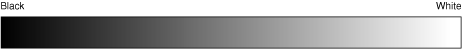
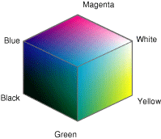
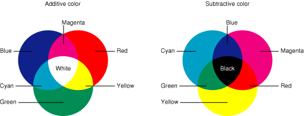
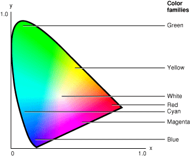
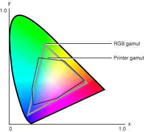

> 导航：[总目录](../../../README.md) · [documentation](../../../_indexes/documentation.md) · [Managing Colors With ColorSync in Mac OS 9](About%20This%20Document.md)


[Next](Overview%20of%20ColorSync.md)[Previous](About%20This%20Document.md)

# Overview of Color and Color Management Systems

This section provides a very brief description of ColorSync, the cross-platform color management system from Apple Computer, Inc. It then provides a general introduction to the basics of color and color management systems.

Read this section to learn about color perception, additive and subtractive color systems, how different peripheral devices represent color, and how color management systems maintain consistent color among devices. If you are already familiar with these concepts, you can skip ahead to [Overview of ColorSync](#apple-f4xwc4dqnrsv64tfmyxwi33df52wszbpkridgmbqgaydeobqfvjvomi), which provides a detailed overview of ColorSync.

For more information on color theory and color spaces, see:

- Fred W. Billmeyer, Jr., and Max Saltzman. Principles of Color Technology, second edition. Wiley, 1981.
- James D. Foley, Andries van Dam, Steven K. Feiner, and John F. Hughes. Computer Graphics: Principles and Practice, second edition. Addison-Wesley, 1990.
- Roy Hall. Illumination and Color in Computer Generated Imagery. New York: Springer-Verlag, 1988.
- R.W.G. Hunt. Measuring Colour, second edition. Prentice-Hall, 1991.
- Günther Wyszecki and W.S. Stiles. Color Science: Concepts and Methods, Quantitative Data and Formulae, second edition. A Wiley-Interscience Publication, 1982.

ColorSync is the platform-independent color management system from Apple Computer, Inc. ColorSync provides essential services for fast, consistent, and accurate desktop color calibration, proofing, and reproduction for the graphic arts, publishing, and printing industries. The ColorSync Manager is the application programming interface (API) to these services. ColorSync and the ColorSync Manager are described in detail in [Overview of ColorSync](Overview%20of%20ColorSync.md#apple-f4xwc4dqnrsv64tfmyxwi33df52wszbpkridgmbqgaydenzzfvbeeq2gi5euesi). Color management systems are defined in [Color Management Systems](#apple-f4xwc4dqnrsv64tfmyxwi33df52wszbpkridgmbqgaydeobqfvbegskhivbumrq).

Color is a sensation and, therefore, a subjective experience. The sensation of color is one component of the visual sensation, caused by the sensitivity of the human eye to light. Light can be perceived either directly from light sources (such as the sun, a fire, incandescent or fluorescent bulbs, television screens, and computer displays) or indirectly, when light from these sources is transmitted through or reflected by objects. Color sensation is also affected by how the brain processes information and is specific to each individual. Thus color perception is avery complex phenomenon.

The foundation of the color reproduction process is trichromatic color vision, which describes the capacity of the human eye to respond equally to two or more sets of stimuli having different visible spectra. This means that two or more visible spectra may exist that will be perceived as the same color, a phenomenon known as metamerism. Because of this property, spectral color reproduction, a very expensive and impractical process, can be replaced by trichromatic color reproduction, a process that is much cheaper and easier to control.

Trichromatic color reproduction induces the illusion of a color using various amounts of only three primary colors: either red, green, and blue mixed additively or cyan, magenta, and yellow mixed subtractively. Additive and subtractive colors are described in [Additive and Subtractive Color](#apple-f4xwc4dqnrsv64tfmyxwi33df52wszbpkridgmbqgaydeobqfvbegskjizfecsq). Trichromatic color reproduction is the fundamental mechanism used in the majority of color reproduction devices, from television, computer display and movie screens, to magazines, newspapers, large posters, and small pages printed on your desktop printer.

Computers enable us to control color digitally and many peripherals have been developed for acquiring, displaying, and reproducing color. As a result, there is a need for a mechanism to maintain color control in an environment that can include different computer operating systems and hardware, as well as a wide variety of devices and media connected to the computer.

In the Mac OS, the ColorSync Manager is the part of the operating system that provides color management. For a detailed description, see [ColorSync Manager Overview](Overview%20of%20ColorSync.md#apple-f4xwc4dqnrsv64tfmyxwi33df52wszbpkridgmbqgaydenzzfvbeeq2cjjdeury).

The eye contains two types of receptors, cones and rods. The rods measure illumination and are not sensitive to color. The cones contain a chemical known as Rhodopsin, which is variously sensitive to reds and blues and has a default sensitivity to yellow. The color the eyes see in an object depends on how much red, green, and blue light is reflected to a small region in the back of the eye called the fovea, which contains a great majority of the cones present in the eye. Black is perceived when no light is reflected to the eye.

Even the conditions in which color is viewed greatly affect the perception of color. The light source and environment must be standardized for accurate viewing. When viewing colors, people in the graphic arts industry, for example, avoid fluorescent and tungsten lighting, use a particular illuminant that is similar to daylight, and proof against a neutral gray surface.

Color images frequently contain hundreds of distinctly different colors. To reproduce such images on a color peripheral device is impractical. However, a very broad range of colors can be visually matched by a mixture of three primary lights. This allows colors to be reproduced on a display by a mixture of red, green, and blue lights (the primary colors of the additive color space shown in [Figure 2-4](#apple-f4xwc4dqnrsv64tfmyxwi33df52wszbpkridgmbqgaydeobqfvbegskkjbbuisq)) or on a printer by a mixture of cyan, magenta, and yellow inks or pigments (the primary colors of the subtractive color space shown in [Figure 2-4](#apple-f4xwc4dqnrsv64tfmyxwi33df52wszbpkridgmbqgaydeobqfvbegskkjbbuisq)). Black is printed to increase contrast and make up for the deficiency of the inks (making black the key, or K, in CMYK).

Color is described as having three dimensions. These dimensions are hue, saturation, and value. Hue is the name of the color, which places the color in its correct position in the spectrum. For example, if a color is described as blue, it is distinguished from yellow, red, green, or other colors. Saturation refers to the degree of intensity in a color, or a color’s strength. A neutral gray is considered to have zero saturation. A saturated red would have a color similar to apple red. Pink is an example of an unsaturated red. Value (or brightness) describes differences in the intensity of light reflected from or transmitted by a color image. The hue of an object may be blue, but the terms dark and light distinguish the value, or brightness, of one object from another. The 3-dimensional color spaces based on hue, saturation and value are described in [HSV and HLS Color Spaces](#apple-f4xwc4dqnrsv64tfmyxwi33df52wszbpkridgmbqgaydeobqfvbegskiinaugqq).

The additive color theory refers to the process of mixing red, green, and blue lights, which are each approximately one-third of the visible spectrum. Additive color theory explains how red, green, and blue light can be added to make white light. Red and green projected together produce yellow, red and blue produce magenta, and blue and green produce cyan. With red, blue, and green transmitted light, all the colors of the rainbow can be matched.

The subtractive color theory refers to the process of combining subtractive colorants such as inks or dyes. In this theory, various levels of cyan, magenta, and yellow absorb or subtract a portion of the spectrum of white light that is illuminating an object. The color of an object is the result of the color lights that are not absorbed by the object. An apple appears red because the surface of the apple absorbs the blue and green light.

Monitors use the additive color space, output printing devices use the subtractive color space.

A color space describes an environment in which colors are represented, ordered, compared, or computed. A color space defines a one-, two-, three-, or four-dimensional environment whose components (or color components) represent intensity values. A color component is also referred to as a color channel. For example, RGB space is a three-dimensional color space whose stimuli are the red, green, and blue intensities that make up a given color; and red, green, and blue are color channels. Visually, these spaces are often represented by various solid shapes, such as cubes, cones, or polyhedra.

For additional information on color components, see [Color-Component Values, Color Values, and Colors](#apple-f4xwc4dqnrsv64tfmyxwi33df52wszbpkridgmbqgaydeobqfvbegskkifauirq).

The ColorSync Manager directly supports several different color spaces to give you the convenience of working in whatever kind of color data most suits your needs. The ColorSync color spaces fall into several groups, or base families. They are:

- gray spaces, used for grayscale display and printing; see [Gray Spaces](#apple-f4xwc4dqnrsv64tfmyxwi33df52wszbpkridgmbqgaydeobqfvbegskdjfcukra)
- RGB-based color spaces, used mainly for displays and scanners; see [RGB-Based Color Spaces](#apple-f4xwc4dqnrsv64tfmyxwi33df52wszbpkridgmbqgaydeobqfvbegskgjfduqsi)
- CMYK-based color spaces, used mainly for color printing; see [CMY-Based Color Spaces](#apple-f4xwc4dqnrsv64tfmyxwi33df52wszbpkridgmbqgaydeobqfvbegskeijdeeqq)
- device-independent color spaces, such as L\*a\*b, used mainly for color comparisons, color differences, and color conversion; see [Device-Independent Color Spaces](#apple-f4xwc4dqnrsv64tfmyxwi33df52wszbpkridgmbqgaydeobqfvbegskhjbeeksq)
- named color spaces, used mainly for printing and graphic design; see [Named Color Spaces](#apple-f4xwc4dqnrsv64tfmyxwi33df52wszbpkridgmbqgaydeobqfvbegskiivdeksa)
- heterogeneous HiFi color spaces, also referred to as multichannel color spaces, primarily used in new printing processes involving the use of red-orange, green and blue, and also for spot coloring, such as gold and silver metallics; see [Color-Component Values, Color Values, and Colors](#apple-f4xwc4dqnrsv64tfmyxwi33df52wszbpkridgmbqgaydeobqfvbegskkifauirq)

All color spaces within a base family are related to each other by very simple mathematical formulas or differ only in details of storage format.

Gray spaces typically have a single component, ranging from black to white, as shown in [Figure 2-1](#apple-f4xwc4dqnrsv64tfmyxwi33df52wszbpkridgmbqgaydeobqfvbegskcivdusqi). Gray spaces are used for black-and-white and grayscale display and printing. A properly plotted gray space should have a fifty percent value as its midpoint.

__Figure 2-1__  Gray space



The RGB space is a three-dimensional color space whose components are the red, green, and blue intensities that make up a given color. For example, scanners read the amounts of red, green, and blue light that are reflected from or transmitted through an image and then convert those amounts into digital values. Information displayed on a color monitor begins with digital values that are converted to analog signals for display on the monitor. The analog signals are transmitted to the phosphors on the face of the monitor, causing them to glow at various intensities of red, green, and blue (the combination of which makes up the required hue, saturation, and brightness of the desired colors).

RGB-based color spaces are the most commonly used color spaces in computer graphics, primarily because they are directly supported by most color displays and scanners. RGB color spaces are device dependent and additive. The groups of color spaces within the RGB base family include

- RGB spaces
- HSV and HLS spaces

Any color expressed in RGB space is some mixture of three primary colors: red, green, and blue. Most RGB-based color spaces can be visualized as a cube, as in [Figure 2-2](#apple-f4xwc4dqnrsv64tfmyxwi33df52wszbpkridgmbqgaydeobqfvbegskkjjcukqy), with corners of black, the three primaries (red, green, and blue), the three secondaries (cyan, magenta, and yellow), and white.

__Figure 2-2__  RGB color space (Red corner is hidden from view)



The sRGB color space is based on the ITU-R BT.709 standard. It specifies a gamma of 2.2 and a white point of 6500 degrees K. You can read more about sRGB space at the International Color Consortium site at <http://www.color.org/>. This space gives a complimentary solution to the current strategies of color management systems, by offering an alternate, device-independent color definition that is easier to handle for device manufacturers and the consumer market. sRGB color space can be used if no other RGB profile is specified or available. Starting with version 2.5, ColorSync provides full support for sRGB, including an sRGB profile.

Note that as an open architecture, ColorSync is not tied to the use of the sRGB color space and can support any RGB space that the user might prefer. For example, high end users with good quality reproduction devices may find that the sRGB space, which limits colors to the sRGB gamut, is too restrictive for their required color quality.

HSV space and HLS space are transformations of RGB space that can describe colors in terms more natural to an artist. The name HSV stands for hue, saturation, and value. (HSB space, or hue, saturation, and brightness, is synonymous with HSV space.) HLS stands for hue, lightness, and saturation. The two spaces can be thought of as being single and double cones, as shown in [Figure 2-3](#apple-f4xwc4dqnrsv64tfmyxwi33df52wszbpkridgmbqgaydeobqfvbegskiinbeosq).

The components in HLS space are analogous, but not completely identical, to the components in HSV space:

- The hue component in both color spaces is an angular measurement, analogous to position around a color wheel. A hue value of 0 indicates the color red; the color green is at a value corresponding to 120, and the color blue is at a value corresponding to 240. Horizontal planes through the cones in [Figure 2-3](#apple-f4xwc4dqnrsv64tfmyxwi33df52wszbpkridgmbqgaydeobqfvbegskiinbeosq) are hexagons; the primaries and secondaries (red, yellow, green, cyan, blue, and magenta) occur at the vertices of the hexagons.
- The saturation component in both color spaces describes color intensity. A saturation value of 0 (in the middle of a hexagon) means that the color is colorless (gray); a saturation value at the maximum (at the outer edge of a hexagon) means that the color is at maximum colorfulness for that hue angle and brightness.

__Figure 2-3__  HSV (or HSB) color space and HLS color space


- The value component in HSV describes the brightness. In both color spaces, a value of 0 represents the absence of light, or black. In HSV space, a maximum value means that the color is at its brightest. In HLS space, a maximum value for lightness means that the color is white, regardless of the current values of the hue and saturation components.

CMY-based color spaces are most commonly used in color printing systems. They are device dependent and subtractive in nature. The groups of color spaces within the CMY family include

- CMY, which is not very common except on low-end color printers
- CMYK, which models the way inks or dyes are applied to paper in printing

The name CMYK refers to cyan, magenta, yellow, and key (represented by black). Cyan, magenta, and yellow are the three primary colors in this color space, and red, green, and blue are the three secondaries. Theoretically black is not needed. However, when full-saturation cyan, magenta, and yellow inks are mixed equally on paper, the result is usually a dark brown, rather than black. Therefore, black ink is overprinted in darker areas to expand the dynamic range and give a better appearance. Printing with black ink makes it possible to use less cyan, magenta, and yellow ink. This may prevent saturation, especially on materials such as plain paper which cannot accept too much ink. Using black can also reduce the cost per page because cyan, magenta, and yellow inks are generally more expensive than black ink. It can also provide a sharper image, because a single dot of black ink is used in place of three dots of other inks.

[Figure 2-4](#apple-f4xwc4dqnrsv64tfmyxwi33df52wszbpkridgmbqgaydeobqfvbegskkjbbuisq) shows how additive and subtractive colors mix to form other colors.

__Figure 2-4__  Additive and subtractive colors



Theoretically, the relation between RGB values and CMY values in CMYK space is quite simple:

```
Cyan        = 1.0 – red
Magenta     = 1.0 – green
Yellow      = 1.0 – blue
```

(where red, green, and blue intensities are expressed as fractional values varying from 0 to 1). In reality, the process of deriving the cyan, magenta, yellow, and black values from a color expressed in RGB space is complex, involving device-specific, ink-specific, and even paper-specific calculations of the amount of black to add in dark areas (black generation) and the amount of other ink to remove (undercolor removal) where black is to be printed. Therefore, when ColorSync converts between CMYK and RGB color spaces, it uses an elaborate system of multi-dimensional lookup tables, which ColorSync knows how to interpret. This information is stored in profiles, which are defined in the section [Color Conversion and Color Matching](#apple-f4xwc4dqnrsv64tfmyxwi33df52wszbpkridgmbqgaydeobqfvbegskgirfessi).

Some color spaces can express color in a device-independent way. Whereas RGB colors vary with display and scanner characteristics, and CMYK colors vary with printer, ink, and paper characteristics, device-independent colors are not dependent on any particular device and are meant to be true representations of colors as perceived by the human eye. These color representations, called device-independent color spaces, result from work carried out by the Commission Internationale d’Eclairage (CIE) and for that reason are also called CIE-based color spaces.

The most common method of identifying color within a color space is a three-dimensional geometry. The three color attributes, hue, saturation, and brightness, are measured, assigned numeric values, and plotted within the color space.

Conversion from an RGB color space to a CMYK color space involves a number of variables. The type of printer or printing press, the paper stock, and the inks used all influence the balance between cyan, magenta, yellow, and black. In addition, different devices have different gamuts, or ranges of colors that they can produce. Because the colors produced by RGB and CMYK specifications are specific to a device, they’re called device-dependent color spaces. Device color spaces enable the specification of color values that are directly related to their representation on a particular device.

Device-independent color spaces can be used as interchange color spaces to convert color data from the native color space of one device to the native color space of another device.

The CIE created a set of color spaces that specify color in terms of human perception. It then developed algorithms to derive three imaginary primary constituents of color—X, Y, and Z—that can be combined at different levels to produce all the color the human eye can perceive. The resulting color model, CIEXYZ, and other CIE color models form the basis for all color management systems. Although the RGB and CMYK values differ from device to device, human perception of color remains consistent across devices. Colors can be specified in the CIE-based color spaces in a way that is independent of the characteristics of any particular display or reproduction device. The goal of this standard is for a given CIE-based color specification to produce consistent results on different devices, up to the limitations of each device.

There are several CIE-based color spaces, but all are derived from the fundamental XYZ space. The XYZ space allows colors to be expressed as a mixture of the three tristimulus values X, Y, and Z. The term tristimulus comes from the fact that color perception results from the retina of the eye responding to three types of stimuli. After experimentation, the CIE set up a hypothetical set of primaries, XYZ, that correspond to the way the eye’s retina behaves.

The CIE defined the primaries so that all visible light maps into a positive mixture of X, Y, and Z, and so that Y correlates approximately to the apparent lightness of a color. Generally, the mixtures of X, Y, and Z components used to describe a color are expressed as percentages ranging from 0 percent up to, in some cases, just over 100 percent.

Other device-independent color spaces based on XYZ space are used primarily to relate some particular aspect of color or some perceptual color difference to XYZ values.

Yxy space expresses the XYZ values in terms of x and y chromaticity coordinates, somewhat analogous to the hue and saturation coordinates of HSV space. The coordinates are shown in the following formulas, used to convert XYZ into Yxy:

```
Y = Y
x = X / (X+Y+Z)
y = Y / (X+Y+Z)
```

Note that the Z tristimulus value is incorporated into the new coordinates and does not appear by itself. Since Y still correlates to the lightness of a color, the other aspects of the color are found in the chromaticity coordinates x and y. This allows color variation in Yxy space to be plotted on a two-dimensional diagram. [Figure 2-5](#apple-f4xwc4dqnrsv64tfmyxwi33df52wszbpkridgmbqgaydeobqfvbegskji5eugsi) shows the layout of colors in the x and y plane of Yxy space.

__Figure 2-5__  Yxy chromaticities in the CIE color space



One problem with representing colors using the XYZ and Yxy color spaces is that they are perceptually nonlinear: it is not possible to accurately evaluate the perceptual closeness of colors based on their relative positions in XYZ or Yxy space. Colors that are close together in Yxy space may seem very different to observers, and colors that seem very similar to observers may be widely separated in Yxy space.

L\*u\*v\* space and L\*a\*b\* space are nonlinear transformations of the XYZ tristimulus space. These spaces are designed to have a more uniform correspondence between geometric distances and perceptual distances between colors that are seen under the same reference illuminant. A rendering of L\*a\*b space is shown in [Figure 2-6](#apple-f4xwc4dqnrsv64tfmyxwi33df52wszbpkridgmbqgaydeobqfvbegskhijdueqq).

__Figure 2-6__  L\*a\*b\* color space


Both L\*u\*v\* space and L\*a\*b\* space represent colors relative to a reference white point, which is a specific definition of what is considered white light, represented in terms of XYZ space, and usually based on the whitest light that can be generated by a given device.

Measuring colors in relation to a white point allows for color measurement under a variety of illuminations.

A primary benefit of using L\*u\*v\* space and L\*a\*b\* space is that the perceived difference between any two colors is proportional to the geometric distance in the color space between their color values, if the color differences are small. Use of L\*u\*v\* space or L\*a\*b\* space is common in applications where closeness of color must be quantified, such as in colorimetry, gemstone evaluation, or dye matching.

In situations where you use only a limited number of colors, it can be impractical or impossible to specify colors directly. If you have a bitmap with only a few bits per pixel (1, 2, 4, or 8, for example), each pixel is too small to contain a complete color specification; its color must be specified as an index into a list or table of color values. If you are using spot colors in printing or pen colors in plotting, it can be simpler and more precise to specify each color as an index into a list of colors instead of an actual color value. Also, if you want to restrict the user to drawing with a specific set of colors, you can put the colors in a list and specify them by index.

Indexed space is the color space you use when drawing with indirectly specified colors. An indexed color value (a color specification in indexed color space) consists of an index value that refers to a color in a color list. Color values are defined in [Color-Component Values, Color Values, and Colors](#apple-f4xwc4dqnrsv64tfmyxwi33df52wszbpkridgmbqgaydeobqfvbegskkifauirq).

In a named color space, each color has a name; colors are generally ordered so that each has an equal perceived distance from its neighbors in the color space. A named color space provides a relatively small number of discrete colors.

Color systems using named color spaces have existed for many years. Graphic artists and designers using named color systems can see the real color by looking at a color chip or swatch. Printing shops can reproduce a specified color accurately.

Named color systems are useful for spot colors, but they have several drawbacks:

- They are not useful for images, which require a continuous range of colors.
- They are highly device dependent and proprietary.
- Colors are tied to medium-specific formulations.
- Applications that use these systems require a device-specific database for each supported printer, making it difficult to add additional devices.

Each of the color spaces described here requires one or more numeric values in a particular format to specify a color.

Each dimension, or component, in a color space has a color-component value. An unsigned 16-bit color-component value can vary from 0 to 65,535 (0xFFFF), although the numerical interpretation of that range is different for different color spaces. In most cases, color-component intensities are interpreted numerically as varying between 0 and 1.0. An exception occurs for the a\* and b\* channels of the Lab color space, where values ranging from 0 to 65,535 are interpreted numerically as varying from -128.0 to approximately 128.0.

Depending on the color space, one, two, three, or four color-component values combine to make a color value. For HiFi colors, up to eight color-component values combine to make a color. A color value is a structure; it is the complete specification of a color in a given color space.

Color conversion is the process of converting colors from one color space to another. Color matching, which entails color conversion, is the process of selecting colors from the destination gamut that most closely approximate the colors from the source image. Color matching always involves color conversion, whereas color conversion may not entail color matching. Rendering intent refers to the approach taken when a CMM maps or translates the colors of an image to the color gamut of a destination device—that is, a rendering intent specifies a gamut-matching strategy.

Different imaging devices (scanners, displays, printers) work in different color spaces and each is capable of producing a different range of colors. Although color displays from different manufacturers all use RGB colors, each will typically have a different RGB gamut. Printers that work in CMYK space vary drastically in their gamuts, especially if they use different printing technologies. Even a single printer’s gamut can vary significantly with the ink or type of paper it uses. It’s easy to see that conversion from RGB colors on an individual display to CMYK colors on an individual printer using a particular paper type can lead to unpredictable results.

When an image is output to a particular device, the device displays only those colors that are within its gamut. Likewise, when an image is created by scanning, all colors from the original image are reduced to the colors within the scanner’s gamut. Devices with different gamuts cannot reproduce each other’s colors exactly, but careful shifting of the colors used on one device can improve the visual match when the image is displayed on another.

__Figure 2-7__  Color gamuts for two devices expressed in Yxy space



[Figure 2-7](#apple-f4xwc4dqnrsv64tfmyxwi33df52wszbpkridgmbqgaydeobqfvbegskiirbeory) shows examples of two devices’ color gamuts, projected onto Yxy space. Both devices produce less than the total possible range of colors, and the printer gamut is restricted to a significantly smaller range than the RGB gamut. The problem illustrated by [Figure 2-7](#apple-f4xwc4dqnrsv64tfmyxwi33df52wszbpkridgmbqgaydeobqfvbegskiirbeory) is to display the same image on both devices with a minimum of visual mismatch. The solution to the problem is to match the colors of the image using profiles for both devices and one or more color management modules. A profile is a structure that provides a means of defining the color characteristics of a given device in a particular state. For more information, see [Profiles](Overview%20of%20ColorSync.md#apple-f4xwc4dqnrsv64tfmyxwi33df52wszbpkridgmbqgaydenzzfvbeeq2hirduqqi).

Members of the computer and publishing industries have developed color management systems (CMSs) to convert colors from the color space of one device to the color space of another device (for example, from a scanner to a monitor). The components of a color management system include

- collections of color characteristics (these collections are given various names, such as color tags, precision transforms, or profiles)
- a color management module (CMM) that performs the color matching among, and transformation between, collections of color characteristics; for more information, see [Color Management Modules](Overview%20of%20ColorSync.md#apple-f4xwc4dqnrsv64tfmyxwi33df52wszbpkridgmbqgaydenzzfvbeeq2iizbumqi)
- a programming interface for invoking color matching

The goal of these systems is to provide consistent color across peripheral devices and across operating-system platforms. Most CMSs are proprietary, but ColorSync, the platform-independent color management system from Apple Computer, supports the industry-standard color profile specification currently defined by the International Color Consortium (ICC). The ICC publishes the International Color Consortium Profile Format Specification. To obtain a copy of the specification, or to get other information about the ICC, visit the ICC Web site at <http://www.color.org/>.

A color management system gives the user the ability to perform color matching, to see in advance which colors cannot be accurately reproduced on a specific device, to simulate the range of colors of one device on another, and to calibrate peripheral devices using a device profile and a calibration application.

[Next](Overview%20of%20ColorSync.md)[Previous](About%20This%20Document.md)

