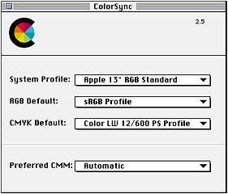
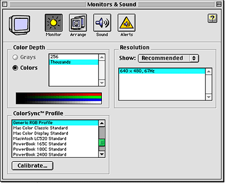

> 导航：[总目录](../../../README.md) · [documentation](../../../_indexes/documentation.md) · [Managing Colors With ColorSync in Mac OS 9](About%20This%20Document.md)

[Next](Developing%20ColorSync-Supportive%20Applications.md)[Previous](Overview%20of%20Color%20and%20Color%20Management%20Systems.md)

# Overview of ColorSync

This section describes ColorSync and the ColorSync Manager. ColorSync is the platform-independent color management system from Apple Computer, Inc. ColorSync provides essential services for fast, consistent, and accurate color calibration, proofing, and reproduction. The ColorSync Manager is the application programming interface (API) to these services on the Mac OS.

Read this section if your software product performs color drawing, printing, or calculation or if your peripheral device supports color. You should also read this section if you are creating a color management module (CMM)—a component that implements color-matching, color conversion, and gamut-checking services.

If you are unfamiliar with terms and concepts such as CMM, profile, color space, and color management, or would like to review these topics, read [Overview of Color and Color Management Systems](Overview%20of%20Color%20and%20Color%20Management%20Systems.md#apple-f4xwc4dqnrsv64tfmyxwi33df52wszbpkridgmbqgaydeobqfvbeeq2cirduira) before reading this section.

[What’s New](What%E2%80%99s%20New.md#apple-f4xwc4dqnrsv64tfmyxwi33df52wszbpkridgmbqgaydenzufvbecqskjfcesrq) lists the new features available with ColorSync 2.5 and provides links to new and revised material in this document. It also describes where to obtain documentation for other color-related technologies.

ColorSync is the first system-level implementation of an industry-standard color management system. Even in a system in which all input, output, and display devices are new and perfectly calibrated, there will be differences in device gamuts (the ranges of color that can be reproduced by the devices). ColorSync can correct for such differences in device gamuts, as well as for differences caused by aging of filter sets and lamps on scanners, phosphor decay and ambient light on monitors, and differences in pigments and substrates on output devices such as printers and presses. As a result, it is possible to maintain accurate color across many possible input, display, and output devices.

Developers writing device drivers use the ColorSync Manager to support color matching between devices. Application developers use the ColorSync Manager to communicate with drivers and to present users with color-matching information, such as a device’s color capabilities.

Different imaging devices such as scanners, displays, and printers work in different color spaces, and each can have a different gamut (the range of colors a device can display). Color displays from different manufacturers all use RGB colors but may have different RGB gamuts as a result of the type and age of the phosphors used. Printers and presses work in CMYK space and can vary drastically in their gamuts, especially if they use different printing technologies. Even a single printer’s gamut can vary significantly depending on the ink or type of paper in use. It’s easy to see that conversion from RGB colors on an individual display to CMYK colors on an individual printer using a specific ink and paper type can lead to unpredictable results.

The ColorSync Manager addresses these problems by providing applications and color peripheral device drivers with device-independent color-matching and color conversion services based on the ColorSync color management system. With this ColorSync support, the user can quickly and accurately convert color images for optimal results on a specified device.

There are many reasons you should consider adding ColorSync support to your products:

- Working with color is more difficult than many people realize, but ColorSync provides a highly effective system to help you perform accurate, industry-standard color management.
- Devices age and are subject to continuous inconsistence due to phosphor aging, pigment changes, substrate differences (white point, absorption, reflectivity), filter aging, and change in the life of the luminant.
- Artists, designers, and prepress experts need to achieve repeatable, reliable, and consistent color—onscreen, in print, and for electronic delivery to multimedia and the Internet. ColorSync is the tool of choice for meeting these requirements.
- There are many color measurement instruments, an array of profiling software, and a wide selection of production tools—page make-up, image editing, illustration, image database, Photo CD applications, and more—that already support ColorSync.
- ColorSync is widely available to Macintosh users, who make up the large majority of graphic arts and publishing professionals.
- Starting with version 2.5, the ColorSync Manager provides an extensible AppleScript framework that allows users to script many common tasks, such as matching an image or embedding a profile in an image. These AppleScript capabilities, described in [Scripting Support](#apple-f4xwc4dqnrsv64tfmyxwi33df52wszbpkridgmbqgaydenzzfvbeeq2gijducsq), make it possible to automate many workflow processes.

Firms that sell clothing through mail order catalogs and Web sites report the most common reason a customer returns an item is color: when the product arrived, it didn’t match the color in the catalog or on the monitor. Working with managed color, however, these firms can ensure the original image is scanned accurately, the catalog or monitor displays the color correctly, the output device prints the color correctly, and the customers see the color as accurately as they are able.

This section provides an overview of the ColorSync Manager and how an application or device driver can use it for color conversion, color matching, color gamut checking, profile management, monitor calibration, and creating color management modules (CMMs).

The ColorSync Manager provides a set of routines contained in a system extension. ColorSync also includes a collection of display device profiles for all Apple color monitors, some default profiles for standard color spaces, and a robust default CMM. In addition, the ColorSync control panel, shown in [Figure 3-1](#apple-f4xwc4dqnrsv64tfmyxwi33df52wszbpkridgmbqgaydenzzfvbeeq2jifbesqy), allows a user to specify a preferred CMM and various default profiles. CMMs and profiles are discussed throughout this material.

To provide its color-matching services, the ColorSync Manager works with color profiles and with one or more color management modules. Your application or driver can supply its own CMM, or you can use the default CMM, a robust CMM that is installed as part of the ColorSync extension and supports all the required and optional functions defined by the ColorSync Manager. The ColorSync Manager relies on the Component Manager to support plug-and-play capability for third-party CMMs. The Component Manager is described in Inside Macintosh: More Macintosh Toolbox. For more information on CMMs, see [Color Management Modules](#apple-f4xwc4dqnrsv64tfmyxwi33df52wszbpkridgmbqgaydenzzfvbeeq2iizbumqi).

A profile is a table that contains the color characteristics of a given device in a particular state. ColorSync profiles conform to the format currently defined by the International Color Consortium (ICC). Device driver developers and peripheral manufacturers can provide their own profiles or they can obtain profiles from a number of vendors. For a list of profile vendors, see the ColorSync Web site at <http://colorsync.apple.com/>. Profiles are described in detail in [Profiles](#apple-f4xwc4dqnrsv64tfmyxwi33df52wszbpkridgmbqgaydenzzfvbeeq2hirduqqi).

This document covers the ColorSync Manager through version 2.5. Most existing code written to use version 2.0 or 2.1 of the ColorSync Manager should continue to work with version 2.5 without modification.

This document uses a specific version number, such as version 2.5 of the ColorSync Manager, only where necessary to identify features associated with a particular version. It may use 2.x to refer inclusively to ColorSync versions 2.0, 2.1, and 2.5, or to refer to the profile format used with these versions—the meaning should be clear from the context. For more information on profile version numbers, see [ColorSync and ICC Profile Format Version Numbers](#apple-f4xwc4dqnrsv64tfmyxwi33df52wszbpkridgmbqgaydenzzfvbeeq2ijbeeory).

For a description of the `Gestalt` information, shared library version numbers, CMM version numbers, and ColorSync header files you use with different versions of the ColorSync Manager, see [ColorSync Version Information](Version%20and%20Compatibility%20Information.md#apple-f4xwc4dqnrsv64tfmyxwi33df52wszbpkridgmbqgaydenzvfvbegskgjbeusra).

ColorSync version 2.5 requires Mac OS version 7.6.1 or newer, running on a Power Macintosh or on a 68K Macintosh computer with a 68020 or greater processor. For information on system and CPU requirements for previous ColorSync versions, and for related information such as Gestalt, shared library, and CMM versions, see [ColorSync Version Information](Version%20and%20Compatibility%20Information.md#apple-f4xwc4dqnrsv64tfmyxwi33df52wszbpkridgmbqgaydenzvfvbegskgjbeusra).

The ColorSync Manager application programming interface (API) allows your application or device driver to handle such tasks as color matching, color conversion, profile management, and profile searching. You can access and read individual tagged elements within a profile, embed profiles in documents, modify profiles, and transform images through various CMMs to perform color matching and profile data transfer from one format to another.

The ColorSync API is summarized in [Summary of the ColorSync Manager](Developing%20ColorSync-Supportive%20Applications.md#apple-f4xwc4dqnrsv64tfmyxwi33df52wszbpkridgmbqgaydenzyfvbeeq2kijeekqq). You can find detailed information about individual functions, constants, and data types in _ColorSync Manager Reference_. For code samples that show how to use the ColorSync API, see [Developing ColorSync-Supportive Applications](Developing%20ColorSync-Supportive%20Applications.md#apple-f4xwc4dqnrsv64tfmyxwi33df52wszbpkridgmbqgaydenzyfvbeeq2kinbeqra). For information on the ColorSync Manager header files, see [ColorSync Header Files](Version%20and%20Compatibility%20Information.md#apple-f4xwc4dqnrsv64tfmyxwi33df52wszbpkridgmbqgaydenzvfvkfawcsivddcmbs).

The ColorSync Manager is implemented as a shared library on PowerPC-based computers. For a listing of the shared library version number for each released version of the ColorSync Manager, along with corresponding `Gestalt` selector codes, see [Gestalt, Shared Library, and CMM Version Information](Version%20and%20Compatibility%20Information.md#apple-f4xwc4dqnrsv64tfmyxwi33df52wszbpkridgmbqgaydenzvfvbegskhjjeusri).

To perform color matching or color conversion across different color spaces requires the use of a profile for each device involved. Profiles provide the information necessary to understand how a particular device reproduces color. A profile may contain such information as lightest and darkest possible tones (referred to as white point and black point), the difference between specific targets and what is actually captured, and maximum densities for red, green, blue, cyan, magenta, and yellow. Together these measurements represent the data which describe a particular color gamut.

ColorSync supports the profile format defined by the International Color Consortium (ICC). The ICC format provides a single cross-platform standard for translating color data across devices. The ICC defines several types of profiles, including input, output, and display profiles. Each of these types specifies a different required set of information, but all follow the same format.

The founding members of the ICC include Adobe Systems Inc.; Agfa-Gevaert N.V.; Apple Computer, Inc.; Eastman Kodak Company; FOGRA (Honorary); Microsoft Corporation; Silicon Graphics, Inc.; and Sun Microsystems, Inc. These companies have committed to full support of this specification in their operating systems, platforms, and applications.

To obtain a copy of the International Color Consortium Profile Format Specification, or to get other information about the ICC, visit the ICC Web site at <http://www.color.org/>.

The first version of ColorSync used a 1.0 profile format that preceded the ICC profile format definition. Starting with version 2.0 of the ColorSync Manager, ColorSync uses a 2.x profile format that supports all current ICC profile format versions. As of this writing, that includes ICC versions 2.0 and 2.1. The ICC defines the profile format version as part of the profile header. For more information on the differences between these profile format versions, see [ColorSync 1.0 Profiles and Version 2.x Profiles](Version%20and%20Compatibility%20Information.md#apple-f4xwc4dqnrsv64tfmyxwi33df52wszbpkridgmbqgaydenzvfvbegskiireeiqq).

When a ColorSync-supportive scanning application creates a scanned image, it embeds a profile for the scanner in the image. The profile that is associated with the image and describes the characteristics of the device on which the image was created is called the source profile. If the colors in the image are subsequently converted to another color space by the scanning application or by another ColorSync-supportive application, ColorSync can use that source profile to identify the original colors and to match them to colors expressed in the new color space.

Displaying the image requires using another profile, which is associated with the output device, such as a display. The profile for that device is called the destination profile. If the image is destined for a display, ColorSync can use the display’s profile (the destination profile) along with the image’s source profile to match the image’s colors to the display’s gamut. If the image is printed, ColorSync can use the printer’s profile to match the image’s colors to the printer, including generating black and removing excessive color densities (known as undercolor removal, or UCR) where appropriate.

The ColorSync Manager supports seven classes, or types, of profiles. These classes are defined below. Three of the profile classes define device profiles for different types of devices: input, output, and display devices. The other four profile classes include definitions for an abstract profile, a color space profile, a named color space profile, and a device link profile. The constants used to specify these classes are described in _ColorSync Manager Reference_.

A device profile characterizes a particular device: that is, it describes the characteristics of a color space for a physical device in a particular state. A display, for example, might have a single profile, or it might have several, based on differences in gamma value and white point. A printer might have a different profile for each paper type or ink type it uses because each paper type and ink type constitutes a different printer state. When an application calls a ColorSync Manager color-matching function to match colors between devices, such as a display and a printer, it specifies the profile for each device.

Device profiles are divided into three broad classifications:

- input devices, such as scanners and digital cameras
- display devices, such as monitors and flat-panel screens
- output devices, such as printers, film recorders, and printing presses.

Each device profile class has its own signature. The ColorSync constants for these signatures are described in _ColorSync Manager Reference_. For related information, see [Devices and Their Profiles](Developing%20ColorSync-Supportive%20Device%20Drivers.md#apple-f4xwc4dqnrsv64tfmyxwi33df52wszbpkridgmbqgaydenzxfvbecssjinfeisa).

A profile connection space (PCS) is a device-independent color space used as an intermediate when converting from one device-dependent color space to another. Profile connection spaces are typically based on spaces derived from the CIE color space, which is described in [Device-Independent Color Spaces](Overview%20of%20Color%20and%20Color%20Management%20Systems.md#apple-f4xwc4dqnrsv64tfmyxwi33df52wszbpkridgmbqgaydeobqfvbegskhjbeeksq). ColorSync supports two of these spaces, XYZ and L\*a\*b.

A color space profile contains the data necessary to convert color values between a PCS and a non-device color space (such as L\*a\*b to or from L\*u\*v, or XYZ to or from Yxy), for color matching. The ColorSync Manager uses color space profiles when mapping colors between different color spaces. Color space profiles also provide a convenient means for CMMs to convert between different non-device profiles.

L\*a\*b, L\*u\*v, XYZ, and Yxy color spaces are described in [Color Spaces](Overview%20of%20Color%20and%20Color%20Management%20Systems.md#apple-f4xwc4dqnrsv64tfmyxwi33df52wszbpkridgmbqgaydeobqfvbegskejbeussi).

Abstract profiles allow applications to perform special color effects independent of the devices on which the effects are rendered. For example, an application may choose to implement an abstract profile that increases yellow hue on all devices. Abstract profiles allow users of the application to make subjective color changes to images or graphics objects.

A device link profile represents a one-way link or connection between devices. It can be created from a set of multiple profiles, such as various device profiles associated with the creation and editing of an image. It does not represent any device model, nor can it be embedded into images.

For more information on device link profiles, see `CWNewLinkProfile` and `CMConcatProfileSet`.

A named color space profile contains data for a list of named colors. The profile specifies a device color value and the corresponding CIE value for each color in the list. Profiles are typically stored as individual files in the ColorSync Profiles folder. For example, device-specific profiles provided by hardware vendors should be stored in the ColorSync Profiles folder. The location and use of the ColorSync Profiles folder has changed beginning in version 2.5. For a description of these changes, see [Profile Search Locations](#apple-f4xwc4dqnrsv64tfmyxwi33df52wszbpkridgmbqgaydenzzfvbeeq2civbuory).

Profiles can also be embedded within images. For example, profiles can be embedded in PICT, EPS, and TIFF files and in the private file formats used by applications. Embedded profiles allow for the automatic interpretation of color information as the color image is transferred from one device to another.

Embedding a profile in an image guarantees that the image can be rendered correctly on a different system. However, profiles can be large—the largest can be several hundred KB or even larger. A profile identifier is an abbreviated data structure that uniquely identifies, and possibly modifies, a profile in memory or on disk, but takes up much less space than a large profile. For example, an application might embed a profile identifier to change just the rendering intent in an image without having to embed an entire new profile. Rendering intents are described in [Rendering Intents](#apple-f4xwc4dqnrsv64tfmyxwi33df52wszbpkridgmbqgaydenzzfvbeeq2ijjdumrq). For more information on embedding profile information, see [Embedding Profiles and Profile Identifiers](Developing%20ColorSync-Supportive%20Applications.md#apple-f4xwc4dqnrsv64tfmyxwi33df52wszbpkridgmbqgaydenzyfvbeeq2kjjdusry).

Profiles can contain different kinds of information. For example, a scanner profile and a printer profile have different sets of minimum required tags and element data. However, all profiles have at least a header followed by a required element tag table. The required tags may represent lookup tables, for example. The required tags for various profile classes are described in the International Color Consortium Profile Format Specification.

Profiles contain additional information, such as a specification for how to apply matching. For more information, see [Color Management Modules](#apple-f4xwc4dqnrsv64tfmyxwi33df52wszbpkridgmbqgaydenzzfvbeeq2iizbumqi). Profiles may also have a series of optional and private tagged elements. These private tagged elements may contain custom information used by particular color management modules.

In most cases, a ColorSync version 2.x profile is stored in a disk file. However, to support special requirements, a profile can also be located in memory or in an arbitrary location that is accessed by a procedure you specify. See _ColorSync Manager Reference_ for a description of ColorSync Manager structures for working with profiles that are stored in each of these locations. See [Opening a Profile and Obtaining a Reference to It](Developing%20ColorSync-Supportive%20Applications.md#apple-f4xwc4dqnrsv64tfmyxwi33df52wszbpkridgmbqgaydenzyfvbeeq2jincesrq) for information on working with profile locations in your application.

Prior to version 2.5, the default system profile (or simply the system profile) served as the default display profile; it also served as the default profile for color operations for which no profile was specified. The system profile had to be an RGB profile. A user could specify the system profile through the ColorSync control panel (formerly called the ColorSync<Superscript>™ System Profile control panel). If a user did not specify a system profile, then by default ColorSync used the Apple 13-inch color display profile.

Because the system profile was used for two dissimilar functions (default display profile and default profile for some RGB operations), there were several limitations:

- A user could not specify default profiles for color spaces other than RGB.
- A user could not specify separate profiles for more than one monitor.
- When matching an image without an embedded monitor profile, no matching occurred because the source and destination profiles were the same (system) profile.

__Figure 3-1__  The ColorSync control panel

Starting with ColorSync version 2.5, a user can set default profiles for RGB and CMYK color spaces, as well as for the system profile, using the ColorSync control panel shown in [Figure 3-1](#apple-f4xwc4dqnrsv64tfmyxwi33df52wszbpkridgmbqgaydenzzfvbeeq2jifbesqy). In addition, your application can call routines to get and set default profiles for the RGB, CMYK, Lab, and XYZ color spaces. As in previous versions of ColorSync, you can also call routines to get and set the current system profile.

Also starting with ColorSync version 2.5, a user can specify a separate profile for each monitor using the Monitors & Sound control panel. In addition, your application can call routines to get and set the profile for each display.

Because ColorSync version 2.5 provides capabilities for getting and setting default profiles for color spaces and for assigning a profile to each monitor, your application and anyone using it can more precisely specify source and destination profiles. For example, your application can set the destination profile for an operation to be the profile for a specific monitor or the source profile to be the default CMYK profile.

For information on getting and setting profiles in code, see _ColorSync Manager Reference_. [Monitor Calibration and Profiles](#apple-f4xwc4dqnrsv64tfmyxwi33df52wszbpkridgmbqgaydenzzfvbeeq2gjbbessq), describes how a user can specify a separate profile for each available monitor.

ColorSync uses the ColorSync Profiles folder as a common location for profile files. When you install ColorSync, for example, it puts a number of default monitor profiles in the ColorSync Profiles folder. Users should also store custom profiles there, and ColorSync functions that search for profiles begin their search in the profiles folder.

Starting with ColorSync version 2.5, the ColorSync Profiles folder is located in the System folder; in earlier versions the folder was named ColorSync<Superscript>™ Profiles and was located in the Preferences folder. The new location protects profile files from deletion when the Preferences folder is deleted. More importantly, placement in the System folder will allow the profiles folder to become a magic folder, providing the following benefits:

- Starting with version 8.5 of the Mac OS, profiles dragged onto the System folder are automatically routed to the profiles folder.
- Starting with version 8.5 of the Mac OS, ColorSync can use the Toolbox `FindFolder` routine to find the profiles folder, using the Folder Manager constant `kColorSyncProfilesFolderType`.

For backward compatibility, ColorSync automatically inserts into the new profiles folder an alias to the old location (inside the Preferences folder), if that folder exists and contains any profiles.

Prior to ColorSync 2.5, profile search routines such as `CMNewProfileSearch` looked for profiles only in the profiles folder (within the Preferences folder). Starting with version 2.5, the search routines look in the following locations:

- in the ColorSync Profiles folder (within the System folder)
- in first-level subfolders of the ColorSync Profiles folder
- in locations specified by aliases in the ColorSync Profiles folder (whether the aliases are to single profiles or to folders containing profiles)

With this searching support, you can group profiles in subfolders within the profiles folder (one level of subfolders is currently allowed). For example, you might store all scanner profiles in one folder and a variety of monitor profiles for your primary monitor in another. You can also store aliases to other profiles and profile folders within the ColorSync Profiles folder. ColorSync search routines will find all profiles in the specified locations.

[The Profile Cache and Optimized Searching](#apple-f4xwc4dqnrsv64tfmyxwi33df52wszbpkridgmbqgaydenzzfvbeeq2cijceory) describes how your application can perform optimized profile searching with ColorSync 2.5.

Because profile searching in ColorSync 2.5 can only go two levels deep, ColorSync search routines will not find a profile in the following cases:

- The profile is located in a folder that is within a folder in the profiles folder (requires more than two levels of searching).
- The profile is located in a folder that is within a folder specified by an alias in the profiles folder (again, requires more than two levels of searching).
- The profile is in a folder whose name starts with a parenthesis.
- The profile is specified by an alias to an unmounted volume (only mounted volumes are searched).

To temporarily hide a folder from ColorSync’s search path, put parentheses around the name of the folder or the alias to the folder.

Starting with version 2.5, ColorSync creates a cache file (containing private data) in the Preferences folder to keep track of all currently-installed profiles. The cache stores key information about each profile, using a smart algorithm that avoids rebuilding the cache unless the profile folder has changed.

ColorSync takes advantage of the profile cache to speed up profile searching. This optimized searching can help your application speed up some operations, such as displaying a pop-up menu of available profiles.

ColorSync’s intelligent cache scheme provides the following advantages in profile management:

- The cache contains information including the name, header, script code, and location for each installed profile, so that once the cache has been built, ColorSync can supply the information your application needs for many tasks without having to reopen any profiles.
- When you call a search routine, ColorSync can quickly determine if there has been any change to the currently-installed profiles. If not, ColorSync can supply information from the cache immediately, giving the user a pleasing performance experience.

ColorSync 2.5 provides a flexible new routine, `CMIterateColorSyncFolder`, that takes full advantage of the profile cache to provide truly optimized searching and quick access to profile information. For an example of how to use this routine in your application, see [Performing Optimized Profile Searching](Developing%20ColorSync-Supportive%20Applications.md#apple-f4xwc4dqnrsv64tfmyxwi33df52wszbpkridgmbqgaydenzyfvbeeq2djbcucry).

Note that calls to the ColorSync search routines available before version 2.5 cannot take full advantage of the profile cache. For example, with the `CMNewProfileSearch` routine, the caller passes in a search criteria and gets back a list of profiles that match that criteria. Before version 2.5, ColorSync had to open each profile to build the list, and the caller was likely to open each profile again after getting the list back. With version 2.5, ColorSync can at least use the profile cache to narrow down the list (unless the search criteria asks for all profiles!), but it cannot fully optimize the search process.

A color management module (CMM) is a component that implements color-matching, color conversion, and gamut-checking services. A CMM uses profiles to convert and match a color in a given color space on a given device to or from another color space or device.

Each profile header includes a field that specifies a CMM to use for performing color matching involving that profile. If two profiles in a color-matching session specify different CMMs, or if a specified CMM is unavailable or unable to perform a requested function, the ColorSync Manager follows an algorithm, described in [How the ColorSync Manager Selects a CMM](Developing%20ColorSync-Supportive%20Applications.md#apple-f4xwc4dqnrsv64tfmyxwi33df52wszbpkridgmbqgaydenzyfvbeeq2cijdeura), to determine which CMM to use.

ColorSync ships with a robust CMM that is installed as part of the ColorSync extension. This CMM supports all the required and optional functions defined by the ColorSync Manager, so it can always be used as a default CMM when another CMM is unavailable or unable to perform an operation.

The ColorSync Manager includes color conversion functions that allow your application or driver to convert colors between color spaces belonging to the same base families without the use of CMMs; CMMs themselves can also call these color conversion functions. However, color conversion and color matching across color spaces belonging to different base families always entail the use of a CMM.

When colors from one device’s gamut are displayed on a device with a different gamut, as shown in [Figure 2-7](Overview%20of%20Color%20and%20Color%20Management%20Systems.md#apple-f4xwc4dqnrsv64tfmyxwi33df52wszbpkridgmbqgaydeobqfvbegskiirbeory), ColorSync can minimize the perceived differences in the displayed colors between the two devices by mapping the out-of-gamut colors into the range of colors that can by produced by the destination device.

A CMM uses lookup tables and algorithms for color matching, previewing color reproduction capabilities of one device on another, and checking for out-of-gamut colors (colors that cannot be reproduced). Although ColorSync provides a default CMM, device manufacturers and peripheral developers can create their own CMMs, tailored to the specific requirements of their device. For information on creating CMMs, see [Developing Color Management Modules](Developing%20Color%20Management%20Modules.md#apple-f4xwc4dqnrsv64tfmyxwi33df52wszbpkridgmbqgaydenzwfvbegskei5cueqy) and _ColorSync Manager Reference_. ColorSync also provides the Kodak CMM as a custom install feature, for users who wish to work with that CMM.

Starting with version 2.5, the ColorSync control panel, shown in [Figure 3-1](#apple-f4xwc4dqnrsv64tfmyxwi33df52wszbpkridgmbqgaydenzzfvbeeq2jifbesqy), lets you choose a preferred CMM from any CMMs that are present (that is, registered with the Component Manager—see [Creating a Component Resource for a CMM](Developing%20Color%20Management%20Modules.md#apple-f4xwc4dqnrsv64tfmyxwi33df52wszbpkridgmbqgaydenzwfvbegskki5buery) for a description of how to create a CMM the ColorSync Manager can use).

If you choose a preferred CMM with the ColorSync control panel, and if that CMM is available, ColorSync will attempt to use that CMM for all color conversion and matching operations. If you specify Automatic instead, or if the specified CMM is no longer present or cannot provide the required matching service, or for versions prior to version 2.5, ColorSync follows an algorithm described in [How the ColorSync Manager Selects a CMM](Developing%20ColorSync-Supportive%20Applications.md#apple-f4xwc4dqnrsv64tfmyxwi33df52wszbpkridgmbqgaydenzyfvbeeq2cijdeura) to determine which available CMM to use for matching.

Note that if you want color conversion and matching operations to use the same CMM-selection algorithm they did in versions prior to ColorSync 2.5, specify Automatic in the ColorSync control panel. <8bat>u

Starting with ColorSync 2.5, your application can determine the preferred CMM by calling the function `CMGetPreferredCMM`.

Rendering intent refers to the approach taken when a CMM maps or translates the colors of an image to the color gamut of a destination device—that is, a rendering intent specifies a gamut-matching strategy. The ICC specification defines a profile tag for each of four rendering intents: perceptual matching, relative colorimetric matching, saturation matching, and absolute colorimetric matching. These rendering intents are described in Table 3-1.

__Table 3-1__  ICC rendering intents and typical image content

| ICC term | Description | Typical content |
| perceptual matching | All the colors of one gamut are scaled to fit within another gamut. Colors maintain their relative positions. Usually produces better results than colorimetric matching for realistic images such as scanned photographs. The eye can compensate for gamuts differences, such as in [Figure 2-7](Overview%20of%20Color%20and%20Color%20Management%20Systems.md#apple-f4xwc4dqnrsv64tfmyxwi33df52wszbpkridgmbqgaydeobqfvbegskiirbeory), and when printed on a CMYK device, the image may look similar to the original on an RGB device. A side effect is that most of the colors of the original space may be altered to fit in the new space. | photographic |
| relative colorimetric matching | Colors that fall within the overlapping gamuts of both devices are left unchanged. For example, to match an image from the RGB gamut onto the CMYK printer gamut in [Figure 2-7](Overview%20of%20Color%20and%20Color%20Management%20Systems.md#apple-f4xwc4dqnrsv64tfmyxwi33df52wszbpkridgmbqgaydeobqfvbegskiirbeory), only the colors in the RGB gamut that fall outside the printer gamut are altered. Allows some colors in both images to be exactly the same, which is useful when colors must match quantitatively. A disadvantage is that many colors may map to a single color, resulting in tone compression. All colors outside the printer gamut, for example, would be converted to colors at the edge of its gamut, reducing the number of colors in the image and possibly altering its appearance. Colors outside the gamut are usually converted to colors with the same lightness, but different saturation, at the edge of the gamut. The final may be lighter or darker overall than the original image, but the blank areas will coincide. | spot colors |
| saturation matching | The relative saturation of colors is maintained as well as can be achieved from gamut to gamut. Colors outside the gamut of the to space are usually converted to colors with the same saturation of the from space, but with different lightness, at the edge of the gamut. Can be useful for some graphic images, such as bar graphs and pie charts, when the actual color displayed is less important than its vividness. | business graphics |
| absolute colorimetric matching | Preserves native device white point of source image instead of mapping to D50 relative. Most often using in simulation or proofing operations where a device is trying to simulate the behavior of another device and media. For example, simulating newsprint on a monitor with absolute colorimetric intent would allow white space to be displayed onscreen as yellowish background because of the differences in white points between the two devices. | no typical content (most often used in proofing) |

Color professionals and technically-sophisticated users are likely to be familiar with the ICC terms for rendering intent and the gamut-matching strategies they represent. If your application is aimed at novice users, however, you may prefer to add a simplified terminology based on the typical image content associated with a rendering intent (for example, perceptual matching is commonly used for photographic images). Table 3-1 lists the ICC-specified rendering intents and the corresponding image content term, where applicable. Note that there is no simplified terminology for describing absolute colorimetric matching. However, novice users are not likely to need this rendering intent.

For information about the actual rendering intent tags, you can obtain the latest ICC profile specification by visiting either the ICC Web site at <http://www.color.org/> or the ColorSync Web site at <http://colorsync.apple.com/>.

When the color gamut of a source profile is different from the color gamut of a destination profile, ColorSync relies on the CMM and the information stored in both profiles for mapping the colors from the source profile’s gamut to the destination profile’s gamut. The CMM contains the necessary algorithms and lookup tables to enable consistent color mapping among devices.

When an application or device driver uses the ColorSync Manager functions for color matching, it specifies the source and destination profiles. If it does not specify the source profile or the destination profile for a matching operation, ColorSync substitutes a default profile. See [Setting Default Profiles](#apple-f4xwc4dqnrsv64tfmyxwi33df52wszbpkridgmbqgaydenzzfvbeeq2jiveukri) for more information.

__Figure 3-2__  The ColorSync Manager and the Component Manager

Color matching between the source and destination color spaces happens inside the color management module (CMM) component. [Figure 3-2](#apple-f4xwc4dqnrsv64tfmyxwi33df52wszbpkridgmbqgaydenzzfvbeeq2fiveuqra) shows the relationship between your application or device driver, the ColorSync Manager, the Component Manager, and one or more available CMM components.

Your application can call any ColorSync Manager function, whether QuickDraw-specific or general purpose. One of three things then happens:

- The ColorSync Manager routine performs the operation directly.
- The ColorSync Manager communicates with a CMM through the Component Manager.
- The ColorSync Manager calls other ColorSync routines that communicate with a CMM through the Component Manager.

General purpose and QuickDraw-specific functions are described in the following sections.

A general purpose color-matching function is one that uses a color world to characterize how to perform color-matching. General purpose functions depend on the information contained in the profiles that you supply when you set up the color world. You can define a color world for color transformations between a source profile and a destination profile, or define a color world for color transformations between a series of concatenated profiles.

[Creating a Color World to Use With the General Purpose Functions](Developing%20ColorSync-Supportive%20Applications.md#apple-f4xwc4dqnrsv64tfmyxwi33df52wszbpkridgmbqgaydenzyfvbeeq2jifdecri) provides a code sample for working with general purpose functions. [Matching Colors Using the General Purpose Functions](Developing%20ColorSync-Supportive%20Applications.md#apple-f4xwc4dqnrsv64tfmyxwi33df52wszbpkridgmbqgaydenzyfvbeeq2cizbecry) lists the general purpose functions and provides a description of each function.

In contrast to the general purpose color-matching functions, the [QuickDraw-Specific Color-Matching Functions](#apple-f4xwc4dqnrsv64tfmyxwi33df52wszbpkridgmbqgaydenzzfvbeeq2hindugsq) are tailored for color-matching with QuickDraw. Note, however, that you can also use the general purpose functions when working with QuickDraw—for example, if you need the greater level of control the general purpose functions provide.

A QuickDraw-specific color-matching function is one that uses QuickDraw to provide images showing consistent colors across displays. The ColorSync Manager provides two QuickDraw-specific functions that your application can call to draw a color picture to the current display:

- `NCMBeginMatching` uses the source and destination profiles you specify to match the colors of the source image to the colors of the device for which it is destined.
- `NCMDrawMatchedPicture` matches a QuickDraw picture’s colors to a destination device’s color gamut as the picture is drawn, using the specified destination profile. Uses the system profile as the initial source profile but switches to any embedded profiles as they are encountered.

[Matching to Displays Using QuickDraw-Specific Operations](Developing%20ColorSync-Supportive%20Applications.md#apple-f4xwc4dqnrsv64tfmyxwi33df52wszbpkridgmbqgaydenzyfvbeeq2hi5cessi) provides a code sample for working with QuickDraw-specific functions. _ColorSync Manager Reference_ lists the QuickDraw-specific functions and provides a description of each function. Note that the QuickDraw-specific functions call upon the general purpose functions to perform their operations, as shown in [Figure 3-2](#apple-f4xwc4dqnrsv64tfmyxwi33df52wszbpkridgmbqgaydenzzfvbeeq2fiveuqra).

Color conversion, which does not require the use of color profiles, is a much simpler process than color matching. The ColorSync Manager provides functions your application can call to convert a list of colors within the same base family—that is, between a base color space and any of its derived color spaces or between two derivatives of the same base family.

You can convert a list of colors between XYZ and any of its derived color spaces, which include L\*a\*b\*, L\*u\*v\*, and Yxy, or between any two of the derived color spaces. You can also convert colors defined in the XYZ color space between `CMXYZColor` data types in which the color components are expressed as 16-bit unsigned values and `CMFixedXYZColor` data types in which the colors are expressed as 32-bit signed values.

You can convert a list of colors between RGB, which is the base-additive device-dependent color space, and any of its derived color spaces, such as HLS, HSV, and Gray, or between any two of the derived color spaces.

Here are brief descriptions of the XYZ color space and its derivative color spaces:

- The XYZ space, referred to as the interchange color space, is the fundamental, or base CIE-based independent color space.
- The L\*a\*b\* color space is a CIE-based independent color space used for representing subtractive systems, where light is absorbed by colorants such as inks and dyes. The L\*a\*b\* color space is derived from the XYZ color space. The default white point for the L\*a\*b\* interchange space is the D50 white point.
- The L\*u\*v\* color space is a CIE-based color space used for representing additive color systems, including color lights and emissive phosphor displays. The L\*u\*v\* color space is derived from the XYZ color space.
- The Yxy color space expresses the XYZ values in terms of x and y chromaticity coordinates, somewhat analogous to the hue and saturation coordinates of HSV space. This allows color variation in Yxy space to be plotted on a two-dimensional diagram.
- The XYZ color space includes two XYZ data type formats. The `CMFixedXYZColor` data type uses the Fixed data type for each of the three components. Fixed is a signed 32-bit value. The `CMFixedXYZColor` data type is also used in the ColorSync Manager 2.x profile header `CM2Header`. The `CMXYZColor` data type uses 16-bit values for each component.

Here are brief descriptions of the RGB color space and its derivative color spaces:

- The RGB color space is a three-dimensional color space whose components are the red, green, and blue intensities that make up a given color.
- The HLS and HSV color spaces belong to the family of RGB-based color spaces, which are directly supported by most color displays and scanners.
- Gray spaces typically have a single component, ranging from black to white. The Gray color space is used for black-and-white and grayscale display and printing.

To convert colors from one color space to one of its derived spaces, you don’t need to specify source and destination profiles. Instead, you just call the appropriate ColorSync Manager function to convert between the desired color spaces. In cases where you’re converting between XYZ and Lab or Luv spaces, a white reference is required to perform the conversion. This reference is expressed in the XYZ color space, and provides a way to specify the theoretical illuminant (for example, D65) under which the colors are viewed.

Since ColorSync was first introduced, a common question from end users has been Where is the ColorSync profile for my monitor? The answer is that because some monitor manufacturers do not supply ColorSync profiles for their products, purchasers of third-party monitors may not have access to a profile that is specific to their monitor. As a result, they are unable to use ColorSync effectively.

Even when a user has a factory-supplied profile, switching to a different monitor setup can reduce the profile’s accuracy. For example, if the user changes the monitor’s gamma value and white point, the original profile is no longer useful. The user needs to run a calibration application (if one is available) to generate a new ColorSync profile for the new monitor settings.

__Figure 3-3__  Monitors & Sound Control Panel for ColorSync 2.5

Starting with version 2.5, ColorSync uses the Monitors & Sound control panel to provide a monitor calibration framework to help users obtain the monitor profiles they need. [Figure 3-3](#apple-f4xwc4dqnrsv64tfmyxwi33df52wszbpkridgmbqgaydenzzfvbeeq2iivcuira) shows the new Monitors & Sound control panel. Note that the list of gamma values (Mac Standard Gamma, uncorrected gamma) has been removed because that function is now part of the calibration process.

Because Monitors & Sound displays a panel for each available monitor, a user can also select, for each monitor, a separate profile from the list of available profiles. When a user sets a profile for a monitor in the Monitors & Sound control panel, ColorSync makes that profile the current system profile, as described in [Setting Default Profiles](#apple-f4xwc4dqnrsv64tfmyxwi33df52wszbpkridgmbqgaydenzzfvbeeq2jiveukri). When your application sets a profile for a monitor, it may also wish to make that profile the system profile. If so, it must set the system profile explicitly by calling `CMSetSystemProfile`. For information on how to set monitor profiles in your code, see _ColorSync Manager Reference_.

Calibration and characterization are related terms, but with important differences. Calibration is the process of setting a device’s parameters according to its factory standards. This is also known as linearizing or linearization. Characterization is the process of learning the color character of a monitor so that a profile can be created to describe it. Unlike input and output devices, whose calibration and characterization steps are not the same, a monitor is calibrated and characterized in one step.

The Calibrate button on the Monitors & Sound control panel provides the launching point for monitor calibration. A user can calibrate each monitor and create one or more color profiles for each, based on variations in gamma, white point, and so on. For related information on profiles, see [Profiles](#apple-f4xwc4dqnrsv64tfmyxwi33df52wszbpkridgmbqgaydenzzfvbeeq2hirduqqi) and [Devices and Their Profiles](Developing%20ColorSync-Supportive%20Device%20Drivers.md#apple-f4xwc4dqnrsv64tfmyxwi33df52wszbpkridgmbqgaydenzxfvbecssjinfeisa).

AppleVision and Apple ColorSync monitors are self-calibrating, so you will not see a Calibrate button for these monitors, unless there is a third-party calibrator installed in your Extensions folder.

Calibrating a monitor can be a challenging task for a naive user, but Apple Computer supplies a default calibrator that leads the user through a series of calibration steps. Using the default calibrator, even a novice should have a reasonable chance for success.

The calibration framework uses a plug-in architecture that is fully accessible to third-party calibration plug-ins. When a user clicks on the Calibrate button, the Monitors & Sound control panel provides a list of all available calibrator plug-ins. To appear in the list, a plug-in must meet the following criteria:

- It must be stored in the Extensions folder.
- It must be a shared library (file type `'shlb'`).
- Its shared library must export the symbols `CanCalibrate` and `Calibrate.`
- It should have a unique creator type (registered with Apple).
- The name of the library’s code fragment (specified in the `'cfrg'` resource) must be unique (among all currently loaded shared libraries) and begin with `'Cali'`. For example, you might want to name the library by appending your creator type to `'Cali'`.

You can find source code for sample monitor calibration plug-ins in the ColorSync 2.5.1 SDK. If you plan to create a monitor calibration plug-in, you should read the next section [Video Card Gamma](#apple-f4xwc4dqnrsv64tfmyxwi33df52wszbpkridgmbqgaydenzzfvbeeq2jjffeoqq).

Starting with version 2.5, ColorSync supports an optional profile tag for video card gamma, which you specify with the `cmVideoCardGammaTag` constant. The tag specifies gamma information, stored either as a formula or in table format, to be loaded into the video card when the profile containing the tag is put into use. When you call the function `CMSetProfileByAVID` and specify a profile that contains a video card gamma tag, ColorSync will extract the tag from the profile and set the video card based on the tag.

If you provide monitor calibration software, you should include the video card gamma tag in the profiles you create. For information on the constants and data types you use to work with video card gamma, see _ColorSync Manager Reference_. You can get more information about AVID values from the Display Manager SDK.

Starting with version 2.5, the ColorSync Manager provides AppleScript support that allows users to script many common color-matching tasks. To provide this support, ColorSync now runs as a faceless background application (one with no user interface), rather than as a standard extension. By running as a background application, ColorSync can avoid namespace collisions and time-outs during long operations, and it can have its own AppleScript dictionary.

ColorSync provides scriptable support for getting and setting the following properties:

- system profile (the default system profile)
- default profiles for RGB, CMYK, Lab, and XYZ color spaces
- quit delay (the time in seconds for auto-quit, where 0 = never)
- profile location (a file specification)

For the following, you can only get, not set, the property:

- profile folder (the ColorSync profile folder)

Location is the only property currently supported for profiles, but future support is planned for additional profile properties.

ColorSync supports the following scriptable operations:

- Matching an image.
- Matching an image with a device link profile.
- Proofing an image or a series of images.
- Embedding a profile in an image (very helpful for converting archives of legacy film).

Scriptable image operations currently work only on TIFF files, but support for other formats is planned.

The scripting framework uses a plug-in architecture that is fully accessible to third-party scripting plug-ins. When a user invokes a script to perform a ColorSync operation on an image, ColorSync (operating as a faceless background application) automatically builds a list of all available scripting plug-ins. It then attempts to call each of the plug-ins in the list until one of them successfully executes the desired operation. To appear in the list, a plug-in must meet the following criteria:

- It must be stored in the Extensions folder.
- It must be a shared library (file type `'shlb'`).
- It should have a unique creator type (registered with Apple).
- The name of the library’s code fragment (specified in the `'cfrg'` resource) must be unique (among all currently loaded shared libraries) and begin with `'CSSP'`. For example, you might want to name the library by appending your creator type to `'CSSP'.`

The ColorSync SDK includes several sample scripts that demonstrate how to perform common operations. You can use the scripts as is, or borrow from them for your own custom scripts. For more information, see the detailed Read Me files that accompany the sample scripts.

Starting with version 2.5, ColorSync’s default CMM can take advantage of multiple processors. Multiprocessor support is transparent to your code—the CMM invokes it automatically if the required conditions are met.

The default CMM takes advantage of multiprocessor support only if the following conditions are satisfied:

1. The MPLibrary was successfully loaded at boot time.
2. The CMM successfully links against the MPLibrary at runtime.
3. The number of processors available is greater than one.
4. The number of rows in the image is greater than the number of processors.
5. The source and destination buffers have the same number of bytes per row or have different locations in memory.

Unless all of these conditions are met, matching will proceed without acceleration. Multiprocessor support is currently supplied only for the following component request codes:

- `kCMMMatchBitMap`
- `kCMMMatchPixMap`

As a result, the default CMM invokes multiprocessor support only in response to the general purpose `CWMatchPixMap` and `CWMatchBitmap` functions, or when those calls are invoked as a result of a call to the QuickDraw-specific matching routines, such as `NCMBeginMatching`.

Depending on the image and other factors, ColorSync’s matching algorithms take advantage of multiple processors with up to 95% efficiency (your mileage may vary). If you have two processors, for example, ColorSync can complete a matching operation in as little 53% of the time required by one processor. Additional processors should provide proportional improvement.

Unless your application uses QuickDraw GX to create and render images, your application must call ColorSync functions, such as `NCMBeginMatching` and `NCMDrawMatchedPicture`, to match colors between devices.

However, if your application uses QuickDraw GX and your application sets the view port attribute `gxEnableMatchPort`, the ColorSync Manager automatically matches colors when your application draws to the screen.

QuickDraw GX color profile objects contain ColorSync profiles, and each profile specifies the kind of matching to perform with it. For more information about QuickDraw GX color architecture, see the chapter Colors and Color-Related Objects in Inside Macintosh: QuickDraw GX Objects.

QuickDraw GX version 1.1.2 or earlier uses ColorSync 1.0. However, because the ColorSync Manager provides robust backward compatibility, including continued support of the ColorSync 1.0 API, you can use the ColorSync Manager with QuickDraw GX. For more information about the ColorSync Manager’s backward compatibility, see [Version and Compatibility Information](Version%20and%20Compatibility%20Information.md#apple-f4xwc4dqnrsv64tfmyxwi33df52wszbpkridgmbqgaydenzvfvbegskjinbusqq).

The ColorSync Manager attempts to allocate the memory it requires from the following sources in this order:

- The current heap zone. If the current heap zone is set to the application heap, the ColorSync Manager will attempt to allocate the memory it requires from the application heap.
- The system heap. If the current heap zone is set to the system heap, the ColorSync Manager will try the system heap first and never attempt to allocate memory from the application heap.
- The Process Manager temporary heap. (If this final source does not satisfy the ColorSync’s Manager’s memory requirements, any attempt to load the ColorSync Manager will fail.)

By default, the current heap zone is set to the application heap. When the ColorSync Manager is used apart from QuickDraw GX, this scenario commonly prevails, making application heap memory available to the ColorSync Manager.

However, QuickDraw GX holds a covenant with applications committing not to allocate memory from the application heap. QuickDraw GX sets the current heap zone to the system heap. Consequently, when the ColorSync Manager is used by QuickDraw GX, the ColorSync Manager is prohibited from allocating memory it requires from the application heap and must allocate all the memory it requires from the system heap and the Process Manager temporary heap.

ColorSync allows your application or driver to maintain consistent color across devices and across platforms. You can also let users perform quick and inexpensive color proofing and see in advance which colors cannot be printed on their printers. This section provides an overview of these and other color management features you can provide. See [Developing ColorSync-Supportive Applications](Developing%20ColorSync-Supportive%20Applications.md#apple-f4xwc4dqnrsv64tfmyxwi33df52wszbpkridgmbqgaydenzyfvbeeq2kinbeqra) and [Developing ColorSync-Supportive Device Drivers](Developing%20ColorSync-Supportive%20Device%20Drivers.md#apple-f4xwc4dqnrsv64tfmyxwi33df52wszbpkridgmbqgaydenzxfvbegskii5duosi) for information on how to implement specific features.

When your application displays an image that contains one or more embedded profiles, it can use ColorSync to make sure the user experiences consistent color from one display to another. If a color cannot be reproduced exactly on a particular destination device, the ColorSync Manager can map the color to a similar color that is in the color gamut of the device.

Your application or driver can allow a user to embed or tag color-matching information and it should be able to use the ColorSync Manager to display a tagged picture. Most importantly, your application or driver must preserve picture comments in documents and allow the information to be passed on to the destination device.

Because not all colors can be rendered on all devices, you may want your application to warn users when a color they choose is out of gamut for the currently selected destination device. For example, you can use gamut checking to see if a given color is reproducible on a particular printer. If the color is not directly reproducible—that is, if it is out of gamut—you can alert the user to that fact. The ColorSync Manager provides the `CWCheckPixMap` and `CWCheckColors` functions for checking a color against a device’s profile to see if it is in or out of gamut for the device. Your application can then display the results of this check to the user.

Using the destination device’s profile, your application can enable users to preview on a monitor what a color image will look like on a particular device. Further, it enables remote proofing between client and prepress service. This simulation of a device’s output can save the user considerable time and cost.

Most users use the same device configuration for scanning, viewing, and printing over a period of time. Your application can allow users to create a device link profile. A device link profile is a means of storing in a single profile a series of linked profiles that correspond to a specific configuration in the order in which the devices in that configuration are normally used. A device link profile represents a one-way link or connection between devices. It does not represent any device model, nor can it be embedded into images.

Your application can provide calibration services. A calibration application offers the option of calibrating a peripheral device based on a standard state or calibrating the device based on its current state.

If a peripheral device, such as a color printer, has drifted from its original state over time, a calibration application can make use of the characterization data contained in the corresponding profile to bring the color response back into range.

A user may want to improve the reproduction quality of a device without returning the device to a standard state. Your application can create a profile based on the current state of the device, then use the profile to characterize that device. This approach to calibration maintains the existing dynamic density range while improving the device’s overall quality.

[Next](Developing%20ColorSync-Supportive%20Applications.md)[Previous](Overview%20of%20Color%20and%20Color%20Management%20Systems.md)

