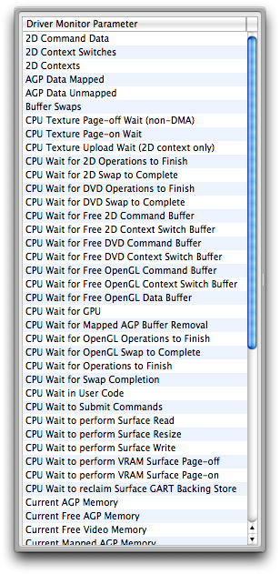
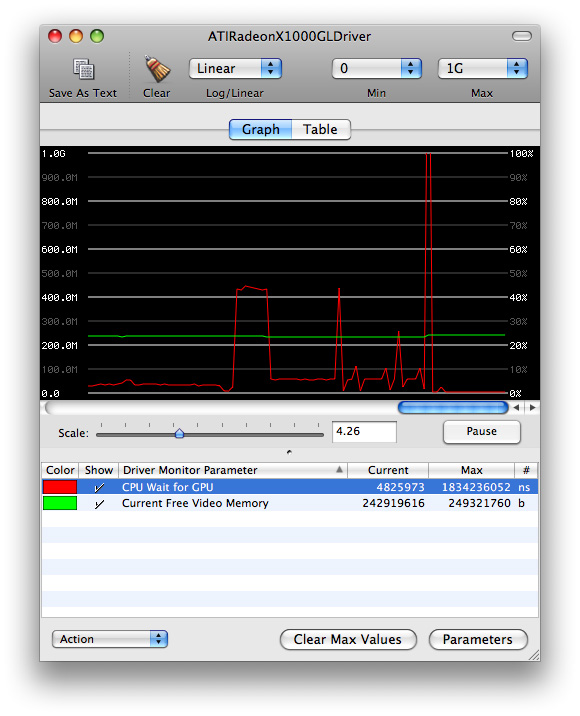
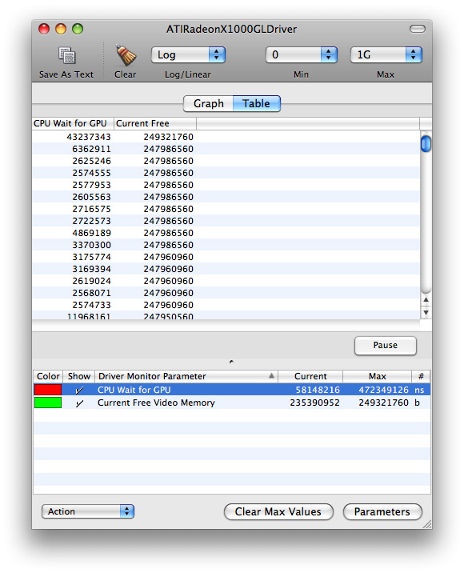
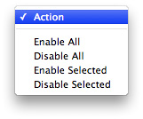
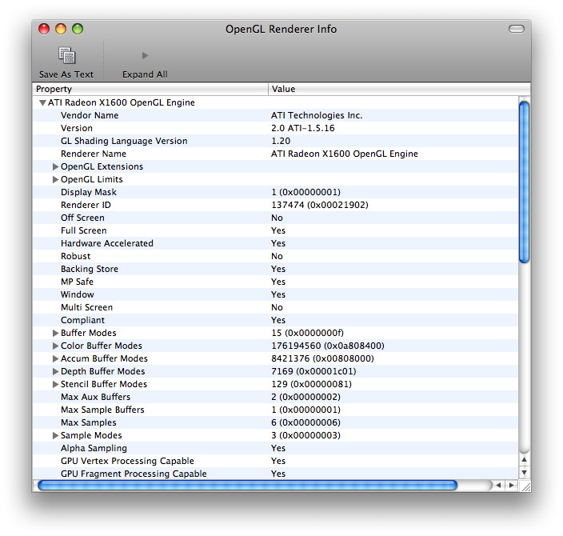
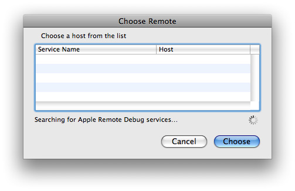

> 导航：[总目录](../../../README.md) · [documentation](../../../_indexes/documentation.md) · [OpenGL Driver Monitor User Guide](Introduction.md)

[Next](Identifying%20and%20Solving%20Performance%20Issues.md)[Previous](Introduction.md)

# Using OpenGL Driver Monitor

OpenGL Driver Monitor is a developer tool that lets you investigate how the graphics processing unit (GPU) works on a system-wide basis. Using it, you can:

- Inspect the renderers available on an OS X system
- See what OpenGL extensions each renderer supports
- Monitor rendering parameters and resources in real-time
- Track the interaction between the GPU and the CPU

This chapter provides an overview of OpenGL Driver Monitor and shows how you can use it to look at and track OpenGL parameters.

For most cases, the default values that OpenGL Driver Monitor uses are optimal. Before you start using the driver monitor for the first time, you might want to familiarize yourself with its preferences to see whether the default values are acceptable for your needs.

To set preferences:

1. Choose OpenGL Driver Monitor > Preferences.
2. Adjust the sampling interval.

   OpenGL Driver Monitor measures data throughput in bytes per sampling interval. For example, the default sampling interval is 1 second, so the data throughput is in bytes per second.

   If you change the sampling interval, the OpenGL Driver Monitor measures values for that interval; the values are not normalized to a 1 second interval. For example, if you set the sampling interval to 2 seconds, and the throughput value is 500 bytes, the reported sampling rate is 500 bytes per interval which, in this case, is 250 bytes per second.
3. Adjust the maximum data samples.

   The value is the maximum number bytes per sampling interval. The default is 2048.
4. Adjust graph colors.

   If you don’t like that default colors for the graph background or graph labels, click the color wells and choose other colors.
5. Select whether or not to use descriptive parameter names.

   OpenGL Driver Monitor provides a list of parameters from which you choose the ones you want to track. You can either view the list as the symbolic names used by driver monitor (such as `command2DBytes`, `gartMapOutBytes`, `finishAll2DWaitTime`) or as descriptive names (such as 2D Command Data, AGP Data Unmapped, CPU Wait for Operations to Finish).
6. If you want to monitor this computer remotely, select “Enable remote monitor.“

   See [Monitoring an OpenGL Driver Remotely](#apple-f4xwc4dqnrsv64tfmyxwi33df52wszbpkridimbqga3dinzufvbuqmrnknlti) for additional details.
7. Click Apply to commit to the changes you made. Then click OK to close the Preferences window.

OpenGL Driver Monitor lets you collect system-wide data for a specific OpenGL driver. You can collect data for the system that you are running the driver monitor on or a system that you already set up for remote monitoring. (See [Monitoring an OpenGL Driver Remotely](#apple-f4xwc4dqnrsv64tfmyxwi33df52wszbpkridimbqga3dinzufvbuqmrnknlti).) The next few sections show how to collect the data.

After OpenGL Driver Monitor launches, choose a driver to investigate from the Monitors > Driver Monitors menu. Most systems have only one driver, but if your system has more than one graphics card installed, you’ll see more than one entry. After choosing a driver, the driver window opens with a view of an empty graph. You’ll notice that the Driver Monitor Parameters list below the graph is empty.

Click Parameters to open a drawer that lists all the driver parameters that you can monitor. Hover the pointer over a parameter name to see its description. See also [OpenGL Driver Monitor Parameters](OpenGL%20Driver%20Monitor%20Parameters.md#apple-f4xwc4dqnrsv64tfmyxwi33df52wszbpkridimbqga3dinzufvbuqnbnknltkny) for definitions of the parameter names and for cross-references between the symbolic name and the descriptive name for a parameter.

Either double-click each of the parameters (shown in [Figure 1-1](#apple-f4xwc4dqnrsv64tfmyxwi33df52wszbpkridimbqga3dinzufvbuqmrnknlto)) you want to monitor, or drag them to the Driver Monitor Parameters list below the graph. As you might expect, not all parameters are equally useful for every scenario. You’ll need to choose accordingly.

Keep in mind that the parameters shown in [Figure 1-1](#apple-f4xwc4dqnrsv64tfmyxwi33df52wszbpkridimbqga3dinzufvbuqmrnknlto) are for a particular driver. Not all drivers support the same parameters, so it’s possible that the list you see doesn’t match either what’s shown in the figure or what’s listed in the glossary.

You’ll notice that when you see similarly named parameters, one of them is typically a “super parameter.” The value of a super parameter includes the values of all its “child parameters.” For example, the super parameter `commandBytes` (Total Command Data) includes all quantities represented by the similarly named parameters `command2DBytes` (2D Command Data), `commandGLBytes` (OpenGL Command Data), and `commandDVDBytes` (DVD Command Data).

__Figure 1-1__  The parameters drawer

After you choose a parameter, OpenGL Driver Monitor adds it to the Driver Monitor Parameter list and starts to display data on the graph and in the columns next to the parameter name. [Figure 1-2](#apple-f4xwc4dqnrsv64tfmyxwi33df52wszbpkridimbqga3dinzufvbuqmrnknltc) shows the driver monitor graph window after displaying two parameters—CPU Wait for CPU and Current Free Video Memory. If you prefer to use colors other than the default ones for graphing the values, click the color well for a parameter and choose another from the color panel that appears.

__Figure 1-2__  The driver monitor graph window

The y-axis values on the left side of the graph are values that represent different units depending on the parameter. The y-axis values on the right side represent percentages. Keep the following in mind when reading the graph:

- Time-based parameters values represent nanoseconds. For example, 1 giga-nanosecond (or 1G, as shown on the graph) represents about 1 second spent on an operation. If the sampling interval is 1 second, then the percentage is 100%.
- Parameters that represent counts are absolute numbers, with quantities measured once per sampling interval. Counts are not affected by the length of the sampling interval, but may vary during the interval.

You can adjust the scale of the x-axis and the base (log or linear) of the y-axis to help you see changes in the values.

You can view the data in tabular format if you prefer. This lets you compare running values among the parameters you are monitoring, as shown in [Figure 1-3](#apple-f4xwc4dqnrsv64tfmyxwi33df52wszbpkridimbqga3dinzufvbuqmrnknltg).

__Figure 1-3__  The driver monitor table window

You enable and disable the driver monitor parameters that you are monitoring by using the Action pop-up menu shown in [Figure 1-4](#apple-f4xwc4dqnrsv64tfmyxwi33df52wszbpkridimbqga3dinzufvbuqmrnknltq). You can also click the Show column to show or hide data for a particular parameter.

__Figure 1-4__  The Action pop-up menu

An OpenGL Driver has at least two renderers associated with it—one hardware renderer and one software renderer. You can take a look at what each renderer supports by choosing Monitors > Renderer Information. Then, when the OpenGL Renderer Info window opens, you can click each of the disclosure triangles to view the settings for a particular renderer.

As [Figure 1-5](#apple-f4xwc4dqnrsv64tfmyxwi33df52wszbpkridimbqga3dinzufvbuqmrnknltm) shows, you can view the vender name and version, the OpenGL extensions that the driver supports, the buffer modes, various processing capabilities, and so on.

__Figure 1-5__  The renderer information window

If you want to view renderer information for renderers other than those on your system, you can set up remote monitoring on the computers whose renderers you want to inspect. See [Monitoring an OpenGL Driver Remotely](#apple-f4xwc4dqnrsv64tfmyxwi33df52wszbpkridimbqga3dinzufvbuqmrnknlti).

Before you can monitor an OpenGL driver on a remote computer, you need to enable remote monitoring on that computer by following these steps:

1. Launch OpenGL Driver Monitor on the computer that you want to monitor remotely.
2. Choose OpenGL Driver Monitor > Preferences.
3. Click “Enable remote monitor.“
4. Make a note of the remote monitor name. You’ll need this later.
5. Click Apply.

To monitor a computer after you enable remote monitoring:

1. Launch OpenGL Driver Monitor on the computer that you plan to monitor from.
2. Choose Monitors > Connect To.
3. When the remote host window opens (see [Figure 1-6](#apple-f4xwc4dqnrsv64tfmyxwi33df52wszbpkridimbqga3dinzufvbuqmrnknlte)), select the name of the computer you want to monitor and click Choose.

   __Figure 1-6__  The remote host window

   
4. Collect, view, and interpret data the same way you would for a local OpenGL driver.

[Next](Identifying%20and%20Solving%20Performance%20Issues.md)[Previous](Introduction.md)

