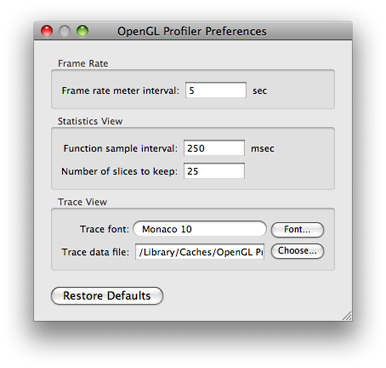
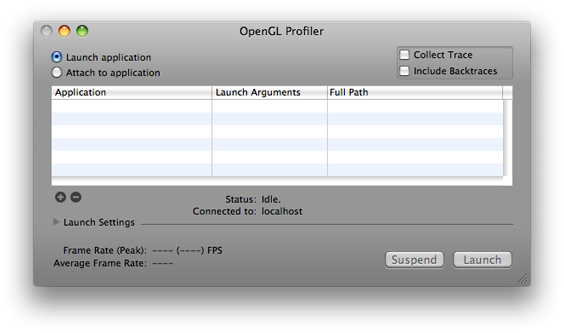
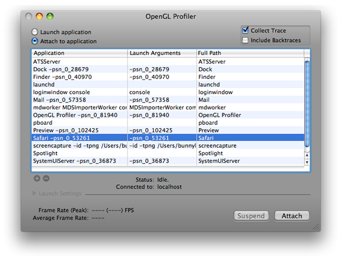
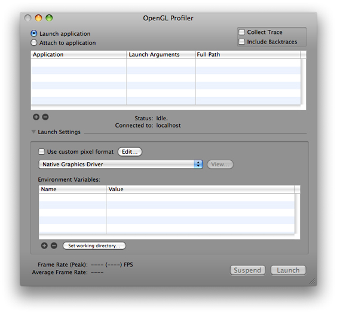
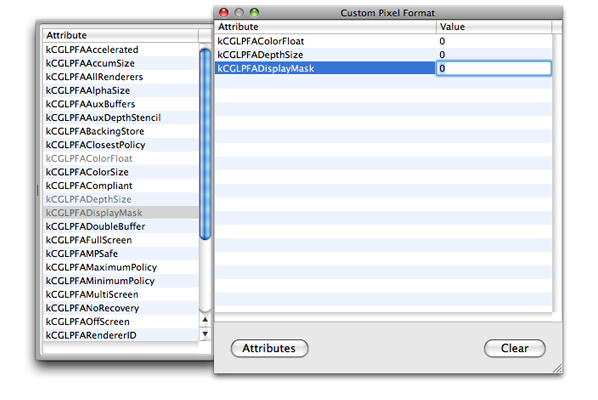
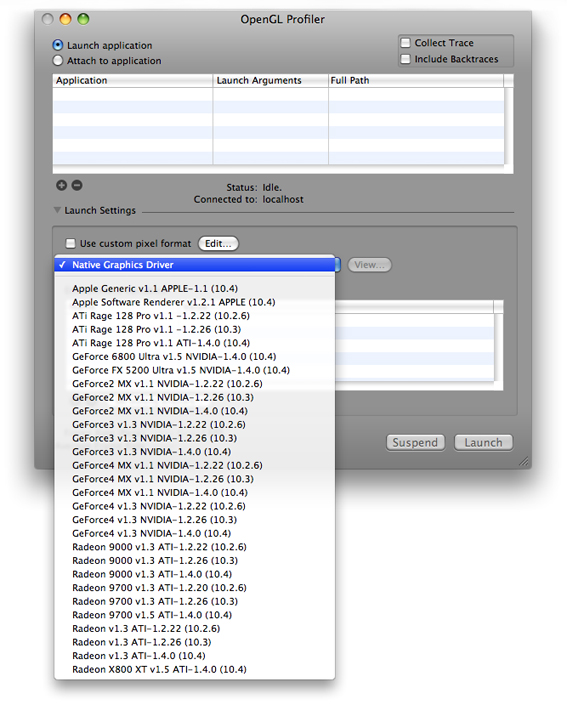
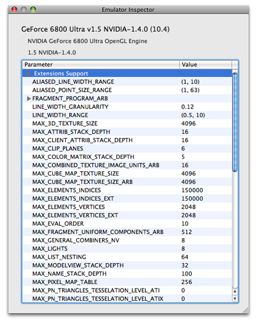
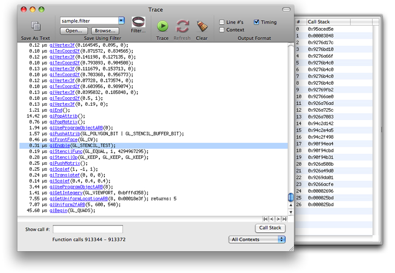
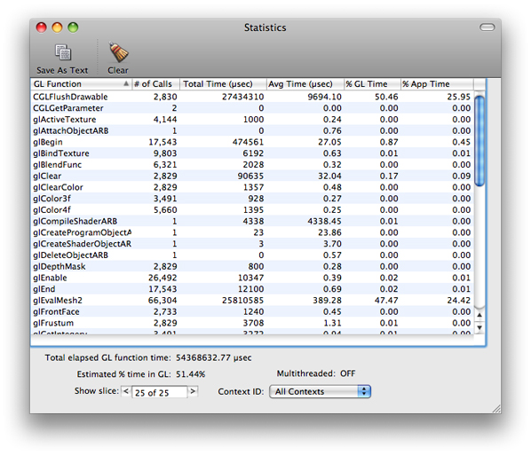
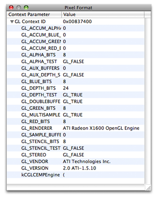

> 导航：[总目录](../../../README.md) · [documentation](../../../_indexes/documentation.md) · [OpenGL Profiler User Guide](Introduction.md)


[Next](Using%20Breakpoints.md)[Previous](Introduction.md)

# Getting Started

Users expect OpenGL applications to have fluid graphics that display without glitches. The more complex the graphics in an OpenGL application are, the more important it is for you to optimize performance and use resources wisely. When an OpenGL application performs less optimally than desired, the cause is often not obvious. That’s where the OpenGL Profiler can be of value to you. Download the GraphicsTools app from [http://developer.apple.com/downloads](https://developer.apple.com/downloads).

This chapter:

- Gives an overview of how OpenGL Profiler works
- Shows how to set up your computer to use the profiler
- Describes how to start a profiling session for an OpenGL application
- Explains how to view and interpret data collected by the profiler
- Tells how to look at and modify application resources and parameters

Before reading this chapter, you may want to read the “Improving Performance” chapter in _[OpenGL Programming Guide for Mac](../OpenGL%20Programming%20Guide%20for%20Mac/About%20OpenGL%20for%20OS%20X.md#apple-f4xwc4dqnrsv64tfmyxwi33df52wszbpkridimbqgaytsobx)_. That chapter provides a list of best programming practices for OpenGL and shows how to gather baseline data using a few Apple tools in addition to OpenGL Profiler. In fact, prior to using OpenGL Profiler, it’s best to start your analysis with Instruments. The results from Instruments will help you determine how to focus your efforts with OpenGL Profiler, or whether you even need to use the profiler application. It may be that your application’s problems are not due to your OpenGL code!

OpenGL Profiler collects trace and statistics for applications that use OpenGL. A _trace_ is an ordered list of the OpenGL calls made by an application. Each entry in a trace shows a function name and the values of the parameters passed to the function. Statistics show cumulative totals, by function, for the number of times an application calls a function and the execution time of the function. You can also see the average execution time for a function, the percentage of time a function is used by OpenGL, and the percentage of time a function is used by the application.

The OpenGL functions that you’ll see in the trace and statistics include those defined by the OpenGL specification (see [http://www.opengl.org](http://www.opengl.org/)) as well as the functions that are part of the low-level OS X OpenGL programming interfaces—CGL. (See _CGL Reference_.)

OpenGL Profiler is also useful for inspecting and controlling various aspects of your application. For example, you can:

- View the OpenGL resources your application uses, such as textures, vertex programs, and shaders.
- View buffer contents, such as the depth and back buffers
- Set breakpoints on specific OpenGL functions and view the call stack
- Attach a script of OpenGL commands that executes at a breakpoint
- Enable or disable individual OpenGL commands

If you’ve never used OpenGL Profiler on your system, if you want to allow the profiler to attach to a running application you must set the environment variable `GL_ENABLE_DEBUG_ATTACH`. You also might want to set preferences.

There are two locations that require the environment variable:

- Your shell startup file. The name of this file depends on the shell that you use: `~/.login`, `~/.cshrc`, `~/.bashrc`, `~/.profile`, and so on. Add the following to the appropriate shell file:

```
setenv GL_ENABLE_DEBUG_ATTACH YES
```
- The OS X environment property list file (`~/.MacOSX/environment.plist`). The Finder uses this file to set the environment variable when it launches applications. Typically OpenGL Profiler creates this file for you the first time that you launch OpenGL Profiler on a system. The first time you launch the application you should see a dialog that asks whether you want to enable the Attach feature. Click Enable to have the property list file created for you.

  You can skip the rest of this section unless, for some reason, the property list file is missing. If that’s the case, to use the Attach feature you’ll need to create a plain text file, name it `environment.plist`, and enter the following into the file:

```xml
<?xml version="1.0" encoding="UTF-8"?>
<!DOCTYPE plist PUBLIC "-//Apple Computer//DTD PLIST 1.0//EN" "http://www.apple.com/DTDs/PropertyList-1.0.dtd">
<plist version="1.0">
<dict>
        <key>GL_ENABLE_DEBUG_ATTACH</key>
        <string>YES</string>
</dict>
</plist>
```

  Copy the file to your `~/.MacOSX` directory. If the directory does not exist, open Terminal and create the directory from within your shell.

You can view preferences by choosing OpenGL Profiler > Preferences. You can set the following:

- Frame rate meter interval, which allows you to change the frames-per-second readout from you application. If you need a finer grain of measurement and a more immediate result, you might want to increase this value.
- The function sample interval in the statistics view
- The number of slices to keep in the statistics view. You can limit the number of timing samples that OpenGL Profiler records.
- Trace view font. You can set the font face and the font size.
- Trace data file. You can change the file location and name.



When you double-click the OpenGL Profiler icon, the window shown in [Figure 1-1](#apple-f4xwc4dqnrsv64tfmyxwi33df52wszbpkridimbqga3dinzvfvbuqmrqfvjvomy) opens. You use this window to set up a profiling session. You can start profiling an application either by launching it through OpenGL Profiler or by attaching the profiler to an application that’s already running.

__Figure 1-1__  The main window in OpenGL Profiler



Before you attach or launch your application, select Collect Trace. You also have the option to collect backtraces. After your application launches or attaches, you may see small pauses or stutters in the application. This is normal behavior that is due to the large amount of data that OpenGL Profiler writes out when collecting a trace. It does not significantly affect the performance statistics.

To attach OpenGL Profiler to a running application:

1. Select “Attach to application.”
2. In the list that appears, select the application you want to profile.

   
3. Click Attach.

   The status changes from idle to running, and the application list dims. Now that the profiler is attached to the application, you can perform any of the tasks described in the rest of this document.

   OpenGL Profiler begins collecting data as soon as it attaches to your application. Data collection ends when you quit the application or click the Detach button in the OpenGL Profiler window. You can temporarily stop data collection by clicking Suspend.

   Detaching lets the application continue to run, which is useful for applications (like shell tools) that do not have a user interface.

To set up OpenGL Profiler to launch an application:

1. Select “Launch application.”
2. Click the plus (+) button and navigate to the application you want to profile, then choose it.

   You can add as many applications as you’d like, but you can profile only one at a time.
3. If your application needs launch arguments, click the Launch Arguments text field and add them.
4. Click the disclosure triangle to view the optional launch settings.

   You can use these settings when you want to profile an application under specific conditions. For example, you can use a custom pixel format, simulate how the application would work using a specific graphics driver, and set additional environment variables. See [Customizing Launch Settings](#apple-f4xwc4dqnrsv64tfmyxwi33df52wszbpkridimbqga3dinzvfvbuqmrqfvjvomq) for details.
5. Click Launch.

   The status changes from idle to running, and the application and environment variables lists dim.

   OpenGL Profiler begins collecting data as soon as it launches your application. Data collection ends when you quit the application or click the Kill button in the OpenGL Profiler window. You can temporarily stop data collection by clicking Suspend.

Click the disclosure triangle next to Launch Settings in the OpenGL Profiler window to customize how your application launches. These options allow you to observe how your application operates under specific conditions.



Select “Use custom pixel format” and click Edit to try out different settings for pixel format attributes. You can quickly see the results of modifying attribute values without changing the source code of the application.



OpenGL Profiler contains parameters and values for a variety of OpenGL drivers, not only those available in the system that you are currently running. This feature comes in handy if you want to examine the values that OpenGL returns for a particular driver. Emulation mode does not affect the performance of your application in any way. The purpose of this feature is to help you determine whether code that depends on certain hardware features works properly. Keep in mind that OpenGL Profiler does not replace the drivers your system.

When using a driver emulation, OpenGL Profiler does changes the return values for some of the `glGet` functions. For example, if you enable the Rage 128 emulator for OS X v10.2 and earlier, calling `glGetString(GL_RENDERER)` returns `"ATi Rage 128 Pro OpenGL Engine"` instead of the renderer that’s actually in your system. In addition, any `glGet` functions that return driver-specific parameters will return the values you’d get if your application ran on the emulated card. For example, calling `glGetInteger(GL_MAX_LIGHTS, &maxLights)` assigns `8` to `maxLights`.

To set a specific driver:

1. Choose a driver from the pop-up menu.

   
2. Click View to inspect the parameters and values for the driver.

   

Apple provides a set of driver emulation files. These are property lists that you can edit yourself. You can create an emulation file for a driver not in the list by using a text editor and then saving the file in this directory:

`~/Library/OpenGL Profiler/Driver Emulators`

You’ll need to restart OpenGL Profiler to see the new file in the driver list.

You can add environment variables by clicking the plus (+) button. Then enter the variable name and its value. You can add any variable your application reads using `getenv(3)`.

The working directory refers to your application’s current working directory. It’s the path returned by the function `getcwd(3)` and the same path that’s automatically prepended to any relative path in your application. If your application does not conform to Apple’s application wrapper scheme, you need to set the working directory so that your application can find resources such as texture maps.

For example, if you launch a nonconforming application from Finder, for this line of code to execute properly:

`fopen("mytexture", "r+")`

you need to set the working directory to the folder that contains `"mytexture"`.

You can view a trace by choosing Views > Trace. The Trace window displays a running list of the OpenGL function calls your application makes. The time value next to the function name gives you an idea of the performance cost of the call. Keep in mind that a lot of OpenGL calls set bits and are acted upon only at draw or flush time. This means that in addition to looking at the time for a particular function, you also need to consider the execution time of the next draw or flush function.



For strategies on interpreting trace data, see:

- [Making Sure You Use Functions Correctly](Identifying%20and%20Solving%20Performance%20Issues.md#apple-f4xwc4dqnrsv64tfmyxwi33df52wszbpkridimbqga3dinzvfvbuqnbqfvjvomy)
- [Identifying Problem Areas in Your Application](Identifying%20and%20Solving%20Performance%20Issues.md#apple-f4xwc4dqnrsv64tfmyxwi33df52wszbpkridimbqga3dinzvfvbuqnbqfvjvona)
- [Managing Trace Data](Identifying%20and%20Solving%20Performance%20Issues.md#apple-f4xwc4dqnrsv64tfmyxwi33df52wszbpkridimbqga3dinzvfvbuqnbqfvjvoni)

Choose Views > Statistics to open the Statistics window. This view aggregates the trace data so that you can see function call frequency, execution time sums and averages, and these percentages:

- % GL Time indicates the amount of time a function takes to execute compared only to the OpenGL code in an application.
- % Application Time indicates the amount of time a function takes to execute compared to all code in an application.
- Estimated % Time in OpenGL indicates the amount of time an application spends executing OpenGL code compared to all application code.



These statistics can help you identify the portions of your OpenGL code that consume the most time. Finding that your application stalls during certain calls or that some functions seem to be called at an unusually high frequency can help you pinpoint the portions of your code that might need fine-tuning.

One way to find out where to focus your optimization efforts is to compare the time spent executing OpenGL calls to the time spent executing non-OpenGL calls. For example, if your application runs slowly but spends most of its time executing non-OpenGL calls, you'll get the most performance gains by analyzing and optimizing the non-OpenGL portion.

For other strategies on interpreting statistics data, see:

- [Making Sure You Use Functions Correctly](Identifying%20and%20Solving%20Performance%20Issues.md#apple-f4xwc4dqnrsv64tfmyxwi33df52wszbpkridimbqga3dinzvfvbuqnbqfvjvomy)
- [Identifying Problem Areas in Your Application](Identifying%20and%20Solving%20Performance%20Issues.md#apple-f4xwc4dqnrsv64tfmyxwi33df52wszbpkridimbqga3dinzvfvbuqnbqfvjvona)

To view the context parameters for the application’s pixel format, choose Views > Pixel Format. For each OpenGL context, you’ll see a list of its parameters and the value for each parameter.



[Next](Using%20Breakpoints.md)[Previous](Introduction.md)

