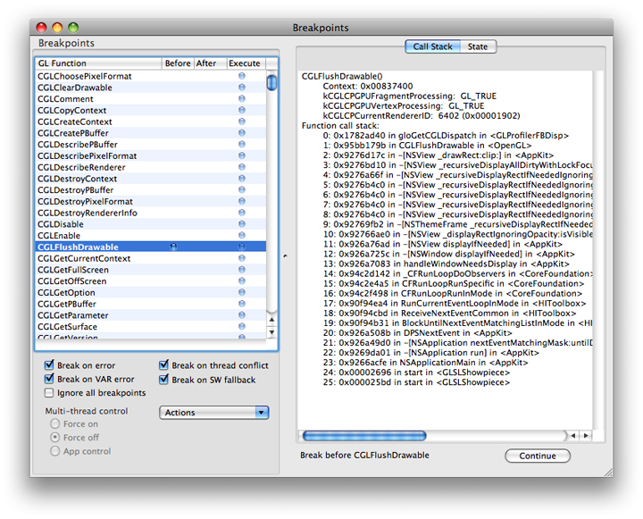
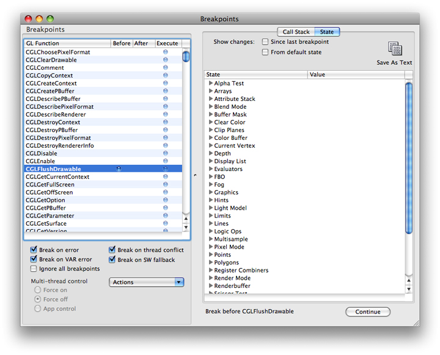
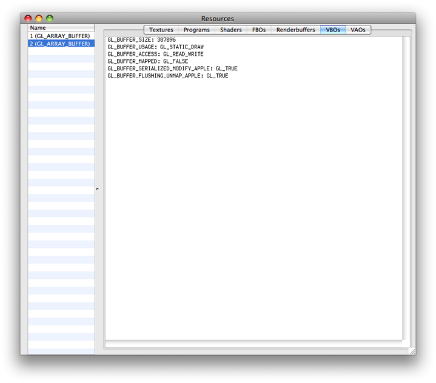
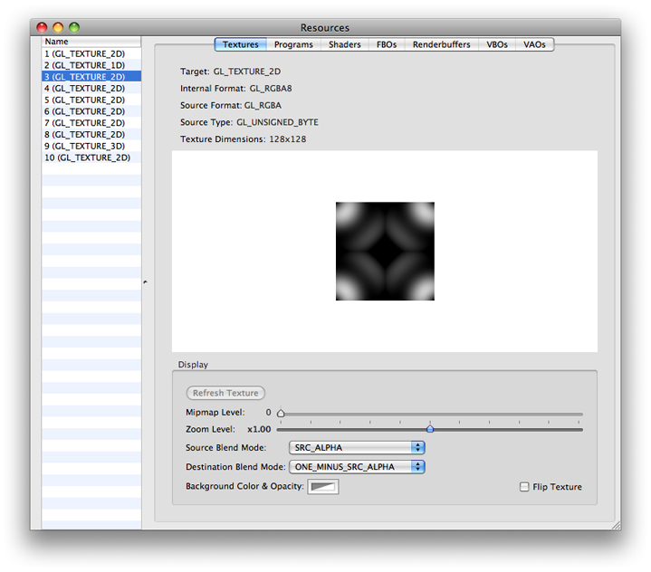
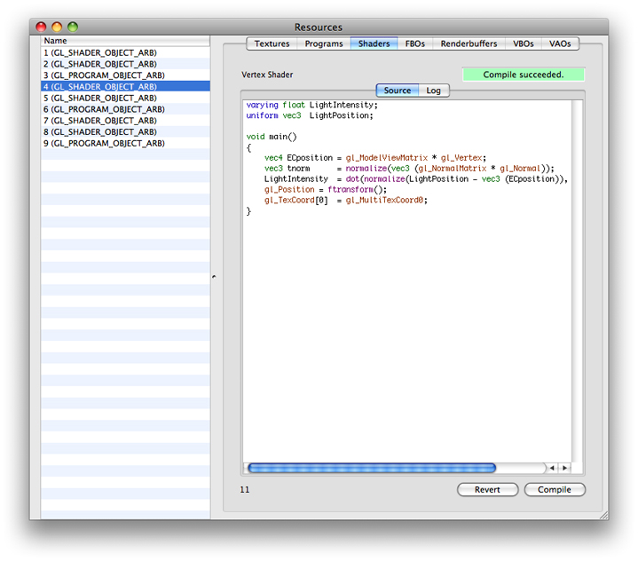
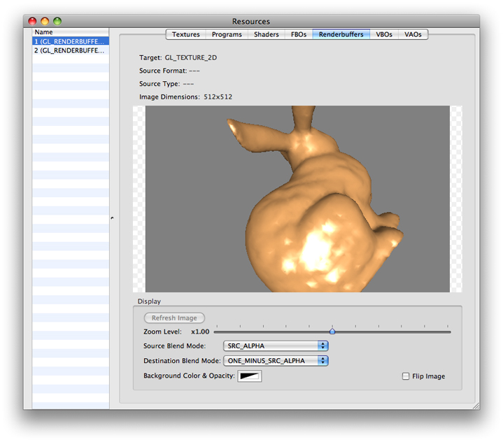
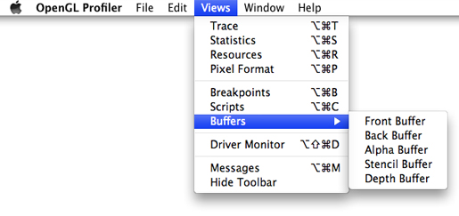
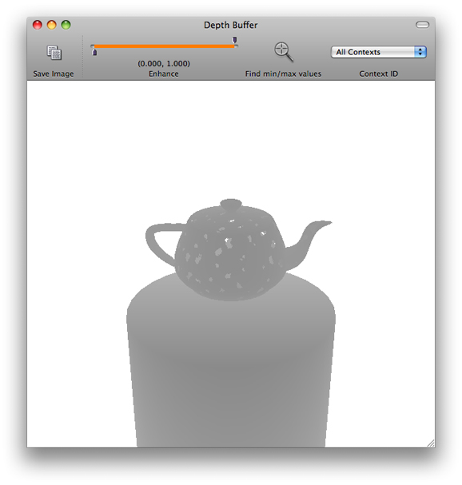
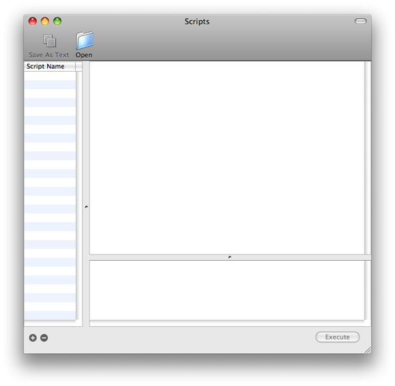

> 导航：[总目录](../../../README.md) · [documentation](../../../_indexes/documentation.md) · [OpenGL Profiler User Guide](Introduction.md)


[Next](Identifying%20and%20Solving%20Performance%20Issues.md)[Previous](Getting%20Started.md)

# Using Breakpoints

You can use OpenGL Profiler to set breakpoints in your application. A breakpoint can occur before or after a specific OpenGL function, when your application uses a software renderer, or when an error or thread conflict occurs. When your application is paused, you can perform a number of tasks, including:

- Examining the call state and OpenGL state
- Viewing and modifying resources
- Viewing buffer contents
- Executing a script that you attach to the breakpoint

You can also choose to disable the execution of one or more OpenGL functions.

This chapter describes how to set breakpoints and describes all the tasks that you can perform only after your application pauses at a breakpoint.

You set breakpoints in the Breakpoints window. To open this window, choose Views > Breakpoints. As shown in [Figure 2-1](#apple-f4xwc4dqnrsv64tfmyxwi33df52wszbpkridimbqga3dinzvfvbuqmzqfvjvomq), the left side of the window lists the OpenGL functions that you can set breakpoints on. This list includes functions defined by the OpenGL specification and the CGL calls available in OS X. Keep in mind that AGL functions and Cocoa OpenGL class methods call into the CGL framework, so AGL and Cocoa methods aren’t explicitly on the function list.

The right side of the window lets you view the call stack, as shown in [Figure 2-1](#apple-f4xwc4dqnrsv64tfmyxwi33df52wszbpkridimbqga3dinzvfvbuqmzqfvjvomq), or OpenGL state variables, as shown in [Figure 2-2](#apple-f4xwc4dqnrsv64tfmyxwi33df52wszbpkridimbqga3dinzvfvbuqmzqfvjvomy).

__Figure 2-1__  The Breakpoints window displaying the call stack



To set a breakpoint, choose the OpenGL function in the function list that you want to set a breakpoint on. Then click one of the following columns:

- Before pauses your application just before it executes the OpenGL function.
- After pauses your application just after it executes the OpenGL function.

A blue indicator appears wherever you set a breakpoint.

__Figure 2-2__  The Breakpoints window displaying OpenGL state variables



The checkboxes below the function list let you set breakpoint conditions. You can also turn the function list breakpoints on and off quickly by selecting “Ignore all breakpoints.”

OpenGL resources include textures, programs, shaders, framebuffer objects, renderbuffer objects, vertex buffer objects, and vertex array objects. You can view these resources by choosing Views > Resources. The right side of the Resources window lets you choose a resource type. You can see the individual resources, for the resource types that your application uses, listed in the left side. Click a resource name to view its settings and other relevant information on the right side. For example, see [Figure 2-3](#apple-f4xwc4dqnrsv64tfmyxwi33df52wszbpkridimbqga3dinzvfvbuqmzqfvjvona) which shows two vertex buffer objects. The parameters and values for the one that’s selected are shown on the right side.

__Figure 2-3__  The Resources window open to vertex buffer objects



When your application pauses at a breakpoint, you can modify programs and shaders. The modifications take effect when your application resumes, allowing you to get immediate feedback on how changes effect the behavior of your application. For details, see:

- [Modifying Programs](#apple-f4xwc4dqnrsv64tfmyxwi33df52wszbpkridimbqga3dinzvfvbuqmzqfvjvony)
- [Modifying Shaders](#apple-f4xwc4dqnrsv64tfmyxwi33df52wszbpkridimbqga3dinzvfvbuqmzqfvjvooa)

You can make modifications to textures and renderbuffers, but these affect only the view in the resource window, allowing for better or correct viewing within OpenGL Profiler. For details, see:

- [Modifying Texture Display Parameters](#apple-f4xwc4dqnrsv64tfmyxwi33df52wszbpkridimbqga3dinzvfvbuqmzqfvjvonq)
- [Modifying a Renderbuffer](#apple-f4xwc4dqnrsv64tfmyxwi33df52wszbpkridimbqga3dinzvfvbuqmzqfvjvomjq)

You can modify how a texture displays by changing its mipmap level, zoom level, source and destination blend modes, and the background color and opacity. You cannot change a texture’s target, internal format, source format, source type, or dimensions. Keep in mind that modifications affect only what you see in the Resources window.

To modify the display parameters for a texture:

1. Click Textures in the Resources window.

   The texture names are listed on the left, as shown in [Figure 2-4](#apple-f4xwc4dqnrsv64tfmyxwi33df52wszbpkridimbqga3dinzvfvbuqmzqfvjvomjt).
2. Choose a texture name.
3. Modify the display parameters that you’d like to change.

   You should see the changes take effect immediately.
4. Click Continue in the Breakpoints window.

You need to refresh the texture only if the application modifies it after you open the Resources window.

__Figure 2-4__  The Textures pane in the Resources window



A program is similar to a shader in that it describes the source code that modifies data in the GPU vertex or fragment pipeline. Programs were available for coding vertex and fragment operations prior to shaders. They use an arcane coding language compared to the C-like syntax used for OpenGL Shading Language. [Listing 2-1](#apple-f4xwc4dqnrsv64tfmyxwi33df52wszbpkridimbqga3dinzvfvbuqmzqfvjvooi) shows a program for a basic shader.

__Listing 2-1__  A program for a basic shader

```
!!ARBvp1.0

ATTRIB vertexPosition  = vertex.position;
OUTPUT outputPosition  = result.position;

# Transform the vertex by the modelview/projection matrix
DP4    outputPosition.x, state.matrix.mvp.row[0], vertexPosition;
DP4    outputPosition.y, state.matrix.mvp.row[1], vertexPosition;
DP4    outputPosition.z, state.matrix.mvp.row[2], vertexPosition;
DP4    outputPosition.w, state.matrix.mvp.row[3], vertexPosition;

# Pass the color and texture coordinate through
MOV    result.color, vertex.color;
MOV    result.texcoord, vertex.texcoord;

END
```

To modify program code:

1. Click Programs in the Resources window.
2. Choose a program from the list on the left.
3. Modify the code.
4. Click Compile.
5. Click Continue in the Breakpoints window.

   When the application resumes, you should see the result of your modified program.

Shaders are small programs, written using OpenGL Shading Language, that compute surface properties. OpenGL lets you modify shaders that are part of your application, giving you the ability to get immediate feedback on the changes.

To modify a shader:

1. Click Shaders in the Resources window.

   The shader objects are listed on the left, as shown in [Figure 2-5](#apple-f4xwc4dqnrsv64tfmyxwi33df52wszbpkridimbqga3dinzvfvbuqmzqfvjvomju).
2. Choose a shader object from the list on the left.
3. Click Source and modify the shader code.
4. Click Compile.

   If compilation fails, click Log to examine the errors. You can return to the original code by clicking Revert.

   If the compilation succeeds, release the breakpoint and click Continue in the breakpoints view.

__Figure 2-5__  The Shaders pane in the Resources window



A renderbuffer is an offscreen rendering destination for a 2D pixel image. Renderbuffers are defined in the OpenGL specification for the [GL_EXT_framebuffer_object](http://oss.sgi.com/projects/ogl-sample/registry/EXT/framebuffer_object.txt) extension. OpenGL Profiler lets you modify how the contents of the renderbuffer display by changing its zoom level, source and destination blend modes, and the background color and opacity. You cannot change a renderbuffer’s target, source format, source type, or image dimensions. Keep in mind that modifications affect only what you see in the Resources window.

To modify the display parameters of a renderbuffer object:

1. Click Renderbuffers in the Resources window.

   The renderbuffer objects are listed on the left, as shown in [Figure 2-6](#apple-f4xwc4dqnrsv64tfmyxwi33df52wszbpkridimbqga3dinzvfvbuqmzqfvjvomjw).
2. Choose a renderbuffer object.
3. Modify the display parameters that you’d like to change.

   You should see the changes take effect immediately.
4. Click Continue in the Breakpoints window.

You need to refresh the image only if the application modifies it after you open the Resources window.

__Figure 2-6__  The Renderbuffers pane in the Resources window



You can view the contents of an OpenGL buffer by choosing Views > Buffers and then choosing a buffer—Front Buffer, Back Buffer, Alpha Buffer, Stencil Buffer, or Depth Buffer. Buffers not used by your application appear dimmed. Buffer views are available only when your application pauses at a breakpoint.



After selecting a buffer, its contents appear in a window. Each time your application pauses at a breakpoint, each buffer view updates automatically.

[Figure 2-7](#apple-f4xwc4dqnrsv64tfmyxwi33df52wszbpkridimbqga3dinzvfvbuqmzqfvjvoni) shows the depth buffer contents for the GLSLShowpiece application available from [http://developer.apple.com](https://developer.apple.com/).

__Figure 2-7__  The Depth Buffer window



OpenGL Profiler allows you to execute (at a performance cost) small amounts of OpenGL code or other scripting calls when your application pauses at a breakpoint. A script is a text file that contains OpenGL function calls. For example, a script can be as simple as the following line of code:

```
glClear(1.0, 0.0, 0.0, 1.0);
```

Or it can be more complex, containing many lines of code, such as:

```
glBegin(GL_POINTS);
glVertex3f(0,0,1);
glVertex3f(1,0,1);
glVertex3f(1,1,1);
glVertex3f(0,1,1);
glEnd();
```

You can create a script using any text editor, or you can enter a script directly into the Scripts window.

To add a script:

1. Choose Views > Scripts to open the Scripts window.

   
2. If you created the script in a text editor, click Open, navigate to the script, and choose it. If you want to create a script in the Scripts window, click the plus (+) button, enter a script name, then type commands in the text window on the right.

   Any script that you add in the Scripts window will be available from the Breakpoints window.

After you add a script to OpenGL Profiler, you can either execute it manually or attach it to a breakpoint.

To execute a script manually when your application pauses at a breakpoint:

1. Choose a script in the Scripts window.
2. Click Execute.

   OpenGL Profiler sends the commands to your application for execution. Errors in your script appear in the pane located in the lower left of the Scripts window.

To attach a script to a breakpoint:

1. Open the Breakpoints window.
2. Choose Actions > Attach Script.
3. In the sheet that appears, choose a script.
4. Select one or more execution options.

   You can choose to have OpenGL Profiler execute the script before, after, or both before and after the OpenGL function. You can also choose to have your application continue after executing the script.
5. Click Attach.

   A small document icon appears in the functions list next to the blue breakpoint indicator for the function.

To remove a script from a breakpoint, choose Actions > Remove Script.

Under some circumstances you might want to disable the execution of one or more OpenGL functions in your application.

To disable the execution of all OpenGL functions in your application, in the Breakpoints window choose Actions > Execute none. To enable execution, choose Actions > Execute all.

To disable execution of individual OpenGL functions, in the Breakpoints window, select the function you want to disable, and click the Execute column. OpenGL Profiler ignores breakpoints set on disabled functions. To enable a function, click the Execute column so that the blue indicator appears.

[Next](Identifying%20and%20Solving%20Performance%20Issues.md)[Previous](Getting%20Started.md)

