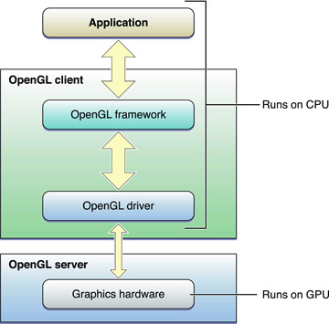

> 导航：[总目录](../../../README.md) · [documentation](../../../_indexes/documentation.md)

[Next](OpenGL%20on%20the%20Mac%20Platform.md)

# About OpenGL for OS X

OpenGL is an open, cross-platform graphics standard with broad industry support. OpenGL greatly eases the task of writing real-time 2D or 3D graphics applications by providing a mature, well-documented graphics processing pipeline that supports the abstraction of current and future hardware accelerators.

OpenGL is an excellent choice for graphics development on the Macintosh platform because it offers the following advantages:

- __Reliable Implementation__. The OpenGL client-server model abstracts hardware details and guarantees consistent presentation on any compliant hardware and software configuration. Every implementation of OpenGL adheres to the OpenGL specification and must pass a set of conformance tests.
- __Performance__. Applications can harness the considerable power of the graphics hardware to improve rendering speeds and quality.
- __Industry acceptance__. The specification for OpenGL is controlled by the Khronos Group, an industry consortium whose members include many of the major companies in the computer graphics industry, including Apple. In addition to OpenGL for OS X, there are OpenGL implementations for Windows, Linux, Irix, Solaris, and many game consoles.

### OpenGL Is a C-based, Platform-Neutral API

Because OpenGL is a C-based API, it is extremely portable and widely supported. As a C API, it integrates seamlessly with Objective-C based Cocoa applications. OpenGL provides functions your application uses to generate 2D or 3D images. Your application presents the rendered images to the screen or copies them back to its own memory.

The OpenGL specification does not provide a windowing layer of its own. It relies on functions defined by OS X to integrate OpenGL drawing with the windowing system. Your application creates an OS X OpenGL _rendering context_ and attaches a rendering target to it (known as a _drawable object_). The rendering context manages OpenGL state changes and objects created by calls to the OpenGL API. The drawable object is the final destination for OpenGL drawing commands and is typically associated with a Cocoa window or view.

### Different Rendering Destinations Require Different Setup Commands

Depending on whether your application intends to draw OpenGL content to a window, to draw to the entire screen, or to perform offscreen image processing, it takes different steps to create the rendering context and associate it with a drawable object.

### OpenGL on Macs Exists in a Heterogenous Environment

Macs support different types of graphics processors, each with different rendering capabilities, supporting versions of OpenGL from 1.x through OpenGL 3.2. When creating a rendering context, your application can accept a broad range of renderers or it can restrict itself to devices with specific capabilities. Once you have a context, you can configure how that context executes OpenGL commands.

OpenGL on the Mac is not only a heterogenous environment, but it is also a _dynamic_ environment. Users can add or remove displays, or take a laptop running on battery power and plug it into a wall. When the graphics environment on the Mac changes, the renderer associated with the context may change. Your application must handle these changes and adjust how it uses OpenGL.

### OpenGL Helps Applications Harness the Power of Graphics Processors

Graphics processors are massively parallelized devices optimized for graphics operations. To access that computing power adds additional overhead because data must move from your application to the GPU over slower internal buses. Accessing the same data simultaneously from both your application and OpenGL is usually restricted. To get great performance in your application, you must carefully design your application to feed data and commands to OpenGL so that the graphics hardware runs in parallel with your application. A poorly tuned application may stall either on the CPU or the GPU waiting for the other to finish processing.

When you are ready to optimize your application’s performance, Apple provides both general-purpose and OpenGL-specific profiling tools that make it easy to learn where your application spends its time.

### Concurrency in OpenGL Applications Requires Additional Effort

Many Macs ship with multiple processors or multiple cores, and future hardware is expected to add more of each. Designing applications to take advantage of multiprocessing is critical. OpenGL places additional restrictions on multithreaded applications. If you intend to add concurrency to an OpenGL application, you must ensure that the application does not access the same context from two different threads at the same time.

### Performance Tuning Allows Your Application to Provide an Exceptional User Experience

Once you’ve improved the performance of your OpenGL application and taken advantage of concurrency, put some of the freed processing power to work for you. Higher resolution textures, detailed models, and more complex lighting and shading algorithms can improve image quality. Full-scene antialiasing on modern graphics hardware can eliminate many of the “jaggies” common on lower resolution images.

If you have never programmed in OpenGL on the Mac, you should read this book in its entirety, starting with [OpenGL on the Mac Platform](OpenGL%20on%20the%20Mac%20Platform.md#apple-f4xwc4dqnrsv64tfmyxwi33df52wszbpkridimbqgaytsobxfvbuqmrqhawvgvzr). Critical Mac terminology is defined in that chapter as well as in the [Glossary](Glossary.md#apple-f4xwc4dqnrsv64tfmyxwi33df52wszbpkridimbqgaytsobxfvbuqnjqgiwvgvzr).

If you already have an OpenGL application running on the Mac, but have not yet updated it for OS X v10.7, read [Choosing Renderer and Buffer Attributes](Choosing%20Renderer%20and%20Buffer%20Attributes.md#apple-f4xwc4dqnrsv64tfmyxwi33df52wszbpkridimbqgaytsobxfvbuqmrrgqwvgvzz) to learn how to choose an OpenGL profile for your application.

To find out how to update an existing OpenGL app for high resolution, see [Optimizing OpenGL for High Resolution](Optimizing%20OpenGL%20for%20High%20Resolution.md#apple-f4xwc4dqnrsv64tfmyxwi33df52wszbpkridimbqgaytsobxfvbuqmjqgays2u2xgq).

Once you have OpenGL content in your application, read [OpenGL Application Design Strategies](OpenGL%20Application%20Design%20Strategies.md#apple-f4xwc4dqnrsv64tfmyxwi33df52wszbpkridimbqgaytsobxfvbuqmrnknltm) to learn fundamental patterns for implementing high-performance OpenGL applications, and the chapters that follow to learn how to apply those patterns to specific OpenGL problems.

This guide assumes that you have some experience with OpenGL programming, but want to learn how to apply that knowledge to create software for the Mac. Although this guide provides advice on optimizing OpenGL code, it does not provide entry-level information on how to use the OpenGL API. If you are unfamiliar with OpenGL, you should read [OpenGL on the Mac Platform](OpenGL%20on%20the%20Mac%20Platform.md#apple-f4xwc4dqnrsv64tfmyxwi33df52wszbpkridimbqgaytsobxfvbuqmrqhawvgvzr) to get an overview of OpenGL on the Mac platform, and then read the following OpenGL programming guide and reference documents:

- [OpenGL Programming Guide](http://www.opengl.org/documentation/red_book/), by Dave Shreiner and the Khronos OpenGL Working Group; otherwise known as "The Red book.”
- _OpenGL Shading Language_, by Randi J. Rost, is an excellent guide for those who want to write programs that compute surface properties (also known as _shaders_).
- [OpenGL Reference Pages](http://www.opengl.org/sdk/docs/man/).

Before reading this document, you should be familiar with Cocoa windows and views as introduced in _[Window Programming Guide](../../Cocoa/Window%20Programming%20Guide/Introduction.md#apple-f4xwc4dqnrsv64tfmyxwi33df52wszbpgeydambqgaztc2i)_ and _[View Programming Guide](../../Cocoa/View%20Programming%20Guide/Introduction%20to%20View%20Programming%20Guide%20for%20Cocoa.md#apple-f4xwc4dqnrsv64tfmyxwi33df52wszbpkridimbqgazdsnzy)_.

Keep these reference documents handy as you develop your OpenGL program for OS X:

- _[NSOpenGLView Class Reference](https://developer.apple.com/documentation/appkit/nsopenglview)_, _[NSOpenGLContext Class Reference](https://developer.apple.com/documentation/appkit/nsopenglcontext)_, _[NSOpenGLPixelBuffer Class Reference](https://developer.apple.com/documentation/appkit/nsopenglpixelbuffer)_, and _[NSOpenGLPixelFormat Class Reference](https://developer.apple.com/documentation/appkit/nsopenglpixelformat)_ provide a complete description of the classes and methods needed to integrate OpenGL content into a Cocoa application.
- _CGL Reference_ describes low-level functions that can be used to create full-screen OpenGL applications.
- _OpenGL Extensions Guide_ provides information about OpenGL extensions supported in OS X.

The OpenGL Foundation website, [http://www.opengl.org](http://www.opengl.org/), provides information on OpenGL commands, the Khronos OpenGL Working Group, logo requirements, OpenGL news, and many other topics. It's a site that you'll want to visit regularly. Among the many resources it provides, the following are important reference documents for OpenGL developers:

- _OpenGL Specification_ provides detailed information on how an OpenGL implementation is expected to handle each OpenGL command.
- _OpenGL Reference_ describes the main OpenGL library.
- _OpenGL GLU Reference_ describes the OpenGL Utility Library, which contains convenience functions implemented on top of the OpenGL API.
- _OpenGL GLUT Reference_ describes the OpenGL Utility Toolkit, a cross-platform windowing API.
- [OpenGL API Code and Tutorial Listings](http://www.opengl.org/code/) provides code examples for fundamental tasks, such as modeling and texture mapping, as well as for advanced techniques, such as high dynamic range rendering (HDRR).
[Next](OpenGL%20on%20the%20Mac%20Platform.md)

