> 导航：[总目录](../../../README.md) · [documentation](../../../_indexes/documentation.md) · [OpenGL Programming Guide for Mac](About%20OpenGL%20for%20OS%20X.md)


[Next](Customizing%20the%20OpenGL%20Pipeline%20with%20Shaders.md)[Previous](Best%20Practices%20for%20Working%20with%20Vertex%20Data.md)

# Best Practices for Working with Texture Data

Textures add realism to OpenGL objects. They help objects defined by vertex data take on the material properties of real-world objects, such as wood, brick, metal, and fur. Texture data can originate from many sources, including images.

Many of the same techniques your application uses on vertex data can also be used to improve texture performance.

__Figure 11-1__  Textures add realism to a scene

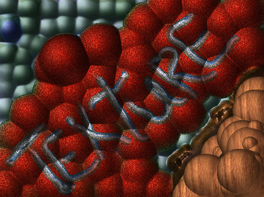

Textures start as pixel data that flows through an OpenGL program, as shown in Figure 11-2.

__Figure 11-2__  Texture data path

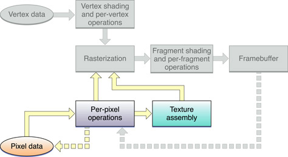

The precise route that texture data takes from your application to its final destination can impact the performance of your application. The purpose of this chapter is to provide techniques you can use to ensure optimal processing of texture data in your application. This chapter

- shows how to use OpenGL extensions to optimize performance
- lists optimal data formats and types
- provides information on working with textures whose dimensions are not a power of two
- describes creating textures from image data
- shows how to download textures
- discusses using double buffers for texture data

Without any optimizations, texture data flows through an OpenGL program as shown in Figure 11-3. Data from your application first goes to the OpenGL framework, which may make a copy of the data before handing it to the driver. If your data is not in a native format for the hardware (see [Optimal Data Formats and Types](#apple-f4xwc4dqnrsv64tfmyxwi33df52wszbpkridimbqgaytsobxfvbuqnbqg4wvgvzsgi)), the driver may also make a copy of the data to convert it to a hardware-specific format for uploading to video memory. Video memory, in turn, can keep a copy of the data. Theoretically, there could be four copies of your texture data throughout the system.

__Figure 11-3__  Data copies in an OpenGL program

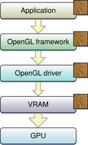

Data flows at different rates through the system, as shown by the size of the arrows in Figure 11-3. The fastest data transfer happens between VRAM and the GPU. The slowest transfer occurs between the OpenGL driver and VRAM. Data moves between the application and the OpenGL framework, and between the framework and the driver at the same "medium" rate. Eliminating any of the data transfers, but the slowest one in particular, will improve application performance.

There are several extensions you can use to eliminate one or more data copies and control how texture data travels from your application to the GPU:

- `GL_ARB_pixel_buffer_object` allows your application to use OpenGL buffer objects to manage texture and image data. As with vertex buffer objects, they allow your application to hint how a buffer is used and to decide when data is copied to OpenGL.
- `GL_APPLE_client_storage` allows you to prevent OpenGL from copying your texture data into the client. Instead, OpenGL keeps the memory pointer you provided when creating the texture. Your application must keep the texture data at that location until the referencing OpenGL texture is deleted.
- `GL_APPLE_texture_range`, along with a storage hint, either `GL_STORAGE_CACHED_APPLE` or `GL_STORAGE_SHARED_APPLE`, allows you to specify a single block of texture memory and manage it as you see fit.
- `GL_ARB_texture_rectangle` provides support for non-power of-two textures.

Here are some recommendations:

- If your application requires optimal texture upload performance, use `GL_APPLE_client_storage` and `GL_APPLE_texture_range` together to manage your textures.
- If your application requires optimal texture download performance, use pixel buffer objects.
- If your application requires cross-platform techniques, use pixel buffer objects for both texture uploads and texture downloads.
- Use `GL_ARB_texture_rectangle` when your source images are not aligned to a power-of-2 size.

The sections that follow describe the extensions and show how to use them.

Pixel buffer objects are a core feature of OpenGL 2.1 and also available through the `GL_ARB_pixel_buffer_object` extension. The procedure for setting up a pixel buffer object is almost identical to that of vertex buffer objects.

1. Call the function `glGenBuffers` to create a new name for a buffer object.

```
void glGenBuffers(sizei n, uint *buffers );
```

   `n` is the number of buffers you wish to create identifiers for.

   `buffers` specifies a pointer to memory to store the buffer names.
2. Call the function `glBindBuffer` to bind an unused name to a buffer object. After this call, the newly created buffer object is initialized with a memory buffer of size zero and a default state. (For the default setting, see the [OpenGL specification for ARB_vertex_buffer_object](http://www.opengl.org/registry/specs/ARB/vertex_buffer_object.txt).)

```
void glBindBuffer(GLenum target, GLuint buffer);
```

   `target` should be be set to `GL_PIXEL_UNPACK_BUFFER` to use the buffer as the source of pixel data.

   `buffer` specifies the unique name for the buffer object.
3. Create and initialize the data store of the buffer object by calling the function `glBufferData`. Essentially, this call uploads your data to the GPU.

```
void glBufferData(GLenum target, sizeiptr size,
            const GLvoid *data, GLenum usage);
```

   `target` must be set to `GL_PIXEL_UNPACK_BUFFER`.

   `size` specifies the size of the data store.

   `*data` points to the source data. If this is not `NULL`, the source data is copied to the data store of the buffer object. If `NULL`, the contents of the data store are undefined.

   `usage` is a constant that provides a hint as to how your application plans to use the data store. For more details on buffer hints, see [Buffer Usage Hints](Best%20Practices%20for%20Working%20with%20Vertex%20Data.md#apple-f4xwc4dqnrsv64tfmyxwi33df52wszbpkridimbqgaytsobxfvbuqnbqgywvgvzz)
4. Whenever you call `glDrawPixels`, `glTexSubImage` or similar functions that read pixel data from the application, those functions use the data in the bound pixel buffer object instead.
5. To update the data in the buffer object, your application calls `glMapBuffer`. Mapping the buffer prevents the GPU from operating on the data, and gives your application a pointer to memory it can use to update the buffer.

```
void *glMapBuffer(GLenum target, GLenum access);
```

   `target` must be set to `PIXEL_UNPACK_BUFFER`.

   `access` indicates the operations you plan to perform on the data. You can supply `READ_ONLY`, `WRITE_ONLY`, or `READ_WRITE`.
6. Modify the texture data using the pointer provided by map buffer.
7. When you have finished modifying the texture, call the function `glUnmapBuffer`. You should supply`PIXEL_UNPACK_BUFFER`. Once the buffer is unmapped, your application can no longer access the buffer’s data through the pointer, and the buffer’s contents are uploaded again to the GPU.

`glReadPixels` normally blocks until previous commands have completed, which includes the slow process of copying the pixel data to the application. However, if you call `glReadPixels` while a pixel buffer object is bound, the function returns immediately. It does not block until you actually map the pixel buffer object to read its content.

1. Call the function `glGenBuffers` to create a new name for a buffer object.

```
void glGenBuffers(sizei n, uint *buffers );
```

   `n` is the number of buffers you wish to create identifiers for.

   `buffers` specifies a pointer to memory to store the buffer names.
2. Call the function `glBindBuffer` to bind an unused name to a buffer object. After this call, the newly created buffer object is initialized with a memory buffer of size zero and a default state. (For the default setting, see the [OpenGL specification for ARB_vertex_buffer_object](http://www.opengl.org/registry/specs/ARB/vertex_buffer_object.txt).)

```
void glBindBuffer(GLenum target, GLuint buffer);
```

   `target` should be be set to `GL_PIXEL_PACK_BUFFER` to use the buffer as the destination for pixel data.

   `buffer` specifies the unique name for the buffer object.
3. Create and initialize the data store of the buffer object by calling the function `glBufferData`.

```
void glBufferData(GLenum target, sizeiptr size,
            const GLvoid *data, GLenum usage);
```

   `target` must be set to `GL_PIXEL_PACK_BUFFER`.

   `size` specifies the size of the data store.

   `*data` points to the source data. If this is not `NULL`, the source data is copied to the data store of the buffer object. If `NULL`, the contents of the data store are undefined.

   `usage` is a constant that provides a hint as to how your application plans to use the data store. For more details on buffer hints, see [Buffer Usage Hints](Best%20Practices%20for%20Working%20with%20Vertex%20Data.md#apple-f4xwc4dqnrsv64tfmyxwi33df52wszbpkridimbqgaytsobxfvbuqnbqgywvgvzz)
4. Call `glReadPixels` or a similar function. The function inserts a command to read the pixel data into the bound pixel buffer object and then returns.
5. To take advantage of asynchronous pixel reads, your application should perform other work.
6. To retrieve the data in the pixel buffer object, your application calls `glMapBuffer`. This blocks OpenGL until the previously queued `glReadPixels` command completes, maps the data, and provides a pointer to your application.

```
void *glMapBuffer(GLenum target, GLenum access);
```

   `target` must be set to `GL_PIXEL_PACK_BUFFER`.

   `access` indicates the operations you plan to perform on the data. You can supply `READ_ONLY`, `WRITE_ONLY`, or `READ_WRITE`.
7. Write vertex data to the pointer provided by map buffer.
8. When you no longer need the vertex data, call the function `glUnmapBuffer`. You should supply `GL_PIXEL_PACK_BUFFER`. Once the buffer is unmapped, the data is no longer accessible to your application.

There is no difference between a vertex buffer object and a pixel buffer object except for the target to which they are bound. An application can take the results in one buffer and use them as another buffer type. For example, you could use the pixel results from a fragment shader and reinterpret them as vertex data in a future pass, without ever leaving the GPU:

1. Set up your first pass and submit your drawing commands.
2. Bind a pixel buffer object and call `glReadPixels` to fetch the intermediate results into a buffer.
3. Bind the same buffer as a vertex buffer.
4. Set up the second pass of your algorithm and submit your drawing commands.

Keeping your intermediate data inside the GPU when performing multiple passes can result in great performance increases.

The Apple client storage extension (`APPLE_client_storage`) lets you provide OpenGL with a pointer to memory that your application allocates and maintains. OpenGL retains a pointer to your data but does not copy the data. Because OpenGL references your data, your application must retain its copy of the data until all referencing textures are deleted. By using this extension you can eliminate the OpenGL framework copy as shown in Figure 11-4. Note that a texture width must be a multiple of 32 bytes for OpenGL to bypass the copy operation from the application to the OpenGL framework.

__Figure 11-4__  The client storage extension eliminates a data copy

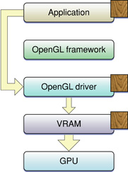

The Apple client storage extension defines a pixel storage parameter, `GL_UNPACK_CLIENT_STORAGE_APPLE`, that you pass to the OpenGL function `glPixelStorei` to specify that your application retains storage for textures. The following code sets up client storage:

```
glPixelStorei(GL_UNPACK_CLIENT_STORAGE_APPLE, GL_TRUE);
```

For detailed information, see the [OpenGL specification for the Apple client storage extension](http://www.opengl.org/registry/specs/APPLE/client_storage.txt).

The Apple texture range extension (`APPLE_texture_range`) lets you define a region of memory used for texture data. Typically you specify an address range that encompasses the storage for a set of textures. This allows the OpenGL driver to optimize memory usage by creating a single memory mapping for all of the textures. You can also provide a hint as to how the data should be stored: cached or shared. The cached hint specifies to cache texture data in video memory. This hint is recommended when you have textures that you plan to use multiple times or that use linear filtering. The shared hint indicates that data should be mapped into a region of memory that enables the GPU to access the texture data directly (via DMA) without the need to copy it. This hint is best when you are using large images only once, perform nearest-neighbor filtering, or need to scale down the size of an image.

The texture range extension defines the following routine for making a single memory mapping for all of the textures used by your application:

```
void glTextureRangeAPPLE(GLenum target, GLsizei length, GLvoid *pointer);
```

`target` is a valid texture target, such as `GL_TEXTURE_2D`.

`length` specifies the number of bytes in the address space referred to by the `pointer` parameter.

`*pointer` points to the address space that your application provides for texture storage.

You provide the hint parameter and a parameter value to to the OpenGL function `glTexParameteri`. The possible values for the storage hint parameter (`GL_TEXTURE_STORAGE_HINT_APPLE`) are `GL_STORAGE_CACHED_APPLE` or `GL_STORAGE_SHARED_APPLE`.

Some hardware requires texture dimensions to be a power-of-two before the hardware can upload the data using DMA. The rectangle texture extension (`ARB_texture_rectangle`) was introduced to allow texture targets for textures of any dimensions—that is, rectangle textures (`GL_TEXTURE_RECTANGLE_ARB`). You need to use the rectangle texture extension together with the Apple texture range extension to ensure OpenGL uses DMA to access your texture data. These extensions allow you to bypass the OpenGL driver, as shown in Figure 11-5.

Note that OpenGL does not use DMA for a power-of-two texture target (`GL_TEXTURE_2D`). So, unlike the rectangular texture, the power-of-two texture will incur one additional copy and performance won't be quite as fast. The performance typically isn't an issue because games, which are the applications most likely to use power-of-two textures, load textures at the start of a game or level and don't upload textures in real time as often as applications that use rectangular textures, which usually play video or display images.

The next section has code examples that use the texture range and rectangle textures together with the Apple client storage extension.

__Figure 11-5__  The texture range extension eliminates a data copy

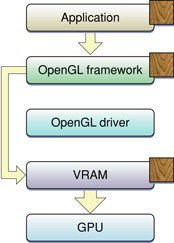

For detailed information on these extensions, see the [OpenGL specification for the Apple texture range extension](http://www.opengl.org/registry/specs/APPLE/texture_range.txt) and the [OpenGL specification for the ARB texture rectangle extension](http://www.opengl.org/registry/specs/ARB/texture_rectangle.txt).

You can use the Apple client storage extension along with the Apple texture range extension to streamline the texture data path in your application. When used together, OpenGL moves texture data directly into video memory, as shown in Figure 11-6. The GPU directly accesses your data (via DMA). The set up is slightly different for rectangular and power-of-two textures. The code examples in this section upload textures to the GPU. You can also use these extensions to download textures, see [Downloading Texture Data](#apple-f4xwc4dqnrsv64tfmyxwi33df52wszbpkridimbqgaytsobxfvbuqnbqg4wvgvzrgm).

__Figure 11-6__  Combining extensions to eliminate data copies

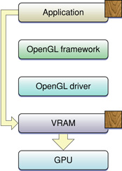

Listing 11-1 shows how to use the extensions for a rectangular texture. After enabling the texture rectangle extension you need to bind the rectangular texture to a target. Next, set up the storage hint. Call `glPixelStorei` to set up the Apple client storage extension. Finally, call the function `glTexImage2D` with a with a rectangular texture target and a pointer to your texture data.

__Listing 11-1__  Using texture extensions for a rectangular texture

```
glEnable (GL_TEXTURE_RECTANGLE_ARB);
glBindTexture(GL_TEXTURE_RECTANGLE_ARB, id);
glTexParameteri(GL_TEXTURE_RECTANGLE_ARB,
        GL_TEXTURE_STORAGE_HINT_APPLE,
        GL_STORAGE_CACHED_APPLE);
glPixelStorei(GL_UNPACK_CLIENT_STORAGE_APPLE, GL_TRUE);
glTexImage2D(GL_TEXTURE_RECTANGLE_ARB,
            0, GL_RGBA, sizex, sizey, 0, GL_BGRA,
            GL_UNSIGNED_INT_8_8_8_8_REV,
            myImagePtr);
```

Setting up a power-of-two texture to use these extensions is similar to what's needed to set up a rectangular texture, as you can see by looking at Listing 11-2. The difference is that the `GL_TEXTURE_2D` texture target replaces the `GL_TEXTURE_RECTANGLE_ARB` texture target.

__Listing 11-2__  Using texture extensions for a power-of-two texture

```
glBindTexture(GL_TEXTURE_2D, myTextureName);

glTexParameteri(GL_TEXTURE_2D,
        GL_TEXTURE_STORAGE_HINT_APPLE,
        GL_STORAGE_CACHED_APPLE);

glPixelStorei(GL_UNPACK_CLIENT_STORAGE_APPLE, GL_TRUE);

glTexImage2D(GL_TEXTURE_2D, 0, GL_RGBA,
            sizex, sizey, 0, GL_BGRA,
            GL_UNSIGNED_INT_8_8_8_8_REV, myImagePtr);
```


The best format and data type combinations to use for texture data are:

- `GL_BGRA`, `GL_UNSIGNED_INT_8_8_8_8_REV`
- `GL_BGRA`, `GL_UNSIGNED_SHORT_1_5_5_5_REV`)
- `GL_YCBCR_422_APPLE`, `GL_UNSIGNED_SHORT_8_8_REV_APPLE`

The combination `GL_RGBA` and `GL_UNSIGNED_BYTE` needs to be swizzled by many cards when the data is loaded, so it's not recommended.

OpenGL is often used to process video and images, which typically have dimensions that are not a power-of-two. Until OpenGL 2.0, the texture rectangle extension (`ARB_texture_rectangle`) provided the only option for a rectangular texture target. This extension, however, imposes the following restrictions on rectangular textures:

- You can't use mipmap filtering with them.
- You can use only these wrap modes: `GL_CLAMP`, `GL_CLAMP_TO_EDGE`, and `GL_CLAMP_TO_BORDER`.
- The texture cannot have a border.
- The texture uses non-normalized texture coordinates. (See Figure 11-7.)

OpenGL 2.0 adds another option for a rectangular texture target through the `ARB_texture_non_power_of_two` extension, which supports these textures without the limitations of the `ARB_texture_rectangle` extension. Before using it, you must check to make sure the functionality is available. You'll also want to consult the [OpenGL specification for the non—power-of-two extension](http://www.opengl.org/registry/specs/ARB/texture_non_power_of_two.txt).

__Figure 11-7__  Normalized and non-normalized coordinates

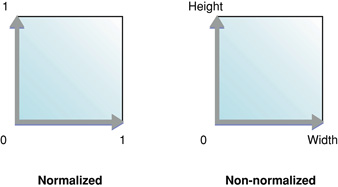

If your code runs on a system that does not support either the `ARB_texture_rectangle` or `ARB_texture_non_power_of_two` extensions you have these options for working with with rectangular images:

- Use the OpenGL function `gluScaleImage` to scale the image so that it fits in a rectangle whose dimensions are a power of two. The image undoes the scaling effect when you draw the image from the properly sized rectangle back into a polygon that has the correct aspect ratio for the image.
- Segment the image into power-of-two rectangles, as shown in Figure 11-8 by using one image buffer and different texture pointers. Notice how the sides and corners of the image shown in Figure 11-8 are segmented into increasingly smaller rectangles to ensure that every rectangle has dimensions that are a power of two. Special care may be needed at the borders between each segment to avoid filtering artifacts if the texture is scaled or rotated.

__Figure 11-8__  An image segmented into power-of-two tiles

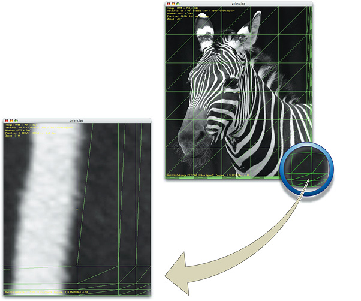

OpenGL on the Macintosh provides several options for creating high-quality textures from image data. OS X supports floating-point pixel values, multiple image file formats, and a variety of color spaces. You can import a floating-point image into a floating-point texture. Figure 11-9 shows an image used to texture a cube.

__Figure 11-9__  Using an image as a texture for a cube

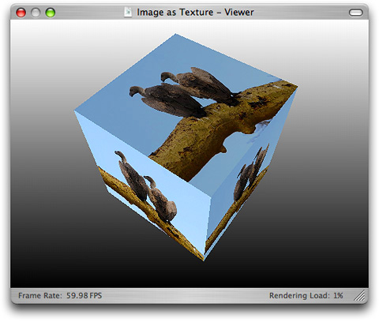

For Cocoa, you need to provide a bitmap representation. You can create an `NSBitmapImageRep` object from the contents of an `NSView` object. You can use the Image I/O framework (see _[CGImageSource Reference](https://developer.apple.com/documentation/imageio/cgimagesource-r84)_). This framework has support for many different file formats, floating-point data, and a variety of color spaces. Furthermore, it is easy to use. You can import image data as a texture simply by supplying a `CFURL` object that specifies the location of the texture. There is no need for you to convert the image to an intermediate integer RGB format.

You can use the `NSView` class or a subclass of it for texturing in OpenGL. The process is to first store the image data from an `NSView` object in an `NSBitmapImageRep` object so that the image data is in a format that can be readily used as texture data by OpenGL. Then, after setting up the texture target, you supply the bitmap data to the OpenGL function `glTexImage2D`. Note that you must have a valid, current OpenGL context set up.

Listing 11-3 shows a routine that uses this process to create a texture from the contents of an `NSView` object. A detailed explanation for each numbered line of code appears following the listing.

__Listing 11-3__  Building an OpenGL texture from an `NSView` object

```objc
-(void)myTextureFromView:(NSView*)theView
                textureName:(GLuint*)texName
{
    NSBitmapImageRep * bitmap =  [theView bitmapImageRepForCachingDisplayInRect:
            [theView visibleRect]]; // 1
    int samplesPerPixel = 0;

    [theView cacheDisplayInRect:[theView visibleRect] toBitmapImageRep:bitmap]; // 2
    samplesPerPixel = [bitmap samplesPerPixel]; // 3
    glPixelStorei(GL_UNPACK_ROW_LENGTH, [bitmap bytesPerRow]/samplesPerPixel); // 4
    glPixelStorei (GL_UNPACK_ALIGNMENT, 1); // 5
    if (*texName == 0) // 6
            glGenTextures (1, texName);
    glBindTexture (GL_TEXTURE_RECTANGLE_ARB, *texName); // 7
    glTexParameteri(GL_TEXTURE_RECTANGLE_ARB,
                    GL_TEXTURE_MIN_FILTER, GL_LINEAR); // 8

   if(![bitmap isPlanar] &&
       (samplesPerPixel == 3 || samplesPerPixel == 4)) { // 9
        glTexImage2D(GL_TEXTURE_RECTANGLE_ARB,
                     0,
                     samplesPerPixel == 4 ? GL_RGBA8 : GL_RGB8,
                     [bitmap pixelsWide],
                     [bitmap pixelsHigh],
                     0,
                     samplesPerPixel == 4 ? GL_RGBA : GL_RGB,
                     GL_UNSIGNED_BYTE,
                    [bitmap bitmapData]);
    } else {
       // Your code to report unsupported bitmap data
    }
}
```

Here's what the code does:

1. Allocates an `NSBitmapImageRep` object.
2. Initializes the `NSBitmapImageRep` object with bitmap data from the current view.
3. Gets the number of samples per pixel.
4. Sets the appropriate unpacking row length for the bitmap.
5. Sets the byte-aligned unpacking that's needed for bitmaps that are 3 bytes per pixel.
6. If a texture object is not passed in, generates a new texture object.
7. Binds the texture name to the texture target.
8. Sets filtering so that it does not use a mipmap, which would be redundant for the texture rectangle extension.
9. Checks to see if the bitmap is nonplanar and is either a 24-bit RGB bitmap or a 32-bit RGBA bitmap. If so, retrieves the pixel data using the `bitmapData` method, passing it along with other appropriate parameters to the OpenGL function for specifying a 2D texture image.

Quartz images (`CGImageRef` data type) are defined in the Core Graphics framework (`ApplicationServices/CoreGraphics.framework/CGImage.h`) while the image source data type for reading image data and creating Quartz images from an image source is declared in the Image I/O framework (`ApplicationServices/ImageIO.framework/CGImageSource.h`). Quartz provides routines that read a wide variety of image data.

To use a Quartz image as a texture source, follow these steps:

1. Create a Quartz image source by supplying a `CFURL` object to the function [CGImageSourceCreateWithURL](https://developer.apple.com/documentation/imageio/1465262-cgimagesourcecreatewithurl).
2. Create a Quartz image by extracting an image from the image source, using the function [CGImageSourceCreateImageAtIndex](https://developer.apple.com/documentation/imageio/1465011-cgimagesourcecreateimageatindex).
3. Extract the image dimensions using the function [CGImageGetWidth](https://developer.apple.com/documentation/coregraphics/cgimage/1456148-width) and [CGImageGetHeight](https://developer.apple.com/documentation/coregraphics/1455829-cgimagegetheight). You'll need these to calculate the storage required for the texture.
4. Allocate storage for the texture.
5. Create a color space for the image data.
6. Create a Quartz bitmap graphics context for drawing. Make sure to set up the context for pre-multiplied alpha.
7. Draw the image to the bitmap context.
8. Release the bitmap context.
9. Set the pixel storage mode by calling the function `glPixelStorei`.
10. Create and bind the texture.
11. Set up the appropriate texture parameters.
12. Call `glTexImage2D`, supplying the image data.
13. Free the image data.

Listing 11-4 shows a code fragment that performs these steps. Note that you must have a valid, current OpenGL context.

__Listing 11-4__  Using a Quartz image as a texture source

```
CGImageSourceRef myImageSourceRef = CGImageSourceCreateWithURL(url, NULL);
CGImageRef myImageRef = CGImageSourceCreateImageAtIndex (myImageSourceRef, 0, NULL);
GLint myTextureName;
size_t width = CGImageGetWidth(myImageRef);
size_t height = CGImageGetHeight(myImageRef);
CGRect rect = {{0, 0}, {width, height}};
void * myData = calloc(width * 4, height);
CGColorSpaceRef space = CGColorSpaceCreateDeviceRGB();
CGContextRef myBitmapContext = CGBitmapContextCreate (myData,
                        width, height, 8,
                        width*4, space,
                        kCGBitmapByteOrder32Host |
                          kCGImageAlphaPremultipliedFirst);
CGContextSetBlendMode(myBitmapContext, kCGBlendModeCopy);
CGContextDrawImage(myBitmapContext, rect, myImageRef);
CGContextRelease(myBitmapContext);
glPixelStorei(GL_UNPACK_ROW_LENGTH, width);
glPixelStorei(GL_UNPACK_ALIGNMENT, 1);
glGenTextures(1, &myTextureName);
glBindTexture(GL_TEXTURE_RECTANGLE_ARB, myTextureName);
glTexParameteri(GL_TEXTURE_RECTANGLE_ARB,
                    GL_TEXTURE_MIN_FILTER, GL_LINEAR);
glTexImage2D(GL_TEXTURE_RECTANGLE_ARB, 0, GL_RGBA8, width, height,
                    0, GL_BGRA_EXT, GL_UNSIGNED_INT_8_8_8_8_REV, myData);
free(myData);
```

For more information on using Quartz, see _[Quartz 2D Programming Guide](../Quartz%202D%20Programming%20Guide/Introduction.md#apple-f4xwc4dqnrsv64tfmyxwi33df52wszbpkridgmbqgaytanrw)_, _[CGImage Reference](https://developer.apple.com/documentation/coregraphics/cgimage)_, and _[CGImageSource Reference](https://developer.apple.com/documentation/imageio/cgimagesource-r84)_.

You can use the Image I/O framework together with a Quartz data provider to obtain decompressed raw pixel data from a source image, as shown in Listing 11-5. You can then use the pixel data for your OpenGL texture. The data has the same format as the source image, so you need to make sure that you use a source image that has the layout you need.

Alpha is not premultiplied for the pixel data obtained in Listing 11-5, but alpha is premultiplied for the pixel data you get when using the code described in [Creating a Texture from a Cocoa View](#apple-f4xwc4dqnrsv64tfmyxwi33df52wszbpkridimbqgaytsobxfvbuqnbqg4wvgvzshe) and [Creating a Texture from a Quartz Image Source](#apple-f4xwc4dqnrsv64tfmyxwi33df52wszbpkridimbqgaytsobxfvbuqnbqg4wvgvztge).

__Listing 11-5__  Getting pixel data from a source image

```
CGImageSourceRef myImageSourceRef = CGImageSourceCreateWithURL(url, NULL);
CGImageRef myImageRef = CGImageSourceCreateImageAtIndex (myImageSourceRef, 0, NULL);
CFDataRef data = CGDataProviderCopyData(CGImageGetDataProvider(myImageRef));
void *pixelData = CFDataGetBytePtr(data);
```


A texture download operation uses the same data path as an upload operation except that the data path is reversed. Downloading transfers texture data, using direct memory access (DMA), from VRAM into a texture that can then be accessed directly by your application. You can use the Apple client range, texture range, and texture rectangle extensions for downloading, just as you would for uploading.

To download texture data using the Apple client storage, texture range, and texture rectangle extensions:

- Bind a texture name to a texture target.
- Set up the extensions
- Call the function `glCopyTexSubImage2D` to copy a texture subimage from the specified window coordinates. This call initiates an asynchronous DMA transfer to system memory the next time you call a flush routine. The CPU doesn't wait for this call to complete.
- Call the function `glGetTexImage` to transfer the texture into system memory. Note that the parameters must match the ones that you used to set up the texture when you called the function `glTexImage2D`. This call is the synchronization point; it waits until the transfer is finished.

Listing 11-6 shows a code fragment that downloads a rectangular texture that uses cached memory. Your application processes data between the `glCopyTexSubImage2D` and `glGetTexImage` calls. How much processing? Enough so that your application does not need to wait for the GPU.

__Listing 11-6__  Code that downloads texture data

```
glBindTexture(GL_TEXTURE_RECTANGLE_ARB, myTextureName);
glTexParameteri(GL_TEXTURE_RECTANGLE_ARB, GL_TEXTURE_STORAGE_HINT_APPLE,
                GL_STORAGE_SHARED_APPLE);
glPixelStorei(GL_UNPACK_CLIENT_STORAGE_APPLE, GL_TRUE);
glTexImage2D(GL_TEXTURE_RECTANGLE_ARB, 0, GL_RGBA,
                sizex, sizey, 0, GL_BGRA,
                GL_UNSIGNED_INT_8_8_8_8_REV, myImagePtr);

glCopyTexSubImage2D(GL_TEXTURE_RECTANGLE_ARB,
                0, 0, 0, 0, 0, image_width, image_height);
glFlush();
// Do other work processing here, using a double or triple buffer

glGetTexImage(GL_TEXTURE_RECTANGLE_ARB, 0, GL_BGRA,
                GL_UNSIGNED_INT_8_8_8_8_REV, pixels);
```


When you use any technique that allows the GPU to access your texture data directly, such as the texture range extension, it's possible for the GPU and CPU to access the data at the same time. To avoid such a collision, you must synchronize the GPU and the CPU. The simplest way is shown in Figure 11-10. Your application works on the data, flushes it to the GPU and waits until the GPU is finished before working on the data again.

One technique for ensuring that the GPU is finished executing commands before your application sends more data is to insert a token into the command stream and use that to determine when the CPU can touch the data again, as described in [Use Fences for Finer-Grained Synchronization](OpenGL%20Application%20Design%20Strategies.md#apple-f4xwc4dqnrsv64tfmyxwi33df52wszbpkridimbqgaytsobxfvbuqmrnknlts). Figure 11-10 uses the fence extension command `glFinishObject` to synchronize buffer updates for a stream of single-buffered texture data. Notice that when the CPU is processing texture data, the GPU is idle. Similarly, when the GPU is processing texture data, the CPU is idle. It's much more efficient for the GPU and CPU to work asynchronously than to work synchronously. Double buffering data is a technique that allows you to process data asynchronously, as shown in [Figure 11-11](#apple-f4xwc4dqnrsv64tfmyxwi33df52wszbpkridimbqgaytsobxfvbuqnbqg4wvgvzsga).

__Figure 11-10__  Single-buffered data

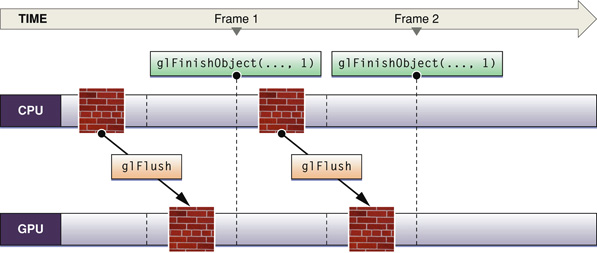

To double buffer data, you must supply two sets of data to work on. Note in Figure 11-11 that while the GPU is rendering one frame of data, the CPU processes the next. After the initial startup, neither processing unit is idle. Using the `glFinishObject` function provided by the fence extension ensures that buffer updating is synchronized.

__Figure 11-11__  Double-buffered data

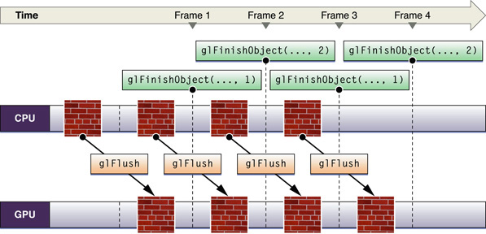

[Next](Customizing%20the%20OpenGL%20Pipeline%20with%20Shaders.md)[Previous](Best%20Practices%20for%20Working%20with%20Vertex%20Data.md)

