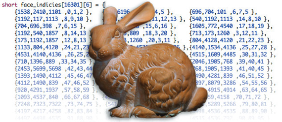
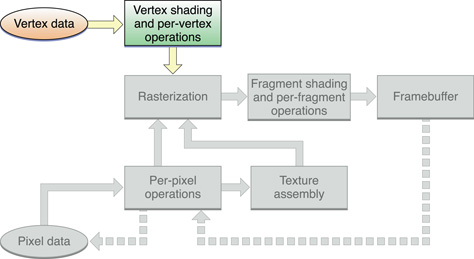
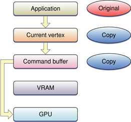

> 导航：[总目录](../../../README.md) · [documentation](../../../_indexes/documentation.md) · [OpenGL Programming Guide for Mac](About%20OpenGL%20for%20OS%20X.md)


[Next](Best%20Practices%20for%20Working%20with%20Texture%20Data.md)[Previous](OpenGL%20Application%20Design%20Strategies.md)

# Best Practices for Working with Vertex Data

Complex shapes and detailed 3D models require large amounts of vertex data to describe them in OpenGL. Moving vertex data from your application to the graphics hardware incurs a performance cost that can be quite large depending on the size of the data set.

__Figure 10-1__  Vertex data sets can be quite large



Applications that use large vertex data sets can adopt one or more of the strategies described in [OpenGL Application Design Strategies](OpenGL%20Application%20Design%20Strategies.md#apple-f4xwc4dqnrsv64tfmyxwi33df52wszbpkridimbqgaytsobxfvbuqmrnknltm) to optimize how vertex data is delivered to OpenGL.This chapter expands on those best practices with specific techniques for working with vertex data.

Understanding how vertex data flows through OpenGL is important to choosing strategies for handling the data. Vertex data enters into the vertex stage, where it is processed by either the built-in fixed function vertex stage or a custom vertex.

__Figure 10-2__  Vertex data path



Figure 10-3 takes a closer look at the vertex data path when using immediate mode. Without any optimizations, your vertex data may be copied at various points in the data path. If your application uses immediate mode to each vertex separately, calls to OpenGL first modify the current vertex, which is copied into the command buffer whenever your application makes a `glVertex*` call. This is not only expensive in terms of copy operations, but also in function overhead to specify each vertex.

__Figure 10-3__  Immediate mode requires a copy of the current vertex data



The OpenGL commands `glDrawRangeElements`, `glDrawElements`, and `glDrawArrays` render multiple geometric primitives from array data, using very few subroutine calls. Listing 10-1 shows a typical implementation. Your application creates a vertex structure that holds all the elements for each vertex. For each element , you enable a client array and provide a pointer and offset to OpenGL so that it knows how to find those elements.

__Listing 10-1__  Submitting vertex data using `glDrawElements`.

```
typedef struct _vertexStruct
{
    GLfloat position[2];
    GLubyte color[4];
} vertexStruct;

void DrawGeometry()
{
    const vertexStruct vertices[] = {...};
    const GLubyte indices[] = {...};

    glEnableClientState(GL_VERTEX_ARRAY);
    glVertexPointer(2, GL_FLOAT, sizeof(vertexStruct), &vertices[0].position);
    glEnableClientState(GL_COLOR_ARRAY);
    glColorPointer(4, GL_UNSIGNED_BYTE, sizeof(vertexStruct), &vertices[0].color);

    glDrawElements(GL_TRIANGLE_STRIP, sizeof(indices)/sizeof(GLubyte), GL_UNSIGNED_BYTE, indices);
}
```

Each time you call `glDrawElements`, OpenGL must copy all of the vertex data into the command buffer, which is later copied to the hardware. The copy overhead is still expensive.

Avoiding unnecessary copies of your vertex data is critical to application performance. This section summarizes common techniques for managing your vertex data using either built-in functionality or OpenGL extensions. Before using these techniques, you must ensure that the necessary functions are available to your application. See [Detecting Functionality](Determining%20the%20OpenGL%20Capabilities%20Supported%20by%20the%20Renderer.md#apple-f4xwc4dqnrsv64tfmyxwi33df52wszbpkridimbqgaytsobxfvbuqmrrgewvgvzr).

- Avoid the use of `glBegin` and `glEnd` to specify your vertex data. The function and copying overhead makes this path useful only for very small data sets. Also, applications written with `glBegin` and `glEnd` are not portable to OpenGL ES on iOS.
- Minimize data type conversions by supplying OpenGL data types for vertex data. Use `GLfloat`, `GLshort`, or `GLubyte` data types because most graphics processors handle these types natively. If you use some other type, then OpenGL may need to perform a costly data conversion.
- The preferred way to manage your vertex data is with vertex buffer objects. Vertex buffer objects are buffers owned by OpenGL that hold your vertex information. These buffers allow OpenGL to place your vertex data into memory that is accessible to the graphics hardware. See [Vertex Buffers](#apple-f4xwc4dqnrsv64tfmyxwi33df52wszbpkridimbqgaytsobxfvbuqnbqgywvgvzr) for more information.
- If vertex buffer objects are not available, your application can search for the `GL_APPLE_vertex_array_range` and `APPLE_fence` extensions. Vertex array ranges allow you to prevent OpenGL from copying your vertex data into the command buffer. Instead, your application must avoid modifying or deleting the vertex data until OpenGL finishes executing drawing commands. This solution requires more effort from the application, and is not compatible with other platforms, including iOS. See [Vertex Array Range Extension](#apple-f4xwc4dqnrsv64tfmyxwi33df52wszbpkridimbqgaytsobxfvbuqnbqgywvgvzrg4) for more information.
- Complex vertex operations require many array pointers to be enabled and set before you call `glDrawElements`. The `GL_APPLE_vertex_array_object` extension allows your application to consolidate a group of array pointers into a single object. Your application switches multiple pointers by binding a single vertex array object, reducing the overhead of changing state. See [Vertex Array Object](#apple-f4xwc4dqnrsv64tfmyxwi33df52wszbpkridimbqgaytsobxfvbuqnbqgywvgvzy).
- Use double buffering to reduce resource contention between your application and OpenGL. See [Use Double Buffering to Avoid Resource Conflicts](OpenGL%20Application%20Design%20Strategies.md#apple-f4xwc4dqnrsv64tfmyxwi33df52wszbpkridimbqgaytsobxfvbuqmrnknltq).
- If you need to compute new vertex information between frames, consider using vertex shaders and buffer objects to perform and store the calculations.

Vertex buffers are available as a core feature starting in OpenGL 1.5, and on earlier versions of OpenGL through the vertex buffer object extension (`GL_ARB_vertex_buffer_object`). Vertex buffers are used to improve the throughput of static or dynamic vertex data in your application.

A buffer object is a chunk of memory owned by OpenGL. Your application reads from or writes to the buffer using OpenGL calls such as `glBufferData`, `glBufferSubData`, and `glGetBufferSubData`. Your application can also gain a pointer to this memory, an operation referred to as _mapping a buffer_. OpenGL prevents your application and itself from simultaneously using the data stored in the buffer. When your application maps a buffer or attempts to modify it, OpenGL may block until previous drawing commands have completed.

You can set up and use vertex buffers by following these steps:

1. Call the function `glGenBuffers` to create a new name for a buffer object.

```
void glGenBuffers(sizei n, uint *buffers );
```

   `n` is the number of buffers you wish to create identifiers for.

   `buffers` specifies a pointer to memory to store the buffer names.
2. Call the function `glBindBuffer` to bind an unused name to a buffer object. After this call, the newly created buffer object is initialized with a memory buffer of size zero and a default state. (For the default setting, see the [OpenGL specification for ARB_vertex_buffer_object](http://www.opengl.org/registry/specs/ARB/vertex_buffer_object.txt).)

```
void glBindBuffer(GLenum target, GLuint buffer);
```

   `target` must be set to `GL_ARRAY_BUFFER`.

   `buffer` specifies the unique name for the buffer object.
3. Fill the buffer object by calling the function `glBufferData`. Essentially, this call uploads your data to the GPU.

```
void glBufferData(GLenum target, sizeiptr size,
            const GLvoid *data, GLenum usage);
```

   `target` must be set to `GL_ARRAY_BUFFER`.

   `size` specifies the size of the data store.

   `*data` points to the source data. If this is not `NULL`, the source data is copied to the data stored of the buffer object. If `NULL`, the contents of the data store are undefined.

   `usage` is a constant that provides a hint as to how your application plans to use the data stored in the buffer object. These examples use `GL_STREAM_DRAW`, which indicates that the application plans to both modify and draw using the buffer, and `GL_STATIC_DRAW`, which indicates that the application will define the data once but use it to draw many times. For more details on buffer hints, see [Buffer Usage Hints](#apple-f4xwc4dqnrsv64tfmyxwi33df52wszbpkridimbqgaytsobxfvbuqnbqgywvgvzz)
4. Enable the vertex array by calling `glEnableClientState` and supplying the `GL_VERTEX_ARRAY` constant.
5. Point to the contents of the vertex buffer object by calling a function such as `glVertexPointer`. Instead of providing a pointer, you provide an offset into the vertex buffer object.
6. To update the data in the buffer object, your application calls `glMapBuffer`. Mapping the buffer prevents the GPU from operating on the data, and gives your application a pointer to memory it can use to update the buffer.

```
void *glMapBuffer(GLenum target, GLenum access);
```

   `target` must be set to `GL_ARRAY_BUFFER`.

   `access` indicates the operations you plan to perform on the data. You can supply `READ_ONLY`, `WRITE_ONLY`, or `READ_WRITE`.
7. Write pixel data to the pointer received from the call to `glMapBuffer`.
8. When your application has finished modifying the buffer contents, call the function `glUnmapBuffer`. You must supply `GL_ARRAY_BUFFER` as the parameter to this function. Once the buffer is unmapped, the pointer is no longer valid, and the buffer’s contents are uploaded again to the GPU.

Listing 10-2 shows code that uses the vertex buffer object extension for dynamic data. This example overwrites all of the vertex data during every draw operation.

__Listing 10-2__  Using the vertex buffer object extension with dynamic data

```
//  To set up the vertex buffer object extension
#define BUFFER_OFFSET(i) ((char*)NULL + (i))
glBindBuffer(GL_ARRAY_BUFFER, myBufferName);

glEnableClientState(GL_VERTEX_ARRAY);
glVertexPointer(3, GL_FLOAT, stride, BUFFER_OFFSET(0));

//  When you want to draw using the vertex data
draw_loop {
    glBufferData(GL_ARRAY_BUFFER, bufferSize, NULL, GL_STREAM_DRAW);
    my_vertex_pointer = glMapBuffer(GL_ARRAY_BUFFER, GL_WRITE_ONLY);
    GenerateMyDynamicVertexData(my_vertex_pointer);
    glUnmapBuffer(GL_ARRAY_BUFFER);
    PerformDrawing();
}
```

Listing 10-3 shows code that uses the vertex buffer object extension with static data.

__Listing 10-3__   Using the vertex buffer object extension with static data

```
//  To set up the vertex buffer object extension
#define BUFFER_OFFSET(i) ((char*)NULL + (i))
glBindBuffer(GL_ARRAY_BUFFER, myBufferName);
glBufferData(GL_ARRAY_BUFFER, bufferSize, NULL, GL_STATIC_DRAW);
GLvoid* my_vertex_pointer = glMapBuffer(GL_ARRAY_BUFFER, GL_WRITE_ONLY);
GenerateMyStaticVertexData(my_vertex_pointer);
glUnmapBuffer(GL_ARRAY_BUFFER);

glEnableClientState(GL_VERTEX_ARRAY);
glVertexPointer(3, GL_FLOAT, stride, BUFFER_OFFSET(0));

//  When you want to draw using the vertex data
draw_loop {
    PerformDrawing();
}
```


A key advantage of buffer objects is that the application can provide information on how it uses the data stored in each buffer. For example, Listing 10-2 and Listing 10-3 differentiated between cases where the data were expected to never change (`GL_STATIC_DRAW`) and cases where the buffer data might change (`GL_DYNAMIC_DRAW`). The usage parameter allows an OpenGL renderer to alter its strategy for allocating the vertex buffer to improve performance. For example, static buffers may be allocated directly in GPU memory, while dynamic buffers may be stored in main memory and retrieved by the GPU via DMA.

If OpenGL ES compatibility is useful to you, you should limit your usage hints to one of three usage cases:

- `GL_STATIC_DRAW` should be used for vertex data that is specified once and never changed. Your application should create these vertex buffers during initialization and use them repeatedly until your application shuts down.
- `GL_DYNAMIC_DRAW` should be used when the buffer is expected to change after it is created. Your application should still allocate these buffers during initialization and periodically update them by mapping the buffer.
- `GL_STREAM_DRAW` is used when your application needs to create transient geometry that is rendered and then discarded. This is most useful when your application must dynamically change vertex data every frame in a way that cannot be performed in a vertex shader. To use a stream vertex buffer, your application initially fills the buffer using `glBufferData`, then alternates between drawing using the buffer and modifying the buffer.

Other usage constants are detailed in the vertex buffer specification.

If different elements in your vertex format have different usage characteristics, you may want to split the elements into one structure for each usage pattern and allocate a vertex buffer for each. Listing 10-4 shows how to implement this. In this example, position data is expected to be the same in each frame, while color data may be animated in every frame.

__Listing 10-4__  Geometry with different usage patterns

```
typedef struct _vertexStatic
{
    GLfloat position[2];
} vertexStatic;

typedef struct _vertexDynamic
{
    GLubyte color[4];
} vertexDynamic;

// Separate buffers for static and dynamic data.
GLuint    staticBuffer;
GLuint    dynamicBuffer;
GLuint    indexBuffer;

const vertexStatic staticVertexData[] = {...};
vertexDynamic dynamicVertexData[] = {...};
const GLubyte indices[] = {...};

void CreateBuffers()
{
    glGenBuffers(1, &staticBuffer);
    glGenBuffers(1, &dynamicBuffer);
    glGenBuffers(1, &indexBuffer);

// Static position data
    glBindBuffer(GL_ARRAY_BUFFER, staticBuffer);
    glBufferData(GL_ARRAY_BUFFER, sizeof(staticVertexData), staticVertexData, GL_STATIC_DRAW);

    glBindBuffer(GL_ELEMENT_ARRAY_BUFFER, indexBuffer);
    glBufferData(GL_ELEMENT_ARRAY_BUFFER, sizeof(indices), indices, GL_STATIC_DRAW);

// Dynamic color data
// While not shown here, the expectation is that the data in this buffer changes between frames.
    glBindBuffer(GL_ARRAY_BUFFER, dynamicBuffer);
    glBufferData(GL_ARRAY_BUFFER, sizeof(dynamicVertexData), dynamicVertexData, GL_DYNAMIC_DRAW);
}

void DrawUsingVertexBuffers()
{
    glBindBuffer(GL_ARRAY_BUFFER, staticBuffer);
    glEnableClientState(GL_VERTEX_ARRAY);
    glVertexPointer(2, GL_FLOAT, sizeof(vertexStatic), (void*)offsetof(vertexStatic,position));
    glBindBuffer(GL_ARRAY_BUFFER, dynamicBuffer);
    glEnableClientState(GL_COLOR_ARRAY);
    glColorPointer(4, GL_UNSIGNED_BYTE, sizeof(vertexDynamic), (void*)offsetof(vertexDynamic,color));
    glBindBuffer(GL_ELEMENT_ARRAY_BUFFER, indexBuffer);
    glDrawElements(GL_TRIANGLE_STRIP, sizeof(indices)/sizeof(GLubyte), GL_UNSIGNED_BYTE, (void*)0);
}
```


When your application unmaps a vertex buffer, the OpenGL implementation may copy the full contents of the buffer to the graphics hardware. If your application changes only a subset of a large buffer, this is inefficient. The `APPLE_flush_buffer_range` extension allows your application to tell OpenGL exactly which portions of the buffer were modified, allowing it to send only the changed data to the graphics hardware.

To use the flush buffer range extension, follow these steps:

1. Turn on the flush buffer extension by calling `glBufferParameteriAPPLE`.

```
glBufferParameteriAPPLE(GL_ARRAY_BUFFER,GL_BUFFER_FLUSHING_UNMAP_APPLE, GL_FALSE);
```

   This disables the normal flushing behavior of OpenGL.
2. Before you unmap a buffer, you must call `glFlushMappedBufferRangeAPPLE` for each range of the buffer that was modified by the application.

```
void glFlushMappedBufferRangeAPPLE(enum target, intptr offset, sizeiptr size);
```

   `target` is the type of buffer being modified; for vertex data it’s `ARRAY_BUFFER`.

   `offset` is the offset into the buffer for the modified data.

   `size` is the length of the modified data in bytes.
3. Call `glUnmapBuffer`. OpenGL unmaps the buffer, but it is required to update only the portions of the buffer your application explicitly marked as changed.

For more information see the [APPLE_flush_buffer_range](http://www.opengl.org/registry/specs/APPLE/flush_buffer_range.txt) specification.

The vertex array range extension (`APPLE_vertex_array_range`) lets you define a region of memory for your vertex data. The OpenGL driver can optimize memory usage by creating a single memory mapping for your vertex data. You can also provide a hint as to how the data should be stored: cached or shared. The cached option specifies to cache vertex data in video memory. The shared option indicates that data should be mapped into a region of memory that allows the GPU to access the vertex data directly using DMA transfer. This option is best for dynamic data. If you use shared memory, you'll need to double buffer your data.

You can set up and use the vertex array range extension by following these steps:

1. Enable the extension by calling `glEnableClientState` and supplying the `GL_VERTEX_ARRAY_RANGE_APPLE` constant.
2. Allocate storage for the vertex data. You are responsible for maintaining storage for the data.
3. Define an array of vertex data by calling a function such as `glVertexPointer`. You need to supply a pointer to your data.
4. Optionally set up a hint about handling the storage of the array data by calling the function `glVertexArrayParameteriAPPLE`.

```
GLvoid glVertexArrayParameteriAPPLE(GLenum pname, GLint param);
```

   `pname` must be `VERTEX_ARRAY_STORAGE_HINT_APPLE`.

   `param` is a hint that specifies how your application expects to use the data. OpenGL uses this hint to optimize performance. You can supply either `STORAGE_SHARED_APPLE` or `STORAGE_CACHED_APPLE`. The default value is `STORAGE_SHARED_APPLE`, which indicates that the vertex data is dynamic and that OpenGL should use optimization and flushing techniques suitable for this kind of data. If you expect the supplied data to be static, use `STORAGE_CACHED_APPLE` so that OpenGL can optimize appropriately.
5. Call the OpenGL function `glVertexArrayRangeAPPLE` to establish the data set.

```
void glVertexArrayRangeAPPLE(GLsizei length, GLvoid *pointer);
```

   `length` specifies the length of the vertex array range. The length is typically the number of unsigned bytes.

   `*pointer` points to the base of the vertex array range.
6. Draw with the vertex data using standard OpenGL vertex array commands.
7. If you need to modify the vertex data, set a fence object after you’ve submitted all the drawing commands. See [Use Fences for Finer-Grained Synchronization](OpenGL%20Application%20Design%20Strategies.md#apple-f4xwc4dqnrsv64tfmyxwi33df52wszbpkridimbqgaytsobxfvbuqmrnknlts)
8. Perform other work so that the GPU has time to process the drawing commands that use the vertex array.
9. Call `glFinishFenceAPPLE` to gain access to the vertex array.
10. Modify the data in the vertex array.
11. Call `glFlushVertexArrayRangeAPPLE`.

```
void glFlushVertexArrayRangeAPPLE(GLsizei length, GLvoid *pointer);
```

    `length` specifies the length of the vertex array range, in bytes.

    `*pointer` points to the base of the vertex array range.

    For dynamic data, each time you change the data, you need to maintain synchronicity by calling `glFlushVertexArrayRangeAPPLE`. You supply as parameters an array size and a pointer to an array, which can be a subset of the data, as long as it includes all of the data that changed. Contrary to the name of the function, `glFlushVertexArrayRangeAPPLE` doesn't actually flush data like the OpenGL function `glFlush` does. It simply makes OpenGL aware that the data has changed.

Listing 10-5 shows code that sets up and uses the vertex array range extension with dynamic data. It overwrites all of the vertex data during each iteration through the drawing loop. The call to the `glFinishFenceAPPLE` command guarantees that the CPU and the GPU don't access the data at the same time. Although this example calls the `glFinishFenceAPPLE` function almost immediately after setting the fence, in reality you need to separate these calls to allow parallel operation of the GPU and CPU. To see how that's done, read [Use Double Buffering to Avoid Resource Conflicts](OpenGL%20Application%20Design%20Strategies.md#apple-f4xwc4dqnrsv64tfmyxwi33df52wszbpkridimbqgaytsobxfvbuqmrnknltq).

__Listing 10-5__  Using the vertex array range extension with dynamic data

```
//  To set up the vertex array range extension
glVertexArrayParameteriAPPLE(GL_VERTEX_ARRAY_STORAGE_HINT_APPLE, GL_STORAGE_SHARED_APPLE);
glVertexArrayRangeAPPLE(buffer_size, my_vertex_pointer);
glEnableClientState(GL_VERTEX_ARRAY_RANGE_APPLE);

glEnableClientState(GL_VERTEX_ARRAY);
glVertexPointer(3, GL_FLOAT, 0, my_vertex_pointer);
glSetFenceAPPLE(my_fence);

//  When you want to draw using the vertex data
draw_loop {
    glFinishFenceAPPLE(my_fence);
    GenerateMyDynamicVertexData(my_vertex_pointer);
    glFlushVertexArrayRangeAPPLE(buffer_size, my_vertex_pointer);
    PerformDrawing();
    glSetFenceAPPLE(my_fence);
}
```

Listing 10-6 shows code that uses the vertex array range extension with static data. Unlike the setup for dynamic data, the setup for static data includes using the hint for cached data. Because the data is static, it's unnecessary to set a fence.

__Listing 10-6__  Using the vertex array range extension with static data

```
//  To set up the vertex array range extension
GenerateMyStaticVertexData(my_vertex_pointer);
glVertexArrayParameteriAPPLE(GL_VERTEX_ARRAY_STORAGE_HINT_APPLE, GL_STORAGE_CACHED_APPLE);
glVertexArrayRangeAPPLE(array_size, my_vertex_pointer);
glEnableClientState(GL_VERTEX_ARRAY_RANGE_APPLE);

glEnableClientState(GL_VERTEX_ARRAY);
glVertexPointer(3, GL_FLOAT, stride, my_vertex_pointer);

//  When you want to draw using the vertex data
draw_loop {
    PerformDrawing();
}
```

For detailed information on this extension, see the [OpenGL specification for the vertex array range extension](http://www.opengl.org/registry/specs/APPLE/vertex_array_range.txt).

Look at the `DrawUsingVertexBuffers` function in [Listing 10-4](#apple-f4xwc4dqnrsv64tfmyxwi33df52wszbpkridimbqgaytsobxfvbuqnbqgywvgvzrga). It configures buffer pointers for position, color, and indexing before calling `glDrawElements`. A more complex vertex structure may require additional buffer pointers to be enabled and changed before you can finally draw your geometry. If your application swaps frequently between multiple configurations of elements, changing these parameters adds significant overhead to your application. The `APPLE_vertex_array_object` extension allows you to combine a collection of buffer pointers into a single OpenGL object, allowing you to change all the buffer pointers by binding a different vertex array object.

To use this extension, follow these steps during your application’s initialization routines:

1. Generate a vertex array object for a configuration of pointers you wish to use together.

```
void glGenVertexArraysAPPLE(sizei n, const uint *arrays);
```

   `n` is the number of arrays you wish to create identifiers for.

   `arrays` specifies a pointer to memory to store the array names.

```
glGenVertexArraysAPPLE(1,&myArrayObject);
```
2. Bind the vertex array object you want to configure.

```
void glBindVertexArrayAPPLE(uint array);
```

   `array` is the identifier for an array that you received from `glGenVertexArraysAPPLE`.

```
glBindVertexArrayAPPLE(myArrayObject);
```
3. Call the pointer routines (`glColorPointer` and so forth.) that you would normally call inside your rendering loop. When a vertex array object is bound, these calls change the currently bound vertex array object instead of the default OpenGL state.

```
    glBindBuffer(GL_ARRAY_BUFFER, staticBuffer);
    glEnableClientState(GL_VERTEX_ARRAY);
    glVertexPointer(2, GL_FLOAT, sizeof(vertexStatic), (void*)offsetof(vertexStatic,position));
...
```
4. Repeat the previous steps for each configuration of vertex pointers.
5. Inside your rendering loop, replace the calls to configure the array pointers with a call to bind the vertex array object.

```
glBindVertexArrayAPPLE(myArrayObject);
glDrawArrays(...);
```
6. If you need to get back to the default OpenGL behavior, call `glBindVertexArrayAPPLE` and pass in `0`.

```
glBindVertexArrayAPPLE(0);
```

[Next](Best%20Practices%20for%20Working%20with%20Texture%20Data.md)[Previous](OpenGL%20Application%20Design%20Strategies.md)

