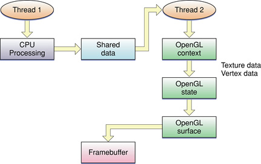
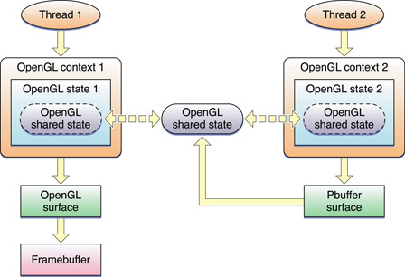

> 导航：[总目录](../../../README.md) · [documentation](../../../_indexes/documentation.md) · [OpenGL Programming Guide for Mac](About%20OpenGL%20for%20OS%20X.md)


[Next](Tuning%20Your%20OpenGL%20Application.md)[Previous](Techniques%20for%20Scene%20Antialiasing.md)

# Concurrency and OpenGL

Concurrency is the notion of multiple things happening at the same time. In the context of computers, concurrency usually refers to executing tasks on more than one processor at the same time. By performing work in parallel, tasks complete sooner, and applications become more responsive to the user. The good news is that well-designed OpenGL applications already exhibit a specific form of concurrency—concurrency between application processing on the CPU and OpenGL processing on the GPU. Many of the techniques introduced in [OpenGL Application Design Strategies](OpenGL%20Application%20Design%20Strategies.md#apple-f4xwc4dqnrsv64tfmyxwi33df52wszbpkridimbqgaytsobxfvbuqmrnknltm) are aimed specifically at creating OpenGL applications that exhibit great CPU-GPU parallelism. However, modern computers not only contain a powerful GPU, but also contain multiple CPUs. Sometimes those CPUs have multiple cores, each capable of performing calculations independently of the others. It is critical that applications be designed to take advantage of concurrency where possible. Designing a concurrent application means decomposing the work your application performs into subtasks and identifying which tasks can safely operate in parallel and which tasks must be executed sequentially—that is, which tasks are dependent on either resources used by other tasks or results returned from those tasks.

Each process in OS X is made up of one or more threads. A _thread_ is a stream of execution that runs code for the process. Multicore systems offer true concurrency by allowing multiple threads to execute simultaneously. Apple offers both traditional threads and a feature called __Grand Central Dispatch (GCD)__. Grand Central Dispatch allows you to decompose your application into smaller tasks without requiring the application to manage threads. GCD allocates threads based on the number of cores available on the system and automatically schedules tasks to those threads.

At a higher level, Cocoa offers [NSOperation](https://developer.apple.com/documentation/foundation/nsoperation) and [NSOperationQueue](https://developer.apple.com/documentation/foundation/operationqueue) to provide an Objective-C abstraction for creating and scheduling units of work. On OS X v10.6, operation queues use GCD to dispatch work; on OS X v10.5, operation queues create threads to execute your application’s tasks.

This chapter does not attempt describe these technologies in detail. Before you consider how to add concurrency to your OpenGL application, you should first read_[Concurrency Programming Guide](../../General/Concurrency%20Programming%20Guide/Introduction.md#apple-f4xwc4dqnrsv64tfmyxwi33df52wszbpkridimbqga4daojr)_. If you plan on managing threads manually, you should also read _[Threading Programming Guide](../../Cocoa/Threading%20Programming%20Guide/Introduction.md#apple-f4xwc4dqnrsv64tfmyxwi33df52wszbpgeydambqga2to2i)_. Regardless of which technique you use, there are additional restrictions when calling OpenGL on multithreaded systems. This chapter helps you understand when multithreading improves your OpenGL application’s performance, the restrictions OpenGL places on multithreaded applications, and common design strategies you might use to implement concurrency in an OpenGL application. Some of these design techniques can get you an improvement in just a few lines of code.

Creating a multithreaded application requires significant effort in the design, implementation, and testing of your application. Threads also add complexity and overhead to an application. For example, your application may need to copy data so that it can be handed to a worker thread, or multiple threads may need to synchronize access to the same resources. Before you attempt to implement concurrency in an OpenGL application, you should optimize your OpenGL code in a single-threaded environment using the techniques described in [OpenGL Application Design Strategies](OpenGL%20Application%20Design%20Strategies.md#apple-f4xwc4dqnrsv64tfmyxwi33df52wszbpkridimbqgaytsobxfvbuqmrnknltm). Focus on achieving great CPU-GPU parallelism first and then assess whether concurrent programming can provide an additional performance benefit.

A good candidate has either or both of the following characteristics:

- The application performs many tasks on the CPU that are independent of OpenGL rendering. Games, for example, simulate the game world, calculate artificial intelligence from computer-controlled opponents, and play sound. You can exploit parallelism in this scenario because many of these tasks are not dependent on your OpenGL drawing code.
- Profiling your application has shown that your OpenGL rendering code spends a lot of time in the CPU. In this scenario, the GPU is idle because your application is incapable of feeding it commands fast enough. If your CPU-bound code has already been optimized, you may be able to improve its performance further by splitting the work into tasks that execute concurrently.

If your application is blocked waiting for the GPU, and has no work it can perform in parallel with its OpenGL drawing commands, then it is not a good candidate for concurrency. If the CPU and GPU are both idle, then your OpenGL needs are probably simple enough that no further tuning is useful.

For more information on how to determine where your application spends its time, see [Tuning Your OpenGL Application](Tuning%20Your%20OpenGL%20Application.md#apple-f4xwc4dqnrsv64tfmyxwi33df52wszbpkridimbqgaytsobxfvbuqmrrgmwvgvzr).

Each thread in an OS X process has a single current OpenGL rendering context. Every time your application calls an OpenGL function, OpenGL implicitly looks up the context associated with the current thread and modifies the state or objects associated with that context.

OpenGL is not reentrant. If you modify the same context from multiple threads simultaneously, the results are unpredictable. Your application might crash or it might render improperly. If for some reason you decide to set more than one thread to target the same context, then you must synchronize threads by placing a mutex around all OpenGL calls to the context, such as `gl*` and `CGL*`. OpenGL commands that block—such as `fence` commands—do not synchronize threads.

GCD and [NSOperationQueue](https://developer.apple.com/documentation/foundation/operationqueue) objects can both execute your tasks on a thread of their choosing. They may create a thread specifically for that task, or they may reuse an existing thread. But in either case, you cannot guarantee which thread executes the task. For an OpenGL application, that means:

- Each task must set the context before executing any OpenGL commands.
- Your application must ensure that two tasks that access the same context are not allowed to execute concurrently.

A concurrent OpenGL application wants to focus on CPU parallelism so that OpenGL can provide more work to the GPU. Here are a few recommended strategies for implementing concurrency in an OpenGL application:

- Decompose your application into OpenGL and non-OpenGL tasks that can execute concurrently. Your OpenGL rendering code executes as a single task, so it still executes in a single thread. This strategy works best when your application has other tasks that require significant CPU processing.
- If performance profiling reveals that your application spends a lot of CPU time inside OpenGL, you can move some of that processing to another thread by enabling the multithreading in the OpenGL engine. The advantage of this method is its simplicity; enabling the multithreaded OpenGL engine takes just a few lines of code. See [Multithreaded OpenGL](#apple-f4xwc4dqnrsv64tfmyxwi33df52wszbpkridimbqgaytsobxfvbuqnbqhewvgvzrgi).
- If your application spends a lot of CPU time preparing data to send to openGL, you can divide the work between tasks that prepare rendering data and tasks that submit rendering commands to OpenGL. See [Perform OpenGL Computations in a Worker Task](#apple-f4xwc4dqnrsv64tfmyxwi33df52wszbpkridimbqgaytsobxfvbuqnbqhewvgvzu)
- If your application has multiple scenes it can render simultaneously or work it can perform in multiple contexts, it can create multiple tasks, with an OpenGL context per task. If the contexts can share the same resources, you can use context sharing when the contexts are created to share surfaces or OpenGL objects: display lists, textures, vertex and fragment programs, vertex array objects, and so on. See [Use Multiple OpenGL Contexts](#apple-f4xwc4dqnrsv64tfmyxwi33df52wszbpkridimbqgaytsobxfvbuqnbqhewvgvzw)

Whenever your application calls OpenGL, the renderer processes the parameters to put them in a format that the hardware understands. The time required to process these commands varies depending on whether the inputs are already in a hardware-friendly format, but there is always some overhead in preparing commands for the hardware.

If your application spends a lot of time performing calculations inside OpenGL, and you’ve already taken steps to pick ideal data formats, your application might gain an additional benefit by enabling multithreading inside the OpenGL engine. The multithreaded OpenGL engine automatically creates a worker thread and transfers some of its calculations to that thread. On a multicore system, this allows internal OpenGL calculations performed on the CPU to act in parallel with your application, improving performance. Synchronizing functions continue to block the calling thread.

Listing 14-1 shows the code required to enable the multithreaded OpenGL engine.

__Listing 14-1__  Enabling the multithreaded OpenGL engine

```
CGLError err = 0;
CGLContextObj ctx = CGLGetCurrentContext();

// Enable the multithreading
err =  CGLEnable( ctx, kCGLCEMPEngine);

if (err != kCGLNoError )
{
     // Multithreaded execution may not be available
     // Insert your code to take appropriate action
}
```

Enabling multithreading comes at a cost—OpenGL must copy parameters to transmit them to the worker thread. Because of this overhead, you should always test your application with and without multithreading enabled to determine whether it provides a substantial performance improvement.

Some applications perform lots of calculations on their data before passing that data down to the OpenGL renderer. For example, the application might create new geometry or animate existing geometry. Where possible, such calculations should be performed inside OpenGL. For example, vertex shaders and the transform feedback extension might allow you to perform these calculations entirely within OpenGL. This takes advantage of the greater parallelism available inside the GPU, and reduces the overhead of copying results between your application and OpenGL.

The approach described in [Figure 9-3](OpenGL%20Application%20Design%20Strategies.md#apple-f4xwc4dqnrsv64tfmyxwi33df52wszbpkridimbqgaytsobxfvbuqmrnknltg) alternates between updating OpenGL objects and executing rendering commands that use those objects. OpenGL renders on the GPU in parallel with your application’s updates running on the CPU. If the calculations performed on the CPU take more processing time than those on the GPU, then the GPU spends more time idle. In this situation, you may be able to take advantage of parallelism on systems with multiple CPUs. Split your OpenGL rendering code into separate calculation and processing tasks, and run them in parallel. Figure 14-1 shows a clear division of labor. One task produces data that is consumed by the second and submitted to OpenGL.

__Figure 14-1__  CPU processing and OpenGL on separate threads



For best performance, your application should avoid copying data between the tasks. For example, rather than calculating the data in one task and copying it into a vertex buffer object in the other, map the vertex buffer object in the setup code and hand the pointer directly to the worker task.

If your application can further decompose the modifications task into subtasks, you may see better benefits. For example, assume two or more vertex buffers, each of which needs to be updated before submitting drawing commands. Each can be recalculated independently of the others. In this scenario, the modifications to each buffer becomes an operation, using an `NSOperationQueue` object to manage the work:

1. Set the current context.
2. Map the first buffer.
3. Create an `NSOperation` object whose task is to fill that buffer.
4. Queue that operation on the operation queue.
5. Perform steps 2 through 4 for the other buffers.
6. Call `waitUntilAllOperationsAreFinished` on the operation queue.
7. Unmap the buffers.
8. Execute rendering commands.

On a multicore system, multiple threads of execution may allow the buffers to be filled simultaneously. Steps 7 and 8 could even be performed by a separate operation queued onto the same operation queue, provided that operation set the proper dependencies.

If your application has multiple scenes that can be rendered in parallel, you can use a context for each scene you need to render. Create one context for each scene and assign each context to an operation or task. Because each task has its own context, all can submit rendering commands in parallel.

The Apple-specific OpenGL APIs also provide the option for sharing data between contexts, as shown in Figure 14-2. Shared resources are automatically set up as mutual exclusion (_mutex_) objects. Notice that thread 2 draws to a pixel buffer that is linked to the shared state as a texture. Thread 1 can then draw using that texture.

__Figure 14-2__  Two contexts on separate threads



This is the most complex model for designing an application. Changes to objects in one context must be flushed so that other contexts see the changes. Similarly, when your application finishes operating on an object, it must flush those commands before exiting, to ensure that all rendering commands have been submitted to the hardware.

Follow these guidelines to ensure successful threading in an application that uses OpenGL:

- Use only one thread per context. OpenGL commands for a specific context are not thread safe. You should never have more than one thread accessing a single context simultaneously.
- Contexts that are on different threads can share object resources. For example, it is acceptable for one context in one thread to modify a texture, and a second context in a second thread to modify the same texture. The shared object handling provided by the Apple APIs automatically protects against thread errors. And, your application is following the "one thread per context" guideline.
- When you use an `NSOpenGLView` object with OpenGL calls that are issued from a thread other than the main one, you must set up mutex locking. Mutex locking is necessary because unless you override the default behavior, the main thread may need to communicate with the view for such things as resizing.

  Applications that use Objective-C with multithreading can lock contexts using the functions `CGLLockContext` and `CGLUnlockContext`. If you want to perform rendering in a thread other than the main one, you can lock the context that you want to access and safely execute OpenGL commands. The locking calls must be placed around all of your OpenGL calls in all threads.

  `CGLLockContext` blocks the thread it is on until all other threads have unlocked the same context using the function `CGLUnlockContext`. You can use `CGLLockContext` recursively. Context-specific CGL calls by themselves do not require locking, but you can guarantee serial processing for a group of calls by surrounding them with `CGLLockContext` and `CGLUnlockContext`. Keep in mind that calls from the OpenGL API (the API provided by the Khronos OpenGL Working Group) require locking.
- Keep track of the current context. When switching threads it is easy to switch contexts inadvertently, which causes unforeseen effects on the execution of graphic commands. You must set a current context when switching to a newly created thread.

[Next](Tuning%20Your%20OpenGL%20Application.md)[Previous](Techniques%20for%20Scene%20Antialiasing.md)

