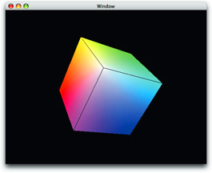
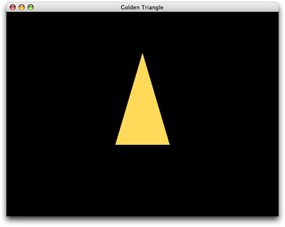

> 导航：[总目录](../../../README.md) · [documentation](../../../_indexes/documentation.md) · [OpenGL Programming Guide for Mac](About%20OpenGL%20for%20OS%20X.md)


[Next](Optimizing%20OpenGL%20for%20High%20Resolution.md)[Previous](OpenGL%20on%20the%20Mac%20Platform.md)

# Drawing to a Window or View

The OpenGL programming interface provides hundreds of drawing commands that drive graphics hardware. It doesn't provide any commands that interface with the windowing system of an operating system. Without a windowing system, the 3D graphics of an OpenGL program are trapped inside the GPU. Figure 2-1 shows a cube drawn to a Cocoa view.

__Figure 2-1__  OpenGL content in a Cocoa view



This chapter shows how to display OpenGL drawing onscreen using the APIs provided by OS X. (This chapter does not show how to use GLUT.) The first section describes the overall approach to drawing onscreen and provides an overview of the functions and methods used by each API.

To draw your content to a view or a layer, your application uses the `NSOpenGL` classes from within the Cocoa application framework. While the CGL API is used by your applications only to create full-screen content, every `NSOpenGLContext` object contains a CGL context object. This object can be retrieved from the `NSOpenGLContext` when your application needs to reference it directly. To show the similarities between the two, this chapter discusses both the `NSOpenGL` classes and the CGL API.

To draw OpenGL content to a window or view using the `NSOpenGL` classes, you need to perform these tasks:

1. Set up the renderer and buffer attributes that support the OpenGL drawing you want to perform.

   Each of the OpenGL APIs in OS X has its own set of constants that represent renderer and buffer attributes. For example, the all-renderers attribute is represented by the `NSOpenGLPFAAllRenderers` constant in Cocoa and the `kCGLPFAAllRenderers` constant in the CGL API.
2. Request, from the operating system, a pixel format object that encapsulates pixel storage information and the renderer and buffer attributes required by your application. The returned pixel format object contains all possible combinations of renderers and displays available on the system that your program runs on and that meets the requirements specified by the attributes. The combinations are referred to as _virtual screens_. (See [Virtual Screens](OpenGL%20on%20the%20Mac%20Platform.md#apple-f4xwc4dqnrsv64tfmyxwi33df52wszbpkridimbqgaytsobxfvbuqmrqhawvgvzrgy).)

   There may be situations for which you want to ensure that your program uses a specific renderer. [Choosing Renderer and Buffer Attributes](Choosing%20Renderer%20and%20Buffer%20Attributes.md#apple-f4xwc4dqnrsv64tfmyxwi33df52wszbpkridimbqgaytsobxfvbuqmrrgqwvgvzz) discusses how to set up an attributes array that guarantees the system passes back a pixel format object that uses only that renderer.

   If an error occurs, your application may receive a `NULL` pixel format object. Your application must handle this condition.
3. Create a rendering context and bind the pixel format object to it. The rendering context keeps track of state information that controls such things as drawing color, view and projection matrices, characteristics of light, and conventions used to pack pixels.

   Your application needs a pixel format object to create a rendering context.
4. Release the pixel format object. Once the pixel format object is bound to a rendering context, its resources are no longer needed.
5. Bind a drawable object to the rendering context. For a windowed context, this is typically a Cocoa view.
6. Make the rendering context the current context. The system sends OpenGL drawing to whichever rendering context is designated as the current one. It's possible for you to set up more than one rendering context, so you need to make sure that the one you want to draw to is the current one.
7. Perform your drawing.

The specific functions or methods that you use to perform each of the steps are discussed in the sections that follow.

There are two ways to draw OpenGL content to a Cocoa view. If your application has modest drawing requirements, then you can use the `NSOpenGLView` class. See [Drawing to an NSOpenGLView Class: A Tutorial](#apple-f4xwc4dqnrsv64tfmyxwi33df52wszbpkridimbqgaytsobxfvbuqnbqgqwvgvzv).

If your application is more complex and needs to support drawing to multiple rendering contexts, you may want to consider subclassing the `NSView` class. For example, if your application supports drawing to multiple views at the same time, you need to set up a custom `NSView` class. See [Drawing OpenGL Content to a Custom View](#apple-f4xwc4dqnrsv64tfmyxwi33df52wszbpkridimbqgaytsobxfvbuqnbqgqwvgvzt).

The `NSOpenGLView` class is a lightweight subclass of the `NSView` class that provides convenience methods for setting up OpenGL drawing. An `NSOpenGLView` object maintains an `NSOpenGLPixelFormat` object and an `NSOpenGLContext` object into which OpenGL calls can be rendered. It provides methods for accessing and managing the pixel format object and the rendering context, and handles notification of visible region changes.

An `NSOpenGLView` object does not support subviews. You can, however, divide the view into multiple rendering areas using the OpenGL function `glViewport`.

This section provides step-by-step instructions for creating a simple Cocoa application that draws OpenGL content to a view. The tutorial assumes that you know how to use Xcode and Interface Builder. If you have never created an application using the Xcode development environment, see [Getting Started with Tools](https://developer.apple.com/referencelibrary/GettingStarted/GS_Tools/index.html).

1. Create a Cocoa application project named Golden Triangle.
2. Add the OpenGL framework to your project.
3. Add a new file to your project using the Objective-C class template. Name the file `MyOpenGLView.m` and create a header file for it.
4. Open the `MyOpenGLView.h` file and modify the file so that it looks like the code shown in Listing 2-1 to declare the interface.

   __Listing 2-1__  The interface for `MyOpenGLView`

```objc
#import <Cocoa/Cocoa.h>

@interface MyOpenGLView : NSOpenGLView
{
}
- (void) drawRect: (NSRect) bounds;
@end
```
5. Save and close the `MyOpenGLView.h` file.
6. Open the `MyOpenGLView.m` file and include the `gl.h` file, as shown in Listing 2-2.

   __Listing 2-2__  Include `OpenGL/gl.h`

```objc
#import "MyOpenGLView.h"
#include <OpenGL/gl.h>

@implementation MyOpenGLView
@end
```
7. Implement the `drawRect:` method as shown in Listing 2-3, adding the code after the `@implementation` statement. The method sets the clear color to black and clears the color buffer in preparation for drawing. Then, `drawRect:` calls your drawing routine, which you’ll add next. The OpenGL command `glFlush` draws the content provided by your routine to the view.

   __Listing 2-3__  The `drawRect:` method for `MyOpenGLView`

```objc
-(void) drawRect: (NSRect) bounds
{
    glClearColor(0, 0, 0, 0);
    glClear(GL_COLOR_BUFFER_BIT);
    drawAnObject();
    glFlush();
}
```
8. Add the code to perform your drawing. In your own application, you'd perform whatever drawing is appropriate. But for the purpose of learning how to draw OpenGL content to a view, add the code shown in Listing 2-4. This code draws a 2D, gold-colored triangle, whose dimensions are not quite the dimensions of a true golden triangle, but good enough to show how to perform OpenGL drawing.

   Make sure that you insert this routine before the `drawRect:` method in the `MyOpenGLView.m` file.

   __Listing 2-4__  Code that draws a triangle using OpenGL commands

```
static void drawAnObject ()
{
    glColor3f(1.0f, 0.85f, 0.35f);
    glBegin(GL_TRIANGLES);
    {
        glVertex3f(  0.0,  0.6, 0.0);
        glVertex3f( -0.2, -0.3, 0.0);
        glVertex3f(  0.2, -0.3 ,0.0);
    }
    glEnd();
}
```
9. Open the `MainMenu.xib` in Interface Builder.
10. Change the window’s title to `Golden Triangle`.
11. Drag an `NSOpenGLView` object from the Library to the window. Resize the view to fit the window.
12. Change the class of this object to `MyOpenGLView`.
13. Open the Attributes pane of the inspector for the view, and take a look at the renderer and buffer attributes that are available to set. These settings save you from setting attributes programmatically.

    Only those attributes listed in the Interface Builder inspector are set when the view is instantiated. If you need additional attributes, you need to set them programmatically.
14. Build and run your application. You should see content similar to the triangle shown in Figure 2-2.

    __Figure 2-2__  The output from the Golden Triangle program

    

This example is extremely simple. In a more complex application, you'd want to do the following:

- Replace the immediate-mode drawing commands with commands that persist your vertex data inside OpenGL. See [OpenGL Application Design Strategies](OpenGL%20Application%20Design%20Strategies.md#apple-f4xwc4dqnrsv64tfmyxwi33df52wszbpkridimbqgaytsobxfvbuqmrnknltm).
- In the interface for the view, declare a variable that indicates whether the view is ready to accept drawing. A view is ready for drawing only if it is bound to a rendering context and that context is set to be the current one.
- Cocoa does not call initialization routines for objects created in Interface Builder. If you need to perform any initialization tasks, do so in the `awakeFromNib` method for the view. Note that because you set attributes in the inspector, there is no need to set them up programmatically unless you need additional ones. There is also no need to create a pixel format object programmatically; it is created and loaded when Cocoa loads the nib file.
- Your `drawRect:` method should test whether the view is ready to draw into. You need to provide code that handles the case when the view is not ready to draw into.
- OpenGL is at its best when doing real-time and interactive graphics. Your application needs to provide a timer or support user interaction. For more information about creating animation in your OpenGL application, see [Synchronize with the Screen Refresh Rate](OpenGL%20Application%20Design%20Strategies.md#apple-f4xwc4dqnrsv64tfmyxwi33df52wszbpkridimbqgaytsobxfvbuqmrnknlti).

This section provides an overview of the key tasks you need to perform to customize the `NSView` class for OpenGL drawing. Before you create a custom view for OpenGL drawing, you should read [Creating a Custom View](https://developer.apple.com/library/archive/documentation/Cocoa/Conceptual/CocoaViewsGuide/SubclassingNSView/SubclassingNSView.html#//apple_ref/doc/uid/TP40002978-CH7) in _[View Programming Guide](../../Cocoa/View%20Programming%20Guide/Introduction%20to%20View%20Programming%20Guide%20for%20Cocoa.md#apple-f4xwc4dqnrsv64tfmyxwi33df52wszbpkridimbqgazdsnzy)_.

When you subclass the `NSView` class to create a custom view for OpenGL drawing, you override any Quartz drawing or other content that is in that view. To set up a custom view for OpenGL drawing, subclass `NSView` and create two private variables—one which is an `NSOpenGLContext` object and the other an `NSOpenGLPixelFormat` object, as shown in Listing 2-5.

__Listing 2-5__  The interface for a custom OpenGL view

```objc
@class NSOpenGLContext, NSOpenGLPixelFormat;

@interface CustomOpenGLView : NSView
{
  @private
    NSOpenGLContext*     _openGLContext;
    NSOpenGLPixelFormat* _pixelFormat;
}
+ (NSOpenGLPixelFormat*)defaultPixelFormat;
- (id)initWithFrame:(NSRect)frameRect pixelFormat:(NSOpenGLPixelFormat*)format;
- (void)setOpenGLContext:(NSOpenGLContext*)context;
- (NSOpenGLContext*)openGLContext;
- (void)clearGLContext;
- (void)prepareOpenGL;
- (void)update;
- (void)setPixelFormat:(NSOpenGLPixelFormat*)pixelFormat;
- (NSOpenGLPixelFormat*)pixelFormat;
@end
```

In addition to the usual methods for the private variables (`openGLContext`, `setOpenGLContext:`, `pixelFormat`, and `setPixelFormat:`) you need to implement the following methods:

- `+ (NSOpenGLPixelFormat*) defaultPixelFormat`

  Use this method to allocate and initialize the `NSOpenGLPixelFormat` object.
- `- (void) clearGLContext`

  Use this method to clear and release the `NSOpenGLContext` object.
- `- (void) prepareOpenGL`

  Use this method to initialize the OpenGL state after creating the `NSOpenGLContext` object.

You need to override the `update` and `initWithFrame:` methods of the `NSView` class.

- `update` calls the `update` method of the `NSOpenGLContext` class.
- `initWithFrame:pixelFormat` retains the pixel format and sets up the notification `NSViewGlobalFrameDidChangeNotification`. See Listing 2-6.

__Listing 2-6__  The `initWithFrame:pixelFormat:` method

```objc
- (id)initWithFrame:(NSRect)frameRect pixelFormat:(NSOpenGLPixelFormat*)format
{
    self = [super initWithFrame:frameRect];
    if (self != nil) {
        _pixelFormat   = [format retain];
    [[NSNotificationCenter defaultCenter] addObserver:self
                     selector:@selector(_surfaceNeedsUpdate:)
                     name:NSViewGlobalFrameDidChangeNotification
                     object:self];
    }
    return self;
}

- (void) _surfaceNeedsUpdate:(NSNotification*)notification
{
   [self update];
}
```

If the custom view is not guaranteed to be in a window, you must also override the `lockFocus` method of the `NSView` class. See Listing 2-7. This method makes sure that the view is locked prior to drawing and that the context is the current one.

__Listing 2-7__  The `lockFocus` method

```objc
- (void)lockFocus
{
    NSOpenGLContext* context = [self openGLContext];

    [super lockFocus];
    if ([context view] != self) {
        [context setView:self];
    }
    [context makeCurrentContext];
}
```

The `reshape` method is not supported by the `NSView` class. You need to update bounds in the `drawRect:` method, which should take the form shown in Listing 2-8.

__Listing 2-8__  The `drawRect` method for a custom view

```objc
-(void) drawRect
{
    [context makeCurrentContext];
    //Perform drawing here
    [context flushBuffer];
}
```

There may be other methods that you want to add. For example, you might consider detaching the context from the drawable object when the custom view is moved from the window, as shown in Listing 2-9.

__Listing 2-9__  Detaching the context from a drawable object

```objc
-(void) viewDidMoveToWindow
{
    [super viewDidMoveToWindow];
    if ([self window] == nil)
        [context clearDrawable];
}
```

[Next](Optimizing%20OpenGL%20for%20High%20Resolution.md)[Previous](OpenGL%20on%20the%20Mac%20Platform.md)

