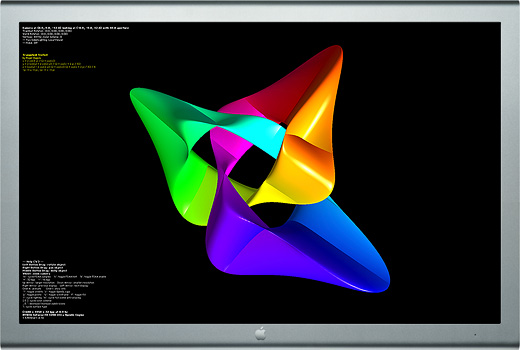

> 导航：[总目录](../../../README.md) · [documentation](../../../_indexes/documentation.md) · [OpenGL Programming Guide for Mac](About%20OpenGL%20for%20OS%20X.md)


[Next](Drawing%20Offscreen.md)[Previous](Optimizing%20OpenGL%20for%20High%20Resolution.md)

# Drawing to the Full Screen

In OS X, you have the option to draw to the entire screen. This is a common scenario for games and other immersive applications, and OS X applies additional optimizations to improve the performance of full-screen contexts.

__Figure 4-1__  Drawing OpenGL content to the full screen



OS X v10.6 and later automatically optimize the performance of screen-sized windows, allowing your application to take complete advantage of the window server environment on OS X. For example, critical operating system dialogs may be displayed over your content when necessary.

For information about high-resolution and full-screen drawing, see [Use an Application Window for Fullscreen Operation](Optimizing%20OpenGL%20for%20High%20Resolution.md#apple-f4xwc4dqnrsv64tfmyxwi33df52wszbpkridimbqgaytsobxfvbuqmjqgays2u2xgeza).

Creating a full-screen context is very simple. Your application should follow these steps:

1. Create a screen-sized window on the display you want to take over:

```
NSRect mainDisplayRect = [[NSScreen mainScreen] frame];
NSWindow *fullScreenWindow = [[NSWindow alloc] initWithContentRect: mainDisplayRect styleMask:NSBorderlessWindowMask backing:NSBackingStoreBuffered defer:YES];
```
2. Set the window level to be above the menu bar.:

```
[fullScreenWindow setLevel:NSMainMenuWindowLevel+1];
```
3. Perform any other window configuration you desire:

```
[fullScreenWindow setOpaque:YES];
[fullScreenWindow setHidesOnDeactivate:YES];
```
4. Create a view with a double-buffered OpenGL context and attach it to the window:

```
NSOpenGLPixelFormatAttribute attrs[] =
{
    NSOpenGLPFADoubleBuffer,
    0
};
NSOpenGLPixelFormat* pixelFormat = [[NSOpenGLPixelFormat alloc] initWithAttributes:attrs];

NSRect viewRect = NSMakeRect(0.0, 0.0, mainDisplayRect.size.width, mainDisplayRect.size.height);
MyOpenGLView *fullScreenView = [[MyOpenGLView alloc] initWithFrame:viewRect pixelFormat: pixelFormat];
[fullScreenWindow setContentView: fullScreenView];
```
5. Show the window:

```
[fullScreenWindow makeKeyAndOrderFront:self];
```

That’s all you need to do. Your content is in a window that is above most other content, but because it is in a window, OS X can still show critical UI elements above your content when necessary (such as error dialogs). When there is no content above your full-screen window, OS X automatically attempts to optimize this context’s performance. For example, when your application calls `flushBuffer` on the `NSOpenGLContext` object, the system may swap the buffers rather than copying the contents of the back buffer to the front buffer. These performance optimizations are not applied when your application adds the [NSOpenGLPFABackingStore](https://developer.apple.com/documentation/appkit/nsopenglpfabackingstore) attribute to the context. Because the system may choose to swap the buffers rather than copy them, your application must completely redraw the scene after every call to `flushBuffer`. For more information on [NSOpenGLPFABackingStore](https://developer.apple.com/documentation/appkit/nsopenglpfabackingstore), see [Ensuring That Back Buffer Contents Remain the Same](Choosing%20Renderer%20and%20Buffer%20Attributes.md#apple-f4xwc4dqnrsv64tfmyxwi33df52wszbpkridimbqgaytsobxfvbuqmrrgqwvgvzu).

Avoid changing the display resolution from that chosen by the user. If your application needs to render data at a lower resolution for performance reasons, you can explicitly create a back buffer at the desired resolution and allow OpenGL to scale those results to the display. See [Controlling the Back Buffer Size](Working%20with%20Rendering%20Contexts.md#apple-f4xwc4dqnrsv64tfmyxwi33df52wszbpkridimbqgaytsobxfvbuqmrrgywvgvzsha).

[Next](Drawing%20Offscreen.md)[Previous](Optimizing%20OpenGL%20for%20High%20Resolution.md)

