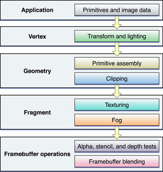
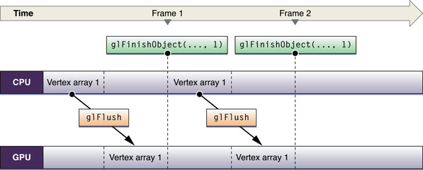
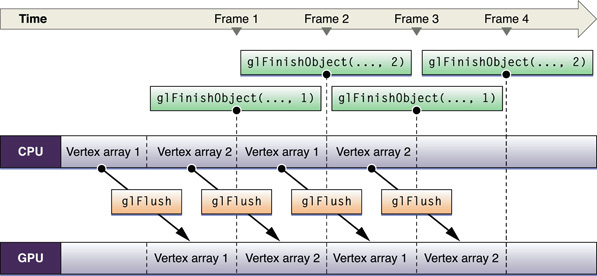

> 导航：[总目录](../../../README.md) · [documentation](../../../_indexes/documentation.md) · [OpenGL Programming Guide for Mac](About%20OpenGL%20for%20OS%20X.md)


[Next](Best%20Practices%20for%20Working%20with%20Vertex%20Data.md)[Previous](Determining%20the%20OpenGL%20Capabilities%20Supported%20by%20the%20Renderer.md)

# OpenGL Application Design Strategies

OpenGL performs many complex operations—transformations, lighting, clipping, texturing, environmental effects, and so on—on large data sets. The size of your data and the complexity of the calculations performed on it can impact performance, making your stellar 3D graphics shine less brightly than you'd like. Whether your application is a game using OpenGL to provide immersive real-time images to the user or an image processing application more concerned with image quality, use the information in this chapter to help you design your application.

The most common way to visualize OpenGL is as a graphics pipeline, as shown in [Figure 9-1](#apple-f4xwc4dqnrsv64tfmyxwi33df52wszbpkridimbqgaytsobxfvbuqmrnknltc). Your application sends vertex and image data, configuration and state changes, and rendering commands to OpenGL. Vertices are processed, assembled into primitives, and rasterized into fragments. Each fragment is calculated and merged into the framebuffer. The pipeline model is useful for identifying exactly what work your application must perform to generate the results you want. OpenGL allows you to customize each stage of the graphics pipeline, either through customized shader programs or by configuring a fixed-function pipeline through OpenGL function calls.

In most implementations, each pipeline stage can act in parallel with the others. This is a key point. If any one pipeline stage performs too much work, then the other stages sit idle waiting for it to complete. Your design should balance the work performed in each pipeline stage to the capabilities of the renderer. When you tune your application’s performance, the first step is usually to determine which stage the application is bottlenecked in, and why.

__Figure 9-1__  OpenGL graphics pipeline



Another way to visualize OpenGL is as a client-server architecture, as shown in [Figure 9-2](#apple-f4xwc4dqnrsv64tfmyxwi33df52wszbpkridimbqgaytsobxfvbuqmrnknlte). OpenGL state changes, texture and vertex data, and rendering commands must all travel from the application to the OpenGL client. The client transforms these items so that the graphics hardware can understand them, and then forwards them to the GPU. Not only do these transformations add overhead, but the bandwidth between the CPU and the graphics hardware is often lower than other parts of the system.

To achieve great performance, an application must reduce the frequency of calls they make to OpenGL, minimize the transformation overhead, and carefully manage the flow of data between the application and the graphics hardware. For example, OpenGL provides mechanisms that allow some kinds of data to be cached in dedicated graphics memory. Caching reusable data in graphics memory reduces the overhead of transmitting data to the graphics hardware.

__Figure 9-2__  OpenGL client-server architecture

!

To summarize, a well-designed OpenGL application needs to:

- Exploit parallelism in the OpenGL pipeline.
- Manage data flow between the application and the graphics hardware.

Figure 9-3 shows a suggested process flow for an application that uses OpenGL to perform animation to the display.

__Figure 9-3__  Application model for managing resources

!

When the application launches, it creates and initializes any static resources it intends to use in the renderer, encapsulating those resources into OpenGL objects where possible. The goal is to create any object that can remain unchanged for the runtime of the application. This trades increased initialization time for better rendering performance. Ideally, complex commands or batches of state changes should be replaced with OpenGL objects that can be switched in with a single function call. For example, configuring the fixed-function pipeline can take dozens of function calls. Replace it with a graphics shader that is compiled at initialization time, and you can switch to a different program with a single function call. In particular, OpenGL objects that are expensive to create or modify should be created as static objects.

The rendering loop processes all of the items you intend to render to the OpenGL context, then swaps the buffers to display the results to the user. In an animated scene, some data needs to be updated for every frame. In the inner rendering loop shown in Figure 9-3, the application alternates between updating rendering resources (possibly creating or modifying OpenGL objects in the process) and submitting rendering commands that use those resources. The goal of this inner loop is to balance the workload so that the CPU and GPU are working in parallel, without blocking each other by using the same resources simultaneously.

A goal for the inner loop is to avoid copying data back from the graphics processor to the CPU. Operations that require the CPU to read results back from the graphics hardware are sometimes necessary, but in general reading back results should be used sparingly. If those results are also used to render the current frame, as shown in the middle rendering loop, this can be very slow. Copying data from the GPU to the CPU often requires that some or all previously submitted drawing commands have completed.

After the application submits all drawing commands needed in the frame, it presents the results to the screen. Alternatively, a non-interactive application might read the final image back to the CPU, but this is also slower than presenting results to the screen. This step should be performed only for results that must be read back to the application. For example, you might copy the image in the back buffer to save it to disk.

Finally, when your application is ready to shut down, it deletes static and dynamic resources to make more hardware resources available to other applications. If your application is moved to the background, releasing resources to other applications is also good practice.

To summarize the important characteristics of this design:

- Create static resources, whenever practical.
- The inner rendering loop alternates between modifying dynamic resources and submitting rendering commands. Enough work should be included in this loop so that when the application needs to read or write to any OpenGL object, the graphics processor has finished processing any commands that used it.
- Avoid reading intermediate rendering results into the application.

The rest of this chapter provides useful OpenGL programming techniques to implement the features of this rendering loop. Later chapters demonstrate how to apply these general techniques to specific areas of OpenGL programming.

- [Update OpenGL Content Only When Your Data Changes](#apple-f4xwc4dqnrsv64tfmyxwi33df52wszbpkridimbqgaytsobxfvbuqmrnknltcmq)
- [Avoid Synchronizing and Flushing Operations](#apple-f4xwc4dqnrsv64tfmyxwi33df52wszbpkridimbqgaytsobxfvbuqmrnknltcma)
- [Allow OpenGL to Manage Your Resources](#apple-f4xwc4dqnrsv64tfmyxwi33df52wszbpkridimbqgaytsobxfvbuqmrnknlto)
- [Use Optimal Data Types and Formats](#apple-f4xwc4dqnrsv64tfmyxwi33df52wszbpkridimbqgaytsobxfvbuqmrnknltcny)
- [Use Double Buffering to Avoid Resource Conflicts](#apple-f4xwc4dqnrsv64tfmyxwi33df52wszbpkridimbqgaytsobxfvbuqmrnknltq)
- [Be Mindful of OpenGL State Variables](#apple-f4xwc4dqnrsv64tfmyxwi33df52wszbpkridimbqgaytsobxfvbuqmrnknltema)
- [Use OpenGL Macros](#apple-f4xwc4dqnrsv64tfmyxwi33df52wszbpkridimbqgaytsobxfvbuqmrnknltemq)
- [Replace State Changes with OpenGL Objects](#apple-f4xwc4dqnrsv64tfmyxwi33df52wszbpkridimbqgaytsobxfvbuqmrnknlteny)

OpenGL applications should avoid recomputing a scene when the data has not changed. This is critical on portable devices, where power conservation is critical to maximizing battery life. You can ensure that your application draws only when necessary by following a few simple guidelines:

- If your application is rendering animation, use a Core Video display link to drive the animation loop. [Listing 9-1](#apple-f4xwc4dqnrsv64tfmyxwi33df52wszbpkridimbqgaytsobxfvbuqmrnknltk) provides code that allows your application to be notified when a new frame needs to be displayed. This code also synchronizes image updates to the refresh rate of the display. See [Synchronize with the Screen Refresh Rate](#apple-f4xwc4dqnrsv64tfmyxwi33df52wszbpkridimbqgaytsobxfvbuqmrnknlti) for more information.
- If your application does not animate its OpenGL content, you should allow the system to regulate drawing. For example, in Cocoa call the `setNeedsDisplay:` method when your data changes.
- If your application does not use a Core Video display link, you should still advance an animation only when necessary. To determine when to draw the next frame of an animation, calculate the difference between the current time and the start of the last frame. Use the difference to determine how much to advance the animation. You can use the Core Foundation function [CFAbsoluteTimeGetCurrent](https://developer.apple.com/documentation/corefoundation/1543542-cfabsolutetimegetcurrent) to obtain the current time.

__Listing 9-1__  Setting up a Core Video display link

```objc
@interface MyView : NSOpenGLView
{
    CVDisplayLinkRef displayLink; //display link for managing rendering thread
}
@end

- (void)prepareOpenGL
{
   // Synchronize buffer swaps with vertical refresh rate
    GLint swapInt = 1;
    [[self openGLContext] setValues:&swapInt forParameter:NSOpenGLCPSwapInterval];

    // Create a display link capable of being used with all active displays
    CVDisplayLinkCreateWithActiveCGDisplays(&displayLink);

    // Set the renderer output callback function
    CVDisplayLinkSetOutputCallback(displayLink, &MyDisplayLinkCallback, self);

    // Set the display link for the current renderer
    CGLContextObj cglContext = [[self openGLContext] CGLContextObj];
    CGLPixelFormatObj cglPixelFormat = [[self pixelFormat] CGLPixelFormatObj];
    CVDisplayLinkSetCurrentCGDisplayFromOpenGLContext(displayLink, cglContext, cglPixelFormat);

    // Activate the display link
    CVDisplayLinkStart(displayLink);
}

// This is the renderer output callback function
static CVReturn MyDisplayLinkCallback(CVDisplayLinkRef displayLink, const CVTimeStamp* now, const CVTimeStamp* outputTime,
CVOptionFlags flagsIn, CVOptionFlags* flagsOut, void* displayLinkContext)
{
    CVReturn result = [(MyView*)displayLinkContext getFrameForTime:outputTime];
    return result;
}

- (CVReturn)getFrameForTime:(const CVTimeStamp*)outputTime
{
    // Add your drawing codes here

    return kCVReturnSuccess;
}

- (void)dealloc
{
    // Release the display link
    CVDisplayLinkRelease(displayLink);

    [super dealloc];
}
```


Tearing is a visual anomaly caused when part of the current frame overwrites previous frame data in the framebuffer before the current frame is fully rendered on the screen. To avoid tearing, applications use a double-buffered context and synchronize buffer swaps with the screen refresh rate (sometimes called _VBL_, _vertical blank_, or _vsynch_) to eliminate frame tearing.

The refresh rate of the display limits how often the screen can be refreshed. The screen can be refreshed at rates that are divisible by integer values. For example, a CRT display that has a refresh rate of 60 Hz can support screen refresh rates of 60 Hz, 30 Hz, 20 Hz, and 15 Hz. LCD displays do not have a vertical retrace in the CRT sense and are typically considered to have a fixed refresh rate of 60 Hz.

After you tell the context to swap the buffers, OpenGL must defer any rendering commands that follow that swap until after the buffers have successfully been exchanged. Applications that attempt to draw to the screen during this waiting period waste time that could be spent performing other drawing operations or saving battery life and minimizing fan operation.

Listing 9-2 shows how an `NSOpenGLView` object can synchronize with the screen refresh rate; you can use a similar approach if your application uses CGL contexts. It assumes that you set up the context for double buffering. The swap interval can be set only to `0` or `1`. If the swap interval is set to `1`, the buffers are swapped only during the vertical retrace.

__Listing 9-2__  Setting up synchronization

```
GLint swapInterval = 1;
[[self openGLContext] setValues:&swapInt forParameter:NSOpenGLCPSwapInterval];
```


OpenGL is not required to execute most commands immediately. Often, they are queued to a command buffer and read and executed by the hardware at a later time. Usually, OpenGL waits until the application has queued up a significant number of commands before sending the buffer to the hardware—allowing the graphics hardware to execute commands in batches is often more efficient. However, some OpenGL functions must flush the buffer immediately. Other functions not only flush the buffer, but also block until previously submitted commands have completed before returning control to the application. Your application should restrict the use of flushing and synchronizing commands only to those cases where that behavior is necessary. Excessive use of flushing or synchronizing commands add additional stalls waiting for the hardware to finish rendering. On a single-buffered context, flushing may also cause visual anomalies, such as flickering or tearing.

These situations require OpenGL to submit the command buffer to the hardware for execution.

- The function `glFlush` waits until commands are submitted but does not wait for the commands to finish executing.
- The function `glFinish` waits for all previously submitted commands to complete executing.
- Functions that retrieve OpenGL state (for example, `glGetError`), also wait for submitted commands to complete.
- Buffer swapping routines (the `flushBuffer` method of the `NSOpenGLContext` class or the `CGLFlushDrawable` function) implicitly call `glFlush`. Note that when using the `NSOpenGLContext` class or the CGL API, the term _flush_ actually refers to a buffer-swapping operation. For single-buffered contexts, `glFlush` and `glFinish` are equivalent to a swap operation, since all rendering is taking place directly in the front buffer.
- The command buffer is full.

Most of the time you don't need to call `glFlush` to move image data to the screen. There are only a few cases that require you to call the `glFlush` function:

- If your application submits rendering commands that use a particular OpenGL object, and it intends to modify that object in the near future. If you attempt to modify an OpenGL object that has pending drawing commands, your application may be forced to wait until those commands have been completed. In this situation, calling `glFlush` ensures that the hardware begins processing commands immediately. After flushing the command buffer, your application should perform work that does not need that resource. It can perform other work (even modifying other OpenGL objects).
- Your application needs to change the drawable object associated with the rendering context. Before you can switch to another drawable object, you must call `glFlush` to ensure that all commands written in the command queue for the previous drawable object have been submitted.
- When two contexts share an OpenGL object. After submitting any OpenGL commands, call `glFlush` before switching to the other context.
- To keep drawing synchronized across multiple threads and prevent command buffer corruption, each thread should submit its rendering commands and then call `glFlush`.

Calls to `glGet*()`, including `glGetError()`, may require OpenGL to execute previous commands before retrieving any state variables. This synchronization forces the graphics hardware to run lockstep with the CPU, reducing opportunities for parallelism.

Your application should keep shadow copies of any OpenGL state that you need to query, and maintain these shadow copies as you change the state.

When errors occur, OpenGL sets an error flag that you can retrieve with the function `glGetError`. During development, it's crucial that your code contains error checking routines, not only for the standard OpenGL calls, but for the Apple-specific functions provided by the CGL API. If you are developing a performance-critical application, retrieve error information only in the debugging phase. Calling `glGetError` excessively in a release build degrades performance.

Avoid using `glFinish` in your application, because it waits until all previously submitted commands are completed before returning control to your application. Instead, you should use the fence extension (`APPLE_fence`). This extension was created to provide the level of granularity that is not provided by `glFinish`. A _fence_ is a token used to mark the current point in the command stream. When used correctly, it allows you to ensure that a specific series of commands has been completed. A fence helps coordinate activity between the CPU and the GPU when they are using the same resources.

Follow these steps to set up and use a fence:

1. At initialization time, create the fence object by calling the function `glGenFencesAPPLE`.

```
GLint myFence;
glGenFencesAPPLE(1,&myFence);
```
2. Call the OpenGL functions that must complete prior to the fence.
3. Set up the fence by calling the function `glSetFenceAPPLE`. This function inserts a token into the command stream and sets the fence state to `false`.

```
void glSetFenceAPPLE(GLuint fence);
```

   `fence` specifies the token to insert. For example:

```
glSetFenceAPPLE(myFence);
```
4. Call `glFlush` to force the commands to be sent to the hardware. This step is optional, but recommended to ensure that the hardware begins processing OpenGL commands.
5. Perform other work in your application.
6. Wait for all OpenGL commands issued prior to the fence to complete by calling the function `glFinishFenceAPPLE`.

```
glFinishFenceAPPLE(myFence);
```

   As an alternative to calling `glFinishFenceAPPLE`, you can call `glTestFenceAPPLE` to determine whether the fence has been reached. The advantage of testing the fence is that your application does not block waiting for the fence to complete. This is useful if your application can continue processing other work while waiting for the fence to trigger.

```
glTestFenceAPPLE(myFence);
```
7. When your application no longer needs the fence, delete it by calling the function `glDeleteFencesAPPLE`.

```
glDeleteFencesAPPLE(1,&myFence);
```

There is an art to determining where to insert a fence in the command stream. If you insert a fence for too few drawing commands, you risk having your application stall while it waits for drawing to complete. You'll want to set a fence so your application operates as asynchronously as possible without stalling.

The fence extension also lets you synchronize buffer updates for objects such as vertex arrays and textures. For that you call the function `glFinishObjectAPPLE`, supplying an object name along with the token.

For detailed information on this extension, see the [OpenGL specification for the Apple fence extension](http://www.opengl.org/registry/specs/APPLE/fence.txt).

OpenGL allows many data types to be stored persistently inside OpenGL. Creating OpenGL objects to store vertex, texture, or other forms of data allows OpenGL to reduce the overhead of transforming the data and sending them to the graphics processor. If data is used more frequently than it is modified, OpenGL can substantially improve the performance of your application.

OpenGL allows your application to hint how it intends to use the data. These hints allow OpenGL to make an informed choice of how to process your data. For example, static data might be placed in high-speed graphics memory directly connected to the graphics processor. Data that changes frequently might be kept in main memory and accessed by the graphics hardware through DMA.

Resource conflicts occur when your application and OpenGL want to access a resource at the same time. When one participant attempts to modify an OpenGL object being used by the other, one of two problems results:

- The participant that wants to modify the object blocks until it is no longer in use. Then the other participant is not allowed to read from or write to the object until the modifications are complete. This is safe, but these can be hidden bottlenecks in your application.
- Some extensions allow OpenGL to access application memory that can be simultaneously accessed by the application. In this situation, synchronizing between the two participants is left to the application to manage. Your application calls `glFlush` to force OpenGL to execute commands and uses a fence or `glFinish` to ensure that no commands that access that memory are pending.

Whether your application relies on OpenGL to synchronize access to a resource, or it manually synchronizes access, resource contention forces one of the participants to wait, rather than allowing them both to execute in parallel. Figure 9-4 demonstrates this problem. There is only a single buffer for vertex data, which both the application and OpenGL want to use and therefore the application must wait until the GPU finishes processing commands before it modifies the data.

__Figure 9-4__  Single-buffered vertex array data



To solve this problem, your application could fill this idle time with other processing, even other OpenGL processing that does not need the objects in question. If you need to process more OpenGL commands, the solution is to create two of the same resource type and let each participant access a resource. Figure 9-5 illustrates the double-buffered approach. While the GPU operates on one set of vertex array data, the CPU is modifying the other. After the initial startup, neither processing unit is idle. This example uses a fence to ensure that access to each buffer is synchronized.

__Figure 9-5__  Double-buffered vertex array data



Double buffering is sufficient for most applications, but it requires that both participants finish processing their commands before a swap can occur. For a traditional producer-consumer problem, more than two buffers may prevent a participant from blocking. With triple buffering, the producer and consumer each have a buffer, with a third idle buffer. If the producer finishes before the consumer finishes processing commands, it takes the idle buffer and continues to process commands. In this situation, the producer idles only if the consumer falls badly behind.

The hardware has one current state, which is compiled and cached. Switching state is expensive, so it's best to design your application to minimize state switches.

Don't set a state that's already set. Once a feature is enabled, it does not need to be enabled again. Calling an enable function more than once does nothing except waste time because OpenGL does not check the state of a feature when you call `glEnable` or `glDisable`. For instance, if you call `glEnable(GL_LIGHTING)` more than once, OpenGL does not check to see if the lighting state is already enabled. It simply updates the state value even if that value is identical to the current value.

You can avoid setting a state more than necessary by using dedicated setup or shutdown routines rather than putting such calls in a drawing loop. Setup and shutdown routines are also useful for turning on and off features that achieve a specific visual effect—for example, when drawing a wire-frame outline around a textured polygon.

If you are drawing 2D images, disable all irrelevant state variables, similar to what's shown in Listing 9-3.

__Listing 9-3__  Disabling state variables

```
glDisable(GL_DITHER);
glDisable(GL_ALPHA_TEST);
glDisable(GL_BLEND);
glDisable(GL_STENCIL_TEST);
glDisable(GL_FOG);
glDisable(GL_TEXTURE_2D);
glDisable(GL_DEPTH_TEST);
glPixelZoom(1.0,1.0);
// Disable other state variables as appropriate.
```


The [Be Mindful of OpenGL State Variables](#apple-f4xwc4dqnrsv64tfmyxwi33df52wszbpkridimbqgaytsobxfvbuqmrnknltema) section suggests that reducing the number of state changes can improve performance. Some OpenGL extensions also allow you to create objects that collect multiple OpenGL state changes into an object that can be bound with a single function call. Where such techniques are available, they are recommended. For example, configuring the fixed-function pipeline requires many function calls to change the state of the various operators. Not only does this incur overhead for each function called, but the code is more complex and difficult to manage. Instead, use a shader. A shader, once compiled, can have the same effect but requires only a single call to `glUseProgram`.

Other examples of objects that take the place of multiple state changes include the [Vertex Array Range Extension](Best%20Practices%20for%20Working%20with%20Vertex%20Data.md#apple-f4xwc4dqnrsv64tfmyxwi33df52wszbpkridimbqgaytsobxfvbuqnbqgywvgvzrg4) and [Uniform Buffers](Customizing%20the%20OpenGL%20Pipeline%20with%20Shaders.md#apple-f4xwc4dqnrsv64tfmyxwi33df52wszbpkridimbqgaytsobxfvbuqmjnknltcma).

If you don't use data types and formats that are native to the graphics hardware, OpenGL must convert those data types into a format that the graphics hardware understands.

For vertex data, use `GLfloat`, `GLshort`, or `GLubyte` data types. Most graphics hardware handle these types natively.

For texture data, you’ll get the best performance if you use the following format and data type combination:

- `GL_BGRA`, `GL_UNSIGNED_INT_8_8_8_8_REV`

These format and data type combinations also provide acceptable performance:

- `GL_BGRA`, `GL_UNSIGNED_SHORT_1_5_5_5_REV`
- `GL_YCBCR_422_APPLE`, `GL_UNSIGNED_SHORT_8_8_REV_APPLE`

The combination `GL_RGBA` and `GL_UNSIGNED_BYTE` needs to be swizzled by many cards when the data is loaded, so it's not recommended.

OpenGL performs a global context and renderer lookup for each command it executes to ensure that all OpenGL commands are issued to the correct rendering context and renderer. There is significant overhead associated with these lookups; applications that have extremely high call frequencies may find that the overhead measurably affects performance. OS X allows your application to use macros to provide a local context variable and cache the current renderer in that variable. You get more benefit from using macros when your code makes millions of function calls per second.

Before implementing this technique, consider carefully whether you can redesign your application to perform less function calls. Frequently changing OpenGL state, pushing or popping matrices, or even submitting one vertex at a time are all examples of techniques that should be replaced with more efficient operations.

You can use the CGL macro header (`CGL/CGLMacro.h`) if your application uses CGL from a Cocoa application. You must define the local variable `cgl_ctx` to be equal to the current context. Listing 9-4 shows what's needed to set up macro use for the CGL API. First, you need to include the correct macro header. Then, you must set the current context.

__Listing 9-4__  Using CGL macros

```c
#include <CGL/CGLMacro.h> // include the header
CGL_MACRO_DECLARE_VARIABLES // set the current context
glBegin (GL_QUADS);     // This code now uses the macro
    // draw here
glEnd ();
```

[Next](Best%20Practices%20for%20Working%20with%20Vertex%20Data.md)[Previous](Determining%20the%20OpenGL%20Capabilities%20Supported%20by%20the%20Renderer.md)

