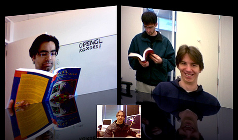
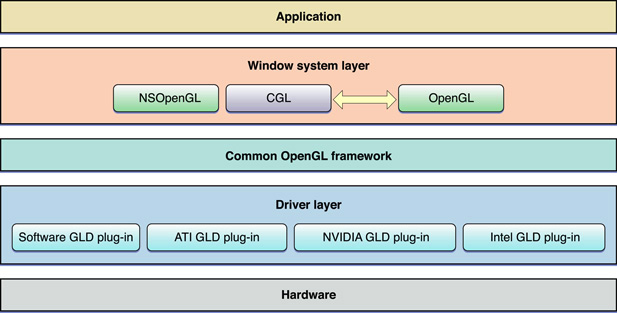
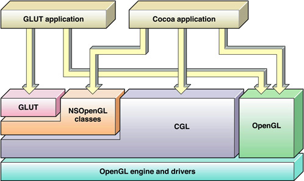
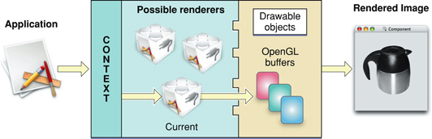
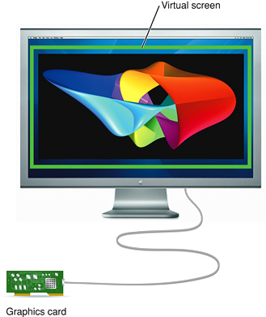
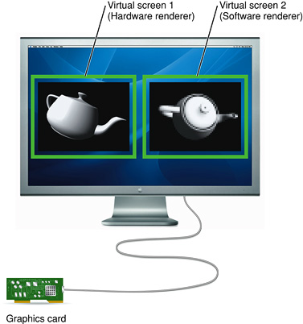
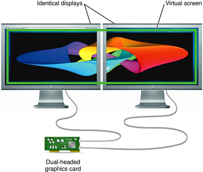
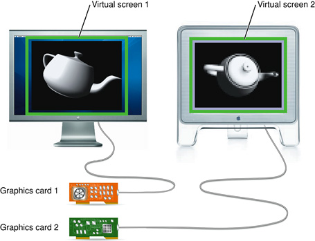
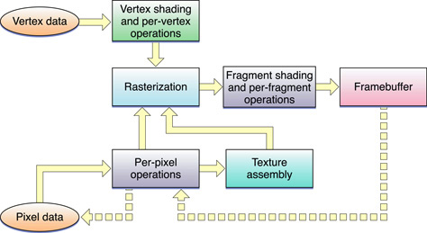

> 导航：[总目录](../../../README.md) · [documentation](../../../_indexes/documentation.md) · [OpenGL Programming Guide for Mac](About%20OpenGL%20for%20OS%20X.md)

[Next](Drawing%20to%20a%20Window%20or%20View.md)[Previous](About%20OpenGL%20for%20OS%20X.md)

# OpenGL on the Mac Platform

You can tell that Apple has an implementation of OpenGL on its platform by looking at the user interface for many of the applications that are installed with OS X. The reflections built into iChat (Figure 1-1) provide one of the more notable examples. The responsiveness of the windows, the instant results of applying an effect in iPhoto, and many other operations in OS X are due to the use of OpenGL. OpenGL is available to all Macintosh applications.

OpenGL for OS X is implemented as a set of frameworks that contain the OpenGL runtime engine and its drawing software. These frameworks use platform-neutral virtual resources to free your programming as much as possible from the underlying graphics hardware. OS X provides a set of application programming interfaces (APIs) that Cocoa applications can use to support OpenGL drawing.

__Figure 1-1__  OpenGL provides the reflections in iChat

This chapter provides an overview of OpenGL and the interfaces your application uses on the Mac platform to tap into it.

To understand how OpenGL fits into OS X and your application, you should first understand how OpenGL is designed.

OpenGL uses a client-server model, as shown in Figure 1-2. When your application calls an OpenGL function, it talks to an OpenGL client. The client delivers drawing commands to an OpenGL server. The nature of the client, the server, and the communication path between them is specific to each implementation of OpenGL. For example, the server and clients could be on different computers, or they could be different processes on the same computer.

__Figure 1-2__  OpenGL client-server model

!

A client-server model allows the graphics workload to be divided between the client and the server. For example, all Macintosh computers ship with dedicated graphics hardware that is optimized to perform graphics calculations in parallel. Figure 1-3 shows a common arrangement of CPUs and GPUs. With this hardware configuration, the OpenGL client executes on the CPU and the server executes on the GPU.

__Figure 1-3__  Graphics platform model

!

A benefit of the OpenGL client-server model is that the client can return control to the application before the command has finished executing. An OpenGL client may also buffer or delay execution of OpenGL commands. If OpenGL required all commands to complete before returning control to the application, then either the CPU or the GPU would be idle waiting for the other to provide it data, resulting in reduced performance.

Some OpenGL commands implicitly or explicitly require the client to wait until some or all previously submitted commands have completed. OpenGL applications should be designed to reduce the frequency of client-server synchronizations. See [OpenGL Application Design Strategies](OpenGL%20Application%20Design%20Strategies.md#apple-f4xwc4dqnrsv64tfmyxwi33df52wszbpkridimbqgaytsobxfvbuqmrnknltm) for more information on how to design your OpenGL application.

OpenGL guarantees that commands are executed in the order they are received by OpenGL.

When an application calls an OpenGL function, the OpenGL client copies any data provided in the parameters before returning control to the application. For example, if a parameter points at an array of vertex data stored in application memory, OpenGL must copy that data before returning. Therefore, an application is free to change memory it owns regardless of calls it makes to OpenGL.

The data that the client copies is often reformatted before it is transmitted to the server. Copying, modifying, and transmitting parameters to the server adds overhead to calling OpenGL. Applications should be designed to minimize copy overhead.

OpenGL provides a rich set of cross-platform drawing commands, but does not define functions to interact with an operating system’s graphics subsystem. Instead, OpenGL expects each implementation to define an interface to create rendering contexts and associate them with the graphics subsystem. A rendering context holds all of the data stored in the OpenGL state machine. Allowing multiple contexts allows the state in one machine to be changed by an application without affecting other contexts.

Associating OpenGL with the graphic subsystem usually means allowing OpenGL content to be rendered to a specific window. When content is associated with a window, the implementation creates whatever resources are required to allow OpenGL to render and display images.

OpenGL in OS X implements the OpenGL client-server model using a common OpenGL framework and plug-in drivers. The framework and driver combine to implement the client portion of OpenGL, as shown in Figure 1-4. Dedicated graphics hardware provides the server. Although this is the common scenario, Apple also provides a software renderer implemented entirely on the CPU.

__Figure 1-4__  MacOS X OpenGL driver model

!

OS X supports a display space that can include multiple dissimilar displays, each driven by different graphics cards with different capabilities. In addition, multiple OpenGL renderers can drive each graphics card. To accommodate this versatility, OpenGL for OS X is segmented into well-defined layers: a window system layer, a framework layer, and a driver layer, as shown in Figure 1-5. This segmentation allows for plug-in interfaces to both the window system layer and the framework layer. Plug-in interfaces offer flexibility in software and hardware configuration without violating the OpenGL standard.

__Figure 1-5__  Layers of OpenGL for OS X

The _window system layer_ is an OS X–specific layer that your application uses to create OpenGL rendering contexts and associate them with the OS X windowing system. The `NSOpenGL` classes and Core OpenGL (CGL) API also provide some additional controls for how OpenGL operates on that context. See [OpenGL APIs Specific to OS X](#apple-f4xwc4dqnrsv64tfmyxwi33df52wszbpkridimbqgaytsobxfvbuqmrqhawvgvzu) for more information. Finally, this layer also includes the OpenGL libraries—GL, GLU, and GLUT. (See [Apple-Implemented OpenGL Libraries](#apple-f4xwc4dqnrsv64tfmyxwi33df52wszbpkridimbqgaytsobxfvbuqmrqhawvgvzt) for details.)

The _common OpenGL framework layer_ is the software interface to the graphics hardware. This layer contains Apple's implementation of the OpenGL specification.

The _driver layer_ contains the optional GLD plug-in interface and one or more GLD plug-in drivers, which may have different software and hardware support capabilities. The GLD plug-in interface supports third-party plug-in drivers, allowing third-party hardware vendors to provide drivers optimized to take best advantage of their graphics hardware.

The programming interfaces that your application calls fall into two categories—those specific to the Macintosh platform and those defined by the OpenGL Working Group. The Apple-specific programming interfaces are what Cocoa applications use to communicate with the OS X windowing system. These APIs don't create OpenGL content, they manage content, direct it to a drawing destination, and control various aspects of the rendering operation. Your application calls the OpenGL APIs to create content. OpenGL routines accept vertex, pixel, and texture data and assemble the data to create an image. The final image resides in a framebuffer, which is presented to the user through the windowing-system specific API.

__Figure 1-6__  The programing interfaces used for OpenGL content

OS X offers two easy-to-use APIs that are specific to the Macintosh platform: the `NSOpenGL` classes and the CGL API. Throughout this document, these APIs are referred to as the Apple-specific OpenGL APIs.

Cocoa provides many classes specifically for OpenGL:

- The [NSOpenGLContext](https://developer.apple.com/documentation/appkit/nsopenglcontext) class implements a standard OpenGL rendering context.
- The [NSOpenGLPixelFormat](https://developer.apple.com/documentation/appkit/nsopenglpixelformat) class is used by an application to specify the parameters used to create the OpenGL context.
- The [NSOpenGLView](https://developer.apple.com/documentation/appkit/nsopenglview) class is a subclass of [NSView](https://developer.apple.com/documentation/appkit/nsview) that uses [NSOpenGLContext](https://developer.apple.com/documentation/appkit/nsopenglcontext) and [NSOpenGLPixelFormat](https://developer.apple.com/documentation/appkit/nsopenglpixelformat) to display OpenGL content in a view. Applications that subclass `NSOpenGLView` do not need to directly subclass `NSOpenGLPixelFormat` or `NSOpenGLContext`. Applications that need customization or flexibility, can subclass `NSView` and create `NSOpenGLPixelFormat` and `NSOpenGLContext` objects manually.
- The [NSOpenGLLayer](https://developer.apple.com/documentation/appkit/nsopengllayer) class allows your application to integrate OpenGL drawing with Core Animation.
- The [NSOpenGLPixelBuffer](https://developer.apple.com/documentation/appkit/nsopenglpixelbuffer) class provides hardware-accelerated offscreen drawing.

The Core OpenGL API (_CGL_) resides in the OpenGL framework and is used to implement the `NSOpenGL` classes. CGL offers the most direct access to system functionality and provides the highest level of graphics performance and control for drawing to the full screen. _CGL Reference_ provides a complete description of this API.

OS X also provides the full suite of graphics libraries that are part of every implementation of OpenGL: GL, GLU, GLUT, and GLX. Two of these—GL and GLU—provide low-level drawing support. The other two—GLUT and GLX—support drawing to the screen.

Your application typically interfaces directly with the core OpenGL library (GL), the OpenGL Utility library (GLU), and the OpenGL Utility Toolkit (GLUT). The _GL library_ provides a low-level modular API that allows you to define graphical objects. It supports the core functions defined by the OpenGL specification. It provides support for two fundamental types of graphics primitives: objects defined by sets of vertices, such as line segments and simple polygons, and objects that are pixel-based images, such as filled rectangles and bitmaps. The GL API does not handle complex custom graphical objects; your application must decompose them into simpler geometries.

The _GLU library_ combines functions from the GL library to support more advanced graphics features. It runs on all conforming implementations of OpenGL. GLU is capable of creating and handling complex polygons (including quartic equations), processing nonuniform rational b-spline curves (NURBs), scaling images, and decomposing a surface to a series of polygons (tessellation).

The _GLUT library_ provides a cross-platform API for performing operations associated with the user windowing environment—displaying and redrawing content, handling events, and so on. It is implemented on most UNIX, Linux, and Windows platforms. Code that you write with GLUT can be reused across multiple platforms. However, such code is constrained by a generic set of user interface elements and event-handling options. This document does not show how to use GLUT. The _[GLUTBasics](../../../samplecode/GLUTBasics/GLUTBasics.md#apple-f4xwc4dqnrsv64tfmyxwi33df52wszbpirkfgmjqgaydgmjvga)_ sample project shows you how to get started with GLUT.

_GLX_ is an OpenGL extension that supports using OpenGL within a window provided by the X Window system. X11 for OS X is available as an optional installation. (It's not shown in [Figure 1-6](#apple-f4xwc4dqnrsv64tfmyxwi33df52wszbpkridimbqgaytsobxfvbuqmrqhawvgvzsga).) See _OpenGL Programming for the X Window System_, published by Addison Wesley for more information.

This document does not show how to use these libraries. For detailed information, either go to the OpenGL Foundation website [http://www.opengl.org](http://www.opengl.org/) or see the most recent version of "The Red book"—[OpenGL Programming Guide](http://www.opengl.org/documentation/red_book/), published by Addison Wesley.

There are a number of terms that you’ll want to understand so that you can write code effectively using OpenGL: renderer, renderer attributes, buffer attributes, pixel format objects, rendering contexts, drawable objects, and virtual screens. As an OpenGL programmer, some of these may seem familiar to you. However, understanding the Apple-specific nuances of these terms will help you get the most out of OpenGL on the Macintosh platform.

A _renderer_ is the combination of the hardware and software that OpenGL uses to execute OpenGL commands. The characteristics of the final image depend on the capabilities of the graphics hardware associated with the renderer and the device used to display the image. OS X supports graphics accelerator cards with varying capabilities, as well as a software renderer. It is possible for multiple renderers, each with different capabilities or features, to drive a single set of graphics hardware. To learn how to determine the exact features of a renderer, see [Determining the OpenGL Capabilities Supported by the Renderer](Determining%20the%20OpenGL%20Capabilities%20Supported%20by%20the%20Renderer.md#apple-f4xwc4dqnrsv64tfmyxwi33df52wszbpkridimbqgaytsobxfvbuqmrrgewvgvzx).

Your application uses renderer and buffer attributes to communicate renderer and buffer requirements to OpenGL. The Apple implementation of OpenGL dynamically selects the best renderer for the current rendering task and does so transparently to your application. If your application has very specific rendering requirements and wants to control renderer selection, it can do so by supplying the appropriate renderer attributes. Buffer attributes describe such things as color and depth buffer sizes, and whether the data is stereoscopic or monoscopic.

Renderer and buffer attributes are represented by constants defined in the Apple-specific OpenGL APIs. OpenGL uses the attributes you supply to perform the setup work needed prior to drawing content. [Drawing to a Window or View](Drawing%20to%20a%20Window%20or%20View.md#apple-f4xwc4dqnrsv64tfmyxwi33df52wszbpkridimbqgaytsobxfvbuqnbqgqwvgvzy) provides a simple example that shows how to use renderer and buffer attributes. [Choosing Renderer and Buffer Attributes](Choosing%20Renderer%20and%20Buffer%20Attributes.md#apple-f4xwc4dqnrsv64tfmyxwi33df52wszbpkridimbqgaytsobxfvbuqmrrgqwvgvzz) explains how to choose renderer and buffer attributes to achieve specific rendering goals.

A _pixel format_ describes the format for pixel data storage in memory. The description includes the number and order of components as well as their names (typically red, blue, green and alpha). It also includes other information, such as whether a pixel contains stencil and depth values. A _pixel format object_ is an opaque data structure that holds a pixel format along with a list of renderers and display devices that satisfy the requirements specified by an application.

Each of the Apple-specific OpenGL APIs defines a pixel format data type and accessor routines that you can use to obtain the information referenced by this object. See [Virtual Screens](#apple-f4xwc4dqnrsv64tfmyxwi33df52wszbpkridimbqgaytsobxfvbuqmrqhawvgvzrgy) for more information on renderer and display devices.

OpenGL profiles are new in OS X 10.7. An _OpenGL profile_ is a renderer attribute used to request a specific version of the OpenGL specification. When your application provides an OpenGL profile as part of its renderer attributes, it only receives renderers that provide the complete feature set promised by that profile. The render can implement a different version of the OpenGL so long as the version it supplies to your application provides the same functionality that your application requested.

A _rendering context_, or simply _context_, contains OpenGL state information and objects for your application. State variables include such things as drawing color, the viewing and projection transformations, lighting characteristics, and material properties. State variables are set per context. When your application creates OpenGL objects (for example, textures), these are also associated with the rendering context.

Although your application can maintain more than one context, only one context can be the _current context_ in a thread. The current context is the rendering context that receives OpenGL commands issued by your application.

A _drawable object_ refers to an object allocated by the windowing system that can serve as an OpenGL framebuffer. A drawable object is the destination for OpenGL drawing operations. The behavior of drawable objects is not part of the OpenGL specification, but is defined by the OS X windowing system.

A drawable object can be any of the following: a Cocoa view, offscreen memory, a full-screen graphics device, or a pixel buffer.

Before OpenGL can draw to a drawable object, the object must be attached to a rendering context. The characteristics of the drawable object narrow the selection of hardware and software specified by the rendering context. Apple’s OpenGL automatically allocates buffers, creates surfaces, and specifies which renderer is the current renderer.

The logical flow of data from an application through OpenGL to a drawable object is shown in Figure 1-7. The application issues OpenGL commands that are sent to the current rendering context. The current context, which contains state information, constrains how the commands are interpreted by the appropriate renderer. The renderer converts the OpenGL primitives to an image in the framebuffer. (See also [Running an OpenGL Program in OS X](#apple-f4xwc4dqnrsv64tfmyxwi33df52wszbpkridimbqgaytsobxfvbuqmrqhawvgvzrg4).)

__Figure 1-7__  Data flow through OpenGL

The characteristics and quality of the OpenGL content that the user sees depend on both the renderer and the physical display used to view the content. The combination of renderer and physical display is called a _virtual screen_. This important concept has implications for any OpenGL application running on OS X.

A simple system, with one graphics card and one physical display, typically has two virtual screens. One virtual screen consists of a hardware-based renderer and the physical display and the other virtual screen consists of a software-based renderer and the physical display. OS X provides a software-based renderer as a fallback. It's possible for your application to decline the use of this fallback. You'll see how in [Choosing Renderer and Buffer Attributes](Choosing%20Renderer%20and%20Buffer%20Attributes.md#apple-f4xwc4dqnrsv64tfmyxwi33df52wszbpkridimbqgaytsobxfvbuqmrrgqwvgvzz).

The green rectangle around the OpenGL image in Figure 1-8 surrounds a virtual screen for a system with one graphics card and one display. Note that a virtual screen is not the physical display, which is why the green rectangle is drawn around the application window that shows the OpenGL content. In this case, it is the renderer provided by the graphics card combined with the characteristics of the display.

__Figure 1-8__  A virtual screen displays what the user sees

Because a virtual screen is not simply the physical display, a system with one display can use more than one virtual screen at a time, as shown in Figure 1-9. The green rectangles are drawn to point out each virtual screen. Imagine that the virtual screen on the right side uses a software-only renderer and that the one on the left uses a hardware-dependent renderer. Although this is a contrived example, it illustrates the point.

__Figure 1-9__  Two virtual screens

It's also possible to have a virtual screen that can represent more than one physical display. The green rectangle in Figure 1-10 is drawn around a virtual screen that spans two physical displays. In this case, the same graphics hardware drives a pair of identical displays. A mirrored display also has a single virtual screen associated with multiple physical displays.

__Figure 1-10__  A virtual screen can represent more than one physical screen

The concept of a virtual screen is particularly important when the user drags an image from one physical screen to another. When this happens, the virtual screen may change, and with it, a number of attributes of the imaging process, such as the current renderer, may change. With the dual-headed graphics card shown in [Figure 1-10](#apple-f4xwc4dqnrsv64tfmyxwi33df52wszbpkridimbqgaytsobxfvbuqmrqhawvgvzx), dragging between displays preserves the same virtual screen. However, Figure 1-11 shows the case for which two displays represent two unique virtual screens. Not only are the two graphics cards different, but it's possible that the renderer, buffer attributes, and pixel characteristics are different. A change in any of these three items can result in a change in the virtual screen.

When the user drags an image from one display to another, and the virtual screen is the same for both displays, the image quality should appear similar. However, for the case shown in Figure 1-11, the image quality can be quite different.

__Figure 1-11__  Two virtual screens and two graphics cards

OpenGL for OS X transparently manages rendering across multiple monitors. A user can drag a window from one monitor to another, even though their display capabilities may be different or they may be driven by dissimilar graphics cards with dissimilar resolutions and color depths.

OpenGL dynamically switches renderers when the virtual screen that contains the majority of the pixels in an OpenGL window changes. When a window is split between multiple virtual screens, the framebuffer is rasterized entirely by the renderer driving the screen that contains the largest segment of the window. The regions of the window on the other virtual screens are drawn by copying the rasterized image. When the entire OpenGL drawable object is displayed on one virtual screen, there is no performance impact from multiple monitor support.

Applications need to track virtual screen changes and, if appropriate, update the current application state to reflect changes in renderer capabilities. See [Working with Rendering Contexts](Working%20with%20Rendering%20Contexts.md#apple-f4xwc4dqnrsv64tfmyxwi33df52wszbpkridimbqgaytsobxfvbuqmrrgywvgvzrgi).

An offline renderer is one that is not currently associated with a display. For example, a graphics processor might be powered down to conserve power, or there might not be a display hooked up to the graphics card. Offline renderers are not normally visible to your application, but your application can enable them by adding the appropriate renderer attribute. Taking advantage of offline renderers is useful because it gives the user a seamless experience when they plug in or remove displays.

For more information about configuring a context to see offline renderers, see [Choosing Renderer and Buffer Attributes](Choosing%20Renderer%20and%20Buffer%20Attributes.md#apple-f4xwc4dqnrsv64tfmyxwi33df52wszbpkridimbqgaytsobxfvbuqmrrgqwvgvzz). To enable your application to switch to a renderer when a display is attached, see [Update the Rendering Context When the Renderer or Geometry Changes](Working%20with%20Rendering%20Contexts.md#apple-f4xwc4dqnrsv64tfmyxwi33df52wszbpkridimbqgaytsobxfvbuqmrrgywvgvzv).

Figure 1-12 shows the flow of data in an OpenGL program, regardless of the platform that the program runs on.

__Figure 1-12__  The flow of data through OpenGL

Per-vertex operations include such things as applying transformation matrices to add perspective or to clip, and applying lighting effects. Per-pixel operations include such things as color conversion and applying blur and distortion effects. Pixels destined for textures are sent to texture assembly, where OpenGL stores textures until it needs to apply them onto an object.

OpenGL rasterizes the processed vertex and pixel data, meaning that the data are converged to create fragments. A fragment encapsulates all the values for a pixel, including color, depth, and sometimes texture values. These values are used during antialiasing and any other calculations needed to fill shapes and to connect vertices.

Per-fragment operations include applying environment effects, depth and stencil testing, and performing other operations such as blending and dithering. Some operations—such as hidden-surface removal—end the processing of a fragment. OpenGL draws fully processed fragments into the appropriate location in the framebuffer.

The dashed arrows in Figure 1-12 indicate reading pixel data back from the framebuffer. They represent operations performed by OpenGL functions such as `glReadPixels`, `glCopyPixels`, and `glCopyTexImage2D`.

So far you've seen how OpenGL operates on any platform. But how do Cocoa applications provide data to the OpenGL for processing? A Mac application must perform these tasks:

- Set up a list of buffer and renderer attributes that define the sort of drawing you want to perform. (See [Renderer and Buffer Attributes](#apple-f4xwc4dqnrsv64tfmyxwi33df52wszbpkridimbqgaytsobxfvbuqmrqhawvgvzrgq).)
- Request the system to create a pixel format object that contains a pixel format that meets the constraints of the buffer and render attributes and a list of all suitable combinations of displays and renderers. (See [Pixel Format Objects](#apple-f4xwc4dqnrsv64tfmyxwi33df52wszbpkridimbqgaytsobxfvbuqmrqhawvgvzrgu) and [Virtual Screens](#apple-f4xwc4dqnrsv64tfmyxwi33df52wszbpkridimbqgaytsobxfvbuqmrqhawvgvzrgy).)
- Create a rendering context to hold state information that controls such things as drawing color, view and projection matrices, characteristics of light, and conventions used to pack pixels. When you set up this context, you must provide a pixel format object because the rendering context needs to know the set of virtual screens that can be used for drawing. (See [Rendering Contexts](#apple-f4xwc4dqnrsv64tfmyxwi33df52wszbpkridimbqgaytsobxfvbuqmrqhawvgvzrgi).)
- Bind a drawable object to the rendering context. The drawable object is what captures the OpenGL drawing sent to that rendering context. (See [Drawable Objects](#apple-f4xwc4dqnrsv64tfmyxwi33df52wszbpkridimbqgaytsobxfvbuqmrqhawvgvzrgm).)
- Make the rendering context the current context. OpenGL automatically targets the current context. Although your application might have several rendering contexts set up, only the current one is the active one for drawing purposes.
- Issue OpenGL drawing commands.
- Flush the contents of the rendering context. This causes previously submitted commands to be rendered to the drawable object and displays them to the user.

The tasks described in the first five bullet items are platform-specific. [Drawing to a Window or View](Drawing%20to%20a%20Window%20or%20View.md#apple-f4xwc4dqnrsv64tfmyxwi33df52wszbpkridimbqgaytsobxfvbuqnbqgqwvgvzy) provides simple examples of how to perform them. As you read other parts of this document, you'll see there are a number of other tasks that, although not mandatory for drawing, are really quite necessary for any application that wants to use OpenGL to perform complex 3D drawing efficiently on a wide variety of Macintosh systems.

OpenGL lets you create applications with outstanding graphics performance as well as a great user experience—but neither of these things come for free. Your application performs best when it works with OpenGL rather than against it. With that in mind, here are guidelines you should follow to create high-performance, future-looking OpenGL applications:

- Ensure your application runs successfully with offline renderers and multiple graphics cards.

  Apple ships many sophisticated hardware configurations. Your application should handle renderer changes seamlessly. You should test your application on a Mac with multiple graphics processors and include tests for attaching and removing displays. For more information on how to implement hot plugging correctly, see [Working with Rendering Contexts](Working%20with%20Rendering%20Contexts.md#apple-f4xwc4dqnrsv64tfmyxwi33df52wszbpkridimbqgaytsobxfvbuqmrrgywvgvzrgi)
- Avoid finishing and flushing operations.

  Pay particular attention to OpenGL functions that force previously submitted commands to complete. Synchronizing the graphics hardware to the CPU may result in dramatically lower performance. Performance is covered in detail in [OpenGL Application Design Strategies](OpenGL%20Application%20Design%20Strategies.md#apple-f4xwc4dqnrsv64tfmyxwi33df52wszbpkridimbqgaytsobxfvbuqmrnknltm).
- Use multithreading to improve the performance of your OpenGL application.

  Many Macs support multiple simultaneous threads of execution. Your application should take advantage of concurrency. Well-behaved applications can take advantage of concurrency in just a few line of code. See [Concurrency and OpenGL](Concurrency%20and%20OpenGL.md#apple-f4xwc4dqnrsv64tfmyxwi33df52wszbpkridimbqgaytsobxfvbuqnbqhewvgvzr).
- Use buffer objects to manage your data.

  Vertex buffer objects (VBOs) allow OpenGL to manage your application’s vertex data. Using vertex buffer objects gives OpenGL more opportunities to cache vertex data in a format that is friendly to the graphics hardware, improving application performance. For more information see [Best Practices for Working with Vertex Data](Best%20Practices%20for%20Working%20with%20Vertex%20Data.md#apple-f4xwc4dqnrsv64tfmyxwi33df52wszbpkridimbqgaytsobxfvbuqnbqgywvgvzt).

  Similarly, pixel buffer objects (PBOs) should be used to manage your image data. See [Best Practices for Working with Texture Data](Best%20Practices%20for%20Working%20with%20Texture%20Data.md#apple-f4xwc4dqnrsv64tfmyxwi33df52wszbpkridimbqgaytsobxfvbuqnbqg4wvgvzr)
- Use framebuffer objects (FBOs) when you need to render to offscreen memory.

  Framebuffer objects allow your application to create offscreen rendering targets without many of the limitations of platform-dependent interfaces. See [Rendering to a Framebuffer Object](Drawing%20Offscreen.md#apple-f4xwc4dqnrsv64tfmyxwi33df52wszbpkridimbqgaytsobxfvbuqnbqgmwvgvzx).
- Generate objects before binding them.

  Earlier version of OpenGL allowed your applications to create its own object names before binding them. However, you should avoid this. Always use the OpenGL API to generate object names.
- Migrate your OpenGL Applications to OpenGL 3.2

  The OpenGL 3.2 Core profile provides a clean break from earlier versions of OpenGL in favor of a simpler shader-based pipeline. For better compatibility with future hardware and OS X releases, migrate your applications away from legacy versions of OpenGL. Many of the recommendations listed above are required when your application uses OpenGL 3.2.
- Harness the power of Apple’s development tools.

  Apple provides many tools that help create OpenGL applications and analyze and tune their performance. Learning how to use these tools helps you create fast, reliable applications. [Tuning Your OpenGL Application](Tuning%20Your%20OpenGL%20Application.md#apple-f4xwc4dqnrsv64tfmyxwi33df52wszbpkridimbqgaytsobxfvbuqmrrgmwvgvzr) describes many of these tools.

[Next](Drawing%20to%20a%20Window%20or%20View.md)[Previous](About%20OpenGL%20for%20OS%20X.md)

