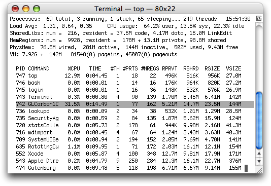
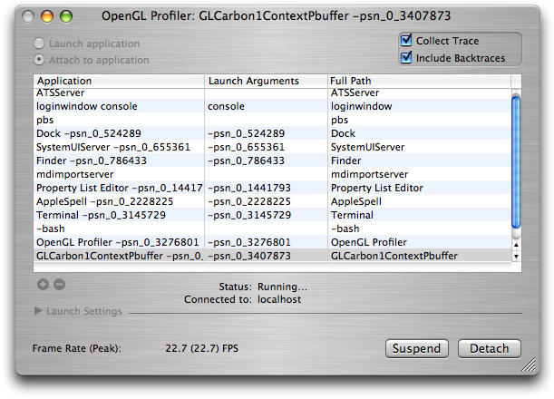
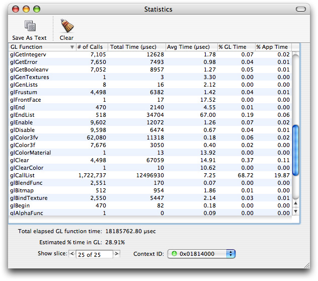
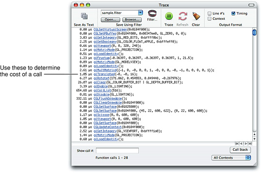
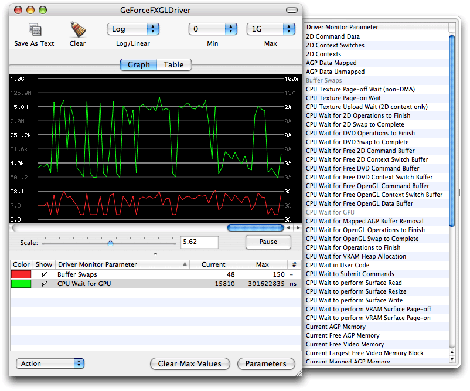

> 导航：[总目录](../../../README.md) · [documentation](../../../_indexes/documentation.md) · [OpenGL Programming Guide for Mac](About%20OpenGL%20for%20OS%20X.md)

[Next](Legacy%20OpenGL%20Functionality%20by%20Version.md)[Previous](Concurrency%20and%20OpenGL.md)

# Tuning Your OpenGL Application

After you design and implement your application, it is important that you spend some time analyzing its performance. The key to performance tuning your OpenGL application is to successively refine the design and implementation of your application. You do this by alternating between measuring your application, identifying where the bottleneck is, and removing the bottleneck.

If you are unfamiliar with general performance issues on the Macintosh platform, you will want to read _[Performance Overview](../../Performance/Performance%20Overview/Introduction.md#apple-f4xwc4dqnrsv64tfmyxwi33df52wszbpkridimbqgaytimjq)_. _[Performance Overview](../../Performance/Performance%20Overview/Introduction.md#apple-f4xwc4dqnrsv64tfmyxwi33df52wszbpkridimbqgaytimjq)_ contains general performance tips that are useful to all applications. It also describes most of the performance tools provided with OS X.

Next, take a close look at Instruments. Instruments consolidates many measurement tools into a single comprehensive performance-tuning application.

There are two tools other than OpenGL Profiler that are specific for OpenGL development—OpenGL Driver Monitor and OpenGL Shader Builder. OpenGL Driver Monitor collects real-time data from the hardware. OpenGL Shader Builder provides immediate feedback on vertex and fragment programs that you write.

For more information on these tools, see:

- [OpenGL for OS X](https://developer.apple.com/opengl/)
- _[Instruments User Guide](https://developer.apple.com/library/archive/documentation/DeveloperTools/Conceptual/InstrumentsUserGuide/index.html#//apple_ref/doc/uid/TP40004652)_
- _[Real world profiling with the OpenGL Profiler](https://developer.apple.com/library/archive/technotes/tn2178/_index.html#//apple_ref/doc/uid/DTS40007990)_
- _[OpenGL Driver Monitor User Guide](../OpenGL%20Driver%20Monitor%20User%20Guide/Introduction.md#apple-f4xwc4dqnrsv64tfmyxwi33df52wszbpkridimbqga3dinzu)_
- _[OpenGL Shader Builder User Guide](../OpenGL%20Shader%20Builder%20User%20Guide/Introduction.md#apple-f4xwc4dqnrsv64tfmyxwi33df52wszbpkridimbqga3dinzw)_

The following books contain many techniques for getting the most performance from the GPU:

- _GPU Gems: Programming Techniques, Tips and Tricks for Real Time Graphics_, Randima Fernando. In particular, _Graphics Pipeline Performance_ is a critical article for understanding how to find the bottlenecks in your OpenGL application.
- _GPU Gems 2: Programming Techniques for High-Performance Graphics and General-Purpose Computation_, Matt Pharr and Randima Fernando.

Analyzing performance is a systematic process that starts with gathering baseline data. OS X provides several applications that you can use to assess baseline performance for an OpenGL application:

- `top` is a command-line utility that you run in the Terminal window. You can use `top` to assess how much CPU time your application consumes.
- OpenGL Profiler is an application that determines how much time an application spends in OpenGL. It also provides function traces that you can use to look for redundant calls.
- OpenGL Driver Monitor lets you gather real-time data on the operation of the GPU and lets you look at information (OpenGL extensions supported, buffer modes, sample modes, and so forth) for the available renderers.

This section shows how to use `top` along with OpenGL Profiler to analyze where to spend your optimization efforts—in your OpenGL code, your other application code, or in both. You'll see how to gather baseline data and how to determine the relationship of OpenGL performance to overall application performance.

1. Launch your OpenGL application.
2. Open a Terminal window and place it side-by-side with your application window.
3. In the Terminal window, type `top` and press Return. You'll see output similar to that shown in Figure 15-1.

   The `top` program indicates the amount of CPU time that an application uses. The CPU time serves as a good baseline value for gauging how much tuning your code needs. Figure 15-1 shows the percentage of CPU time for the OpenGL application GLCarbon1C (highlighted). Note this application utilizes 31.5% of CPU resources.

   __Figure 15-1__  Output produced by the `top` application

   
4. Open the OpenGL Profiler application, located in `/Developer/Applications/Graphics Tools/`. In the window that appears, select the options to collect a trace and include backtraces, as shown in Figure 15-2.

   __Figure 15-2__  The OpenGL Profiler window

   
5. Select the option “Attach to application”, then select your application from the Application list.

   You may see small pauses or stutters in the application, particularly when OpenGL Profiler is collecting a function trace. This is normal and does not significantly affect the performance statistics. The glitches are due to the large amount of data that OpenGL Profiler is writing out.
6. Click Suspend to stop data collection.
7. Open the Statistics and Trace windows by choosing them from the Views menu.

   Figure 15-3 provides an example of what the Statistics window looks like. [Figure 15-4](#apple-f4xwc4dqnrsv64tfmyxwi33df52wszbpkridimbqgaytsobxfvbuqmrrgmwvgvzy) shows a Trace window.

   The estimated percentage of time spent in OpenGL is shown at the bottom of Figure 15-3. Note that for this example, it is 28.91%. The higher this number, the more time the application is spending in OpenGL and the more opportunity there may be to improve application performance by optimizing OpenGL code.

   You can use the amount of time spent in OpenGL along with the CPU time to calculate a ratio of the application time versus OpenGL time. This ratio indicates where to spend most of your optimization efforts.

   __Figure 15-3__  A statistics window

   
8. In the Trace window, look for duplicate function calls and redundant or unnecessary state changes.

   Look for back-to-back function calls with the same or similar data. These are areas that can typically be optimized. Functions that are called more than necessary include `glTexParameter`, `glPixelStore`, `glEnable`, and `glDisable`. For most applications, these functions can be called once from a setup or state modification routine and called only when necessary.

   It's generally good practice to keep state changes out of rendering loops (which can be seen in the function trace as the same sequence of state changes and drawing over and over again) as much as possible and use separate routines to adjust state as necessary.

   Look at the time value to the left of each function call to determine the cost of the call.

   __Figure 15-4__  A Trace window

   
9. Determine what the performance gain would be if it were possible to reduce the time to execute all OpenGL calls to zero.

   For example, take the performance data from the GLCarbon1C application used in this section to determine the performance attributable to the OpenGL calls.

   Total Application Time (from `top`) = 31.5%

   Total Time in OpenGL (from OpenGL Profiler) = 28.91%

   At first glance, you might think that optimizing the OpenGL code could improve application performance by almost 29%, thus reducing the total application time by 29%. This isn't the case. Calculate the theoretical performance increase by multiplying the total CPU time by the percentage of time spent in OpenGL. The theoretical performance improvement for this example is:

   `31.5 X .2891 = 9.11%`

   If OpenGL took no time at all to execute, the application would see a 9.11% increase in performance. So, if the application runs at 60 frames per second (FPS), it would perform as follows:

   `New FPS = previous FPS * (1 +(% performance increase)) = 60 fps *(1.0911) = 65.47 fps`

   The application gains almost 5.5 frames per second by reducing OpenGL from 28.91% to 0%. This shows that the relationship of OpenGL performance to application performance is not linear. Simply reducing the amount of time spent in OpenGL may or may not offer any noticeable benefit in application performance.

You can use OpenGL Driver Monitor to measure how long the CPU waits for the GPU, as shown in Figure 15-5. OpenGL Driver Monitor is useful for analyzing other parameters as well. You can choose which parameters to monitor simply by clicking a parameter name from the drawer shown in the figure.

__Figure 15-5__  The graph view in OpenGL Driver Monitor

[Next](Legacy%20OpenGL%20Functionality%20by%20Version.md)[Previous](Concurrency%20and%20OpenGL.md)

