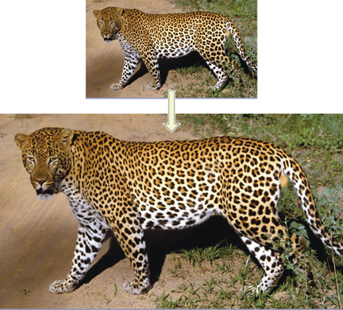
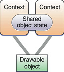
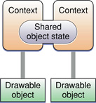

> 导航：[总目录](../../../README.md) · [documentation](../../../_indexes/documentation.md) · [OpenGL Programming Guide for Mac](About%20OpenGL%20for%20OS%20X.md)


[Next](Determining%20the%20OpenGL%20Capabilities%20Supported%20by%20the%20Renderer.md)[Previous](Choosing%20Renderer%20and%20Buffer%20Attributes.md)

# Working with Rendering Contexts

A rendering context is a container for state information. When you designate a rendering context as the current rendering context, subsequent OpenGL commands modify that context’s state, objects attached to that context, or the drawable object associated with that context. The actual drawing surfaces are never owned by the rendering context but are created, as needed, when the rendering context is actually attached to a drawable object. You can attach multiple rendering contexts to the same drawing surfaces. Each context maintains its own drawing state.

[Drawing to a Window or View](Drawing%20to%20a%20Window%20or%20View.md#apple-f4xwc4dqnrsv64tfmyxwi33df52wszbpkridimbqgaytsobxfvbuqnbqgqwvgvzy), [Drawing to the Full Screen](Drawing%20to%20the%20Full%20Screen.md#apple-f4xwc4dqnrsv64tfmyxwi33df52wszbpkridimbqgaytsobxfvbuqmrrgawvgvzw), and [Drawing Offscreen](Drawing%20Offscreen.md#apple-f4xwc4dqnrsv64tfmyxwi33df52wszbpkridimbqgaytsobxfvbuqnbqgmwvgvzs) show how to create a rendering context and attach it to a drawable object. This chapter describes advanced ways to interact with rendering contexts.

A renderer change can occur when the user drags a window from one display to another or when a display is attached or removed. Geometry changes occur when the display mode changes or when a window is resized or moved. If your application uses an `NSOpenGLView` object to maintain the context, it is automatically updated. An application that creates a custom view to hold the rendering context must track the appropriate system events and update the context when the geometry or display changes.

Updating a rendering context notifies it of geometry changes; it doesn't flush content. Calling an update function updates the attached drawable objects and ensures that the renderer is properly updated for any virtual screen changes. If you don't update the rendering context, you may see rendering artifacts.

The routine that you call for updating determines how events related to renderer and geometry changes are handled. For applications that use or subclass `NSOpenGLView`, Cocoa calls the `update` method automatically. Applications that create an `NSOpenGLContext` object manually must call the [update](https://developer.apple.com/documentation/appkit/nsopenglcontext/1436135-update) method of `NSOpenGLContext` directly. For a full-screen Cocoa application, calling the [setFullScreen](https://developer.apple.com/documentation/appkit/nsopenglcontext/1436221-setfullscreen) method of `NSOpenGLContext` ensures that depth, size, or display changes take affect.

Your application must update the rendering context after the system event but before drawing to the context. If the drawable object is resized, you may want to issue a `glViewport` command to ensure that the content scales properly.

It's important that you don't update rendering contexts more than necessary. Your application should respond to system-level events and notifications rather than updating every frame. For example, you'll want to respond to window move and resize operations and to display configuration changes such as a color depth change.

It's fairly straightforward to track geometry changes, but how are renderer changes tracked? This is where the concept of a virtual screen becomes important (see [Virtual Screens](OpenGL%20on%20the%20Mac%20Platform.md#apple-f4xwc4dqnrsv64tfmyxwi33df52wszbpkridimbqgaytsobxfvbuqmrqhawvgvzrgy)). A change in the virtual screen indicates a renderer change, a change in renderer capability, or both. When your application detects a window resize event, window move event, or display change, it should check for a virtual screen change and respond to the change to ensure that the current application state reflects any changes in renderer capabilities.

Each of the Apple-specific OpenGL APIs has a function that returns the current virtual screen number:

- The [currentVirtualScreen](https://developer.apple.com/documentation/appkit/nsopenglcontext/1436216-currentvirtualscreen) method of the `NSOpenGLContext` class
- The `CGLGetVirtualScreen` function

The virtual screen number represents an index in the list of virtual screens that were set up specifically for the pixel format object used for the rendering context. The number is unique to the list but is meaningless otherwise.

When the renderer changes, the limits and extensions available to OpenGL may also change. Your application should retest the capabilities of the renderer and use these to choose its rendering algorithms appropriately. See [Determining the OpenGL Capabilities Supported by the Renderer](Determining%20the%20OpenGL%20Capabilities%20Supported%20by%20the%20Renderer.md#apple-f4xwc4dqnrsv64tfmyxwi33df52wszbpkridimbqgaytsobxfvbuqmrrgewvgvzx).

If you subclass `NSView` instead of using the `NSOpenGLView` class, your application must update the rendering context. That's due to a slight difference between the events normally handled by the `NSView` class and those handled by the `NSOpenGLView` class. Cocoa does not call a `reshape` method for the `NSView` class when the size changes because that class does not export a `reshape` method to override. Instead, you need to perform reshape operations directly in your `drawRect:` method, looking for changes in view bounds prior to drawing content. Using this approach provides results that are equivalent to using the `reshape` method of the `NSOpenGLView` class.

Listing 7-1 is a partial implementation of a custom view that shows how to handle context updates. The `update` method is called after move, resize, and display change events and when the surface needs updating. The class adds an observer to the notification `NSViewGlobalFrameDidChangeNotification`, which is posted whenever an `NSView` object that has attached surfaces (that is, `NSOpenGLContext` objects) resizes, moves, or changes coordinate offsets.

It's slightly more complicated to handle changes in the display configuration. For that, you need to register for the notification `NSApplicationDidChangeScreenParametersNotification` through the `NSApplication` class. This notification is posted whenever the configuration of any of the displays attached to the computer is changed (either programmatically or when the user changes the settings in the interface).

__Listing 7-1__  Handling context updates for a custom view

```objc
#import <Cocoa/Cocoa.h>
#import <OpenGL/OpenGL.h>
#import <OpenGL/gl.h>

@class NSOpenGLContext, NSOpenGLPixelFormat;

@interface CustomOpenGLView : NSView
{
  @private
  NSOpenGLContext*   _openGLContext;
  NSOpenGLPixelFormat* _pixelFormat;
}

- (id)initWithFrame:(NSRect)frameRect
        pixelFormat:(NSOpenGLPixelFormat*)format;

- (void)update;
@end

@implementation CustomOpenGLView

- (id)initWithFrame:(NSRect)frameRect
        pixelFormat:(NSOpenGLPixelFormat*)format
{
  self = [super initWithFrame:frameRect];
  if (self != nil) {
    _pixelFormat   = [format retain];
  [[NSNotificationCenter defaultCenter] addObserver:self
                   selector:@selector(_surfaceNeedsUpdate:)
                   name:NSViewGlobalFrameDidChangeNotification
                   object:self];
  }
  return self;
}

- (void)dealloc
  [[NSNotificationCenter defaultCenter] removeObserver:self
                     name:NSViewGlobalFrameDidChangeNotification
                     object:self];
  [self clearGLContext];
}

- (void)update
{
  if ([_openGLContext view] == self) {
    [_openGLContext update];
  }
}

- (void) _surfaceNeedsUpdate:(NSNotification*)notification
{
  [self update];
}

@end
```


A rendering context has a variety of parameters that you can set to suit the needs of your OpenGL drawing. Some of the most useful, and often overlooked, context parameters are discussed in this section: swap interval, surface opacity, surface drawing order, and back-buffer size control.

Each of the Apple-specific OpenGL APIs provides a routine for setting and getting rendering context parameters:

- The [setValues:forParameter:](https://developer.apple.com/documentation/appkit/nsopenglcontext/1436199-setvalues) method of the `NSOpenGLContext` class takes as arguments a list of values and a list of parameters.
- The `CGLSetParameter` function takes as parameters a rendering context, a constant that specifies an option, and a value for that option.

Some parameters need to be enabled for their values to take effect. The reference documentation for a parameter indicates whether a parameter needs to be enabled. See _[NSOpenGLContext Class Reference](https://developer.apple.com/documentation/appkit/nsopenglcontext)_, and _CGL Reference_.

If the swap interval is set to `0` (the default), buffers are swapped as soon as possible, without regard to the vertical refresh rate of the monitor. If the swap interval is set to any other value, the buffers are swapped only during the vertical retrace of the monitor. For more information, see [Synchronize with the Screen Refresh Rate](OpenGL%20Application%20Design%20Strategies.md#apple-f4xwc4dqnrsv64tfmyxwi33df52wszbpkridimbqgaytsobxfvbuqmrnknlti).

You can use the following constants to specify that you are setting the swap interval value:

- For Cocoa, use `NSOpenGLCPSwapInterval`.
- If you are using the CGL API, use `kCGLCPSwapInterval` as shown in Listing 7-2.

__Listing 7-2__  Using CGL to set up synchronization

```
GLint sync = 1;
// ctx must be a valid context
CGLSetParameter (ctx, kCGLCPSwapInterval, &sync);
```


OpenGL surfaces are typically rendered as opaque. Thus the background color for pixels with alpha values of `0.0` is the surface background color. If you set the value of the _surface opacity_ parameter to `0`, then the contents of the surface are blended with the contents of surfaces behind the OpenGL surface. This operation is equivalent to OpenGL blending with a source contribution proportional to the source alpha and a background contribution proportional to `1` minus the source alpha. A value of `1` means the surface is opaque (the default); `0` means completely transparent.

You can use the following constants to specify that you are setting the surface opacity value:

- For Cocoa, use `NSOpenGLCPSurfaceOpacity`.
- If you are using the CGL API, use `kCGLCPSurfaceOpacity` as shown in Listing 7-3.

__Listing 7-3__  Using CGL to set surface opacity

```
GLint opaque = 0;
// ctx must be a valid context
CGLSetParameter (ctx, kCGLCPSurfaceOpacity, &opaque);
```


A value of `1` means that the position is above the window; a value of `–1` specifies a position that is below the window. When you have overlapping views, setting the order to `-1` causes OpenGL to draw underneath, `1` causes OpenGL to draw on top. This parameter is useful for drawing user interface controls on top of an OpenGL view.

You can use the following constants to specify that you are setting the surface drawing order value:

- For Cocoa, use [NSOpenGLCPSurfaceOrder](https://developer.apple.com/documentation/appkit/nsopenglcpsurfaceorder).
- If you are using the CGL API, use `kCGLCPSurfaceOrder` as shown in Listing 7-4.

__Listing 7-4__  Using CGL to set surface drawing order

```
GLint order = –1; // below window
// ctx must be a valid context
CGLSetParameter (ctx, kCGLCPSurfaceOrder, &order);
```


CGL provides two parameters for checking whether the system is using the GPU for processing: `kCGLCPGPUVertexProcessing` and `kCGLCPGPUFragmentProcessing`. To check vertex processing, pass the vertex constant to the `CGLGetParameter` function. To check fragment processing, pass the fragment constant to `CGLGetParameter`. Listing 7-5 demonstrates how to use these parameters.

__Listing 7-5__  Using CGL to check whether the GPU is processing vertices and fragments

```
BOOL gpuProcessing;
GLint fragmentGPUProcessing, vertexGPUProcessing;
CGLGetParameter (CGLGetCurrentContext(), kCGLCPGPUFragmentProcessing,
                                         &fragmentGPUProcessing);
CGLGetParameter(CGLGetCurrentContext(), kCGLCPGPUVertexProcessing,
                                         &vertexGPUProcessing);
gpuProcessing = (fragmentGPUProcessing && vertexGPUProcessing) ? YES : NO;
```


Normally, the back buffer is the same size as the window or view that it's drawn into, and it changes size when the window or view changes size. For a window whose size is 720×pixels, the OpenGL back buffer is sized to match. If the window grows to 1024×768 pixels, for example, then the back buffer is resized as well. If you do not want this behavior, use the _back buffer size control_ parameter.

Using this parameter fixes the size of the back buffer and lets the system scale the image automatically when it moves the data to a variable size buffer (see Figure 7-1). The size of the back buffer remains fixed at the size that you set up regardless of whether the image is resized to display larger onscreen.

You can use the following constants to specify that you are setting the surface backing size:

- If you are using the CGL API, use `kCGLCPSurfaceBackingSize`, as shown in Listing 7-6.

__Listing 7-6__  Using CGL to set up back buffer size control

```
GLint dim[2] = {720, 480};
// ctx must be a valid context
CGLSetParameter(ctx, kCGLCPSurfaceBackingSize, dim);
CGLEnable (ctx, kCGLCESurfaceBackingSize);
```


__Figure 7-1__  A fixed size back buffer and variable size front buffer



A rendering context does not own the drawing objects attached to it, which leaves open the option for sharing. Rendering contexts can share resources and can be attached to the same drawable object (see [Figure 7-2](#apple-f4xwc4dqnrsv64tfmyxwi33df52wszbpkridimbqgaytsobxfvbuqmrrgywvgvzt)) or to different drawable objects (see [Figure 7-3](#apple-f4xwc4dqnrsv64tfmyxwi33df52wszbpkridimbqgaytsobxfvbuqmrrgywvgvzs)). You set up context sharing—either with more than one drawable object or with another context—at the time you create a rendering context.

Contexts can share _object resources_ and their associated _object state_ by indicating a shared context at context creation time. Shared contexts share all texture objects, display lists, vertex programs, fragment programs, and buffer objects created before and after sharing is initiated. The state of the objects is also shared but not other context state, such as current color, texture coordinate settings, matrix and lighting settings, rasterization state, and texture environment settings. You need to duplicate context state changes as required, but you need to set up individual objects only once.

__Figure 7-2__  Shared contexts attached to the same drawable object



When you create an OpenGL context, you can designate another context whose object resources you want to share. All sharing is peer to peer. Shared resources are reference-counted and thus are maintained until explicitly released or when the last context-sharing resource is released.

Not every context can be shared with every other context. Both contexts must share the same OpenGL profile. You must also ensure that both contexts share the same set of renderers. You meet these requirements by ensuring each context uses the same virtual screen list, using either of the following techniques:

- Use the same pixel format object to create all the rendering contexts that you want to share.
- Create pixel format objects using attributes that narrow down the choice to a single display. This practice ensures that the virtual screen is identical for each pixel format object.

__Figure 7-3__  Shared contexts and more than one drawable object



Setting up shared rendering contexts is very straightforward. Each Apple-specific OpenGL API provides functions with an option to specify a context to share in its context creation routine:

- Use the `share` argument for the [initWithFormat:shareContext:](https://developer.apple.com/documentation/appkit/nsopenglcontext/1436178-initwithformat) method of the `NSOpenGLContext` class. See [Listing 7-7](#apple-f4xwc4dqnrsv64tfmyxwi33df52wszbpkridimbqgaytsobxfvbuqmrrgywvgvzrgm).
- Use the `share` parameter for the function `CGLCreateContext`. See [Listing 7-8](#apple-f4xwc4dqnrsv64tfmyxwi33df52wszbpkridimbqgaytsobxfvbuqmrrgywvgvzrgy).

Listing 7-7 ensures the same virtual screen list by using the same pixel format object for each of the shared contexts.

__Listing 7-7__  Setting up an `NSOpenGLContext` object for sharing

```objc
#import <Cocoa/Cocoa.h>
+ (NSOpenGLPixelFormat*)defaultPixelFormat
{
 NSOpenGLPixelFormatAttribute attributes [] = {
                    NSOpenGLPFADoubleBuffer,
                    (NSOpenGLPixelFormatAttribute)nil };
return [(NSOpenGLPixelFormat *)[NSOpenGLPixelFormat alloc]
                        initWithAttributes:attribs];
}

- (NSOpenGLContext*)openGLContextWithShareContext:(NSOpenGLContext*)context
{
     if (_openGLContext == NULL) {
            _openGLContext = [[NSOpenGLContext alloc]
                    initWithFormat:[[self class] defaultPixelFormat]
                    shareContext:context];
        [_openGLContext makeCurrentContext];
        [self prepareOpenGL];
            }
    return _openGLContext;
}

- (void)prepareOpenGL
{
     // Your code here to initialize the OpenGL state
}
```

Listing 7-8 ensures the same virtual screen list by using the same pixel format object for each of the shared contexts.

__Listing 7-8__  Setting up a CGL context for sharing

```c
#include <OpenGL/OpenGL.h>

CGLPixelFormatAttribute attrib[] = {kCGLPFADoubleBuffer, 0};
CGLPixelFormatObj pixelFormat = NULL;
Glint numPixelFormats = 0;
CGLContextObj cglContext1 = NULL;
CGLContextObj cglContext2 = NULL;
CGLChoosePixelFormat (attribs, &pixelFormat, &numPixelFormats);
CGLCreateContext(pixelFormat, NULL, &cglContext1);
CGLCreateContext(pixelFormat, cglContext1, &cglContext2);
```

[Next](Determining%20the%20OpenGL%20Capabilities%20Supported%20by%20the%20Renderer.md)[Previous](Choosing%20Renderer%20and%20Buffer%20Attributes.md)

