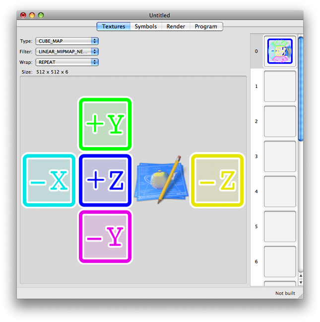
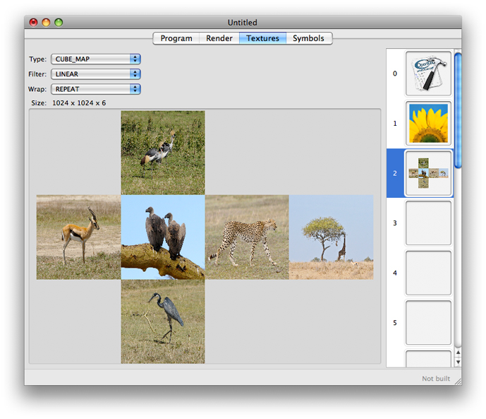
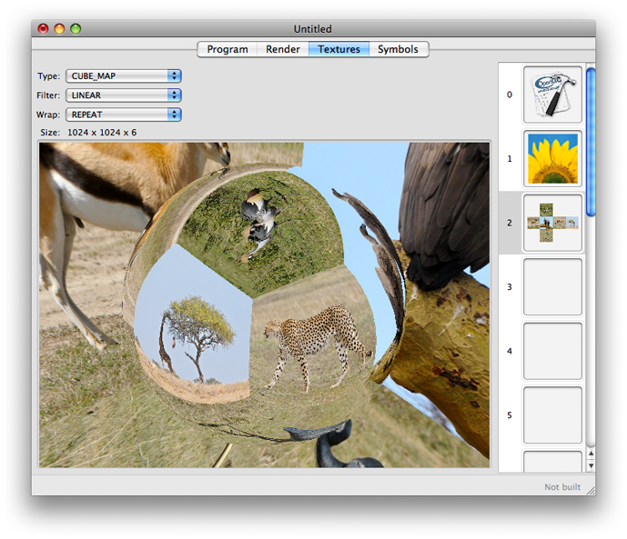
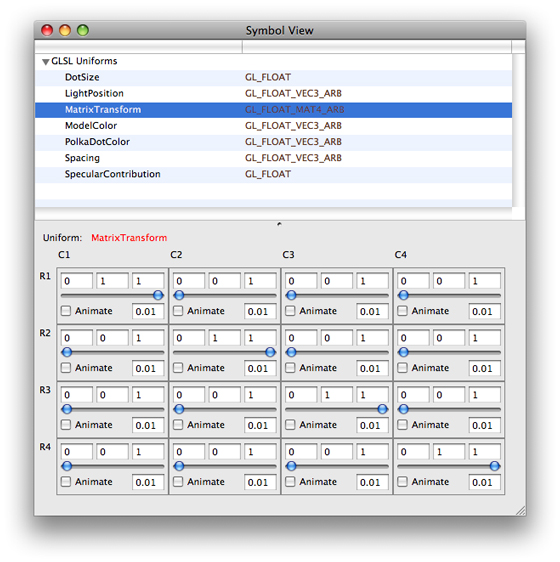

> 导航：[总目录](../../../README.md) · [documentation](../../../_indexes/documentation.md) · [OpenGL Shader Builder User Guide](Introduction.md)

[Next](Document%20Revision%20History.md)[Previous](Getting%20Started.md)

# Building Shaders

This chapter explains how to use OpenGL Shader Builder to set up projects, add shader code, add resources, and modify variables. Before reading this chapter, you should already be familiar with OpenGL and know how to write at least one of the following:

- ARB fragment and vertex programs. See the OpenGL extensions [GL_ARB_fragment_program](http://oss.sgi.com/projects/ogl-sample/registry/ARB/fragment_program.txt) and [GL_ARB_vertex_program](http://oss.sgi.com/projects/ogl-sample/registry/ARB/vertex_program.txt).
- GLSL fragment and vertex shaders. See [OpenGL Shading Language (PDF)](http://www.opengl.org/registry/doc/GLSLangSpec.Full.1.20.8.pdf).

OpenGL Shader Builder also supports geometry shaders, a recent addition to the OpenGL specification (see the OpenGL Extension [GL_NV_geometry_shader4](http://www.opengl.org/registry/specs/NV/geometry_shader4.txt)). Geometry shaders are not supported on all graphics cards. But because the Apple software renderer steps in as a fallback when necessary, you can use OpenGL Shader Builder to develop them.

A _project_ is the set of resources that make up one program—vertex, fragment, and geometry source files, and textures. As with any development environment, you can name and save projects. You can also have more than one project open at a time.

When you launch OpenGL Shader Builder, it opens to an empty, untitled project. To save the project, choose File > Save Project and enter a project name. A project can contain as many source files and textures as you’d like. Using the checkboxes in the file list, you can select which source files to make active.

A _layout_ specifies the location and number of windows that you want OpenGL Shader Builder to provide when you open new and existing projects.

To create and save a layout:

1. Launch OpenGL Shader Builder.
2. Double-click each tab whose view you want to open in a separate window.
3. Arrange the windows to suit your preference.
4. Choose Window > Save Layout.

Whenever you launch OpenGL Shader Builder, it automatically sets up the environment for you using your preferred layout.

To add a texture to the Textures view, drag the texture file to an image well. You can add any of these texture targets: `1D`, `2D`, `RECTANGLE`, `SHADOW_1D`, `SHADOW_2D`, and `SHADOW_RECTANGLE`.

To add a `3D` texture, you drag all the necessary files to an image well. The number of images in this texture target must be a power of 2 (2, 4, 8, 16, 32, and so on). Otherwise, OpenGL Shader Builder inserts a default image in the _z_ direction.

You can also drag `CUBE_MAP` textures to an image well, but because this texture targets require more than one file, you’ll first need to name the files so that OpenGL Shader Builder can place them properly. [Figure 2-1](#apple-f4xwc4dqnrsv64tfmyxwi33df52wszbpkridimbqga3dinzwfvbuqmznknltcmi) shows the layout that OpenGL Shader Builder uses for cube maps.

__Figure 2-1__  Cube face layout for a cube map

To add a cube map :

1. Name each texture file using a convention that specifies the location within the cube map or 3D texture.

   For cube maps, you can use any of the conventions listed in [Table 2-1](#apple-f4xwc4dqnrsv64tfmyxwi33df52wszbpkridimbqga3dinzwfvbuqmznknlts). For example, if the base filename for a cube map is `mycube`, you could name the texture files: `mycube_back`, `mycube_down`, `mycube_forward`, `mycube_left`, `mycube_right`, and `mycube_up`.
2. In the Finder, select the texture files and drag them to an image well.

__Table 2-1__  Naming conventions that map texture files to cube faces in a cube map

| X+ face | X– face | Y+ face | Y– face | Z+ face | Z– face |
| `posx` | `negx` | `posy` | `negy` | `posz` | `negz` |
| `xpos` | `xneg` | `ypos` | `yneg` | `zpos` | `zneg` |
| `right` | `left` | `top` | `down` | `front` | `back` |
| `rt` | `lf` | `up` | `dn` | `ft` | `bk` |
| `+x` | `–x` | `+y` | `–y` | `+z` | `–z` |

OpenGL Shader Builder provides two ways for you to view textures. The default view shows the texture data simply as a flat representation. The alternate view shows how the texture appears when applied to a target, using the filter and wrap modes that you choose. The alternate view is especially useful if you are unsure of how a particular filter or wrap mode will affect the outcome. You might also find the alternate view helpful to visualize 3D and cube maps.

The alternate view is particularly useful for cube maps. The default view in [Figure 2-2](#apple-f4xwc4dqnrsv64tfmyxwi33df52wszbpkridimbqga3dinzwfvbuqmznknltcmy) shows the “unfolded” cube, while the alternate view in [Figure 2-3](#apple-f4xwc4dqnrsv64tfmyxwi33df52wszbpkridimbqga3dinzwfvbuqmznknltcna) projects the cube faces in three dimensions.

To see the alternate view, double-click the texture.

__Figure 2-2__  The default view for a cube map

If you have not supplied multiple files for a cube map or 3D texture or if you’ve not used a location-based naming convention (see [Adding Textures](#apple-f4xwc4dqnrsv64tfmyxwi33df52wszbpkridimbqga3dinzwfvbuqmznknlte)), you’ll notice rectangles with a number or letters in them when you switch to alternate view.

__Figure 2-3__  The alternate view for a cube map

OpenGL Shader Builder automatically lists uniform variables from your source code in the Symbols view. How these uniform variable are displayed depend on the type of program. GLSL shaders use a shared symbol table for a single program object, so you’ll see the uniform variables appear in a single list . In contrast, ARB fragment and vertex programs have their own symbol table per pipeline state which are separated by local and environment variables per stage. Therefore ARB local and environment variables appear in separate lists.

The controls for a variable reflect that variable’s data type, no matter how complex the type (see [Figure 2-4](#apple-f4xwc4dqnrsv64tfmyxwi33df52wszbpkridimbqga3dinzwfvbuqmznknltcmq)). You can use the controls to manually change a value, or you can select Animate to automatically vary a uniform from one value to another. No matter which you choose, you will get immediate feedback by looking at the Render view as long as the auto compile and auto link options are enabled.

__Figure 2-4__  Controls for a matrix structure

To build a shader and make sure it runs correctly, follow these steps:

1. Open OpenGL Shader Builder.
2. Add shader source code.

   If you’ve already written the shader source files, click Add Shaders. Then, navigate to the files you want to add to the file list and choose them.

   If you want to enter the source code, choose File > New and then choose the type of shader you want to write. A source code file opens in its own window. You can modify the default code provided in the template.
3. Check the Link Log to make sure the programs linked successfully. You might also want to check the link results.

   By default, OpenGL Shader Builder has automatic linking enabled. If you disabled this feature, you’ll need to enable it or click the Link button.

   If the link fails, check to make sure that you added all necessary source files. For example, if you add a fragment or geometry program without adding the associated vertex program, linking fails.
4. In the Textures view, add any textures that are appropriate for your shader.

   You’ll most likely want to replace the default texture.
5. In the Symbol view, animate one or more of the uniform variables.
6. In the Render view, choose a geometry from the pop-up menu.

   You can drag the pointer to move the rendered image.

After your shader is running, you may want to benchmark its performance.

It’s a good idea to check the frame rate of your shader before and after you make adjustments to the code. You can measure the frame rate by following these steps:

1. In the Render view, click Benchmark.

   A benchmark window opens.
2. Enter the number of seconds for the benchmark test. Then, click Run.

   Note the elapsed time and the frames per second.

If you find the frame rate is much lower than you’d like, check to see if you are performing:

- Tasks inside a loop, such as setting state, that should really be performed outside the loop
- Complex calculations, such as arcsin. You can improve performance by pre-calculating results and storing them in a texture. Then, when you need a result, perform a texture look-up operation instead of the complex calculation.

After you are certain that your shader performs well in isolation, you should add it to your OpenGL application. Then, use OpenGL Profiler to make sure that your shader and the surrounding OpenGL application run as optimally as possible.

For information identifying and solving performance issues with OpenGL applications, see _[OpenGL Profiler User Guide](../OpenGL%20Profiler%20User%20Guide/Introduction.md#apple-f4xwc4dqnrsv64tfmyxwi33df52wszbpkridimbqga3dinzv)_.

Shaders can have validation errors for a number of reasons. You’ll want to be familiar with the OpenGL extensions that apply to the type of GPU program you are writing, because each extension outlines the conditions that can cause such errors. This section provides guidelines for a few of the common errors.

- Make sure that your code sets uniform variables for samplers at validation time.
- If your code depends on support for certain features, make sure you add a directive to require the appropriate extension, otherwise your code won’t parse.
- If a geometry shader fails, check to see whether any of the following apply:

  - The geometry program has no associated vertex program for supplying varying variables.
  - You used the wrong input or output types. Geometry shaders use fixed input and output primitive types.
  - The value of `GEOMETRY_VERTICES_OUT_EXT` is `0`.

You can sometimes troubleshoot errors by examining well-written code and comparing it to our own. You may want to look at the following:

- The _[GLSLShowpiece](../../../samplecode/GLSLShowpiece/GLSLShowpiece.md#apple-f4xwc4dqnrsv64tfmyxwi33df52wszbpirkfgmjqgaydgojtgu)_ and other sample code that’s available through the [ADC Reference Library](https://developer.apple.com/samplecode/GraphicsImaging/idxOpenGL-date.html).
- Sample code that’s available on [http://www.opengl.org/](http://www.opengl.org/code/).

[Next](Document%20Revision%20History.md)[Previous](Getting%20Started.md)

