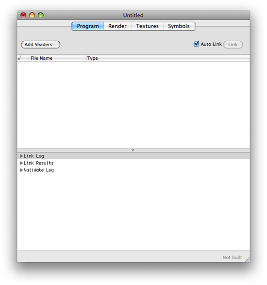
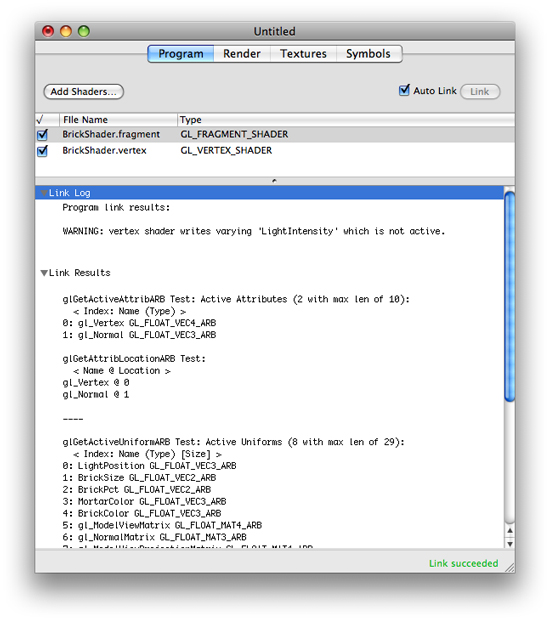
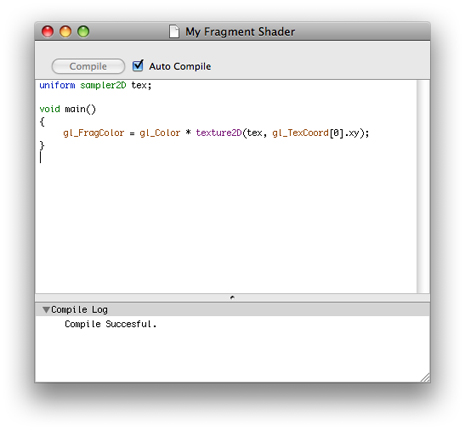
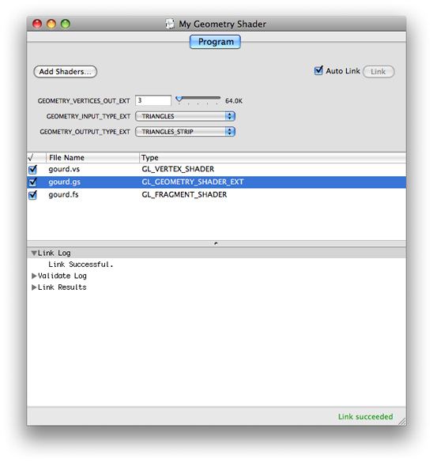
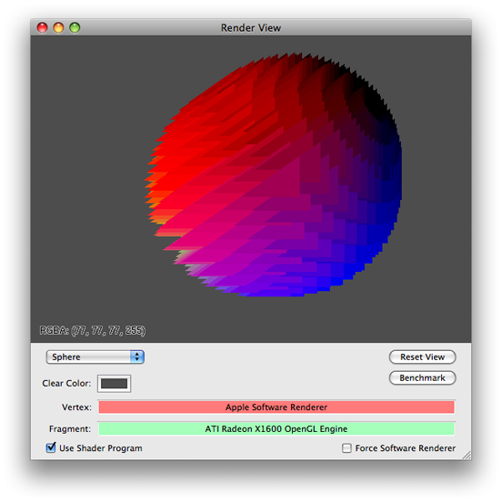
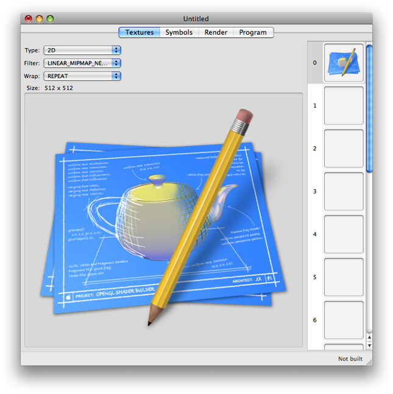
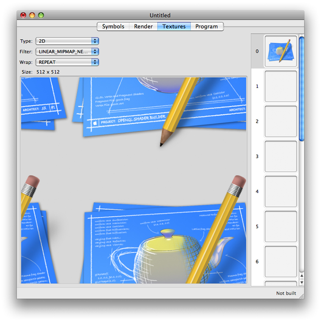
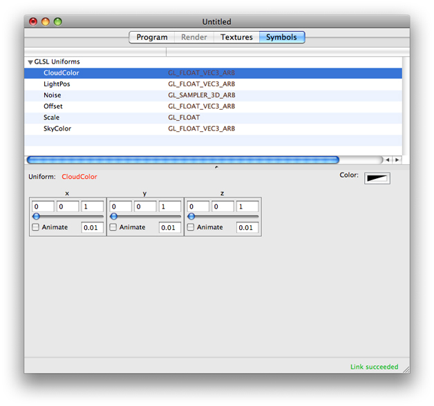

> 导航：[总目录](../../../README.md) · [documentation](../../../_indexes/documentation.md) · [OpenGL Shader Builder User Guide](Introduction.md)

[Next](Building%20Shaders.md)[Previous](Introduction.md)

# Getting Started

OpenGL Shader Builder is a development environment for writing, testing, and experimenting with OpenGL shaders. OpenGL Shader Builder not only speeds development for seasoned shader developers, but it can help those new to writing shaders to explore how shaders work. Using it, you can focus on the shader code; OpenGL Shader Builder takes care of the rest. You can use it to:

- Parse source code and check the syntax
- Compile and link source code files to create shader objects
- Change and animate the values of uniform variables
- Preview textures before applying them to an object
- Benchmark performance
- Enable and disable a shader so you can see its effect more clearly

Download the GraphicsTools app from [http://developer.apple.com/downloads](https://developer.apple.com/downloads).

If you’ve used OpenGL Shader Builder before, you’ll notice that the user interface for version 2.0 is a bit different from the previous version. Before you start using it, you’ll want to get acquainted with the four views it provides—Program, Render, Textures, and Symbols.

When you launch OpenGL Shader Builder, it opens to the Program view shown in [Figure 1-1](#apple-f4xwc4dqnrsv64tfmyxwi33df52wszbpkridimbqga3dinzwfvbuqmrnknlte). You use this view to manage source code files and to check linking and validation of the code.

__Figure 1-1__  The Program view

The top part of the view is used for listing source code filenames. You can add files in any of these ways:

- Drag previously created files to the window.
- Use the Add Shaders button to navigate and choose previously created files.
- Choose File > New > to create a new file for a GLSL program (vertex, fragment, geometry) or an ARB program (vertex, fragment).

[Figure 1-2](#apple-f4xwc4dqnrsv64tfmyxwi33df52wszbpkridimbqga3dinzwfvbuqmrnknltcma) shows the Program view after you’ve adding fragment and vertex source code files. The link log, link results, and validation log appear below the file list. The link status, which in this case is “Link succeeded,” appears in the lower-right corner of the window.

__Figure 1-2__  The Program view after adding two files

You can view and modify the contents of each source code file by double-clicking its name in the file list. The file opens in a new window, as shown in [Figure 1-3](#apple-f4xwc4dqnrsv64tfmyxwi33df52wszbpkridimbqga3dinzwfvbuqmrnknltcmi). When you create a new source code file, it opens automatically in a new document window. In contrast, new source code files open in a new document window automatically. These new source code files contain template code that you can modify or replace to suit your needs.

__Figure 1-3__  A source code file opens in a separate document window

A geometry shader object is made up of a geometry program and a vertex program. When you add the geometry source code file to the program list, the user interface changes (see [Figure 1-4](#apple-f4xwc4dqnrsv64tfmyxwi33df52wszbpkridimbqga3dinzwfvbuqmrnknltcni)) to show controls for the following OpenGL parameters, which the [GL_NV_geometry_shader4](http://www.opengl.org/registry/specs/NV/geometry_shader4.txt) extension defines:

- `GEOMETRY_VERTICES_OUT_EXT` is the maximum number of vertices produced by the geometry shader.
- `GEOMETRY_INPUT_TYPE_EXT` is the geometry that the shader takes as input: `POINTS`, `LINES`, `LINES_ADJACENCY_EXT`, `TRIANGLES`, or `TRIANGLES_ADJACENCY_EXT`.
- `GEOMETRY_OUTPUT_TYPE_EXT` is the geometry that the shader produces: `POINTS`, `LINE_STRIP`, or `TRIANGLE_STRIP`.

__Figure 1-4__  The Program view after adding a geometry shader

The Render view, shown in [Figure 1-5](#apple-f4xwc4dqnrsv64tfmyxwi33df52wszbpkridimbqga3dinzwfvbuqmrnknltg), visualizes what your code does. Although you can click the Render tab to switch between the Program and Render views, it’s more efficient to double-click the Render tab to open the view in a separate Render window. That way, you can look at the rendering results side-by-side with the contents of the Program, Textures, and Symbols views.

For details on customizing the layout of windows, see [Creating and Saving a Layout](Building%20Shaders.md#apple-f4xwc4dqnrsv64tfmyxwi33df52wszbpkridimbqga3dinzwfvbuqmznknltg).

__Figure 1-5__  The Render view

The pop-up menu lets you choose from among several geometries—Teapot Wire, Teapot Point, Plane, Teapot, Squiggle, Sphere, or Torus—to apply your code to. You can interact with any of the 3D geometries by clicking and dragging the pointer.

The Textures view, shown in [Figure 1-6](#apple-f4xwc4dqnrsv64tfmyxwi33df52wszbpkridimbqga3dinzwfvbuqmrnknlto), lets you add and set up textures to use as input to fragment programs. To add a texture, you simply drag it to one of the image wells on the right side of the view. When you select an image well, the texture appears on the left side of the view.

After selecting a texture, you can adjust any of the following by choosing the appropriate OpenGL constant from the provided pop-up menus:

- Texture types: `1D`, `2D`, `Rectangle`, `3D`, `Cube_MAP`, `SHADOW_1D`, `SHADOW_2D`, or `SHADOW_RECTANGLE`
- Methods of filtering: `NEAREST`, `LINEAR`, `NEAREST_MIPMAP_NEAREST`, `LINEAR_MIPMAP_NEAREST`, `NEAREST_MIPMAP_LINEAR`, or `LINEAR_MIPMAP_LINEAR`
- Wrapping modes: `REPEAT`, `CLAMP`, `CLAMP_TO_EDGE`, `CLAMP_TO_BORDER`, or `MIRRORED_REPEAT`

When you change the texture type, filter, or wrapping mode, you get immediate feedback on the effect. As a result, you’ll be able to compare filtering methods and wrapping modes easily.

__Figure 1-6__  The Textures view

You can get an idea of how OpenGL maps a texture to an object by looking an an alternate view of the texture. To see an alternate view, double-click the texture that appears in the view on the left. The default view is a flat representation of the texture without the wrapping mode. The alternate view maps the texture in the dimension of its type (1D, 2D, 3D, Cube) and applies the filtering and wrapping modes.

[Figure 1-7](#apple-f4xwc4dqnrsv64tfmyxwi33df52wszbpkridimbqga3dinzwfvbuqmrnknltcmq) is the alternate view for the texture shown in [Figure 1-6](#apple-f4xwc4dqnrsv64tfmyxwi33df52wszbpkridimbqga3dinzwfvbuqmrnknlto). This view shows the repeating pattern caused by choosing the `REPEAT` wrapping mode.

__Figure 1-7__  The Textures alternate view

For more details on working with textures, see [Adding Textures](Building%20Shaders.md#apple-f4xwc4dqnrsv64tfmyxwi33df52wszbpkridimbqga3dinzwfvbuqmznknlte) and [Using Alternate Texture Views](Building%20Shaders.md#apple-f4xwc4dqnrsv64tfmyxwi33df52wszbpkridimbqga3dinzwfvbuqmznknltk).

After you add shaders to the Program view, you can view its uniform variables in the Symbols view, as shown in [Figure 1-8](#apple-f4xwc4dqnrsv64tfmyxwi33df52wszbpkridimbqga3dinzwfvbuqmrnknlts). You can modify and animate GLSL uniform variables and ARB environment and local parameters.

__Figure 1-8__  The Symbols view

For more information, see [Modifying Uniform Variables](Building%20Shaders.md#apple-f4xwc4dqnrsv64tfmyxwi33df52wszbpkridimbqga3dinzwfvbuqmznknltcma).

[Next](Building%20Shaders.md)[Previous](Introduction.md)

