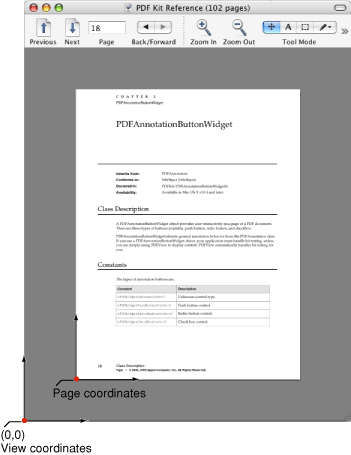
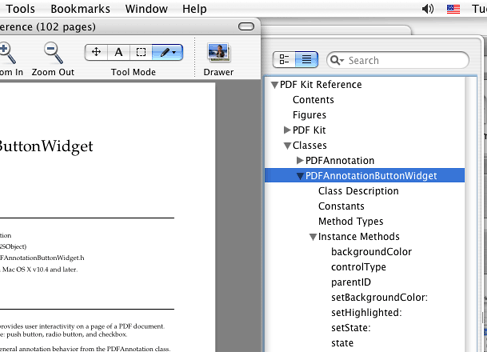
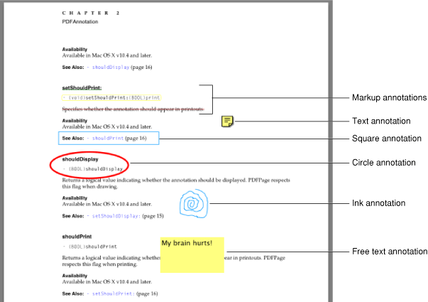
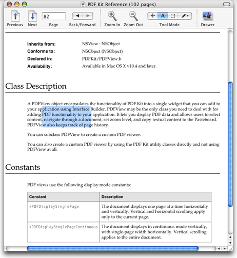
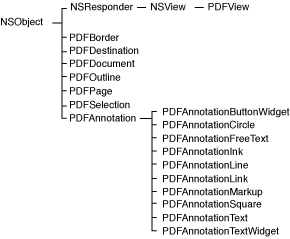
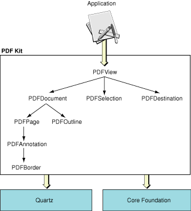

> 导航：[总目录](../../../README.md) · [documentation](../../../_indexes/documentation.md) · [PDFKit Programming Guide](Introduction%20to%20PDF%20Kit%20Programming%20Guide.md)

[Next](PDF%20Kit%20Tasks.md)[Previous](Introduction%20to%20PDF%20Kit%20Programming%20Guide.md)

# PDF Kit Concepts

This chapter gives an overview of PDF concepts and PDF Kit classes. If you are already familiar with the elements of a PDF document, you can skip [PDF Basics](#apple-f4xwc4dqnrsv64tfmyxwi33df52wszbpkridimbqgaytqnrtfvbuqmrqgewugscei5aumq2e) and go directly to [PDF Kit Classes](#apple-f4xwc4dqnrsv64tfmyxwi33df52wszbpkridimbqgaytqnrtfvbuqmrqgewugscejjbecssj).

A PDF is a document stored using Adobe Corporation’s Portable Document Format. The PDF specification, based on the PostScript drawing language, can describe almost any combination of text and images as well as interactive elements.

The basic building block of a PDF is the document itself. Within the document, you can have various pages and an outline. Within a page you can have text, annotations, and so on.

For detailed information about the PDF format, see the PDF specification, which you can download from:

[http://partners.adobe.com/public/developer/pdf/index_reference.html](http://partners.adobe.com/public/developer/pdf/index_reference.html)

Note that if you simply want to display PDF documents in your application, you generally don’t need the level of detail that the PDF specification provides.

The fundamental building block for a PDF is the document itself. The document is typically stored on disk as a file.

Documents support versioning and can be tagged with metadata such as the author, creation date, and so on.

A document can be encrypted, requiring a password to view it. Two levels of encryption exist:

- User level encryption: If the user successfully obtains user-level permissions, he or she can view the document but may be restricted from printing or copying the document.
- Owner-level encryption: A user who obtains owner-level permissions can view the document and has full usage permissions.

Many encrypted PDF documents have a “dummy” user password which is the empty string. Most PDF document parsers (including PDF Kit) automatically try the empty string password on encrypted documents, and if successful, simply display the document. Therefore, a document that is technically encrypted may not necessarily prompt the user for a password.

A PDF document consists of a number of pages. These are the metaphorical equivalent of pages in a physical book, and they are what the user sees onscreen. However, unlike a physical page, PDF pages can contain hyperlinks and annotations. Pages can support cropping as well, which can be useful if you want to hide extraneous portions (such as registration marks) during display.

Note that most objects on a page are specified in page space, rather than view space. That is, the coordinate system is in points (72 points per inch), with the origin at the bottom left of the page, not the view. Page space doesn’t care about zooming, display mode, and so on. An item that has bounds of, say 32 points square, retains those bounds regardless of display size. [Figure 1-1](#apple-f4xwc4dqnrsv64tfmyxwi33df52wszbpkridimbqgaytqnrtfvbuqmrqgewugsceirfeirsb) compares the two coordinate systems:

__Figure 1-1__  View space versus page space

The PDFView class contains a number of conversion methods to translate coordinates from view space to page space and vice versa.

An outline is like an interactive table of contents, showing the chapter or structure hierarchy of the document. Outlines make it easy for users to see the structure of a document and to jump to a particular location.

__Figure 1-2__  An outline for a PDF document

Not all PDF documents contain an outline.

Annotations are “extra” elements that can appear on a PDF page in addition to the standard text and images. Some annotations merely add visual features, such as lines, circles, and such, while others can have some interactive behavior.

Some examples of annotations include:

- “Sticky notes” displaying text.
- Note icons that can display text when clicked upon.
- Editable text fields that can accept user text.
- Buttons, such as checkboxes. Such annotations, along with editable text fields, may be useful in forms to be filled out by the user.
- Circles, arbitrary lines, and boxes.
- Links to other documents, or to other sections within a document.
- Highlighting, strike-throughs, and other text markups.

[Figure 1-3](#apple-f4xwc4dqnrsv64tfmyxwi33df52wszbpkridimbqgaytqnrtfvbuqmrqgewugsceiveueqsh) shows some annotation types available in PDF Kit.

__Figure 1-3__  Some annotations available in PDF Kit

These are the annotations that PDF Kit supports and can display in documents. However, PDF Kit can also support additional annotation types if they are specified using appearance streams. Appearance streams let you draw based on a drawing sequence rather than a specification based on a particular annotation type. For example, rather than specify “a circle annotation with a 20 point radius,” an appearance stream would simply contain instructions for drawing a circle of that size.

Annotations often have content associated with them that your application can display. For example, text annotations typically appear as an icon in the PDF; when the user clicks on it, a window can open displaying its text.

Note that PDF Kit does not supply a mechanism for displaying the annotation content; your application must create a window to display the content when the user clicks on an annotation.

PDF documents let the user select blocks of text, much like word processing applications. However, they offer greater flexibility in that text selections do not have to be linearly contiguous. For example, using PDF Kit, you could select a block of text within a page that doesn’t have to be sequential, as shown in [Figure 1-4](#apple-f4xwc4dqnrsv64tfmyxwi33df52wszbpkridimbqgaytqnrtfvbuqmrqgewugsceivduussg) Such selections can be useful if the document contains multicolumn pages, tables, or other unusual formatting.

__Figure 1-4__  Arbitrary text selection in a PDF document

You can experiment with block selection by holding down the Option key while selecting text in Preview (in OS X v10.4 and later).

Selections are stored as selection objects, which also store additional data such as the page or pages containing the selection. This information is useful when presenting multiple selections to the user (for example, a list of search results).

PDF Kit is divided into a number of different classes. With the exception of PDFView and PDFSelection, these classes correspond roughly to various objects in the PDF specification.

__Figure 1-5__  The PDF Kit class hierarchy

The PDFView class, like the Web Kit WebView class, derives from the Application Kit NSView class. You can use a PDFView object directly in your application simply by placing it in a window using Interface Builder. Get the palette from `/Developer/Extras/Palettes/PDFKit.palette`.

PDFView may be the only PDF Kit class that you need to deal with. It lets you display PDF data in your application and allows users to select content and navigate through a document, set the zoom level, and copy textual content to the Pasteboard. Users can also drag-and-drop documents into PDFView.

PDFView calls upon the PDF utility classes to implement much of its functionality. If you want to add special features, you need to use or subclass from the utility classes.

__Figure 1-6__  Utility classes as used by PDFView

The PDF Kit utility classes offer a mix of Foundation-like and Application Kit-like behavior. They are analogous to the NSString class, and its NSString Additions methods, in that many of them support drawing. These classes are subclasses of NSObject, as shown in [Figure 1-5](#apple-f4xwc4dqnrsv64tfmyxwi33df52wszbpkridimbqgaytqnrtfvbuqmrqgewugsceizbuiqke).

The primary PDF Kit utility class is PDFDocument, which represents PDF data or a PDF file. The other utility classes are either instantiated from methods in PDFDocument, as are PDFPage and PDFOutline; or support it, as do PDFSelection and PDFDestination.

You initialize a PDFDocument object with PDF data or with a URL to a PDF file. You can then ask for the page count, add or delete pages, perform a find, or parse selected content into an NSString object.

As you might expect, the PDFPage class represents pages in a PDF document. Your application instantiates a PDFPage object by asking for one from a PDFDocument object. PDF page objects are what the user sees onscreen, and a view may display more than one page at a time. You can use PDFPage to render PDF content onscreen, add annotations, count characters, define selections, and get the textual content of a page as an NSString or NSAttributedString object.

In addition to displaying the actual document content, PDF Kit can also present outline information if that is included in the PDF. A PDFOutline object represents a parent or child element in an outline hierarchy.

Outlines are composed of a hierarchy of PDFOutline objects. The top level is the root outline object, which acts only as a container for other outline objects. The root outline is invisible to the user.

A PDFSelection object encompasses a span of text in a PDF document. You don’t create PDF selections directly. You get PDFSelection objects as return values from selection methods that you invoke on PDFPage or PDFDocument objects, and as the return values from successful searches.

Selections on a PDF view may span multiple pages, may be noncontiguous, or both. For example, you can select the text in a single column of consecutive two-column pages. You can get the text and pages covered from a selection, combine selections, or extend selections in either direction.

A PDFAnnotation object can represent a variety of content other than the primary textual content in a PDF file: links, form elements, highlighting circles, and so on. Each annotation is associated with a specific location on a page, and may offer interactivity with the user.

PDFAnnotation is an abstract superclass of the concrete classes shown in [Figure 1-3](#apple-f4xwc4dqnrsv64tfmyxwi33df52wszbpkridimbqgaytqnrtfvbuqmrqgewugsceiveueqsh). The various concrete classes represent annotation types that PDF Kit supports.

PDFBorder objects encapsulate the drawing behavior for the border of a PDFAnnotation object. A PDF border lets you specify such attributes as line style (for example, solid, dashed, or beveled), line width, and corner radius.

[Next](PDF%20Kit%20Tasks.md)[Previous](Introduction%20to%20PDF%20Kit%20Programming%20Guide.md)

