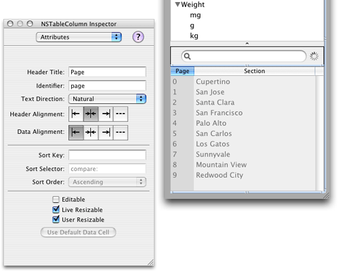

> 导航：[总目录](../../../README.md) · [documentation](../../../_indexes/documentation.md) · [PDFKit Programming Guide](Introduction%20to%20PDF%20Kit%20Programming%20Guide.md)


[Next](Document%20Revision%20History.md)[Previous](PDF%20Kit%20Concepts.md)

# PDF Kit Tasks

This chapter shows how you can implement common tasks with PDF Kit.

Most developers will simply want to display PDF information in their views, so PDFView will fit the bill nicely.

A PDFView user interface element is available in Interface Builder, so you should use that wherever you want your application to display PDF content. Note that you need to install the PDF Kit palette in `/Developer/Extras/Palettes/PDFKit.palette` to make PDFViews available.

To add the PDFKit palette in Interface Builder, select the Palettes tab in the Preferences panel. Click the Add… button, navigate to the `/Developer/Extras/Palettes` folder, and select the PDFKit palette. Next, select the Customize Toolbar menu item in the Tools/Palettes menu and drag the PDFKit palette to the toolbar to make it visible.

After adding the PDFView element in your nib file, you can add PDF content from your application by calling the PDFDocument method `initWithURL`. For example, you could use code like the following:

```
PDFDocument *pdfDoc;

pdfDoc = [[PDFDocument alloc] initWithURL: [NSURL fileURLWithPath: [self fileName]]];
[_pdfView setDocument: pdfDoc];
```

Alternatively, if your PDF data is stored in a different form, you can use the PDFDocument method `initWithData:`. Users can also drag-and-drop documents into the view.

The resulting PDFView handles the basic functionality required to view and navigate through a PDF document. Simple scrolling and live links work automatically, and you also get a contextual menu to handle scaling and navigation.

Preview in OS X v10.4 uses PDF Kit, so you can use this application as a guide to see what is possible in your own PDF views. Many method calls in PDF Kit have a comparable menu item in Preview. [Table 2-1](#apple-f4xwc4dqnrsv64tfmyxwi33df52wszbpkridimbqgaytqnrtfvbuqmrqgiwueqkcjfceeq2f) shows the correspondance between the various menu items and their API equivalents.

__Table 2-1__  Preview Menu Items versus PDF Kit methods

| Menu | Submenu | Method |
| View | PDF Display | PDFView: `- setDisplayMode:` and `- setDisplayBox:` |
|  | Zoom In | PDFView: `- zoomIn:` |
|  | Zoom Out | PDFView: `- zoomOut:` |
| Go | Next | PDFView: `- goToNextPage:` |
|  | Previous | PDFView: `- goToPreviousPage:` |
|  | Go to Page | PDFView: `- goToPage:` |
|  | First | PDFView: `- goToFirstPage:` |
|  | Last | PDFView: `- goToLastPage:` |
|  | Back | PDFView: `- goBack:` |
|  | Forward | PDFView: `- goForward:` |
| Tools | Rotate Left | PDFPage: `- setRotation:` to `- rotation` -90 |
|  | Rotate Right | PDFPage: `- setRotation:` to `- rotation` +90 |
|  | Annotation | `initWithBounds:`for the appropriate annotation subclass (such as PDFAnnotationCircle) |

Many PDF documents contain outlines, so your application will usually want to display this information as well.

Note that because some PDF documents do not contain outline information, you should probably make the outline display an optional element in your user interface. For example, you can display outlines in a drawer, which can be closed if not needed.

You can use the NSOutlineView class to display your PDF outlines. Instances of this class automatically display the outline hierarchy with disclosure triangles and live links to the appropriate PDF pages. [Listing 2-1](#apple-f4xwc4dqnrsv64tfmyxwi33df52wszbpkridimbqgaytqnrtfvbuqmrqgiwueqkci5euqrsk) shows how you might do so.

__Listing 2-1__  Loading PDF outline information

```
_outline = [[_pdfView document] outlineRoot];// 1
    if (_outline)
    {
        [_noOutlineText removeFromSuperview];// 2
        _noOutlineText = NULL;

        [_outlineView reloadData];// 3
    }
    else
    {
        [[_outlineView enclosingScrollView] removeFromSuperview];// 4
        _outlineView = NULL;
    }
```

Here is how the code works:

1. Obtains the root (topmost) outline element. `_outline` is an instance of PDFOutline.
2. If a root outline exists, removes placeholder text indicating “No Outline.”
3. Loads PDF outline information into the outline view. The outline view calls your delegate methods to determine the elements in the outline hierarchy.
4. If the root outline does not exist, removes the outline view, leaving behind placeholder text.

After you invoke the `reloadData` method, the outline view calls various data source delegate methods to populate the outline. These delegate methods are defined in the NSOutlineViewDataSource protocol. Your application must implement these methods so that the proper PDF data is added to the outline.

[Listing 2-2](#apple-f4xwc4dqnrsv64tfmyxwi33df52wszbpkridimbqgaytqnrtfvbuqmrqgiwueqkcjbbeiqke) shows the delegate method for obtaining the number of children, which simply returns the value obtained by the PDFOutline method `numberOfChildren`. If the item parameter is `NULL`, this method returns the number of children for the root outline.

__Listing 2-2__  Delegate method for determining the number of children

```objc
- (int) outlineView: (NSOutlineView *) outlineView numberOfChildrenOfItem: (id) item
{
    if (item == NULL)
    {
        if (_outline)
            return [_outline numberOfChildren];
        else
            return 0;
    }
    else
        return [(PDFOutline *)item numberOfChildren];
}
```

[Listing 2-3](#apple-f4xwc4dqnrsv64tfmyxwi33df52wszbpkridimbqgaytqnrtfvbuqmrqgiwueqkcircemqsj) shows the delegate method for obtaining a particular child outline by calling the PDFOutline method `childAtIndex`. If the item parameter is `NULL`, this method returns the appropriate child of the root outline.

__Listing 2-3__  Delegate method for obtaining a child element

```objc
- (id) outlineView: (NSOutlineView *) outlineView child: (int) index ofItem: (id) item
{
    if (item == NULL)
    {
        if (_outline)
            return [_outline childAtIndex: index];
        else
            return NULL;
    }
    else
        return [(PDFOutline *)item childAtIndex: index];
```

[Listing 2-4](#apple-f4xwc4dqnrsv64tfmyxwi33df52wszbpkridimbqgaytqnrtfvbuqmrqgiwueqkcijcuqssk) shows a delegate method for determining if an outline element is expandable (that is, whether it has child outlines).

__Listing 2-4__  Delegate method for determining if an element has children

```objc
- (BOOL) outlineView: (NSOutlineView *) outlineView isItemExpandable: (id) item
{
    if (item == NULL)
    {
        if (_outline)
            return ([_outline numberOfChildren] > 0);
        else
            return NO;
    }
    else
        return ([(PDFOutline *)item numberOfChildren] > 0);
}
```

[Listing 2-5](#apple-f4xwc4dqnrsv64tfmyxwi33df52wszbpkridimbqgaytqnrtfvbuqmrqgiwueqkcincecqkd) shows a delegate method for obtaining an outline element’s label, which calls the PDFOutline method `label`. The label is simply the string that is displayed in the outline view (for example, a chapter title).

__Listing 2-5__  Delegate method for obtaining an element’s contents

```objc
- (id) outlineView: (NSOutlineView *) outlineView
        objectValueForTableColumn: (NSTableColumn *) tableColumn
        byItem: (id) item
{
    return [(PDFOutline *)item label];
}
```

When the user selects an outline element, your application should update the PDF display to show the page corresponding to that element. The simplest way to do so is to call the PDFView’s `goToDestination` method, as shown in [Listing 2-6](#apple-f4xwc4dqnrsv64tfmyxwi33df52wszbpkridimbqgaytqnrtfvbuqmrqgiwugscejbduerch).

__Listing 2-6__  Displaying the page associated with an outline element

```objc
- (IBAction) takeDestinationFromOutline: (id) sender
{
    [_pdfView goToDestination: [[sender itemAtRow:
                                [sender selectedRow]] destination]];
}
```

In addition, if the user scrolls or otherwise moves through the document, your application should update the outline to highlight the outline element that corresponds to the currently displayed page. You can do so by installing a notification handler to be called each time the page changes (that is, when PDFViewPageChangedNotification is posted). [Listing 2-7](#apple-f4xwc4dqnrsv64tfmyxwi33df52wszbpkridimbqgaytqnrtfvbuqmrqgiwugscejfeucskk) hows how you might do so.

__Listing 2-7__  Updating the outline when the page changes

```objc
- (void) pageChanged: (NSNotification *) notification
{
    unsigned int    newPageIndex;
    int             numRows;
    int             i;
    int             newlySelectedRow;

    if ([[_pdfView document] outlineRoot] == NULL)// 1
        return;

    newPageIndex = [[_pdfView document] indexForPage: // 2
                                            [_pdfView currentPage]];

    // Walk outline view looking for best firstpage number match.
    newlySelectedRow = -1;
    numRows = [_outlineView numberOfRows];
    for (i = 0; i < numRows; i++)// 3
    {
        PDFOutline  *outlineItem;

        // Get the destination of the given row....
        outlineItem = (PDFOutline *)[_outlineView itemAtRow: i];

        if ([[_pdfView document] indexForPage:
                    [[outlineItem destination] page]] == newPageIndex)
        {
            newlySelectedRow = i;
            [_outlineView selectRow: newlySelectedRow
                                        byExtendingSelection: NO];
            break;
        }
        else if ([[_pdfView document] indexForPage:
                    [[outlineItem destination] page]] > newPageIndex)
        {
            newlySelectedRow = i - 1;
            [_outlineView selectRow: newlySelectedRow
                                        byExtendingSelection: NO];
            break;
        }
    }

    if (newlySelectedRow != -1)// 4
        [_outlineView scrollRowToVisible: newlySelectedRow];
}
```

Here is how the code works:

1. Checks to see if a root outline exists. If not, then there is no outline to update, so simply return.
2. Obtains the index value for the current page. The PDFView method `currentPage` returns the PDFPage object, and the PDFDocument method `indexForPage` returns the actual index for that page. This index value is zero-based, so it doesn’t necessarily correspond to a page number.
3. Iterate through each visible element in the outline, checking to see if one of the following occurs:

   - The index of an outline element matches the index of the new page. If so, highlight this element (using the NSTableView method `selectRow:byExtendingSelection`).
   - The index of the outline element is larger than the index of the page. If so, a match was not possible as the index corresponds to a hidden child of a visible element. In this case, use `selectRow` to highlight the parent outline element (the current row -1 ).
4. Call the NSTableView method `scrollRowToVisible` to adjust the outline view (if necessary) to make the highlighted element visible.

Users often need to search through a PDF document. PDF Kit offers two methods for doing so:

- Searching string-by-string through the document. That is, when the user searches for _string_, PDF Kit returns the first occurrence of the string. Additional searches (“Find Again”) return successive instances of _string_. This search method is synchronous.
- Obtaining a listing of all occurrences of _string_ in a document. This search method may be synchronous or asynchronous.

For simple string-by-string searching, your application can simply call the PDFDocument method `findString:fromSelection:withOptions:`.

```objc
- (PDFSelection *) findString:(NSString *)string
         fromSelection:PDFSelection *selection:withOptions:(int)options
```

To display the selection returned, you can call the PDFView method `setCurrentSelection`, which highlights the selection, followed by `scrollSelectionToVisible`.

You can specify the following options:

- `NSCaseInsensitiveSearch`: Ignore case when making a match.
- `NSLiteralSearch`: Search for contiguous words, separated by spaces.
- `NSBackwardsSearch`: Search backwards from the current selection.

By passing `NULL` for the selection, you can begin the search from the beginning (or end) of the document. By passing the most recent match for the selection, you can implement “Find Again” behavior. If the `findString` call returns `NULL`, that means that either the string was not found, or the search reached the end (or beginning) of the document.

To obtain all the occurrences of a given string, you can use either of the following PDFDocument methods:

- `findString:withOptions:` to synchronously obtain an NSArray object holding all the matches
- `beginFindString:withOptions:` to asynchronously begin a search for all occurrences. PDF Kit calls your delegate method each time a match is found.

Unless you are sure that the search will be brief, you should choose to use `beginFindString:withOptions:`

As this is an asynchronous search, PDFDocument includes two other useful find-related methods:

- `isFinding` to determine if a search in currently in progress
- `cancelFindString` to terminate a current search.

[Listing 2-8](#apple-f4xwc4dqnrsv64tfmyxwi33df52wszbpkridimbqgaytqnrtfvbuqmrqgiwueqkcjjdekqsi) shows how you might initiate a search:

__Listing 2-8__  Beginning an asynchronous search

```objc
- (void) doFind: (id) sender
{
    if ([[_pdfView document] isFinding])// 1
        [[_pdfView document] cancelFindString];

    if (_searchResults == NULL)// 2
        _searchResults = [NSMutableArray arrayWithCapacity: 10];

    [[_pdfView document] beginFindString: [sender stringValue] // 3
                withOptions: NSCaseInsensitiveSearch];
}
```

Here is how the code works:

1. Cancels any current searches.
2. Allocates a mutable array to hold the search results if one does not already exist.
3. Calls the PDFDocument method `beginFindString:withOptions:` with the desired search string.

During the search, PDF Kit sends out notifications that your application can react to:

- PDFDocumentDidBeginFindNotification
- PDFDocumentDidEndFindNotification
- PDFDocumentDidBeginPageFindNotification
- PDFDocumentDidEndPageFindNotification
- PDFDocumentDidFindMatchNotification

The first two notifications are sent when the search starts, or finishes a search. You can use these notifications to set up and remove progress bars or any other initializations.

The begin and end page notifications are sent when the search begins or ends searching a page in the document. You can use these notifications to update a progress bar or page counter.

The find match notification is sent whenever a match is found for the search string. Typically you will want to obtain the string selection and store it in an array for later display. However, in most cases it may be easier to use the PDFDocument delegate method `didMatchString`, which automatically passes you the matching selection. [Listing 2-9](#apple-f4xwc4dqnrsv64tfmyxwi33df52wszbpkridimbqgaytqnrtfvbuqmrqgiwugsceijcuusch) shows how you might implement a delegate to take each matching string and add it to an array of search results in an NSTableView.

__Listing 2-9__  Adding search results to a table view

```objc
- (void) didMatchString: (PDFSelection *) instance
{
    // Add page label to our array.
    [_searchResults addObject: [instance copy]];

    // Force a reload.
    [_searchTable reloadData];
}
```

Here `_searchResults` is an instance of NSMutableArray, and `_searchTable` is an instance of NSTableView.

To make sure that the NSTableView displays the search results correctly, you need to implement delegate data source methods (similar to those required for NSOutlineView). These delegate methods are defined in the NSTableDataSource protocol.

[Listing 2-10](#apple-f4xwc4dqnrsv64tfmyxwi33df52wszbpkridimbqgaytqnrtfvbuqmrqgiwugsceivbuercb) shows a delegate method for determining the number of rows in the table view. This method simply obtains the number of items in the search results by calling the NSMutableArray method `count`.

__Listing 2-10__  Determining the number of rows in the table

```objc
- (int) numberOfRowsInTableView: (NSTableView *) aTableView
{
    return ([_searchResults count]);
}
```

[Listing 2-11](#apple-f4xwc4dqnrsv64tfmyxwi33df52wszbpkridimbqgaytqnrtfvbuqmrqgiwugsceijeumrsk) shows a delegate data source method for obtaining the value of a particular column.

__Listing 2-11__  Obtaining the value for a column

```objc
- (id) tableView: (NSTableView *) aTableView objectValueForTableColumn:
            (NSTableColumn *) theColumn
            row: (int) rowIndex
{
    if ([[theColumn identifier] isEqualToString: @"page"])
        return ([[[[_searchResults objectAtIndex: rowIndex] pages]
                     objectAtIndex: 0] label]);
    else if ([[theColumn identifier] isEqualToString: @"section"])
    {
        NSString    *label = [[[_pdfView document] outlineItemForSelection:
                         [_searchResults objectAtIndex: rowIndex]] label];
        return label;
    }
    else
        return NULL;
}
```

The table view calls this method whenever it needs to determine the value of a particular table element (such as when preparing the table for display).

The search results table in this example contains only two columns: the page containing the hit and the outline section that contains the hit. (In a more sophisticated example, you may want to display a portion of the text containing the matching string, as Preview does.) You reference these columns using the identifier tags you specified for them in the NSTableColumn inspector window in Interface Builder (as shown in [Figure 2-1](#apple-f4xwc4dqnrsv64tfmyxwi33df52wszbpkridimbqgaytqnrtfvbuqmrqgiwugsceizbumq2k)).

__Figure 2-1__  Assigning column identifiers in Interface Builder



For this example:

- If the column identifier is “page,” return the page number of the hit by calling the PDFSelection method `pages`.
- If the column identifier is “section,” return the outline label for the selection by calling the PDFDocument method `outlineItemForSelection`.

When the user selects an item in the search results, your application should display the corresponding page. [Listing 2-12](#apple-f4xwc4dqnrsv64tfmyxwi33df52wszbpkridimbqgaytqnrtfvbuqmrqgiwueqkci5dukscc) shows how you might do so using an NSTableView notification.

__Listing 2-12__  Handling a selection in the table

```objc
- (void) tableViewSelectionDidChange: (NSNotification *) notification
{
    int rowIndex;

    // What was selected.  Skip out if the row has not changed.
    rowIndex = [(NSTableView *)[notification object] selectedRow];// 1
    if (rowIndex >= 0)
    {
        [_pdfView setCurrentSelection: // 2
                    [_searchResults objectAtIndex: rowIndex]];
        [_pdfView scrollSelectionToVisible: self];// 3
    }
}
```

A table view sends the NSTableViewSelectionDidChangeNotification when an item is selected, and calls your delegate method `tableViewSelectionDidChange`. Here is how the code works:

1. Checks to see if the selection is valid.
2. Sets the current selection to the one that the user clicked.
3. Updates the PDF view to show the page containing the selection.

For more information about implementing these delegate methods, see _[Table View Programming Guide for Mac](../../Cocoa/Table%20View%20Programming%20Guide%20for%20Mac/About%20Table%20Views%20in%20OS%20X%20Applications.md#apple-f4xwc4dqnrsv64tfmyxwi33df52wszbpgeydambqgazdm2i)_ in Cocoa User Experience Documentation.

[Next](Document%20Revision%20History.md)[Previous](PDF%20Kit%20Concepts.md)

