> 导航：[总目录](../../../README.md) · [documentation](../../../_indexes/documentation.md) · [Quartz 2D Programming Guide](Introduction.md)


[Next](Core%20Graphics%20Layer%20Drawing.md)[Previous](Data%20Management%20in%20Quartz%202D.md)

# Bitmap Images and Image Masks

Bitmap images and image masks are like any drawing primitive in Quartz. Both images and image masks in Quartz are represented by the `CGImageRef` data type. As you’ll see later in this chapter, there are a variety of functions that you can use to create an image. Some of them require a data provider or an image source to supply bitmap data. Other functions create an image from an existing image either by copying the image or by applying an operation to the image. No matter how you create a bitmap image in Quartz, you can draw the image to any flavor of graphics context. Keep in mind that a bitmap image is an array of bits at a specific resolution. If you draw a bitmap image to a resolution-independent graphics context (such as a PDF graphics context) the bitmap is limited by the resolution at which you created it.

There is one way to create a Quartz image mask—by calling the function `CGImageMaskCreate`. You’ll see how to create one in [Creating an Image Mask](#apple-f4xwc4dqnrsv64tfmyxwi33df52wszbpkridgmbqgaytanrwfvbuqmrrgiwugsscireuurkf). Applying an image mask is not the only way to mask drawing. The sections [Masking an Image with Color](#apple-f4xwc4dqnrsv64tfmyxwi33df52wszbpkridgmbqgaytanrwfvbuqmrrgiwugsscjbbucrcf), [Masking an Image with an Image Mask](#apple-f4xwc4dqnrsv64tfmyxwi33df52wszbpkridgmbqgaytanrwfvbuqmrrgiwugsscjbeuurkc), and [Masking an Image by Clipping the Context](#apple-f4xwc4dqnrsv64tfmyxwi33df52wszbpkridgmbqgaytanrwfvbuqmrrgiwugsscjbceiqsf) discuss all the masking methods available in Quartz.

A _bitmap image_ (or sampled image) is an array of pixels (or samples). Each pixel represents a single point in the image. JPEG, TIFF, and PNG graphics files are examples of bitmap images. Application icons are bitmap images. Bitmap images are restricted to rectangular shapes. But with the use of the alpha component, they can appear to take on a variety of shapes and can be rotated and clipped, as shown in Figure 11-1.

__Figure 11-1__  Bitmap images


Each sample in a bitmap contains one or more color components in a specified color space, plus one additional component that specifies the alpha value to indicate transparency. Each component can be from 1 to as many as 32 bits. In Mac OS X, Quartz also provides support for floating-point components. The supported formats in Mac OS X and iOS are described in `[“Pixel formats supported for bitmap graphics contexts”](../dq_context/dq_context.md#apple-f4xwc4dqnrsv64tfmyxwi33df52wszbpkridgmbqgaytanrwfvbuqmrqgmwugsscivauosci)`. ColorSync provides color space support for bitmap images.

Quartz also supports _image masks_. An image mask is a bitmap that specifies an area to paint, but not the color. In effect, an image mask acts as a stencil to specify where to place color on the page. Quartz uses the current fill color to paint an image mask. An image mask can have a depth of 1 to 8 bits.

Quartz supports a wide variety of image formats and has built-in knowledge of several popular formats. In iOS, the formats include JPEG, GIF, PNG, TIF, ICO, GMP, XBM, and CUR. Other bitmap image formats or proprietary formats require that you specify details about the image format to Quartz in order to ensure that images are interpreted correctly. The image data you supply to the function `CGImageCreate` must be interleaved on a per pixel, not a per scan line, basis. Quartz does not support planar data.

This section describes the information associated with a bitmap image. When you create and work with Quartz images (which use the `CGImageRef` data type), you’ll see that some Quartz image-creation functions require you to specify all this information, while other functions require a subset of this information. What you provide depends on the encoding used for the bitmap data, and whether the bitmap represents an image or an image mask.

Quartz uses the following information when it creates a bitmap image (`CGImageRef`):

- A bitmap data source, which can be a Quartz data provider or a Quartz image source. [Data Management in Quartz 2D](Data%20Management%20in%20Quartz%202D.md#apple-f4xwc4dqnrsv64tfmyxwi33df52wszbpkridgmbqgaytanrwfvbuqmrrgywviucykjcummjqge) describes both and discusses the functions that provide a source of bitmap data.
- An optional decode array ([Decode Array](#apple-f4xwc4dqnrsv64tfmyxwi33df52wszbpkridgmbqgaytanrwfvbuqmrrgiwugsscinbuuq2g)).
- An interpolation setting, which is a Boolean value that specifies whether Quartz should apply an interpolation algorithm when resizing the image.
- A rendering intent that specifies how to map colors that are located within the destination color space of a graphics context. This information is not needed for image masks. See [Setting Rendering Intent](Color%20and%20Color%20Spaces.md#apple-f4xwc4dqnrsv64tfmyxwi33df52wszbpkridgmbqgaytanrwfvbuqmrqguwugsscijcukrkj) for more information.
- The image dimensions.
- The pixel format, which includes bits per component, bits per pixel, and bytes per row ([Pixel Format](#apple-f4xwc4dqnrsv64tfmyxwi33df52wszbpkridgmbqgaytanrwfvbuqmrrgiwugsscivbugrsh)).
- For images, color spaces and bitmap layout ([Color Spaces and Bitmap Layout](#apple-f4xwc4dqnrsv64tfmyxwi33df52wszbpkridgmbqgaytanrwfvbuqmrrgiwugsscjbcuoskc)) information to describe the location of alpha and whether the bitmap uses floating-point values. Image masks don’t require this information.

A decode array maps the image color values to other color values, which is useful for such tasks as desaturating an image or inverting the colors. The array contains a pair of numbers for each color component. When Quartz renders the image, it applies a linear transform to map the original component value to a relative number within the designated range appropriate for the destination color space. For example, the decode array for an image in the RGB color space contains six entries, one pair for each red, green, and blue color component.

The pixel format consists of the following information:

- Bits per component, which is the number of bits in each individual color component in a pixel. For an image mask, this value is the number of significant masking bits in a source pixel. For example, if the source image is an 8-bit mask, specify 8 bits per component.
- Bits per pixel, which is the total number of bits in a source pixel. This value must be at least the number of bits per component times the number of components per pixel.
- Bytes per row. The number of bytes per horizontal row in the image.

To ensure that Quartz correctly interprets the bits of each pixel, you must specify:

- Whether a bitmap contains an alpha channel. Quartz supports RGB, CMYK, and gray color spaces. It also supports alpha, or transparency, although alpha information is not available in all bitmap image formats. When it is available, the alpha component can be located in either the most significant bits of a pixel or the least significant bits.
- For bitmaps that have an alpha component, whether the color components are already multiplied by the alpha value. _Premultiplied alpha_ describes a source color whose components are already multiplied by an alpha value. Premultiplying speeds up the rendering of an image by eliminating an extra multiplication operation per color component. For example, in an RGB color space, rendering an image with premultiplied alpha eliminates three multiplication operations (red times alpha, green times alpha, and blue times alpha) for each pixel in the image.
- The data format of the samples—integer or floating-point values.

When you create an image using the function `CGImageCreate`, you supply a `bitmapInfo` parameter, of type `CGImageBitmapInfo`, to specify bitmap layout information. The following constants specify the location of the alpha component and whether the color components are premultiplied:

- `kCGImageAlphaLast`—the alpha component is stored in the least significant bits of each pixel, for example, RGBA.
- `kCGImageAlphaFirst`—the alpha component is stored in the most significant bits of each pixel, for example, ARGB.
- `kCGImageAlphaPremultipliedLast`—the alpha component is stored in the least significant bits of each pixel, and the color components have already been multiplied by this alpha value.
- `kCGImageAlphaPremultipliedFirst`—the alpha component is stored in the most significant bits of each pixel, and the color components have already been multiplied by this alpha value.
- `kCGImageAlphaNoneSkipLast`—there is no alpha component. If the total size of the pixel is greater than the space required for the number of color components in the color space, the least significant bits are ignored.
- `kCGImageAlphaNoneSkipFirst`—there is no alpha component. If the total size of the pixel is greater than the space required for the number of color components in the color space, the most significant bits are ignored.
- `kCGImageAlphaNone`—equivalent to `kCGImageAlphaNoneSkipLast`.

You use the constant `kCGBitmapFloatComponents` to indicate a bitmap format that uses floating-point values. For floating-point formats, you logically `OR` this constant with the appropriate constant from the previous list. For example, for a 128 bits per pixel floating-point format that uses premultiplied alpha, with the alpha located in the least significant bits of each pixel, you supply the following information to Quartz:

`kCGImageAlphaPremultipliedLast|kCGBitmapFloatComponents`

Figure 11-2 visually depicts how pixels are represented in CMYK and RGB color spaces that use 16- or 32-bit integer formats. The 32-bit integer pixel formats use 8 bits per component. The 16-bit integer format uses 5 bits per component. Quartz 2D also supports 128-bit floating-point pixel formats that use 32 bits per component. The 128-bit formats are not shown in the figure.

__Figure 11-2__  32-bit and 16-bit pixel formats for CMYK and RGB color spaces in Quartz 2D

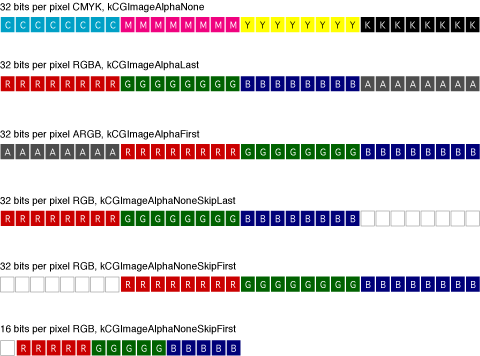

[Table 11-1](#apple-f4xwc4dqnrsv64tfmyxwi33df52wszbpkridgmbqgaytanrwfvbuqmrrgiwugsscjjceerkj) lists the functions that Quartz provides to create CGImage objects. The choice of image creation function depends on the source of the image data. The most flexible function is `CGImageCreate`. It creates an image from any kind of bitmap data. However, it’s the most complex function to use because you must specify all bitmap information. To use this function, you need to be familiar with the topics discussed in [Bitmap Image Information](#apple-f4xwc4dqnrsv64tfmyxwi33df52wszbpkridgmbqgaytanrwfvbuqmrrgiwueqsdjjbesq2g).

If you want to create a CGImage object from an image file that uses a standard image format such as PNG or JPEG, the easiest solution is to call the function `CGImageSourceCreateWithURL` to create an image source and then call the function `CGImageSourceCreateImageAtIndex` to create an image from the image data at a specific index in the image source. If the original image file contains only one image, then provide `0` as the index. If the image file format supports files that contain multiple images, you need to supply the index to the appropriate image, keeping in mind that the index values start at `0`.

If you’ve drawn content to a bitmap graphics context and want to capture that drawing to a CGImage object, call the function `CGBitmapContextCreateImage`.

Several functions are utilities that operate on existing images, either to make a copy, create a thumbnail, or create an image from a portion of a larger one. Regardless of how you create a CGImage object, you use the function `CGContextDrawImage` to draw the image to a graphics context. Keep in mind that CGImage objects are immutable. When you no longer need a CGImage object, release it by calling the function `CGImageRelease`.

__Table 11-1__  Functions for creating images

| Function | Description |
| `CGImageCreate` | A flexible function for creating an image. You must specify all the bitmap information that is discussed in [Bitmap Image Information](#apple-f4xwc4dqnrsv64tfmyxwi33df52wszbpkridgmbqgaytanrwfvbuqmrrgiwueqsdjjbesq2g). |
| `CGImageSourceCreateImageAtIndex` | Creates an image from an image source. Image sources can contain more than one image. See [Data Management in Quartz 2D](Data%20Management%20in%20Quartz%202D.md#apple-f4xwc4dqnrsv64tfmyxwi33df52wszbpkridgmbqgaytanrwfvbuqmrrgywviucykjcummjqge) for information on creating an image source. |
| `CGImageSourceCreateThumbnailAtIndex` | Creates a thumbnail image of an image that is associated with an image source. See [Data Management in Quartz 2D](Data%20Management%20in%20Quartz%202D.md#apple-f4xwc4dqnrsv64tfmyxwi33df52wszbpkridgmbqgaytanrwfvbuqmrrgywviucykjcummjqge) for information on creating an image source. |
| `CGBitmapContextCreateImage` | Creates an image by copying the bits from a bitmap graphics context. |
| `CGImageCreateWithImageInRect` | Creates an image from the data contained within a sub-rectangle of an image. |
| `CGImageCreateCopy` | A utility function that creates a copy of an image. |
| `CGImageCreateCopyWithColorSpace` | A utility function that creates a copy of an image and replaces its color space. |

The sections that follow discuss how to create:

- A subimage from an existing image
- An image from a bitmap graphics context

You can consult these sources for additional information:

- [Data Management in Quartz 2D](Data%20Management%20in%20Quartz%202D.md#apple-f4xwc4dqnrsv64tfmyxwi33df52wszbpkridgmbqgaytanrwfvbuqmrrgywviucykjcummjqge) discusses how to read and write image data.
- _[CGImage Reference](https://developer.apple.com/documentation/coregraphics/cgimage)_, _[CGImageSource Reference](https://developer.apple.com/documentation/imageio/cgimagesource-r84)_, and _[CGBitmapContext Reference](https://developer.apple.com/documentation/coregraphics/cgbitmapcontext)_ for further information on the functions listed in Table 11-1 and their parameters.

The function `CGImageCreateWithImageInRect` lets you create a subimage from an existing Quartz image. Figure 11-3 illustrates extracting an image that contains the letter “A” from a larger image by supplying a rectangle that specifies the location of the letter “A”.

__Figure 11-3__  A subimage created from a larger image

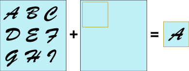

The image returned by the function `CGImageCreateWithImageInRect` retains a reference to the original image, which means you can release the original image after calling this function.

[Figure 11-4](#apple-f4xwc4dqnrsv64tfmyxwi33df52wszbpkridgmbqgaytanrwfvbuqmrrgiwugsscircuorcj) shows another example of extracting a portion of an image to create another image. In this case, the rooster’s head is extracted from the larger image, and then drawn to a rectangle that’s larger than the subimage, effectively zooming in on the image.

[Listing 11-1](#apple-f4xwc4dqnrsv64tfmyxwi33df52wszbpkridgmbqgaytanrwfvbuqmrrgiwugsscizdueqkf) shows code that creates and then draws the subimage. The rectangle that the function `CGContextDrawImage` draws the rooster’s head to has dimensions that are twice the dimensions of the extracted subimage. The listing is a code fragment. You’d need to declare the appropriate variables, create the rooster image, and dispose of the rooster image and the rooster head subimage. Because the code is a fragment, it does not show how to create the graphics context that the image is drawn to. You can use any flavor of graphics context that you’d like. For examples of how to create a graphics context, see [Graphics Contexts](Graphics%20Contexts.md#apple-f4xwc4dqnrsv64tfmyxwi33df52wszbpkridgmbqgaytanrwfvbuqmrqgmwviucykjcummjqge).

__Figure 11-4__  An image, a subimage taken from it and drawn so it’s enlarged

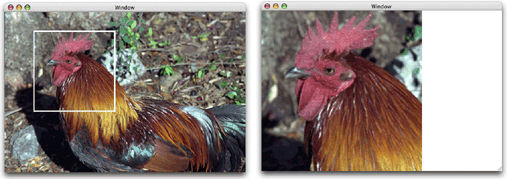

__Listing 11-1__  Code that creates a subimage and draws it enlarged

```
myImageArea = CGRectMake (rooster_head_x_origin, rooster_head_y_origin,
                            myWidth, myHeight);
mySubimage = CGImageCreateWithImageInRect (myRoosterImage, myImageArea);
myRect = CGRectMake(0, 0, myWidth*2, myHeight*2);
CGContextDrawImage(context, myRect, mySubimage);
```


To create an image from an existing bitmap graphics context, you call the function `CGBitmapContextCreateImage` as follows:

```
CGImageRef myImage;
myImage = CGBitmapContextCreateImage (myBitmapContext);
```

The CGImage object returned by the function is created by a copy operation. Therefore any subsequent changes you make to the bitmap graphics context do not affect the contents of the returned CGImage object. In some cases the copy operation actually follows copy-on-write semantics, so that the actual physical copy of the bits occurs only if the underlying data in the bitmap graphics context is modified. You may want to use the resulting image and release it before you perform additional drawing into the bitmap graphics context so that you can avoid the actual physical copy of the data.

For an example that shows how to create a bitmap graphics context, see[Creating a Bitmap Graphics Context](Graphics%20Contexts.md#apple-f4xwc4dqnrsv64tfmyxwi33df52wszbpkridgmbqgaytanrwfvbuqmrqgmwugsscjbbemrsf).

A Quartz bitmap image mask is used the same way an artist uses a silkscreen. A bitmap image mask determines how color is transferred, not which colors are used. Each sample value in the image mask specifies the amount that the current fill color is masked at a specific location. The sample value specifies the opacity of the mask. Larger values represent greater opacity and specify locations where Quartz paints less color. You can think of the sample value as an inverse alpha value. A value of `1` is transparent and `0` is opaque.

Image masks are 1, 2, 4, or 8 bits per component. For a 1-bit mask, a sample value of `1` specifies sections of the mask that block the current fill color. A sample value of `0` specifies sections of the mask that show the current fill color of the graphics state when the mask is painted. You can think of a 1-bit mask as black and white; samples either completely block paint or completely allow paint.

Image masks that have 2, 4, or 8 bits per component represent grayscale values. Each component maps to a range of `0` to `1` using the following formula:

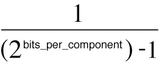

For example, a 4-bit mask has values that range from `0` to `1` in increments of `1/15` . Component values that are `0` or `1` represent the extremes—completely block paint and completely allow paint. Values between `0` and `1` allow partial painting using the formula `1 – MaskSampleValue`. For example, if the sample value of an 8-bit mask scales to `0.7`, color is painted as if it had an alpha value of `(1 – 0.7)`, which is `0.3`.

The function `CGImageMaskCreate` creates a Quartz image mask from bitmap image information that you supply and that is discussed in [Bitmap Image Information](#apple-f4xwc4dqnrsv64tfmyxwi33df52wszbpkridgmbqgaytanrwfvbuqmrrgiwueqsdjjbesq2g). The information you supply to create an image mask is the same as what you supply to create an image, except that you do not supply color space information, a bitmap information constant, or a rendering intent, as you can see by looking at the function prototype in Listing 11-2.

__Listing 11-2__  The prototype for the function CGImageMaskCreate

```
CGImageRef CGImageMaskCreate (
        size_t width,
        size_t height,
        size_t bitsPerComponent,
        size_t bitsPerPixel,
        size_t bytesPerRow,
        CGDataProviderRef provider,
        const CGFloat decode[],
        bool shouldInterpolate
);
```


Masking techniques can produce many interesting effects by controlling which parts of an image are painted. You can:

- Apply an image mask to an image. You can also use an image as a mask to achieve an effect that’s opposite from applying an image mask.
- Use color to mask parts of an image, which includes the technique referred to as chroma key masking.
- Clip a graphics context to an image or image mask, which effectively masks an image (or any kind of drawing) when Quartz draws the content to the clipped context.

The function `CGImageCreateWithMask` returns the image that’s created by applying an image mask to an image. This function takes two parameters:

- The image you want to apply the mask to. This image can’t be an image mask or have a masking color (see [Masking an Image with Color](#apple-f4xwc4dqnrsv64tfmyxwi33df52wszbpkridgmbqgaytanrwfvbuqmrrgiwugsscjbbucrcf)) associated with it.
- An image mask created by calling the function `CGImageMaskCreate`. It’s possible to provide an image instead of an image mask, but that gives a much different result. See [Masking an Image with an Image](#apple-f4xwc4dqnrsv64tfmyxwi33df52wszbpkridgmbqgaytanrwfvbuqmrrgiwugsscjjbuuq2f).

Source samples of an image mask act as an inverse alpha value. An image mask sample value (`S`):

- Equal to `1` blocks painting the corresponding image sample.
- Equal to `0` allows painting the corresponding image sample at full coverage.
- Greater than `0` and less `1` allows painting the corresponding image sample with an alpha value of `(1 – S).`

Figure 11-5 shows an image created with one of the Quartz image-creation functions and Figure 11-6 shows an image mask created with the function [CGImageMaskCreate](https://developer.apple.com/documentation/coregraphics/1455089-cgimagemaskcreate). [Figure 11-7](#apple-f4xwc4dqnrsv64tfmyxwi33df52wszbpkridgmbqgaytanrwfvbuqmrrgiwugsscjffemssi) shows the image that results from calling the function `CGImageCreateWithMask` to apply the image mask to the image.

__Figure 11-5__  The original image

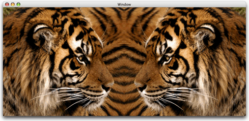

__Figure 11-6__  An image mask

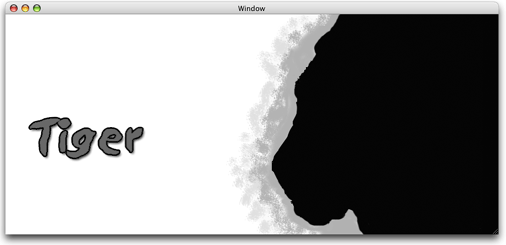

Note that the areas in the original image that correspond to the black areas of the mask show through in the resulting image (Figure 11-7). The areas that correspond to the white areas of the mask aren’t painted. The areas that correspond to the gray areas in the mask are painted using an intermediate alpha value that’s equal to `1` minus the image mask sample value.

__Figure 11-7__  The image that results from applying the image mask to the original image

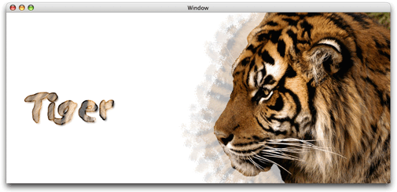

You can use the function `CGImageCreateWithMask` to mask an image with another image, rather than with an image mask. You would do this to achieve an effect opposite of what you get when you mask an image with an image mask. Instead of passing an image mask that’s created using the function [CGImageMaskCreate](https://developer.apple.com/documentation/coregraphics/1455089-cgimagemaskcreate), you supply an image created from one of the Quartz image-creation functions.

Source samples of an image that is used as a mask (but is not a Quartz image mask) operate as alpha values. An image sample value (`S`):

- Equal to `1` allows painting the corresponding image sample at full coverage.
- Equal to `0` blocks painting the corresponding image sample.
- Greater than `0` and less `1` allows painting the corresponding image sample with an alpha value of `S`.

[Figure 11-8](#apple-f4xwc4dqnrsv64tfmyxwi33df52wszbpkridgmbqgaytanrwfvbuqmrrgiwugsscijduissf) shows the image that results from calling the function `CGImageCreateWithMask` to apply the image shown in [Figure 11-6](#apple-f4xwc4dqnrsv64tfmyxwi33df52wszbpkridgmbqgaytanrwfvbuqmrrgiwugssciveugqsb) to the image shown in [Figure 11-5](#apple-f4xwc4dqnrsv64tfmyxwi33df52wszbpkridgmbqgaytanrwfvbuqmrrgiwugsscjfceoq2g). In this case, assume that the image shown in Figure 11-6 is created using one of the Quartz image-creation functions, such as `CGImageCreate`. Compare Figure 11-8 with [Figure 11-7](#apple-f4xwc4dqnrsv64tfmyxwi33df52wszbpkridgmbqgaytanrwfvbuqmrrgiwugsscjffemssi) to see how the same sample values, when used as image samples instead of image mask samples, achieve the opposite effect.

The areas in the original image that correspond to the black areas of the image aren’t painted in the resulting image (Figure 11-8). The areas that correspond to the white areas are painted. The areas that correspond to the gray areas in the mask are painted using an intermediate alpha value that’s equal to the masking image sample value.

__Figure 11-8__  The image that results from masking the original image with an image

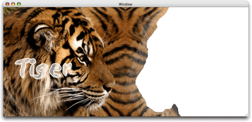

The function `CGImageCreateWithMaskingColors` creates an image by masking one color or a range of colors in an image supplied to the function. Using this function, you can perform chroma key masking similar to what’s shown in [Figure 11-9](#apple-f4xwc4dqnrsv64tfmyxwi33df52wszbpkridgmbqgaytanrwfvbuqmrrgiwugsscjjauqssk) or you can mask a range of colors, similar to what’s shown in [Figure 11-11](#apple-f4xwc4dqnrsv64tfmyxwi33df52wszbpkridgmbqgaytanrwfvbuqmrrgiwugsscijdeqrkj), [Figure 11-12](#apple-f4xwc4dqnrsv64tfmyxwi33df52wszbpkridgmbqgaytanrwfvbuqmrrgiwugsscjbcusr2b), and [Figure 11-13](#apple-f4xwc4dqnrsv64tfmyxwi33df52wszbpkridgmbqgaytanrwfvbuqmrrgiwugsscijbeurkh).

The function `CGImageCreateWithMaskingColors` takes two parameters:

- An image that is not an image mask and that is not the result of applying an image mask or masking color to another image.
- An array of color components that specify a color or a range of colors for the function to mask in the image.

__Figure 11-9__  Chroma key masking


The number of elements in the color component array must be equal to twice the number of color components in the color space of the image. For each color component in the color space, supply a minimum value and a maximum value that specifies the range of colors to mask. To mask only one color, set the minimum value equal to the maximum value. The values in the color component array are supplied in the following order:

`{min[1], max[1], ... min[N], max[N]}`, where `N` is the number of components.

If the image uses integer pixel components, each value in the color component array must be in the range [`0 .. 2^bitsPerComponent - 1]` . If the image uses floating-point pixel components, each value can be any floating-point number that is a valid color component.

An image sample is not painted if its color values fall in the range:

`{c[1], ... c[N]}`

where `min[i] <= c[i] <= max[i] for 1 <= i <= N`

Anything underneath the unpainted samples, such as the current fill color or other drawing, shows through.

The image of two tigers, shown in Figure 11-10, uses an RGB color space that has 8 bits per component. To mask a range of colors in this image, you supply minimum and maximum color component values in the range of `0` to `255`.

__Figure 11-10__  The original image

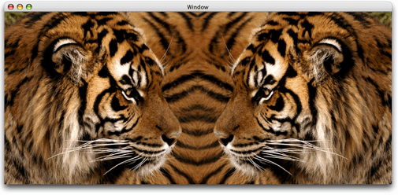

Listing 11-3 shows a code fragment that sets up a color components array and supplies the array to the function `CGImageCreateWithMaskingColors` to achieve the result shown in Figure 11-11.

__Listing 11-3__  Masking light to mid-range brown colors in an image

```
CGImageRef myColorMaskedImage;
const CGFloat myMaskingColors[6] = {124, 255,  68, 222, 0, 165};
myColorMaskedImage = CGImageCreateWithMaskingColors (image,
                                        myMaskingColors);
CGContextDrawImage (context, myContextRect, myColorMaskedImage);
```


__Figure 11-11__  An image with light to midrange brown colors masked out

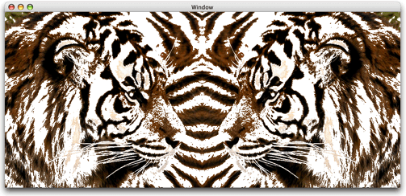

Listing 11-4 shows another code fragment that operates on the image shown in [Figure 11-10](#apple-f4xwc4dqnrsv64tfmyxwi33df52wszbpkridgmbqgaytanrwfvbuqmrrgiwugsscizeukssj) to get the results shown in Figure 11-12. This example masks a darker range of colors.

__Listing 11-4__  Masking shades of brown to black

```
CGImageRef myMaskedImage;
const CGFloat myMaskingColors[6] = { 0, 124, 0, 68, 0, 0 };
myColorMaskedImage = CGImageCreateWithMaskingColors (image,
                                        myMaskingColors);
CGContextDrawImage (context, myContextRect, myColorMaskedImage);
```


__Figure 11-12__  A image after masking colors from dark brown to black

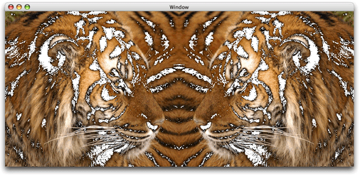

You can mask colors in an image as well as set a fill color to achieve the effect shown in Figure 11-13 in which the masked areas are replaced with the fill color. Listing 11-5 shows the code fragment that generates the image shown in Figure 11-13.

__Listing 11-5__  Masking a range of colors and setting a fill color and

```
CGImageRef myMaskedImage;
const CGFloat myMaskingColors[6] = { 0, 124, 0, 68, 0, 0 };
myColorMaskedImage = CGImageCreateWithMaskingColors (image,
                                        myMaskingColors);
CGContextSetRGBFillColor (myContext, 0.6373,0.6373, 0, 1);
CGContextFillRect(context, rect);
CGContextDrawImage(context, rect, myColorMaskedImage);
```


__Figure 11-13__  An image drawn after masking a range of colors and setting a fill color

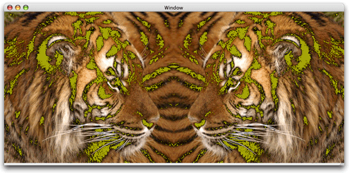

The function `CGContextClipToMask` maps a mask into a rectangle and intersects it with the current clipping area of the graphics context. You supply the following parameters:

- The graphics context you want to clip.
- A rectangle to apply the mask to.
- An image mask created by calling the function `CGImageMaskCreate`. You can supply an image instead of an image mask to achieve an effect opposite of what you get by supplying an image mask. The image must be created with a Quartz image creation function, but it cannot be the result of applying a mask or masking color to another image.

The resulting clipped area depends on whether you provide an image mask or an image to the function `CGContextClipToMask`. If you supply an image mask, you get results similar to those described in [Masking an Image with an Image Mask](#apple-f4xwc4dqnrsv64tfmyxwi33df52wszbpkridgmbqgaytanrwfvbuqmrrgiwugsscjbeuurkc), except that the graphics context is clipped. If you supply an image, the graphics context is clipped similar to what’s described in [Masking an Image with an Image](#apple-f4xwc4dqnrsv64tfmyxwi33df52wszbpkridgmbqgaytanrwfvbuqmrrgiwugsscjjbuuq2f).

Take a look at Figure 11-14. Assume it is an image mask created by calling the function `CGImageMaskCreate` and then the mask is supplied as a parameter to the function `CGContextClipToMask`. The resulting context allows painting to the black areas, does not allow painting to the white areas, and allows painting to the gray area with an alpha value of `1–S`, where `S` is the sample value of the image masks. If you draw an image to the clipped context using the function `CGContextDrawImage`, you’ll get a result similar to that shown in Figure 11-15.

__Figure 11-14__  A masking image

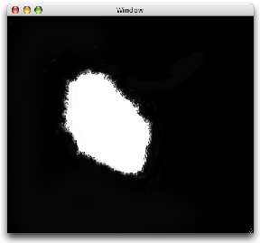

__Figure 11-15__  An image drawn to a context after clipping the content with an image mask

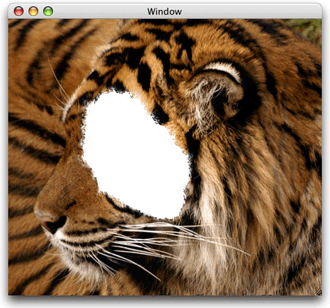

When the masking image is treated as an image, you get the opposite result, as shown in Figure 11-16.

__Figure 11-16__  An image drawn to a context after clipping the content with an image

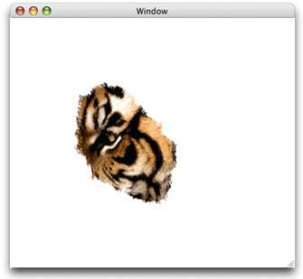

You can use Quartz 2D blend modes (see [Setting Blend Modes](Paths.md#apple-f4xwc4dqnrsv64tfmyxwi33df52wszbpkridgmbqgaytanrwfvbuqmrrgewueq2ji5eugrkg)) to composite two images or to composite an image over any content that’s already drawn to the graphic context. This section discusses compositing an image over a background drawing.

The general procedure for compositing an image over a background is as follows:

1. Draw the background.
2. Set the blend mode by calling the function [CGContextSetBlendMode](https://developer.apple.com/documentation/coregraphics/1455994-cgcontextsetblendmode) with one of the blend mode constants. (The blend modes are based upon those defined in the _PDF Reference, Fourth Edition_, Version 1.5, Adobe Systems, Inc.)
3. Draw the image you want to composite over the background by calling the function [CGContextDrawImage](https://developer.apple.com/documentation/coregraphics/1454845-cgcontextdrawimage).

This code fragment composites one image over a background using the “darken” blend mode:


```
CGContextSetBlendMode (myContext, kCGBlendModeDarken);
CGContextDrawImage (myContext, myRect, myImage2);
```

The rest of this section uses each of the blend modes available in Quartz to draw the image shown on the right side of Figure 11-17 over the background that consists of the painted rectangles shown on the left side of the figure. In all cases, the rectangles are first drawn to the graphics context. Then, a blend mode is set by calling the function `CGContextSetBlendMode`, passing the appropriate blend mode constant. Finally, the image of the jumper is drawn to the graphics context.

__Figure 11-17__  Background drawing (left) and foreground image (right)

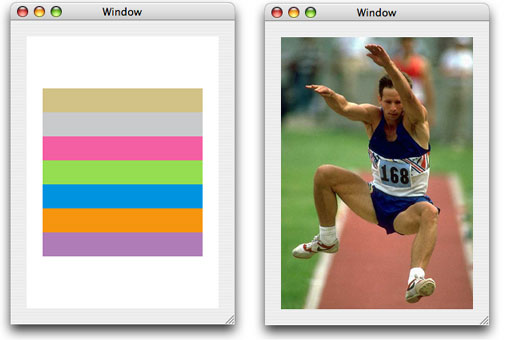

Normal blend mode paints source image samples over background image samples. Normal blend mode is the default blend mode in Quartz. You only need to explicitly set normal blend mode if you are currently using another blend mode and want to switch to normal blend mode. You can set normal blend mode by passing the constant `kCGBlendModeNormal` to the function `CGContextSetBlendMode` or by restoring the graphics state (assuming the previous graphics state used normal blend mode) using the function `CGContextRestoreGState`.

Figure 11-18 shows the result of using normal blend mode to paint the image shown in [Figure 11-17](#apple-f4xwc4dqnrsv64tfmyxwi33df52wszbpkridgmbqgaytanrwfvbuqmrrgiwugsscjfeugscf) over the rectangles shown in the same figure. In this example, the image is drawn using an alpha value of 1.0, so the background is completely obscured by the image.

__Figure 11-18__  Drawing an image over a background using normal blend mode

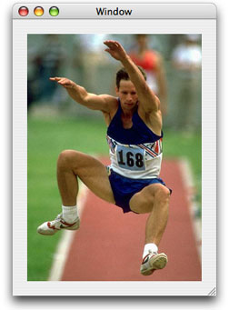

Multiply blend mode multiplies source image samples with background image samples. The colors in the resulting image are at least as dark as either of the two contributing sample colors.

You specify multiply blend mode by passing the constant `kCGBlendModeMultiply` to the function `CGContextSetBlendMode`. Figure 11-19 shows the result of using multiply blend mode to paint the image shown in [Figure 11-17](#apple-f4xwc4dqnrsv64tfmyxwi33df52wszbpkridgmbqgaytanrwfvbuqmrrgiwugsscjfeugscf) over the rectangles shown in the same figure.

__Figure 11-19__  Drawing an image over a background using multiply blend mode

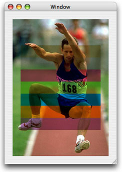

Screen blend mode multiplies the inverse of the source image samples with the inverse of the background image samples to obtain colors that are at least as light as either of the two contributing sample colors.

You specify screen blend mode by passing the constant `kCGBlendModeScreen` to the function `CGContextSetBlendMode`. Figure 11-20 shows the result of using screen blend mode to paint the image shown in [Figure 11-17](#apple-f4xwc4dqnrsv64tfmyxwi33df52wszbpkridgmbqgaytanrwfvbuqmrrgiwugsscjfeugscf) over the rectangles shown in the same figure.

__Figure 11-20__  Drawing an image over a background using screen blend mode

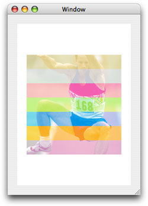

Overlay blend mode either multiplies or screens the source image samples with the background image samples, depending on the color of the background samples. The result is to overlay the existing image samples while preserving the highlights and shadows of the background. The background color mixes with the source image to reflect the lightness or darkness of the background.

You specify overlay blend mode by passing the constant `kCGBlendModeOverlay` to the function `CGContextSetBlendMode`. Figure 11-21 shows the result of using overlay blend mode to paint the image shown in [Figure 11-17](#apple-f4xwc4dqnrsv64tfmyxwi33df52wszbpkridgmbqgaytanrwfvbuqmrrgiwugsscjfeugscf) over the rectangles shown in the same figure.

__Figure 11-21__  Drawing an image over a background using overlay blend mode

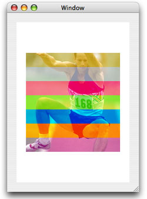

Darken blend mode creates composite image samples by choosing the darker samples from the source image or the background. Source image samples that are darker than the background image samples replace the corresponding background samples.

You specify darken blend mode by passing the constant `kCGBlendModeDarken` to the function `CGContextSetBlendMode`. Figure 11-22 shows the result of using darken blend mode to paint the image shown in [Figure 11-17](#apple-f4xwc4dqnrsv64tfmyxwi33df52wszbpkridgmbqgaytanrwfvbuqmrrgiwugsscjfeugscf) over the rectangles shown in the same figure.

__Figure 11-22__  Drawing an image over a background using darken blend mode

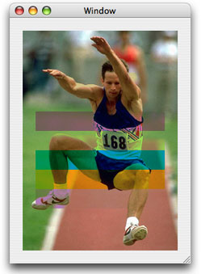

Lighten blend mode creates composite image samples by choosing the lighter samples from the source image or the background. Source image samples that are lighter than the background image samples replace the corresponding background samples.

You specify lighten blend mode by passing the constant `kCGBlendModeLighten` to the function `CGContextSetBlendMode`. Figure 11-23 shows the result of using lighten blend mode to paint the image shown in [Figure 11-17](#apple-f4xwc4dqnrsv64tfmyxwi33df52wszbpkridgmbqgaytanrwfvbuqmrrgiwugsscjfeugscf) over the rectangles shown in the same figure.

__Figure 11-23__  Drawing an image over a background using lighten blend mode

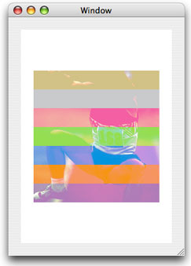

Color dodge blend mode brightens background image samples to reflect the source image samples. Source image sample values that specify black remain unchanged.

You specify color dodge blend mode by passing the constant `kCGBlendModeColorDodge` to the function `CGContextSetBlendMode`. Figure 11-24 shows the result of using color dodge blend mode to paint the image shown in [Figure 11-17](#apple-f4xwc4dqnrsv64tfmyxwi33df52wszbpkridgmbqgaytanrwfvbuqmrrgiwugsscjfeugscf) over the rectangles shown in the same figure.

__Figure 11-24__  Drawing an image over a background using color dodge blend mode

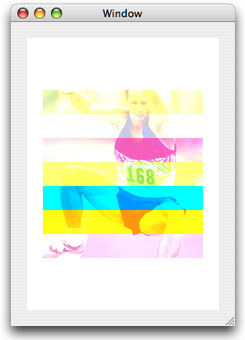

Color burn blend mode darkens background image samples to reflect the source image samples. Source image sample values that specify white remain unchanged.

You specify color burn blend mode by passing the constant `kCGBlendModeColorBurn` to the function `CGContextSetBlendMode`. Figure 11-25 shows the result of using color burn blend mode to paint the image shown in [Figure 11-17](#apple-f4xwc4dqnrsv64tfmyxwi33df52wszbpkridgmbqgaytanrwfvbuqmrrgiwugsscjfeugscf) over the rectangles shown in the same figure.

__Figure 11-25__  Drawing an image over a background using color burn blend mode

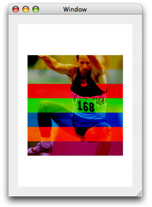

Soft light blend mode either darkens or lightens colors, depending on the source image sample color. If the source image sample color is lighter than 50% gray, the background lightens, similar to dodging. If the source image sample color is darker than 50% gray, the background darkens, similar to burning. If the source image sample color is equal to 50% gray, the background does not change.

Image samples that are equal to pure black or pure white produce darker or lighter areas, but do not result in pure black or white. The overall effect is similar to what you achieve by shining a diffuse spotlight on the source image.

You specify soft light blend mode by passing the constant `kCGBlendModeSoftLight` to the function `CGContextSetBlendMode`. Figure 11-26 shows the result of using soft light blend mode to paint the image shown in [Figure 11-17](#apple-f4xwc4dqnrsv64tfmyxwi33df52wszbpkridgmbqgaytanrwfvbuqmrrgiwugsscjfeugscf) over the rectangles shown in the same figure.

__Figure 11-26__  Drawing an image over a background using soft light blend mode


Hard light blend mode either multiplies or screens colors, depending on the source image sample color. If the source image sample color is lighter than 50% gray, the background is lightened, similar to screening. If the source image sample color is darker than 50% gray, the background is darkened, similar to multiplying. If the source image sample color is equal to 50% gray, the source image does not change. Image samples that are equal to pure black or pure white result in pure black or white. The overall effect is similar to what you achieve by shining a harsh spotlight on the source image.

You specify hard light blend mode by passing the constant `kCGBlendModeHardLight` to the function `CGContextSetBlendMode`. Figure 11-27 shows the result of using hard light blend mode to paint the image shown in [Figure 11-17](#apple-f4xwc4dqnrsv64tfmyxwi33df52wszbpkridgmbqgaytanrwfvbuqmrrgiwugsscjfeugscf) over the rectangles shown in the same figure.

__Figure 11-27__  Drawing an image over a background using hard light blend mode

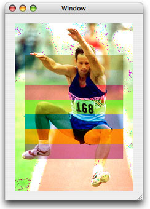

Difference blend mode subtracts either the source image sample color from the background image sample color, or the reverse, depending on which sample has the greater brightness value. Source image sample values that are black produce no change; white inverts the background color values.

You specify difference blend mode by passing the constant `kCGBlendModeDifference` to the function `CGContextSetBlendMode`. Figure 11-28 shows the result of using difference blend mode to paint the image shown in [Figure 11-17](#apple-f4xwc4dqnrsv64tfmyxwi33df52wszbpkridgmbqgaytanrwfvbuqmrrgiwugsscjfeugscf) over the rectangles shown in the same figure.

__Figure 11-28__  Drawing an image over a background using difference blend mode

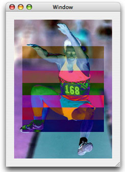

Exclusion blend mode produces a lower-contrast version of the difference blend mode. Source image sample values that are black don’t produce a change; white inverts the background color values.

You specify exclusion blend mode by passing the constant `kCGBlendModeExclusion` to the function `CGContextSetBlendMode`. Figure 11-29 shows the result of using exclusion blend mode to paint the image shown in [Figure 11-17](#apple-f4xwc4dqnrsv64tfmyxwi33df52wszbpkridgmbqgaytanrwfvbuqmrrgiwugsscjfeugscf) over the rectangles shown in the same figure.

__Figure 11-29__  Drawing an image over a background using exclusion blend mode

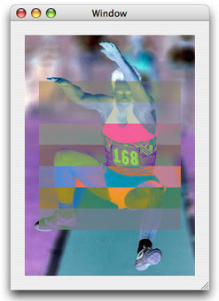

Hue blend mode uses the luminance and saturation values of the background with the hue of the source image. You specify hue blend mode by passing the constant `kCGBlendModeHue` to the function `CGContextSetBlendMode`. Figure 11-30 shows the result of using hue blend mode to paint the image shown in [Figure 11-17](#apple-f4xwc4dqnrsv64tfmyxwi33df52wszbpkridgmbqgaytanrwfvbuqmrrgiwugsscjfeugscf) over the rectangles shown in the same figure.

__Figure 11-30__  Drawing an image over a background using hue blend mode

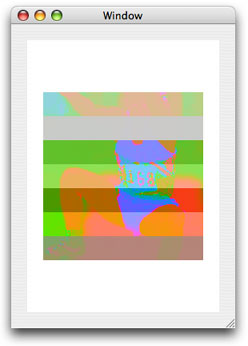

Saturation blend mode uses the luminance and hue values of the background with the saturation of the source image. Pure gray areas don’t produce a change. You specify saturation blend mode by passing the constant `kCGBlendModeSaturation` to the function `CGContextSetBlendMode`. Figure 11-31 shows the result of using saturation blend mode to paint the image shown in [Figure 11-17](#apple-f4xwc4dqnrsv64tfmyxwi33df52wszbpkridgmbqgaytanrwfvbuqmrrgiwugsscjfeugscf) over the rectangles shown in the same figure.

__Figure 11-31__  Drawing an image over a background using saturation blend mode

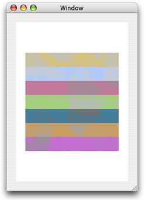

Color blend mode uses the luminance values of the background with the hue and saturation values of the source image. This mode preserves the gray levels in the image. You specify color blend mode by passing the constant `kCGBlendModeColor` to the function `CGContextSetBlendMode`. Figure 11-32 shows the result of using color blend mode to paint the image shown in [Figure 11-17](#apple-f4xwc4dqnrsv64tfmyxwi33df52wszbpkridgmbqgaytanrwfvbuqmrrgiwugsscjfeugscf) over the rectangles shown in the same figure.

__Figure 11-32__  Drawing an image over a background using color blend mode

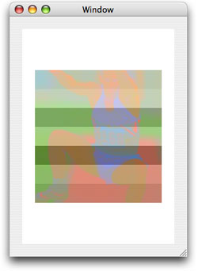

Luminosity blend mode uses the hue and saturation of the background with the luminance of the source image to create an effect that is inverse to the effect created by the color blend mode.

You specify luminosity blend mode by passing the constant `kCGBlendModeLuminosity` to the function `CGContextSetBlendMode`. Figure 11-33 shows the result of using luminosity blend mode to paint the image shown in [Figure 11-17](#apple-f4xwc4dqnrsv64tfmyxwi33df52wszbpkridgmbqgaytanrwfvbuqmrrgiwugsscjfeugscf) over the rectangles shown in the same figure.

__Figure 11-33__  Drawing an image over a background using luminosity blend mode

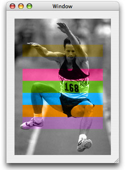

[Next](Core%20Graphics%20Layer%20Drawing.md)[Previous](Data%20Management%20in%20Quartz%202D.md)

