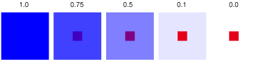
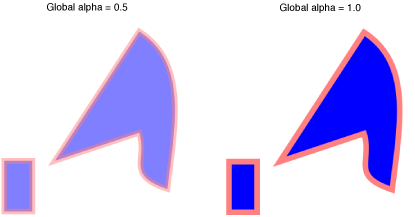
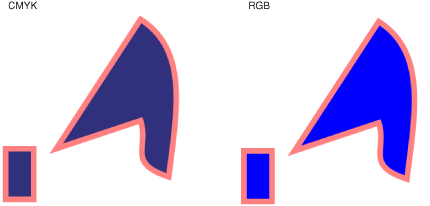

> 导航：[总目录](../../../README.md) · [documentation](../../../_indexes/documentation.md) · [Quartz 2D Programming Guide](Introduction.md)

[Next](Transforms.md)[Previous](Paths.md)

# Color and Color Spaces

Devices (displays, printers, scanners, cameras) don’t treat color the same way; each has its own range of colors that the device can produce faithfully. A color produced on one device might not be able to be produced on another device.

To work with color effectively and to understand the Quartz 2D functions for using color spaces and color, you should be familiar with the terminology discussed in _[Color Management Overview](../Color%20Management%20Overview/Introduction%20to%20Color%20Management%20Overview.md#apple-f4xwc4dqnrsv64tfmyxwi33df52wszbpkridgmbqgaytcnby)_. That document discusses color perception, color values, device-independent and device color spaces, the color-matching problem, rendering intent, color management modules, and ColorSync.

In this chapter, you’ll learn how Quartz represents color and color spaces, and what the alpha component is. This chapter also discusses how to:

- Create color spaces
- Create and set colors
- Set rendering intent

A color in Quartz is represented by a set of values. The values are meaningless without a color space that dictates how to interpret color information. For example, the values in Table 4-1 all represent the color blue at full intensity. But without knowing the color space or the allowable range of values for each color space, you have no way of knowing which color each set of values represents.

__Table 4-1__  Color values in different color spaces

| Values | Color space | Components |
| 240 degrees, 100%, 100% | HSB | Hue, saturation, brightness |
| 0, 0, 1 | RGB | Red, green, blue |
| 1, 1, 0, 0 | CMYK | Cyan, magenta, yellow, black |
| 1, 0, 0 | BGR | Blue, green, red |

If you provide the wrong color space, you can get quite dramatic differences, as shown in Figure 4-1. Although the green color is interpreted the same in BGR and RGB color spaces, the red and blue values are flipped.

__Figure 4-1__  Applying a BGR and an RGB color profile to the same image

Color spaces can have different numbers of components. Three of the color spaces in the table have three components, while the CMYK color space has four. Value ranges are relative to that color space. For most color spaces, color values in Quartz range from 0.0 to 1.0, with 1.0 meaning full intensity. For example, the color blue at full intensity, specified in the RGB color space in Quartz, has the values (0, 0, 1.0). In Quartz, color also has an alpha value that specifies the transparency of a color. The color values in Table 4-1 don’t show an alpha value.

The _alpha value_ is the graphics state parameter that Quartz uses to determine how to composite newly painted objects to the existing page. At full intensity, newly painted objects are opaque. At zero intensity, newly painted objects are invisible. Figure 4-2 shows five large rectangles, drawn using alpha values of 1.0, 0.75, 0.5, 0.1, and 0.0. As the large rectangle becomes transparent, it exposes a smaller, opaque red rectangle drawn underneath.

__Figure 4-2__  A comparison of large rectangles painted using various alpha values

You can make both the objects on the page and the page itself transparent by setting the alpha value globally in the graphics context before painting. Figure 4-3 compares a global alpha setting of 0.5 with the default value of 1.0.

__Figure 4-3__  A comparison of global alpha values

In the normal blend mode (which is the default for the graphics state) Quartz performs alpha blending by combining the components of the source color with the components of the destination color using the formula:

`destination = (alpha * source) + (1 - alpha) * destination`

where `source` is one component of the new paint color and `destination` is one component of the background color. This formula is executed for each newly painted shape or image.

For object transparency, set the alpha value to `1.0` to specify that objects you draw should be fully opaque; set it to `0.0` to specify that newly drawn objects are fully transparent. An alpha value between `0.0` and `1.0` specifies a partially transparent object. You can supply an alpha value as the last color component to all routines that accept colors. You can also set the global alpha value using the `CGContextSetAlpha` function. Keep in mind that if you set both, Quartz multiplies the alpha color component by the global alpha value.

To allow the page itself to be fully transparent, you can explicitly clear the alpha channel of the graphics context using the `CGContextClearRect` function, as long as the graphics context is a window or bitmap graphics context. You might want to do this when creating a transparency mask for an icon, for example, or to make the background of a window transparent.

Quartz supports the standard color spaces used by color management systems for device-independent color spaces and also supports generic, indexed, and pattern color spaces. _Device-independent color spaces_ represent color in a way that is portable between devices. They are used for the interchanges of color data from the native color space of one device to the native color space of another device. Colors in a device-independent color space appear the same when displayed on different devices, to the extent that the capabilities of the device allow. For that reason, device-independent color spaces are your best choice for representing color.

Applications that have precise color requirements should always use a device-independent color space. A common device independent color space is the _generic color space_. Generic color spaces let the operating system provide the best color space for your application. Drawing to the display looks as good as printing the same content to a printer.

To create a device-independent color space, you provide Quartz with the reference white point, reference black point, and gamma values for a particular device. Quartz uses this information to convert colors from your source color space into the color space of the output device.

The device-independent color spaces supported by Quartz, and the functions that create them are:

- L\*a\*b\* is a nonlinear transformation of the Munsell color notation system (a system that specifies colors by hue, value, and saturation—or chroma —values). This color space matches perceived color difference with quantitative distance in color space. The L\* component represents the lightness value, the a\* component represents values from green to red, and the b\* component represents values from blue to yellow. This color space is designed to mimic how the human brain decodes color. Use the function `CGColorSpaceCreateLab`.
- ICC is a color space from an ICC color profile, as defined by the International Color Consortium. ICC profiles define the gamut of colors supported by a device along with other device characteristics so that this information can be used to accurately transform the color space of one device to the color space of another. The manufacturer of the device typically provides an ICC profile. Some color monitors and printers contain embedded ICC profile information, as do some bitmap formats such as TIFF. Use the function `CGColorSpaceCreateICCBased`.
- Calibrated RGB is a device-independent RGB color space that represents colors relative to a reference white point that is based on the whitest light that can be generated by the output device. Use the function `CGColorSpaceCreateCalibratedRGB`.
- Calibrated gray is a device-independent grayscale color space that represents colors relative to a reference white point that is based on the whitest light that can be generated by the output device. Use the function `CGColorSpaceCreateCalibratedGray`.

Generic color spaces leave color matching to the system. For most cases, the result is acceptable. Although the name may imply otherwise, each “generic” color space—generic gray, generic RGB, and generic CMYK—is a specific device-independent color space.

Generic color spaces are easy to use; you don’t need to supply any reference point information. You create a generic color space by using the function `CGColorSpaceCreateWithName` along with one of the following constants:

- `kCGColorSpaceGenericGray`, which specifies generic gray, a monochromatic color space that permits the specification of a single value ranging from absolute black (value 0.0) to absolute white (value 1.0).
- `kCGColorSpaceGenericRGB`, which specifies generic RGB, a three-component color space (red, green, and blue) that models the way an individual pixel is composed on a color monitor. Each component of the RGB color space ranges in value from 0.0 (zero intensity) to 1.0 (full intensity).
- `kCGColorSpaceGenericCMYK`, which specifies generic CMYK, a four-component color space (cyan, magenta, yellow, and black) that models the way ink builds up during printing. Each component of the CMYK color space ranges in value from 0.0 (does not absorb the color) to 1.0 (fully absorbs the color).

Device color spaces are primarily used by iOS applications because other options are not available. In most cases, a Mac OS X application should use a generic color space instead of creating a device color space. However, some Quartz routines expect images with a device color space. For example, if you call [CGImageCreateWithMask](https://developer.apple.com/documentation/coregraphics/1456337-cgimagecreatewithmask) and specify an image as the mask, the image must be defined with the device gray color space.

You create a device color space by using one of the following functions:

- `CGColorSpaceCreateDeviceGray` for a device-dependent grayscale color space.
- `CGColorSpaceCreateDeviceRGB` for a device-dependent RGB color space.
- `CGColorSpaceCreateDeviceCMYK` for a device-dependent CMYK color space.

Indexed color spaces contain a color table with up to 256 entries, and a base color space to which the color table entries are mapped. Each entry in the color table specifies one color in the base color space. Use the function `CGColorSpaceCreateIndexed`.

Pattern color spaces, discussed in [Patterns](Patterns.md#apple-f4xwc4dqnrsv64tfmyxwi33df52wszbpkridgmbqgaytanrwfvbuqmrqgywviucykjcummjqge), are used when painting with patterns. Use the function `CGColorSpaceCreatePattern`.

Quartz provides a suite of functions for setting fill color, stroke color, color spaces, and alpha. Each of these color parameters apply to the graphics state, which means that once set, that setting remains in effect until set to another value.

A color must have an associated color space. Otherwise, Quartz won’t know how to interpret color values. Further, you need to supply an appropriate color space for the drawing destination. Compare the blue fill color on the left side of Figure 4-4, which is a CMYK fill color, with the blue color shown on the right side, which is an RGB fill color. If you view the onscreen version of this document, you’ll see a large difference between the fill colors. The colors are theoretically identical, but appear identical only if the RGB color is used for an RGB device and the CMYK color is used for a CMYK device.

__Figure 4-4__  A CMYK fill color and an RGB fill color

You can use the functions `CGContextSetFillColorSpace` and `CGContextSetStrokeColorSpace` to set the fill and stroke color spaces, or you can use one of the convenience functions (listed in Table 4-2) that set color for a device color space.

__Table 4-2__  Color-setting functions

| Function | Use to set color for |
| `CGContextSetRGBStrokeColor`  `CGContextSetRGBFillColor` | Device RGB. At PDF-generation time, Quartz writes the colors as if they were in the corresponding generic color space. |
| `CGContextSetCMYKStrokeColor`  `CGContextSetCMYKFillColor` | Device CMYK. (Remains device CMYK at PDF-generation time.) |
| `CGContextSetGrayStrokeColor`  `CGContextSetGrayFillColor` | Device Gray. At PDF-generation time, Quartz writes the colors as if they were in the corresponding generic color space. |
| `CGContextSetStrokeColorWithColor`  `CGContextSetFillColorWithColor` | Any color space; you supply a CGColor object that specifies the color space. Use these functions for colors you need repeatedly. |
| `CGContextSetStrokeColor`  `CGContextSetFillColor` | The current color space. Not recommended. Instead, set color using a CGColor object and the functions `CGContextSetStrokeColorWithColor` and `CGContextSetFillColorWithColor`. |

You specify the fill and stroke colors as values located within the fill and stroke color spaces. For example, a fully saturated red color in the RGB color space is specified as an array of four numbers: (1.0, 0.0, 0.0, 1.0). The first three numbers specify full red intensity and no green or blue intensity. The fourth number is the alpha value, which is used to specify the opacity of the color.

If you reuse colors in your application, the most efficient way to set fill and stroke colors is to create a CGColor object, which you then pass as a parameter to the functions `CGContextSetFillColorWithColor` and `CGContextSetStrokeColorWithColor`. You can keep the CGColor object around as long as you need it. You can improve your application’s performance by using CGColor objects directly.

You create a CGColor object by calling the function `CGColorCreate`, passing a CGColorspace object and an array of floating-point values that specify the intensity values for the color. The last component in the array specifies the alpha value.

The rendering intent specifies how Quartz maps colors from the source color space to those that are within the gamut of the destination color space of a graphics context. If you don’t explicitly set the rendering intent, Quartz uses relative colorimetric rendering intent for all drawing except bitmap (sampled) images. Quartz uses perceptual rendering intent for those.

To set the rendering intent, call the function `CGContextSetRenderingIntent`, passing a graphics context and one of the following constants:

- `kCGRenderingIntentDefault`. Uses the default rendering intent for the context.
- `kCGRenderingIntentAbsoluteColorimetric`. Maps colors outside of the gamut of the output device to the closest possible match inside the gamut of the output device. This can produce a clipping effect, where two different color values in the gamut of the graphics context are mapped to the same color value in the output device’s gamut. This is the best choice when the colors used in the graphics are within the gamut of both the source and the destination, as is often the case with logos or when spot colors are used.
- `kCGRenderingIntentRelativeColorimetric`. The relative colorimetric shifts all colors (including those within the gamut) to account for the difference between the white point of the graphics context and the white point of the output device.
- `kCGRenderingIntentPerceptual`. Preserves the visual relationship between colors by compressing the gamut of the graphics context to fit inside the gamut of the output device. Perceptual intent is good for photographs and other complex, detailed images.
- `kCGRenderingIntentSaturation`. Preserves the relative saturation value of the colors when converting into the gamut of the output device. The result is an image with bright, saturated colors. Saturation intent is good for reproducing images with low detail, such as presentation charts and graphs.

[Next](Transforms.md)[Previous](Paths.md)

