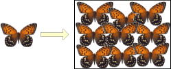
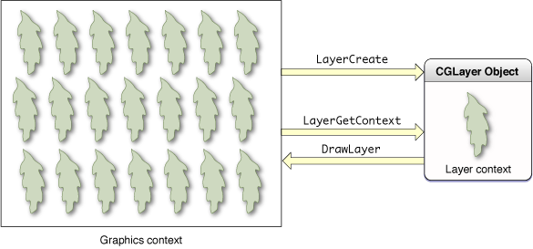
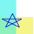
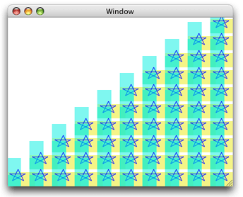
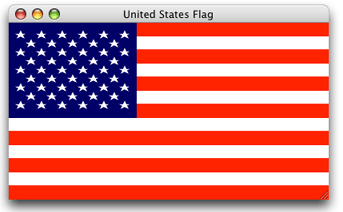

> 导航：[总目录](../../../README.md) · [documentation](../../../_indexes/documentation.md) · [Quartz 2D Programming Guide](Introduction.md)


[Next](PDF%20Document%20Creation%2C%20Viewing%2C%20and%20Transforming.md)[Previous](Bitmap%20Images%20and%20Image%20Masks.md)

# Core Graphics Layer Drawing

CGLayer objects ([CGLayerRef](https://developer.apple.com/documentation/coregraphics/cglayerref) data type) allow your application to use layers for drawing.

Layers are suited for the following:

- High-quality offscreen rendering of drawing that you plan to reuse. For example, you might be building a scene and plan to reuse the same background. Draw the background scene to a layer and then draw the layer whenever you need it. One added benefit is that you don’t need to know color space or device-dependent information to draw to a layer.
- Repeated drawing. For example, you might want to create a pattern that consists of the same item drawn over and over. Draw the item to a layer and then repeatedly draw the layer, as shown in Figure 12-1. Any Quartz object that you draw repeatedly—including CGPath, CGShading, and CGPDFPage objects—benefits from improved performance if you draw it to a CGLayer. Note that a layer is not just for onscreen drawing; you can use it for graphics contexts that aren’t screen-oriented, such as a PDF graphics context.
- Buffering. Although you can use layers for this purpose, you shouldn’t need to because the Quartz Compositor makes buffering on your part unnecessary. If you must draw to a buffer, use a layer instead of a bitmap graphics context.

__Figure 12-1__  Repeatedly painting the same butterfly image



CGLayer objects and transparency layers are parallel to CGPath objects and paths created by CGContext functions. In the case of a CGLayer or CGPath object, you paint to an abstract destination and can then later draw the complete painting to another destination, such as a display or a PDF. When you paint to a transparency layer or use the CGContext functions that draw paths, you draw directly to the destination represented by a graphics context. There is no intermediate abstract destination for assembling the painting.

A layer, represented by the [CGLayerRef](https://developer.apple.com/documentation/coregraphics/cglayerref) data type, is engineered for optimal performance. When possible, Quartz caches a CGLayer object using a mechanism appropriate to the type of Quartz graphics context it is associated with. For example, a graphics context associated with a video card might cache the layer on the video card, which makes drawing the content that’s in a layer much faster than rendering a similar image that’s constructed from a bitmap graphics context. For this reason a layer is typically a better choice for offscreen drawing than a bitmap graphics context is.

All Quartz drawing functions draw to a graphics context. The graphics context provides an abstraction of the destination, freeing you from the details of the destination, such as its resolution. You work in user space, and Quartz performs the necessary transformations to render the drawing correctly to the destination. When you use a CGLayer object for drawing, you also draw to a graphics context. Figure 12-1 illustrates the necessary steps for layer drawing.

__Figure 12-2__  Layer drawing



All layer drawing starts with a graphics context from which you create a CGLayer object using the function [CGLayerCreateWithContext](https://developer.apple.com/documentation/coregraphics/1450892-cglayercreatewithcontext). The graphics context used to create a CGLayer object is typically a window graphics context. Quartz creates a layer so that it has all the characteristics of the graphics context—its resolution, color space, and graphics state settings. You can provide a size for the layer if you don’t want to use the size of the graphics context. In Figure 12-2, the left side shows the graphics context used to create the layer. The gray portion of the box on the right side, labeled CGLayer object, represents the newly created layer.

Before you can draw to the layer, you must obtain the graphics context that’s associated with the layer by calling the function [CGLayerGetContext](https://developer.apple.com/documentation/coregraphics/1450902-cglayergetcontext). This graphics context is the same flavor as the graphics context used to create the layer. As long as the graphics context used to create the layer is a window graphics context, then the CGLayer graphics context is cached to the GPU if at all possible. The white portion of the box on the right side of Figure 12-2 represents the newly created layer graphics context.

You draw to the layer’s graphics context just as you would draw to any graphics context, passing the layer’s graphic context to the drawing function. Figure 12-2 shows a leaf shape drawn to the layer context.

When you are ready to use the contents of the layer, you can call the functions [CGContextDrawLayerInRect](https://developer.apple.com/documentation/coregraphics/1450896-cgcontextdrawlayerinrect) or [CGContextDrawLayerAtPoint](https://developer.apple.com/documentation/coregraphics/1450894-cgcontextdrawlayeratpoint), to draw the layer into a graphics context. Typically you would draw to the same graphics context that you used to create the layer object, but you are not required to. You can draw the layer to any graphics context, keeping in mind that layer drawing has the characteristics of the graphics context used to create the layer object, which could impose certain constraints (performance or resolution, for example). For example, a layer associated with the screen may be cached in video hardware. If the destination context is a printing or PDF context, it may need to be fetched from the graphics hardware to memory, resulting in poor performance.

[Figure 12-2](#apple-f4xwc4dqnrsv64tfmyxwi33df52wszbpkridgmbqgaytanrwfvbuqmrrhewvgvzs) shows the contents of the layer—the leaf—drawn repeatedly to the graphics context used to create the layer object. You can reuse the drawing that’s in a layer as many times as you’d like before releasing the CGLayer object.

You need to perform the tasks described in the following section to draw using a CGLayer object:

1. [Create a CGLayer Object Initialized with an Existing Graphics Context](#apple-f4xwc4dqnrsv64tfmyxwi33df52wszbpkridgmbqgaytanrwfvbuqmrrhewueqkkjjbeqqsk)
2. [Get a Graphics Context for the Layer](#apple-f4xwc4dqnrsv64tfmyxwi33df52wszbpkridgmbqgaytanrwfvbuqmrrhewueqkki5duor2c)
3. [Draw to the CGLayer Graphics Context](#apple-f4xwc4dqnrsv64tfmyxwi33df52wszbpkridgmbqgaytanrwfvbuqmrrhewueqkkijcucq2b)
4. [Draw the Layer to the Destination Graphics Context](#apple-f4xwc4dqnrsv64tfmyxwi33df52wszbpkridgmbqgaytanrwfvbuqmrrhewueqkki5ceosse)

See [Example: Using Multiple CGLayer Objects to Draw a Flag](#apple-f4xwc4dqnrsv64tfmyxwi33df52wszbpkridgmbqgaytanrwfvbuqmrrhewueqkkjjduiskj) for a detailed code example.

The function [CGLayerCreateWithContext](https://developer.apple.com/documentation/coregraphics/1450892-cglayercreatewithcontext) returns a layer that is initialized with an existing graphics context. The layer inherits all the characteristics of the graphics context, including the color space, size, resolution, and pixel format. Later, when you draw the layer to a destination, Quartz automatically color matches the layer to the destination context.

The function [CGLayerCreateWithContext](https://developer.apple.com/documentation/coregraphics/1450892-cglayercreatewithcontext) takes three parameters:

- The graphics context to create the layer from. Typically you pass a window graphics context so that you can later draw the layer onscreen.
- The size of the layer relative to the graphics context. The layer can be the same size as the graphics context or smaller. If you need to retrieve the layer size later, you can call the function [CGLayerGetSize](https://developer.apple.com/documentation/coregraphics/cglayer/1450890-size).
- An auxiliary dictionary. This parameter is currently unused, so pass `NULL`.

Quartz always draws to a graphics context. Now that you have a layer, you must create a graphics context associated with the layer. Anything you draw into the layer graphics context is part of the layer.

The function [CGLayerGetContext](https://developer.apple.com/documentation/coregraphics/1450902-cglayergetcontext) takes a layer as a parameter and returns a graphics context associated with the layer.

After you obtain the graphics context associated with a layer, you can perform any drawing you’d like to the layer graphics context. You can open a PDF file or an image file and draw the file contents to the layer. You can use any of the Quartz 2D functions to draw rectangles, lines, and other drawing primitives. Figure 12-3 shows an example of drawing rectangles and lines to a layer.

__Figure 12-3__  A layer that contains two rectangles and a series of lines



For example, to draw a filled rectangle to a CGLayer graphics context, you call the function [CGContextFillRect](https://developer.apple.com/documentation/coregraphics/1454700-cgcontextfillrect), supplying the graphics context you obtained from the function [CGLayerGetContext](https://developer.apple.com/documentation/coregraphics/1450902-cglayergetcontext). If the graphics context is named `myLayerContext`, the function call looks like this:

`CGContextFillRect (myLayerContext, myRect)`

When you are ready to draw the layer to its destination graphics context you can use either of the following functions:

- [CGContextDrawLayerInRect](https://developer.apple.com/documentation/coregraphics/1450896-cgcontextdrawlayerinrect), which draws a layer to a graphics context in the rectangle specified.
- [CGContextDrawLayerAtPoint](https://developer.apple.com/documentation/coregraphics/1450894-cgcontextdrawlayeratpoint), which draws the layer to a graphics context at the point specified.

Typically the destination graphics context you supply is a window graphics context and it is the same graphics context you use to create the layer. Figure 12-4 shows the result of repeatedly drawing the layer drawing shown in [Figure 12-3](#apple-f4xwc4dqnrsv64tfmyxwi33df52wszbpkridgmbqgaytanrwfvbuqmrrhewueqkkizaukrse). To achieve the patterned effect, you call either of the layer drawing functions repeatedly—[CGContextDrawLayerAtPoint](https://developer.apple.com/documentation/coregraphics/1450894-cgcontextdrawlayeratpoint) or [CGContextDrawLayerInRect](https://developer.apple.com/documentation/coregraphics/1450896-cgcontextdrawlayerinrect)—changing the offset each time. For example you can call the function `CGContextTranslateCTM` to change the origin of the coordinate space each time you draw the layer.

__Figure 12-4__  Drawing a layer repeatedly



This section shows how to use two CGLayer objects to draw the flag shown in Figure 12-5 onscreen. First you’ll see how to reduce the flag to simple drawing primitives, then you’ll look at the code needed to accomplish the drawing.

__Figure 12-5__  The result of using layers to draw the United States flag



From the perspective of drawing it onscreen, the flag has three parts:

- A pattern of red and white stripes. You can reduce the pattern to a single red stripe because, for onscreen drawing, you can assume a white background. You create a single red rectangle, then repeatedly draw the rectangle at various offsets to create the seven red stripes necessary for the U.S. flag. A layer is ideal for repeated drawing. You draw the red rectangle to a layer, then draw the layer onscreen seven times.
- A blue rectangle. You need the blue rectangle once, so using a layer is of no benefit. When it comes time to draw the blue rectangle, draw it directly onscreen.
- A pattern of 50 white stars. Like the red stripe, a layer is ideal for drawing the stars. You create a path that outlines a star shape, and then fill the path with white. Draw one star to a layer, then draw the layer 50 times, adjusting the offset each time to get the appropriate spacing.

The code in [Figure 12-2](#apple-f4xwc4dqnrsv64tfmyxwi33df52wszbpkridgmbqgaytanrwfvbuqmrrhewvgvzs) produces the output shown in Figure 12-5. A detailed explanation for each numbered line of code appears following the listing. The listing is rather long, so you might want to print the explanation so that you can read it as you look at the code. The `myDrawFlag` routine is called from within a Cocoa application. The application passes a window graphics context and a rectangle that specifies the size of the view associated with the window graphics context.

__Listing 12-1__  Code that uses layers to draw a flag

```swift
void myDrawFlag (CGContextRef context, CGRect* contextRect)
{
    int          i, j,
                 num_six_star_rows = 5,
                 num_five_star_rows = 4;
    CGFloat      start_x = 5.0,// 1
                 start_y = 108.0,// 2
                 red_stripe_spacing = 34.0,// 3
                 h_spacing = 26.0,// 4
                 v_spacing = 22.0;// 5
    CGContextRef myLayerContext1,
                 myLayerContext2;
    CGLayerRef   stripeLayer,
                 starLayer;
    CGRect       myBoundingBox,// 6
                 stripeRect,
                 starField;
 // ***** Setting up the primitives *****
    const CGPoint myStarPoints[] = {{ 5, 5},   {10, 15},// 7
                                    {10, 15},  {15, 5},
                                    {15, 5},   {2.5, 11},
                                    {2.5, 11}, {16.5, 11},
                                    {16.5, 11},{5, 5}};

    stripeRect  = CGRectMake (0, 0, 400, 17); // stripe// 8
    starField  =  CGRectMake (0, 102, 160, 119); // star field// 9

    myBoundingBox = CGRectMake (0, 0, contextRect->size.width, // 10
                                      contextRect->size.height);

     // ***** Creating layers and drawing to them *****
    stripeLayer = CGLayerCreateWithContext (context, // 11
                            stripeRect.size, NULL);
    myLayerContext1 = CGLayerGetContext (stripeLayer);// 12

    CGContextSetRGBFillColor (myLayerContext1, 1, 0 , 0, 1);// 13
    CGContextFillRect (myLayerContext1, stripeRect);// 14

    starLayer = CGLayerCreateWithContext (context,
                            starField.size, NULL);// 15
    myLayerContext2 = CGLayerGetContext (starLayer);// 16
    CGContextSetRGBFillColor (myLayerContext2, 1.0, 1.0, 1.0, 1);// 17
    CGContextAddLines (myLayerContext2, myStarPoints, 10);// 18
    CGContextFillPath (myLayerContext2);    // 19

     // ***** Drawing to the window graphics context *****
    CGContextSaveGState(context);    // 20
    for (i=0; i< 7;  i++)   // 21
    {
        CGContextDrawLayerAtPoint (context, CGPointZero, stripeLayer);// 22
        CGContextTranslateCTM (context, 0.0, red_stripe_spacing);// 23
    }
    CGContextRestoreGState(context);// 24

    CGContextSetRGBFillColor (context, 0, 0, 0.329, 1.0);// 25
    CGContextFillRect (context, starField);// 26

    CGContextSaveGState (context);              // 27
    CGContextTranslateCTM (context, start_x, start_y);      // 28
    for (j=0; j< num_six_star_rows;  j++)   // 29
    {
        for (i=0; i< 6;  i++)
        {
            CGContextDrawLayerAtPoint (context,CGPointZero,
                                            starLayer);// 30
            CGContextTranslateCTM (context, h_spacing, 0);// 31
        }
        CGContextTranslateCTM (context, (-i*h_spacing), v_spacing); // 32
    }
    CGContextRestoreGState(context);

    CGContextSaveGState(context);
    CGContextTranslateCTM (context, start_x + h_spacing/2, // 33
                                 start_y + v_spacing/2);
    for (j=0; j< num_five_star_rows;  j++)  // 34
    {
        for (i=0; i< 5;  i++)
        {
        CGContextDrawLayerAtPoint (context, CGPointZero,
                            starLayer);// 35
            CGContextTranslateCTM (context, h_spacing, 0);// 36
        }
        CGContextTranslateCTM (context, (-i*h_spacing), v_spacing);// 37
    }
    CGContextRestoreGState(context);

    CGLayerRelease(stripeLayer);// 38
    CGLayerRelease(starLayer);        // 39
}
```

Here’s what the code does:

1. Declares a variable for the horizontal location of the first star.
2. Declares a variable for the vertical location of the first star.
3. Declares a variable for the spacing between the red stripes on the flag.
4. Declares a variable for the horizontal spacing between the stars on the flag.
5. Declares a variable for the vertical spacing between the stars on the flag.
6. Declares rectangles that specify where to draw the flag to (bounding box), the stripe layer, and the star field.
7. Declares an array of points that specify the lines that trace out one star.
8. Creates a rectangle that is the shape of a single stripe.
9. Creates a rectangle that is the shape of the star field.
10. Creates a bounding box that is the same size as the window graphics context passed to the `myDrawFlag` routine.
11. Creates a layer that is initialized with the window graphics context passed to the `myDrawFlag` routine.
12. Gets the graphics context associated with that layer. You’ll use this layer for the stripe drawing.
13. Sets the fill color to opaque red for the graphics context associated with the stripe layer.
14. Fills a rectangle that represents one red stripe.
15. Creates another layer that is initialized with the window graphics context passed to the `myDrawFlag` routine.
16. Gets the graphics context associated with that layer. You’ll use this layer for the star drawing.
17. Sets the fill color to opaque white for the graphics context associated with the star layer.
18. Adds the 10 lines defined by the `myStarPoints` array to the context associated with the star layer.
19. Fills the path, which consists of the 10 lines you just added.
20. Saves the graphics state of the windows graphics context. You need to do this because you’ll draw the same stripe repeatedly, but in different locations.
21. Sets up a loop that iterates 7 times, once for each red stripe on the flag.
22. Draws the stripe layer (which consists of a single red stripe).
23. Translates the current transformation matrix so that the origin is positioned at the location where the next red stripe must be drawn.
24. Restores the graphics state to what is was prior to drawing the stripes.
25. Sets the fill color to the appropriate shade of blue for the star field. Note that this color has an opacity of 1.0. Although all the colors in this example are opaque, they don’t need to be. You can create nice effects with layered drawing by using partially transparent colors. Recall that an alpha value of 0.0 specifies a transparent color.
26. Fills the star field rectangle with blue. You draw this rectangle directly to the window graphics context. Don’t use layers if you are drawing something only once.
27. Saves the graphics state for the window graphics context because you’ll be transforming the CTM to position the stars properly.
28. Translates the CTM so that the origin lies in the star field, positioned for the first star (left side) in the first (bottom) row.
29. This and the next for loop sets up the code to repeatedly draw the star layer so the five odd rows on the flag each contain six stars.
30. Draws the star layer to the window graphics context. Recall that the star layer contains one white star.
31. Positions the CTM so that the origin is moved to the right in preparation for drawing the next star.
32. Positions the CTM so that the origin is moved upward in preparation for drawing the next row of stars.
33. Translates the CTM so that the origin lies in the star field, positioned for the first star (left side) in the second row from the bottom. Note that the even rows are offset with respect to the odd rows.
34. This and the next for loop sets up the code to repeatedly draw the star layer so the four even rows on the flag each contain five stars.
35. Draws the star layer to the window graphics context.
36. Positions the CTM so that the origin is moved to the right in preparation for drawing the next star.
37. Positions the CTM so that the origin is down and to the left in preparation for drawing the next row of stars.
38. Releases the stripe layer.
39. Releases the star layer.

[Next](PDF%20Document%20Creation%2C%20Viewing%2C%20and%20Transforming.md)[Previous](Bitmap%20Images%20and%20Image%20Masks.md)

