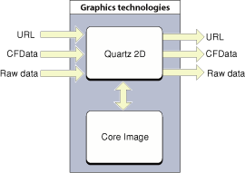

> 导航：[总目录](../../../README.md) · [documentation](../../../_indexes/documentation.md) · [Quartz 2D Programming Guide](Introduction.md)

[Next](Bitmap%20Images%20and%20Image%20Masks.md)[Previous](Transparency%20Layers.md)

# Data Management in Quartz 2D

Managing data is a task every graphics application needs to perform. For Quartz, data management refers to supplying data to or receiving data from Quartz 2D routines. Some Quartz 2D routines move data into Quartz, such as those that get image or PDF data from a file or another part of your application. Other routines accept Quartz data, such as those that write image or PDF data to a file or provide the data to another part of your application.

Quartz provides a variety of functions for managing data. By reading this chapter, you should be able to determine which functions are best for your application.

Quartz recognizes three broad categories of data sources and destinations:

- URL. Data whose location can be specified as a URL can act as a supplier or receiver of data. You pass a URL to a Quartz function using the Core Foundation data type [CFURLRef](https://developer.apple.com/documentation/corefoundation/cfurl).
- CFData. The Core Foundation data types [CFDataRef](https://developer.apple.com/documentation/corefoundation/cfdata) and [CFMutableDataRef](https://developer.apple.com/documentation/corefoundation/cfmutabledataref) are data objects that let simple allocated buffers take on the behavior of Core Foundation objects. CFData is “toll-free bridged” with its Cocoa Foundation counterpart, the `NSData` class; if you are using Quartz 2D with the Cocoa framework, you can pass an `NSData` object to any Quartz function that takes a CFData object.
- Raw data. You can provide a pointer to data of any type along with a set of callbacks that take care of basic memory management for the data.

The data itself, whether represented by a URL, a CFData object, or a data buffer, can be image data or PDF data. Image data can use any type of file format. Quartz understands most of the common image file formats. Some of the Quartz data management functions work specifically with image data, a few work only with PDF data, while others are more generic and can be used either for PDF or image data.

URL, CFData, and raw data sources and destinations refer to data outside the realm of Mac OS X or iOS graphics technologies, as shown in Figure 10-1. Other graphics technologies in Mac OS X or iOS often provide their own routines to communicate with Quartz. For example, a Mac OS X application can send Quartz images to Core Image and use it to alter the image with sophisticated effects.

__Figure 10-1__  Moving data to and from Quartz 2D in Mac OS X

The functions for getting data from a data source are listed in [Table 10-1](#apple-f4xwc4dqnrsv64tfmyxwi33df52wszbpkridgmbqgaytanrwfvbuqmrrgywueqkkjfbuussb). All these functions, except for [CGPDFDocumentCreateWithURL](https://developer.apple.com/documentation/coregraphics/cgpdfdocument/1402585-init), either return an image source (`CGImageSourceRef`) or a data provider (`CGDataProviderRef`). Image sources and data providers abstract the data-access task and eliminate the need for applications to manage data through a raw memory buffer.

Image sources are the preferred way to move image data into Quartz. An image source represents a wide variety of image data. An image source can contain more than one image, thumbnail images, and properties for each image and the image file. After you have a `CGImageSourceRef`, you can accomplish these tasks:

- Create images ([CGImageRef](https://developer.apple.com/documentation/coregraphics/cgimageref)) using the functions [CGImageSourceCreateImageAtIndex](https://developer.apple.com/documentation/imageio/1465011-cgimagesourcecreateimageatindex), [CGImageSourceCreateThumbnailAtIndex](https://developer.apple.com/documentation/imageio/1465099-cgimagesourcecreatethumbnailatin), or [CGImageSourceCreateIncremental](https://developer.apple.com/documentation/imageio/1465151-cgimagesourcecreateincremental). A `CGImageRef` data type represents a single Quartz image.
- Add content to an image source using the functions [CGImageSourceUpdateData](https://developer.apple.com/documentation/imageio/1465473-cgimagesourceupdatedata) or [CGImageSourceUpdateDataProvider](https://developer.apple.com/documentation/imageio/1465175-cgimagesourceupdatedataprovider).
- Obtain information from an image source using the functions [CGImageSourceGetCount](https://developer.apple.com/documentation/imageio/1465029-cgimagesourcegetcount) , `CGImageSourceCopyProperties`, and [CGImageSourceCopyTypeIdentifiers](https://developer.apple.com/documentation/imageio/1465383-cgimagesourcecopytypeidentifiers).

The function [CGPDFDocumentCreateWithURL](https://developer.apple.com/documentation/coregraphics/cgpdfdocument/1402585-init) is a convenience function that creates a PDF document from the file located at the specified URL.

Data providers are an older mechanism with more limited functionality. They can be used to obtain image or PDF data.

You can supply a data provider to:

- An image creation function, such as [CGImageCreate](https://developer.apple.com/documentation/coregraphics/cgimage/1455149-init), [CGImageCreateWithPNGDataProvider](https://developer.apple.com/documentation/coregraphics/cgimage/1454993-init), or [CGImageCreateWithJPEGDataProvider](https://developer.apple.com/documentation/coregraphics/cgimage/1454920-init).
- The PDF document creation function [CGPDFDocumentCreateWithProvider](https://developer.apple.com/documentation/coregraphics/cgpdfdocument/1402603-init).
- The function [CGImageSourceUpdateDataProvider](https://developer.apple.com/documentation/imageio/1465175-cgimagesourceupdatedataprovider) to update an existing image source with new data.

For more information on images, see [Bitmap Images and Image Masks](Bitmap%20Images%20and%20Image%20Masks.md#apple-f4xwc4dqnrsv64tfmyxwi33df52wszbpkridgmbqgaytanrwfvbuqmrrgiwviucykjcummjqge).

__Table 10-1__  Functions that move data into Quartz 2D

| Function | Use this function |
| [CGImageSourceCreateWithDataProvider](https://developer.apple.com/documentation/imageio/1465285-cgimagesourcecreatewithdataprovi) | To create an image source from a data provider. |
| [CGImageSourceCreateWithData](https://developer.apple.com/documentation/imageio/1465073-cgimagesourcecreatewithdata) | To create an image source from a CFData object. |
| [CGImageSourceCreateWithURL](https://developer.apple.com/documentation/imageio/1465262-cgimagesourcecreatewithurl) | To create an image source from a URL that specifies the location of image data. |
| [CGPDFDocumentCreateWithURL](https://developer.apple.com/documentation/coregraphics/cgpdfdocument/1402585-init) | To create a PDF document from data that resides at the specified URL. |
| [CGDataProviderCreateSequential](https://developer.apple.com/documentation/coregraphics/1408291-cgdataprovidercreatesequential) | To read image or PDF data in a stream. You supply callbacks to handle the data. |
| [CGDataProviderCreateDirectAccess](https://developer.apple.com/documentation/coregraphics/cgdataprovider/1805228-cgdataprovidercreatedirectaccess) | To read image or PDF data in a block. You supply callbacks to handle the data. |
| [CGDataProviderCreateWithData](https://developer.apple.com/documentation/coregraphics/cgdataprovider/1408288-init) | To read a buffer of image or PDF data supplied by your application. You provide a callback to release the memory you allocated for the data. |
| [CGDataProviderCreateWithURL](https://developer.apple.com/documentation/coregraphics/1408327-cgdataprovidercreatewithurl) | Whenever you can supply a URL that specifies the target for data access to image or PDF data. |
| [CGDataProviderCreateWithCFData](https://developer.apple.com/documentation/coregraphics/cgdataprovider/1408284-init) | To read image or PDF data from a CFData object. |

The functions listed in [Table 10-2](#apple-f4xwc4dqnrsv64tfmyxwi33df52wszbpkridgmbqgaytanrwfvbuqmrrgywueqkki5desscg) move data out of Quartz 2D. All these functions, except for [CGPDFContextCreateWithURL](https://developer.apple.com/documentation/coregraphics/cgcontext/1456290-init), either return an image destination ([CGImageDestinationRef](https://developer.apple.com/documentation/imageio/cgimagedestinationref)) or a data consumer ([CGDataConsumerRef](https://developer.apple.com/documentation/coregraphics/cgdataconsumer)). Image destination and data consumers abstract the data-writing task, letting Quartz take care of the details for you.

An image destination is the preferred way to move image data out of Quartz. Similar to image sources, an image destination can represent a variety of image data, from a single image to a destination that contains multiple images, thumbnail images, and properties for each image or for the image file. After you have a [CGImageDestinationRef](https://developer.apple.com/documentation/imageio/cgimagedestinationref), you can accomplish these tasks:

- Add images ([CGImageRef](https://developer.apple.com/documentation/coregraphics/cgimageref)) to a destination using the functions [CGImageDestinationAddImage](https://developer.apple.com/documentation/imageio/1464962-cgimagedestinationaddimage) or [CGImageDestinationAddImageFromSource](https://developer.apple.com/documentation/imageio/1465143-cgimagedestinationaddimagefromso). A `CGImageRef` data type represents a single Quartz image.
- Set properties using the function [CGImageDestinationSetProperties](https://developer.apple.com/documentation/imageio/1464919-cgimagedestinationsetproperties).
- Obtain information from an image destination using the functions [CGImageDestinationCopyTypeIdentifiers](https://developer.apple.com/documentation/imageio/1465316-cgimagedestinationcopytypeidenti) or [CGImageDestinationGetTypeID](https://developer.apple.com/documentation/imageio/1465250-cgimagedestinationgettypeid).

The function [CGPDFContextCreateWithURL](https://developer.apple.com/documentation/coregraphics/cgcontext/1456290-init) is a convenience function that writes PDF data to the location specified by a URL.

Data consumers are an older mechanism with more limited functionality. They are used to write image or PDF data. You can supply a data consumer to:

- The PDF context creation function [CGPDFContextCreate](https://developer.apple.com/documentation/coregraphics/1454204-cgpdfcontextcreate). This function returns a graphics context that records your drawing as a sequence of PDF drawing commands that are passed to the data consumer object.
- The function [CGImageDestinationCreateWithDataConsumer](https://developer.apple.com/documentation/imageio/1465231-cgimagedestinationcreatewithdata) to create an image destination from a data consumer.

For more information on images, see [Bitmap Images and Image Masks](Bitmap%20Images%20and%20Image%20Masks.md#apple-f4xwc4dqnrsv64tfmyxwi33df52wszbpkridgmbqgaytanrwfvbuqmrrgiwviucykjcummjqge).

__Table 10-2__  Functions that move data out of Quartz 2D

| Function | Use this function |
| [CGImageDestinationCreateWithDataConsumer](https://developer.apple.com/documentation/imageio/1465231-cgimagedestinationcreatewithdata) | To write image data to a data consumer. |
| [CGImageDestinationCreateWithData](https://developer.apple.com/documentation/imageio/1465133-cgimagedestinationcreatewithdata) | To write image data to a CFData object. |
| [CGImageDestinationCreateWithURL](https://developer.apple.com/documentation/imageio/1465361-cgimagedestinationcreatewithurl) | Whenever you can supply a URL that specifies where to write the image data. |
| [CGPDFContextCreateWithURL](https://developer.apple.com/documentation/coregraphics/cgcontext/1456290-init) | Whenever you can supply a URL that specifies where to write PDF data. |
| [CGDataConsumerCreateWithURL](https://developer.apple.com/documentation/coregraphics/1454474-cgdataconsumercreatewithurl) | Whenever you can supply a URL that specifies where to write the image or PDF data. |
| [CGDataConsumerCreateWithCFData](https://developer.apple.com/documentation/coregraphics/1456292-cgdataconsumercreatewithcfdata) | To write image or PDF data to a CFData object. |
| [CGDataConsumerCreate](https://developer.apple.com/documentation/coregraphics/cgdataconsumer/1456428-init) | To write image or PDF data using callbacks you supply. |

The Core Image framework is an Objective-C API provided in Mac OS X that supports image processing. Core Image lets you access built-in image filters for both video and still images and provides support for custom filters and near real-time processing. You can apply Core Image filters to Quartz 2D images. For example, you can use Core Image to correct color, distort the geometry of images, blur or sharpen images, and create a transition between images. Core Image also allows you to apply an iterative process to an image—one that feeds back the output of a filter operation to the input. To understand the capabilities of Core Image more fully, see _[Core Image Programming Guide](../Core%20Image%20Programming%20Guide/About%20Core%20Image.md#apple-f4xwc4dqnrsv64tfmyxwi33df52wszbpkridgmbqgaytcobv)_.

Core Image methods operate on images that are packaged as Core Image images, or CIImage objects. Core Image does not operate directly on Quartz images (`CGImageRef` data types). Quartz images must be converted to Core Image images before you apply a Core Image filter to the image.

The Quartz 2D API does not provide any functions that package Quartz images as Core Image images, but Core Image does. The following Core Image methods create a Core Image image from either a Quartz image or a Quartz layer (`CGLayerRef`). You can use them to move Quartz 2D data to Core Image.

- [imageWithCGImage:](https://developer.apple.com/documentation/coreimage/ciimage/1547025-imagewithcgimage)
- [imageWithCGImage:options:](https://developer.apple.com/documentation/coreimage/ciimage/1547021-imagewithcgimage)
- [imageWithCGLayer:](https://developer.apple.com/documentation/coreimage/ciimage/1547022-imagewithcglayer)
- [imageWithCGLayer:options:](https://developer.apple.com/documentation/coreimage/ciimage/1546998-imagewithcglayer)

The following Core Image methods return a Quartz image from a Core Image image. You can use them to move a processed image back into Quartz 2D:

- [createCGImage:fromRect:](https://developer.apple.com/documentation/coreimage/cicontext/1437784-createcgimage)
- [createCGLayerWithSize:info:](https://developer.apple.com/documentation/coreimage/cicontext/1438267-createcglayerwithsize)

For a complete description of Core Image methods, see _[Core Image Reference Collection](https://developer.apple.com/documentation/coreimage)_.

[Next](Bitmap%20Images%20and%20Image%20Masks.md)[Previous](Transparency%20Layers.md)

