> 导航：[总目录](../../../README.md) · [documentation](../../../_indexes/documentation.md) · [Quartz 2D Programming Guide](Introduction.md)


[Next](Transparency%20Layers.md)[Previous](Shadows.md)

# Gradients

Quartz provides two opaque data types for creating gradients—`CGShadingRef` and `CGGradientRef`. You can use either of these to create axial or radial gradients. A _gradient_ is a fill that varies from one color to another.

An _axial gradient_ (also called a _linear gradient_) varies along an axis between two defined end points. All points that lie on a line perpendicular to the axis have the same color value.

A _radial gradient_ is a fill that varies radially along an axis between two defined ends, which typically are both circles. Points share the same color value if they lie on the circumference of a circle whose center point falls on the axis. The radius of the circular sections of the gradient are defined by the radii of the end circles; the radius of each intermediate circle varies linearly from one end to the other.

This chapter provides examples of the sorts of linear and radial gradients you can create with Quartz, compares the two approaches you can take to painting gradients, and then shows how to use each opaque data type to create a gradient.

Quartz functions provide a rich vocabulary for creating gradient effects. This section shows some of the results you can achieve. The axial gradient in Figure 8-1 varies between one endpoint that is a shade of orange and another that is a shade of yellow. In this case, the axis is at a 45 degree angle with respect to the origin.

__Figure 8-1__  An axial gradient along a 45 degree axis

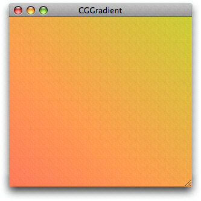

Quartz also lets you specify colors and locations along an axis to create more complex axial gradients, as shown in Figure 8-2. The color at the starting point is a shade of red and the color at the ending point is a shade of violet. However, there are also five locations on the axis whose color is set to orange, yellow, green, blue, and indigo, respectively. You can think of the result as six sequential linear gradients along the same axis. Although the axis used here is the same as that used in Figure 8-1 (45 degree angle), it doesn’t have to be. The angle of the axis is defined by the starting and ending point that you provide.

__Figure 8-2__  An axial gradient created with seven locations and colors

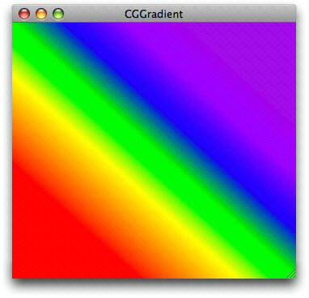

Figure 8-3 shows a radial gradient that varies between a small, bright red circle and a larger black one.

__Figure 8-3__  A radial gradient that varies between two circles

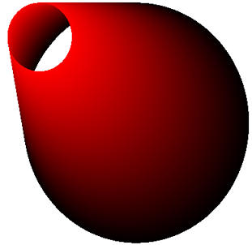

With Quartz, you are not restricted to creating gradients based on color changes; you can vary only the alpha, or you can vary the alpha along with the other color components. Figure 8-4 shows a gradient whose red, green, and blue components remain constant as the alpha value varies from 1.0 to 0.1.

__Figure 8-4__  A radial gradient created by varying only the alpha component

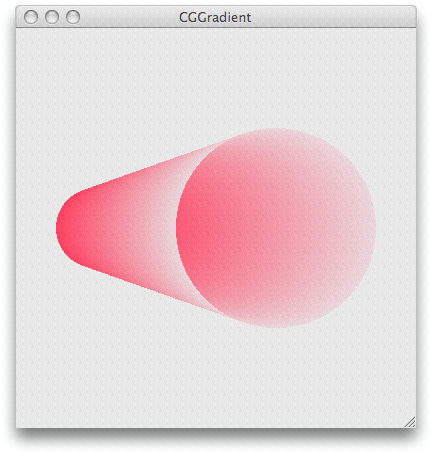

You can position the circles in a radial gradient to create a variety of shapes. If one circle is partially or fully outside the other, Quartz creates a conical surface for circles that have unequal circumferences, and a cylindrical surface for circles that have equal circumferences. A common use of a radial gradient is to create a shaded sphere, as shown in Figure 8-5. In this case, a single point (a circle with a radius of `0`) lies within a larger circle.

__Figure 8-5__  A radial gradient that varies between a point and a circle

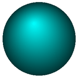

You can create more complex effects by nesting several radial gradients similar to the shape shown in Figure 8-6. The toroidal portion of the shape is created using concentric circles.

__Figure 8-6__  Nested radial gradients

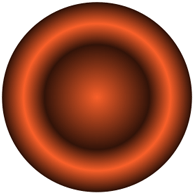

With two type of objects available for creating gradients, you might be wondering which one is best to use. This section helps answer that question.

The `CGShadingRef` opaque data type gives you control over how the color at each point in the gradient is computed. Before you can create a CGShading object, you must create a CGFunction object ([CGFunctionRef](https://developer.apple.com/documentation/coregraphics/cgfunctionref)) that defines a function for computing colors in the gradient. Writing a custom function gives you the freedom to create smooth gradients, such as those shown in [Figure 8-1](#apple-f4xwc4dqnrsv64tfmyxwi33df52wszbpkridgmbqgaytanrwfvbuqmrqg4wvgvzr), [Figure 8-3](#apple-f4xwc4dqnrsv64tfmyxwi33df52wszbpkridgmbqgaytanrwfvbuqmrqg4wueqsdivcemrck), and [Figure 8-5](#apple-f4xwc4dqnrsv64tfmyxwi33df52wszbpkridgmbqgaytanrwfvbuqmrqg4wueqsdizbeqssg) or more unconventional effects, such as that shown in [Figure 8-12](#apple-f4xwc4dqnrsv64tfmyxwi33df52wszbpkridgmbqgaytanrwfvbuqmrqg4wueqsdi5demrkf).

When you create a CGShading object, you specify whether it is axial (linear) or radial. Along with the gradient calculation function (encapsulated as a CGFunction object) you also supply a color space, and starting and ending points or radii, depending on whether you draw an axial or radial gradient. At drawing time, you simply pass the CGShading object along with the drawing context to the function [CGContextDrawShading](https://developer.apple.com/documentation/coregraphics/cgcontext/1456643-drawshading). Quartz invokes your gradient calculation function for each point in the gradient.

A CGGradient object is a subset of a CGShading object that’s designed with ease-of-use in mind. The `CGGradientRef` opaque data type is straightforward to use because Quartz calculates the color at each point in the gradient for you—you don’t supply a gradient calculation function. When you create a gradient object, you provide an array of locations and colors. Quartz calculates a gradient for each set of contiguous locations, using the color you assign to each location as the end points for the gradient. You can set a gradient object to use a single starting and ending location, as shown in [Figure 8-1](#apple-f4xwc4dqnrsv64tfmyxwi33df52wszbpkridgmbqgaytanrwfvbuqmrqg4wvgvzr), or you can provide a number of points to create an effect similar to what’s shown in [Figure 8-2](#apple-f4xwc4dqnrsv64tfmyxwi33df52wszbpkridgmbqgaytanrwfvbuqmrqg4wvgvzw). The ability to provide more than two locations is an advantage over using a CGShading object, which is limited to two locations.

When you create a CGGradient object, you simply set up a color space, locations, and a color for each location. When you draw to a context using a gradient object, you specify whether Quartz should draw an axial or radial gradient. At drawing time, you specify starting and ending points or radii, depending on whether you draw an axial or radial gradient, in contrast to CGShading objects, whose geometry is defined at creation time, not at drawing time.

Table 8-1 summarizes the differences between the two opaque data types.

__Table 8-1__  Differences between CGShading and CGGradient objects

| CGGradient | CGShading |
| Can use the same object to draw axial and radial gradients. | Need to create separate objects for axial and radial gradients. |
| Set the geometry of the gradient at drawing time. | Set the geometry of the gradient at object creation time. |
| Quartz calculates the colors for each point in the gradient. | You must supply a callback function that calculates the colors for each point in the gradient. |
| Easy to define more than two locations and colors. | Need to design your callback to use more than two locations and colors, so it takes a bit more work on your part. |

When you create a gradient, you have the option of filling the space beyond the ends of the gradient with a solid color. Quartz uses the color defined at the boundary of the gradient as the fill color. You can extend beyond the start of a gradient, the end of a gradient, or both. You can apply the option to an axial or a radial gradient created using either a CGShading object or a CGGradient object. Each type of object supplies constants you can use to set the extension option, as you’ll see in [Using a CGGradient Object](#apple-f4xwc4dqnrsv64tfmyxwi33df52wszbpkridgmbqgaytanrwfvbuqmrqg4wvgvzu) and [Using a CGShading Object](#apple-f4xwc4dqnrsv64tfmyxwi33df52wszbpkridgmbqgaytanrwfvbuqmrqg4wvgvzv).

Figure 8-7 shows an axial gradient that extends at both the starting and ending locations. The line in the figure shows the axis of the gradient. As you can see, the fill colors correspond to the colors at the starting and ending points.

__Figure 8-7__  Extending an axial gradient

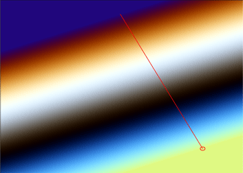

Figure 8-8 compares a radial gradient that does not use the extension options with one that uses extension options for both the starting and ending locations. Quartz takes the starting and ending color values and uses those solid colors to extend the surface as shown. The figure shows the starting and ending circles, and the axis of the gradient.

__Figure 8-8__  Extending a radial gradient

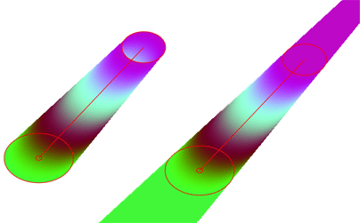

The CGGradient object is an abstract definition of a gradient—it simply specifies colors and locations, but not the geometry. You can use this same object for both axial and radial geometries. As an abstract definition, CGGradient objects are perhaps more readily reusable than their counterparts, CGShading objects. Not having the geometry locked in the CGGradient object allows for the possibility of iteratively painting gradients based on the same color scheme without the need for also tying up memory resources in multiple CGGradient objects.

Because Quartz calculates the gradient for you, using a CGGradient object to create and draw a gradient is fairly straightforward, requiring these steps:

1. Create a CGGradient object, supplying a color space, an array of two or more color components, an array of two or more locations, and the number of items in each of the two arrays.
2. Paint the gradient by calling either [CGContextDrawLinearGradient](https://developer.apple.com/documentation/coregraphics/1454782-cgcontextdrawlineargradient) or [CGContextDrawRadialGradient](https://developer.apple.com/documentation/coregraphics/1455923-cgcontextdrawradialgradient) and supplying a context, a CGGradient object, drawing options, and the stating and ending geometry (points for axial gradients or circle centers and radii for radial gradients).
3. Release the CGGradient object when you no longer need it.

A location is a `CGFloat` value in the range of 0.0 to 1.0, inclusive, that specifies the normalized distance along the axis of the gradient. A value of 0.0 specifies the starting point of the axis, while 1.0 specifies the ending point of the axis. Other values specify a proportion of the distance, such as 0.25 for one-fourth of the distance from the starting point and 0.5 for the halfway point on the axis. At a minimum, Quartz uses two locations. If you pass `NULL` for the locations array, Quartz uses 0 for the first location and 1 for the second.

The number of color components per color depends on the color space. For onscreen drawing, you’ll use an RGB color space. Because Quartz draws with alpha, each onscreen color has four components—red, green, blue, and alpha. So, for onscreen drawing, the number of elements in the color component array that you provide must contain four times the number of locations. Quartz RGBA color components can vary in value from 0.0 to 1.0, inclusive.

Listing 8-1 is a code fragment that creates a CGGradient object. After declaring the necessary variables, the code sets the locations and the requisite number of color components (for this example, 2 X 4 = 8). It creates a generic RGB color space. (In iOS, where generic RGB color spaces are not available, your code should call `CGColorSpaceCreateDeviceRGB` instead.) Then, it passes the necessary parameters to the function [CGGradientCreateWithColorComponents](https://developer.apple.com/documentation/coregraphics/cggradient/1398454-init). You can also use the function [CGGradientCreateWithColors](https://developer.apple.com/documentation/coregraphics/cggradient/1398458-init) which is convenient if your application sets up CGColor objects.

__Listing 8-1__  Creating a CGGradient object

```
CGGradientRef myGradient;
CGColorSpaceRef myColorspace;
size_t num_locations = 2;
CGFloat locations[2] = { 0.0, 1.0 };
CGFloat components[8] = { 1.0, 0.5, 0.4, 1.0,  // Start color
                          0.8, 0.8, 0.3, 1.0 }; // End color

myColorspace = CGColorSpaceCreateWithName(kCGColorSpaceGenericRGB);
myGradient = CGGradientCreateWithColorComponents (myColorspace, components,
                          locations, num_locations);
```

After you create a CGGradient object, you can use it to paint an axial or linear gradient. Listing 8-2 is a code fragment that declares and sets the starting and ending points for a linear gradient and then paints the gradient. [Figure 8-1](#apple-f4xwc4dqnrsv64tfmyxwi33df52wszbpkridgmbqgaytanrwfvbuqmrqg4wvgvzr) shows the result. The code does not show how to obtain the CGContext object (`myContext`).

__Listing 8-2__  Painting an axial gradient using a CGGradient object

```
CGPoint myStartPoint, myEndPoint;
myStartPoint.x = 0.0;
myStartPoint.y = 0.0;
myEndPoint.x = 1.0;
myEndPoint.y = 1.0;
CGContextDrawLinearGradient (myContext, myGradient, myStartPoint, myEndPoint, 0);
```

Listing 8-3 is a code fragment that uses the CGGradient object created in [Listing 8-1](#apple-f4xwc4dqnrsv64tfmyxwi33df52wszbpkridgmbqgaytanrwfvbuqmrqg4wvgvzs) to paint the radial gradient shown in [Figure 8-9](#apple-f4xwc4dqnrsv64tfmyxwi33df52wszbpkridgmbqgaytanrwfvbuqmrqg4wvgvzrga). This example illustrates the result of extending the area of the gradient by filling it with a solid color.

__Listing 8-3__  Painting a radial gradient using a CGGradient object

```
CGPoint myStartPoint, myEndPoint;
CGFloat myStartRadius, myEndRadius;
myStartPoint.x = 0.15;
myStartPoint.y = 0.15;
myEndPoint.x = 0.5;
myEndPoint.y = 0.5;
myStartRadius = 0.1;
myEndRadius = 0.25;
CGContextDrawRadialGradient (myContext, myGradient, myStartPoint,
                         myStartRadius, myEndPoint, myEndRadius,
                         kCGGradientDrawsAfterEndLocation);
```


__Figure 8-9__  A radial gradient painted using a CGGradient object

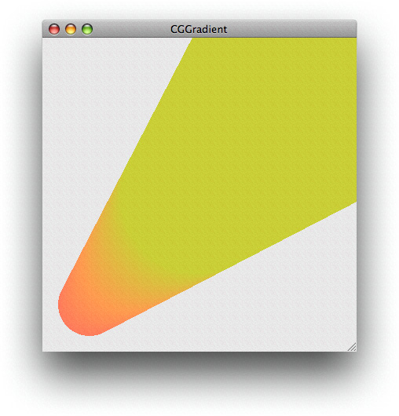

The radial gradient shown in [Figure 8-4](#apple-f4xwc4dqnrsv64tfmyxwi33df52wszbpkridgmbqgaytanrwfvbuqmrqg4wvgvzx) was created using the variables shown in Listing 8-4.

__Listing 8-4__  The variables used to create a radial gradient by varying alpha

```
CGPoint myStartPoint, myEndPoint;
CGFloat myStartRadius, myEndRadius;
myStartPoint.x = 0.2;
myStartPoint.y = 0.5;
myEndPoint.x = 0.65;
myEndPoint.y = 0.5;
myStartRadius = 0.1;
myEndRadius = 0.25;
size_t num_locations = 2;
CGFloat locations[2] = { 0, 1.0 };
CGFloat components[8] = { 0.95, 0.3, 0.4, 1.0,
                          0.95, 0.3, 0.4, 0.1 };
```

Listing 8-5 shows the variables used to create the gray gradient shown in Figure 8-10, which has three locations.

__Listing 8-5__  The variables used to create a gray gradient

```
size_t num_locations = 3;
CGFloat locations[3] = { 0.0, 0.5, 1.0};
CGFloat components[12] = {  1.0, 1.0, 1.0, 1.0,
                            0.5, 0.5, 0.5, 1.0,
                            1.0, 1.0, 1.0, 1.0 };
```


__Figure 8-10__  An axial gradient with three locations

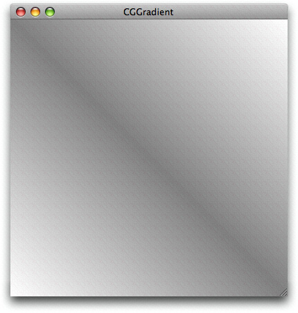

You set up a gradient by creating a CGShading object calling the function `CGShadingCreateAxial` or `CGShadingCreateRadial`, supplying the following parameters:

- A CGColorSpace object that describe the color space for Quartz to use when it interprets the color component values your callback supplies.
- Starting and ending points. For axial gradients, these are the starting and ending coordinates (in user space) of the axis. For radial gradients, these are the coordinates of the center of the starting and ending circles.
- Starting and ending radii (only for a radial gradient) for the circles used to define the gradient area.
- A CGFunction object, which you obtain by calling the function `CGFunctionCreate`, discussed later in this section. This callback routine must return a color to draw at a particular point.
- Boolean values that specify whether to fill the area beyond the starting or ending points with a solid color.

The CGFunction object you supply to the CGShading creation functions contains a callbacks structure and all the information Quartz needs to implement your callback. Perhaps the trickiest part of setting up a CGShading object is creating the CGFunction object. When you call the function `CGFunctionCreate,` you supply the following:

- A pointer to any data your callback needs.
- The number of input values to your callback. Quartz requires that your callback takes one input value.
- An array of floating-point values. Quartz supplies your callback with only one element in this array. An input value can range from 0, for the color at the start of the gradient, to 1, for the color at the end of the gradient.
- The number of output values provided by your callback. For each input value, your callback must supply a value for each color component and an alpha value to designate opacity. The color component values are interpreted by Quartz in the color space you create and supply to the CGShading creation function. For example, if you are using an RGB color space, you supply the value 4 as the number of output values (R, G, B, and A).
- An array of floating-point values that specify each of the color components and an alpha value.
- A callbacks data structure that contains the version of the structure (set this field to `0`), your callback for generating color component values, and an optional callback to release the data supplied to your callback in the `info` parameter. If you were to name your callback `myCalculateShadingValues`, it would look like this:

  `void myCalculateShadingValues (void *info, const CGFloat *in, CGFloat *out)`

After you create the CGShading object, you can set up additional clipping if you need to do so. Then, call the function `CGContextDrawShading` to paint the clipping area of the context with the gradient. When you call this function, Quartz invokes your callback to obtain color values that span the range from the starting point to the ending point.

When you no longer need the CGShading object, you release it by calling the function `CGShadingRelease`.

[Painting an Axial Gradient Using a CGShading Object](#apple-f4xwc4dqnrsv64tfmyxwi33df52wszbpkridgmbqgaytanrwfvbuqmrqg4wueqsdireusrsh) and [Painting a Radial Gradient Using a CGShading Object](#apple-f4xwc4dqnrsv64tfmyxwi33df52wszbpkridgmbqgaytanrwfvbuqmrqg4wueqsdjfeecqsb) provide step-by-step instructions on writing code that uses a CGShading object to draw a gradient.

Axial and radial gradients require you to perform similar steps. This example shows how to draw an axial gradient using a CGShading object, create a semicircular clipping path in a graphics context, then paint the gradient to the clipped context to achieve the output shown in Figure 8-11.

__Figure 8-11__  An axial gradient that is clipped and painted

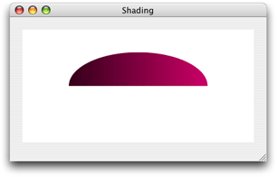

To paint the axial gradient shown in the figure, follow the steps explained in these sections:

1. [Set Up a CGFunction Object to Compute Color Values](#apple-f4xwc4dqnrsv64tfmyxwi33df52wszbpkridgmbqgaytanrwfvbuqmrqg4wugskii5aukrsk)
2. [Create a CGShading Object for an Axial Gradient](#apple-f4xwc4dqnrsv64tfmyxwi33df52wszbpkridgmbqgaytanrwfvbuqmrqg4wugskiizdemssh)
3. [Clip the Context](#apple-f4xwc4dqnrsv64tfmyxwi33df52wszbpkridgmbqgaytanrwfvbuqmrqg4wueqsdijbuuqkf)
4. [Paint the Axial Gradient Using a CGShading Object](#apple-f4xwc4dqnrsv64tfmyxwi33df52wszbpkridgmbqgaytanrwfvbuqmrqg4wugskiirbucrsi)
5. [Release Objects](#apple-f4xwc4dqnrsv64tfmyxwi33df52wszbpkridgmbqgaytanrwfvbuqmrqg4wugskiincukrkb)

You can compute color values any way you like, as long as your color computation function takes three parameters:

- `void *info`. This is `NULL` or a pointer to data you pass to the CGShading creation function.
- `const CGFloat *in`. Quartz passes the `in` array to your callback. The values in the array must be in the input value range defined for your CGFunction object. For this example, the input range is 0 to 1; see [Listing 8-7](#apple-f4xwc4dqnrsv64tfmyxwi33df52wszbpkridgmbqgaytanrwfvbuqmrqg4wueqsdijbeiq2d).
- `CGFloat *out`. Your callback passes the `out` array to Quartz. It contains one element for each color component in the color space, and an alpha value. Output values should be in the output value range defined for your CGFunction object. For this example, the output range is 0 to 1; see [Listing 8-7](#apple-f4xwc4dqnrsv64tfmyxwi33df52wszbpkridgmbqgaytanrwfvbuqmrqg4wueqsdijbeiq2d).

For more information on these parameters, see [CGFunctionEvaluateCallback](https://developer.apple.com/documentation/coregraphics/cgfunctionevaluatecallback).

Listing 8-6 shows a function that computes color component values by multiplying the values defined in a constant array by the input value. Because the input value ranges from 0 through 1, the output values range from black (for RGB, the values 0, 0, 0), through (1, 0, .5) which is a purple hue. Note that the last component is always set to `1`, so that the colors are always fully opaque.

__Listing 8-6__  Computing color component values

```

static void myCalculateShadingValues (void *info,
                            const CGFloat *in,
                            CGFloat *out)
{
    CGFloat v;
    size_t k, components;
    static const CGFloat c[] = {1, 0, .5, 0 };

    components = (size_t)info;

    v = *in;
    for (k = 0; k < components -1; k++)
        *out++ = c[k] * v;
     *out++ = 1;
}
```

After you write your callback to compute color values, you package it as part of a CGFunction object. It’s the CGFunction object you supply to Quartz when you create a CGShading object. Listing 8-7 shows a function that creates a CGFunction object that contains the callback from Listing 8-6. A detailed explanation for each numbered line of code appears following the listing.

__Listing 8-7__  Creating a CGFunction object

```

static CGFunctionRef myGetFunction (CGColorSpaceRef colorspace)// 1
{
    size_t numComponents;
    static const CGFloat input_value_range [2] = { 0, 1 };
    static const CGFloat output_value_ranges [8] = { 0, 1, 0, 1, 0, 1, 0, 1 };
    static const CGFunctionCallbacks callbacks = { 0,// 2
                                &myCalculateShadingValues,
                                NULL };

    numComponents = 1 + CGColorSpaceGetNumberOfComponents (colorspace);// 3
    return CGFunctionCreate ((void *) numComponents, // 4
                                1, // 5
                                input_value_range, // 6
                                numComponents, // 7
                                output_value_ranges, // 8
                                &callbacks);// 9
}
```

Here’s what the code does:

1. Takes a color space as a parameter.
2. Declares a callbacks structure and fills it with the version of the structure (`0`), a pointer to your color component calculation callback, and `NULL` for the optional release function.
3. Calculates the number of color components in the color space and increments the value by 1 to account for the alpha value.
4. Passes a pointer to the `numComponents` value. This value is used by the callback `myCalculateShadingValues` to determine the number of components to compute.
5. Specifies that 1 is the number of input values to the callback.
6. Provides an array that specifies the valid intervals for the input. This array contains 0 and 1.
7. Passes the number of output values, which is the number of color components plus alpha.
8. Provides an array that specifies the valid intervals for each output value. This array specifies, for each component, the intervals 0 and 1. Because there are four components, there are eight elements in this array.
9. Passes a pointer to the callback structure declared and filled previously.

To create a CGShading object, you call the function `CGShadingCreateAxial`, as shown in Listing 8-8, passing a color space, starting and ending points, a CGFunction object, and a Boolean value that specifies whether to fill the area beyond the starting and ending points of the gradient.

__Listing 8-8__  Creating a CGShading object for an axial gradient

```
CGPoint     startPoint,
            endPoint;
CGFunctionRef myFunctionObject;
CGShadingRef myShading;

startPoint = CGPointMake(0,0.5);
endPoint = CGPointMake(1,0.5);
colorspace = CGColorSpaceCreateDeviceRGB();
myFunctionObject = myGetFunction (colorspace);

myShading = CGShadingCreateAxial (colorspace,
                        startPoint, endPoint,
                        myFunctionObject,
                        false, false);
```


When you paint a gradient, Quartz fills the current context. Painting a gradient is different from working with colors and patterns, which are used to stroke and fill path objects. As a result, if you want your gradient to appear in a particular shape, you need to clip the context accordingly. The code in Listing 8-9 adds a semicircle to the current context so that the gradient is painted into that clip area, as shown in [Figure 8-11](#apple-f4xwc4dqnrsv64tfmyxwi33df52wszbpkridgmbqgaytanrwfvbuqmrqg4wueqsdjjbesskk).

If you look carefully, you’ll notice that the code should result in a half circle, whereas the figure shows a half ellipse. Why? You’ll see, when you look at the entire routine in [A Complete Routine for an Axial Gradient Using a CGShading Object](#apple-f4xwc4dqnrsv64tfmyxwi33df52wszbpkridgmbqgaytanrwfvbuqmrqg4wueqsdivbuuqsg), that the context is also scaled. More about that later. Although you might not need to apply scaling or a clip in your application, these and many other options exist in Quartz 2D to help you achieve interesting effects.

__Listing 8-9__  Adding a semicircle clip to the graphics context

```
    CGContextBeginPath (myContext);
    CGContextAddArc (myContext, .5, .5, .3, 0,
                    my_convert_to_radians (180), 0);
    CGContextClosePath (myContext);
    CGContextClip (myContext);
```


Call the function `CGContextDrawShading` to fill the current context using the color gradient specified in the CGShading object:

```
CGContextDrawShading (myContext, myShading);
```


You call the function `CGShadingRelease` when you no longer need the CGShading object. You also need to release the CGColorSpace object and the CGFunction object as shown in Listing 8-10.

__Listing 8-10__  Releasing objects

```
CGShadingRelease (myShading);
CGColorSpaceRelease (colorspace);
CGFunctionRelease (myFunctionObject);
```


The code in Listing 8-11 shows a complete routine that paints an axial gradient, using the CGFunction object set up in [Listing 8-7](#apple-f4xwc4dqnrsv64tfmyxwi33df52wszbpkridgmbqgaytanrwfvbuqmrqg4wueqsdijbeiq2d) and the callback shown in [Listing 8-6](#apple-f4xwc4dqnrsv64tfmyxwi33df52wszbpkridgmbqgaytanrwfvbuqmrqg4wueqsdijduoscd). A detailed explanation for each numbered line of code appears following the listing.

__Listing 8-11__  Painting an axial gradient using a CGShading object

```
void myPaintAxialShading (CGContextRef myContext,// 1
                            CGRect bounds)
{
    CGPoint     startPoint,
                endPoint;
    CGAffineTransform myTransform;
    CGFloat width = bounds.size.width;
    CGFloat height = bounds.size.height;


    startPoint = CGPointMake(0,0.5); // 2
    endPoint = CGPointMake(1,0.5);// 3

    colorspace = CGColorSpaceCreateDeviceRGB();// 4
    myShadingFunction = myGetFunction(colorspace);// 5

    shading = CGShadingCreateAxial (colorspace, // 6
                                 startPoint, endPoint,
                                 myShadingFunction,
                                 false, false);

    myTransform = CGAffineTransformMakeScale (width, height);// 7
    CGContextConcatCTM (myContext, myTransform);// 8
    CGContextSaveGState (myContext);// 9

    CGContextClipToRect (myContext, CGRectMake(0, 0, 1, 1));// 10
    CGContextSetRGBFillColor (myContext, 1, 1, 1, 1);
    CGContextFillRect (myContext, CGRectMake(0, 0, 1, 1));

    CGContextBeginPath (myContext);// 11
    CGContextAddArc (myContext, .5, .5, .3, 0,
                        my_convert_to_radians (180), 0);
    CGContextClosePath (myContext);
    CGContextClip (myContext);

    CGContextDrawShading (myContext, shading);// 12
    CGColorSpaceRelease (colorspace);// 13
    CGShadingRelease (shading);
    CGFunctionRelease (myShadingFunction);

    CGContextRestoreGState (myContext); // 14
}
```

Here’s what the code does:

1. Takes as parameters a graphics context and a rectangle to draw into.
2. Assigns a value to the starting point. The routine calculates values based on a user space that varies from 0 to 1. You’ll scale the space later for the window that Quartz draws into. You can think of this coordinate location as x at the far left side and y at 50% from the bottom.
3. Assigns a value to the ending point. You can think of this coordinate location as x at the far right side and y at 50% from the bottom. As you can see, the axis for the gradient is a horizontal line.
4. Creates a color space for device RGB because this routine draws to the display.
5. Creates a CGFunction object by calling the routine shown in [Listing 8-7](#apple-f4xwc4dqnrsv64tfmyxwi33df52wszbpkridgmbqgaytanrwfvbuqmrqg4wueqsdijbeiq2d) and passing the color space you just created.
6. Creates a CGShading object for an axial gradient. The last two parameters are `false`, to signal that Quartz should not fill the area beyond the starting and ending points.
7. Sets up an affine transform that is scaled to the height and width of the window used for drawing. Note that the height is not necessarily equal to the width. In this example, because the two aren’t equal, the end result is elliptical rather than circular.
8. Concatenates the transform you just set up with the graphics context passed to the routine.
9. Saves the graphics state to enable you to restore this state later.
10. Sets up a clipping area. This line and the next two lines clip the context to a rectangle that is filled with white. The effect is that the gradient is drawn to a window with a white background.
11. Creates a path. This line and the next three lines set up an arc that is half a circle and adds it to the graphics context as a clipping area. The effect is that the gradient is drawn to an area that is half a circle. However, the circle will be transformed by the height and width of the window (see step 8), resulting in a final effect of a gradient drawn to a half ellipse. As the window is resized by the user, the clipping area is resized.
12. Paints the gradient to the graphics context, transforming and clipping the gradient as described previously.
13. Releases objects. This line and the next two lines release all the objects you created.
14. Restores the graphics state to the state that existed before you set up the filled background and clipped to half a circle. The restored state is still transformed by the width and height of the window.

This example shows how to use a CGShading object to produce the output shown in Figure 8-12.

__Figure 8-12__  A radial gradient created using a CGShading object

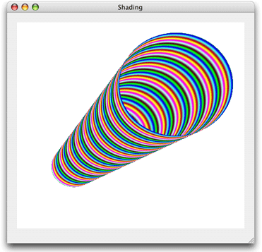

To paint a radial gradient, follow the steps explained in the following sections:

1. [Set Up a CGFunction Object to Compute Color Values](#apple-f4xwc4dqnrsv64tfmyxwi33df52wszbpkridgmbqgaytanrwfvbuqmrqg4wueqsdi5eeersi).
2. [Create a CGShading Object for a Radial Gradient](#apple-f4xwc4dqnrsv64tfmyxwi33df52wszbpkridgmbqgaytanrwfvbuqmrqg4wueqsdindueskg)
3. [Paint a Radial Gradient Using a CGShading Object](#apple-f4xwc4dqnrsv64tfmyxwi33df52wszbpkridgmbqgaytanrwfvbuqmrqg4wueqsdjfauiqsc)
4. [Release Objects](#apple-f4xwc4dqnrsv64tfmyxwi33df52wszbpkridgmbqgaytanrwfvbuqmrqg4wueqsdivbusskc)

There is no difference between writing functions to compute color values for radial and axial gradients. In fact, you can follow the instruction outlined for axial gradients in [Set Up a CGFunction Object to Compute Color Values](#apple-f4xwc4dqnrsv64tfmyxwi33df52wszbpkridgmbqgaytanrwfvbuqmrqg4wugskii5aukrsk). Listing 8-12 calculates color so that the color components vary sinusoidally, with a period based on frequency values declared in the function. The result seen in [Figure 8-12](#apple-f4xwc4dqnrsv64tfmyxwi33df52wszbpkridgmbqgaytanrwfvbuqmrqg4wueqsdi5demrkf) is quite different from the colors shown in [Figure 8-11](#apple-f4xwc4dqnrsv64tfmyxwi33df52wszbpkridgmbqgaytanrwfvbuqmrqg4wueqsdjjbesskk). Despite the differences in color output, the code in Listing 8-12 is similar to [Listing 8-6](#apple-f4xwc4dqnrsv64tfmyxwi33df52wszbpkridgmbqgaytanrwfvbuqmrqg4wueqsdijduoscd) in that each function follows the same prototype. Each function takes one input value and calculates N values, one for each color component of the color space plus an alpha value.

__Listing 8-12__  Computing color component values

```
static void  myCalculateShadingValues (void *info,
                                const CGFloat *in,
                                CGFloat *out)
{
    size_t k, components;
    double frequency[4] = { 55, 220, 110, 0 };
    components = (size_t)info;
    for (k = 0; k < components - 1; k++)
        *out++ = (1 + sin(*in * frequency[k]))/2;
     *out++ = 1; // alpha
}
```

Recall that after you write a color computation function, you need to create a CGFunction object, as described for axial values in [Set Up a CGFunction Object to Compute Color Values](#apple-f4xwc4dqnrsv64tfmyxwi33df52wszbpkridgmbqgaytanrwfvbuqmrqg4wugskii5aukrsk).

To create a CGShading object or a radial gradient, you call the function `CGShadingCreateRadial`, as shown in Listing 8-13, passing a color space, starting and ending points, starting and ending radii, a CGFunction object, and Boolean values to specify whether to fill the area beyond the starting and ending points of the gradient.

__Listing 8-13__  Creating a CGShading object for a radial gradient

```
    CGPoint startPoint, endPoint;
    CGFloat startRadius, endRadius;

    startPoint = CGPointMake(0.25,0.3);
    startRadius = .1;
    endPoint = CGPointMake(.7,0.7);
    endRadius = .25;
    colorspace = CGColorSpaceCreateDeviceRGB();
    myShadingFunction = myGetFunction (colorspace);
    CGShadingCreateRadial (colorspace,
                    startPoint,
                    startRadius,
                    endPoint,
                    endRadius,
                    myShadingFunction,
                    false,
                    false);
```


Calling the function `CGContextDrawShading` fills the current context using the specified color gradient specified in the CGShading object.

```
CGContextDrawShading (myContext, shading);
```

Notice that you use the same function to paint a gradient regardless of whether the gradient is axial or radial.

You call the function `CGShadingRelease` when you no longer need the CGShading object. You also need to release the CGColorSpace object and the CGFunction object as shown in Listing 8-14.

__Listing 8-14__  Code that releases objects

```
CGShadingRelease (myShading);
CGColorSpaceRelease (colorspace);
CGFunctionRelease (myFunctionObject);
```


The code in Listing 8-15 shows a complete routine that paints a radial gradient using the CGFunction object set up in [Listing 8-7](#apple-f4xwc4dqnrsv64tfmyxwi33df52wszbpkridgmbqgaytanrwfvbuqmrqg4wueqsdijbeiq2d) and the callback shown in [Listing 8-12](#apple-f4xwc4dqnrsv64tfmyxwi33df52wszbpkridgmbqgaytanrwfvbuqmrqg4wueqsdincumrkh). A detailed explanation for each numbered line of code appears following the listing.

__Listing 8-15__  A routine that paints a radial gradient using a CGShading object

```
void myPaintRadialShading (CGContextRef myContext,// 1
                            CGRect bounds);
{
    CGPoint startPoint,
            endPoint;
    CGFloat startRadius,
            endRadius;
    CGAffineTransform myTransform;
    CGFloat width = bounds.size.width;
    CGFloat height = bounds.size.height;

    startPoint = CGPointMake(0.25,0.3); // 2
    startRadius = .1;  // 3
    endPoint = CGPointMake(.7,0.7); // 4
    endRadius = .25; // 5

    colorspace = CGColorSpaceCreateDeviceRGB(); // 6
    myShadingFunction = myGetFunction (colorspace); // 7

    shading = CGShadingCreateRadial (colorspace, // 8
                            startPoint, startRadius,
                            endPoint, endRadius,
                            myShadingFunction,
                            false, false);

    myTransform = CGAffineTransformMakeScale (width, height); // 9
    CGContextConcatCTM (myContext, myTransform); // 10
    CGContextSaveGState (myContext); // 11

    CGContextClipToRect (myContext, CGRectMake(0, 0, 1, 1)); // 12
    CGContextSetRGBFillColor (myContext, 1, 1, 1, 1);
    CGContextFillRect (myContext, CGRectMake(0, 0, 1, 1));

    CGContextDrawShading (myContext, shading); // 13
    CGColorSpaceRelease (colorspace); // 14
    CGShadingRelease (shading);
    CGFunctionRelease (myShadingFunction);

    CGContextRestoreGState (myContext); // 15
}
```

Here’s what the code does:

1. Takes as parameters a graphics context and a rectangle to draw into.
2. Assigns a value to the center of the starting circle. The routine calculates values based on a user space that varies from 0 to 1. You’ll scale the space later for the window Quartz draws into. You can think of this coordinate location as x at 25% from the left and y at 30% from the bottom.
3. Assigns the radius of the starting circle. You can think of this as 10% of the width of user space.
4. Assigns a value to the center of the ending circle. You can think of this coordinate location as x at 70% from the left and y at 70% from the bottom.
5. Assigns the radius of the ending circle. You can think of this as 25% of the width of user space. The ending circle will be larger than the starting circle. The conical shape will be oriented from left to right, tipped upwards.
6. Creates a color space for device RGB because this routine draws to the display.
7. Creates a CGFunctionObject by calling the routine shown in [Listing 8-7](#apple-f4xwc4dqnrsv64tfmyxwi33df52wszbpkridgmbqgaytanrwfvbuqmrqg4wueqsdijbeiq2d) and passing the color space you just created. However, recall that you’ll use the color calculation function shown in [Listing 8-12](#apple-f4xwc4dqnrsv64tfmyxwi33df52wszbpkridgmbqgaytanrwfvbuqmrqg4wueqsdincumrkh).
8. Creates a CGShading object for a radial gradient. The last two parameters are `false`, to signal that Quartz should not fill the area beyond the starting and ending points of the gradient.
9. Sets up an affine transform that is scaled to the height and width of the window used for drawing. Note that the height is not necessarily equal to the width. In fact, the transformation will change whenever the user resizes the window.
10. Concatenates the transform you just set up with the graphics context passed to the routine.
11. Saves the graphics state to enable you to restore this state later.
12. Sets up a clipping area. This line and the next two lines clip the context to a rectangle that is filled with white. The effect is that the gradient is drawn to a window with a white background.
13. Paints the gradient to the graphics context transforming the gradient as described previously.
14. Releases object. This line and the next two lines release all the objects you created.
15. Restores the graphics state to the state that existed before you set up the filled background. The restored state is still transformed by the width and height of the window.

- _[CGGradient Reference](https://developer.apple.com/documentation/coregraphics/cggradient)_ describes the functions that create CGGradient objects.
- _[CGShading Reference](https://developer.apple.com/documentation/coregraphics/cgshading)_ describes the functions that create CGShading objects.
- _[CGFunction Reference](https://developer.apple.com/documentation/coregraphics/cgfunction)_ describes the functions needed to calculate gradient colors for a CGShading object.
- _[CGContext Reference](https://developer.apple.com/documentation/coregraphics/cgcontext)_ describes the functions that draw to a context with CGGradient and CGShading objects.

[Next](Transparency%20Layers.md)[Previous](Shadows.md)

