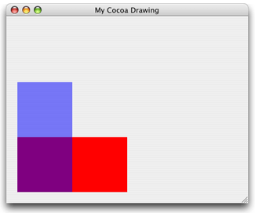
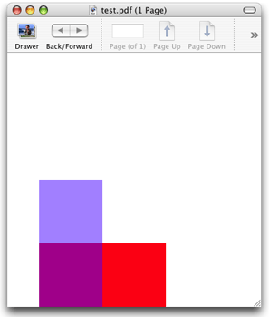
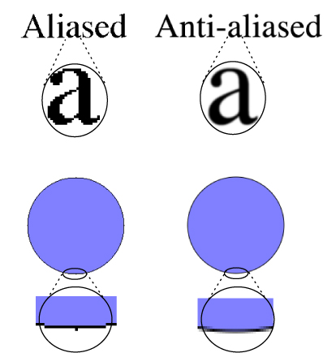

> 导航：[总目录](../../../README.md) · [documentation](../../../_indexes/documentation.md) · [Quartz 2D Programming Guide](Introduction.md)


[Next](Paths.md)[Previous](Overview%20of%20Quartz%202D.md)

# Graphics Contexts

A graphics context represents a drawing destination. It contains drawing parameters and all device-specific information that the drawing system needs to perform any subsequent drawing commands. A graphics context defines basic drawing attributes such as the colors to use when drawing, the clipping area, line width and style information, font information, compositing options, and several others.

You can obtain a graphics context by using Quartz context creation functions or by using higher-level functions provided by one of the Mac OS X frameworks or the UIKit framework in iOS. Quartz provides functions for various flavors of Quartz graphics contexts including bitmap and PDF, which you can use to create custom content.

This chapter shows you how to create a graphics context for a variety of drawing destinations. A graphics context is represented in your code by the data type `CGContextRef`, which is an opaque data type. After you obtain a graphics context, you can use Quartz 2D functions to draw to the context, perform operations (such as translations) on the context, and change graphics state parameters, such as line width and fill color.

To draw to the screen in an iOS application, you set up a [UIView](https://developer.apple.com/documentation/uikit/uiview) object and implement its [drawRect:](https://developer.apple.com/documentation/uikit/uiview/1622529-draw) method to perform drawing. The view’s `drawRect:` method is called when the view is visible onscreen and its contents need updating. Before calling your custom `drawRect:` method, the view object automatically configures its drawing environment so that your code can start drawing immediately. As part of this configuration, the `UIView` object creates a graphics context (a [CGContextRef](https://developer.apple.com/documentation/coregraphics/cgcontextref) opaque type) for the current drawing environment. You obtain this graphics context in your `drawRect:` method by calling the UIKit function [UIGraphicsGetCurrentContext](https://developer.apple.com/documentation/uikit/1623918-uigraphicsgetcurrentcontext).

The default coordinate system used throughout UIKit is different from the coordinate system used by Quartz. In UIKit, the origin is in the upper-left corner, with the positive-y value pointing downward. The `UIView` object modifies the CTM of the Quartz graphics context to match the UIKit conventions by translating the origin to the upper left corner of the view and inverting the y-axis by multiplying it by `-1`. For more information on modified-coordinate systems and the implications in your own drawing code, see [Quartz 2D Coordinate Systems](Overview%20of%20Quartz%202D.md#apple-f4xwc4dqnrsv64tfmyxwi33df52wszbpkridgmbqgaytanrwfvbuqmrqgiwugsscijaukrkd).

`UIView` objects are described in detail in _[View Programming Guide for iOS](../../Windows%20Views/View%20Programming%20Guide%20for%20iOS/About%20Windows%20and%20Views.md#apple-f4xwc4dqnrsv64tfmyxwi33df52wszbpkridimbqga4tkmbt)_.

When drawing in Mac OS X, you need to create a window graphics context that’s appropriate for the framework you are using. The Quartz 2D API itself provides no functions to obtain a windows graphics context. Instead, you use the Cocoa framework to obtain a context for a window created in Cocoa.

You obtain a Quartz graphics context from within the `drawRect:` routine of a Cocoa application using the following line of code:

```
CGContextRef myContext = [[NSGraphicsContext currentContext] graphicsPort];
```

The method `currentContext` returns the `NSGraphicsContext` instance of the current thread. The method `graphicsPort` returns the low-level, platform-specific graphics context represented by the receiver, which is a Quartz graphics context. (Don’t get confused by the method names; they are historical.) For more information see _[NSGraphicsContext Class Reference](https://developer.apple.com/documentation/appkit/nsgraphicscontext)_.

After you obtain the graphics context, you can call any of the Quartz 2D drawing functions in your Cocoa application. You can also mix Quartz 2D calls with Cocoa drawing calls. You can see an example of Quartz 2D drawing to a Cocoa view by looking at Figure 2-1. The drawing consists of two overlapping rectangles, an opaque red one and a partially transparent blue one. You’ll learn more about transparency in [Color and Color Spaces](Color%20and%20Color%20Spaces.md#apple-f4xwc4dqnrsv64tfmyxwi33df52wszbpkridgmbqgaytanrwfvbuqmrqguwviucykjcummjqge). The ability to control how much you can “see through” colors is one of the hallmark features of Quartz 2D.

__Figure 2-1__  A view in the Cocoa framework that contains Quartz drawing



To create the drawing in Figure 2-1, you first create a Cocoa application Xcode project. In Interface Builder, drag a Custom View to the window and subclass it. Then write an implementation for the subclassed view, similar to what Listing 2-1 shows. For this example, the subclassed view is named `MyQuartzView`. The `drawRect:` method for the view contains all the Quartz drawing code. A detailed explanation for each numbered line of code appears following the listing.

__Listing 2-1__  Drawing to a window graphics context

```objc
@implementation MyQuartzView

- (id)initWithFrame:(NSRect)frameRect
{
    self = [super initWithFrame:frameRect];
    return self;
}

- (void)drawRect:(NSRect)rect
{
    CGContextRef myContext = [[NSGraphicsContext // 1
                                currentContext] graphicsPort];
   // ********** Your drawing code here ********** // 2
    CGContextSetRGBFillColor (myContext, 1, 0, 0, 1);// 3
    CGContextFillRect (myContext, CGRectMake (0, 0, 200, 100 ));// 4
    CGContextSetRGBFillColor (myContext, 0, 0, 1, .5);// 5
    CGContextFillRect (myContext, CGRectMake (0, 0, 100, 200));// 6
  }

@end
```

Here’s what the code does:

1. Obtains a graphics context for the view.
2. This is where you insert your drawing code. The four lines of code that follow are examples of using Quartz 2D functions.
3. Sets a red fill color that’s fully opaque. For information on colors and alpha (which sets opacity), see [Color and Color Spaces](Color%20and%20Color%20Spaces.md#apple-f4xwc4dqnrsv64tfmyxwi33df52wszbpkridgmbqgaytanrwfvbuqmrqguwviucykjcummjqge).
4. Fills a rectangle whose origin is (`0,0`) and whose width is `200` and height is `100`. For information on drawing rectangles, see [Paths](Paths.md#apple-f4xwc4dqnrsv64tfmyxwi33df52wszbpkridgmbqgaytanrwfvbuqmrrgewviucykjcummjqge).
5. Sets a blue fill color that’s partially transparent.
6. Fills a rectangle whose origin is (`0,0`) and whose width is `100` and height is `200`.

When you create a PDF graphics context and draw to that context, Quartz records your drawing as a series of PDF drawing commands written to a file. You supply a location for the PDF output and a default _media box_—a rectangle that specifies bounds of the page. Figure 2-2 shows the result of drawing to a PDF graphics context and then opening the resulting PDF in Preview.

__Figure 2-2__  A PDF created by using CGPDFContextCreateWithURL



The Quartz 2D API provides two functions that create a PDF graphics context:

- `CGPDFContextCreateWithURL`, which you use when you want to specify the location for the PDF output as a Core Foundation URL. [Listing 2-2](#apple-f4xwc4dqnrsv64tfmyxwi33df52wszbpkridgmbqgaytanrwfvbuqmrqgmwugssci5dugq2d) shows how to use this function to create a PDF graphics context.
- `CGPDFContextCreate`, which you use when you want the PDF output sent to a data consumer. (For more information see [Data Management in Quartz 2D](Data%20Management%20in%20Quartz%202D.md#apple-f4xwc4dqnrsv64tfmyxwi33df52wszbpkridgmbqgaytanrwfvbuqmrrgywviucykjcummjqge).) [Listing 2-3](#apple-f4xwc4dqnrsv64tfmyxwi33df52wszbpkridgmbqgaytanrwfvbuqmrqgmwugsscjbeumrcd) shows how to use this function to create a PDF graphics context.

A detailed explanation for each numbered line of code follows each listing.

__Listing 2-2__  Calling `CGPDFContextCreateWithURL` to create a PDF graphics context

```
CGContextRef MyPDFContextCreate (const CGRect *inMediaBox,
                                    CFStringRef path)
{
    CGContextRef myOutContext = NULL;
    CFURLRef url;

    url = CFURLCreateWithFileSystemPath (NULL, // 1
                                path,
                                kCFURLPOSIXPathStyle,
                                false);
    if (url != NULL) {
        myOutContext = CGPDFContextCreateWithURL (url,// 2
                                        inMediaBox,
                                        NULL);
        CFRelease(url);// 3
    }
    return myOutContext;// 4
}
```

Here’s what the code does:

1. Calls the Core Foundation function to create a CFURL object from the CFString object supplied to the `MyPDFContextCreate` function. You pass `NULL` as the first parameter to use the default allocator. You also need to specify a path style, which for this example is a POSIX-style pathname.
2. Calls the Quartz 2D function to create a PDF graphics context using the PDF location just created (as a CFURL object) and a rectangle that specifies the bounds of the PDF. The rectangle (`CGRect`) was passed to the `MyPDFContextCreate` function and is the default page media bounding box for the PDF.
3. Releases the CFURL object.
4. Returns the PDF graphics context. The caller must release the graphics context when it is no longer needed.

__Listing 2-3__  Calling `CGPDFContextCreate` to create a PDF graphics context

```
CGContextRef MyPDFContextCreate (const CGRect *inMediaBox,
                                    CFStringRef path)
{
    CGContextRef        myOutContext = NULL;
    CFURLRef            url;
    CGDataConsumerRef   dataConsumer;

    url = CFURLCreateWithFileSystemPath (NULL, // 1
                                        path,
                                        kCFURLPOSIXPathStyle,
                                        false);

    if (url != NULL)
    {
        dataConsumer = CGDataConsumerCreateWithURL (url);// 2
        if (dataConsumer != NULL)
        {
            myOutContext = CGPDFContextCreate (dataConsumer, // 3
                                        inMediaBox,
                                        NULL);
            CGDataConsumerRelease (dataConsumer);// 4
        }
        CFRelease(url);// 5
    }
    return myOutContext;// 6
}
```

Here’s what the code does:

1. Calls the Core Foundation function to create a CFURL object from the CFString object supplied to the `MyPDFContextCreate` function. You pass `NULL` as the first parameter to use the default allocator. You also need to specify a path style, which for this example is a POSIX-style pathname.
2. Creates a Quartz data consumer object using the CFURL object. If you don’t want to use a CFURL object (for example, you want to place the PDF data in a location that can’t be specified by a CFURL object), you can instead create a data consumer from a set of callback functions that you implement in your application. For more information, see [Data Management in Quartz 2D](Data%20Management%20in%20Quartz%202D.md#apple-f4xwc4dqnrsv64tfmyxwi33df52wszbpkridgmbqgaytanrwfvbuqmrrgywviucykjcummjqge).
3. Calls the Quartz 2D function to create a PDF graphics context passing as parameters the data consumer and the rectangle (of type `CGRect`) that was passed to the `MyPDFContextCreate` function. This rectangle is the default page media bounding box for the PDF.
4. Releases the data consumer.
5. Releases the CFURL object.
6. Returns the PDF graphics context. The caller must release the graphics context when it is no longer needed.

Listing 2-4 shows how to call the `MyPDFContextCreate` routine and draw to it. A detailed explanation for each numbered line of code appears following the listing.

__Listing 2-4__  Drawing to a PDF graphics context

```
    CGRect mediaBox;// 1

    mediaBox = CGRectMake (0, 0, myPageWidth, myPageHeight);// 2
    myPDFContext = MyPDFContextCreate (&mediaBox, CFSTR("test.pdf"));// 3

    CFStringRef myKeys[1];// 4
    CFTypeRef myValues[1];
    myKeys[0] = kCGPDFContextMediaBox;
    myValues[0] = (CFTypeRef) CFDataCreate(NULL,(const UInt8 *)&mediaBox, sizeof (CGRect));
    CFDictionaryRef pageDictionary = CFDictionaryCreate(NULL, (const void **) myKeys,                                                         (const void **) myValues, 1,                                                         &kCFTypeDictionaryKeyCallBacks,                                                         & kCFTypeDictionaryValueCallBacks);
    CGPDFContextBeginPage(myPDFContext, &pageDictionary);// 5
        // ********** Your drawing code here **********// 6
        CGContextSetRGBFillColor (myPDFContext, 1, 0, 0, 1);
        CGContextFillRect (myPDFContext, CGRectMake (0, 0, 200, 100 ));
        CGContextSetRGBFillColor (myPDFContext, 0, 0, 1, .5);
        CGContextFillRect (myPDFContext, CGRectMake (0, 0, 100, 200 ));
    CGPDFContextEndPage(myPDFContext);// 7
    CFRelease(pageDictionary);// 8
    CFRelease(myValues[0]);
    CGContextRelease(myPDFContext);
```

Here’s what the code does:

1. Declares a variable for the rectangle that you use to define the PDF media box.
2. Sets the origin of the media box to `(0,0)` and the width and height to variables supplied by the application.
3. Calls the function `MyPDFContextCreate` (See [Listing 2-3](#apple-f4xwc4dqnrsv64tfmyxwi33df52wszbpkridgmbqgaytanrwfvbuqmrqgmwugsscjbeumrcd)) to obtain a PDF graphics context, supplying a media box and a pathname. The macro `CFSTR` converts a string to a `CFStringRef` data type.
4. Sets up a dictionary with the page options. In this example, only the media box is specified. You don’t have to pass the same rectangle you used to set up the PDF graphics context. The media box you add here supersedes the rectangle you pass to set up the PDF graphics context.
5. Signals the start of a page. This function is used for page-oriented graphics, which is what PDF drawing is.
6. Calls Quartz 2D drawing functions. You replace this and the following four lines of code with the drawing code appropriate for your application.
7. Signals the end of the PDF page.
8. Releases the dictionary and the PDF graphics context when they are no longer needed.

You can write any content to a PDF that’s appropriate for your application—images, text, path drawing—and you can add links and encryption. For more information see [PDF Document Creation, Viewing, and Transforming](PDF%20Document%20Creation%2C%20Viewing%2C%20and%20Transforming.md#apple-f4xwc4dqnrsv64tfmyxwi33df52wszbpkridgmbqgaytanrwfvbuqmrrgqwviucykjcummjqge).

A bitmap graphics context accepts a pointer to a memory buffer that contains storage space for the bitmap. When you paint into the bitmap graphics context, the buffer is updated. After you release the graphics context, you have a fully updated bitmap in the pixel format you specify.

You use the function `CGBitmapContextCreate` to create a bitmap graphics context. This function takes the following parameters:

- `data`. Supply a pointer to the destination in memory where you want the drawing rendered. The size of this memory block should be at least (`bytesPerRow`\*`height`) bytes.
- `width`. Specify the width, in pixels, of the bitmap.
- `height`. Specify the height, in pixels, of the bitmap.
- `bitsPerComponent`. Specify the number of bits to use for each component of a pixel in memory. For example, for a 32-bit pixel format and an RGB color space, you would specify a value of 8 bits per component. See [Supported Pixel Formats](#apple-f4xwc4dqnrsv64tfmyxwi33df52wszbpkridgmbqgaytanrwfvbuqmrqgmwueq2jijeeqqsc).
- `bytesPerRow`. Specify the number of bytes of memory to use per row of the bitmap.
- `colorspace`. The color space to use for the bitmap context. You can provide a Gray, RGB, CMYK, or NULL color space when you create a bitmap graphics context. For detailed information on color spaces and color management principles, see _[Color Management Overview](../Color%20Management%20Overview/Introduction%20to%20Color%20Management%20Overview.md#apple-f4xwc4dqnrsv64tfmyxwi33df52wszbpkridgmbqgaytcnby)_. For information on creating and using color spaces in Quartz, see [Color and Color Spaces](Color%20and%20Color%20Spaces.md#apple-f4xwc4dqnrsv64tfmyxwi33df52wszbpkridgmbqgaytanrwfvbuqmrqguwviucykjcummjqge). For information about supported color spaces, see [Color Spaces and Bitmap Layout](Bitmap%20Images%20and%20Image%20Masks.md#apple-f4xwc4dqnrsv64tfmyxwi33df52wszbpkridgmbqgaytanrwfvbuqmrrgiwugsscjbcuoskc) in the [Bitmap Images and Image Masks](Bitmap%20Images%20and%20Image%20Masks.md#apple-f4xwc4dqnrsv64tfmyxwi33df52wszbpkridgmbqgaytanrwfvbuqmrrgiwviucykjcummjqge) chapter.
- `bitmapInfo`. Bitmap layout information, expressed as a `CGBitmapInfo` constant, that specifies whether the bitmap should contain an alpha component, the relative location of the alpha component (if there is one) in a pixel, whether the alpha component is premultiplied, and whether the color components are integer or floating-point values. For detailed information on what these constants are, when each is used, and Quartz-supported pixel formats for bitmap graphics contexts and images, see [Color Spaces and Bitmap Layout](Bitmap%20Images%20and%20Image%20Masks.md#apple-f4xwc4dqnrsv64tfmyxwi33df52wszbpkridgmbqgaytanrwfvbuqmrrgiwugsscjbcuoskc) in the [Bitmap Images and Image Masks](Bitmap%20Images%20and%20Image%20Masks.md#apple-f4xwc4dqnrsv64tfmyxwi33df52wszbpkridgmbqgaytanrwfvbuqmrrgiwviucykjcummjqge) chapter.

Listing 2-5 shows how to create a bitmap graphics context. When you draw into the resulting bitmap graphics context, Quartz records your drawing as bitmap data in the specified block of memory. A detailed explanation for each numbered line of code follows the listing.

__Listing 2-5__  Creating a bitmap graphics context

```
CGContextRef MyCreateBitmapContext (int pixelsWide,
                            int pixelsHigh)
{
    CGContextRef    context = NULL;
    CGColorSpaceRef colorSpace;
    void *          bitmapData;
    int             bitmapByteCount;
    int             bitmapBytesPerRow;

    bitmapBytesPerRow   = (pixelsWide * 4);// 1
    bitmapByteCount     = (bitmapBytesPerRow * pixelsHigh);

    colorSpace = CGColorSpaceCreateWithName(kCGColorSpaceGenericRGB);// 2
    bitmapData = calloc( bitmapByteCount, sizeof(uint8_t) );// 3
    if (bitmapData == NULL)
    {
        fprintf (stderr, "Memory not allocated!");
        return NULL;
    }
    context = CGBitmapContextCreate (bitmapData,// 4
                                    pixelsWide,
                                    pixelsHigh,
                                    8,      // bits per component
                                    bitmapBytesPerRow,
                                    colorSpace,
                                    kCGImageAlphaPremultipliedLast);
    if (context== NULL)
    {
        free (bitmapData);// 5
        fprintf (stderr, "Context not created!");
        return NULL;
    }
    CGColorSpaceRelease( colorSpace );// 6

    return context;// 7
}
```

Here’s what the code does:

1. Declares a variable to represent the number of bytes per row. Each pixel in the bitmap in this example is represented by 4 bytes; 8 bits each of red, green, blue, and alpha.
2. Creates a generic RGB color space. You can also create a CMYK color space. See [Color and Color Spaces](Color%20and%20Color%20Spaces.md#apple-f4xwc4dqnrsv64tfmyxwi33df52wszbpkridgmbqgaytanrwfvbuqmrqguwviucykjcummjqge) for more information and for a discussion of generic color spaces versus device dependent ones.
3. Calls the `calloc` function to create and clear a block of memory in which to store the bitmap data. This example creates a 32-bit RGBA bitmap (that is, an array with 32 bits per pixel, each pixel containing 8 bits each of red, green, blue, and alpha information). Each pixel in the bitmap occupies 4 bytes of memory. In Mac OS X 10.6 and iOS 4, this step can be omitted—if you pass `NULL` as bitmap data, Quartz automatically allocates space for the bitmap.
4. Creates a bitmap graphics context, supplying the bitmap data, the width and height of the bitmap, the number of bits per component, the bytes per row, the color space, and a constant that specifies whether the bitmap should contain an alpha channel and its relative location in a pixel. The constant `kCGImageAlphaPremultipliedLast` indicates that the alpha component is stored in the last byte of each pixel and that the color components have already been multiplied by this alpha value. See [The Alpha Value](Color%20and%20Color%20Spaces.md#apple-f4xwc4dqnrsv64tfmyxwi33df52wszbpkridgmbqgaytanrwfvbuqmrqguwviucykjcummjrhe) for more information on premultiplied alpha.
5. If the context isn’t created for some reason, frees the memory allocated for the bitmap data.
6. Releases the color space.
7. Returns the bitmap graphics context. The caller must release the graphics context when it is no longer needed.

Listing 2-6 shows code that calls `MyCreateBitmapContext` to create a bitmap graphics context, uses the bitmap graphics context to create a `CGImage` object, then draws the resulting image to a window graphics context. [Figure 2-3](#apple-f4xwc4dqnrsv64tfmyxwi33df52wszbpkridgmbqgaytanrwfvbuqmrqgmwueq2jizcueqkj) shows the image drawn to the window. A detailed explanation for each numbered line of code follows the listing.

__Listing 2-6__  Drawing to a bitmap graphics context

```
    CGRect myBoundingBox;// 1

    myBoundingBox = CGRectMake (0, 0, myWidth, myHeight);// 2
    myBitmapContext = MyCreateBitmapContext (400, 300);// 3
    // ********** Your drawing code here ********** // 4
    CGContextSetRGBFillColor (myBitmapContext, 1, 0, 0, 1);
    CGContextFillRect (myBitmapContext, CGRectMake (0, 0, 200, 100 ));
    CGContextSetRGBFillColor (myBitmapContext, 0, 0, 1, .5);
    CGContextFillRect (myBitmapContext, CGRectMake (0, 0, 100, 200 ));
    myImage = CGBitmapContextCreateImage (myBitmapContext);// 5
    CGContextDrawImage(myContext, myBoundingBox, myImage);// 6
    char *bitmapData = CGBitmapContextGetData(myBitmapContext); // 7
    CGContextRelease (myBitmapContext);// 8
    if (bitmapData) free(bitmapData); // 9
    CGImageRelease(myImage);// 10
```

Here’s what the code does:

1. Declares a variable to store the origin and dimensions of the bounding box into which Quartz will draw an image created from the bitmap graphics context.
2. Sets the origin of the bounding box to `(0,0)` and the width and height to variables previously declared, but whose declaration are not shown in this code.
3. Calls the application-supplied function `MyCreateBitmapContext` (see [Listing 2-5](#apple-f4xwc4dqnrsv64tfmyxwi33df52wszbpkridgmbqgaytanrwfvbuqmrqgmwugsscizcecrkd)) to create a bitmap context that is 400 pixels wide and 300 pixels high. You can create a bitmap graphics context using any dimensions that are appropriate for your application.
4. Calls Quartz 2D functions to draw into the bitmap graphics context. You would replace this and the next four lines of code with drawing code appropriate for your application.
5. Creates a Quartz 2D image (`CGImageRef`) from the bitmap graphics context.
6. Draws the image into the location in the window graphics context that is specified by the bounding box. The bounding box specifies the location and dimensions in user space in which to draw the image.

   This example does not show the creation of the window graphics context. See [Creating a Window Graphics Context in Mac OS X](#apple-f4xwc4dqnrsv64tfmyxwi33df52wszbpkridgmbqgaytanrwfvbuqmrqgmwugsscirbuqqkd) for information on how to create one.
7. Gets the bitmap data associated with the bitmap graphics context.
8. Releases the bitmap graphics context when it is no longer needed.
9. Free the bitmap data if it exists.
10. Releases the image when it is no longer needed.

__Figure 2-3__  An image created from a bitmap graphics context and drawn to a window graphics context


Table 2-1 summarizes the pixel formats that are supported for bitmap graphics context, the associated color space (`cs`), and the version of Mac OS X in which the format was first available. The pixel format is specified as bits per pixel (bpp) and bits per component (bpc). The table also includes the bitmap information constant associated with that pixel format. See _[CGImage Reference](https://developer.apple.com/documentation/coregraphics/cgimage)_ for details on what each of the bitmap information format constants represent.

__Table 2-1__  Pixel formats supported for bitmap graphics contexts

| CS | Pixel format and bitmap information constant | Availability |
| Null | 8 bpp, 8 bpc, [kCGImageAlphaOnly](https://developer.apple.com/documentation/coregraphics/cgimagealphainfo/kcgimagealphaonly) | Mac OS X, iOS |
| Gray | 8 bpp, 8 bpc,[kCGImageAlphaNone](https://developer.apple.com/documentation/coregraphics/cgimagealphainfo/kcgimagealphanone) | Mac OS X, iOS |
| Gray | 8 bpp, 8 bpc,[kCGImageAlphaOnly](https://developer.apple.com/documentation/coregraphics/cgimagealphainfo/kcgimagealphaonly) | Mac OS X, iOS |
| Gray | 16 bpp, 16 bpc, [kCGImageAlphaNone](https://developer.apple.com/documentation/coregraphics/cgimagealphainfo/kcgimagealphanone) | Mac OS X |
| Gray | 32 bpp, 32 bpc, [kCGImageAlphaNone](https://developer.apple.com/documentation/coregraphics/cgimagealphainfo/kcgimagealphanone)|[kCGBitmapFloatComponents](https://developer.apple.com/documentation/coregraphics/cgbitmapinfo/1455087-floatcomponents) | Mac OS X |
| RGB | 16 bpp, 5 bpc, [kCGImageAlphaNoneSkipFirst](https://developer.apple.com/documentation/coregraphics/cgimagealphainfo/noneskipfirst) | Mac OS X, iOS |
| RGB | 32 bpp, 8 bpc, [kCGImageAlphaNoneSkipFirst](https://developer.apple.com/documentation/coregraphics/cgimagealphainfo/noneskipfirst) | Mac OS X, iOS |
| RGB | 32 bpp, 8 bpc, [kCGImageAlphaNoneSkipLast](https://developer.apple.com/documentation/coregraphics/cgimagealphainfo/kcgimagealphanoneskiplast) | Mac OS X, iOS |
| RGB | 32 bpp, 8 bpc, [kCGImageAlphaPremultipliedFirst](https://developer.apple.com/documentation/coregraphics/cgimagealphainfo/kcgimagealphapremultipliedfirst) | Mac OS X, iOS |
| RGB | 32 bpp, 8 bpc, [kCGImageAlphaPremultipliedLast](https://developer.apple.com/documentation/coregraphics/cgimagealphainfo/kcgimagealphapremultipliedlast) | Mac OS X, iOS |
| RGB | 64 bpp, 16 bpc, [kCGImageAlphaPremultipliedLast](https://developer.apple.com/documentation/coregraphics/cgimagealphainfo/kcgimagealphapremultipliedlast) | Mac OS X |
| RGB | 64 bpp, 16 bpc, [kCGImageAlphaNoneSkipLast](https://developer.apple.com/documentation/coregraphics/cgimagealphainfo/kcgimagealphanoneskiplast) | Mac OS X |
| RGB | 128 bpp, 32 bpc, [kCGImageAlphaNoneSkipLast](https://developer.apple.com/documentation/coregraphics/cgimagealphainfo/kcgimagealphanoneskiplast) |[kCGBitmapFloatComponents](https://developer.apple.com/documentation/coregraphics/cgbitmapinfo/1455087-floatcomponents) | Mac OS X |
| RGB | 128 bpp, 32 bpc, [kCGImageAlphaPremultipliedLast](https://developer.apple.com/documentation/coregraphics/cgimagealphainfo/kcgimagealphapremultipliedlast) |[kCGBitmapFloatComponents](https://developer.apple.com/documentation/coregraphics/cgbitmapinfo/1455087-floatcomponents) | Mac OS X |
| CMYK | 32 bpp, 8 bpc, [kCGImageAlphaNone](https://developer.apple.com/documentation/coregraphics/cgimagealphainfo/kcgimagealphanone) | Mac OS X |
| CMYK | 64 bpp, 16 bpc, [kCGImageAlphaNone](https://developer.apple.com/documentation/coregraphics/cgimagealphainfo/kcgimagealphanone) | Mac OS X |
| CMYK | 128 bpp, 32 bpc, [kCGImageAlphaNone](https://developer.apple.com/documentation/coregraphics/cgimagealphainfo/kcgimagealphanone) |[kCGBitmapFloatComponents](https://developer.apple.com/documentation/coregraphics/cgbitmapinfo/1455087-floatcomponents) | Mac OS X |

Bitmap graphics contexts support _anti-aliasing_, which is the process of artificially correcting the jagged (or _aliased_) edges you sometimes see in bitmap images when text or shapes are drawn. These jagged edges occur when the resolution of the bitmap is significantly lower than the resolution of your eyes. To make objects appear smooth in the bitmap, Quartz uses different colors for the pixels that surround the outline of the shape. By blending the colors in this way, the shape appears smooth. You can see the effect of using anti-aliasing in Figure 2-4. You can turn anti-aliasing off for a particular bitmap graphics context by calling the function `CGContextSetShouldAntialias`. The anti-aliasing setting is part of the graphics state.

You can control whether to allow anti-aliasing for a particular graphics context by using the function `CGContextSetAllowsAntialiasing`. Pass `true` to this function to allow anti-aliasing; `false` not to allow it. This setting is not part of the graphics state. Quartz performs anti-aliasing when the context and the graphic state settings are set to `true`.

__Figure 2-4__  A comparison of aliased and anti-aliasing drawing



Cocoa applications in Mac OS X implement printing through custom [NSView](https://developer.apple.com/documentation/appkit/nsview) subclasses. A view is told to print by invoking its [print:](https://developer.apple.com/documentation/appkit/nsview/1483705-printview) method. The view then creates a graphics context that targets a printer and calls its [drawRect:](https://developer.apple.com/documentation/appkit/nsview/1483686-draw) method. Your application uses the same drawing code to draw to the printer that it uses to draw to the screen. It can also customize the `drawRect:` call to an image to the printer that is different from the one sent to the screen.

For a detailed discussion of printing in Cocoa, see _[Printing Programming Guide for Mac](../../Cocoa/Printing%20Programming%20Guide%20for%20Mac/About%20Printing%20on%20the%20Mac.md#apple-f4xwc4dqnrsv64tfmyxwi33df52wszbpgeydambqga4dg2i)_.

[Next](Paths.md)[Previous](Overview%20of%20Quartz%202D.md)

