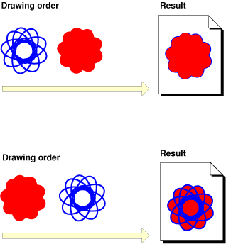
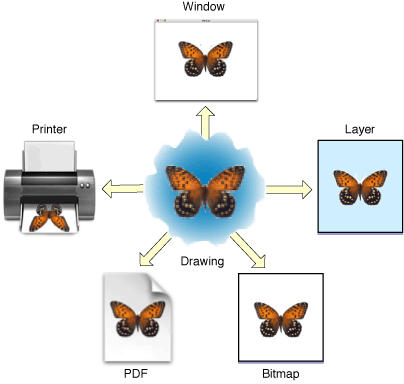
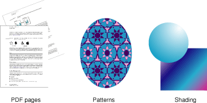
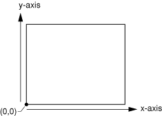

> 导航：[总目录](../../../README.md) · [documentation](../../../_indexes/documentation.md) · [Quartz 2D Programming Guide](Introduction.md)

[Next](Graphics%20Contexts.md)[Previous](Introduction.md)

# Overview of Quartz 2D

Quartz 2D is a two-dimensional drawing engine accessible in the iOS environment and from all Mac OS X application environments outside of the kernel. You can use the Quartz 2D application programming interface (API) to gain access to features such as path-based drawing, painting with transparency, shading, drawing shadows, transparency layers, color management, anti-aliased rendering, PDF document generation, and PDF metadata access. Whenever possible, Quartz 2D leverages the power of the graphics hardware.

In Mac OS X, Quartz 2D can work with all other graphics and imaging technologies—Core Image, Core Video, OpenGL, and QuickTime. It’s possible to create an image in Quartz from a QuickTime graphics importer, using the QuickTime function `[GraphicsImportCreateCGImage](../../../../QuickTime/WhatsNewQT6_4/Chap1/QT6WhatsNew.md#apple-f4xwc4dqnrsv64tfmyxwgl3govxggl2hojqxa2djmnzus3lqn5zhiq3smvqxizkdi5ew2ylhmu)`. See _QuickTime Framework Reference_ for details. [Moving Data Between Quartz 2D and Core Image in Mac OS X](Data%20Management%20in%20Quartz%202D.md#apple-f4xwc4dqnrsv64tfmyxwi33df52wszbpkridgmbqgaytanrwfvbuqmrrgywueqkkjbcuescf) describes how you can provide images to Core Image, which is a framework that supports image processing.

Similarly, in iOS, Quartz 2D works with all available graphics and animation technologies, such as Core Animation, OpenGL ES, and the UIKit classes.

Quartz 2D uses the _painter’s model_ for its imaging. In the painter’s model, each successive drawing operation applies a layer of “paint” to an output “canvas,” often called a _page_. The paint on the page can be modified by overlaying more paint through additional drawing operations. An object drawn on the page cannot be modified except by overlaying more paint. This model allows you to construct extremely sophisticated images from a small number of powerful primitives.

Figure 1-1 shows how the painter’s model works. To get the image in the top part of the figure, the shape on the left was drawn first followed by the solid shape. The solid shape overlays the first shape, obscuring all but the perimeter of the first shape. The shapes are drawn in the opposite order in the bottom of the figure, with the solid shape drawn first. As you can see, in the painter’s model the drawing order is important.

__Figure 1-1__  The painter’s model

The page may be a real sheet of paper (if the output device is a printer); it may be a virtual sheet of paper (if the output device is a PDF file); it may even be a bitmap image. The exact nature of the page depends on the particular graphics context you use.

A _graphics context_ is an opaque data type ([CGContextRef](https://developer.apple.com/documentation/coregraphics/cgcontextref)) that encapsulates the information Quartz uses to draw images to an output device, such as a PDF file, a bitmap, or a window on a display. The information inside a graphics context includes graphics drawing parameters and a device-specific representation of the paint on the page. All objects in Quartz are drawn to, or contained by, a graphics context.

You can think of a graphics context as a drawing destination, as shown in Figure 1-2. When you draw with Quartz, all device-specific characteristics are contained within the specific type of graphics context you use. In other words, you can draw the same image to a different device simply by providing a different graphics context to the same sequence of Quartz drawing routines. You do not need to perform any device-specific calculations; Quartz does it for you.

__Figure 1-2__  Quartz drawing destinations

These graphics contexts are available to your application:

- A _bitmap graphics context_ allows you to paint RGB colors, CMYK colors, or grayscale into a bitmap. A _bitmap_ is a rectangular array (or raster) of pixels, each pixel representing a point in an image. Bitmap images are also called _sampled images_. See [Creating a Bitmap Graphics Context](Graphics%20Contexts.md#apple-f4xwc4dqnrsv64tfmyxwi33df52wszbpkridgmbqgaytanrwfvbuqmrqgmwugsscjbbemrsf).
- A _PDF graphics context_ allows you to create a PDF file. In a PDF file, your drawing is preserved as a sequence of commands. There are some significant differences between PDF files and bitmaps:

  - PDF files, unlike bitmaps, may contain more than one page.
  - When you draw a page from a PDF file on a different device, the resulting image is optimized for the display characteristics of that device.
  - PDF files are resolution independent by nature—the size at which they are drawn can be increased or decreased infinitely without sacrificing image detail. The user-perceived quality of a bitmap image is tied to the resolution at which the bitmap is intended to be viewed.

  See [Creating a PDF Graphics Context](Graphics%20Contexts.md#apple-f4xwc4dqnrsv64tfmyxwi33df52wszbpkridgmbqgaytanrwfvbuqmrqgmwviucykjcummjrha).
- A _window graphics context_ is a graphics context that you can use to draw into a window. Note that because Quartz 2D is a graphics engine and not a window management system, you use one of the application frameworks to obtain a graphics context for a window. See [Creating a Window Graphics Context in Mac OS X](Graphics%20Contexts.md#apple-f4xwc4dqnrsv64tfmyxwi33df52wszbpkridgmbqgaytanrwfvbuqmrqgmwugsscirbuqqkd) for details.
- A _layer context_ ([CGLayerRef](https://developer.apple.com/documentation/coregraphics/cglayerref)) is an offscreen drawing destination associated with another graphics context. It is designed for optimal performance when drawing the layer to the graphics context that created it. A layer context can be a much better choice for offscreen drawing than a bitmap graphics context. See [Core Graphics Layer Drawing](Core%20Graphics%20Layer%20Drawing.md#apple-f4xwc4dqnrsv64tfmyxwi33df52wszbpkridgmbqgaytanrwfvbuqmrrhewviucykjcummjqge).
- When you want to print in Mac OS X, you send your content to a _PostScript graphics context_ that is managed by the printing framework. See [Obtaining a Graphics Context for Printing](Graphics%20Contexts.md#apple-f4xwc4dqnrsv64tfmyxwi33df52wszbpkridgmbqgaytanrwfvbuqmrqgmwugsscjjcekrsg) for more information.

The Quartz 2D API defines a variety of opaque data types in addition to graphics contexts. Because the API is part of the Core Graphics framework, the data types and the routines that operate on them use the CG prefix.

Quartz 2D creates objects from opaque data types that your application operates on to achieve a particular drawing output. Figure 1-3 shows the sorts of results you can achieve when you apply drawing operations to three of the objects provided by Quartz 2D. For example:

- You can rotate and display a PDF page by creating a PDF page object, applying a rotation operation to the graphics context, and asking Quartz 2D to draw the page to a graphics context.
- You can draw a pattern by creating a pattern object, defining the shape that makes up the pattern, and setting up Quartz 2D to use the pattern as paint when it draws to a graphics context.
- You can fill an area with an axial or radial shading by creating a shading object, providing a function that determines the color at each point in the shading, and then asking Quartz 2D to use the shading as a fill color.

__Figure 1-3__  Opaque data types are the basis of drawing primitives in Quartz 2D

The opaque data types available in Quartz 2D include the following:

- [CGPathRef](https://developer.apple.com/documentation/coregraphics/cgpath), used for vector graphics to create paths that you fill or stroke. See [Paths](Paths.md#apple-f4xwc4dqnrsv64tfmyxwi33df52wszbpkridgmbqgaytanrwfvbuqmrrgewviucykjcummjqge).
- [CGImageRef](https://developer.apple.com/documentation/coregraphics/cgimageref), used to represent bitmap images and bitmap image masks based on sample data that you supply. See [Bitmap Images and Image Masks](Bitmap%20Images%20and%20Image%20Masks.md#apple-f4xwc4dqnrsv64tfmyxwi33df52wszbpkridgmbqgaytanrwfvbuqmrrgiwviucykjcummjqge).
- [CGLayerRef](https://developer.apple.com/documentation/coregraphics/cglayerref), used to represent a drawing layer that can be used for repeated drawing (such as for backgrounds or patterns) and for offscreen drawing. See [Core Graphics Layer Drawing](Core%20Graphics%20Layer%20Drawing.md#apple-f4xwc4dqnrsv64tfmyxwi33df52wszbpkridgmbqgaytanrwfvbuqmrrhewviucykjcummjqge)
- [CGPatternRef](https://developer.apple.com/documentation/coregraphics/cgpattern), used for repeated drawing. See [Patterns](Patterns.md#apple-f4xwc4dqnrsv64tfmyxwi33df52wszbpkridgmbqgaytanrwfvbuqmrqgywviucykjcummjqge).
- [CGShadingRef](https://developer.apple.com/documentation/coregraphics/cgshadingref) and [CGGradientRef](https://developer.apple.com/documentation/coregraphics/cggradientref), used to paint gradients. See [Gradients](Gradients.md#apple-f4xwc4dqnrsv64tfmyxwi33df52wszbpkridgmbqgaytanrwfvbuqmrqg4wviucykjcummjqge).
- [CGFunctionRef](https://developer.apple.com/documentation/coregraphics/cgfunctionref), used to define callback functions that take an arbitrary number of floating-point arguments. You use this data type when you create gradients for a shading. See [Gradients](Gradients.md#apple-f4xwc4dqnrsv64tfmyxwi33df52wszbpkridgmbqgaytanrwfvbuqmrqg4wviucykjcummjqge).
- [CGColorRef](https://developer.apple.com/documentation/coregraphics/cgcolor) and [CGColorSpaceRef](https://developer.apple.com/documentation/coregraphics/cgcolorspaceref), used to inform Quartz how to interpret color. See [Color and Color Spaces](Color%20and%20Color%20Spaces.md#apple-f4xwc4dqnrsv64tfmyxwi33df52wszbpkridgmbqgaytanrwfvbuqmrqguwviucykjcummjqge).
- [CGImageSourceRef](https://developer.apple.com/documentation/imageio/cgimagesource) and [CGImageDestinationRef](https://developer.apple.com/documentation/imageio/cgimagedestinationref), which you use to move data into and out of Quartz. See [Data Management in Quartz 2D](Data%20Management%20in%20Quartz%202D.md#apple-f4xwc4dqnrsv64tfmyxwi33df52wszbpkridgmbqgaytanrwfvbuqmrrgywviucykjcummjqge) and _[Image I/O Programming Guide](../Image%20I-O%20Programming%20Guide/Introduction.md#apple-f4xwc4dqnrsv64tfmyxwi33df52wszbpkridimbqga2tinrs)_.
- [CGFontRef](https://developer.apple.com/documentation/coregraphics/cgfontref), used to draw text. See [Text](Text.md#apple-f4xwc4dqnrsv64tfmyxwi33df52wszbpkridgmbqgaytanrwfvbuqmrrgmwviucykjcummjqge).
- [CGPDFDictionaryRef](https://developer.apple.com/documentation/coregraphics/cgpdfdictionaryref), [CGPDFObjectRef](https://developer.apple.com/documentation/coregraphics/cgpdfobjectref), [CGPDFPageRef](https://developer.apple.com/documentation/coregraphics/cgpdfpageref), [CGPDFStream](https://developer.apple.com/documentation/coregraphics/cgpdfstreamref), [CGPDFStringRef](https://developer.apple.com/documentation/coregraphics/cgpdfstringref), and [CGPDFArrayRef](https://developer.apple.com/documentation/coregraphics/cgpdfarrayref), which provide access to PDF metadata. See [PDF Document Creation, Viewing, and Transforming](PDF%20Document%20Creation%2C%20Viewing%2C%20and%20Transforming.md#apple-f4xwc4dqnrsv64tfmyxwi33df52wszbpkridgmbqgaytanrwfvbuqmrrgqwviucykjcummjqge).
- [CGPDFScannerRef](https://developer.apple.com/documentation/coregraphics/cgpdfscannerref) and [CGPDFContentStreamRef](https://developer.apple.com/documentation/coregraphics/cgpdfcontentstreamref), which parse PDF metadata. See [PDF Document Parsing](PDF%20Document%20Parsing.md#apple-f4xwc4dqnrsv64tfmyxwi33df52wszbpkridgmbqgaytanrwfvbuqmrsgawviucykjcummjqge).
- [CGPSConverterRef](https://developer.apple.com/documentation/coregraphics/cgpsconverter), used to convert PostScript to PDF. It is not available in iOS. See [PostScript Conversion](PostScript%20Conversion.md#apple-f4xwc4dqnrsv64tfmyxwi33df52wszbpkridgmbqgaytanrwfvbuqmrrguwviucykjcummjqge).

Quartz modifies the results of drawing operations according to the parameters in the _current graphics state_. The graphics state contains parameters that would otherwise be taken as arguments to drawing routines. Routines that draw to a graphics context consult the graphics state to determine how to render their results. For example, when you call a function to set the fill color, you are modifying a value stored in the current graphics state. Other commonly used elements of the current graphics state include the line width, the current position, and the text font size.

The graphics context contains a stack of graphics states. When Quartz creates a graphics context, the stack is empty. When you save the graphics state, Quartz pushes a copy of the current graphics state onto the stack. When you restore the graphics state, Quartz pops the graphics state off the top of the stack. The popped state becomes the current graphics state.

To save the current graphics state, use the function `CGContextSaveGState` to push a copy of the current graphics state onto the stack. To restore a previously saved graphics state, use the function `CGContextRestoreGState` to replace the current graphics state with the graphics state that’s on top of the stack.

Note that not all aspects of the current drawing environment are elements of the graphics state. For example, the current path is not considered part of the graphics state and is therefore not saved when you call the function `CGContextSaveGState`. The graphics state parameters that are saved when you call this function are listed in Table 1-1.

__Table 1-1__  Parameters that are associated with the graphics state

| Parameters | Discussed in this chapter |
| Current transformation matrix (CTM) | [Transforms](Transforms.md#apple-f4xwc4dqnrsv64tfmyxwi33df52wszbpkridgmbqgaytanrwfvbuqmrqgqwviucykjcummjqge) |
| Clipping area | [Paths](Paths.md#apple-f4xwc4dqnrsv64tfmyxwi33df52wszbpkridgmbqgaytanrwfvbuqmrrgewviucykjcummjqge) |
| Line: width, join, cap, dash, miter limit | [Paths](Paths.md#apple-f4xwc4dqnrsv64tfmyxwi33df52wszbpkridgmbqgaytanrwfvbuqmrrgewviucykjcummjqge) |
| Accuracy of curve estimation (flatness) | [Paths](Paths.md#apple-f4xwc4dqnrsv64tfmyxwi33df52wszbpkridgmbqgaytanrwfvbuqmrrgewviucykjcummjqge) |
| Anti-aliasing setting | [Graphics Contexts](Graphics%20Contexts.md#apple-f4xwc4dqnrsv64tfmyxwi33df52wszbpkridgmbqgaytanrwfvbuqmrqgmwviucykjcummjqge) |
| Color: fill and stroke settings | [Color and Color Spaces](Color%20and%20Color%20Spaces.md#apple-f4xwc4dqnrsv64tfmyxwi33df52wszbpkridgmbqgaytanrwfvbuqmrqguwviucykjcummjqge) |
| Alpha value (transparency) | [Color and Color Spaces](Color%20and%20Color%20Spaces.md#apple-f4xwc4dqnrsv64tfmyxwi33df52wszbpkridgmbqgaytanrwfvbuqmrqguwviucykjcummjqge) |
| Rendering intent | [Color and Color Spaces](Color%20and%20Color%20Spaces.md#apple-f4xwc4dqnrsv64tfmyxwi33df52wszbpkridgmbqgaytanrwfvbuqmrqguwviucykjcummjqge) |
| Color space: fill and stroke settings | [Color and Color Spaces](Color%20and%20Color%20Spaces.md#apple-f4xwc4dqnrsv64tfmyxwi33df52wszbpkridgmbqgaytanrwfvbuqmrqguwviucykjcummjqge) |
| Text: font, font size, character spacing, text drawing mode | [Text](Text.md#apple-f4xwc4dqnrsv64tfmyxwi33df52wszbpkridgmbqgaytanrwfvbuqmrrgmwviucykjcummjqge) |
| Blend mode | [Paths](Paths.md#apple-f4xwc4dqnrsv64tfmyxwi33df52wszbpkridgmbqgaytanrwfvbuqmrrgewviucykjcummjqge) and [Bitmap Images and Image Masks](Bitmap%20Images%20and%20Image%20Masks.md#apple-f4xwc4dqnrsv64tfmyxwi33df52wszbpkridgmbqgaytanrwfvbuqmrrgiwviucykjcummjqge) |

A coordinate system, shown in Figure 1-4, defines the range of locations used to express the location and sizes of objects to be drawn on the page. You specify the location and size of graphics in the user-space coordinate system, or, more simply, the _user space_. Coordinates are defined as floating-point values.

__Figure 1-4__  The Quartz coordinate system

Because different devices have different underlying imaging capabilities, the locations and sizes of graphics must be defined in a device-independent manner. For example, a screen display device might be capable of displaying no more than 96 pixels per inch, while a printer might be capable of displaying 300 pixels per inch. If you define the coordinate system at the device level (in this example, either 96 pixels or 300 pixels), objects drawn in that space cannot be reproduced on other devices without visible distortion. They will appear too large or too small.

Quartz accomplishes device independence with a separate coordinate system—user space—mapping it to the coordinate system of the output device—device space—using the _current transformation matrix_, or CTM. A _matrix_ is a mathematical construct used to efficiently describe a set of related equations. The current transformation matrix is a particular type of matrix called an _affine transform_, which maps points from one coordinate space to another by applying _translation_, _rotation_, and _scaling_ operations (calculations that move, rotate, and resize a coordinate system).

The current transformation matrix has a secondary purpose: It allows you to transform how objects are drawn. For example, to draw a box rotated by 45 degrees, you rotate the coordinate system of the page (the CTM) before you draw the box. Quartz draws to the output device using the rotated coordinate system.

A point in user space is represented by a coordinate pair (_x_,_y_), where _x_ represents the location along the horizontal axis (left and right) and _y_ represents the vertical axis (up and down). The _origin_ of the user coordinate space is the point (0,0). The origin is located at the lower-left corner of the page, as shown in [Figure 1-4](#apple-f4xwc4dqnrsv64tfmyxwi33df52wszbpkridgmbqgaytanrwfvbuqmrqgiwvgvzs). In the default coordinate system for Quartz, the x-axis increases as it moves from the left toward the right of the page. The y-axis increases in value as it moves from the bottom toward the top of the page.

Some technologies set up their graphics contexts using a different default coordinate system than the one used by Quartz. Relative to Quartz, such a coordinate system is a _modified coordinate system_ and must be compensated for when performing some Quartz drawing operations. The most common modified coordinate system places the origin in the upper-left corner of the context and changes the y-axis to point towards the bottom of the page. A few places where you might see this specific coordinate system used are the following:

- In Mac OS X, a subclass of [NSView](https://developer.apple.com/documentation/appkit/nsview) that overrides its [isFlipped](https://developer.apple.com/documentation/appkit/nsview/1483532-isflipped) method to return `YES`.
- In iOS, a drawing context returned by an [UIView](https://developer.apple.com/documentation/uikit/uiview).
- In iOS, a drawing context created by calling the [UIGraphicsBeginImageContextWithOptions](https://developer.apple.com/documentation/uikit/1623912-uigraphicsbeginimagecontextwitho) function.

The reason UIKit returns Quartz drawing contexts with modified coordinate systems is that UIKit uses a different default coordinate convention; it applies the transform to Quartz contexts it creates so that they match its conventions. If your application wants to use the same drawing routines to draw to both a `UIView` object and a PDF graphics context (which is created by Quartz and uses the default coordinate system), you need to apply a transform so that the PDF graphics context receives the same modified coordinate system. To do this, apply a transform that translates the origin to the upper-left corner of the PDF context and scales the y-coordinate by `-1`.

Using a scaling transform to negate the y-coordinate alters some conventions in Quartz drawing. For example, if you call [CGContextDrawImage](https://developer.apple.com/documentation/coregraphics/1454845-cgcontextdrawimage) to draw an image into the context, the image is modified by the transform when it is drawn into the destination. Similarly, path drawing routines accept parameters that specify whether an arc is drawn in a clockwise or counterclockwise direction in the _default_ coordinate system. If a coordinate system is modified, the result is also modified, as if the image were reflected in a mirror. In Figure 1-5, passing the same parameters into Quartz results in a clockwise arc in the default coordinate system and a counterclockwise arc after the y-coordinate is negated by the transform.

__Figure 1-5__  Modifying the coordinate system creates a mirrored image.

!

It is up to your application to adjust any Quartz calls it makes to a context that has a transform applied to it. For example, if you want an image or PDF to draw correctly into a graphics context, your application may need to temporarily adjust the CTM of the graphics context. In iOS, if you use a [UIImage](https://developer.apple.com/documentation/uikit/uiimage) object to wrap a `CGImage` object you create, you do not need to modify the CTM. The `UIImage` object automatically compensates for the modified coordinate system applied by UIKit.

Quartz uses the Core Foundation memory management model, in which objects are reference counted. When created, Core Foundation objects start out with a reference count of 1. You can increment the reference count by calling a function to retain the object, and decrement the reference count by calling a function to release the object. When the reference count is decremented to 0, the object is freed. This model allows objects to safely share references to other objects.

There are a few simple rules to keep in mind:

- If you create or copy an object, you own it, and therefore you must release it. That is, in general, if you obtain an object from a function with the words “Create” or “Copy” in its name, you must release the object when you’re done with it. Otherwise, a memory leak results.
- If you obtain an object from a function that does not contain the words “Create” or “Copy” in its name, you do not own a reference to the object, and you must not release it. The object will be released by its owner at some point in the future.
- If you do not own an object and you need to keep it around, you must retain it and release it when you’re done with it. You use the Quartz 2D functions specific to an object to retain and release that object. For example, if you receive a reference to a CGColorspace object, you use the functions `CGColorSpaceRetain` and `CGColorSpaceRelease` to retain and release the object as needed. You can also use the Core Foundation functions `CFRetain` and `CFRelease`, but you must be careful not to pass `NULL` to these functions.

[Next](Graphics%20Contexts.md)[Previous](Introduction.md)

