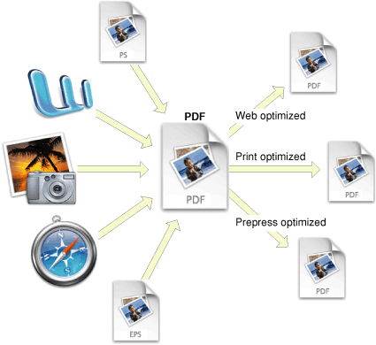
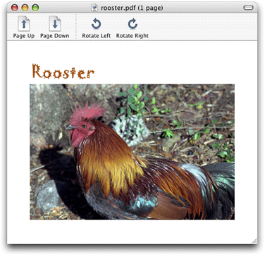
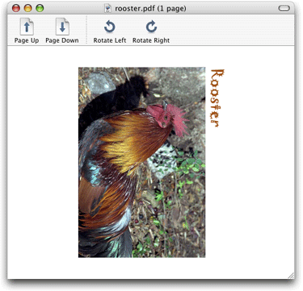

> 导航：[总目录](../../../README.md) · [documentation](../../../_indexes/documentation.md) · [Quartz 2D Programming Guide](Introduction.md)


[Next](PDF%20Document%20Parsing.md)[Previous](Core%20Graphics%20Layer%20Drawing.md)

# PDF Document Creation, Viewing, and Transforming

PDF documents store resolution-independent vector graphics, text, and images as a series of commands written in a compact programming language. A PDF document can contain multiple pages of images and text. PDF is useful for creating cross-platform, read-only documents and for drawing resolution-independent graphics.

Quartz creates, for all applications, high-fidelity PDF documents that preserve the drawing operations of the application, as shown in Figure 13-1. The resulting PDF may be optimized for a specific use (such as a particular printer, or for the web) by other parts of the system, or by third-party products. PDF documents generated by Quartz view correctly in Preview and Acrobat.

__Figure 13-1__  Quartz creates high-quality PDF documents



Quartz not only uses PDF as its “digital paper” but also includes as part of its API a number of functions that you can use to display and generate PDF files and to accomplish a number of other PDF-related tasks.

For detailed information about PDF, including the PDF language and syntax, see _PDF Reference_, Fourth Edition, Version 1.5.

Quartz provides the data type `CGPDFDocumentRef` to represent a PDF document. You create a CGPDFDocument object using either the function `CGPDFDocumentCreateWithProvider` or the function `CGPDFDocumentCreateWithURL`. After you create a CGPDFDocument object, you can draw it to a graphics context. Figure 13-2 shows a PDF document displayed inside a window.

__Figure 13-2__  A PDF document



Listing 13-1 shows how to create a CGPDFDocument object and obtain the number of pages in the document. A detailed explanation for each numbered line of code appears following the listing.

__Listing 13-1__  Creating a CGPDFDocument object from a PDF file

```
CGPDFDocumentRef MyGetPDFDocumentRef (const char *filename)
{
    CFStringRef path;
    CFURLRef url;
    CGPDFDocumentRef document;
    size_t count;

    path = CFStringCreateWithCString (NULL, filename,
                         kCFStringEncodingUTF8);
    url = CFURLCreateWithFileSystemPath (NULL, path, // 1
                        kCFURLPOSIXPathStyle, 0);
    CFRelease (path);
    document = CGPDFDocumentCreateWithURL (url);// 2
    CFRelease(url);
    count = CGPDFDocumentGetNumberOfPages (document);// 3
    if (count == 0) {
        printf("`%s' needs at least one page!", filename);
        return NULL;
    }
    return document;
}
```

Here’s what the code does:

1. Calls the Core Foundation function to create a CFURL object from a CFString object that represents the filename of the PDF file to display.
2. Creates a CGPDFDocument object from a CFURL object.
3. Gets the number of pages in the PDF so that the next statement in the code can ensure that the document has at least one page.

You can see how to draw a PDF page to a graphics context by looking at the code in Listing 13-2. A detailed explanation for each numbered line of code appears following the listing.

__Listing 13-2__  Drawing a PDF page

```
void MyDisplayPDFPage (CGContextRef myContext,
                    size_t pageNumber,
                    const char *filename)
{
    CGPDFDocumentRef document;
    CGPDFPageRef page;

    document = MyGetPDFDocumentRef (filename);// 1
    page = CGPDFDocumentGetPage (document, pageNumber);// 2
    CGContextDrawPDFPage (myContext, page);// 3
    CGPDFDocumentRelease (document);// 4
}
```

Here’s what the code does:

1. Calls your function (see [Listing 13-1](#apple-f4xwc4dqnrsv64tfmyxwi33df52wszbpkridgmbqgaytanrwfvbuqmrrgqwugsscizdeqscb)) to create a CGPDFDocument object from a filename you supply.
2. Gets the page for the specified page number from the PDF document.
3. Draws the specified page from the PDF file by calling the function `CGContextDrawPDFPage`. You need to supply a graphics context and the page to draw.
4. Releases the CGPDFDocument object.

Quartz provides a function—`CGPDFPageGetDrawingTransform`—that creates an affine transform by mapping a box in a PDF page to a rectangle you specify. The prototype for this function is:

```
CGAffineTransform CGPDFPageGetDrawingTransform (
        CGPPageRef page,
        CGPDFBox box,
        CGRect rect,
        int rotate,
        bool preserveAspectRatio
);
```

The function returns an affine transform using that following algorithm:

- Intersects the rectangle associated with the type of PDF box you specify in the `box` parameter (media, crop, bleed, trim, or art) and the `/MediaBox` entry of the specified PDF page. The intersection results in an _effective rectangle_.
- Rotates the effective rectangle by the amount specified by the `/Rotate` entry for the PDF page.
- Centers the resulting rectangle on rectangle you supply in the `rect` parameter.
- If the value of the `rotate` parameter you supply is nonzero and a multiple of 90, the function rotates the effective rectangle by the number of degrees you supply. Positive values rotate the rectangle to the right; negative values rotate the rectangle to the left. Note that you pass degrees, not radians. Keep in mind that the `/Rotate` entry for the PDF page contains a rotation as well, and the `rotate` parameter you supply is combined with the `/Rotate` entry.
- Scales the effective rectangle, if necessary, so that it coincides with the edges of the rectangle you supply.
- If you specify to preserve the aspect ratio by passing `true` in the `preserveAspectRatio` parameter, then the final rectangle coincides with the edges of the more restrictive dimension of the rectangle you supply in the `rect` parameter.

You can use this function, for example, if you are writing a PDF viewing application similar to that shown in [Figure 13-3](#apple-f4xwc4dqnrsv64tfmyxwi33df52wszbpkridgmbqgaytanrwfvbuqmrrgqwugsscjjcuercg). If you were to provide a Rotate Left/Rotate Right feature, you could call `CGPDFPageGetDrawingTransform` to compute the appropriate transform for the current window size and rotation setting.

__Figure 13-3__  A PDF page rotated 90 degrees to the right



Listing 13-3 shows a function that creates an affine transform for a PDF page using the parameters passed to the function, applies the transform, and then draws the PDF page. A detailed explanation for each numbered line of code appears following the listing.

__Listing 13-3__  Creating an affine transform for a PDF page

```
void MyDrawPDFPageInRect (CGContextRef context,
                    CGPDFPageRef page,
                    CGPDFBox box,
                    CGRect rect,
                    int rotation,
                    bool preserveAspectRatio)
{
    CGAffineTransform m;

    m = CGPDFPageGetDrawingTransform (page, box, rect, rotation,// 1
                                    preserveAspectRato);
    CGContextSaveGState (context);// 2
    CGContextConcatCTM (context, m);// 3
    CGContextClipToRect (context,CGPDFPageGetBoxRect (page, box));// 4
    CGContextDrawPDFPage (context, page);// 5
    CGContextRestoreGState (context);// 6
}
```

Here’s what the code does:

1. Creates an affine transform from the parameters supplied to the function.
2. Saves the graphics state.
3. Concatenates the CTM with the affine transform.
4. Clips the graphics context to the rectangle specified by the `box` parameter. The function `CGPDFPageGetBoxRect` obtains the page bounding box (media, crop, bleed, trim, and art boxes) associated with the constant you supply—`kCGPDFMediaBox`, `kCGPDFCropBox`, `kCGPDFBleedBox`, `kCGPDFTrimBox`, or `kCGPDFArtBox`.
5. Draws the PDF page to the transformed and clipped context.
6. Restores the graphics state.

It’s as easy to create a PDF file using Quartz 2D as it is to draw to any graphics context. You specify a location for a PDF file, set up a PDF graphics context, and use the same drawing routine you’d use for any graphics context. The function `MyCreatePDFFile`, shown in Listing 13-4, shows all the tasks your code performs to create a PDF file. A detailed explanation for each numbered line of code appears following the listing.

Note that the code delineates PDF pages by calling the functions `CGPDFContextBeginPage` and `CGPDFContextEndPage`. You can pass a CFDictionary object to specify page properties including the media, crop, bleed, trim, and art boxes. For a list of dictionary key constants and a more detailed description of each, see _[CGPDFContext Reference](https://developer.apple.com/documentation/coregraphics/cgpdfcontext)_.

__Listing 13-4__  Creating a PDF file

```
void MyCreatePDFFile (CGRect pageRect, const char *filename)// 1
{
    CGContextRef pdfContext;
    CFStringRef path;
    CFURLRef url;
    CFDataRef boxData = NULL;
    CFMutableDictionaryRef myDictionary = NULL;
    CFMutableDictionaryRef pageDictionary = NULL;

    path = CFStringCreateWithCString (NULL, filename, // 2
                                kCFStringEncodingUTF8);
    url = CFURLCreateWithFileSystemPath (NULL, path, // 3
                     kCFURLPOSIXPathStyle, 0);
    CFRelease (path);
    myDictionary = CFDictionaryCreateMutable(NULL, 0,
                        &kCFTypeDictionaryKeyCallBacks,
                        &kCFTypeDictionaryValueCallBacks); // 4
    CFDictionarySetValue(myDictionary, kCGPDFContextTitle, CFSTR("My PDF File"));
    CFDictionarySetValue(myDictionary, kCGPDFContextCreator, CFSTR("My Name"));
    pdfContext = CGPDFContextCreateWithURL (url, &pageRect, myDictionary); // 5
    CFRelease(myDictionary);
    CFRelease(url);
    pageDictionary = CFDictionaryCreateMutable(NULL, 0,
                        &kCFTypeDictionaryKeyCallBacks,
                        &kCFTypeDictionaryValueCallBacks); // 6
    boxData = CFDataCreate(NULL,(const UInt8 *)&pageRect, sizeof (CGRect));
    CFDictionarySetValue(pageDictionary, kCGPDFContextMediaBox, boxData);
    CGPDFContextBeginPage (pdfContext, pageDictionary); // 7
    myDrawContent (pdfContext);// 8
    CGPDFContextEndPage (pdfContext);// 9
    CGContextRelease (pdfContext);// 10
    CFRelease(pageDictionary); // 11
    CFRelease(boxData);
}
```

Here’s what the code does:

1. Takes as parameters a rectangle that specifies the size of the PDF page and a string that specifies the filename.
2. Creates a CFString object from a filename passed to the function `MyCreatePDFFile`.
3. Creates a CFURL object from the CFString object.
4. Creates an empty CFDictionary object to hold metadata. The next two lines add a title and creator. You can add as many key-value pairs as you’d like using the function [CFDictionarySetValue](https://developer.apple.com/documentation/corefoundation/1516787-cfdictionarysetvalue). For more information on creating dictionaries, see _[CFDictionary Reference](https://developer.apple.com/documentation/corefoundation/cfdictionary)_.
5. Creates a PDF graphics context, passing three parameters:

   - A CFURL object that specifies a location for the PDF data.
   - A pointer to a rectangle that defines the default size and location of the PDF page. The origin of the rectangle is typically (0, 0). Quartz uses this rectangle as the default bounds of the page media box. If you pass `NULL`, Quartz uses a default page size of 8.5 by 11 inches (612 by 792 points).
   - A CFDictionary object that contains PDF metadata. Pass `NULL` if you don’t have metadata to add.

     You can use the CFDictionary object to specify output intent options—intent subtype, condition, condition identifier, registry name, destination output profile, and a human-readable text string that contains additional information or comments about the intended target device or production condition. For more information about output intent options, see _[CGPDFContext Reference](https://developer.apple.com/documentation/coregraphics/cgpdfcontext)_.
6. Creates a CFDictionary object to hold the page boxes for the PDF page. This example sets the media box.
7. Signals the start of a page. When you use a graphics context that supports multiple pages (such as PDF), you call the function `CGPDFContextBeginPage` together with `CGPDFContextEndPage` to delineate the page boundaries in the output. Each page must be bracketed by calls to `CGPDFContextBeginPage` and `CGPDFContextEndPage`. Quartz ignores all drawing operations performed outside a page boundary in a page-based context.
8. Calls an application-defined function to draw content to the PDF context. You supply your drawing routine here.
9. Signals the end of a page in a page-based graphics context.
10. Releases the PDF context.
11. Releases the page dictionary.

You can add links and anchors to PDF context you create. Quartz provides three functions, each of which takes a PDF graphics context as a parameter, along with information about the links:

- `CGPDFContextSetURLForRect` lets you specify a URL to open when the user clicks a rectangle in the current PDF page.
- `CGPDFContextSetDestinationForRect` lets you set a destination to jump to when the user clicks a rectangle in the current PDF page. You must supply a destination name.
- `CGPDFContextAddDestinationAtPoint` lets you set a destination to jump to when the user clicks a point in the current PDF page. You must supply a destination name.

To protect PDF content, there are a number of security options you can specify in the auxiliary dictionary you pass to the function `CGPDFContextCreate`. You can set the owner password, user password, and whether the PDF can be printed or copied by including the following keys in the auxiliary dictionary:

- `kCGPDFContextOwnerPassword`, to define the owner password of the PDF document. If this key is specified, the document is encrypted using the value as the owner password; otherwise, the document is not encrypted. The value of this key must be a CFString object that can be represented in ASCII encoding. Only the first 32 bytes are used for the password. There is no default value for this key. If the value of this key cannot be represented in ASCII, the document is not created and the creation function returns `NULL`. Quartz uses 40-bit encryption.
- `kCGPDFContextUserPassword`, to define the user password of the PDF document. If the document is encrypted, then the value of this key is the user password for the document. If not specified, the user password is the empty string. The value of this key must be a CFString object that can be represented in ASCII encoding; only the first 32 bytes are used for the password. If the value of this key cannot be represented in ASCII, the document is not created and the creation function returns `NULL`.
- `kCGPDFContextAllowsPrinting` specifies whether the document can be printed when it is unlocked with the user password. The value of this key must be a CFBoolean object. The default value of this key is `kCFBooleanTrue`.
- `kCGPDFContextAllowsCopying` specifies whether the document can be copied when it is unlocked with the user password. The value of this key must be a CFBoolean object. The default value of this key is `kCFBooleanTrue`.

[Listing 14-4](PDF%20Document%20Parsing.md#apple-f4xwc4dqnrsv64tfmyxwi33df52wszbpkridgmbqgaytanrwfvbuqmrsgawueqkkijbemr2g) (in the next chapter) shows code that checks PDF document to see if it’s locked and if it is, attempts to open the document with a password.

[Next](PDF%20Document%20Parsing.md)[Previous](Core%20Graphics%20Layer%20Drawing.md)

