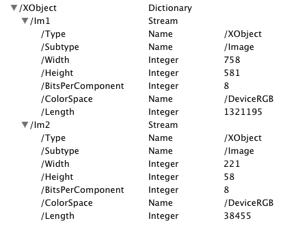
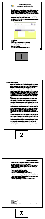

> 导航：[总目录](../../../README.md) · [documentation](../../../_indexes/documentation.md) · [Quartz 2D Programming Guide](Introduction.md)


[Next](PostScript%20Conversion.md)[Previous](PDF%20Document%20Creation%2C%20Viewing%2C%20and%20Transforming.md)

# PDF Document Parsing

Quartz provides functions that let you inspect the PDF document structure and the content stream. Inspecting the document structure lets you read the entries in the document catalog and the contents associated with each entry. By recursively traversing the catalog, you can inspect the entire document.

A PDF content stream is just what its name suggests—a sequential stream of data such as `'BT 12 /F71 Tf (draw this text) Tj . . . '` where PDF operators and their descriptors are mixed with the actual PDF content. Inspecting the content stream requires that you access it sequentially.

This chapter shows how to examine the structure of a PDF document and parse the contents of a PDF document.

PDF files may contain multiple pages of images and text. You can use Quartz to access the metadata at the document and page levels as well as objects on a PDF page. This section provides a very brief introduction to the metadata you can access.

A PDF document object (`CGPDFDocument`) contains all the information that relates to a PDF document, including its catalog and contents. The entries in the catalog recursively describe the contents of the PDF document. You can access the contents of a PDF document catalog by calling the function `CGPDFDocumentGetCatalog`.

A PDF page object (`CGPDFPage`) represents a page in a PDF document and contains information that relates to a specific page, including the page dictionary and page contents. You can obtain a page dictionary by calling the function `CGPDFPageGetDictionary`.

Figure 14-1 shows some of the metadata describing the two images—the text and the image of the rooster—that make up the PDF file displayed in [Figure 13-2](PDF%20Document%20Creation%2C%20Viewing%2C%20and%20Transforming.md#apple-f4xwc4dqnrsv64tfmyxwi33df52wszbpkridgmbqgaytanrwfvbuqmrrgqwugsscizdusqkj).

__Figure 14-1__  Metadata for two images in a PDF file



You can obtain much more useful information by accessing PDF metadata. The items in Figure 14-1 are just a sample. For example, you can check to see if a PDF has thumbnail images (shown in [Figure 14-2](#apple-f4xwc4dqnrsv64tfmyxwi33df52wszbpkridgmbqgaytanrwfvbuqmrsgawugsscjbbusrkc)) using the code shown in Listing 14-1.

__Listing 14-1__  Getting a thumbnail view of a PDF

```
CGPDFDictionaryRef d;
CGPDFStreamRef stream; // represents a sequence of bytes
d = CGPDFPageGetDictionary(page);
// check for thumbnail data
if (CGPDFDictionaryGetStream (d, “Thumb”, &stream)){
    // get the data if it exists
    data = CGPDFStreamCopyData (stream, &format);
```

Quartz performs all the decryption and decoding of the data stream for you.

__Figure 14-2__  Thumbnail images



Quartz provides a number of functions that you can use to obtain individual values for items in the PDF metadata. You use the function `CGPDFObjectGetValue`, passing a `CGPDFObjectRef`, a PDF object type (`kCGPDFObjectTypeBoolean`, `kCGPDFObjectTypeInteger`, and so forth), and storage for the value. On return, the storage is filled with the value.

There are numerous other functions you can use to traverse the hierarchy of a PDF file to access the various nodes and their children. For example, the `CGPDFArray` functions (`CGPDFArrayGetBoolean`, `CGPDFArrayGetDictionary`, `CGPDFArrayGetInteger`, and so forth) let you access arrays of values to retrieve values of specific types. You can find out more about how to use these functions by reading the PDF specification.

The PDF content stream contains operators that signify parts of a PDF content stream that may be of interest to your application. An operator either marks a single point or a sequence. An operator is specified as a tag that has a property list or an object associated with it. A tag specifies what the point or content sequence represents. A property list is a dictionary that contains key-value pairs specified by the PDF content creator. When you parse a PDF content stream, your application looks for any markers of interest, inspects the tag, property list, or object associated with the marker, and then performs any further processing that’s appropriate. Consult the _PDF Reference_ for a complete list of PDF operators.

You use a CGPDFScanner object ([CGPDFScannerRef](https://developer.apple.com/documentation/coregraphics/cgpdfscannerref) data type) to parse a PDF content stream. The CGPDFScanner object invokes callbacks for any operator in the stream for which you have registered a callback.

You perform the tasks described in the following sections to parse a content stream:

1. [Write Callbacks for Operators](#apple-f4xwc4dqnrsv64tfmyxwi33df52wszbpkridgmbqgaytanrwfvbuqmrsgawueqkkirauessf). You need to write callbacks only for the operators you want to handle.
2. [Create and Set Up the Operator Table](#apple-f4xwc4dqnrsv64tfmyxwi33df52wszbpkridgmbqgaytanrwfvbuqmrsgawueqkkjbbeeskf).
3. [Open the PDF Document](#apple-f4xwc4dqnrsv64tfmyxwi33df52wszbpkridgmbqgaytanrwfvbuqmrsgawueqkki5deoscj).
4. [Scan the Content Stream for Each Page](#apple-f4xwc4dqnrsv64tfmyxwi33df52wszbpkridgmbqgaytanrwfvbuqmrsgawueqkkivbeqssk).

When it’s appropriate to do so, you need to make sure the you release the scanner, content stream, and operator table.

The following sections show how to parse a content stream to find _marked-content operators_ (see Table 14-1). Marked content operators represent only some of the PDF operators used in PDF content. When you write your own code, you’d look for the PDF operators appropriate for your application.

__Table 14-1__  Marked content operators represent some of the PDF operators that you can parse

| Operator | Description |
| `MP` | A marked point that has a tag associated with it. |
| `DP` | A marked point that has a tag and a property list or object associated with it. |
| `BMC` | Signals the start of a marked-content sequence (begin marked content) and is paired with the `EMC` marker that signals the end of the sequence. Has a tag associated with it. |
| `BDC` | Signals the start of a marked-content sequence and is paired with the `EMC` marker that signals the end of the sequence. Has a tag and a property list or object associated with it. |
| `EMC` | Signals the end of a marked-content sequence (end marked content) that begins with a `BMC` or a `BDC` marker. This operator does not have a tag associated with it. |

When Quartz invokes your callback for a PDF operators, it passes a CGPDFScanner object and a pointer to any information needed by your callback. Typically, your callback retrieves any items associated with the operator. For example, the callback for the `MP` operator that’s shown in Listing 14-2 calls the function `CGPDFScannerPopName` to retrieve the character string associated with the operator from the stack. If the code in the listing successfully retrieves the name from the scanner stack, it prints the name.

Quartz has an assortment of `CGPDFScannerPop` functions for retrieving objects, Boolean values, names, numbers, strings, arrays, dictionaries, and streams. Each function returns a Boolean value to indicate whether the item was retrieved successfully.

__Listing 14-2__  A callback for the MP operator

```
static void
op_MP (CGPDFScannerRef s, void *info)
{
    const char *name;

    if (!CGPDFScannerPopName(s, &name))
        return;

    printf("MP /%s\n", name);
}
```


A `CGPDFOperatorTable` object stores PDF operator callback functions that you write. The function `CGPDFOperatorTableCreate` creates an operator table, as shown in Listing 14-3. After you create an operator table, you call the function `CGPDFOperatorTableSetCallback` for each callback you want to add to the table. You pass the table, the string that specifies the PDF operator, and a pointer to a callback function you write to handle that operator. You can name the callbacks whatever you’d like. Just make sure that the callback name you pass to the function `CGPDFOperatorTableSetCallback` isn’t misspelled.

The code in Listing 14-3 sets a callback for each of the marked-content operators listed in [Table 14-1](#apple-f4xwc4dqnrsv64tfmyxwi33df52wszbpkridgmbqgaytanrwfvbuqmrsgawueqkkivceqske). Your application would set callbacks only for those operators of interest. PDF operator strings are defined in the _PDF Reference_ from Adobe.

__Listing 14-3__  Setting callbacks for an operator table

```
CGPDFOperatorTableRef myTable;

myTable = CGPDFOperatorTableCreate();

CGPDFOperatorTableSetCallback (myTable, "MP", &op_MP);
CGPDFOperatorTableSetCallback (myTable, "DP", &op_DP);
CGPDFOperatorTableSetCallback (myTable, "BMC", &op_BMC);
CGPDFOperatorTableSetCallback (myTable, "BDC", &op_BDC);
CGPDFOperatorTableSetCallback (myTable, "EMC", &op_EMC);
```


Before you can scan the content of a PDF document, you need to open it. Listing 14-4 shows a code fragment that creates a CGPDFDocument object from a URL supplied to the code. Note that the listing is a code fragment, so that not all variables are declared. A detailed explanation for each numbered line of code appears following the listing.

__Listing 14-4__  Opening a PDF document from a URL

```
CGPDFDocumentRef myDocument;
myDocument = CGPDFDocumentCreateWithURL(url);// 1
if (myDocument == NULL) {// 2
        error ("can't open `%s'.", filename);
        CFRelease (url);
        return EXIT_FAILURE;
}
CFRelease (url);
if (CGPDFDocumentIsEncrypted (myDocument)) {// 3
    if (!CGPDFDocumentUnlockWithPassword (myDocument, "")) {
        printf ("Enter password: ");
        fflush (stdout);
        password = fgets(buffer, sizeof(buffer), stdin);
        if (password != NULL) {
            buffer[strlen(buffer) - 1] = '\0';
            if (!CGPDFDocumentUnlockWithPassword (myDocument, password))
                error("invalid password.");
        }
    }
}
if (!CGPDFDocumentIsUnlocked (myDocument)) {// 4
        error("can't unlock `%s'.", filename);
        CGPDFDocumentRelease(myDocument);
        return EXIT_FAILURE;
    }
}
 if (CGPDFDocumentGetNumberOfPages(myDocument) == 0) {// 5
        CGPDFDocumentRelease(myDocument);
        return EXIT_FAILURE;
}
```

Here’s what the code does:

1. Creates a CGPDFDocument object from a URL supplied to the code.
2. Checks to make sure that a CGPDFDocument object is created. If not, the code exits because it makes no sense to continue without a document.
3. Checks whether the document is encrypted. If the document is encrypted, the code attempts to open is using a blank password. If that fails, the code asks the user for a password and attempts to unlock the document with the password.
4. Checks whether the document is unlocked. If it’s not, the code exits.
5. Checks to make sure the document has at least one page. Otherwise, the code exits.

The code fragment in Listing 14-5 scans each page in a document. When the scanner encounters one of the PDF operators for which you registered a callback, Quartz invokes your callback. A detailed explanation for each numbered line of code follows the listing.

__Listing 14-5__  Scanning each page of a document

```
int k;
CGPDFPageRef myPage;
CGPDFScannerRef myScanner;
CGPDFContentStreamRef myContentStream;

numOfPages = CGPDFDocumentGetNumberOfPages (myDocument);// 1
for (k = 0; k < numOfPages; k++) {
    myPage = CGPDFDocumentGetPage (myDocument, k + 1 );// 2
    myContentStream = CGPDFContentStreamCreateWithPage (myPage);// 3
    myScanner = CGPDFScannerCreate (myContentStream, myTable, NULL);// 4
    CGPDFScannerScan (myScanner);// 5
    CGPDFPageRelease (myPage);// 6
    CGPDFScannerRelease (myScanner);// 7
    CGPDFContentStreamRelease (myContentStream);// 8
 }
 CGPDFOperatorTableRelease(myTable);// 9
```

Here’s what the code does:

1. Gets the number of pages in the document that you previously opened. See [Open the PDF Document](#apple-f4xwc4dqnrsv64tfmyxwi33df52wszbpkridgmbqgaytanrwfvbuqmrsgawueqkki5deoscj).
2. Retrieves a page to scan. The page numbers start at `1`.
3. Creates a content stream for the page.
4. Creates a scanner for the content stream. You must pass the content stream and the operator table that you previously created and set with callbacks. See [Create and Set Up the Operator Table](#apple-f4xwc4dqnrsv64tfmyxwi33df52wszbpkridgmbqgaytanrwfvbuqmrsgawueqkkjbbeeskf). You can also pass any data that your callbacks need.
5. Parses the content stream associated with the scanner. Quartz invokes your callback each time it encounters one of the operators for which you provided a callback.
6. Releases the page.
7. Releases the scanner.
8. Releases the content stream.
9. Releases the operator table after scanning all the pages in the PDF.

[Next](PostScript%20Conversion.md)[Previous](PDF%20Document%20Creation%2C%20Viewing%2C%20and%20Transforming.md)

