> 导航：[总目录](../../../README.md) · [documentation](../../../_indexes/documentation.md) · [Quartz 2D Programming Guide](Introduction.md)


[Next](Color%20and%20Color%20Spaces.md)[Previous](Graphics%20Contexts.md)

# Paths

A _path_ defines one or more shapes, or subpaths. A subpath can consist of straight lines, curves, or both. It can be open or closed. A subpath can be a simple shape, such as a line, circle, rectangle, or star, or a more complex shape such as the silhouette of a mountain range or an abstract doodle. Figure 3-1 shows some of the paths you can create. The straight line (at the upper left of the figure) is dashed; lines can also be solid. The squiggly path (in the middle top) is made up of several curves and is an open path. The concentric circles are filled, but not stroked. The State of California is a closed path, made up of many curves and lines, and the path is both stroked and filled. The stars illustrate two options for filling paths, which you’ll read about later in this chapter.

__Figure 3-1__  Quartz supports path-based drawing

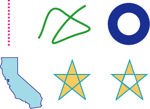

In this chapter, you’ll learn about the building blocks that make up paths, how to stroke and paint paths, and the parameters that affect the appearance of paths.

Path creation and path painting are separate tasks. First you create a path. When you want to render a path, you request Quartz to paint it. As you can see in Figure 3-1, you can choose to stroke the path, fill the path, or both stroke and fill the path. You can also use a path to constrain the drawing of other objects within the bounds of the path creating, in effect, a _clipping area_.

Figure 3-2 shows a path that has been painted and that contains two subpaths. The subpath on the left is a rectangle, and the subpath on the right is an abstract shape made up of straight lines and curves. Each subpath is filled and its outline stroked.

__Figure 3-2__  A path that contains two shapes, or subpaths

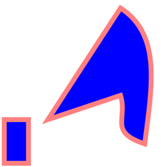

Figure 3-3 shows multiple paths drawn independently. Each path contains a randomly generated curve, some of which are filled and others stroked. Drawing is constrained to a circular area by a clipping area.

__Figure 3-3__  A clipping area constrains drawing

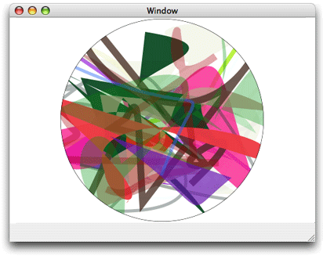

Subpaths are built from lines, arcs, and curves. Quartz also provides convenience functions to add rectangles and ellipses with a single function call. Points are also essential building blocks of paths because points define starting and ending locations of shapes.

Points are x and y coordinates that specify a location in user space. You can call the function [CGContextMoveToPoint](https://developer.apple.com/documentation/coregraphics/1454738-cgcontextmovetopoint) to specify a starting position for a new subpath. Quartz keeps track of the _current point_, which is the last location used for path construction. For example, if you call the function `CGContextMoveToPoint` to set a location at (10,10), that moves the current point to (10,10). If you then draw a horizontal line 50 units long, the last point on the line, that is, (60,10), becomes the current point. Lines, arcs, and curves are always drawn starting from the current point.

Most of the time you specify a point by passing to Quartz functions two floating-point values to specify x and y coordinates. Some functions require that you pass a [CGPoint](https://developer.apple.com/documentation/coregraphics/cgpoint) data structure, which holds two floating-point values.

A line is defined by its endpoints. Its starting point is always assumed to be the current point, so when you create a line, you specify only its endpoint. You use the function [CGContextAddLineToPoint](https://developer.apple.com/documentation/coregraphics/1455213-cgcontextaddlinetopoint) to append a single line to a subpath.

You can add a series of connected lines to a path by calling the function [CGContextAddLines](https://developer.apple.com/documentation/coregraphics/1455461-cgcontextaddlines). You pass this function an array of points. The first point must be the starting point of the first line; the remaining points are endpoints. Quartz begins a new subpath at the first point and connects a straight line segment to each endpoint.

Arcs are circle segments. Quartz provides two functions that create arcs. The function [CGContextAddArc](https://developer.apple.com/documentation/coregraphics/1455756-cgcontextaddarc) creates a curved segment from a circle. You specify the center of the circle, the radius, and the radial angle (in radians). You can create a full circle by specifying a radial angle of 2 pi. Figure 3-4 shows multiple paths drawn independently. Each path contains a randomly generated circle; some are filled and others are stroked.

__Figure 3-4__  Multiple paths; each path contains a randomly generated circle

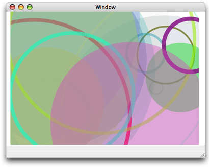

The function [CGContextAddArcToPoint](https://developer.apple.com/documentation/coregraphics/1456238-cgcontextaddarctopoint) is ideal to use when you want to round the corners of a rectangle. Quartz uses the endpoints you supply to create two tangent lines. You also supply the radius of the circle from which Quartz slices the arc. The center point of the arc is the intersection of two radii, each of which is perpendicular to one of the two tangent lines. Each endpoint of the arc is a tangent point on one of the tangent lines, as shown in Figure 3-5. The red portion of the circle is what’s actually drawn.

__Figure 3-5__  Defining an arc with two tangent lines and a radius

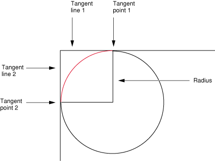

If the current path already contains a subpath, Quartz appends a straight line segment from the current point to the starting point of the arc. If the current path is empty, Quartz creates a new subpath at the starting point for the arc and does not add the initial straight line segment.

Quadratic and cubic Bézier curves are algebraic curves that can specify any number of interesting curvilinear shapes. Points on these curves are calculated by applying a polynomial formula to starting and ending points, and one or more control points. Shapes defined in this way are the basis for vector graphics. A formula is much more compact to store than an array of bits and has the advantage that the curve can be re-created at any resolution.

Figure 3-6 shows a variety of curves created by drawing multiple paths independently. Each path contains a randomly generated curve; some are filled and others are stroked.

__Figure 3-6__  Multiple paths; each path contains a randomly generated curve

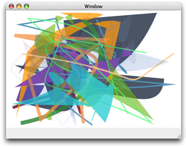

The polynomial formulas that give to rise to quadratic and cubic Bézier curves, and the details on how to generate the curves from the formulas, are discussed in many mathematics texts and online sources that describe computer graphics. These details are not discussed here.

You use the function [CGContextAddCurveToPoint](https://developer.apple.com/documentation/coregraphics/1456393-cgcontextaddcurvetopoint) to append a cubic Bézier curve from the current point, using control points and an endpoint you specify. Figure 3-7 shows the cubic Bézier curve that results from the current point, control points, and endpoint shown in the figure. The placement of the two control points determines the geometry of the curve. If the control points are both above the starting and ending points, the curve arches upward. If the control points are both below the starting and ending points, the curve arches downward.

__Figure 3-7__  A cubic Bézier curve uses two control points

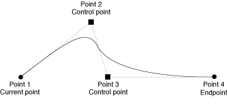

You can append a quadratic Bézier curve from the current point by calling the function [CGContextAddQuadCurveToPoint](https://developer.apple.com/documentation/coregraphics/1454268-cgcontextaddquadcurvetopoint), and specifying a control point and an endpoint. Figure 3-8 shows two curves that result from using the same endpoints but different control points. The control point determines the direction that the curve arches. It’s not possible to create as many interesting shapes with a quadratic Bézier curve as you can with a cubic one because quadratic curves use only one control point. For example, it’s not possible to create a crossover using a single control point.

__Figure 3-8__  A quadratic Bézier curve uses one control point

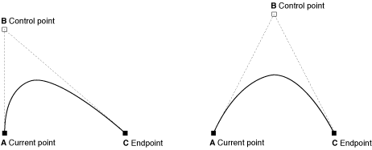

To close the current subpath, your application should call [CGContextClosePath](https://developer.apple.com/documentation/coregraphics/1454508-cgcontextclosepath). This function adds a line segment from the current point to the starting point of the subpath and closes the subpath. Lines, arcs, and curves that end at the starting point of a subpath do not actually close the subpath. You must explicitly call `CGContextClosePath` to close a subpath.

Some Quartz functions treat a path’s subpaths as if they were closed by your application. Those commands treat each subpath as if your application had called `CGContextClosePath` to close it, implicitly adding a line segment to the starting point of the subpath.

After closing a subpath, if your application makes additional calls to add lines, arcs, or curves to the path, Quartz begins a new subpath starting at the starting point of the subpath you just closed.

An ellipse is essentially a squashed circle. You create one by defining two focus points and then plotting all the points that lie at a distance such that adding the distance from any point on the ellipse to one focus to the distance from that same point to the other focus point is always the same value. Figure 3-9 shows multiple paths drawn independently. Each path contains a randomly generated ellipse; some are filled and others are stroked.

__Figure 3-9__  Multiple paths; each path contains a randomly generated ellipse

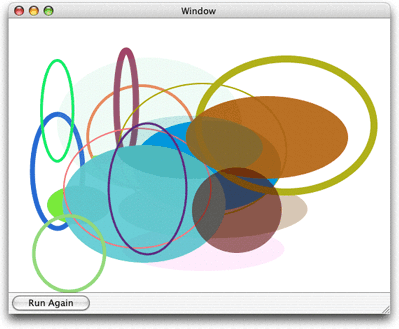

You can add an ellipse to the current path by calling the function [CGContextAddEllipseInRect](https://developer.apple.com/documentation/coregraphics/cgcontext/1456420-addellipse). You supply a rectangle that defines the bounds of the ellipse. Quartz approximates the ellipse using a sequence of Bézier curves. The center of the ellipse is the center of the rectangle. If the width and height of the rectangle are equal (that is, a square), the ellipse is circular, with a radius equal to one-half the width (or height) of the rectangle. If the width and height of the rectangle are unequal, they define the major and minor axes of the ellipse.

The ellipse that is added to the path starts with a move-to operation and ends with a close-subpath operation, with all moves oriented in the clockwise direction.

You can add a rectangle to the current path by calling the function [CGContextAddRect](https://developer.apple.com/documentation/coregraphics/1456617-cgcontextaddrect). You supply a [CGRect](https://developer.apple.com/documentation/coregraphics/cgrect) structure that contains the origin of the rectangle and its width and height.

The rectangle that is added to the path starts with a move-to operation and ends with a close-subpath operation, with all moves oriented in the counter-clockwise direction.

You can add many rectangles to the current path by calling the function [CGContextAddRects](https://developer.apple.com/documentation/coregraphics/1454734-cgcontextaddrects) and supplying an array of `CGRect` structures. Figure 3-10 shows multiple paths drawn independently. Each path contains a randomly generated rectangle; some are filled and others are stroked.

__Figure 3-10__  Multiple paths; each path contains a randomly generated rectangle

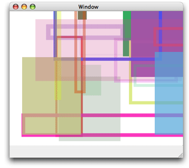

When you want to construct a path in a graphics context, you signal Quartz by calling the function [CGContextBeginPath](https://developer.apple.com/documentation/coregraphics/1456635-cgcontextbeginpath) . Next, you set the starting point for the first shape, or subpath, in the path by calling the function [CGContextMoveToPoint](https://developer.apple.com/documentation/coregraphics/1454738-cgcontextmovetopoint). After you establish the first point, you can add lines, arcs, and curves to the path, keeping in mind the following:

- Before you begin a new path, call the function `CGContextBeginPath`.
- Lines, arcs, and curves are drawn starting at the current point. An empty path has no current point; you must call `CGContextMoveToPoint` to set the starting point for the first subpath or call a convenience function that implicitly does this for you.
- When you want to close the current subpath within a path, call the function `CGContextClosePath` to connect a segment to the starting point of the subpath. Subsequent path calls begin a new subpath, even if you do not explicitly set a new starting point.
- When you draw arcs, Quartz draws a line between the current point and the starting point of the arc.
- Quartz routines that add ellipses and rectangles add a new closed subpath to the path.
- You must call a painting function to fill or stroke the path because creating a path does not draw the path. See [Painting a Path](#apple-f4xwc4dqnrsv64tfmyxwi33df52wszbpkridgmbqgaytanrwfvbuqmrrgewugssciveuqsck) for detailed information.

After you paint a path, it is flushed from the graphics context. You might not want to lose your path so easily, especially if it depicts a complex scene you want to use over and over again. For that reason, Quartz provides two data types for creating reusable paths—[CGPathRef](https://developer.apple.com/documentation/coregraphics/cgpath) and [CGMutablePathRef](https://developer.apple.com/documentation/coregraphics/cgmutablepathref). You can call the function [CGPathCreateMutable](https://developer.apple.com/documentation/coregraphics/1411209-cgpathcreatemutable) to create a mutable CGPath object to which you can add lines, arcs, curves, and rectangles. Quartz provides a set of CGPath functions that parallel the functions discussed in [The Building Blocks](#apple-f4xwc4dqnrsv64tfmyxwi33df52wszbpkridgmbqgaytanrwfvbuqmrrgewugsscirbeiscg). The path functions operate on a CGPath object instead of a graphics context. These functions are:

- [CGPathCreateMutable](https://developer.apple.com/documentation/coregraphics/1411209-cgpathcreatemutable), which replaces[CGContextBeginPath](https://developer.apple.com/documentation/coregraphics/1456635-cgcontextbeginpath)
- [CGPathMoveToPoint](https://developer.apple.com/documentation/coregraphics/1411146-cgpathmovetopoint), which replaces [CGContextMoveToPoint](https://developer.apple.com/documentation/coregraphics/1454738-cgcontextmovetopoint)
- [CGPathAddLineToPoint](https://developer.apple.com/documentation/coregraphics/1411138-cgpathaddlinetopoint), which replaces [CGContextAddLineToPoint](https://developer.apple.com/documentation/coregraphics/1455213-cgcontextaddlinetopoint)
- [CGPathAddCurveToPoint](https://developer.apple.com/documentation/coregraphics/1411212-cgpathaddcurvetopoint), which replaces [CGContextAddCurveToPoint](https://developer.apple.com/documentation/coregraphics/1456393-cgcontextaddcurvetopoint)
- [CGPathAddEllipseInRect](https://developer.apple.com/documentation/coregraphics/1411222-cgpathaddellipseinrect), which replaces [CGContextAddEllipseInRect](https://developer.apple.com/documentation/coregraphics/cgcontext/1456420-addellipse)
- [CGPathAddArc](https://developer.apple.com/documentation/coregraphics/1411147-cgpathaddarc), which replaces [CGContextAddArc](https://developer.apple.com/documentation/coregraphics/1455756-cgcontextaddarc)
- [CGPathAddRect](https://developer.apple.com/documentation/coregraphics/1411144-cgpathaddrect), which replaces [CGContextAddRect](https://developer.apple.com/documentation/coregraphics/1456617-cgcontextaddrect)
- [CGPathCloseSubpath](https://developer.apple.com/documentation/coregraphics/1411188-cgpathclosesubpath), which replaces [CGContextClosePath](https://developer.apple.com/documentation/coregraphics/1454508-cgcontextclosepath)

See _Quartz 2D Reference Collection_ for a complete list of the path functions.

When you want to append the path to a graphics context, you call the function [CGContextAddPath](https://developer.apple.com/documentation/coregraphics/cgcontext/1456628-addpath). The path stays in the graphics context until Quartz paints it. You can add the path again by calling `CGContextAddPath`.

You can paint the current path by stroking or filling or both. _Stroking_ paints a line that straddles the path. _Filling_ paints the area contained within the path. Quartz has functions that let you stroke a path, fill a path, or both stroke and fill a path. The characteristics of the stroked line (width, color, and so forth), the fill color, and the method Quartz uses to calculate the fill area are all part of the graphics state (see [Graphics States](Overview%20of%20Quartz%202D.md#apple-f4xwc4dqnrsv64tfmyxwi33df52wszbpkridgmbqgaytanrwfvbuqmrqgiwviucykjcummjtgi)).

You can affect how a path is stroked by modifying the parameters listed in Table 3-1. These parameters are part of the graphics state, which means that the value you set for a parameter affects all subsequent stroking until you set the parameter to another value.

__Table 3-1__  Parameters that affect how Quartz strokes the current path

| Parameter | Function to set parameter value |
| Line width | `CGContextSetLineWidth` |
| Line join | `CGContextSetLineJoin` |
| Line cap | `CGContextSetLineCap` |
| Miter limit | `CGContextSetMiterLimit` |
| Line dash pattern | `CGContextSetLineDash` |
| Stroke color space | `CGContextSetStrokeColorSpace` |
| Stroke color | `CGContextSetStrokeColor``CGContextSetStrokeColorWithColor` |
| Stroke pattern | `CGContextSetStrokePattern` |

The _line width_ is the total width of the line, expressed in units of the user space. The line straddles the path, with half of the total width on either side.

The _line join_ specifies how Quartz draws the junction between connected line segments. Quartz supports the line join styles described in Table 3-2. The default style is miter join.

__Table 3-2__  Line join styles

| Style | Appearance | Description |
| Miter join | Miter join | Quartz extends the outer edges of the strokes for the two segments until they meet at an angle, as in a picture frame. If the segments meet at too sharp an angle, a bevel join is used instead. A segment is too sharp if the length of the miter divided by the line width is greater than the miter limit. |
| Round join | Round join | Quartz draws a semicircular arc with a diameter equal to the line width around the endpoint. The enclosed area is filled in. |
| Bevel join | Bevel join | Quartz finishes the two segments with butt caps. The resulting notch beyond the ends of the segments is filled with a triangle. |

The _line cap_ specifies the method used by `CGContextStrokePath` to draw the endpoint of the line. Quartz supports the line cap styles described in Table 3-3. The default style is butt cap.

__Table 3-3__  Line cap styles

| Style | Appearance | Description |
| Butt cap | Butt cap | Quartz squares off the stroke at the endpoint of the path. There is no projection beyond the end of the path. |
| Round cap | Round cap | Quartz draws a circle with a diameter equal to the line width around the point where the two segments meet, producing a rounded corner. The enclosed area is filled in. |
| Projecting square cap | Projecting square cap | Quartz extends the stroke beyond the endpoint of the path for a distance equal to half the line width. The extension is squared off. |

A closed subpath treats the starting point as a junction between connected line segments; the starting point is rendered using the selected line-join method. In contrast, if you close the path by adding a line segment that connects to the starting point, both ends of the path are drawn using the selected line-cap method.

A _line dash pattern_ allows you to draw a segmented line along the stroked path. You control the size and placement of dash segments along the line by specifying the dash array and the dash phase as parameters to `CGContextSetLineDash`:

```
void CGContextSetLineDash (
    CGContextRef ctx,
    CGFloat phase,
    const CGFloat lengths[],
    size_t count
);
```

The elements of the `lengths` parameter specify the widths of the dashes, alternating between the painted and unpainted segments of the line. The `phase` parameter specifies the starting point of the dash pattern. Figure 3-11 shows some line dash patterns.

__Figure 3-11__  Examples of line dash patterns

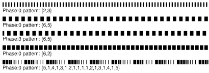

The stroke _color space_ determines how the stroke _color_ values are interpreted by Quartz. You can also specify a Quartz color (`CGColorRef` data type) that encapsulates both color and color space. For more information on setting color space and color, see [Color and Color Spaces](Color%20and%20Color%20Spaces.md#apple-f4xwc4dqnrsv64tfmyxwi33df52wszbpkridgmbqgaytanrwfvbuqmrqguwviucykjcummjqge).

Quartz provides the functions shown in Table 3-4 for stroking the current path. Some are convenience functions for stroking rectangles or ellipses.

__Table 3-4__  Functions that stroke paths

| Function | Description |
| `CGContextStrokePath` | Strokes the current path. |
| `CGContextStrokeRect` | Strokes the specified rectangle. |
| `CGContextStrokeRectWithWidth` | Strokes the specified rectangle, using the specified line width. |
| `CGContextStrokeEllipseInRect` | Strokes an ellipse that fits inside the specified rectangle. |
| `CGContextStrokeLineSegments` | Strokes a sequence of lines. |
| `CGContextDrawPath` | If you pass the constant `kCGPathStroke`, strokes the current path. See [Filling a Path](#apple-f4xwc4dqnrsv64tfmyxwi33df52wszbpkridgmbqgaytanrwfvbuqmrrgewviucykjcummjqgy) if you want to both fill and stroke a path. |

The function `CGContextStrokeLineSegments` is equivalent to the following code:

```
CGContextBeginPath (context);
for (k = 0; k < count; k += 2) {
    CGContextMoveToPoint(context, s[k].x, s[k].y);
    CGContextAddLineToPoint(context, s[k+1].x, s[k+1].y);
}
CGContextStrokePath(context);
```

When you call `CGContextStrokeLineSegments`, you specify the line segments as an array of points, organized as pairs. Each pair consists of the starting point of a line segment followed by the ending point of a line segment. For example, the first point in the array specifies the starting position of the first line, the second point specifies the ending position of the first line, the third point specifies the starting position of the second line, and so forth.

When you fill the current path, Quartz acts as if each subpath contained in the path were closed. It then uses these closed subpaths and calculates the pixels to fill. There are two ways Quartz can calculate the fill area. Simple paths such as ovals and rectangles have a well-defined area. But if your path is composed of overlapping segments or if the path includes multiple subpaths, such as the concentric circles shown in Figure 3-12, there are two rules you can use to determine the fill area.

The default fill rule is called the _nonzero winding number rule_. To determine whether a specific point should be painted, start at the point and draw a line beyond the bounds of the drawing. Starting with a count of 0, add 1 to the count every time a path segment crosses the line from left to right, and subtract 1 every time a path segment crosses the line from right to left. If the result is 0, the point is not painted. Otherwise, the point is painted. The direction that the path segments are drawn affects the outcome. [Figure 3-12](#apple-f4xwc4dqnrsv64tfmyxwi33df52wszbpkridgmbqgaytanrwfvbuqmrrgewueqsdivceqrsd) shows two sets of inner and outer circles that are filled using the nonzero winding number rule. When each circle is drawn in the same direction, both circles are filled. When the circles are drawn in opposite directions, the inner circle is not filled.

You can opt to use the _even-odd rule_. To determine whether a specific point should be painted, start at the point and draw a line beyond the bounds of the drawing. Count the number of path segments that the line crosses. If the result is odd, the point is painted. If the result is even, the point is not painted. The direction that the path segments are drawn doesn’t affect the outcome. As you can see in Figure 3-12, it doesn’t matter which direction each circle is drawn, the fill will always be as shown.

__Figure 3-12__  Concentric circles filled using different fill rules

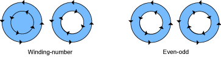

Quartz provides the functions shown in Table 3-5 for filling the current path. Some are convenience functions for stroking rectangles or ellipses.

__Table 3-5__  Functions that fill paths

| Function | Description |
| `CGContextEOFillPath` | Fills the current path using the even-odd rule. |
| `CGContextFillPath` | Fills the current path using the nonzero winding number rule. |
| `CGContextFillRect` | Fills the area that fits inside the specified rectangle. |
| `CGContextFillRects` | Fills the areas that fits inside the specified rectangles. |
| `CGContextFillEllipseInRect` | Fills an ellipse that fits inside the specified rectangle. |
| `CGContextDrawPath` | Fills the current path if you pass `kCGPathFill` (nonzero winding number rule) or `kCGPathEOFill` (even-odd rule). Fills and strokes the current path if you pass `kCGPathFillStroke` or `kCGPathEOFillStroke`. |

_Blend modes_ specify how Quartz applies paint over a background. Quartz uses normal blend mode by default, which combines the foreground painting with the background painting using the following formula:

`result = (alpha * foreground) + (1 - alpha) * background`

[Color and Color Spaces](Color%20and%20Color%20Spaces.md#apple-f4xwc4dqnrsv64tfmyxwi33df52wszbpkridgmbqgaytanrwfvbuqmrqguwviucykjcummjqge) provides a detailed discussion of the alpha component of a color, which specifies the opacity of a color. For the examples in this section, you can assume a color is completely opaque (alpha value = 1.0). For opaque colors, when you paint using normal blend mode, anything you paint over the background completely obscures the background.

You can set the blend mode to achieve a variety of effects by calling the function `CGContextSetBlendMode`, passing the appropriate blend mode constant. Keep in mind that the blend mode is part of the graphics state. If you use the function `CGContextSaveGState` prior to changing the blend mode, then calling the function `CGContextRestoreGState` resets the blend mode to normal.

The rest of this section show the results of painting the rectangles shown in Figure 3-13 over the rectangles shown in Figure 3-14. In each case (Figure 3-15 through Figure 3-30), the background rectangles are painted using normal blend mode. Then the blend mode is changed by calling the function `CGContextSetBlendMode` with the appropriate constant. Finally, the foreground rectangles are painted.

__Figure 3-13__  The rectangles painted in the foreground

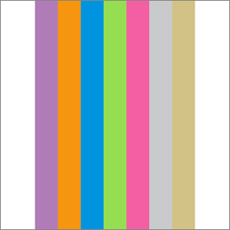

__Figure 3-14__  The rectangles painted in the background

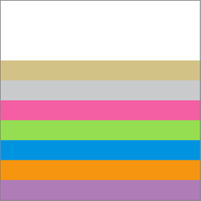

Because normal blend mode is the default blend mode, you call the function `CGContextSetBlendMode` with the constant `kCGBlendModeNormal` only to reset the blend mode back to the default after you’ve used one of the other blend mode constants. Figure 3-15 shows the result of painting [Figure 3-13](#apple-f4xwc4dqnrsv64tfmyxwi33df52wszbpkridgmbqgaytanrwfvbuqmrrgewueq2jijbeqq2j) over [Figure 3-14](#apple-f4xwc4dqnrsv64tfmyxwi33df52wszbpkridgmbqgaytanrwfvbuqmrrgewueq2jirbuorkj) using normal blend mode.

__Figure 3-15__  Rectangles painted using normal blend mode

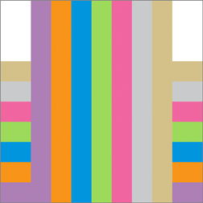

Multiply blend mode specifies to multiply the foreground image samples with the background image samples. The resulting colors are at least as dark as either of the two contributing sample colors. Figure 3-16 shows the result of painting [Figure 3-13](#apple-f4xwc4dqnrsv64tfmyxwi33df52wszbpkridgmbqgaytanrwfvbuqmrrgewueq2jijbeqq2j) over [Figure 3-14](#apple-f4xwc4dqnrsv64tfmyxwi33df52wszbpkridgmbqgaytanrwfvbuqmrrgewueq2jirbuorkj) using multiply blend mode. To use this blend mode, call the function `CGContextSetBlendMode` with the constant `kCGBlendModeMultiply`.

__Figure 3-16__  Rectangles painted using multiply blend mode

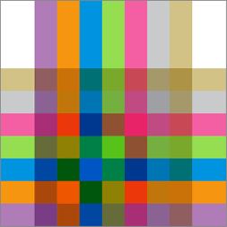

Screen blend mode specifies to multiply the inverse of the foreground image samples with the inverse of the background image samples. The resulting colors are at least as light as either of the two contributing sample colors. Figure 3-17 shows the result of painting [Figure 3-13](#apple-f4xwc4dqnrsv64tfmyxwi33df52wszbpkridgmbqgaytanrwfvbuqmrrgewueq2jijbeqq2j) over [Figure 3-14](#apple-f4xwc4dqnrsv64tfmyxwi33df52wszbpkridgmbqgaytanrwfvbuqmrrgewueq2jirbuorkj) using screen blend mode. To use this blend mode, call the function `CGContextSetBlendMode` with the constant `kCGBlendModeScreen`.

__Figure 3-17__  Rectangles painted using screen blend mode

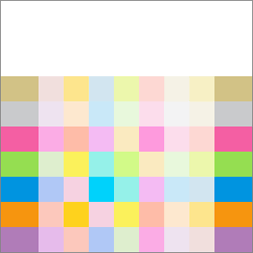

Overlay blend mode specifies to either multiply or screen the foreground image samples with the background image samples, depending on the background color. The background color mixes with the foreground color to reflect the lightness or darkness of the background. Figure 3-18 shows the result of painting [Figure 3-13](#apple-f4xwc4dqnrsv64tfmyxwi33df52wszbpkridgmbqgaytanrwfvbuqmrrgewueq2jijbeqq2j) over [Figure 3-14](#apple-f4xwc4dqnrsv64tfmyxwi33df52wszbpkridgmbqgaytanrwfvbuqmrrgewueq2jirbuorkj) using overlay blend mode. To use this blend mode, call the function `CGContextSetBlendMode` with the constant `kCGBlendModeOverlay`.

__Figure 3-18__  Rectangles painted using overlay blend mode

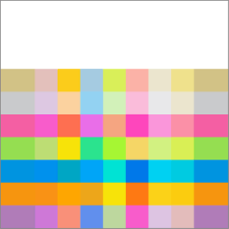

Specifies to create the composite image samples by choosing the darker samples (either from the foreground image or the background). The background image samples are replaced by any foreground image samples that are darker. Otherwise, the background image samples are left unchanged. Figure 3-19 shows the result of painting [Figure 3-13](#apple-f4xwc4dqnrsv64tfmyxwi33df52wszbpkridgmbqgaytanrwfvbuqmrrgewueq2jijbeqq2j) over [Figure 3-14](#apple-f4xwc4dqnrsv64tfmyxwi33df52wszbpkridgmbqgaytanrwfvbuqmrrgewueq2jirbuorkj) using darken blend mode. To use this blend mode, call the function `CGContextSetBlendMode` with the constant `kCGBlendModeDarken`.

__Figure 3-19__  Rectangles painted using darken blend mode

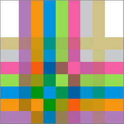

Specifies to create the composite image samples by choosing the lighter samples (either from the foreground or the background). The result is that the background image samples are replaced by any foreground image samples that are lighter. Otherwise, the background image samples are left unchanged. Figure 3-20 shows the result of painting [Figure 3-13](#apple-f4xwc4dqnrsv64tfmyxwi33df52wszbpkridgmbqgaytanrwfvbuqmrrgewueq2jijbeqq2j) over [Figure 3-14](#apple-f4xwc4dqnrsv64tfmyxwi33df52wszbpkridgmbqgaytanrwfvbuqmrrgewueq2jirbuorkj) using lighten blend mode. To use this blend mode, call the function `CGContextSetBlendMode` with the constant `kCGBlendModeLighten`.

__Figure 3-20__  Rectangles painted using lighten blend mode

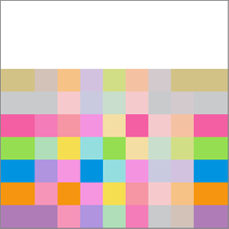

Specifies to brighten the background image samples to reflect the foreground image samples. Foreground image sample values that specify black do not produce a change. Figure 3-21 shows the result of painting [Figure 3-13](#apple-f4xwc4dqnrsv64tfmyxwi33df52wszbpkridgmbqgaytanrwfvbuqmrrgewueq2jijbeqq2j) over [Figure 3-14](#apple-f4xwc4dqnrsv64tfmyxwi33df52wszbpkridgmbqgaytanrwfvbuqmrrgewueq2jirbuorkj) using color dodge blend mode. To use this blend mode, call the function `CGContextSetBlendMode` with the constant `kCGBlendModeColorDodge`.

__Figure 3-21__  Rectangles painted using color dodge blend mode

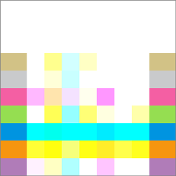

Specifies to darken the background image samples to reflect the foreground image samples. Foreground image sample values that specify white do not produce a change. Figure 3-22 shows the result of painting [Figure 3-13](#apple-f4xwc4dqnrsv64tfmyxwi33df52wszbpkridgmbqgaytanrwfvbuqmrrgewueq2jijbeqq2j) over [Figure 3-14](#apple-f4xwc4dqnrsv64tfmyxwi33df52wszbpkridgmbqgaytanrwfvbuqmrrgewueq2jirbuorkj) using color burn blend mode. To use this blend mode, call the function `CGContextSetBlendMode` with the constant `kCGBlendModeColorBurn`.

__Figure 3-22__  Rectangles painted using color burn blend mode

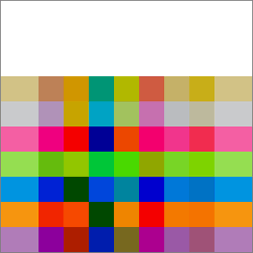

Specifies to either darken or lighten colors, depending on the foreground image sample color. If the foreground image sample color is lighter than 50% gray, the background is lightened, similar to dodging. If the foreground image sample color is darker than 50% gray, the background is darkened, similar to burning. If the foreground image sample color is equal to 50% gray, the background is not changed. Image samples that are equal to pure black or pure white produce darker or lighter areas, but do not result in pure black or white. The overall effect is similar to what you’d achieve by shining a diffuse spotlight on the foreground image. Use this to add highlights to a scene. Figure 3-23 shows the result of painting [Figure 3-13](#apple-f4xwc4dqnrsv64tfmyxwi33df52wszbpkridgmbqgaytanrwfvbuqmrrgewueq2jijbeqq2j) over [Figure 3-14](#apple-f4xwc4dqnrsv64tfmyxwi33df52wszbpkridgmbqgaytanrwfvbuqmrrgewueq2jirbuorkj) using soft light blend mode. To use this blend mode, call the function `CGContextSetBlendMode` with the constant `kCGBlendModeSoftLight`.

__Figure 3-23__  Rectangles painted using soft light blend mode

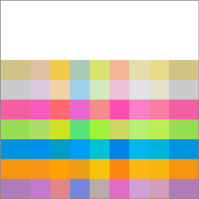

Specifies to either multiply or screen colors, depending on the foreground image sample color. If the foreground image sample color is lighter than 50% gray, the background is lightened, similar to screening. If the foreground image sample color is darker than 50% gray, the background is darkened, similar to multiplying. If the foreground image sample color is equal to 50% gray, the foreground image is not changed. Image samples that are equal to pure black or pure white result in pure black or white. The overall effect is similar to what you’d achieve by shining a harsh spotlight on the foreground image. Use this to add highlights to a scene. Figure 3-24 shows the result of painting [Figure 3-13](#apple-f4xwc4dqnrsv64tfmyxwi33df52wszbpkridgmbqgaytanrwfvbuqmrrgewueq2jijbeqq2j) over [Figure 3-14](#apple-f4xwc4dqnrsv64tfmyxwi33df52wszbpkridgmbqgaytanrwfvbuqmrrgewueq2jirbuorkj) using hard light blend mode. To use this blend mode, call the function `CGContextSetBlendMode` with the constant `kCGBlendModeHardLight`.

__Figure 3-24__  Rectangles painted using hard light blend mode

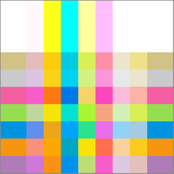

Specifies to subtract either the foreground image sample color from the background image sample color, or the reverse, depending on which sample has the greater brightness value. Foreground image sample values that are black produce no change; white inverts the background color values. Figure 3-25 shows the result of painting [Figure 3-13](#apple-f4xwc4dqnrsv64tfmyxwi33df52wszbpkridgmbqgaytanrwfvbuqmrrgewueq2jijbeqq2j) over [Figure 3-14](#apple-f4xwc4dqnrsv64tfmyxwi33df52wszbpkridgmbqgaytanrwfvbuqmrrgewueq2jirbuorkj) using difference blend mode. To use this blend mode, call the function `CGContextSetBlendMode` with the constant `kCGBlendModeDifference`.

__Figure 3-25__  Rectangles painted using difference blend mode

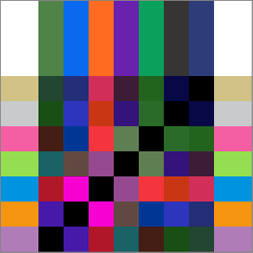

Specifies an effect similar to that produced by `kCGBlendModeDifference`, but with lower contrast. Foreground image sample values that are black don’t produce a change; white inverts the background color values. Figure 3-26 shows the result of painting [Figure 3-13](#apple-f4xwc4dqnrsv64tfmyxwi33df52wszbpkridgmbqgaytanrwfvbuqmrrgewueq2jijbeqq2j) over [Figure 3-14](#apple-f4xwc4dqnrsv64tfmyxwi33df52wszbpkridgmbqgaytanrwfvbuqmrrgewueq2jirbuorkj) using exclusion blend mode. To use this blend mode, call the function `CGContextSetBlendMode` with the constant `kCGBlendModeExclusion`.

__Figure 3-26__  Rectangles painted using exclusion blend mode

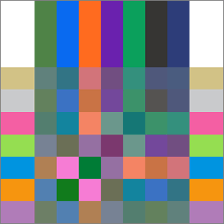

Specifies to use the luminance and saturation values of the background with the hue of the foreground image. Figure 3-27 shows the result of painting [Figure 3-13](#apple-f4xwc4dqnrsv64tfmyxwi33df52wszbpkridgmbqgaytanrwfvbuqmrrgewueq2jijbeqq2j) over [Figure 3-14](#apple-f4xwc4dqnrsv64tfmyxwi33df52wszbpkridgmbqgaytanrwfvbuqmrrgewueq2jirbuorkj) using hue blend mode. To use this blend mode, call the function `CGContextSetBlendMode` with the constant `kCGBlendModeHue`.

__Figure 3-27__  Rectangles painted using hue blend mode

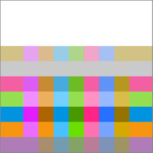

Specifies to use the luminance and hue values of the background with the saturation of the foreground image. Areas of the background that have no saturation (that is, pure gray areas) don’t produce a change. Figure 3-28 shows the result of painting [Figure 3-13](#apple-f4xwc4dqnrsv64tfmyxwi33df52wszbpkridgmbqgaytanrwfvbuqmrrgewueq2jijbeqq2j) over [Figure 3-14](#apple-f4xwc4dqnrsv64tfmyxwi33df52wszbpkridgmbqgaytanrwfvbuqmrrgewueq2jirbuorkj) using saturation blend mode. To use this blend mode, call the function `CGContextSetBlendMode` with the constant `kCGBlendModeSaturation`.

__Figure 3-28__  Rectangles painted using saturation blend mode

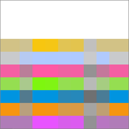

Specifies to use the luminance values of the background with the hue and saturation values of the foreground image. This mode preserves the gray levels in the image. You can use this mode to color monochrome images or to tint color images. Figure 3-29 shows the result of painting [Figure 3-13](#apple-f4xwc4dqnrsv64tfmyxwi33df52wszbpkridgmbqgaytanrwfvbuqmrrgewueq2jijbeqq2j) over [Figure 3-14](#apple-f4xwc4dqnrsv64tfmyxwi33df52wszbpkridgmbqgaytanrwfvbuqmrrgewueq2jirbuorkj) using color blend mode. To use this blend mode, call the function `CGContextSetBlendMode` with the constant `kCGBlendModeColor`.

__Figure 3-29__  Rectangles painted using color blend mode

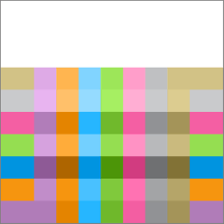

Specifies to use the hue and saturation of the background with the luminance of the foreground image. This mode creates an effect that is inverse to the effect created by `kCGBlendModeColor`. Figure 3-30 shows the result of painting [Figure 3-13](#apple-f4xwc4dqnrsv64tfmyxwi33df52wszbpkridgmbqgaytanrwfvbuqmrrgewueq2jijbeqq2j) over [Figure 3-14](#apple-f4xwc4dqnrsv64tfmyxwi33df52wszbpkridgmbqgaytanrwfvbuqmrrgewueq2jirbuorkj) using luminosity blend mode. To use this blend mode, call the function `CGContextSetBlendMode` with the constant `kCGBlendModeLuminosity`.

__Figure 3-30__  Rectangles painted using luminosity blend mode

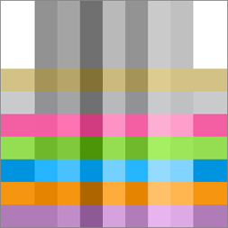

The _current clipping area_ is created from a path that serves as a mask, allowing you to block out the part of the page that you don’t want to paint. For example, if you have a very large bitmap image and want to show only a small portion of it, you could set the clipping area to display only the portion you want to show.

When you paint, Quartz renders paint only within the clipping area. Drawing that occurs inside the closed subpaths of the clipping area is visible; drawing that occurs outside the closed subpaths of the clipping area is not.

When the graphics context is initially created, the clipping area includes all of the paintable area of the context (for example, the media box of a PDF context). You alter the clipping area by setting the current path and then using a clipping function instead of a drawing function. The clipping function intersects the filled area of the current path with the existing clipping area. Thus, you can intersect the clipping area, shrinking the visible area of the picture, but you cannot increase the area of the clipping area.

The clipping area is part of the graphics state. To restore the clipping area to a previous state, you can save the graphics state before you clip, and restore the graphics state after you’re done with clipped drawing.

Listing 3-1 shows a code fragment that sets up a clipping area in the shape of a circle. This code causes drawing to be clipped, similar to what’s shown in [Figure 3-3](#apple-f4xwc4dqnrsv64tfmyxwi33df52wszbpkridgmbqgaytanrwfvbuqmrrgewugsscjbbeer2j). (For another example, see [Clip the Context](Gradients.md#apple-f4xwc4dqnrsv64tfmyxwi33df52wszbpkridgmbqgaytanrwfvbuqmrqg4wueqsdijbuuqkf) in the chapter [Gradients](Gradients.md#apple-f4xwc4dqnrsv64tfmyxwi33df52wszbpkridgmbqgaytanrwfvbuqmrqg4wviucykjcummjqge).)

__Listing 3-1__  Setting up a circular clip area

```
CGContextBeginPath (context);
CGContextAddArc (context, w/2, h/2, ((w>h) ? h : w)/2, 0, 2*PI, 0);
CGContextClosePath (context);
CGContextClip (context);
```


__Table 3-6__  Functions that clip the graphics context

| Function | Description |
| `CGContextClip` | Uses the nonzero winding number rule to calculate the intersection of the current path with the current clipping path. |
| `CGContextEOClip` | Uses the even-odd rule to calculate the intersection of the current path with the current clipping path. |
| `CGContextClipToRect` | Sets the clipping area to the area that intersects both the current clipping path and the specified rectangle. |
| `CGContextClipToRects` | Sets the clipping area to the area that intersects both the current clipping path and region within the specified rectangles. |
| `CGContextClipToMask` | Maps a mask into the specified rectangle and intersects it with the current clipping area of the graphics context. Any subsequent path drawing you perform to the graphics context is clipped. (See [Masking an Image by Clipping the Context](Bitmap%20Images%20and%20Image%20Masks.md#apple-f4xwc4dqnrsv64tfmyxwi33df52wszbpkridgmbqgaytanrwfvbuqmrrgiwugsscjbceiqsf).) |

[Next](Color%20and%20Color%20Spaces.md)[Previous](Graphics%20Contexts.md)

