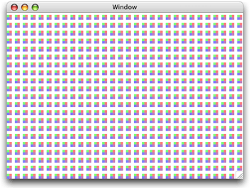
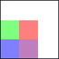
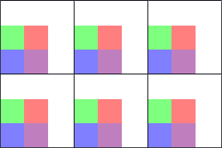
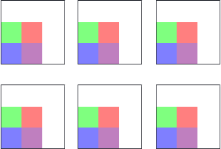
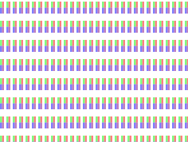
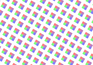
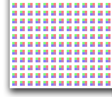
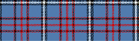
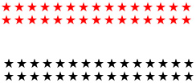

> 导航：[总目录](../../../README.md) · [documentation](../../../_indexes/documentation.md) · [Quartz 2D Programming Guide](Introduction.md)


[Next](Shadows.md)[Previous](Transforms.md)

# Patterns

A _pattern_ is a sequence of drawing operations that is repeatedly painted to a graphics context. You can use patterns in the same way as you use colors. When you paint using a pattern, Quartz divides the page into a set of pattern cells, with each cell the size of the pattern image, and draws each cell using a callback you provide. Figure 6-1 shows a pattern drawn to a window graphics context.

__Figure 6-1__  A pattern drawn to a window



The pattern cell is the basic component of a pattern. The pattern cell for the pattern shown in [Figure 6-1](#apple-f4xwc4dqnrsv64tfmyxwi33df52wszbpkridgmbqgaytanrwfvbuqmrqgywueqsdijeecskb) is shown in Figure 6-2. The black rectangle is not part of the pattern; it’s drawn to show where the pattern cell ends.

__Figure 6-2__  A pattern cell



The size of this particular pattern cell includes the area of the four colored rectangles and space above and to the right of the rectangles, as shown in Figure 6-3. The black rectangle surrounding each pattern cell in the figure is not part of the cell; it’s drawn to indicate the _bounds_ of the cell. When you create a pattern cell, you define the bounds of the cell and draw within the bounds.

__Figure 6-3__  Pattern cells with black rectangles drawn to show the bounds of each cell



You can specify how far apart Quartz draws the start of each pattern cell from the next in the horizontal and vertical directions. The pattern cells in Figure 6-3 are drawn so that the start of one pattern cell is exactly a pattern width apart from the next pattern cell, resulting in each pattern cell abutting on the next. The pattern cells in Figure 6-4 have space added in both directions, horizontal and vertical. You can specify different _spacing values_ for each direction. If you make the spacing less than the width or height of a pattern cell, the pattern cells overlap.

__Figure 6-4__  Spacing between pattern cells



When you draw a pattern cell, Quartz uses _pattern space_ as the coordinate system. Pattern space is an abstract space that maps to the default user space by the transformation matrix you specify when you create the pattern—the _pattern matrix_.

If you don’t want Quartz to transform the pattern cell, you can specify the identity matrix. However, you can achieve interesting effects by supplying a transformation matrix. Figure 6-5 shows the effect of scaling the pattern cell shown in Figure 6-2. Figure 6-6 demonstrates rotating the pattern cell. Translating the pattern cell is a bit more subtle. Figure 6-7 shows the origin of the pattern, with the pattern cell translated in both directions, horizontal and vertical, so that the pattern no longer abuts the window as it does in [Figure 6-1](#apple-f4xwc4dqnrsv64tfmyxwi33df52wszbpkridgmbqgaytanrwfvbuqmrqgywueqsdijeecskb).

__Figure 6-5__  A scaled pattern cell



__Figure 6-6__  A rotated pattern cell



__Figure 6-7__  A translated pattern cell



_Colored patterns_ have inherent colors associated with them. Change the coloring used to create the pattern cell, and the pattern loses its meaning. A Scottish tartan (such as the sample one shown in Figure 6-8) is an example of a colored pattern. The color in a colored pattern is specified as part of the pattern cell creation process, not as part of the pattern drawing process.

__Figure 6-8__  A colored pattern has inherent color



Other patterns are defined solely on their shape and, for that reason, can be thought of as _stencil patterns_, uncolored patterns, or even as an image mask. The red and black stars shown in Figure 6-9 are each renditions of the same pattern cell. The cell itself consists of one shape—a filled star. When the pattern cell was defined, no color was associated with it. The color is specified as part of the pattern drawing process, not as part of the pattern cell creation.

__Figure 6-9__  A stencil pattern does not have inherent color



You can create either kind of pattern—colored or stencil—in Quartz 2D.

_Tiling_ is the process of rendering pattern cells to a portion of a page. When Quartz renders a pattern to a device, Quartz may need to adjust the pattern to fit the device space. That is, the pattern cell as defined in user space might not fit perfectly when rendered to the device because of differences between user space units and device pixels.

Quartz has three tiling options it can use to adjust patterns when necessary. Quartz can preserve:

- The pattern, at the expense of adjusting the spacing between pattern cells slightly, but by no more than one device pixel. This is referred to as _no distortion_.
- Spacing between cells, at the expense of distorting the pattern cell slightly, but by no more than one device pixel. This is referred to as _constant spacing with minimal distortion_.
- Spacing between cells (as for the minimal distortion option) at the expense of distorting the pattern cell as much as needed to get fast tiling. This is referred to as _constant spacing_.

Patterns operate similarly to colors, in that you set a fill or stroke pattern and then call a painting function. Quartz uses the pattern you set as the “paint.” For example, if you want to paint a filled rectangle with a solid color, you first call a function, such as `CGContextSetFillColor`, to set the fill color. Then you call the function `CGContextFillRect` to paint the filled rectangle with the color you specify. To paint with a pattern, you first call the function `CGContextSetFillPattern` to set the pattern. Then you call `CGContextFillRect` to actually paint the filled rectangle with the pattern you specify. The difference between painting with colors and with patterns is that you must define the pattern. You supply the pattern and color information to the function `CGContextSetFillPattern`. You’ll see how to create, set, and paint patterns in [Painting Colored Patterns](#apple-f4xwc4dqnrsv64tfmyxwi33df52wszbpkridgmbqgaytanrwfvbuqmrqgywviucykjcummjrg4) and [Painting Stencil Patterns](#apple-f4xwc4dqnrsv64tfmyxwi33df52wszbpkridgmbqgaytanrwfvbuqmrqgywueqsdjjauurkd).

Here’s an example of how Quartz works behind the scenes to paint with a pattern you provide. When you fill or stroke with a pattern, Quartz conceptually performs the following tasks to draw each pattern cell:

1. Saves the graphics state.
2. Translates the current transformation matrix to the origin of the pattern cell.
3. Concatenates the CTM with the pattern matrix.
4. Clips to the bounding rectangle of the pattern cell.
5. Calls your drawing callback to draw the pattern cell.
6. Restores the graphics state.

Quartz takes care of all the tiling for you, repeatedly rendering the pattern cell to the drawing space until the entire space is painted. You can fill or stroke with a pattern. The pattern cell can be of any size you specify. If you want to see the pattern, you should make sure the pattern cell fits in the drawing space. For example, if your pattern cell is 8 units by 10 units, and you use the pattern to stroke a line that has a width of 2 units, the pattern cell will be clipped since it is 10 units wide. In this case, you might not recognize the pattern.

The five steps you need to perform to paint a colored pattern are described in the following sections:

1. [Write a Callback Function That Draws a Colored Pattern Cell](#apple-f4xwc4dqnrsv64tfmyxwi33df52wszbpkridgmbqgaytanrwfvbuqmrqgywueqsdiveegrse)
2. [Set Up the Colored Pattern Color Space](#apple-f4xwc4dqnrsv64tfmyxwi33df52wszbpkridgmbqgaytanrwfvbuqmrqgywueqsdivcuurkb)
3. [Set Up the Anatomy of the Colored Pattern](#apple-f4xwc4dqnrsv64tfmyxwi33df52wszbpkridgmbqgaytanrwfvbuqmrqgywueqsdijdekr2e)
4. [Specify the Colored Pattern as a Fill or Stroke Pattern](#apple-f4xwc4dqnrsv64tfmyxwi33df52wszbpkridgmbqgaytanrwfvbuqmrqgywueqsdircugrck)
5. [Draw With the Colored Pattern](#apple-f4xwc4dqnrsv64tfmyxwi33df52wszbpkridgmbqgaytanrwfvbuqmrqgywueqsdineumske)

These are the same steps you use to paint a stencil pattern. The difference between the two is how you set up color information. You can see how all the steps fit together in [A Complete Colored Pattern Painting Function](#apple-f4xwc4dqnrsv64tfmyxwi33df52wszbpkridgmbqgaytanrwfvbuqmrqgywueqsdi5eeoqkh).

What a pattern cell looks like is entirely up to you. For this example, the code in [Listing 6-1](#apple-f4xwc4dqnrsv64tfmyxwi33df52wszbpkridgmbqgaytanrwfvbuqmrqgywueqsdivduosci) draws the pattern cell shown in [Figure 6-2](#apple-f4xwc4dqnrsv64tfmyxwi33df52wszbpkridgmbqgaytanrwfvbuqmrqgywueqsdizcucssk). Recall that the black line surrounding the pattern cell is not part of the cell; it’s drawn to show that the bounds of the pattern cell are larger than the rectangles painted by the code. You specify the pattern size to Quartz later.

Your pattern cell drawing function is a callback that follows this form:

```
typedef void (*CGPatternDrawPatternCallback) (
                        void *info,
                        CGContextRef context
    );
```

You can name your callback whatever you like. The one in Listing 6-1 is named `MyDrawColoredPattern`. The callback takes two parameters:

- `info`, a generic pointer to private data associated with the pattern. This parameter is optional; you can pass `NULL`. The data passed to your callback is the same data you supply later, when you create the pattern.
- `context`, the graphics context for drawing the pattern cell.

The pattern cell drawn by the code in Listing 6-1 is arbitrary. Your code draws whatever is appropriate for the pattern you create. These details about the code are important:

- The pattern size is declared. You need to keep the pattern size in mind as you write your drawing code. Here, the size is declared as a global. The drawing function doesn’t specifically refer to the size, except in a comment. Later, you specify the pattern size to Quartz 2D. See [Set Up the Anatomy of the Colored Pattern](#apple-f4xwc4dqnrsv64tfmyxwi33df52wszbpkridgmbqgaytanrwfvbuqmrqgywueqsdijdekr2e).
- The drawing function follows the prototype defined by the `CGPatternDrawPatternCallback` callback type definition.
- The drawing performed in the code sets colors, which makes this a colored pattern.

__Listing 6-1__  A drawing callback that draws a colored pattern cell

```
#define H_PATTERN_SIZE 16
#define V_PATTERN_SIZE 18

void MyDrawColoredPattern (void *info, CGContextRef myContext)
{
    CGFloat subunit = 5; // the pattern cell itself is 16 by 18

    CGRect  myRect1 = {{0,0}, {subunit, subunit}},
            myRect2 = {{subunit, subunit}, {subunit, subunit}},
            myRect3 = {{0,subunit}, {subunit, subunit}},
            myRect4 = {{subunit,0}, {subunit, subunit}};

    CGContextSetRGBFillColor (myContext, 0, 0, 1, 0.5);
    CGContextFillRect (myContext, myRect1);
    CGContextSetRGBFillColor (myContext, 1, 0, 0, 0.5);
    CGContextFillRect (myContext, myRect2);
    CGContextSetRGBFillColor (myContext, 0, 1, 0, 0.5);
    CGContextFillRect (myContext, myRect3);
    CGContextSetRGBFillColor (myContext, .5, 0, .5, 0.5);
    CGContextFillRect (myContext, myRect4);
}
```


The code in [Listing 6-1](#apple-f4xwc4dqnrsv64tfmyxwi33df52wszbpkridgmbqgaytanrwfvbuqmrqgywueqsdivduosci) uses colors to draw the pattern cell. You must ensure that Quartz paints with the colors you use in your drawing routine by setting the base pattern color space to `NULL`, as shown in Listing 6-2. A detailed explanation for each numbered line of code follows the listing.

__Listing 6-2__  Creating a base pattern color space

```
CGColorSpaceRef patternSpace;

patternSpace = CGColorSpaceCreatePattern (NULL);// 1
CGContextSetFillColorSpace (myContext, patternSpace);// 2
CGColorSpaceRelease (patternSpace);// 3
```

Here’s what the code does:

1. Creates a pattern color space appropriate for a colored pattern by calling the function `CGColorSpaceCreatePattern`, passing `NULL` as the base color space.
2. Sets the fill color space to the pattern color space. If you are stroking your pattern, call `CGContextSetStrokeColorSpace`.
3. Releases the pattern color space.

Information about the anatomy of a pattern is kept in a CGPattern object. You create a CGPattern object by calling the function `CGPatternCreate`, whose prototype is shown in Listing 6-3.

__Listing 6-3__  The CGPatternCreate function prototype

```
CGPatternRef CGPatternCreate (  void *info,
                                CGRect bounds,
                                CGAffineTransform matrix,
                                CGFloat xStep,
                                CGFloat yStep,
                                CGPatternTiling tiling,
                                bool isColored,
                                const CGPatternCallbacks *callbacks );
```

The `info` parameter is a pointer to data you want to pass to your drawing callback. This is the same pointer discussed in [Write a Callback Function That Draws a Colored Pattern Cell](#apple-f4xwc4dqnrsv64tfmyxwi33df52wszbpkridgmbqgaytanrwfvbuqmrqgywueqsdiveegrse).

You specify the size of the pattern cell in the `bounds` parameter. The `matrix` parameter is where you specify the pattern matrix, which maps the pattern coordinate system to the default coordinate system of the graphics context. Use the identity matrix if you want to draw the pattern using the same coordinate system as the graphics context. The `xStep` and `yStep` parameters specify the horizontal and vertical spacing between cells in the pattern coordinate system. See [The Anatomy of a Pattern](#apple-f4xwc4dqnrsv64tfmyxwi33df52wszbpkridgmbqgaytanrwfvbuqmrqgywueqsdjfauuq2i) to review information on bounds, pattern matrix, and spacing.

The `tiling` parameter can be one of three values:

- `kCGPatternTilingNoDistortion`
- `kCGPatternTilingConstantSpacingMinimalDistortion`
- `kCGPatternTilingConstantSpacing`

See [Tiling](#apple-f4xwc4dqnrsv64tfmyxwi33df52wszbpkridgmbqgaytanrwfvbuqmrqgywueqsdireegrki) to review information on tiling.

The `isColored` parameter specifies whether the pattern cell is a colored pattern (`true`) or a stencil pattern (`false`). If you pass `true` here, your drawing pattern callback specifies the pattern color, and you must set the pattern color space to the colored pattern color space (see [Set Up the Colored Pattern Color Space](#apple-f4xwc4dqnrsv64tfmyxwi33df52wszbpkridgmbqgaytanrwfvbuqmrqgywueqsdivcuurkb)).

The last parameter you pass to the function `CGPatternCreate` is a pointer to a `CGPatternCallbacks` data structure. This structure has three fields:

```
struct CGPatternCallbacks
{
    unsigned int version;
    CGPatternDrawPatternCallback drawPattern;
    CGPatternReleaseInfoCallback releaseInfo;
};
```

You set the `version` field to `0`. The `drawPattern` field is a pointer to your drawing callback. The `releaseInfo` field is a pointer to a callback that’s invoked when the CGPattern object is released, to release storage for the `info` parameter you passed to your drawing callback. If you didn’t pass any data in this parameter, you set this field to `NULL`.

You can use your pattern for filling or stroking by calling the appropriate function—`CGContextSetFillPattern` or `CGContextSetStrokePattern`. Quartz uses your pattern for any subsequent filling or stroking.

These functions each take three parameters:

- The graphics context
- The CGPattern object that you created previously
- An array of color components

Although colored patterns supply their own color, you must pass a single alpha value to inform Quartz of the overall opacity of the pattern when it’s drawn. Alpha can vary from 1 (completely opaque) to 0 (completely transparent). These lines of code show an example of how to set opacity for a colored pattern used to fill.


```
CGFloat alpha = 1;

CGContextSetFillPattern (myContext, myPattern, &alpha);
```


After you’ve completed the previous steps, you can call any Quartz 2D function that paints. Your pattern is used as the “paint.” For example, you can call `CGContextStrokePath`, `CGContextFillPath`, `CGContextFillRect`, or any other function that paints.

The code in Listing 6-4 contains a function that paints a colored pattern. The function incorporates all the steps discussed previously. A detailed explanation for each numbered line of code follows the listing.

__Listing 6-4__  A function that paints a colored pattern

```
void MyColoredPatternPainting (CGContextRef myContext,
                 CGRect rect)
{
    CGPatternRef    pattern;// 1
    CGColorSpaceRef patternSpace;// 2
    CGFloat         alpha = 1,// 3
                    width, height;// 4
    static const    CGPatternCallbacks callbacks = {0, // 5
                                        &MyDrawPattern,
                                        NULL};

    CGContextSaveGState (myContext);
    patternSpace = CGColorSpaceCreatePattern (NULL);// 6
    CGContextSetFillColorSpace (myContext, patternSpace);// 7
    CGColorSpaceRelease (patternSpace);// 8

    pattern = CGPatternCreate (NULL, // 9
                    CGRectMake (0, 0, H_PSIZE, V_PSIZE),// 10
                    CGAffineTransformMake (1, 0, 0, 1, 0, 0),// 11
                    H_PATTERN_SIZE, // 12
                    V_PATTERN_SIZE, // 13
                    kCGPatternTilingConstantSpacing,// 14
                    true, // 15
                    &callbacks);// 16

    CGContextSetFillPattern (myContext, pattern, &alpha);// 17
    CGPatternRelease (pattern);// 18
    CGContextFillRect (myContext, rect);// 19
    CGContextRestoreGState (myContext);
}
```

Here’s what the code does:

1. Declares storage for a CGPattern object that is created later.
2. Declares storage for a pattern color space that is created later.
3. Declares a variable for alpha and sets it to `1`, which specifies the opacity of the pattern as completely opaque.
4. Declares variable to hold the height and width of the window. In this example, the pattern is painted over the area of a window.
5. Declares and fills a callbacks structure, passing `0` as the version and a pointer to a drawing callback function. This example does not provide a release info callback, so that field is set to `NULL`.
6. Creates a pattern color space object, setting the pattern’s base color space to `NULL`. When you paint a colored pattern, the pattern supplies its own color in the drawing callback, which is why you set the color space to `NULL`.
7. Sets the fill color space to the pattern color space object you just created.
8. Releases the pattern color space object.
9. Passes `NULL` because the pattern does not need any additional information passed to the drawing callback.
10. Passes a CGRect object that specifies the bounds of the pattern cell.
11. Passes a CGAffineTransform matrix that specifies how to translate the pattern space to the default user space of the context in which the pattern is used. This example passes the identity matrix.
12. Passes the horizontal pattern size as the horizontal displacement between the start of each cell. In this example, one cell is painted adjacent to the next.
13. Passes the vertical pattern size as the vertical displacement between start of each cell.
14. Passes the constant `kCGPatternTilingConstantSpacing` to specify how Quartz should render the pattern. For more information, see [Tiling](#apple-f4xwc4dqnrsv64tfmyxwi33df52wszbpkridgmbqgaytanrwfvbuqmrqgywueqsdireegrki).
15. Passes `true` for the `isColored` parameter, to specify that the pattern is a colored pattern.
16. Passes a pointer to the callbacks structure that contains version information, and a pointer to your drawing callback function.
17. Sets the fill pattern, passing the context, the CGPattern object you just created, and a pointer to the alpha value that specifies an opacity for Quartz to apply to the pattern.
18. Releases the CGPattern object.
19. Fills a rectangle that is the size of the window passed to the `MyColoredPatternPainting` routine. Quartz fills the rectangle using the pattern you just set up.

The five steps you need to perform to paint a stencil pattern are described in the following sections:

1. [Write a Callback Function That Draws a Stencil Pattern Cell](#apple-f4xwc4dqnrsv64tfmyxwi33df52wszbpkridgmbqgaytanrwfvbuqmrqgywueqsdijduirsi)
2. [Set Up the Stencil Pattern Color Space](#apple-f4xwc4dqnrsv64tfmyxwi33df52wszbpkridgmbqgaytanrwfvbuqmrqgywueqsdjbbuercj)
3. [Set Up the Anatomy of the Stencil Pattern](#apple-f4xwc4dqnrsv64tfmyxwi33df52wszbpkridgmbqgaytanrwfvbuqmrqgywueqsdineuor2g)
4. [Specify the Stencil Pattern as a Fill or Stroke Pattern](#apple-f4xwc4dqnrsv64tfmyxwi33df52wszbpkridgmbqgaytanrwfvbuqmrqgywueqsdircuursi)
5. [Drawing with the Stencil Pattern](#apple-f4xwc4dqnrsv64tfmyxwi33df52wszbpkridgmbqgaytanrwfvbuqmrqgywueqsdjbceuqsf)

These are actually the same steps you use to paint a colored pattern. The difference between the two is how you set up color information. You can see how all the steps fit together in [A Complete Stencil Pattern Painting Function](#apple-f4xwc4dqnrsv64tfmyxwi33df52wszbpkridgmbqgaytanrwfvbuqmrqgywueqsdi5cemr2i).

The callback you write for drawing a stencil pattern follows the same form as that described for a colored pattern cell. See [Write a Callback Function That Draws a Colored Pattern Cell](#apple-f4xwc4dqnrsv64tfmyxwi33df52wszbpkridgmbqgaytanrwfvbuqmrqgywueqsdiveegrse). The only difference is that your drawing callback does not specify any color. The pattern cell shown in Figure 6-10 does not get its color from the drawing callback. The color is set outside the drawing color in the pattern color space.

__Figure 6-10__  A stencil pattern cell


Take a look at the code in Listing 6-5, which draws the pattern cell shown in Figure 6-10. Notice that the code simply creates a path and fills the path. The code does not set color.

__Listing 6-5__  A drawing callback that draws a stencil pattern cell

```
#define PSIZE 16    // size of the pattern cell

static void MyDrawStencilStar (void *info, CGContextRef myContext)
{
    int k;
    double r, theta;

    r = 0.8 * PSIZE / 2;
    theta = 2 * M_PI * (2.0 / 5.0); // 144 degrees

    CGContextTranslateCTM (myContext, PSIZE/2, PSIZE/2);

    CGContextMoveToPoint(myContext, 0, r);
    for (k = 1; k < 5; k++) {
        CGContextAddLineToPoint (myContext,
                    r * sin(k * theta),
                    r * cos(k * theta));
    }
    CGContextClosePath(myContext);
    CGContextFillPath(myContext);
}
```


Stencil patterns require that you set up a pattern color space for Quartz to paint with, as shown in Listing 6-6. A detailed explanation for each numbered line of code follows the listing.

__Listing 6-6__  Code that creates a pattern color space for a stencil pattern

```
CGPatternRef pattern;
CGColorSpaceRef baseSpace;
CGColorSpaceRef patternSpace;

baseSpace = CGColorSpaceCreateWithName (kCGColorSpaceGenericRGB);// 1
patternSpace = CGColorSpaceCreatePattern (baseSpace);// 2
CGContextSetFillColorSpace (myContext, patternSpace);// 3
CGColorSpaceRelease(patternSpace);// 4
CGColorSpaceRelease(baseSpace);// 5
```

Here’s what the code does:

1. This function creates a generic RGB space. Generic color spaces leave color matching to the system. For more information, see [Creating Generic Color Spaces](Color%20and%20Color%20Spaces.md#apple-f4xwc4dqnrsv64tfmyxwi33df52wszbpkridgmbqgaytanrwfvbuqmrqguwueq2jivceorsj).
2. Creates a pattern color space. The color space you supply specifies how colors are represented for the pattern. Later, when you set colors for the pattern, you must set them using the pattern color space. For this example, you will need to specify color using RGB values.
3. Sets the color space to use when filling a pattern. You can set a stroke color space by calling the function `CGContextSetStrokeColorSpace`.
4. Releases the pattern color space object.
5. Releases the base color space object.

You specify information about the anatomy of a pattern the way you would for a colored pattern—by calling the function `CGPatternCreate`. The only difference is that you pass `false` for the `isColored` parameter. See [Set Up the Anatomy of the Colored Pattern](#apple-f4xwc4dqnrsv64tfmyxwi33df52wszbpkridgmbqgaytanrwfvbuqmrqgywueqsdijdekr2e) for more information on the parameters you supply to the `CGPatternCreate` function.

You can use your pattern for filling or stroking by calling the appropriate function, `CGContextSetFillPattern` or `CGContextSetStrokePattern`. Quartz uses your pattern for any subsequent filling or stroking.

These functions each take three parameters:

- The graphics context
- The CGPattern object that you created previously
- An array of color components

A stencil pattern does not supply a color in the drawing callback, so you must pass a color to the fill or stroke functions to inform Quartz what color to use. Listing 6-7 shows an example of how to set color for a stencil pattern. The values in the color array are interpreted by Quartz in the color space you set up earlier. Because this example uses device RGB, the color array contains values for red, green, and blue components. The fourth value specifies the opacity of the color.

__Listing 6-7__  Code that sets opacity for a colored pattern

```
static const CGFloat color[4] = { 0, 1, 1, 0.5 }; //cyan, 50% transparent

CGContextSetFillPattern (myContext, myPattern, color);
```


After you’ve completed the previous steps, you can call any Quartz 2D function that paints. Your pattern is used as the “paint.” For example, you can call `CGContextStrokePath`, `CGContextFillPath`, `CGContextFillRect`, or any other function that paints.

The code in Listing 6-8 contains a function that paints a stencil pattern. The function incorporates all the steps discussed previously. A detailed explanation for each numbered line of code follows the listing.

__Listing 6-8__  A function that paints a stencil pattern

```
#define PSIZE 16

void MyStencilPatternPainting (CGContextRef myContext,
                                const Rect *windowRect)
{
    CGPatternRef pattern;
    CGColorSpaceRef baseSpace;
    CGColorSpaceRef patternSpace;
    static const CGFloat color[4] = { 0, 1, 0, 1 };// 1
    static const CGPatternCallbacks callbacks = {0, &drawStar, NULL};// 2

    baseSpace = CGColorSpaceCreateDeviceRGB ();// 3
    patternSpace = CGColorSpaceCreatePattern (baseSpace);// 4
    CGContextSetFillColorSpace (myContext, patternSpace);// 5
    CGColorSpaceRelease (patternSpace);
    CGColorSpaceRelease (baseSpace);
    pattern = CGPatternCreate(NULL, CGRectMake(0, 0, PSIZE, PSIZE),// 6
                  CGAffineTransformIdentity, PSIZE, PSIZE,
                  kCGPatternTilingConstantSpacing,
                  false, &callbacks);
    CGContextSetFillPattern (myContext, pattern, color);// 7
    CGPatternRelease (pattern);// 8
    CGContextFillRect (myContext,CGRectMake (0,0,PSIZE*20,PSIZE*20));// 9
}
```

Here’s what the code does:

1. Declares an array to hold a color value and sets the value (which will be in RGB color space) to opaque green.
2. Declares and fills a callbacks structure, passing `0` as the version and a pointer to a drawing callback function. This example does not provide a release info callback, so that field is set to `NULL`.
3. Creates an RGB device color space. If the pattern is drawn to a display, you need to supply this type of color space.
4. Creates a pattern color space object from the RGB device color space.
5. Sets the fill color space to the pattern color space object you just created.
6. Creates a pattern object. Note that the second to last parameter—the `isColored` parameter—is `false`. Stencil patterns do not supply color, so you must pass `false` for this parameter. All other parameters are similar to those passed for the colored pattern example. See [A Complete Colored Pattern Painting Function](#apple-f4xwc4dqnrsv64tfmyxwi33df52wszbpkridgmbqgaytanrwfvbuqmrqgywueqsdi5eeoqkh).
7. Sets the fill pattern, passing the color array declared previously.
8. Releases the CGPattern object.
9. Fills a rectangle. Quartz fills the rectangle using the pattern you just set up.

[Next](Shadows.md)[Previous](Transforms.md)

