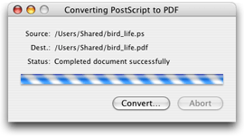

> 导航：[总目录](../../../README.md) · [documentation](../../../_indexes/documentation.md) · [Quartz 2D Programming Guide](Introduction.md)


[Next](Text.md)[Previous](PDF%20Document%20Parsing.md)

# PostScript Conversion

The Preview application automatically converts PostScript files to PDF. The Quartz 2D API provides functions you can use to perform PostScript conversion in your application. The Quartz 2D PostScript conversions functions are not available in iOS.

Follow these steps to convert a PostScript document to a PDF document:

1. Write callbacks. Quartz communicates the status of per page processes through callbacks.
2. Fill a callbacks structure.
3. Create a PostScript converter object.
4. Create a data provider object for the PostScript file you want to convert.
5. Create a data consumer object for the PDF that results from the conversion.
6. Perform the conversion.

Each of these steps is discussed in the sections that follow.

Callbacks provide a way for Quartz to inform your application of the status of the conversion. If your application has a user interface, you can use the status information to provide feedback to the user, as shown in Figure 15-1.

__Figure 15-1__  A status message for a PostScript conversion application



You can provide callbacks to inform your application that Quartz 2D is:

- Starting the conversion (`CGPSConverterBeginDocumentCallback`). Quartz 2D passes your callback a generic pointer to data you supply.
- Ending the conversion (`CGPSConverterEndDocumentCallback`). Quartz 2D passes your callback a generic pointer to data you supply and a Boolean value that indicates success (`true`) or failure (`false`).
- Starting a page (`CGPSConverterBeginPageCallback`). Quartz 2D passes your callback a generic pointer to data you supply, the page number, and a CFDictionary object, which is currently not used.
- Ending a page (`CGPSConverterEndPageCallback`). Quartz 2D passes your callback a generic pointer to data you supply and a Boolean value that indicates success (`true`) or failure (`false`)
- Progressing with the conversion (`CGPSConverterProgressCallback`). This callback is invoked periodically throughout the conversion. Quartz 2D passes your callback a generic pointer to data you supply.
- Sending a message about the process (`CGPSConverterMessageCallback`). There are several kinds of messages that can be sent during a conversion process. The most likely are font substitution messages, and any messages that the PostScript code itself generates. Any PostScript messages written to `stdout` are routed through this callback—typically these are debugging or status messages. In addition, there can be error messages if the document is malformed.

  Quartz 2D passes your callback a generic pointer to data you supply and a CFString object that contains a message about the conversion.
- Deallocating the PostScript converter object (`CGPSConverterReleaseInfoCallback`). You can use this callback to deallocate the generic pointer if you’ve provided data and to perform any additional postprocessing tasks. Quartz 2D passes your callback a generic pointer to data you supply.

See the _CGPSConverter Reference_ for the prototype each callback follows.

You need to assign a version number and the callbacks you created to the appropriate fields of the `CGPSConverterCallbacks` data structure (shown in Listing 15-1). The version is `0`. Assign `NULL` to those fields for which you do not supply a callback.

__Listing 15-1__  The PostScript converter callbacks data structure

```
struct CGPSConverterCallbacks {
   unsigned int version;
   CGPSConverterBeginDocumentCallback beginDocument;
   CGPSConverterEndDocumentCallback endDocument;
   CGPSConverterBeginPageCallback beginPage;
   CGPSConverterEndPageCallback endPage;
   CGPSConverterProgressCallback noteProgress;
   CGPSConverterMessageCallback noteMessage;
   CGPSConverterReleaseInfoCallback releaseInfo;
};
```


You call the function `CGPSConverterCreate` to create a PostScript converter object. This function takes three parameters:

- A pointer to generic data that you want passed to your callbacks. You can supply `NULL` if you don’t need to provide any data.
- A pointer to a filled-out `CGPSConverterCallbacks` data structure.
- `NULL`. This field is reserved for future use.

You create a data provider object by calling the function `CGDataProviderCreateWithURL`, supplying a CFURL object that specifies the address of the PostScript file you want to convert.

Similarly, you create a data consumer object by calling the function `CGDataConsumerCreateWithURL`, supplying a CFURL object that specifies the address of the PDF document that results from the conversion.

You call the function `CGPSConverterConvert` to perform the actual conversion from PostScript to PDF. This function takes as parameters:

- A PostScript converter object.
- A data provider object that supplies PostScript data.
- A data consumer object for the converted data.
- `NULL`. This parameter is reserved for future use.

The function returns `true` if the conversion is successful.

You can call the function `CGPSConverterIsConverting` to check whether the conversion is still progressing.

[Next](Text.md)[Previous](PDF%20Document%20Parsing.md)

