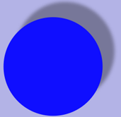
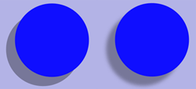
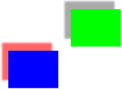

> 导航：[总目录](../../../README.md) · [documentation](../../../_indexes/documentation.md) · [Quartz 2D Programming Guide](Introduction.md)


[Next](Gradients.md)[Previous](Patterns.md)

# Shadows

A shadow is an image painted underneath, and offset from, a graphics object such that the shadow mimics the effect of a light source cast on the graphics object, as shown in Figure 7-1. Text can also be shadowed. Shadows can make an image appear three dimensional or as if it’s floating.

__Figure 7-1__  A shadow



Shadows have three characteristics:

- An x-offset, which specifies how far in the horizontal direction the shadow is offset from the image.
- A y-offset, which specifies how far in the vertical direction the shadow is offset from the image.
- A blur value, which specifies whether the image has a hard edge, as seen in the left side of Figure 7-2, or a diffuse edge, as seen in the right side of the figure.

This chapter describes how shadows work and shows how to use the Quartz 2D API to create them.

__Figure 7-2__  A shadow with no blur and another with a soft edge



Shadows in Quartz are part of the graphics state. You call the function `CGContextSetShadow`, passing a graphics context, offset values, and a blur value. After shadowing is set, any object you draw has a shadow drawn with a black color that has a 1/3 alpha value in the device RGB color space. In other words, the shadow is drawn using RGBA values set to `{0, 0, 0, 1.0/3.0}`.

You can draw colored shadows by calling the function `CGContextSetShadowWithColor`, passing a graphics context, offset values, a blur value, and a CGColor object. The values to supply for the color depend on the color space you want to draw in.

If you save the graphics state before you call `CGContextSetShadow` or `CGContextSetShadowWithColor`, you can turn off shadowing by restoring the graphics state. You also disable shadows by setting the shadow color to `NULL`.

The offsets described earlier specify where the shadow is located related to the image that cast the shadow. Those offsets are interpreted by the context and used to calculate the shadow’s location:

- A positive x offset indicates the shadows is to the right of the graphics object.
- In Mac OS X, a positive y offset indicates upward displacement. This matches the default coordinate system for Quartz 2D.
- In iOS, if your application uses Quartz 2D APIs to create a PDF or bitmap context, a positive y offset indicates upwards displacement.
- In iOS, if the graphics context was created by UIKit, such as a graphics context created by a [UIView](https://developer.apple.com/documentation/uikit/uiview) object or a context created by calling the [UIGraphicsBeginImageContextWithOptions](https://developer.apple.com/documentation/uikit/1623912-uigraphicsbeginimagecontextwitho) function, then a positive y offset indicates a downward displacement. This matches the drawing conventions of the UIKit coordinate system.
- The shadow-drawing convention is not affected by the current transformation matrix.

Follow these steps to paint with shadows:

1. Save the graphics state.
2. Call the function `CGContextSetShadow`, passing the appropriate values.
3. Perform all the drawing to which you want to apply shadows.
4. Restore the graphics state.

Follow these steps to paint with colored shadows:

1. Save the graphics state.
2. Create a CGColorSpace object to ensure that Quartz interprets the shadow color values correctly.
3. Create a CGColor object that specifies the shadow color you want to use.
4. Call the function [CGContextSetShadowWithColor](https://developer.apple.com/documentation/coregraphics/1455205-cgcontextsetshadowwithcolor), passing the appropriate values.
5. Perform all the drawing to which you want to apply shadows.
6. Restore the graphics state.

The two rectangles in Figure 7-3 are drawn with shadows—one with a colored shadow.

__Figure 7-3__  A colored shadow and a gray shadow



The function in Listing 7-1 shows how to set up shadows to draw the rectangles shown in Figure 7-3. A detailed explanation for each numbered line of code appears following the listing.

__Listing 7-1__  A function that sets up shadows

```
void MyDrawWithShadows (CGContextRef myContext, // 1
                         CGFloat wd, CGFloat ht);
{
    CGSize          myShadowOffset = CGSizeMake (-15,  20);// 2
    CGFloat           myColorValues[] = {1, 0, 0, .6};// 3
    CGColorRef      myColor;// 4
    CGColorSpaceRef myColorSpace;// 5

    CGContextSaveGState(myContext);// 6

    CGContextSetShadow (myContext, myShadowOffset, 5); // 7
    // Your drawing code here// 8
    CGContextSetRGBFillColor (myContext, 0, 1, 0, 1);
    CGContextFillRect (myContext, CGRectMake (wd/3 + 75, ht/2 , wd/4, ht/4));

    myColorSpace = CGColorSpaceCreateDeviceRGB ();// 9
    myColor = CGColorCreate (myColorSpace, myColorValues);// 10
    CGContextSetShadowWithColor (myContext, myShadowOffset, 5, myColor);// 11
    // Your drawing code here// 12
    CGContextSetRGBFillColor (myContext, 0, 0, 1, 1);
    CGContextFillRect (myContext, CGRectMake (wd/3-75,ht/2-100,wd/4,ht/4));

    CGColorRelease (myColor);// 13
    CGColorSpaceRelease (myColorSpace); // 14

    CGContextRestoreGState(myContext);// 15
}
```

Here’s what the code does:

1. Takes three parameters—a graphics context and a width and height to use when constructing the rectangles.
2. Declares and creates a CGSize object that contains offset values for the shadow. These values specify a shadow offset 15 units to the left of the object and 20 units above the object.
3. Declares an array of color values. This example uses RGBA, but these values won’t take on any meaning until they are passed to Quartz along with a color space, which is necessary for Quartz to interpret the values correctly.
4. Declares storage for a color reference.
5. Declares storage for a color space reference.
6. Saves the current graphics state so that you can restore it later.
7. Sets a shadow to have the previously declared offset values and a blur value of 5, which indicates a soft shadow edge. The shadow will appear gray, having an RGBA value of {0, 0, 0, 1/3}.
8. The next two lines of code draw the rectangle on the right side of [Figure 7-3](#apple-f4xwc4dqnrsv64tfmyxwi33df52wszbpkridgmbqgaytanrwfvbuqmrqhawugsscivfegqsj). You replace these lines with your own drawing code.
9. Creates a device RGB color space. You need to supply a color space when you create a CGColor object.
10. Creates a CGColor object, supplying the device RGB color space and the RGBA values declared previously. This object specifies the shadow color, which in this case is red with an alpha value of 0.6.
11. Sets up a color shadow, supplying the red color you just created. The shadow uses the offset created previously and a blur value of 5, which indicates a soft shadow edge.
12. The next two lines of code draw the rectangle on the left side of [Figure 7-3](#apple-f4xwc4dqnrsv64tfmyxwi33df52wszbpkridgmbqgaytanrwfvbuqmrqhawugsscivfegqsj). You replace these lines with your own drawing code.
13. Releases the color object because it is no longer needed.
14. Releases the color space object because it is no longer needed.
15. Restores the graphics state to what it was prior to setting up the shadows.

[Next](Gradients.md)[Previous](Patterns.md)

