> 导航：[总目录](../../../README.md) · [documentation](../../../_indexes/documentation.md) · [Quartz 2D Programming Guide](Introduction.md)


[Next](Patterns.md)[Previous](Color%20and%20Color%20Spaces.md)

# Transforms

The Quartz 2D drawing model defines two completely separate coordinate spaces: user space, which represents the document page, and device space, which represents the native resolution of a device. User space coordinates are floating-point numbers that are unrelated to the resolution of pixels in device space. When you want to print or display your document, Quartz maps user space coordinates to device space coordinates. Therefore, you never have to rewrite your application or write additional code to adjust the output from your application for optimum display on different devices.

You can modify the default user space by operating on the _current transformation matrix_, or CTM. After you create a graphics context, the CTM is the identity matrix. You can use Quartz transformation functions to modify the CTM and, as a result, modify drawing in user space.

This chapter:

- Provides an overview of the functions you can use to perform transformations
- Shows how to modify the CTM
- Describes how to create an affine transform
- Shows how to determine if two transforms are equivalent
- Describes how to obtain the user-to-device-space transform
- Discusses the math behind affine transforms

You can easily translate, scale, and rotate your drawing using the Quartz 2D built-in transformation functions. With just a few lines of code, you can apply these transformations in any order and in any combination. Figure 5-1 illustrates the effects of scaling and rotating an image. Each transformation you apply updates the CTM. The CTM always represents the current mapping between user space and device space. This mapping ensures that the output from your application looks great on any display screen or printer.

__Figure 5-1__  Applying scaling and rotation

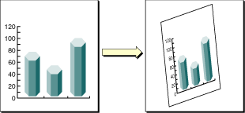

The Quartz 2D API provides five functions that allow you to obtain and modify the CTM. You can rotate, translate, and scale the CTM, and you can concatenate an affine transformation matrix with the CTM. See [Modifying the Current Transformation Matrix](#apple-f4xwc4dqnrsv64tfmyxwi33df52wszbpkridgmbqgaytanrwfvbuqmrqgqwugsscijeeerkg).

Quartz also allows you to create affine transforms that don’t operate on user space until you decide to apply the transform to the CTM. You use another set of functions to create affine transforms, which can then be concatenated with the CTM. See [Creating Affine Transforms](#apple-f4xwc4dqnrsv64tfmyxwi33df52wszbpkridgmbqgaytanrwfvbuqmrqgqwugsscjbdegskc).

You can use either set of functions without understanding anything about matrix math. However if you want to understand what Quartz does when you call one of the transform functions, read [The Math Behind the Matrices](#apple-f4xwc4dqnrsv64tfmyxwi33df52wszbpkridgmbqgaytanrwfvbuqmrqgqwugsscivbusqke).

You manipulate the CTM to rotate, scale, or translate the page before drawing an image, thereby transforming the object you are about to draw. Before you transform the CTM, you need to save the graphics state so that you can restore it after drawing. You can also concatenate the CTM with an affine transform (see [Creating Affine Transforms](#apple-f4xwc4dqnrsv64tfmyxwi33df52wszbpkridgmbqgaytanrwfvbuqmrqgqwugsscjbdegskc)). Each of these four operations—translation, rotation, scaling, and concatenation—is described in this section along with the CTM functions that perform each operation.

The following line of code draws an image, assuming that you provide a valid graphics context, a pointer to the rectangle to draw the image to, and a valid CGImage object. The code draws an image, such as the sample rooster image shown in Figure 5-2. As you read the rest of this section, you’ll see how the image changes as you apply transformations.

```
CGContextDrawImage (myContext, rect, myImage);
```


__Figure 5-2__  An image that is not transformed

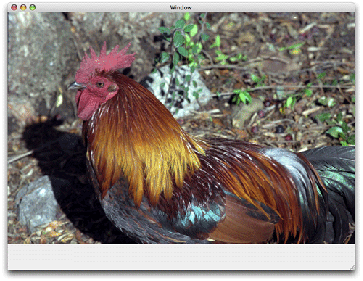

_Translation_ moves the origin of the coordinate space by the amount you specify for the x and y axes. You call the function `CGContextTranslateCTM` to modify the x and y coordinates of each point by a specified amount. Figure 5-3 shows an image translated by 100 units in the x-axis and 50 units in the y-axis, using the following line of code:

```
CGContextTranslateCTM (myContext, 100, 50);
```


__Figure 5-3__  A translated image

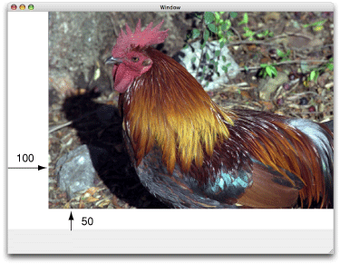

_Rotation_ moves the coordinate space by the angle you specify. You call the function `CGContextRotateCTM` to specify the rotation angle, in radians. Figure 5-4 shows an image rotated by –45 degrees about the origin, which is the lower left of the window, using the following line of code:

```
CGContextRotateCTM (myContext, radians(–45.));
```

The image is clipped because the rotation moved part of the image to a location outside the context. You need to specify the rotation angle in radians.

It’s useful to write a radians routine if you plan to perform many rotations.

```c
#include <math.h>
static inline double radians (double degrees) {return degrees * M_PI/180;}
```


__Figure 5-4__  A rotated image

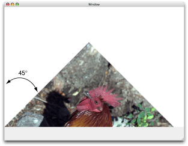

_Scaling_ changes the scale of the coordinate space by the x and y factors you specify, effectively stretching or shrinking the image. The magnitude of the x and y factors governs whether the new coordinates are larger or smaller than the original. In addition, by making the x factor negative, you can flip the coordinates along the x-axis; similarly, you can flip coordinates horizontally, along the y-axis, by making the y factor negative. You call the function `CGContextScaleCTM` to specify the x and y scaling factors. Figure 5-5 shows an image whose x values are scaled by .5 and whose y values are scaled by .75, using the following line of code:

```
CGContextScaleCTM (myContext, .5, .75);
```


__Figure 5-5__  A scaled image

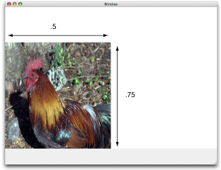

_Concatenation_ combines two matrices by multiplying them together. You can concatenate several matrices to form a single matrix that contains the cumulative effects of the matrices. You call the function `CGContextConcatCTM` to combine the CTM with an affine transform. Affine transforms, and the functions that create them, are discussed in [Creating Affine Transforms](#apple-f4xwc4dqnrsv64tfmyxwi33df52wszbpkridgmbqgaytanrwfvbuqmrqgqwugsscjbdegskc).

Another way to achieve a cumulative effect is to perform two or more transformations without restoring the graphics state between transformation calls. Figure 5-6 shows an image that results from translating an image and then rotating it, using the following lines of code:

```
CGContextTranslateCTM (myContext, w,h);
CGContextRotateCTM (myContext, radians(-180.));
```


__Figure 5-6__  An image that is translated and rotated

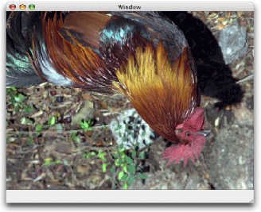

Figure 5-7 shows an image that is translated, scaled, and rotated, using the following lines of code:

```
CGContextTranslateCTM (myContext, w/4, 0);
CGContextScaleCTM (myContext, .25,  .5);
CGContextRotateCTM (myContext, radians ( 22.));
```


__Figure 5-7__  An image that is translated, scaled, and then rotated

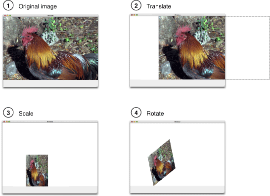

The order in which you perform multiple transformations matters; you get different results if you reverse the order. Reverse the order of transformations used to create Figure 5-7 and you get the results shown in Figure 5-8, which is produced with this code:

```
CGContextRotateCTM (myContext, radians ( 22.));
CGContextScaleCTM (myContext, .25,  .5);
CGContextTranslateCTM (myContext, w/4, 0);
```


__Figure 5-8__  An image that is rotated, scaled, and then translated

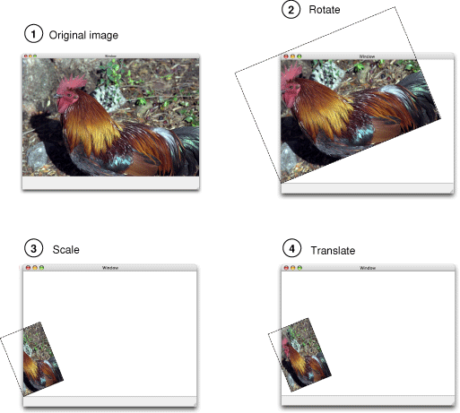

The affine transform functions available in Quartz operate on matrices, not on the CTM. You can use these functions to construct a matrix that you later apply to the CTM by calling the function `CGContextConcatCTM`. The affine transform functions either operate on, or return, a `CGAffineTransform` data structure. You can construct simple or complex affine transforms that are reusable.

The affine transform functions perform the same operations as the CTM functions—translation, rotation, scaling, and concatenation. Table 5-1 lists the functions that perform these operations along with information on their use. Note that there are two functions for each of the translation, rotation, and scaling operations.

__Table 5-1__  Affine transform functions for translation, rotation, and scaling

| Function | Use |
| `CGAffineTransformMakeTranslation` | To construct a new translation matrix from x and y values that specify how much to move the origin. |
| `CGAffineTransformTranslate` | To apply a translation operation to an existing affine transform. |
| `CGAffineTransformMakeRotation` | To construct a new rotation matrix from a value that specifies in radians how much to rotate the coordinate system. |
| `CGAffineTransformRotate` | To apply a rotation operation to an existing affine transform. |
| `CGAffineTransformMakeScale` | To construct a new scaling matrix from x and y values that specify how much to stretch or shrink coordinates. |
| `CGAffineTransformScale` | To apply a scaling operation to an existing affine transform. |

Quartz also provides an affine transform function that inverts a matrix, `CGAffineTransformInvert`. Inversion is generally used to provide reverse transformation of points within transformed objects. Inversion can be useful when you need to recover a value that has been transformed by a matrix: Invert the matrix, and multiply the value by the inverted matrix, and the result is the original value. You usually don’t need to invert transforms because you can reverse the effects of transforming the CTM by saving and restoring the graphics state.

In some situations you might not want to transform the entire space, but just a point or a size. You operate on a `CGPoint` structure by calling the function `CGPointApplyAffineTransform`. You operate on a `CGSize` structure by calling the function `CGSizeApplyAffineTransform`. You can operate on a `CGRect` structure by calling the function `CGRectApplyAffineTransform`. This function returns the smallest rectangle that contains the transformed corner points of the rectangle passed to it. If the affine transform that operates on the rectangle performs only scaling and translation operations, the returned rectangle coincides with the rectangle constructed from the four transformed corners.

You can create a new affine transform by calling the function `CGAffineTransformMake`, but unlike the other functions that make new affine transforms, this one requires you to supply matrix entries. To effectively use this function, you need to have an understanding of matrix math. See [The Math Behind the Matrices](#apple-f4xwc4dqnrsv64tfmyxwi33df52wszbpkridgmbqgaytanrwfvbuqmrqgqwugsscivbusqke).

You can determine whether one affine transform is equal to another by calling the function `CGAffineTransformEqualToTransform`. This function returns `true` if the two transforms passed to it are equal and `false` otherwise.

The function `CGAffineTransformIsIdentity` is a useful function for checking whether a transform is the _identity transform_. The identity transform performs no translation, scaling, or rotation. Applying this transform to the input coordinates always returns the input coordinates. The Quartz constant `CGAffineTransformIdentity` represents the identity transform.

Typically when you draw with Quartz 2D, you work only in user space. Quartz takes care of transforming between user and device space for you. If your application needs to obtain the affine transform that Quartz uses to convert between user and device space, you can call the function `CGContextGetUserSpaceToDeviceSpaceTransform`.

Quartz provides a number of convenience functions to transform the following geometries between user space and device space. You might find these functions easier to use than applying the affine transform returned from the function `CGContextGetUserSpaceToDeviceSpaceTransform`.

- Points. The functions `CGContextConvertPointToDeviceSpace` and `CGContextConvertPointToUserSpace` transform a `CGPoint` data type from one space to the other.
- Sizes. The functions `CGContextConvertSizeToDeviceSpace` and `CGContextConvertSizeToUserSpace` transform a `CGSize` data type from one space to the other.
- Rectangles. The functions `CGContextConvertRectToDeviceSpace` and `CGContextConvertRectToUserSpace` transform a `CGRect` data type from one space to the other.

The only Quartz 2D function for which you need an understanding of matrix math is the function `CGAffineTransformMake`, which makes an affine transform from the six critical entries in a 3 x 3 matrix. Even if you never plan to construct an affine transformation matrix from scratch, you might find the math behind the transform functions interesting. If not, you can skip the rest of this chapter.

The six critical values of a 3 x 3 transformation matrix —_a_, _b_, _c_, _d_, _tx_ and _ty_— are shown in the following matrix:

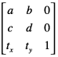

Given the 3 x 3 transformation matrix described above, Quartz uses this equation to transform a point (_x_, _y_) into a resultant point (`x`’, _y_’):

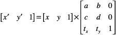

The result is in a different coordinate system, the one transformed by the variable values in the transformation matrix. The following equations are the definition of the previous matrix transform:

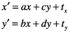

The following matrix is the identity matrix. It performs no translation, scaling, or rotation. Multiplying this matrix by the input coordinates always returns the input coordinates.

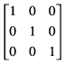

Using the formulas discussed earlier, you can see that this matrix would generate a new point (_x_’, _y_’) that is the same as the old point (_x_, _y_):

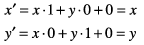

This matrix describes a _translation_ operation:

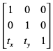

These are the resulting equations that Quartz uses to apply the translation:

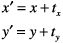

This matrix describes a _scaling_ operation on a point (_x_, _y_):

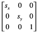

These are the resulting equations that Quartz uses to scale the coordinates:

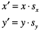

This matrix describes a _rotation_ operation, rotating the point (_x_, _y_) counterclockwise by an angle a:

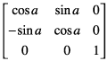

These are the resulting equations that Quartz uses to apply the rotation:

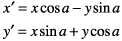

This equation _concatenates_ a rotation operation with a translation operation:

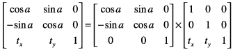

These are the resulting equations that Quartz uses to apply the transform:

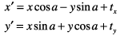

Note that the order in which you concatenate matrices is important—matrix multiplication is not commutative. That is, the result of multiplying matrix A by matrix B does not necessarily equal the result of multiplying matrix B by matrix A.

As previously mentioned, concatenation is the reason the affine transformation matrix contains a third column with the constant values 0, 0, 1. To multiply one matrix against another matrix, the number of columns of one matrix must match the number of rows of the other. This means that a 2 x 3 matrix cannot be multiplied against a 2 x 3 matrix. Thus we need the extra column containing the constant values.

An _inversion_ operation produces original coordinates from transformed ones. Given the coordinates (_x_, _y_), which have been transformed by a given matrix A to new coordinates (_x_’, _y_’), transforming the coordinates (_x_’, _y_’) by the inverse of matrix A produces the original coordinates (_x_, _y_). When a matrix is multiplied by its inverse, the result is the identity matrix.

[Next](Patterns.md)[Previous](Color%20and%20Color%20Spaces.md)

