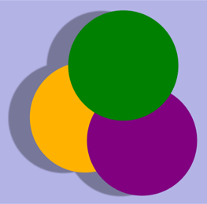
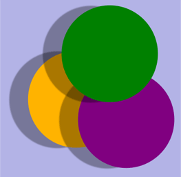
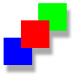

> 导航：[总目录](../../../README.md) · [documentation](../../../_indexes/documentation.md) · [Quartz 2D Programming Guide](Introduction.md)


[Next](Data%20Management%20in%20Quartz%202D.md)[Previous](Gradients.md)

# Transparency Layers

A _transparency layer_ consists of two or more objects that are combined to yield a composite graphic. The resulting composite is treated as a single object. Transparency layers are useful when you want to apply an effect to a group of objects, such as the shadow applied to the three circles in Figure 9-1.

__Figure 9-1__  Three circles as a composite in a transparency layer



If you apply a shadow to the three circles in Figure 9-1 without first rendering them to a transparency layer, you get the result shown in Figure 9-2.

__Figure 9-2__  Three circles painted as separate entities



Quartz transparency layers are similar to layers available in many popular graphics applications. Layers are independent entities. Quartz maintains a transparency layer stack for each context and transparency layers can be nested. But because layers are always part of a stack, you can’t manipulate them independently.

You signal the start of a transparency layer by calling the function `CGContextBeginTransparencyLayer`, which takes as parameters a graphics context and a CFDictionary object. The dictionary lets you provide options to specify additional information about the layer, but because the dictionary is not yet used by the Quartz 2D API, you pass `NULL`. After this call, graphics state parameters remain unchanged except for alpha (which is set to `1`), shadow (which is turned off), blend mode (which is set to normal), and other parameters that affect the final composite.

After you begin a transparency layer, you perform whatever drawing you want to appear in that layer. Drawing operations in the specified context are drawn as a composite into a fully transparent backdrop. This backdrop is treated as a separate destination buffer from the context.

When you are finished drawing, you call the function `CGContextEndTransparencyLayer`. Quartz composites the result into the context using the global alpha value and shadow state of the context and respecting the clipping area of the context.

Painting to a transparency layer requires three steps:

1. Call the function `CGContextBeginTransparencyLayer`.
2. Draw the items you want to composite in the transparency layer.
3. Call the function `CGContextEndTransparencyLayer`.

The three rectangles in Figure 9-3 are painted to a transparency layer. Quartz renders the shadow as if the rectangles are a single unit.

__Figure 9-3__  Three rectangles painted to a transparency layer



The function in Listing 9-1 shows how to use a transparency layer to generate the rectangles in Figure 9-3. A detailed explanation for each numbered line of code follows the listing.

__Listing 9-1__  Painting to a transparency layer

```
void MyDrawTransparencyLayer (CGContext myContext, // 1
                                CGFloat wd,
                                CGFloat ht)
{
    CGSize          myShadowOffset = CGSizeMake (10, -20);// 2

    CGContextSetShadow (myContext, myShadowOffset, 10);   // 3
    CGContextBeginTransparencyLayer (myContext, NULL);// 4
    // Your drawing code here// 5
    CGContextSetRGBFillColor (myContext, 0, 1, 0, 1);
    CGContextFillRect (myContext, CGRectMake (wd/3+ 50,ht/2 ,wd/4,ht/4));
    CGContextSetRGBFillColor (myContext, 0, 0, 1, 1);
    CGContextFillRect (myContext, CGRectMake (wd/3-50,ht/2-100,wd/4,ht/4));
    CGContextSetRGBFillColor (myContext, 1, 0, 0, 1);
    CGContextFillRect (myContext, CGRectMake (wd/3,ht/2-50,wd/4,ht/4));
    CGContextEndTransparencyLayer (myContext);// 6
}
```

Here’s what the code does:

1. Takes three parameters—a graphics context and a width and height to use when constructing the rectangles.
2. Sets up a `CGSize` data structure that contains the x and y offset values for the shadow. This shadow is offset by 10 units in the horizontal direction and –20 units in the vertical direction.
3. Sets the shadow, specifying a value of `10` as the blur value. (A value of `0` specifies a hard edge shadow with no blur.)
4. Signals the start of the transparency layer. From this point on, drawing occurs to this layer.
5. The next six lines of code set fill colors and fill the three rectangles shown in [Figure 9-3](#apple-f4xwc4dqnrsv64tfmyxwi33df52wszbpkridgmbqgaytanrwfvbuqmrrgawueqsdi5deurkd). You replace these lines with your own drawing code.
6. Signals the end of the transparency layer and signals that Quartz should composite the result into the context.

[Next](Data%20Management%20in%20Quartz%202D.md)[Previous](Gradients.md)

