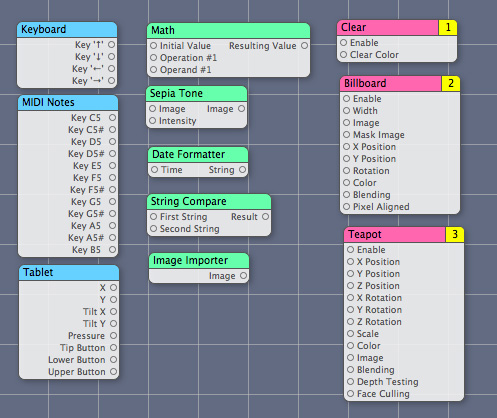
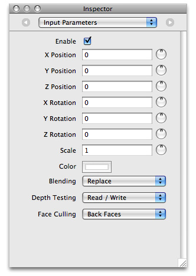
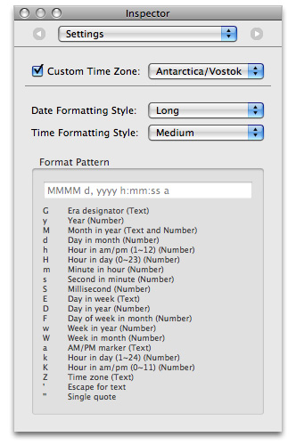
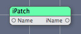
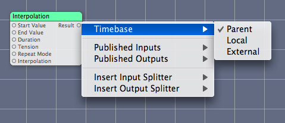
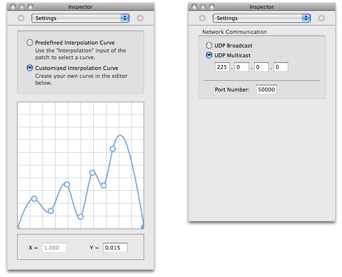
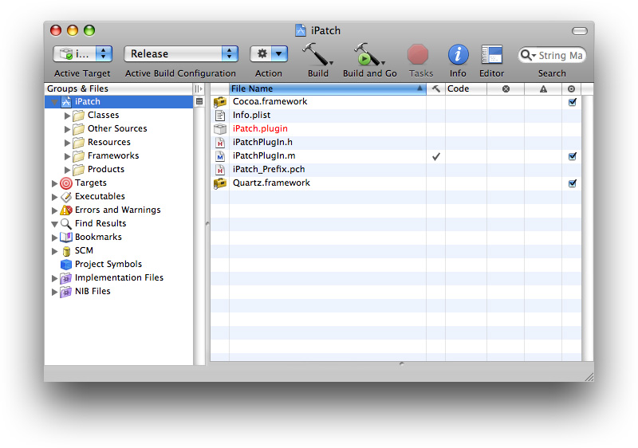

> 导航：[总目录](../../../README.md) · [documentation](../../../_indexes/documentation.md) · [Quartz Composer Custom Patch Programming Guide](Introduction%20to%20Quartz%20Composer%20Custom%20Patch%20Programming%20Guide.md)


[Next](Writing%20Processor%20Patches.md)[Previous](Introduction%20to%20Quartz%20Composer%20Custom%20Patch%20Programming%20Guide.md)

# The Basics of Custom Patches

A Quartz Composer patch is similar to a routine in a traditional programming language—a __patch__ is a base processing unit that executes and produces a result. A __custom patch__ is one that you write by subclassing the [QCPlugIn](https://developer.apple.com/documentation/quartz/qcplugin) class. To make a custom patch available in the Quartz Composer patch library, you need to package it as a __plug-in__—an [NSBundle](https://developer.apple.com/library/archive/documentation/LegacyTechnologies/WebObjects/WebObjects_3.5/Reference/Frameworks/ObjC/Foundation/Classes/NSBundle/Description.html#//apple_ref/occ/cl/NSBundle) object—and install in the appropriate directory. If you’d like, you can package more than one custom patch in a plug-in. You don’t need to create a user interface for a custom patch. When Quartz Composer loads your plug-in, it creates the user interface automatically for each custom patch in the plug-in so that custom patches have the same look in the workspace as the patches that are built in to Quartz Composer.

This chapter provides a discussion of custom patches and gives an overview of the tasks you need to perform to create a custom patch. You’ll see which aspects of your code give rise to the user interface for a custom patch. By the end of the chapter you should have a fairly good idea of how to get started writing your own custom patches. Then you can read [Writing Processor Patches](Writing%20Processor%20Patches.md#apple-f4xwc4dqnrsv64tfmyxwi33df52wszbpkridimbqga2doobxfvbuqnbnknltc) and [Writing Consumer Patches](Writing%20Consumer%20Patches.md#apple-f4xwc4dqnrsv64tfmyxwi33df52wszbpkridimbqga2doobxfvbuqnjnknltc) to find out how to write specific kinds of patches.

Patches in Quartz Composer all have the same basic look and feel, as you can see in Figure 1-1. The patch name is at the top of the patch, in the patch title bar. Input ports are on the left side of the patch and output ports are on the right side. Many provider patches don’t have input ports because they get data from an outside source, such as a mouse, keyboard, tablet, or MIDI controller. Consumer patches don’t have output ports because they render data to a destination. Processor patches have one or more input ports and one or more output ports.

__Figure 1-1__  A variety of Quartz Composer patches



The inspector provides access to the patch parameters. The Input Parameters pane contains the same parameters represented by the input ports. It provides the option to manually adjust input values instead of supplying values through the input ports. Compare the Teapot patch shown in [Figure 1-1](#apple-f4xwc4dqnrsv64tfmyxwi33df52wszbpkridimbqga2doobxfvbuqmznknltq) with Figure 1-2. You’ll see that the ports match up with the input parameters.

__Figure 1-2__  The Input Parameters pane for the Teapot patch



Some patches also have a Settings pane, as shown in Figure 1-3, that provides support for configuring settings whose values either can’t be represented by one of the standard port data types (see [Table 1-1](#apple-f4xwc4dqnrsv64tfmyxwi33df52wszbpkridimbqga2doobxfvbuqmznknlte)) or that control advanced options.

__Figure 1-3__  The Settings pane for the Date Formatter patch



A custom patch is a subclass of the [QCPlugIn](https://developer.apple.com/documentation/quartz/qcplugin) class. Quartz Composer creates the input and output ports on a custom patch from dynamic Objective-C properties of the subclass. Properties whose name begins with `input` (and are one of the supported types) will appear as an input port on the patch. Properties whose name begins with `output` (and are one of the supported types) will appear as an `output` port on the patch. Listing 1-1 shows code that creates a subclass of [QCPlugIn](https://developer.apple.com/documentation/quartz/qcplugin) and declares one input and one output parameter. As you read this section you’ll see how that code relates to the resulting custom patch in Quartz Composer.

__Listing 1-1__  The subclass and properties for a custom string-processing patch

```objc
@interface iPatchPlugIn : QCPlugIn
{
}

@property(assign) NSString* inputString;
@property(assign) NSString* outputString;

@end
```

You can implement the [attributesForPropertyPortWithKey:](https://developer.apple.com/documentation/quartz/qcplugin/1488766-attributesforpropertyportwithkey) method to map the name of each property (such as `inputString` or `outputString`) to a key-value pair for the corresponding patch parameter. Listing 1-2 shows an implementation of this method for the properties declared in [Listing 1-1](#apple-f4xwc4dqnrsv64tfmyxwi33df52wszbpkridimbqga2doobxfvbuqmznknltemi). For each property, the method returns a dictionary that contains the port name and its default value, if any. This example returns the port name `Name` for the property that’s named `inputString`. It returns `iName` for the property that’s named `outputString`.

__Listing 1-2__  A routine that returns attributes for property ports

```objc
+ (NSDictionary*) attributesForPropertyPortWithKey:(NSString*)key
{
    if([key isEqualToString:@"inputString"])
        return [NSDictionary dictionaryWithObjectsAndKeys:
                @"Name", QCPortAttributeNameKey,
                @"Pod", QCPortAttributeDefaultValueKey,
                nil];
    if([key isEqualToString:@"outputString"])
        return [NSDictionary dictionaryWithObjectsAndKeys:
                @"iName", QCPortAttributeNameKey,
                nil];

    return nil;
}
```

Figure 1-4 shows the patch that Quartz Composer creates as a result of the property declarations and the [attributesForPropertyPortWithKey:](https://developer.apple.com/documentation/quartz/qcplugin/1488766-attributesforpropertyportwithkey) method. Note that input values are read only—your custom patch code reads the input values and processes them in some way. Your custom patch code can write to output ports as well as read their current values.

__Figure 1-4__  The resulting patch



If you don’t use properties, or if your custom patch needs to change the number of ports at runtime, you can use the [QCPlugIn](https://developer.apple.com/documentation/quartz/qcplugin) methods to dynamically add and remove input and output ports, and the associated methods to set and retrieve values. These methods are described in _[QCPlugIn Class Reference](https://developer.apple.com/documentation/quartz/qcplugin)_:

- [addInputPortWithType:forKey:withAttributes:](https://developer.apple.com/documentation/quartz/qcplugin/1488858-addinputportwithtype)
- [addOutputPortWithType:forKey:withAttributes:](https://developer.apple.com/documentation/quartz/qcplugin/1488760-addoutputportwithtype)
- [removeInputPortForKey:](https://developer.apple.com/documentation/quartz/qcplugin/1488707-removeinputportforkey)
- [removeOutputPortForKey:](https://developer.apple.com/documentation/quartz/qcplugin/1488800-removeoutputportforkey)
- [setValue:forOutputKey:](https://developer.apple.com/documentation/quartz/qcplugin/1488788-setvalue)
- [valueForInputKey:](https://developer.apple.com/documentation/quartz/qcplugin/1488802-valueforinputkey)

You can define a string that specifies a practical name for the custom patch. This is the name that appears as the patch title. You should also define a description string that briefly tells what the custom patch does. For example:

```
#define    kQCPlugIn_Name @"iPatch"
#define    kQCPlugIn_Description @"Converts any name to an \"iName\""
```

Then you need to implement the [attributes](https://developer.apple.com/documentation/quartz/qcplugin/1488869-attributes) method so that your custom patch returns a dictionary that contains the name and description. Listing 1-3 shows the `attributes` method for the iPatch custom patch.

__Listing 1-3__  A routine that returns the custom patch name and description

```objc
+ (NSDictionary*) attributes
{
    return [NSDictionary dictionaryWithObjectsAndKeys:
                 @"Name", QCPlugInAttributeNameKey,
                @"Convert any name to an \"iName\"", QCPlugInAttributeDescriptionKey,
                nil];
}
```

The description appears in the Quartz Composer when the patch is selected in the Patch Creator and when the user hovers the pointer over the patch title bar in the workspace.

You must establish an execution mode for the custom patch by implementing the [executionMode](https://developer.apple.com/documentation/quartz/qcplugin/1488695-executionmode) method. The method returns the appropriate execution mode constant, which represents a Quartz Composer patch type—provider, processor, or consumer.

- [kQCPlugInExecutionModeProvider](https://developer.apple.com/documentation/quartz/qcpluginexecutionmode/kqcpluginexecutionmodeprovider) specifies to execute when the output values are needed but at most once per frame. This mode is for custom patches that pull data from an external source such as video, the mouse, a MIDI device, an RSS feed, and so on.
- [kQCPlugInExecutionModeProcessor](https://developer.apple.com/documentation/quartz/qcpluginexecutionmode/kqcpluginexecutionmodeprocessor) specifies to execute when the output values are needed and when input values change.
- [kQCPlugInExecutionModeConsumer](https://developer.apple.com/documentation/quartz/kqcpluginexecutionmodeconsumer) specifies to execute every frame. This type of custom patch pulls data from others and renders it to a destination.

A custom patch must establish a time dependency by implementing the [timeMode](https://developer.apple.com/documentation/quartz/qcplugin/1488805-timemode) method. The method returns one of the following time mode constants:

- [kQCPlugInTimeModeNone](https://developer.apple.com/documentation/quartz/qcplugintimemode/kqcplugintimemodenone) does not depend on time.
- [kQCPlugInTimeModeIdle](https://developer.apple.com/documentation/quartz/kqcplugintimemodeidle) does not depend on time, but needs to give the system some time to process.
- [kQCPlugInTimeModeTimeBase](https://developer.apple.com/documentation/quartz/kqcplugintimemodetimebase) has a time base defined by the system and the custom patch uses time in its computations for the result.

If a custom patch uses the time base mode, the patch will have an option that allows the user to set the time base to parent, local, or external, as shown in Figure 1-5.

__Figure 1-5__  The time base setting for the Interpolation patch



Objective-C 2.0 properties must be one of the data types listed in Table 1-1. Quartz Composer maps the property data type to the appropriate port type. The type constants for ports that your custom patch creates at runtime are listed in the Custom Port Type column of the table, next to the Objective-C class associated with the port value. If your custom patch requires data that can’t be captured by one of the data types below, see [Internal Settings](#apple-f4xwc4dqnrsv64tfmyxwi33df52wszbpkridimbqga2doobxfvbuqmznknltg).

__Table 1-1__  Data type mappings

| Port | Objective-C 2.0 property type | Custom port type | Objective-C class |
| Boolean | `BOOL` | `QCPortTypeBoolean` | `NSNumber` |
| Index | `NSUInteger` | `QCPortTypeIndex` | `NSNumber` |
| Number | `double` | `QCPortTypeNumber` | `NSNumber` |
| String | `NSString *` | `QCPortTypeString` | `NSString` |
| Color | `CGColorRef` | `QCPortTypeColor` | `CGColorRef` |
| Structure | `NSDictionary *` | `QCPortTypeStructure` | `NSDictionary` |
| Image (input) | `id<QCPlugInInputImageSource>` | `QCPortTypeImage` | `(id)<QCPlugInInputImageSource>` |
| Image (output) | `id <QCPlugInOutputImageProvider>` | `QCPortTypeImage` | `(id)<QCPlugInOutputImageProvider>` |

Images in Quartz Composer are opaque objects that conform to protocols. Using protocols avoids the restrictions of a particular image type as well as type mismatches. It also gets the best performance because Quartz Composer defers pixel computation until it is needed.

The supported pixel formats for images are:

- `ARGB8`—8 bits alpha, 8 bits red, 8 bits green, 8 bits blue, unsigned integer
- `BGRA8`—8 bits blue, 8 bits green, 8 bits red, 8 bits alpha, unsigned integer
- `RGBAf`— 32 bits red, 32 bits green, 32 bits blue, 32 bits alpha, floating-point
- `l8`—8 bits luminance, unsigned integer
- `lf`—32 bits luminance, floating-point

Input images are opaque source objects that conform to the [QCPlugInInputImageSource](https://developer.apple.com/documentation/quartz/qcplugininputimagesource) protocol. To use an image as an input parameter to your custom patch, declare it as a property:

```objc
@property(assign) id<QCPlugInInputImageSource> inputImage;
```

Output images are opaque provider objects that conform to the [QCPlugInOutputImageProvider](https://developer.apple.com/documentation/quartz/qcpluginoutputimageprovider) protocol. To use an image as an output parameter for your custom patch, declare it as a property:

```objc
@property(assign) id<QCPlugInOutputImageProvider> outputImage;
```

[Writing Image Processing Patches](Writing%20Image%20Processing%20Patches.md#apple-f4xwc4dqnrsv64tfmyxwi33df52wszbpkridimbqga2doobxfvbuqnznknltc) shows how to define the methods of the [QCPlugInInputImageSource](https://developer.apple.com/documentation/quartz/qcplugininputimagesource) and [QCPlugInOutputImageProvider](https://developer.apple.com/documentation/quartz/qcpluginoutputimageprovider) protocols. See also _[QCPlugInInputImageSource Protocol Reference](https://developer.apple.com/documentation/quartz/qcplugininputimagesource)_ and _[QCPlugInOutputImageProvider Protocol Reference](https://developer.apple.com/documentation/quartz/qcpluginoutputimageprovider)_.

Custom patch parameters that are not suitable as input ports can be added to the Settings pane of the inspector for the patch. A few reasons why you might want to use internal settings are:

- The parameter can’t be represented by one of the data types listed in [Table 1-1](#apple-f4xwc4dqnrsv64tfmyxwi33df52wszbpkridimbqga2doobxfvbuqmznknlte). See, for example, the interpolation curve shown in Figure 1-6.
- The default value of the parameter works in most cases and should be modified only by a knowledgeable user.
- It doesn’t make sense to animate the parameter.

__Figure 1-6__  Two sample Settings panes



For such cases, your custom patch needs to provide a user interface for editing these values. Quartz Composer inserts your custom user interface into the Settings pane of the inspector for the patch. Internal settings are accessible through key-value coding. The simplest way to implement them are as Objective-C 2.0 properties. Listing 1-4 shows two typical declarations for property instance variables.

__Listing 1-4__  Code that declares property instance variables

```objc
@property(copy) NSColor* systemColor;
@property(copy) MyConfiguration* systemConfiguration;
```

Your [QCPlugIn](https://developer.apple.com/documentation/quartz/qcplugin) subclass must implement the [plugInKeys](https://developer.apple.com/documentation/quartz/qcplugin/1488790-pluginkeys) method so that it returns a list of keys for the internal settings. The `plugInKeys` method for the `systemColor` and `systemConfiguration` properties is shown in Listing 1-5. Make sure to terminate the list with `nil`. (See _[Key-Value Coding Programming Guide](https://developer.apple.com/library/archive/documentation/Cocoa/Conceptual/KeyValueCoding/index.html#//apple_ref/doc/uid/10000107i)_.)

__Listing 1-5__  An implementation of the `plugInKeys` method

```objc
+ (NSArray*) plugInKeys
{
    return [NSArray arrayWithObjects: @“systemColor”,
                @“systemConfiguration”,
                nil]
}
```

You use Interface Builder to create the user interface for editing internal settings. The interface is a view object ([NSView](https://developer.apple.com/documentation/appkit/nsview) or [NSView](https://developer.apple.com/documentation/appkit/nsview) subclass) that is managed through an instance of [QCPlugInViewController](https://developer.apple.com/documentation/quartz/qcpluginviewcontroller). This instance acts as a controller between the custom patch instance and the view that contains the controls. In order for the nib to load properly, your plug-in class must implement the [createViewController](https://developer.apple.com/documentation/quartz/qcplugin/1504984-createviewcontroller) method of `QCPlugIn` and return an instance of [QCPlugInViewController](https://developer.apple.com/documentation/quartz/qcpluginviewcontroller) initialized with the correct nib name. In this example shown in Listing 1-6, the name is `MyPlugIn`.

__Listing 1-6__  Code that implements a view controller

```objc
- (QCPlugInViewController*) createViewController
{
  return [[QCPlugInViewController alloc] initWithPlugIn:self
         viewNibName:@”MyPlugIn”];
}
```

Using Cocoa bindings for the controls in your custom interface requires no code. Just use `plugIn.XXX` as the model key path, where `XXX` is the corresponding key for the internal setting. If you prefer, you can subclass [QCPlugInViewController](https://developer.apple.com/documentation/quartz/qcpluginviewcontroller) to implement the usual target-action communication model. (You also need to make sure that you do not autorelease the controller. Then you need to connect the controls in the nib to the owner controller.)

When you read or write a composition file that uses the custom patch, the internal settings are serialized. Serialization is automatic for any setting whose class conforms to the [NSCoding](https://developer.apple.com/library/archive/documentation/LegacyTechnologies/WebObjects/WebObjects_3.5/Reference/Frameworks/ObjC/Foundation/Protocols/NSCoding/Description.html#//apple_ref/occ/intf/NSCoding) protocol, such as [NSColor](https://developer.apple.com/documentation/appkit/nscolor). For example, the `systemColor` property defined in [Listing 1-4](#apple-f4xwc4dqnrsv64tfmyxwi33df52wszbpkridimbqga2doobxfvbuqmznknltk) does not require any action on your part; the system serializes it automatically.

For settings that don’t conform to the [NSCoding](https://developer.apple.com/library/archive/documentation/LegacyTechnologies/WebObjects/WebObjects_3.5/Reference/Frameworks/ObjC/Foundation/Protocols/NSCoding/Description.html#//apple_ref/occ/intf/NSCoding) protocol, you need to override the following methods:

- [serializedValueForKey:](https://developer.apple.com/documentation/quartz/qcplugin/1488752-serializedvalue) converts a value to its serialized representation.
- [setSerializedValue:forKey:](https://developer.apple.com/documentation/quartz/qcplugin/1488851-setserializedvalue) converts from a serialized representation back to the original value.

For example, the `systemConfiguration` property defined in [Listing 1-4](#apple-f4xwc4dqnrsv64tfmyxwi33df52wszbpkridimbqga2doobxfvbuqmznknltk) is serialized as shown in Listing 1-7. A serialized value must be a property list class such as [NSString](https://developer.apple.com/library/archive/documentation/LegacyTechnologies/WebObjects/WebObjects_3.5/Reference/Frameworks/ObjC/Foundation/Classes/NSStringClassCluster/Description.html#//apple_ref/occ/cl/NSString), [NSNumber](https://developer.apple.com/library/archive/documentation/LegacyTechnologies/WebObjects/WebObjects_3.5/Reference/Frameworks/ObjC/Foundation/Classes/NSNumber/Description.html#//apple_ref/occ/cl/NSNumber), [NSDate](https://developer.apple.com/library/archive/documentation/LegacyTechnologies/WebObjects/WebObjects_3.5/Reference/Frameworks/ObjC/Foundation/Classes/NSDateClassCluster/Description.html#//apple_ref/occ/cl/NSDate), [NSArray](https://developer.apple.com/library/archive/documentation/LegacyTechnologies/WebObjects/WebObjects_3.5/Reference/Frameworks/ObjC/Foundation/Classes/NSArrayClassCluster/Description.html#//apple_ref/occ/cl/NSArray), or [NSDictionary](https://developer.apple.com/library/archive/documentation/LegacyTechnologies/WebObjects/WebObjects_3.5/Reference/Frameworks/ObjC/Foundation/Classes/NSDictionaryClassClstr/Description.html#//apple_ref/occ/cl/NSDictionary) or `nil`.

__Listing 1-7__  Code that overrides serialization methods for system configuration data

```objc
- (id) serializedValueForKey:(NSString*)key
 {
    if([key isEqualToString:@"systemConfiguration"])
        return [self.systemConfiguration data];
    // Ensure this has a data method
    return [super serializedValueForKey:key];
}

- (void) setSerializedValue:(id)serializedValue
                     forKey:(NSString*)key
{
    // System config is subclass of NSObject.
    // It's up to you to keep track of the version.
    if([key isEqualToString:@"systemConfiguration"])
        self.systemConfiguration
           = [MyConfiguration configurationWithData:serializedValue];
    else
        [super setSerializedValue:serializedValue forKey:key];
}
```


Quartz Composer assumes that the following statements are true for your [QCPlugIn](https://developer.apple.com/documentation/quartz/qcplugin) subclass:

- There can be multiple instances of a custom patch. Quartz Composer creates one instance of the [QCPlugIn](https://developer.apple.com/documentation/quartz/qcplugin) subclass each time the custom patch appears in a composition.
- The custom patch works correctly even when it is not executed on the main thread.
- The custom patch does not require a run loop to be present and running. (If you need a run loop, then you must set up the run loop on a secondary thread and communicate with it.)

The [execute:atTime:withArguments:](https://developer.apple.com/documentation/quartz/qcplugin/1488847-execute) method of `QCPlugIn` is at the heart of the custom patch. The method typically:

- Reads the values from the input ports or gets data from a source
- Performs computations, taking into account time, if necessary
- Either writes the result to the output ports or renders the content to a destination

Your [execute:atTime:withArguments:](https://developer.apple.com/documentation/quartz/qcplugin/1488847-execute) method should access its property ports only when necessary. When you can, cache values in loops rather than repeatedly read them from the port.

When the Quartz Composer engine renders, it calls methods related to executing the custom patch. Quartz Composer passes an opaque object—that is, an execution context that conforms to the [QCPlugInContext](https://developer.apple.com/documentation/quartz/qcplugincontext) protocol—to these methods. You should neither retain the context nor use it outside of the execution methods. Make sure you don’t write values to the input ports (input ports are read only).

The [QCPlugInContext](https://developer.apple.com/documentation/quartz/qcplugincontext) protocol contains a number of useful methods for getting information about the rendering destination, including:

- [bounds](https://developer.apple.com/documentation/quartz/qcplugincontext/1488700-bounds) returns the bounds, expressed in Quartz Composer units (`–1.0` to `1.0`).
- [colorSpace](https://developer.apple.com/documentation/quartz/qcplugincontext/1488846-colorspace) returns the output color space.
- [CGLContextObj](https://developer.apple.com/documentation/quartz/qcplugincontext/1488849-cglcontextobj) returns the CGL context to perform rendering to.

The protocol also provides utilities for logging messages and getting a dictionary of user information. The user information dictionary is shared with all instances of the custom patch in the same plug-in context environment. The dictionary was designed that way to allowing sharing information between custom patch instances. For more information on these methods, see _[QCPlugInContext Protocol Reference](https://developer.apple.com/documentation/quartz/qcplugincontext)_.

Xcode provides two templates that makes it straightforward to write and package custom patches. One template is for custom patches that do not require a Settings pane. The other template includes a nib file for a Setting pane. For each template, Xcode provides the skeletal files and methods that are needed and names the files appropriately. Figure 1-7 shows the files automatically created by Xcode for a Quartz Composer plug-in project named `iPatch`.

__Figure 1-7__  The files in a Quartz Composer plug-in project



Xcode automatically names files using the project name that you supply. These are the default files provided by Xcode.

- `<ProjectName>PlugIn.m` is the implementation file for the custom patch. You need to modify this file.
- `<ProjectName>PlugIn.h` is the interface file for the custom patch. You need to modify this file.
- `Info.plist` contains properties of the plug-in, such as development region, bundle identifier, product name, and a `QCPlugInClasses` key that lists classes for each custom patch in the plug-in. You need to modify the Info.plist and make sure that the value associated with the `QCPlugInClasses` key is correct. The default value for this key is based on the project name that you supply, so you shouldn’t need to modify it unless you plan to include more than one custom patch in the bundle.

The interface file declares a subclass of [QCPlugIn](https://developer.apple.com/documentation/quartz/qcplugin). Xcode automatically names the subclass `<ProjectName>PlugIn`. For example, if you supply `Number2Color` as the project name, the interface file uses `Number2ColorPlugIn` as the subclass name.

The implementation file contains these methods of the [QCPlugIn](https://developer.apple.com/documentation/quartz/qcplugin) class that you need to modify for your purposes:

- [attributes](https://developer.apple.com/documentation/quartz/qccomposition/1505184-attributes)
- [attributesForPropertyPortWithKey:](https://developer.apple.com/documentation/quartz/qcplugin/1488766-attributesforpropertyportwithkey)
- [executionMode](https://developer.apple.com/documentation/quartz/qcplugin/1488695-executionmode)
- [timeMode](https://developer.apple.com/documentation/quartz/qcplugin/1488805-timemode)
- [execute:atTime:withArguments:](https://developer.apple.com/documentation/quartz/qcplugin/1488847-execute)

There are other methods of [QCPlugIn](https://developer.apple.com/documentation/quartz/qcplugin) provided in the template that you can implement if appropriate. (See also _[QCPlugIn Class Reference](https://developer.apple.com/documentation/quartz/qcplugin)_.)

The implementation file provided by Xcode contains two important statements that you should not modify and one that you need to modify. This statement should not be modified or deleted:

`#import <OpenGL/CGLMacro.h>`

Using `CGLMacro.h` improves performance. The inclusion of this statement allows Quartz Composer to optimize its use of OpenGL by providing a local context variable and caching the current renderer in that variable. You should keep this statement even if your custom patch does not contain OpenGL code itself. If your custom patch contains OpenGL code, you need to declare a local variable and set the current context to it. For example:

`#import <OpenGL/CGLMacro.h>`

`CGLContext cgl_ctx = myContext;`

where `myContext` is the current context.

See [Using OpenGL in a Custom Patch](Writing%20Consumer%20Patches.md#apple-f4xwc4dqnrsv64tfmyxwi33df52wszbpkridimbqga2doobxfvbuqnjnknlte) and _[OpenGL Programming Guide for Mac](../OpenGL%20Programming%20Guide%20for%20Mac/About%20OpenGL%20for%20OS%20X.md#apple-f4xwc4dqnrsv64tfmyxwi33df52wszbpkridimbqgaytsobx)_ for more information.

The statement that defines the custom patch name is automatically filled-in by Xcode based on the project name that you supply. To help the user distinguish patches, it’s best if the patch name is unique in the context of the Quartz Composer Patch Creator. If the name isn’t unique, your patch will be difficult to use. So, change this statement.

`#define kQCPlugIn_Name @"<ProjectName>"`

Xcode provides a default definition for the custom patch description:

`#define kQCPlugIn_Description @"Converts any name to an \"iName\""`

You need to modify this string so that it describes the custom patch. If the patch name is not unique, it’s best to describe how your patch differs from another patch of the same name. You’ll also want to provide localized strings. (For more information on localization, see Strings Files.)

You need to package a Quartz Composer custom patch as a standard Cocoa bundle. You can package more than one custom patch in the bundle. The `QCPlugIn` template makes it trivial to package custom patches; see [The QCPlugIn Template in Xcode](#apple-f4xwc4dqnrsv64tfmyxwi33df52wszbpkridimbqga2doobxfvbuqmznknlto).

The bundle `Info.plist` file must have an entry for each [QCPlugIn](https://developer.apple.com/documentation/quartz/qcplugin) subclass that’s in the bundle. Listing 1-8 shows a property list entry for a bundle that contains two custom patches: `MyColorGenerator` and `MyNumberCruncher`.

__Listing 1-8__  Entries in the `Info.plist` file

```
<key>QCPlugInClasses</key>
 <array>
  <string>MyColorGenerator</string>
  <string>MyNumberCruncher</string>
 </array>
```

When you build the bundles, you should target 32-bit, 64-bit, PowerPC, and Intel architectures.

You can make a custom patch available to any application that uses Quartz Composer by installing the plug-in that contains the custom patch in `/Library/Graphics/Quartz Composer Plug-Ins` or `~/Library/Graphics/Quartz Composer Plug-Ins`. When Quartz Composer launches, it automatically loads the plug-in so that all the custom patches contained in the plug-in show up in the Patch Creator.

You can choose instead to include custom patch code in an application bundle. You might want to do this either to control the use of the custom patches or because they are useful only to the application you are embedding them in. To make a custom patch available to the application, register the subclass of the `QCPlugIn` class using the [registerPlugInClass:](https://developer.apple.com/documentation/quartz/qcplugin/1488853-registerclass) method. If you want to restrict access to a plug-in that contains one or more custom patches, you can load the plug-in from any location by calling the method [loadPlugInAtPath:](https://developer.apple.com/documentation/quartz/qcplugin/1488840-load).

You should make sure that your custom patch works properly by using it in a Quartz Composer application. If you use the Build & Copy target, Xcode automatically copies the built plug-in to `~/Library/Graphics/Quartz Composer Plug-Ins` and then launches Quartz Composer.

If you do any of the following, the custom patches in your plug-in will not appear as patches in the Patch Creator:

- Fail to include the class name for the `QCPlugInClasses` key or misspell the name. The class name in the `Info.plist` file must match the name of the `QCPlugIn` subclass.
- Improperly declare properties. Properties that represent ports must use one of the supported types. (See [Table 1-1](#apple-f4xwc4dqnrsv64tfmyxwi33df52wszbpkridimbqga2doobxfvbuqmznknlte).)
- Choose a plug-in name that conflicts with another Quartz Composer plug-in bundle. The plug-in name must be unique. However, custom patch names are not required to be unique. But for usability, it’s a good idea to choose unique, descriptive custom patch names.

You can check the system log in Console for error messages from Quartz Composer.

[Next](Writing%20Processor%20Patches.md)[Previous](Introduction%20to%20Quartz%20Composer%20Custom%20Patch%20Programming%20Guide.md)

