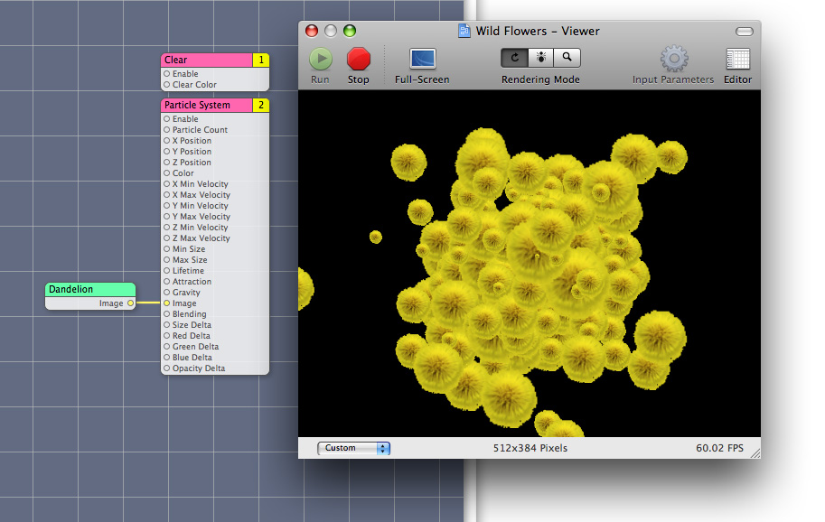
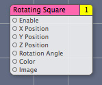
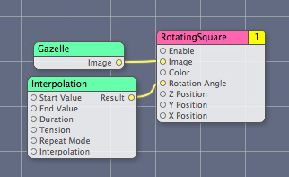
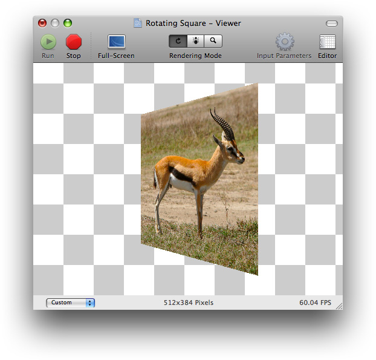

> 导航：[总目录](../../../README.md) · [documentation](../../../_indexes/documentation.md) · [Quartz Composer Custom Patch Programming Guide](Introduction%20to%20Quartz%20Composer%20Custom%20Patch%20Programming%20Guide.md)


[Next](Glossary.md)[Previous](Writing%20Image%20Processing%20Patches.md)

# Writing Consumer Patches

A consumer patch pulls (or _consumes_) data from processor and provider patches, operates on the data, and renders the result to a destination, typically a screen but it can be another destination. This chapter discusses some best practices for using OpenGL in a Quartz Composer custom patch and then shows how to create a custom consumer patch that renders an OpenGL texture to a quad.

__Figure 4-1__  Consumer patches render to a destination



You need to know OpenGL programming to understand this chapter. If you don’t know OpenGL, but want to learn, these books provide a good starting point:

- [OpenGL Programming Guide](http://www.opengl.org/documentation/red_book/), by the OpenGL Architecture Review Board; otherwise known as "The Redbook.”
- [OpenGL Reference Manual](http://www.opengl.org/documentation/blue_book/), by the OpenGL Architecture Review Board; otherwise known as "The Bluebook.”

Although these books provide a solid foundation in OpenGL, you’ll also need to read _[OpenGL Programming Guide for Mac](../OpenGL%20Programming%20Guide%20for%20Mac/About%20OpenGL%20for%20OS%20X.md#apple-f4xwc4dqnrsv64tfmyxwi33df52wszbpkridimbqgaytsobx)_ for details on how to get the best performance on the Macintosh platform using the most recent OpenGL extensions and the OS X OpenGL frameworks.

Using OpenGL in a custom patch requires a bit more setup work than what’s needed for patches that don’t use OpenGL, but not much. You need to set the OpenGL context to the execution context of your custom patch. The setup requires two steps:

1. Include the `CGLMacro.h` file.
2. Set the OpenGL context to the execution context of the custom patch using this line of code:

```
CGLContextObj cgl_ctx = [context CGLContextObj];
```

The first step is done for you when you use an Xcode project template for Quartz Composer plug-ins. When you include the CGL macro header file, you can then use a local context variable to cache the current renderer. The local cache eliminates the need for OpenGL to perform a global context and renderer lookup for each command it executes, thereby reducing overhead and improving performance.

The [CGLContextObj](https://developer.apple.com/documentation/quartz/qcplugincontext/1488849-cglcontextobj) method of the [QCPlugInContext](https://developer.apple.com/documentation/quartz/qcplugincontext) protocol gets an OpenGL context that you can draw to from within the execution method of your custom patch. (See _[QCPlugInContext Protocol Reference](https://developer.apple.com/documentation/quartz/qcplugincontext)_.) After setting the OpenGL context (`cgl_ctx`), Quartz Composer sends all OpenGL commands to the OpenGL execution context of the custom patch.

The OpenGL code in your custom patch benefits from any programming techniques that improve the performance of any OpenGL code. In other words, there are no special requirements for OpenGL code that’s part of a custom patch. However, you’ll want to save and restore all state changes except the ones that are part of `GL_CURRENT_BIT` (RGBA color, color index, normal vector, texture coordinates, and so forth). You may also want to take a look at the chapter “Improving Performance” in _[OpenGL Programming Guide for Mac](../OpenGL%20Programming%20Guide%20for%20Mac/About%20OpenGL%20for%20OS%20X.md#apple-f4xwc4dqnrsv64tfmyxwi33df52wszbpkridimbqgaytsobx)_.

The Rotating Square custom patch renders a texture to an OpenGL quad that you can animate. It has eight input parameters:

- `Enable` is a port that Quartz Composer automatically creates for a consumer patch.
- The next three—`X Position`, `Y Position`, and `Z Position`—control the location of the center of the square.
- `Rotation Angle` determines the angle of rotation of the quad.
- `Color` is the background color for the quad.
- `Image` is converted to a texture and scaled to fit the quad. See [Getting Images From an Input Port](Writing%20Image%20Processing%20Patches.md#apple-f4xwc4dqnrsv64tfmyxwi33df52wszbpkridimbqga2doobxfvbuqnznknltg).

The resulting patch is shown in Figure 4-2.

__Figure 4-2__  The Rotating Square custom patch



Follow these steps to create the Rotating Square custom patch:

1. Open Xcode and choose File > New Project.
2. In the New Project window, choose Standard Apple Plug-ins > Quartz Composer Plug-in and click Next.
3. Enter `RotatingSquare` in the Project Name text field and click Next.
4. Open the `RotatingSquarePlugin.h` file.

   Modify the interface file so that it has four dynamic Objective-C properties: x and y values, a color, and an input image.

```objc
#import <Quartz/Quartz.h>

@interface RotatingSquarePlugIn : QCPlugIn
{
}
// Declare four property input ports of type Number with the
// keys inputX, inputY, inputZ, and inputAngle
@property double inputX;
@property double inputY;
@property double inputZ;
@property double inputAngle;
// Declare a property input port of type Color with the key inputColor
@property(assign) CGColorRef inputColor;
// Declare a property input port of type Image with the key inputImage
@property(assign) id<QCPlugInInputImageSource> inputImage;
@end
```
5. Save and close the `RotatingSquarePlugIn.h` file.
6. Open the `RotatingPlugin.m` file. To ensure the best performance with OpenGL, make sure the file contains the following statement:

```objc
#import <OpenGL/CGLMacro.h>
```

   You’ll set up the OpenGL context later, in the execute method.
7. Immediately after the implementation statement, add this directive so that Quartz Composer handles the implementation of the properties:

```
@dynamic inputX, inputY, inputZ, inputAngle, inputColor, inputImage;
```
8. Add a space to separate the words in the name. Then modify the description for the custom patch.

   When you are done, the two `#define` statements to look as follows:

```
#define    kQCPlugIn_Name @"Rotating Square"
#define    kQCPlugIn_Description  @"Renders a colored square that you can animate."
```
9. Next you’ll write the methods needed to implement the `RotatingSquarePlugIn` subclass. The [attributes](https://developer.apple.com/documentation/quartz/qcplugin/1488869-attributes) method provided in the template should already look like this:

```objc
+ (NSDictionary*) attributes
{
    return [NSDictionary dictionaryWithObjectsAndKeys:
                kQCPlugIn_Name,QCPlugInAttributeNameKey,
                kQCPlugIn_Description,QCPlugInAttributeDescriptionKey,
                nil];
}
```
10. Modify the [attributesForPropertyPortWithKey:](https://developer.apple.com/documentation/quartz/qcplugin/1488766-attributesforpropertyportwithkey) method so that it returns a dictionary for each input parameter. The port attribute key name is what appears in Quartz Composer as a label for the custom patch port.

    The method should look as follows:

```objc
+ (NSDictionary*) attributesForPropertyPortWithKey:(NSString*)key
{
    if([key isEqualToString:@"inputX"])
        return [NSDictionary dictionaryWithObjectsAndKeys:
                @"X Position", QCPortAttributeNameKey,
                nil];
    if([key isEqualToString:@"inputY"])
        return [NSDictionary dictionaryWithObjectsAndKeys:
                @"Y Position", QCPortAttributeNameKey,
                nil];
    if([key isEqualToString:@"inputZ"])
        return [NSDictionary dictionaryWithObjectsAndKeys:
                @"Z Position", QCPortAttributeNameKey,
                nil];
    if([key isEqualToString:@"inputAngle"])
        return [NSDictionary dictionaryWithObjectsAndKeys:
                @"Rotation Angle", QCPortAttributeNameKey,
                nil];
    if([key isEqualToString:@"inputColor"])
        return [NSDictionary dictionaryWithObjectsAndKeys:
                @"Color", QCPortAttributeNameKey,
                nil];
    if([key isEqualToString:@"inputImage"])
        return [NSDictionary dictionaryWithObjectsAndKeys:
            @"Image", QCPortAttributeNameKey, nil];

    return nil;
}
```
11. Make sure the `executionMode` method returns `kQCPlugInExecutionModeConsumer` to indicate that the custom patch is a consumer. Among other things, this causes Quartz Composer to add an Enable input port to the resulting patch.

```objc
+ (QCPlugInExecutionMode) executionMode
{
    return kQCPlugInExecutionModeConsumer;
}
```
12. Make sure that the `timeMode` returns `kQCPlugInTimeModeNone`.

    This is the default, so you should not need to make any changes to the provided code.

    This custom patch executes only when the input values change.

```objc
+ (QCPlugInTimeMode) timeMode
{
    return kQCPlugInTimeModeNone;
}
```
13. Implement the execution method for the execution context. This is where the OpenGL command stream is defined. You need to define the CGL context here.

```objc
- (BOOL) execute:(id<QCPlugInContext>)context
            atTime:(NSTimeInterval)time
            withArguments:(NSDictionary*)arguments
{
    // Define a context and set it. This line causes OpenGL to use macros.
    CGLContextObj     cgl_ctx = [context CGLContextObj];
    id<QCPlugInInputImageSource>    image;
    GLuint            textureName;
    GLint             saveMode;
    const CGFloat*    colorComponents;
    GLenum      error;

    if(cgl_ctx == NULL)
        return NO;
    // Copy the image on the input port to a local variable.
    image = self.inputImage;

    // Get a texture from the image in the context color space
    if(image && [image lockTextureRepresentationWithColorSpace:([image shouldColorMatch] ? [context colorSpace] :
                        [image imageColorSpace])
               forBounds:[image imageBounds]])
        textureName = [image textureName];
    else
        textureName = 0;

    // Save and set the modelview matrix.
    glGetIntegerv(GL_MATRIX_MODE, &saveMode);
    glMatrixMode(GL_MODELVIEW);
    glPushMatrix();
    // Translate the matrix
    glTranslatef(self.inputX, self.inputY, self.inputZ);
    // Rotate the matrix
    glRotatef(self.inputAngle, 0.0, 1.0, 0.0);

    // Bind the texture to a texture unit
    if(textureName) {
        [image bindTextureRepresentationToCGLContext:cgl_ctx
                                         textureUnit:GL_TEXTURE0
                                normalizeCoordinates:YES];
   }
    // Get the color components (RGBA) from the input color port.
    colorComponents = CGColorGetComponents(self.inputColor);
    // Set the color.
    glColor4f(colorComponents[0], colorComponents[1], colorComponents[2], colorComponents[3]);

    // Render the textured quad by mapping the texture coordinates to the vertices
    glBegin(GL_QUADS);
        glTexCoord2f(1.0, 1.0);
        glVertex3f(0.5, 0.5, 0); // upper right
        glTexCoord2f(0.0, 1.0);
        glVertex3f(-0.5, 0.5, 0); // upper left
        glTexCoord2f(0.0, 0.0);
        glVertex3f(-0.5, -0.5, 0); // lower left
        glTexCoord2f(1.0, 0.0);
        glVertex3f(0.5, -0.5, 0); // lower right
    glEnd();

    // Unbind the texture from the texture unit.
    if(textureName)
        [image unbindTextureRepresentationFromCGLContext:cgl_ctx
                                             textureUnit: GL_TEXTURE0];

    // Restore the modelview matrix.
    glMatrixMode(GL_MODELVIEW);
    glPopMatrix();
    glMatrixMode(saveMode);

    // Check for OpenGL errors and log them if there are errors.
    if(error = glGetError())
        [context logMessage:@"OpenGL error %04X", error];

    // Release the texture.
    if(textureName)
        [image unlockTextureRepresentation];

    return (error ? NO : YES);
}
```
14. Open the `Info.plist` file and make sure the following key is an entry in the dictionary:

```
<key>QCPlugInClasses</key>
<array>
    <string>RotatingSquarePlugIn</string>
</array>
```

    If you want, customize the bundle identifier. Then save and close the file.
15. Under Targets, choose Build & Copy. Then, click Build Build & Copy from the Action pop-up menu.

    When you build using this option, Xcode copies the successfully built plug-in to `~/Library/Graphics/Quartz Composer Plug-Ins`.
16. Open Quartz Composer and search for the Rotating Square custom patch in the Patch Creator.
17. Create a composition to test the custom patch. Try setting the color and the positions. Add an interpolation patch to animate the square. To check the image input, you can drag an image directly to the editor and then connect the image to the patch, as shown below.

    

    Keep in mind that if the image is not square, the Rotating Square patch maps the coordinates to fit the image in the square, distorting the image if necessary.

    

[Next](Glossary.md)[Previous](Writing%20Image%20Processing%20Patches.md)

