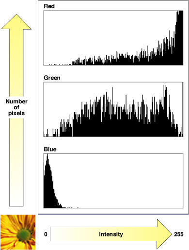
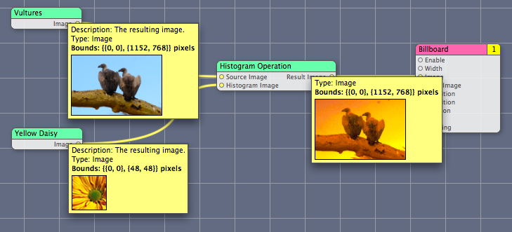

> 导航：[总目录](../../../README.md) · [documentation](../../../_indexes/documentation.md) · [Quartz Composer Custom Patch Programming Guide](Introduction%20to%20Quartz%20Composer%20Custom%20Patch%20Programming%20Guide.md)


[Next](Writing%20Consumer%20Patches.md)[Previous](Writing%20Processor%20Patches.md)

# Writing Image Processing Patches

The Quartz Composer framework defines protocols for getting image data from input ports and providing image data to output ports. These protocols eliminate the need to use explicit image data types such as [CIImage](https://developer.apple.com/documentation/coreimage/ciimage) or `CGImage` objects. Using protocols ensures there won’t be any impedance mismatches between the image output port of one patch and the image input port of another.

This chapter describes how to implement the [QCPlugInInputImageSource](https://developer.apple.com/documentation/quartz/qcplugininputimagesource) and `QCPlugInOutputImageProvider` protocols. Then it provides step-by-step instructions for creating a custom image processing patch that uses two image input ports and one image output port.

The [QCPlugInInputImageSource](https://developer.apple.com/documentation/quartz/qcplugininputimagesource) protocol converts an input image from whatever format it’s in to either a memory buffer or OpenGL texture representation. When you need to access the pixels in an image, you simply convert the image to a representation (texture or buffer) using one of the methods defined by the protocol. Use a texture representation to process image data on the GPU. Use a buffer representation to process image data on the CPU.

To create an image input port as an Objective-C 2.0 property, declare it as follows:

```objc
@property(dynamic) id<QCPlugInInputImageSource> inputImage;
```

To create an image input port dynamically, use the type `QCPortTypeImage`:

```
[self addInputPortWithType:QCPortTypeImage
                    forKey:@"inputImage"
            withAttributes:nil];
```

You convert input images to textures only when you plan to use OpenGL to process the data, as OpenGL is the software interface to the GPU. To use input images as textures you need to perform these steps:

1. Lock the texture representation using `lockTextureRepresentationWithColorSpace:forBounds:`. This method creates a read-only OpenGL texture from a subregion of the input image.
2. Bind the texture to a texture unit. You can perform this step entirely with OpenGL commands, but it is much easier to use the convenience method `bindTextureRepresentationToCGLContext:textureUnit:normalizeCoordinates:` which binds the texture to the provided texture unit (`GL_TEXTURE0`, and so on). It also loads the texture matrix onto the texture stack, scaling and flipping the coordinates if necessary, as long as you pass `YES` as the `normalizeCoordinates` argument.
3. Use the texture in whatever way is appropriate for your application.
4. When you no longer need the texture, unbind it from its texture unit. If you used the binding convenience method in step 2, then you must call the `unbindTextureRepresentationFromCGLContext:textureUnit` convenience method.
5. Release the OpenGL texture representation of the input image by calling the [unlockTextureRepresentation](https://developer.apple.com/documentation/quartz/qcplugininputimagesource/1488856-unlocktexturerepresentation) method.

In addition to these steps, there are other tasks you should perform when using OpenGL. [Writing Consumer Patches](Writing%20Consumer%20Patches.md#apple-f4xwc4dqnrsv64tfmyxwi33df52wszbpkridimbqga2doobxfvbuqnjnknltc) provides tips for using OpenGL in a custom patch and shows how to bind a texture and render it to a destination.

You convert images to a buffer representation only if your custom patch manipulates input images on the CPU. To use input image data in a buffer you need to perform these steps:

1. Create and lock a buffer representation of the image using the [lockBufferRepresentationWithPixelFormat:colorSpace:forBounds:](https://developer.apple.com/documentation/quartz/qcplugininputimagesource/1488746-lockbufferrepresentationwithpixe) method, which creates a read-only memory buffer from a subregion of the input image. The pixel format and color space must be compatible.
2. Use the image data. You can get the base address of the image buffer with the [bufferBaseAddress](https://developer.apple.com/documentation/quartz/qcplugininputimagesource/1488774-bufferbaseaddress) method and the number of bytes per row with the [bufferBytesPerRow](https://developer.apple.com/documentation/quartz/qcplugininputimagesource/1488834-bufferbytesperrow) method.
3. When you no longer need the image buffer, call the [unlockBufferRepresentation](https://developer.apple.com/documentation/quartz/qcplugininputimagesource/1488764-unlockbufferrepresentation) to release it.

_[QCPlugInInputImageSource Protocol Reference](https://developer.apple.com/documentation/quartz/qcplugininputimagesource)_ provides more information on these methods as well as the methods that retrieve texture and image buffer information—such as the bounds, height, width, and color space. [Histogram Operation: Modifying Color in an Image](#apple-f4xwc4dqnrsv64tfmyxwi33df52wszbpkridimbqga2doobxfvbuqnznknlte) shows how to convert an input image to an image buffer.

The `QCPlugInOutputImageProvider` protocol defines methods for rendering image data to an image buffer or to a texture. Quartz Composer calls the methods you implement only when the output image is needed. This “lazy” approach to supplying the output image is efficient and ensures the best performance possible.

If your custom patch has an image output port, you need to implement the appropriate methods for rendering image data and to supply information about the rendering destination and the image bounds.

To create an image output port as an Objective-C 2.0 property, declare it as follows:

```objc
@property(assign) id<QCPlugInOutputImageProvider> outputImage;
```

To create an image input port dynamically use the type `QCPortTypeImage`:

```
[self addOutputPortWithType:QCPortTypeImage
                    forKey:@"outputImage"
           withAttributes:nil];
```

To write images to that port, you need to perform these steps:

1. Create an internal class that represents the output image.

```objc
@interface MyOutputImageProvider : NSObject <QCPlugInOutputImageProvider>
{
  // Declare instance variables, as appropriate
}
```
2. Implement the methods that provide information about the image—[imageBounds](https://developer.apple.com/documentation/quartz/qcpluginoutputimageprovider/1488867-imagebounds) [imageColorSpace](https://developer.apple.com/documentation/quartz/qcpluginoutputimageprovider/1488715-imagecolorspace).
3. Implement the methods that provide information about the rendering destination. If your custom patch renders to an image buffer, you must implement the[supportedBufferPixelFormats](https://developer.apple.com/documentation/quartz/qcpluginoutputimageprovider/1488709-supportedbufferpixelformats) method. If it renders to a texture, you must implement the`supportedDrawablePixelFormats` and [canRenderWithCGLContext:](https://developer.apple.com/documentation/quartz/qcpluginoutputimageprovider/1488804-canrenderwithcglcontext) methods.
4. Implement one of the methods for rendering to a destination. If your custom patch renders to an image buffer, you must implement the [renderToBuffer:withBytesPerRow:pixelFormat:forBounds:](https://developer.apple.com/documentation/quartz/qcpluginoutputimageprovider/1488841-render) method. If your custom patch renders to a texture, you must implement the `renderWithCGLContext:toDrawableWithPixelFormat:forBounds:` method.

See _[QCPlugInOutputImageProvider Protocol Reference](https://developer.apple.com/documentation/quartz/qcpluginoutputimageprovider)_ for additional details on these methods.

When Quartz Composer calls [renderToBuffer:withBytesPerRow:pixelFormat:forBounds:](https://developer.apple.com/documentation/quartz/qcpluginoutputimageprovider/1488841-render), it passes your method a base address, the number of row bytes, the pixel format of the image data, and the bounds of the subregion. Your method then writes pixels to the supplied image buffer. [Histogram Operation: Modifying Color in an Image](#apple-f4xwc4dqnrsv64tfmyxwi33df52wszbpkridimbqga2doobxfvbuqnznknlte) provides an example of how to implement this method.

When Quartz Composer calls `renderWithCGLContext:toDrawableWithPixelFormat:forBounds:`, it automatically sets the viewport to the dimensions of the image, and the projection and modelview matrices to the identity matrix. Prior to rendering, you must save all the OpenGL states that you plan to change except the ones defined by `GL_CURRENT_BIT`. When you are done rendering, you must restore the saved OpenGL states.

This section shows how to write a custom patch that has two image input ports and one image output port. The patch computes a histogram for one of the input images, and uses that histogram to modify the colors in the other input image. It outputs the color-modified image. This patch is a bit more complex than those described in the rest of the book. Before following the instructions in this section, make sure that you’ve read [Writing Processor Patches](Writing%20Processor%20Patches.md#apple-f4xwc4dqnrsv64tfmyxwi33df52wszbpkridimbqga2doobxfvbuqnbnknltc) and are familiar with the basic tasks for setting up and creating a custom patch.

The Histogram Operation custom patch described in this section is similar to, but not exactly like, the Histogram Operation sample project provided with the Developer Tools for OS X v10.5 in:

`/Developer/Examples/Quartz Composer/Plugins`

You might also want to take a look at that sample project.

An RGBA histogram is a count of the values at each intensity level, for each pixel component (red, green, blue, and alpha). For an image with a bit depth of 8 bits, each component can have a value from 0 to 255. Figure 3-1 shows an RGB histogram for a daisy image. The intensity values are plotted on the x-axis and the number of pixels are on the y-axis. The image is opaque, so there is no need to show the alpha component in this figure.

__Figure 3-1__  An RGB histogram for an image of a daisy



The image data for this patch is processed using the CPU, so you’ll see how to create an image buffer representation and render to an image buffer by defining a custom output image provider. (You can find out how to create a texture representation by reading [Writing Consumer Patches](Writing%20Consumer%20Patches.md#apple-f4xwc4dqnrsv64tfmyxwi33df52wszbpkridimbqga2doobxfvbuqnjnknltc).) You’ll also see how to use the Accelerate framework to compute a histogram.

Figure 3-2 shows a composition that uses the Histogram Operation custom patch. By looking at the thumbnail images, you can get an idea of how the patch modifies the source image using the histogram image.

__Figure 3-2__  A Quartz composition that uses the Histogram Operation custom patch



The Accelerate framework is a high-performance vector-accelerated library of routines. It’s ideal to use for custom patches that perform intensive computations. You’ll use the framework’s vImage library to compute a histogram. The function [vImageHistogramCalculation_ARGB8888](https://developer.apple.com/documentation/accelerate/1545743-vimagehistogramcalculation_argb8) calculates histograms for the alpha, red, green, and blue channels (see Listing 3-1). It takes an image buffer, an array to store histogram data, and a flag to indicate whether to turn off vImage internal tiling routines . (See _vImage Reference Collection_.)

__Listing 3-1__  Prototype for the vImage histogram function

```
vImage_Error vImageHistogramCalculation_ARGB8888 (
                      const vImage_Buffer *src,
                      vImagePixelCount *histogram[4],
                      vImage_Flags flags
);
```

The steps for creating the Histogram Operation custom patch are in these sections:

- [Create the Xcode Project](#apple-f4xwc4dqnrsv64tfmyxwi33df52wszbpkridimbqga2doobxfvbuqnznknltk)
- [Create the Interface](#apple-f4xwc4dqnrsv64tfmyxwi33df52wszbpkridimbqga2doobxfvbuqnznknltm)
- [Modify the Methods for the PlugIn Class](#apple-f4xwc4dqnrsv64tfmyxwi33df52wszbpkridimbqga2doobxfvbuqnznknlto)
- [Implement the Methods for the Histogram Object](#apple-f4xwc4dqnrsv64tfmyxwi33df52wszbpkridimbqga2doobxfvbuqnznknltq)
- [Write Methods for the Output Image Provider](#apple-f4xwc4dqnrsv64tfmyxwi33df52wszbpkridimbqga2doobxfvbuqnznknlts)
- [Write the Execution Methods for the Plug-in Class](#apple-f4xwc4dqnrsv64tfmyxwi33df52wszbpkridimbqga2doobxfvbuqnznknltcma)

To create the Histogram Operation Xcode project, follow these steps.:

1. Open Xcode and choose File > New Project.
2. In the New Project window, choose Standard Apple Plug-ins > Quartz Composer Plug-in and click Next.
3. Enter `HistogramOperation` in the Project Name text field and click Finish.
4. Choose Project > Add to Project, navigate to the Accelerate Framework, and click Add.

   This framework is in `System/Library/Frameworks`.
5. In the sheet that appears, click Add.

If you created the custom patches in [Writing Processor Patches](Writing%20Processor%20Patches.md#apple-f4xwc4dqnrsv64tfmyxwi33df52wszbpkridimbqga2doobxfvbuqnbnknltc), most of the steps in this section should be familiar to you.

1. Open the `HistogramOperationPlugin.h` file.
2. Add a statement to import the Accelerate framework.

```objc
#import <Accelerate/Accelerate.h>
```
3. Declare two properties for image input ports—one for the source image that the custom patch modifies and another for an image used for the histogram. Declare a property for the output image port. Your code should look as follows:

```objc
#import <Quartz/Quartz.h>
#import <Accelerate/Accelerate.h>

@interface HistogramOperationPlugIn : QCPlugIn
{

}
@property(assign) id<QCPlugInInputImageSource> inputSourceImage;
@property(assign) id<QCPlugInInputImageSource> inputHistogramImage;
@property(assign) id<QCPlugInOutputImageProvider> outputResultImage;
@end
```
4. Add the interface for a class that computes an RGBA histogram from an image.

   The `Histogram` object holds the image source from which you’ll compute a histogram. In addition to an image source instance variable, you need to create four instance variables to store a count of the color component and alpha values—red, green, blue, and alpha.

   You need to write a method that initializes the image instance variable. You’ll need another method to compute the histogram values. Declare these methods now; you’ll write them later.

   Your code should look similar to the following:

```objc
@interface Histogram : NSObject
{
    id<QCPlugInInputImageSource>    _image;

    vImagePixelCount                _histogramA[256];
    vImagePixelCount                _histogramR[256];
    vImagePixelCount                _histogramG[256];
    vImagePixelCount                _histogramB[256];
    CGColorSpaceRef                 _colorSpace;
}
- (id) initWithImageSource:(id<QCPlugInInputImageSource>)image colorSpace:(CGColorSpaceRef)colorSpace;
- (BOOL) getRGBAHistograms:(vImagePixelCount**)histograms;
@end
```
5. In the interface for the `HistogramOperationPlugIn` class, add an instance variable for a `Histogram` object. You’ll use this to cache the image histogram.

   The interface should look like this:

```objc
@interface HistogramOperationPlugIn : QCPlugIn
{
    Histogram*                        _cachedHistogram;
}
```

   Note that the interface for the `Histogram` class must either be specified before the `HistogramOperationPlugIn` class or the class must be declared using:

   `@class Histogram;`
6. Add the interface for an internal class for the image provider, to represent the output image produced by the custom patch.

   This class has two instance variable—the input image used to create a histogram, and the `Histogram` object that you’ll use to modify the source image. You also need to declare a method to initialize the image instance variable. You’ll write the `initWithImageSource:histogram:` method later. When done, your code should look like this:

```objc
@interface HistogramImageProvider : NSObject <QCPlugInOutputImageProvider>
{
    id<QCPlugInInputImageSource>    _image;
    Histogram*                      _histogram;
}
- (id) initWithImageSource:(id<QCPlugInInputImageSource>)image
                 histogram:(Histogram*)histogram;
@end
```
7. Close the `HistogramOperationPlugIn.h` file.

Next you’ll modify the methods needed to implement the `HistogramOperationPlugIn` class.

1. Open the `HistogramOperationPlugIn.m` file.
2. Just after the implementation statement for `HistogramOperationPlugin`, declare the input and output properties as dynamic. Quartz Composer will handle their implementation.

```
@dynamic inputSourceImage, inputHistogramImage, outputResultImage;
```
3. Modify the description and name for the custom patch.

```
#define    kQCPlugIn_Name  @"Histogram Operation"
#define kQCPlugIn_Description @"Alters a source image according to the histogram of another image."
```
4. You do not need to modify the default `attributes` method supplied in the template, which should look as follows:

```objc
+ (NSDictionary*) attributes
{
    return [NSDictionary dictionaryWithObjectsAndKeys:
                kQCPlugIn_Name,QCPlugInAttributeNameKey,
                kQCPlugIn_Description,QCPlugInAttributeDescriptionKey,
                nil];
}
```
5. Modify the [attributesForPropertyPortWithKey:](https://developer.apple.com/documentation/quartz/qcplugin/1488766-attributesforpropertyportwithkey) so that it returns a dictionary for each input and output parameter.

```objc
+ (NSDictionary*) attributesForPropertyPortWithKey:(NSString*)key
{

  if([key isEqualToString:@"inputSourceImage"])
    return [NSDictionary dictionaryWithObjectsAndKeys:@"Source Image",
                         QCPortAttributeNameKey, nil];
  if([key isEqualToString:@"inputHistogramImage"])
    return [NSDictionary dictionaryWithObjectsAndKeys:@"Histogram Image",
                          QCPortAttributeNameKey, nil];
  if([key isEqualToString:@"outputResultImage"])
    return [NSDictionary dictionaryWithObjectsAndKeys:@"Result Image",
                          QCPortAttributeNameKey, nil];
  return nil;
}
```
6. Make sure the [executionMode](https://developer.apple.com/documentation/quartz/qcplugin/1488695-executionmode) method returns `kQCPlugInExecutionModeProcessor`.

```objc
+ (QCPlugInExecutionMode) executionMode
{
    return kQCPlugInExecutionModeProcessor;
}
```
7. Make sure the [timeMode](https://developer.apple.com/documentation/quartz/qcplugin/1488805-timemode) method returns `kQCPlugInTimeModeNone`.

```objc
+ (QCPlugInTimeMode) timeMode
{
    return kQCPlugInTimeModeNone;
}
```


Before you implement the execution methods for `HistogramOperationPlugIn`, you’ll implement the methods needed for the `Histogram` class—one to initialize the object with an image, a method to release the image when it is no longer needed, and another method that creates an image buffer from an input image and uses vImage to compute a histogram.

You need to add the code in this section between these statements:

```objc
@implementation Histogram
@end
```

1. Write an initialize method that retains the image used to calculate the histogram.

```objc
- (id) initWithImageSource:(id<QCPlugInInputImageSource>)image colorSpace:(CGColorSpaceRef)colorSpace
{
   // Make sure there is an image.
  if(!image) {
        [self release];
        return nil;
    }

    // Keep the image and the processing color space around.
    self = [super init];
    if (self) {
       _image = [(id)image retain];
       _colorSpace = CGColorSpaceRetain(colorSpace);
     }
    return self;
}
```
2. Write a method that releases the histogram image when it’s no longer needed.

```objc
- (void) dealloc
{
    [(id)_image release];
    CGColorSpaceRelease(_colorSpace);

    [super dealloc];
}
```
3. Write a method that gets and stores histogram data for each pixel component.

   In this method, you need to get a buffer representation of the image on the histogram image input port.

```objc
- (BOOL) getRGBAHistograms:(vImagePixelCount**)histograms
{
    vImage_Buffer                    buffer;
    vImage_Error                    error;

    if(_image) {
        // Get a buffer representation from the image
        if(![_image  lockBufferRepresentationWithPixelFormat:QCPlugInPixelFormatARGB8
                     colorSpace:[_image imageColorSpace]
                     forBounds:[_image imageBounds]])
            return NO;

        // Set up the vImage buffer
        buffer.data = (void*)[_image bufferBaseAddress];
        buffer.rowBytes = [_image bufferBytesPerRow];
        buffer.width = [_image bufferPixelsWide];
        buffer.height = [_image bufferPixelsHigh];
        // Set up the vImage histogram array
        histograms[0] = _histogramA;
        histograms[1] = _histogramR;
        histograms[2] = _histogramG;
        histograms[3] = _histogramB;
        // Call the vImage function to compute the histograms for the image data
        error = vImageHistogramCalculation_ARGB8888(&buffer, histograms, 0);

        // Now that you have the histogram, you can release the buffer
        [_image unlockBufferRepresentation];
        // Handle errors, if there are any
        if(error != kvImageNoError)
            return NO;

        // You no longer need the histogram image, so release it
        [(id)_image release];
        _image = nil;
    }

    // Reverse the histogram data
    histograms[0] = _histogramR;
    histograms[1] = _histogramG;
    histograms[2] = _histogramB;
    histograms[3] = _histogramA;

    return YES;
}
```


To make the code more readable, place the code in this section between these statements:

```objc
@implementation HistogramOperationPlugIn (Execution)
@end
```

1. Write the execute method for the plug-in class.

   This method is invoked by Quartz Composer whenever either of the input ports change. The method updates the histogram image if it changed and creates a `HistogramImageProvider` object from the source image and the cached histogram.

```objc
- (BOOL) execute:(id<QCPlugInContext>)context atTime:(NSTimeInterval)time withArguments:(NSDictionary*)arguments
{
    id<QCPlugInInputImageSource>    image;
    HistogramImageProvider*         provider;
    CGColorSpaceRef                 colorSpace;

    // If the histogram input image changes, update the cached histogram.
    if([self didValueForInputKeyChange:@"inputHistogramImage"]) {
        [_cachedHistogram release];
        if(image = self.inputHistogramImage) {
           colorSpace = (CGColorSpaceGetModel([image imageColorSpace]) == kCGColorSpaceModelRGB ?
               [image imageColorSpace] : [context colorSpace]);
           _cachedHistogram = [[Histogram alloc]
                    initWithImageSource:self.inputHistogramImage
                    colorSpace:colorSpace];
        }
        else
            _cachedHistogram = nil;
    }

    // Check for a histogram and a source image, if they both exist,
    // create the provider and initialize it with the source image and histogram
    if(_cachedHistogram && (image = self.inputSourceImage)) {
        provider = [[HistogramImageProvider alloc]
                        initWithImageSource:sourceImage
                        histogram:_cachedHistogram];
        // Bail out if the provider doesn't exist
        if(provider == nil)
          return NO;
        // Otherwise, set the output image to the provider
        self.outputResultImage = provider;
        // Release the provider
        [provider release];
    }
    else
       // If the histogram and source image don't both exist,
       // set the output image to nil
       self.outputResultImage = nil;

    return YES;
}
```
2. Implement the stop execution method.

   This method is optional. But, for this custom patch, you need to release the cached histogram when the custom patch stops executing. So you must implement it.

```objc
- (void) stopExecution:(id<QCPlugInContext>)context
{
    [_cachedHistogram release];
    _cachedHistogram = nil;
}
```


All of the code in this section needs to be added between these statements:

```objc
@implementation HistogramImageProvider
@end
```

The output image provider does all the work to render the image. Recall that Quartz Composer invokes your render method only when an output image is needed, thereby avoiding unnecessary computations.

1. Write a method that initializes the image provider with a source image an a previously computed histogram.

```objc
- (id) initWithImageSource:(id<QCPlugInInputImageSource>)image histogram:(Histogram*)histogram
{
    // Check to make sure  an image and a histogram exists.
    if(!image || !histogram) {
        [self release];
        return nil;
    }

    // Keep the image and histogram around.
    self = [super init];
    if (self) {
        _image = [(id)image retain];
        _histogram = [histogram retain];
    }

    return self;
}
```
2. Implement a `dealloc` method that releases the image and the histogram.

```objc

- (void) dealloc
{
    [(id)_image release];
    [_histogram release];

    [super dealloc];
}
```
3. Implement a method to inform Quartz Composer of the bounds of the image.

```objc
- (NSRect) imageBounds
{
    // This image has the same bounds as the source image.
    return [_image imageBounds];
}
```
4. Implement a method to inform Quartz Composer of the color space used by the image.

```objc
- (CGColorSpaceRef) imageColorSpace
{
    // Preserve the original image color space.
    return [_image imageColorSpace];
}
```
5. Implement a method to inform Quartz Composer of the supported pixel formats.

   You need to support ARGB8, BGRA8 and RGBAf. Use the constants supplied in the Quartz Composer framework.

```objc
- (NSArray*) supportedBufferPixelFormats
{
    /* Support for only ARGB8, BGRA8 and RGBAf */
    return [NSArray arrayWithObjects:QCPlugInPixelFormatARGB8,
                                      QCPlugInPixelFormatBGRA8,
                                      QCPlugInPixelFormatRGBAf,
                                      nil];
}
```
6. Implement the render to buffer method.

   Quartz Composer invokes this method whenever your custom patch needs to produce an output image. This happens when the image output port is connected to an image input port and when one of the input images change.

```objc
- (BOOL) renderToBuffer:(void*)baseAddress
        withBytesPerRow:(NSUInteger)rowBytes
            pixelFormat:(NSString*)format
              forBounds:(NSRect)bounds
{
    vImage_Buffer        inBuffer,
                         outBuffer;
    vImage_Error         error;
    const vImagePixelCount*     histograms[4];
    const vImagePixelCount*     temp;

    // Retrieve histogram data. This triggers computation of the
    // histogram if necessary.
    if(![_histogram getRGBAHistograms:(vImagePixelCount**)histograms])
         return NO;

    // Get a buffer representation for the source image.
    if(![_image lockBufferRepresentationWithPixelFormat:format
                                             colorSpace:[_image imageColorSpace]
                                              forBounds:bounds])
         // Bail out if the buffer representation fails
         return NO;

    // Apply the previously computed histogram to the source image and
    // render the result to the output buffer
    inBuffer.data = (void*)[_image bufferBaseAddress];
    inBuffer.rowBytes = [_image bufferBytesPerRow];
    inBuffer.width = [_image bufferPixelsWide];
    inBuffer.height = [_image bufferPixelsHigh];
    outBuffer.data = baseAddress;
    outBuffer.rowBytes = rowBytes;
    outBuffer.width = [_image bufferPixelsWide];
    outBuffer.height = [_image bufferPixelsHigh];
    // Call the vImage histogram function that's appropriate
    // for the pixel format.
    if([format isEqualToString:QCPlugInPixelFormatRGBAf])
        error = vImageHistogramSpecification_ARGBFFFF(&inBuffer, &outBuffer,
                                                        NULL, histograms,
                                                        256, 0.0, 1.0, 0);
    else if([format isEqualToString:QCPlugInPixelFormatARGB8]) {
        // You need to convert the histogram from RGBA to ARGB
        temp = histograms[3];
        histograms[3] = histograms[2];
        histograms[2] = histograms[1];
        histograms[1] = histograms[0];
        histograms[0] = temp;
        error = vImageHistogramSpecification_ARGB8888(&inBuffer, &outBuffer,
                                                      histograms, 0);
    }
    else if([format isEqualToString:QCPlugInPixelFormatBGRA8]) {
        // You need to convert the histogram from RGBA to BGRA
        temp = histograms[0];
        histograms[0] = histograms[2];
        histograms[2] = temp;
        error = vImageHistogramSpecification_ARGB8888(&inBuffer, &outBuffer,
                                                      histograms, 0);
    }
    else
        // This should never happen.
        error = -1;

    // Release the buffer representation.
    [_image unlockBufferRepresentation];
    // Check for vImage errors.
    if(error != kvImageNoError)
          return NO;
    // Success!
    return YES;
}
```

[Next](Writing%20Consumer%20Patches.md)[Previous](Writing%20Processor%20Patches.md)

