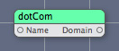
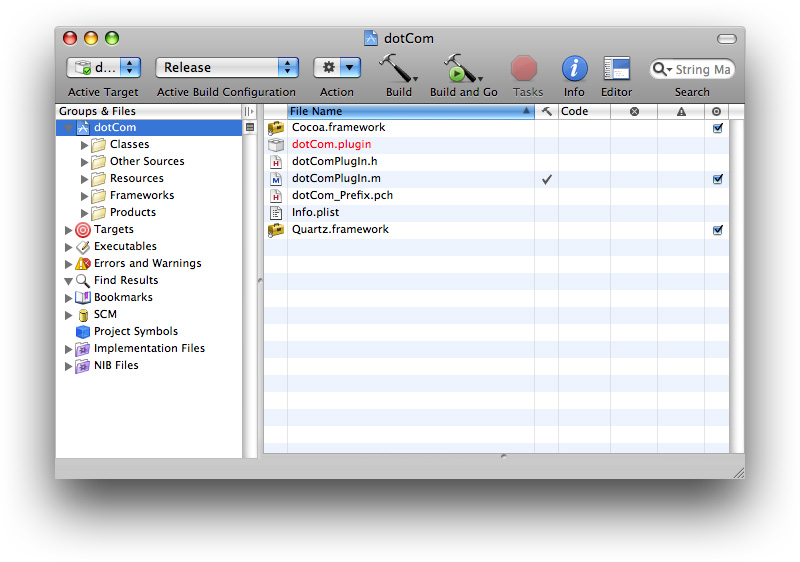
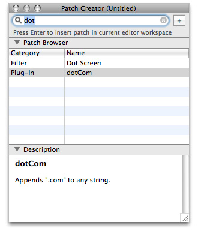
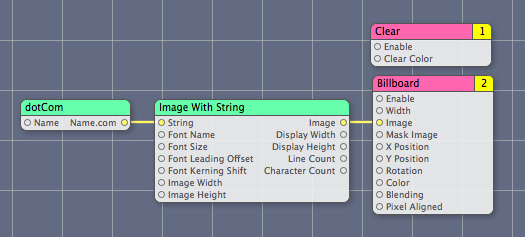
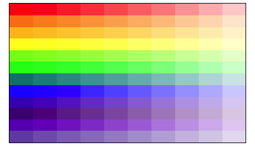
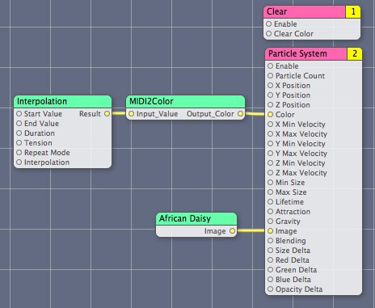
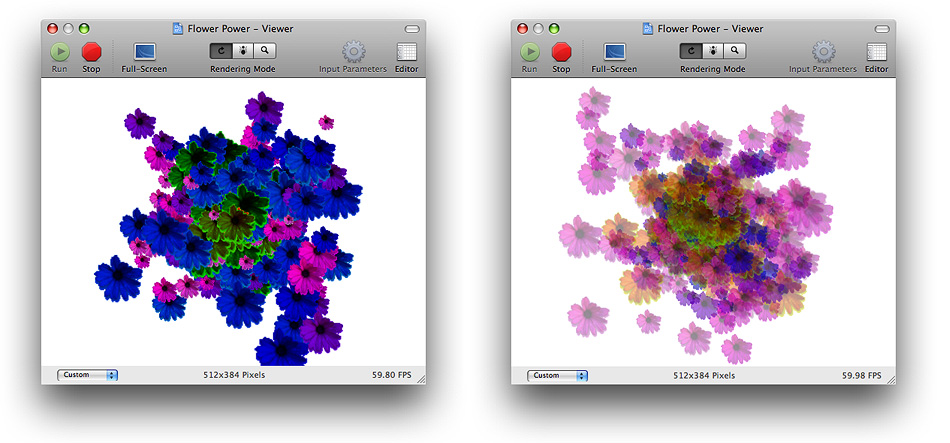
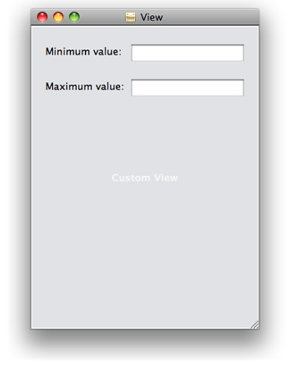
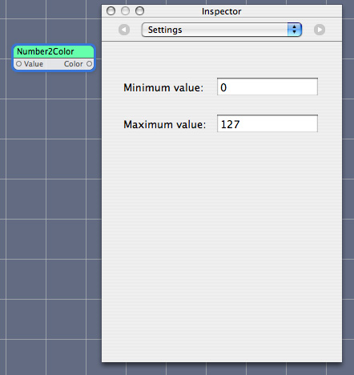

> 导航：[总目录](../../../README.md) · [documentation](../../../_indexes/documentation.md) · [Quartz Composer Custom Patch Programming Guide](Introduction%20to%20Quartz%20Composer%20Custom%20Patch%20Programming%20Guide.md)


[Next](Writing%20Image%20Processing%20Patches.md)[Previous](The%20Basics%20of%20Custom%20Patches.md)

# Writing Processor Patches

A custom processor patch is true to its name. It _processes_ data in response to changes in the values of its input parameters. This chapter shows how to write a custom patch that processes strings and another that processes numeric values. You’ll use Objective-C 2.0 properties to define the input and output parameters. Then you’ll see how to modify the numeric value processor so that it uses internal settings. By using the template provided in Xcode, you’ll package each custom patch as a plug-in that the Quartz Composer development tool can recognize. Any custom patch included in a plug-in shows up in the Quartz Composer Patch Creator.

The dotCom custom patch takes any string as input and appends `.com` to it. For example, if the input string is `patch` then the output string is `patch.com`. When packaged as a plug-in that’s loaded into the Quartz Composer development tool, the resulting custom patch looks like what’s shown in Figure 2-1. By creating this simple patch first, you’ll learn the critical parts of a custom patch and how to bundle them together.

__Figure 2-1__  The dotCom custom patch



Follow these steps to create the dotCom custom patch:

1. Open Xcode and choose File > New Project.
2. In the New Project window, choose Standard Apple Plug-ins > Quartz Composer Plug-in and click Next.
3. Enter `dotCom` in the Project Name text field and click Finish.

   The project opens with these files.

   
4. Open the `dotComPlugin.h` file.

   The plug-in template automatically subclasses [QCPlugIn](https://developer.apple.com/documentation/quartz/qcplugin). Declare two string properties to use as the input and output parameters. Recall that input parameter keys must start with `input` and output parameter keys must start with `output`. Your code should look as follows:


```objc
#import <Quartz/Quartz.h>

@interface dotComPlugIn : QCPlugIn
{
}
@property(assign) NSString* inputString;
@property(assign) NSString* outputString;
@end
```
5. Close the `dotComPlugIn.h` file.
6. Open the `dotComPlugIn.m` file.
7. Just after the `@implementation` statement, add the following directives so that Quartz Composer handles the implementation of the parameters.

```
@dynamic inputString, outputString;
```
8. Supply a description for the custom patch.

   This description is what the user will see in Quartz Composer. Modify the description to look as follows:

```
#define    kQCPlugIn_Description  @"Appends \".com\" to any string."
```

   Note that Xcode automatically defines the custom patch name based on the project name you supplied. In this case, the name is `dotCom`.

```
#define    kQCPlugIn_Name  @"dotCom"
```

   You can change the name if you’d like. This name shows up in the Patch Creator as the patch name. Although the name does not need to be unique, it’s best for the user if the patch name is both descriptive and unique.
9. Next you’ll write the methods needed to implement the `dotComPlugIn` subclass. You do not need to modify the default `attributes` method supplied in the template, which should look as follows:

```objc
+ (NSDictionary*) attributes
{
    return [NSDictionary dictionaryWithObjectsAndKeys:
                kQCPlugIn_Name,QCPlugInAttributeNameKey,
                kQCPlugIn_Description,QCPlugInAttributeDescriptionKey,
                nil];
}
```
10. Modify the [attributesForPropertyPortWithKey:](https://developer.apple.com/documentation/quartz/qcplugin/1488766-attributesforpropertyportwithkey) so that it returns a dictionary for each input and output parameter. Each dictionary must contain a value followed by its port attribute name key. If the port has a default value, the dictionary should contain the value followed by the default value key.

    The port attribute key name is what appears as a label for the custom patch port in Quartz Composer. Essentially what you are doing is mapping the [QCPlugIn](https://developer.apple.com/documentation/quartz/qcplugin) subclass parameter keys to custom patch port names. You’ll also want to define a reasonable default value.

    For the dotCom plug-in, modify the method so it looks as follows:

```objc
+ (NSDictionary*) attributesForPropertyPortWithKey:(NSString*)key
{
    if([key isEqualToString:@"inputString"])
        return [NSDictionary dictionaryWithObjectsAndKeys:
            @"Name", QCPortAttributeNameKey,
            @"mydomain",  QCPortAttributeDefaultValueKey,
            nil];
    if([key isEqualToString:@"outputString"])
        return [NSDictionary dictionaryWithObjectsAndKeys:
            @"Name.com", QCPortAttributeNameKey,
            nil];
    return nil;
}
```
11. Make sure the [executionMode](https://developer.apple.com/documentation/quartz/qcplugin/1488695-executionmode) method returns `kQCPlugInExecutionModeProcessor`.

    This is a processor patch—it takes input values, processes them, and outputs a value.

```objc
+ (QCPlugInExecutionMode) executionMode
{
    return kQCPlugInExecutionModeProcessor;
}
```
12. Make sure the [timeMode](https://developer.apple.com/documentation/quartz/qcplugin/1488805-timemode) method returns `kQCPlugInTimeModeNone`.

    The dotCom plug-in needs to execute only when the input string changes.

```objc
+ (QCPlugInTimeMode) timeMode
{
    return kQCPlugInTimeModeNone;
}
```
13. The execution method is where the processing takes place. For the dotCom custom patch, it is fairly straightforward. The method needs to append the string `.com` to whatever string it passed to the patch. The code should look as follows:

```objc
- (BOOL) execute:(id<QCPlugInContext>)context
            atTime:(NSTimeInterval)time
            withArguments:(NSDictionary*)arguments
{
    self.outputString = [self.inputString stringByAppendingString:@".com"];

    return YES;
}
```

    Note that you use `self.<propertyname>` to access property values. Recall that you can only read the values of input parameters, but you can read and write the values of output parameters.
14. Save and close the `dotComPlugIn.m` file.
15. Open the `Info.plist` file.

    Notice that Xcode automatically adds the following entry, which is required, in the dictionary.

```
<key>QCPlugInClasses</key>
<array>
    <string>dotComPlugIn</string>
</array>
```

    If you add another custom patch to the project, you need to add the name of the [QCPlugIn](https://developer.apple.com/documentation/quartz/qcplugin) subclass as an entry here. However, you don’t need to add anything for the dotCom custom patch.

    If you want, you can customize the bundle identifier before saving and closing the file.
16. Under Targets, choose Build & Copy. Then, click Build “Build & Copy” and Start from the Action pop-up menu.

    When you build using this option, Xcode copies the successfully built plug-in to `~/Library/Graphics/Quartz Composer Plug-Ins` and launches the Quartz Composer development tool.
17. After Quartz Composer launches, create a blank composition. Click Patch Creator and type `dot` in the Search field.

    
18. Double-click the dotCom name to create an instance in the Editor window. Then add instances of the Image With String, Clear, and Billboard patches to the editor window. Connect them as shown and make sure that the dotCom custom patch works as it should.

    

    The output in the Viewer should look like this:

    

MIDI (Musical Instrument Digital Interface) is a communication standard that allows electronic musical instruments to send signals to each other for the purpose of controlling, monitoring, and editing musical events (note on, note off, volume, synthesizer voice, and so on). The MIDI2Color custom patch that you’ll create in this section maps a numerical value, in the range of 0 to 127, to a color. Many MIDI values fall in the 0 to 127 range, such as MIDI note number and volume.

The idea behind the MIDI2Color custom patch is to map a particular pitch (C, C#/Db, D, D#/Eb,E, F, and so on) to a color and to map the octave that the pitch resides in to an alpha value. Low pitches produce the most opaque colors and high pitches produce the most transparent colors. In this way, you can create a composition that uses MIDI information to drive the colors used for graphical output. Figure 2-2 shows the spectrum of colors that the MIDI2Color custom patch produces. The lowest octaves are on the left, the highest on the right. The pitches range from C to B, starting at the bottom and increasing towards the top.

__Figure 2-2__  The spectrum of RGBA colors produced by the MIDI2Color custom patch



You’ll see that many of the steps needed to create the MIDI2Color custom patch are the same as those used to create the dotCom custom patch.

To create the MIDI2Color custom patch, follow these steps:

1. Open Xcode and choose File > New Project.
2. In the New Project window, choose Standard Apple Plug-ins > Quartz Composer Plug-in and click Next.
3. Enter `MIDI2Color` in the Project Name text field and click Finish.
4. Open the `MIDI2ColorPlugin.h` file.

   The Xcode template automatically subclasses [QCPlugIn](https://developer.apple.com/documentation/quartz/qcplugin). You need to add property declarations for an input parameter that is a numerical value and an output parameter that is a color. Recall from [Table 1-1](The%20Basics%20of%20Custom%20Patches.md#apple-f4xwc4dqnrsv64tfmyxwi33df52wszbpkridimbqga2doobxfvbuqmznknlte) that ports that take a numerical value are declared as properties whose data type is `double`. Ports that are for colors require a property whose data type is a [CGColorRef](https://developer.apple.com/documentation/coregraphics/cgcolor).

   You should also add an internal variable for a color space. Later, you’ll create a color space and save it in this variable to avoid creating and releasing the color space each time you need to output a different color. Although the color output by your custom patch may change, the color space remains the same for each instance of the patch.

   When you are done modifying the interface file, it should look as follows:

```objc
#import <Quartz/Quartz.h>

@interface MIDI2ColorPlugIn : QCPlugIn
{
    CGColorSpaceRef myColorSpace;
}
// Declare a property input port of type Index and with the key inputValue
@property NSUInteger inputValue;
// Declare a property input port of type "Color" and with the key outputColor
@property(assign) CGColorRef outputColor;
@end
```
5. Save and close the `MIDI2ColorPlugIn.h` file.
6. Open the `MIDI2ColorPlugin.m` file.
7. Just after the `@implementation` statement, add the following directives. Quartz Composer will handle their implementation.

```
@dynamic inputValue, outputColor;
```
8. Define a name and description for the custom patch.

   The name is already provided for you. You don’t need to change it. Modify the description as shown:

```
#define    kQCPlugIn_Name @"MIDI2Color"
#define    kQCPlugIn_Description  @"Converts a MIDI value to a color with transparency."
```
9. Next you’ll write the methods needed to implement the `MIDI2ColorPlugIn` subclass, starting with the `attributes` method. The implementation provided by the template should look as follows and doesn’t need any modification:

```objc
+ (NSDictionary*) attributes
{
    return [NSDictionary dictionaryWithObjectsAndKeys:
                kQCPlugIn_Name,QCPlugInAttributeNameKey,
                kQCPlugIn_Description,QCPlugInAttributeDescriptionKey,
                nil];
}
```
10. Modify the [attributesForPropertyPortWithKey:](https://developer.apple.com/documentation/quartz/qcplugin/1488766-attributesforpropertyportwithkey) so that it returns a dictionary for each input and output parameter. Each dictionary must contain a value followed by its port attribute name key. If the port has a default value, the dictionary should contain the value followed by the default value key.

    If the input values need to be within a certain range, you should provide maximum and minimum values. MIDI values should range from 0 to 127, inclusive, so this example provides an opportunity for you to add these values.

    For the MIDI2Color plug-in, modify the method so it looks as follows.

```objc
+ (NSDictionary*) attributesForPropertyPortWithKey:(NSString*)key
{
    if([key isEqualToString:@"inputValue"])
        return [NSDictionary dictionaryWithObjectsAndKeys:
            @"Input Value", QCPortAttributeNameKey,
            [NSNumber numberWithUnsignedInteger:64],  QCPortAttributeDefaultValueKey,
            [NSNumber numberWithUnsignedInteger:127],  QCPortAttributeMaximumValueKey,
            [NSNumber numberWithUnsignedInteger:0],  QCPortAttributeMinimumValueKey,
            nil];
    if([key isEqualToString:@"outputColor"])
        return [NSDictionary dictionaryWithObjectsAndKeys:
            @"Output Color", QCPortAttributeNameKey,
            nil];
    return nil;
}
```
11. Make sure the [executionMode](https://developer.apple.com/documentation/quartz/qcplugin/1488695-executionmode) method returns `kQCPlugInExecutionModeProcessor`

```objc
+ (QCPlugInExecutionMode) executionMode
{
    return kQCPlugInExecutionModeProcessor;
}
```
12. Make sure the [timeMode](https://developer.apple.com/documentation/quartz/qcplugin/1488805-timemode) method returns `kQCPlugInTimeModeNone`.

    The MIDI2Color custom patch needs to execute only when the input value changes; it does not depend on time.

```objc
+ (QCPlugInTimeMode) timeMode
{
    return kQCPlugInTimeModeNone;
}
```
13. Modify the `startExecution:` method to create a color space object.

    For this example, you can use the `startExecution:` method to create and initialize a Quartz color space. The color space should remain the same throughout the life of the custom patch instance. You’ll create the color space when the patch starts executing, store it in the `colorSpace` instance variable you created previously, and then release it when the custom patch instance is no longer executing.

```objc
- (BOOL) startExecution:(id<QCPlugInContext>)context
{
   myColorSpace = CGColorSpaceCreateWithName(kCGColorSpaceGenericRGB);
   return YES;
}
```
14. Modify the `stopExecution:` method to release the color space object.

```objc
- (void) stopExecution:(id<QCPlugInContext>)context
{
    CGColorSpaceRelease(myColorSpace);
}
```
15. Write the execution method for the MIDI2Color custom patch.

    The method converts a value that’s in the range of 0 to 127 to an RGBA color (red, green, blue, alpha). First, the code figures out which octave the input value resides in. Then it finds out which pitch class the value represents. The RGB color values are determined by the pitch class, while the alpha value is determined by the octave. The lower the octave, the more opaque the color.

    Modify the `execute:atTime:withArguments:` method to look as follows:

```objc
- (BOOL) execute:(id<QCPlugInContext>)context
            atTime:(NSTimeInterval)time
            withArguments:(NSDictionary*)arguments
{
    static float color[4];

    // Use a Quartz color
    CGColorRef myColor;
    int pitch, octave;
    float alpha;
    octave = floor(self.inputValue/12);
    pitch = (int) (self.inputValue - (octave * 12));

    // Set the RGB values according to pitch: C, C#/Db, D, E, and so on
    switch (pitch) {
        case 0: color[0] = 1.0; color[1] = 0.0; color[2] = 0.0; break; // C
        case 1: color[0] = 1.0; color[1] = 0.5; color[2] = 0.0; break; // C#/Db
        case 2: color[0] = 1.0; color[1] = 0.75; color[2] = 0.0; break; // D
        case 3: color[0] = 1.0; color[1] = 1.0; color[2] = 0.0; break; //D#/Eb
        case 4: color[0] = 0.5; color[1] = 1.0; color[2] = 0.0; break; //E
        case 5: color[0] = 0.0; color[1] = 1.0; color[2] = 0.0; break; //F
        case 6: color[0] = 0.0; color[1] = 0.5; color[2] = 0.5; break; //F#/Gb
        case 7: color[0] = 0.0; color[1] = 0.0; color[2] = 1.0; break; //G
        case 8: color[0] = 0.25; color[1] = 0.0; color[2] = 0.75; break; //G#/Ab
        case 9: color[0] = 0.3; color[1] = 0.0; color[2] = 0.5; break; // A
        case 10: color[0] = 0.4; color[1] = 0.0; color[2] = 0.75; break; //A#/Bb
        case 11: color[0] = 0.5; color[1] = 0.0; color[2] = 1.0; break;// B
        default: color[0] = 0.5; color[1] = 0.5; color[2] = 0.5;
    }
    // Set the alpha value, based on octave
    alpha = 1.0 - ((float)octave/11.0);
    color[3] = alpha;
    // Create a Quartz color object using the previously created color space
    myColor = CGColorCreate(myColorSpace, color);
    // Set the color on the output (this also retains the color)
    self.outputColor = myColor;
    // Release the color object since it is now stored in the output parameter
    CGColorRelease(myColor);
    return YES;
}
```

    Save and close the `MIDI2ColorPlugIn.m` file.
16. Open the `Info.plist` file and make sure the following key is an entry in the dictionary:

```
<key>QCPlugInClasses</key>
<array>
    <string>MIDI2ColorPlugIn</string>
</array>
```

    If you want, customize the bundle identifier, then save and close the file.
17. Under Targets, choose Build & Copy. Then, click Build Build & Copy from the Action pop-up menu.

    When you build using this option, Xcode copies the successfully built plug-in to `~/Library/Graphics/Quartz Composer Plug-Ins`.
18. Open the Quartz Composer development environment and search for the MIDI2Color custom patch in the Patch Creator.
19. Make sure the MIDI2Color patch works by creating a composition that uses it.

    You can use an interpolation patch to provide values that include the 0 to 127 range. It’s best to extend the range to make sure the edge cases are processed correctly. Set the start and end value of the interpolation patch to -20 and 150, respectively. Then set the repeat mode to Mirrored Loop and the duration to 25 or higher. Connect the output port of the interpolation patch to the input port of the MIDI2Color patch. After setting up a Clear patch, drag a Particle System patch to the editor and connect the output of the MIDI2Color patch to the Color port of the Particle System patch.

    Drag an image directly to the editor widow. Then connect the image output port to the Image input port of the Particle System patch. (If you don’t have any images readily available, you might choose one of the images located in `~Pictures/iChat Icons/Flowers`.) Your test application should look similar to this:

    

    You might want to make a few adjustments to the input parameters of the Particle System patch to get a result that is aesthetically pleasing to you, but you don’t need to. Because the images produced by the Particle System have a lifetime, you’ll be able to more easily see the colors and observe not only how the hues change but how the opacity changes.

    

The MIDI2Color custom patch has a major shortcoming; it processes input values that are in the range of 0 to 127. Although MIDI electronic instruments use those values to designate pitch and other aspects of music, many of the built-in Quartz Composer MIDI custom patches provide normalized output values (`0.0` to `1.0`) instead of raw MIDI values. In addition, the MIDI2Color patch can operate on any numerical values, not just those provided by MIDI, as you saw with the test composition that used the Interpolation patch. Its use does not need to be restricted to MIDI input, so a name change is in order.

In this section you’ll see how to improve the MIDI2Color patch by writing a similar custom patch that accepts any range of values. You’ll add two parameters that will be available on the Settings pane of the inspector for the patch so that the user can set the range. You’ll write an execution method that maps any range of values to over ten “octaves” of "pitch” values. You’ll name the patch Number2Color to indicate that the patch can be used for any numeric value.

Follow these steps to create a Number2Color patch:

1. Open Xcode and choose File > New Project.
2. In the New Project window, choose Standard Apple Plug-ins > Quartz Composer Plug-in for Objective C With Internal Settings And User Interface. Then click click Next.

   This template provides the nib file that you’ll modify for the user interface of the Settings pane.
3. Enter `Number2Color` in the Project Name text field and click Finish.
4. Open the `Number2ColorPlugin.h` file.

   Modify the interface file so that it has two dynamic Objective-C properties and two instance variable properties. The dynamic Objective-C properties—`inputValue` and `outputColor`—are the input and output parameters for the input and output ports of the patch. The instance variable properties—`minValue` and `maxValue`—are the internal parameters that will be available on the Settings pane in the inspector for the patch. You also need to add a variable to keep track of the color space, just as you did for the MIDI2Color custom patch.

```objc
#import <Quartz/Quartz.h>

@interface Number2ColorPlugIn : QCPlugIn
{
   CGColorSpaceRef myColorSpace;

}
// Declare a property input port of type Number and with the key inputValue
@property double inputValue;
// Declare a property input port of type Color and with the key outputColor
@property CGColorRef outputColor;

// Declare internal settings as properties of type double
@property double minValue;
@property double maxValue;
@end
```
5. Save and close the `Number2ColorPlugIn.h` file.
6. Open the `Number2ColorPlugin.m` file.
7. Just after the `@implementation` statement, add the following directives. Quartz Composer will handle their implementation.

```objc
@dynamic inputValue, outputColor;
@synthesize minValue, maxValue;
```
8. Add a description for the custom patch by modifying the appropriate `#define` statement.

```
#define    kQCPlugIn_Name @"Number2Color"
#define    kQCPlugIn_Description  @"Converts a value to a color with transparency. You can define a range of values to use for the color mapping."
```
9. Next you’ll write the methods needed to implement the `Number2ColorPlugIn` subclass. The [attributes](https://developer.apple.com/documentation/quartz/qcplugin/1488869-attributes) method should already look as follows:

```objc
+ (NSDictionary*) attributes
{
    return [NSDictionary dictionaryWithObjectsAndKeys:
                kQCPlugIn_Name,QCPlugInAttributeNameKey,
                kQCPlugIn_Description,QCPlugInAttributeDescriptionKey,
                nil];
}
```
10. Modify the [attributesForPropertyPortWithKey:](https://developer.apple.com/documentation/quartz/qcplugin/1488766-attributesforpropertyportwithkey) so that it returns a dictionary for each input and output parameter. Do not include the `maxValue` and `minValue` properties here. These require different setup work because those are patch settings, not input parameters.

    The method should look as follows:

```objc
+ (NSDictionary*) attributesForPropertyPortWithKey:(NSString*)key
{
    if([key isEqualToString:@"inputValue"])
        return [NSDictionary dictionaryWithObjectsAndKeys:
            @"Value", QCPortAttributeNameKey,
            [NSNumber numberWithUnsignedInteger:64],  QCPortAttributeDefaultValueKey,
            nil];
    if([key isEqualToString:@"outputColor"])
        return [NSDictionary dictionaryWithObjectsAndKeys:
            @"Color", QCPortAttributeNameKey,
            nil];
    return nil;
}
```
11. Make sure the [executionMode](https://developer.apple.com/documentation/quartz/qcplugin/1488695-executionmode) method returns `kQCPlugInExecutionModeProcessor`.

```objc
+ (QCPlugInExecutionMode) executionMode
{
    return kQCPlugInExecutionModeProcessor;
}
```
12. Make sure the [timeMode](https://developer.apple.com/documentation/quartz/qcplugin/1488805-timemode) method returns `kQCPlugInTimeModeNone`.

    Similar to MIDI2Color, the Number2Color plug-in executes only when the input value changes; it does not depend on time.

```objc
+ (QCPlugInTimeMode) timeMode
{
    return kQCPlugInTimeModeNone;
}
```
13. Next you’ll implement methods that are required when you use internal parameters. First you need to write an `init` method to set the initial values of the `minValue` and `maxValue` parameters to a default value.

```
 (id) init
{
    self = [super init];
    if (self) {
        self.minValue = 0.0;
        self.maxValue = 127.0;
    }

    return self;
}
```
14. Write a `dealloc` method. If any of the internal parameters are objects, such as a color, you would release the object in this method (for example `self.foo = nil;`). But because none of the internal parameters are objects, the `dealloc` method provided by the template is okay as is.

```objc
- (void) dealloc
{
    [super dealloc];
}
```
15. Implement the [plugInKeys](https://developer.apple.com/documentation/quartz/qcplugin/1488790-pluginkeys) method so that it returns the keys that represent the internal parameters for the plug-in. This list is used to serialize the settings automatically. It’s also used by the [QCPlugInViewController](https://developer.apple.com/documentation/quartz/qcpluginviewcontroller) object to allow editing the values for these keys in the user interface. Make sure that you terminate the list with `nil`.

```objc
+ (NSArray*) plugInKeys
{
    return [NSArray arrayWithObjects:@"minValue", @"maxValue", nil];
}
```
16. Provide a [createViewController](https://developer.apple.com/documentation/quartz/qcplugin/1504984-createviewcontroller) method so that you can provide support in the user interface for viewing and setting the internal parameters. The `viewNibName` string must match the name of the nib file.

    This method is is already included as part of the template. It should look like this:

```objc
- (QCPlugInViewController*) createViewController
{
    return [[QCPlugInViewController alloc]
            initWithPlugIn:self
            viewNibName:@"Number2ColorSettings"];
}
```
17. Modify the `startExecution:` method to create a color space object.

    For this example, you can use the `startExecution:` method to create and initialize a Quartz color space. The color space should remain the same throughout the life of the custom patch instance. You’ll create the color space when the patch starts to execute, store it in the instance variable you created previously, and then release the color space when the custom patch instance is no longer executing.

```objc
- (BOOL) startExecution:(id<QCPlugInContext>)context
{
   myColorSpace = CGColorSpaceCreateWithName(kCGColorSpaceGenericRGB);
   return YES;
}
```
18. Modify the `stopExecution:` method to release the color space object.

```objc
- (void) stopExecution:(id<QCPlugInContext>)context
{
   CGColorSpaceRelease(myColorSpace);
}
```
19. Implement the execution method. Similar to the MIDI2Color plug-in, this is where the processing takes place. You’ll notice that the Number2Color execution method is similar to the MIDI2Color execution method except that Number2Color uses the minimum and maximum values to map the input value to the specified range.

```objc
- (BOOL) execute:(id<QCPlugInContext>)context
            atTime:(NSTimeInterval)time
            withArguments:(NSDictionary*)arguments
{
    static float color[4];

    CGColorRef myColor;
    int pitch, octave;
    double convertedInputValue;
    float alpha;

    // Make sure there is a range of values
    if (self.maxValue == self.minValue)
        // If not, execution fails.
        return NO;
    // Use the internal settings to scale the input value
    convertedInputValue = (self.inputValue - self.minValue)/(self.maxValue - self.minValue) * 127.0);
    // The remaining code is the same as that used for MIDI2Color
    octave = floor(convertedInputValue/12);
    pitch = (int) (convertedInputValue - (octave * 12));

    switch (pitch) {
        case 0: color[0] = 1.0; color[1] = 0.0; color[2] = 0.0; break;
        case 1: color[0] = 1.0; color[1] = 0.5; color[2] = 0.0; break;
        case 2: color[0] = 1.0; color[1] = 0.75; color[2] = 0.0; break;
        case 3: color[0] = 1.0; color[1] = 1.0; color[2] = 0.0; break;
        case 4: color[0] = 0.5; color[1] = 1.0; color[2] = 0.0; break;
        case 5: color[0] = 0.0; color[1] = 1.0; color[2] = 0.0; break;
        case 6: color[0] = 0.0; color[1] = 0.5; color[2] = 0.5; break;
        case 7: color[0] = 0.0; color[1] = 0.0; color[2] = 1.0; break;
        case 8: color[0] = 0.25; color[1] = 0.0; color[2] = 0.75; break;
        case 9: color[0] = 0.3; color[1] = 0.0; color[2] = 0.5; break;
        case 10: color[0] = 0.4; color[1] = 0.0; color[2] = 0.75; break;
        case 11: color[0] = 0.5; color[1] = 0.0; color[2] = 1.0; break;
        default: color[0] = 0.5; color[1] = 0.5; color[2] = 0.5;
    }
    alpha = 1.0 - ((float)octave/11.0);
    color[3] = alpha;
    myColor = CGColorCreate(myColorSpace, color);
    self.outputColor = myColor;
    CGColorRelease(myColor);
    return YES;
}
```
20. Open the `Info.plist` file and make sure the following key is an entry in the dictionary:

```
<key>QCPlugInClasses</key>
<array>
    <string>Number2ColorPlugIn</string>
</array>
```

    If you want, customize the bundle identifier, then save and close the file.
21. Next you’ll use Interface Builder to create the user interface for the Settings pane.
22. Double click `Number2ColorSettings.nib`.

    Interface Builder launches with a View window.
23. Drag a Text Field (`NSTextField`) from the Library to the View window.
24. Drag a Label from the Library, place it next to the text field, and label it `Minimum value:`.
25. With the text field selected, open the Bindings inspector.
26. Click the disclosure triangle next to Value, click “Bind to”, and choose File’s Owner.
27. Enter `plugIn.minValue` in the Model Key Path text field.

    Recall that the model key path is `plugIn.XXX`, where `XXX` is the corresponding key for the internal setting.
28. Drag a text field to the view.
29. Drag a label next to the text field and label it `Maximum value:`.

    The user interface should now look like this:

    
30. With the text field selection, open the Bindings inspector.
31. Bind the text field to the File’s owner and enter `plugIn.maxValue` as the Model Key Path.
32. Control-drag from File’s Owner icon in the Nib document window to the view. Then click `view` in the heads-up display that appears.
33. Save the file and quit Interface Builder.
34. Under Targets, choose Build & Copy. Then, click Build “Build & Copy” from the Action pop-up menu.

    When you build using this option, Xcode copies the successfully built plug-in to `~/Library/Graphics/Quartz Composer Plug-Ins`.
35. Open the Quartz Composer development and search for the Number2Color custom patch in the Patch Creator.
36. Drag the patch to the editor. Then open the inspector to the Settings pane. The pane should look similar to the following.

    
37. Test the composition with a variety of ranges of input values.

Although, for testing purposes, you might want to develop each custom patch separately, you can combine several patches into one plug-in when you are ready to distribute the patches. This section shows you how to package the MIDI2Color and Number2Color custom patches together. First you’ll add the files for the MIDI2Color custom patch to the Number2Color project. Then you’ll modify the property list file to include the `MIDI2ColorPlugIn` class.

1. Open the Number2Color Xcode project.
2. Choose Project > Add to Project.
3. Navigate to the MIDI2ColorPlugin.h and MIDI2ColorPlugin.m files, select them, and click Add.
4. In the sheet that appears, click Add.

   Make sure that the Number2Color target is selected.
5. Open the `Info.plist` file.
6. Enter the `MIDI2ColorPlugIn` class so that the `QCPlugInClasses` entry looks like this:

```
<key>QCPlugInClasses</key>
<array>
  <string>Number2ColorPlugIn</string>
  <string>MIDI2ColorPlugIn</string>
</array>
```
7. Save the project.
8. Under Targets, choose Build & Copy. Then, click Build Build & Copy from the Action pop-up menu.

After following these instructions, the name of the plug-in remains Number2Color. You might want to rename it to MyColorGenerators or some other name that indicates the plug-in contains more than one custom patch. If you want, you can add additional custom patches to the plug-in.

[Next](Writing%20Image%20Processing%20Patches.md)[Previous](The%20Basics%20of%20Custom%20Patches.md)

