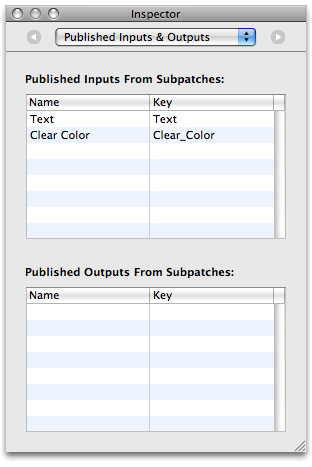

> 导航：[总目录](../../../README.md) · [documentation](../../../_indexes/documentation.md) · [Quartz Composer Programming Guide](Introduction%20to%20Quartz%20Composer%20Programming%20Guide.md)

[Next](Using%20the%20QCRenderer%20Class%20to%20Play%20a%20Composition.md)[Previous](Using%20QCView%20to%20Create%20a%20Standalone%20Composition.md)

# Publishing Ports and Binding Them to Controls

Any input or output port in a composition can be controlled through the use of Cocoa bindings by publishing the ports that you want to control. This chapter shows how to publish ports in a composition and then add controls to the user interface. When you make changes to the controls in Interface Builder, the changed values pass to the appropriate input ports that are in the composition.

Perform these tasks to publish ports and bind them to controls:

1. [Publishing Ports](#apple-f4xwc4dqnrsv64tfmyxwi33df52wszbpkridimbqgaytgnjxfvbuqmrqhawueqkkjbdekqsd)
2. [Setting Up a Patch Controller](#apple-f4xwc4dqnrsv64tfmyxwi33df52wszbpkridimbqgaytgnjxfvbuqmrqhawugsscizcegssd)
3. [Binding Controls to Input Ports](#apple-f4xwc4dqnrsv64tfmyxwi33df52wszbpkridimbqgaytgnjxfvbuqmrqhawueqkki5cusq2i)

You’ll revise the MacEngraving composition provided with OS X v10.5 so that it has two published input ports at the root macro patch level—one that controls the clear color and the other that controls the text shown on the computer.

1. Open the MacEngraving composition located in `Developer/Examples/Quartz Compositions/Interface Builder`.

   Notice that the `“Text”` input port of the Image With String patch is gray, to indicate that this port is already published.
2. Control-click the Clear Color input port on the Clear patch and choose Published Inputs > Clear Color. Then press Return.

   Notice that the Clear Color input port appears gray to indicate that it is published.
3. In the Viewer window, click Input Parameters.

   The Text and Clear Color input ports appear as a sheet in the Viewer window. When you change the text and the clear color, you immediately see the results in the View window.
4. Click the workspace to make sure that no patches are selected. Then open the Inspector to the Published Inputs & Outputs pane.

   You should see the Text and Clear Color input port names and the key assigned to each. The key for the Text input port is `text`. The key for the Clear Color input port is `Clear_Color`. Make note of these, because you must use these keys in Interface Builder to set up the bindings. The keys you supply in Interface Builder must match exactly what you see in this pane; keys are case-sensitive.

   
5. Save the composition and quit Quartz Composer.

The `QCPatchController` class establishes Cocoa bindings between the user interface controls and a composition. In the Cocoa model-view-controller (MVC) paradigm, `QCPatchController` acts as a controller between a composition (which is the model) and a [QCView](https://developer.apple.com/documentation/quartz/qcview) (which is the view). For more information on the MVC paradigm, see _Cocoa Application Tutorial_.

Follow these steps to set up a patch controller:

1. Launch Interface Builder and choose a Cocoa Window template.
2. Drag a Quartz Composer View from the Quartz Composer objects in the Library to the window.

   If you don’t see Quartz Composer as an entry in the Library, you may need to add the Quartz Composer plug-in. See [Add the Quartz Composer Plug-in](Using%20QCView%20to%20Create%20a%20Standalone%20Composition.md#apple-f4xwc4dqnrsv64tfmyxwi33df52wszbpkridimbqgaytgnjxfvbuqmrqg4wvgvzr).
3. Drag a Quartz Composer Patch Controller (`QCPatchController` instance) from Library to the Nib document window.
4. Select the patch controller and open the Attributes inspector.
5. Click “Load from Composition File” and choose the MacEngraving composition you modified in the previous section.
6. Select the [QCView](https://developer.apple.com/documentation/quartz/qcview) and then open the Bindings inspector.
7. Click the disclosure triangle next to “Patch.”
8. Choose Patch Controller from the “Bind to” pop-up menu.
9. Enter `patch` in the Controller Key text field to bind the `patch` property to the `patch` key of the QCPatchController.

   This binds the `QCView` to the composition that’s loaded in the `QCPatchController` so that the `QCView` renders this composition.
10. Choose File > Simulate Interface.

    The engraved computer appears in the window.
11. Quit the interface test application.

In the next section you’ll add controls to the interface and set up bindings between them and the inputs of the composition root macro patch.

This section adds a color well and text field to the interface and binds them to the Clear Color and Power input ports published from the MacEngraving composition. (For information on color wells, see [Choosing Colors With Color Wells and Color Panels](https://developer.apple.com/library/archive/documentation/Cocoa/Conceptual/DrawColor/Tasks/ChoosingColors.html#//apple_ref/doc/uid/20000791).)

1. Drag a Text Field from the Library to the window.

   The easiest way to locate the field is to type `text` in the Search field of the Library.
2. Place the control below the `QCView`, on the left side.
3. Resize the text field to so it is half the width of the window.
4. With the text field selected, open the Bindings inspector and click the disclosure triangle next to Value.
5. Click “Bind to” and then choose Patch Controller in the “Bind to” popup menu.
6. Enter `patch` in the Controller Key text field.
7. Enter `text.value` in the Model Key Path text field.

   This binds the text field to the text input parameter of the composition that’s loaded in the `QCPatchController`. You retrieve the value on the port itself by appending `.value` to its unique key.

   Note that keys are case sensitive, so the Model Key Path field must reflect exactly the key listed in the Published Inputs & Outputs pane of the Inspector in the composition for that port. Recall that the key for the Text input port is `text`.
8. Drag a color well control ([NSColorWell](https://developer.apple.com/documentation/appkit/nscolorwell) instance) from the Library to the window.
9. Place the control below the right side of `QCView`, using the guides to align the color well properly in the window.
10. With the color well selected, open the Bindings inspector and click the disclosure triangle next to Value.
11. Click “Bind to” and then choose Patch Controller in the “Bind to” popup menu.
12. Enter `patch` in the Controller key text field.
13. Enter `Clear_Color.value` in the Model Key Path text field.

    Recall that the key for the Clear Color input port is `Clear_Color`. The Model Key Path field must reflect exactly what’s specified in the composition for that port.

    This binds the color well to the clear color input parameter of the composition that’s loaded in the `QCPatchController`. You retrieve the value on the port itself by appending `.value` to its unique key.
14. Choose File > Simulate Interface.
15. Enter text in the text field. Then click the color well control and change the background color.

    The rendered view changes as the settings change.

- `/Developer/Examples/Quartz Composer Compositions/Interface Builder Compositions` contains other examples of nib files that bind controls in Interface Builder to input ports in a composition. You may want to look at these files before you bind controls to your own composition.
- _[Cocoa Bindings Programming Topics](../../Cocoa/Cocoa%20Bindings%20Programming%20Topics/Introduction%20to%20Cocoa%20Bindings%20Programming%20Topics.md#apple-f4xwc4dqnrsv64tfmyxwi33df52wszbpgeydambqge3do2i)_ contains more details and provides pointers to additional information.

[Next](Using%20the%20QCRenderer%20Class%20to%20Play%20a%20Composition.md)[Previous](Using%20QCView%20to%20Create%20a%20Standalone%20Composition.md)

